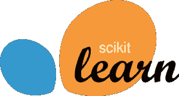

# 2021 年你应该学习的 12 大人工智能工具和框架

> 原文：<https://medium.com/edureka/top-artificial-intelligence-tools-36418e47bf2a?source=collection_archive---------2----------------------->

AI Tools & Frameworks — Edureka

人工智能促进了大量数据的处理及其在行业中的使用。数据科学家和开发人员可用的工具和框架的数量随着 AI 和 ML 的增长而增加。这篇关于人工智能工具和框架的文章将按以下顺序列出其中一些:

*   人工智能工具和框架
*   人工智能工具和框架列表

1.  Scikit 学习
2.  张量流
3.  Theano
4.  咖啡
5.  MxNet
6.  克拉斯
7.  PyTorch
8.  CNTK
9.  自动 ML
10.  OpenNN
11.  H20:开源人工智能平台
12.  谷歌 ML 工具包

# 人工智能工具和框架

神经网络的开发是一个漫长的过程，需要在架构背后进行大量的思考，以及实际构成系统的一大堆细微差别。

这些细微差别很容易变得令人不知所措，而且不是所有的事情都容易被跟踪。因此，出现了对这种工具的需求，人类处理主要的架构决策，将其他优化任务留给这种工具。想象一个只有 4 个可能的布尔超参数的架构，测试所有可能的组合需要 4 个！跑步。对同一个架构重新训练 24 次，绝对不是对时间和精力的最佳利用。

此外，大多数较新的算法包含一大堆超参数。这就是新工具出现的地方。这些工具不仅有助于开发，还能优化这些网络。

# 人工智能工具和框架列表

从人类诞生之日起，我们作为一个物种就一直在试图制造一些东西来帮助我们完成日常任务。从石器到现代机械，再到帮助我们日常生活的程序开发工具。一些最重要的工具和框架是:

*   Scikit 学习
*   张量流
*   Theano
*   咖啡
*   MxNet
*   克拉斯
*   PyTorch
*   CNTK
*   自动 ML
*   OpenNN
*   H20:开源人工智能平台
*   谷歌 ML 工具包

# Scikit 学习

Scikit-learn 是最著名的 ML 库之一。它是许多管理和非监督学习计算的基础。先例包括直接和计算复发，选择树，群聚，k-暗示等。

*   它扩展了 Python 的两个基本库，NumPy 和 SciPy。
*   它包括许多常规人工智能和数据挖掘任务的计算，包括群聚、复发和顺序。事实上，即使像改变信息、特征确定和集成技术这样的任务也可以在几行代码中完成。
*   对于一个 ML 新手来说，Scikit-learn 是一个绰绰有余的工具，直到你开始实现逐渐复杂的计算。

# 张量流

如果你在人工智能领域，你很可能已经发现、尝试或执行了某种深刻的学习计算。说它们是必不可少的准确吗？不是经常。如果做对了，说它们很酷准确吗？真的！

Tensorflow 的迷人之处在于，当你用 Python 编写一个程序时，你可以在你的 CPU 或 GPU 上安排并保持运行。所以你不需要在 C++或者 CUDA 级别进行编写就可以在 GPU 上保持运行。

它利用多层枢纽的安排，使您能够快速设置、训练和发送具有巨大数据集的假冒神经系统。这使得谷歌能够识别照片中的问题，或者理解其语音确认应用程序中口头表达的词语。

# Theano

Theano 非常好地折叠在 Keras 之上，Keras 是一个异常状态神经系统库，它几乎与 Theano 库并行运行。Keras 的基本优势在于，它是一个用于深度发现的适度的 Python 库，可以持续运行在 ano 或 TensorFlow 之上。

*   它的创建是为了使深入学习模型的实现对创新工作来说既快速又简单可行。
*   它在 Python 2.7 或 3.5 上保持运行，并且可以在 GPU 和 CPU 上一致地执行。

让 Theano 与众不同的是，它利用了 PC 的 GPU。这使它能够使信息升级计数比单独在 CPU 上运行时快好几倍。Theano 的速度使得它对于深度学习和其他计算复杂的任务特别有利可图。

# 咖啡

“咖啡”是一个深刻的学习结构，以清晰度、速度和测量质量为首要任务。它是由伯克利视觉和学习中心(BVLC)和网络捐助者创建的。Google 的 DeepDream 依赖于 Caffe 框架。这个结构是 BSD 授权的 C++库，带有 Python 接口。

# MxNet

它允许通过“健忘反向投影”来交换计算时间和内存，这对于很长序列上的递归网络非常有用。

*   构建时考虑了可扩展性(对多 GPU 和多机器训练的相当易用的支持)。
*   很多很酷的特性，比如用高级语言轻松编写自定义层
*   与几乎所有其他主要框架不同，它不是由大公司直接管理的，这对于一个开源的、社区开发的框架来说是一种健康的状态。
*   TVM 支持，这将进一步改进部署支持，并允许在一系列新设备类型上运行

# 克拉斯

如果你喜欢 Python 式的做事方式，Keras 适合你。它是神经网络的高级库，使用 TensorFlow 或 Theano 作为其后端。

大多数实际问题更像是:

*   选择适合某个问题的架构，
*   对于图像识别问题——使用在 ImageNet 上训练的权重，
*   配置网络以优化结果(一个漫长的迭代过程)。

在所有这些中，Keras 是一颗宝石。此外，它提供了一个抽象的结构，如果需要的话，可以很容易地转换成其他框架(为了兼容性、性能或其他)。

# PyTorch

PyTorch 是脸书发明的人工智能系统。它的代码可以在 GitHub 上获得，目前已经有超过 22k 的 stars。自 2017 年以来，它一直在收集大量能量，并处于无情的接收发展中。

# CNTK

CNTK 允许用户轻松实现和组合流行的模型类型，如前馈 DNNs、卷积网络(CNN)和递归网络(RNNs/lstm)。它通过跨多个 GPU 和服务器的自动微分和并行化来实现随机梯度下降(SGD，误差反向传播)学习。在开源许可下，任何人都可以试用 CNTK。

# 自动 ML

在上面列出的所有工具和库中，Auto ML 可能是最强的工具之一，也是机器学习工程师可用的工具库中最近增加的一个。

正如引言中所述，优化是机器学习任务的本质。虽然从中获得的利益是有利可图的，但成功确定最佳超参数并非易事。在像神经网络这样的黑盒中尤其如此，其中随着网络深度的增加，确定重要的事情变得越来越困难。

因此，我们进入了一个新的元领域，其中软件帮助构建软件。AutoML 是一个库，许多机器学习工程师使用它来优化他们的模型。

除了明显节省的时间之外，这对于在机器学习领域没有很多经验，因此缺乏直觉或过去经验来自己进行某些超参数改变的人来说也是非常有用的。

# OpenNN

从对初学者完全友好的东西跳到对有经验的开发者有意义的东西，OpenNN 提供了一个高级分析的武器库。

它有一个工具，高级分析的神经设计器，提供图形和表格来解释数据条目。

# H20:开源人工智能平台

H20 是一个开源的深度学习平台。这是一个面向业务的人工智能工具，帮助他们从数据中做出决策，并使用户能够获得洞察力。它有两个开源版本:一个是标准版 H2O，另一个是付费版苏打水。它可用于预测建模、风险和欺诈分析、保险分析、广告技术、医疗保健和客户智能。

# 谷歌 ML 工具包

Google ML Kit 是 Google 面向移动开发者的机器学习测试版 SDK，旨在让开发者能够在 Android 和 IOS 手机上构建个性化功能。

该套件允许开发人员将机器学习技术嵌入在设备或云中运行的基于应用的 API 中。这些功能包括人脸和文本识别、条形码扫描、图像标签等。

在内置 API 可能不适合用例的情况下，开发人员也可以构建自己的 TensorFlow Lite 模型。说到这里，我们的文章就到此为止了。这些是作为数据科学家和工程师解决现实问题的平台的一些工具，这些工具将使底层架构变得更好、更健壮。如果你想查看更多关于人工智能、DevOps、道德黑客等市场最热门技术的文章，你可以参考 Edureka 的官方网站。

请留意本系列中的其他文章，它们将解释深度学习的各个其他方面。

> 1. [TensorFlow 教程](/edureka/tensorflow-tutorial-ba142ae96bca)
> 
> 2. [PyTorch 教程](/edureka/pytorch-tutorial-9971d66f6893)
> 
> 3.[感知器学习算法](/edureka/perceptron-learning-algorithm-d30e8b99b156)
> 
> 4.[神经网络教程](/edureka/neural-network-tutorial-2a46b22394c9)
> 
> 5.[什么是反向传播？](/edureka/backpropagation-bd2cf8fdde81)
> 
> 6.[卷积神经网络](/edureka/convolutional-neural-network-3f2c5b9c4778)
> 
> 7.[胶囊神经网络](/edureka/capsule-networks-d7acd437c9e)
> 
> 8.[递归神经网络](/edureka/recurrent-neural-networks-df945afd7441)
> 
> 9.[自动编码器教程](/edureka/autoencoders-tutorial-cfdcebdefe37)
> 
> 10.[受限玻尔兹曼机教程](/edureka/restricted-boltzmann-machine-tutorial-991ae688c154)
> 
> 11. [PyTorch vs TensorFlow](/edureka/pytorch-vs-tensorflow-252fc6675dd7)
> 
> 12.[用 Python 进行深度学习](/edureka/deep-learning-with-python-2adbf6e9437d)
> 
> 13.[人工智能教程](/edureka/artificial-intelligence-tutorial-4257c66f5bb1)
> 
> 14.[张量流图像分类](/edureka/tensorflow-image-classification-19b63b7bfd95)
> 
> 15.[人工智能应用](/edureka/artificial-intelligence-applications-7b93b91150e3)
> 
> 16.[如何成为一名人工智能工程师？](/edureka/become-artificial-intelligence-engineer-5ac2ede99907)
> 
> 17.[问学习](/edureka/q-learning-592524c3ecfc)
> 
> 18. [Apriori 算法](/edureka/apriori-algorithm-d7cc648d4f1e)
> 
> 19.[用 Python 实现马尔可夫链](/edureka/introduction-to-markov-chains-c6cb4bcd5723)
> 
> 20.[人工智能算法](/edureka/artificial-intelligence-algorithms-fad283a0d8e2)
> 
> 21.[机器学习的最佳笔记本电脑](/edureka/best-laptop-for-machine-learning-a4a5f8ba5b)
> 
> 22.[tensor flow 中的对象检测](/edureka/tensorflow-object-detection-tutorial-8d6942e73adc)
> 
> 23.[人工智能(AI)面试问题](/edureka/artificial-intelligence-interview-questions-872d85387b19)
> 
> 24. [Theano vs TensorFlow](/edureka/theano-vs-tensorflow-15f30216b3bc)
> 
> 25.[什么是神经网络？](/edureka/what-is-a-neural-network-56ae7338b92d)
> 
> 26.[模式识别](/edureka/pattern-recognition-5e2d30ab68b9)
> 
> 27.[人工智能中的阿尔法贝塔剪枝](/edureka/alpha-beta-pruning-in-ai-b47ee5500f9a)

*原载于 2019 年 7 月 12 日 https://www.edureka.co**的* [*。*](https://www.edureka.co/blog/top-12-artificial-intelligence-tools/)