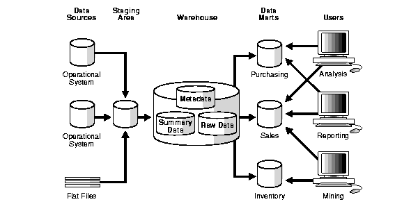
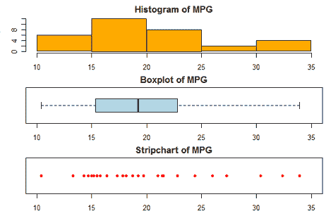

# 2020 年初露头角的数据科学家的顶级数据科学面试问题

> 原文：<https://medium.com/quick-code/top-data-science-interview-questions-for-budding-data-scientists-in-2020-c28d4c244d2d?source=collection_archive---------0----------------------->

数据科学界在 2015 年经历了翻天覆地的变化。数据科学家开始威胁首席信息官作为公司最重要的技术影响者的角色。由于数据质量直接影响利润，数据科学家备受追捧。再加上物联网(IoT)的普及，数据科学将在今年取得重大进展。 [**数据科学在线培训**](https://onlineitguru.com/data-science-course.html)

围绕数据科学的工作正在蓬勃发展，带来了更新的职业机会，开辟了发展道路。在接下来的日子里，你不接受数据科学工作面试的可能性极小。我们 Edureka 为您提供了一份最有可能的数据科学面试问题列表，让您轻松应对。

如果您最近参加了数据科学面试，或者有需要回答的问题，请将它们粘贴到评论部分，我们会尽快回答。

万事如意！

# 1.什么是数据科学？您认为它与商业分析和商业智能有何相似或不同之处？

*   数据科学是一个处理数据分析的领域。它研究信息的来源，信息代表什么，并通过对数据的洞察将信息转化为有价值的资源，这些数据随后用于制定策略。它是商业观点、计算机编程和统计技术的结合。
*   商业分析或简称分析是商业智能和数据科学的核心。数据科学是一个相对较新的术语，用于分析大数据并提供见解。
*   与编程更为繁重的数据科学相比，分析通常具有更高程度的业务视角。然而，这些术语可以互换使用。

# 2.R 和 Python 中用哪个包做数据导入？如何在 SAS 中进行数据导入？

我们可以使用多种方法进行数据导入:

*   在 R 中，我们将 RODBC 用于 RDBMS 数据，将 data.table 用于快速导入。
*   我们对 JSON 数据使用 jsonlite，对 SPSS 等其他语言使用外来包
*   对于 sas 数据，我们使用 data 和 sas7bdat 包。
*   在 Python 中，我们使用 Pandas 包和 read_csv、read_sql 命令来读取数据。此外，我们可以在 Python 中使用 SQLAlchemy 来连接数据库。

# 3.如何用 Python 或 R 构建自定义函数？

*   在 R:函数命令中

函数的结构如下所示:

我的功能

statements

return(object)

}

Example:

# function example — get measures of central tendency

# and spread for a numeric vector x. The user has a

# choice of measures and whether the results are printed.

mysummary

if (!npar) {

center

} else {

center

}

if (print & !npar) {

cat(“Mean=”, center, ”
、【SD=】、传播】、
)

} else if (print & npar) {

cat("Median= "，center，"
"，" MAD= "，spread，"
")

}

结果

return(result)

}

# invoking the function

set.seed(1234)

x

y

Median= 4

MAD= 1.4826

# y$center is the median (4)

# y$spread is the median absolute deviation (1.4826)

y

# no output

# y$center is the mean (4.052)

# y$spread is the standard deviation (2.01927)

*   In Python: [**Python 在线训练**](https://onlineitguru.com/python-training.html)

定义方法-

函数的结构:

def func(arg1，arg2 …):

报表 1

报表 2

…

返回值

示例-确定值列表的平均值。

def find_mean(given_list):

sum_values= sum(给定列表)

num_values= len(给定列表)

返回总和值/数量值

打印 find_mean([i for i in range(1，9)])

# 4

# 4.什么是 RDBMS？举出一些 RDBMS 的例子？什么是 CRUD？

*   关系数据库管理系统(RDBMS)是基于关系模型的数据库管理系统。关系模型使用关系或表的基本概念。RDBMS 是 SQL 的基础，也是 MS SQL Server、IBM DB2、Oracle、MySQL 和 Microsoft Access 等数据库系统的基础。
*   在计算机编程中，创建、读取、更新和删除[1](缩写为 CRUD，也可能是 backronym)(有时称为 SCRUD，带有“S”表示搜索)是持久存储的四个基本功能。

# 5.定义 SQL 查询？选择查询和更新查询有什么区别？SAS，Python，R 语言的 SQL 怎么用？

*   结构化查询语言(SQL)是一种设计用于从数据库获取信息和更新数据库的编程语言。它们用于管理关系数据库管理系统(RDBMS)中的数据。查询采用命令语言的形式，允许您选择、插入、更新、查找数据的位置等等。还有一个编程接口。
*   更新查询用于更新表中的现有记录。SELECT 查询用于从数据库中选择数据。结果存储在结果表中，称为结果集。
*   我们在 SAS 中使用 PROC SQL，在 R 中使用 sqldf，在 Python 中使用 pandasql 来使用 SQL sytax。展示示例
*   Python-

**SQLAlchemy 库:**这允许你从 python 对 MySQL-server 中的数据库表执行原始 SQL 查询。还存在 SQLAlchemy 表达式语言，它使用 Python 构造来表示关系数据库结构和表达式。表达式语言通过隐藏 SQL 语言提高了代码的可维护性，因此不允许混合使用 Python 代码和 SQL 代码。

导入 sqlalchemy

发动机=

sqlalchemy . create _ engine(' MySQL://root:password @ localhost/database _ name ')

从 sqlalchemy 导入文本

使用 engine.connect()作为 con:

RS = con . execute(text(' SELECT * FROM big diamonds limit 1 '))

打印 rs.keys()

打印 rs.fetchall()

[u '未命名'，u '克拉'，u '切工'，u '颜色'，u '净度'，u '制表'，u '深度'，u '证书'，u '尺寸'，u '价格'，u'x '，u'y '，u'z'] [(1L，0.25，' V.Good '，' K '，' I1 '，59.0，63.7，' GIA '，' 3.96 x 3.95 x 2.52 '，0.0，3.96，3.95，2.52)]

**PandaSQL:** 允许您使用 SQL 语法查询 pandas 数据帧。对于不熟悉 Python 或 pandas 的人来说，它提供了一个简单的功能。

从 pandasql 导入 sqldf

pysqldf(" SELECT * FROM my cars LIMIT 1；")

brandmpgcyldisphpdratwtqsecvsamgearcarb 0 Mazda rx 421 . 06160 . 0103 . 543636431

*   R-

库(sqldf)

sqldf("从波士顿限制 1 中选择 medv，rm ")

##医疗室

## 1 34.7 7.185

# 6.什么是 API？API 是用来做什么的？

API 是应用程序接口的缩写，是一组用于构建软件应用程序的例程、协议和工具。API 指定软件组件应该如何交互，以及在对图形用户界面(GUI)组件编程时使用 API。

一个好的 API 通过提供所有的构件使得开发程序变得更加容易。有许多类型的 API 用于操作系统、应用程序或网站。

# 7.什么是 NoSQL？列举一些 NoSQL 数据库的例子。什么是键值存储？什么是列存储？什么是文档数据库？

NoSQL 指的是非关系数据库。它用于存储和检索以关系数据库中使用的表格关系之外的方式建模的数据。NoSQL 数据库的一些例子是:

*   [**MongoDB 在线培训**](https://onlineitguru.com/mongodb-training.html)
*   CouchDB
*   大表格
*   雷迪斯
*   RavenDb

键值存储(或键值数据库)是一种数据存储范例，设计用于存储、检索和管理关联数组，这是一种数据结构，现在通常称为字典或散列。字典包含一组对象或记录，这些对象或记录又包含许多不同的字段，每个字段都包含数据。这些记录使用唯一标识记录的键来存储和检索，并用于在数据库中快速查找数据。

列数据库是一种数据库管理系统(DBMS ),它以列而不是行的形式存储数据。列数据库的目标是高效地向硬盘存储器写入数据和从硬盘存储器读取数据，以便加快返回查询所需的时间。

下面是一个简单的 4 列 3 行的数据库表的例子。

ID 最后第一笔奖金

1 号无名氏 8000

2 史密斯简 4000

3 贝克萨姆 1000

# 8.什么是数据仓库？

数据仓库是从企业内各种来源收集的大量数据的存储库。它也被称为集成数据的中央存储库。知识库可以是物理的，也可以是逻辑的。

# 9.什么是 JSON，什么是 XML？

JSON 是 JavaScript 对象符号的缩写。它是一种主要的数据格式，使用人类可读的文本来传输由数据解释语言组成的数据对象。尽管 JSON 最初源自 JavaScript 脚本语言，但它是一种独立于语言的数据格式。许多编程语言中都有生成 JSON 数据的代码。XML 是可扩展标记语言的缩写。它定义了一组规则，用于以人类和机器可读的格式对文档进行编码。XML 的设计目标强调互联网的简单性、通用性和可用性。它是一种文本数据格式，对不同的人类语言有很强的支持。它广泛用于表示任意数据结构，如 web 服务中使用的数据结构。

# 10.列举一些类型的图，并解释你将如何用 Python 或 r 构建它们。

R 中的基本图:

创建图表:

在 R 中，图形通常是交互式创建的。

#创建图表

> 要深入了解，请注册参加 [**数据科学认证**](https://onlineitguru.com/data-science-course.html) 的现场免费演示

附加(mtcars)

绘图(重量，mpg)

abline(lm(mpg~wt))

标题(“MPG 对体重的回归”)

plot()函数打开一个图形窗口，绘制重量与每加仑英里数的关系。

下一行代码向该图添加了一条回归线。最后一行添加了一个标题。