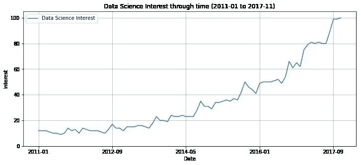

# 2019 年值得关注的顶级数据科学趋势

> 原文：<https://medium.com/quick-code/top-data-science-trends-to-watch-for-in-2019-cafc8034db4c?source=collection_archive---------1----------------------->

数据科学是当今的一个常用术语。五年前不是这样，因为那时只有少数人知道这件事。在继续前进之前，你需要明白它是什么？它是数据推理、算法开发和技术的多学科融合。给出的图表显示了 2011 年至 2017 年人们对数据科学的兴趣。

谈到 2019 年值得关注的主要数据科学趋势，人们议论纷纷。每个人都有自己对 2019 年数据科学趋势的预测。

Kaggle 首席执行官 Anthony Goldbloom 认为，人们将会看到部门或业务团队取代数据中心，而 Babson College 教授 Thomas H. Davenport 认为，人工智能(AI)将在 2019 年取得进展。当人们被问及 2019 年需要关注的数据趋势时，人工智能仍然位居榜首。

2019 年可以认为是人工智能年。我为什么这么说？不知道？只要看看在他们的企业名称或口号中有人工智能的创业公司的数量就知道了。人工智能无处不在，几乎没有哪个领域不受其影响。

现在，我们将讨论将于 2019 年问世的五大数据科学趋势。

**人工智能和智能应用**

人工智能在 2018 年创造的轰动可能会在 2019 年继续下去。世界正处于人工智能的萌芽阶段，未来一年将会看到人工智能在几乎每个领域的更高级应用。然而，利用人工智能仍将是一个挑战。你可以看到更多使用人工智能和机器学习开发的智能应用程序。

随着人工智能的引入，决策将变得轻而易举，并改善整体业务体验。自动化机器学习将变得司空见惯，并通过改善数据管理来改变数据科学。

应用程序将主要依靠人工智能来改善整体体验。因此，你可以预期智能应用程序的数量会增加。

**真实世界物体的虚拟再现**

由人工智能能力支持的现实生活物理对象的数字表示将变得猖獗。这项技术可以用来解决跨企业的业务问题。不仅如此，它还将加快实时创新的步伐。

增强现实(AR)和虚拟现实(VR)已经让位于大规模转型，因此你可以期待在 2019 年该领域有更多突破。人类对数字系统的期望肯定会提高。

**监管方案**

每秒钟都会产生大量的数据，而且像物联网这样的催化剂加快了数据产生的速度。随着数据的增多，数据安全变得更加重要，因为一切都依赖于数据。你可以期待在 2019 年有更多的数据监管计划出台，因为数据安全是每一个实体最重要的事情，无论是组织还是个人。

2018 年 5 月实施的 GDPR(欧洲通用数据保护法规)等数据监管事件在一定程度上规范了数据科学实践。GDPR 设立了一个界限，限制个人数据的收集和管理。

这些监管活动将影响未来的预测模型。最近的网络攻击迫使人们需要一种不易受攻击的数据保护方案。因此，你可以期待在 2019 年有新的协议和程序来保护数据。

**区块链**

你可以期待区块链技术的许多进步，比特币或任何其他加密货币的交易记录都得到了维护。

你可以说是一个高度安全的账本，因为区块链技术在数据安全方面有着深远的影响。尽管如此，在接下来的一年中，您仍可以看到新的安全措施和流程。

**边缘计算**

随着物联网的发展，边缘计算将会流行起来。设备和传感器的数量与日俱增，因此对边缘计算的需求也将增加。

边缘计算对于保持与信息源的接近是必要的，因为它消除了诸如连接性、延迟和带宽等问题。融合了云技术的边缘计算将为协调结构让路，就像面向服务的模型一样。

IDC 预测，到 2020 年，[新的云定价模式将服务于特定的分析工作负载。](https://www.idc.com/research/viewtoc.jsp?containerId=US41866016)

**结论:**

随着这些趋势在来年盛行，创新的未来看起来一片光明。你可以期待数据科学在 2019 年见证大规模的使用和发展。在人类体验方面，数字空间将取代传统模式。数据科学领域预计会增长，因此投资该领域看起来是一件有利可图的事情。

摘要:给定的文章谈到了 2019 年值得关注的数据科学趋势。看完这篇文章，你肯定会想投资数据科学领域。

**作者简介:**

Paige Griffin 在洛杉矶 Net Solutions 工作了 7 年，是一名经验丰富的内容作家，擅长撰写博客，为直接回应市场撰写创意和技术文案，并为 B2B 和 B2C 行业制作促销广告。Paige 在纽约出生和长大，拥有英国文学学士学位。她曾在 IT、[产品开发](https://www.netsolutions.com/product-development)、生活方式、零售等行业工作过。除了技术背景之外，她内心还是一个诗人，喜欢通过一定量的创造力和想象力与人们联系在一起。