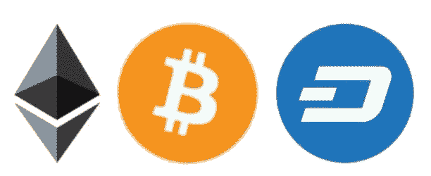
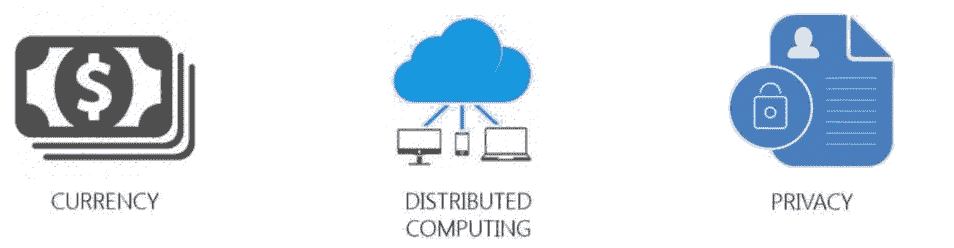

# 7 门针对初学者的最佳加密货币课程[2023 年 3 月]—在线学习加密货币

> 原文：<https://medium.com/quick-code/top-free-online-courses-to-learn-about-cryptocurrency-for-beginners-de83842c601b?source=collection_archive---------0----------------------->

## 了解比特币、以太坊、Altcoin、Dashcoin、区块链、ICO 等加密货币，以及 2023 年面向初学者的最佳加密货币课程。

比特币重塑了货币的概念。它为另类金融体系的创新打开了大门。有许多课程从技术角度解释了比特币的承诺，以将这一概念带给年轻学生和企业家，并鼓励他们追求这一领域。

# 1.【2020 年加密货币长期投资机会

知道为什么长期加密货币投资对退休资金最有效，在这个视频教程里知道 2017 年哪种 altcoin 是最好的投资机会。这引入了一个在投资任何加密货币时都可以为你工作的系统，让你为未来获得最佳收益。这可以每天、每周或每月进行。了解识别长期加密货币的确切方法，如何在社区中活跃，以及如何持有它，即使你发现很难不卖或不买。

# 2.[区块链和加密货币(比特币、以太坊)必备](https://www.eduonix.com/blockchain-and-cryptocurrency-bitcoin-ethereum-essentials/UHJvZHVjdC0zMjMyMDA=)

了解区块链和加密货币的一切(比特币、以太坊、Ripple、莱特币、比特币交易、挖矿)

在本课程中，您将学习:

*   什么是区块链？
*   区块链是如何工作的？
*   比特币是什么？
*   以太坊是什么？
*   什么是加密货币？
*   加密货币是如何工作的？
*   替代加密货币
*   密码学基础

区块链和加密货币正迅速成为席卷全球的绝技，席卷所有市场和行业。这门课程将确保你知道什么是我们这个时代，甚至可能是有史以来最伟大的技术和经济革命和发展。

您将获得使用和利用这些令人惊叹的平台背后的强大技术的所有知识。

# 3.[加密货币交易:交易替代币完全指南](https://click.linksynergy.com/deeplink?id=Fh5UMknfYAU&mid=39197&u1=quickcode&murl=https%3A%2F%2Fwww.udemy.com%2Fcryptocurrency-trading%2F)

了解如何在实践层面参与加密货币交易，从交易者的角度一步一步地指导您完成整个过程。你将学习现场交易，然后自信地开始自己的交易。它是最完整的基础加密货币交易指南之一。这个课程包含了许多实践练习，帮助你把学到的知识运用到实践中，开始交易。

## 4.[完整的加密货币课程:1 次超过 5 门课程](https://click.linksynergy.com/deeplink?id=Fh5UMknfYAU&mid=39197&u1=quickcode&murl=https%3A%2F%2Fwww.udemy.com%2Fcourse%2Fthe-complete-cryptocurrency-course-more-than-5-courses-in-1%2F)

了解您需要了解的关于加密货币和区块链的一切，包括投资、采矿等等！

在本课程中，您将学习:

*   是什么让一种伟大的加密货币成为一项伟大的长期投资？
*   新投资者在加密货币上犯的最大错误是什么？
*   加密货币的利弊以及如何挖掘。
*   警惕骗局和管理风险。
*   你应该考虑投资多少%的净资产在加密货币上？

通过这门加密课程，你将了解货币的未来&什么是区块链？你将接触到 10 多种加密货币(采矿、投资等等)。

了解如何创建加密货币的投资组合，并了解是什么让一种伟大的加密货币成为伟大的长期投资。您还将被介绍使用 5+钱包来存储您的加密货币。

此外，该课程还将指导您如何在 5+交易所的帮助下使用来买卖加密货币。您将了解如何开始采矿&从零开始构建采矿 pc。

此外，您将学习加密货币投资框架(excel 制作)以及如何提防骗局和管理风险。

# 5.加密货币和区块链介绍—【免费课程】

本课程探索加密货币的经济含义。它将从技术和经济角度解释对比特币/区块链技术的理论理解。它概述了法律领域。它介绍了这项技术给企业家带来的机遇。进入区块链社区。它将提供如何交易自己的比特币以及如何将比特币视为一种资产类别的培训。本教程内容丰富、实用、发人深省，并为您提供了获取新资源的途径。

# 6.[加密货币交易讲解](https://click.linksynergy.com/deeplink?id=Fh5UMknfYAU&mid=39197&u1=quickcode&murl=https%3A%2F%2Fwww.udemy.com%2Fbabtrading%2F)——【免费课程】

本课程简要介绍了注册交易所时会遇到的情况，以及安全性的重要性。它解释了比特币交易所，简要概述了最好的交易所，并解释了通常令人困惑的将美元兑换成代币的路线。还提供了对行话和应用程序的介绍，以帮助您了解加密世界。它教你什么是 ICO，以及如何区分好的和坏的？

# 7.[加密货币:你必须知道的事情](https://click.linksynergy.com/deeplink?id=Fh5UMknfYAU&mid=39197&u1=quickcode&murl=https%3A%2F%2Fwww.udemy.com%2Fcryptocurrency-all-you-need-to-know%2F)——【免费课程】

30 分钟内像专家一样了解加密货币。它讲述了如何比其他人更好地分析加密货币的市场新闻，并做出关于加密货币/比特币的明智投资决策。您还将了解加密货币的基本价值，并找到积累财富和更好地规划退休生活的更好方法。本课程是对加密货币的理性透视。这门课教的是比特币/Alt 币，是币商永远不会告诉你的。

> 感谢您阅读本文。我们策划了更多主题的顶级教程，您可能想看看:

 [## 面向初学者的 10+最佳加密货币课程—在线学习加密货币

### 学习加密货币课程，在 2021 年为初学者提供最佳加密货币教程，以增加您的利润

medium.com](/quick-code/top-10-online-courses-to-learn-about-cryptocurrency-in-2018-1486628655b5)  [## 以太坊的 10+最佳坚固性教程——在线学习坚固性

### 用 2021 年最佳新手坚实度教程学习撰写智能合同的坚实度

medium.com](/quick-code/top-tutorials-to-learn-ethereum-solidity-at-different-level-23700a04ae80)  [## 面向初学者的 6 门最佳加密货币交易课程—在线学习加密货币交易

### 学习加密货币交易，了解如何用最好的加密货币课程进行加密货币交易

medium.com](/quick-code/the-best-online-guide-to-learn-about-cryptocurrency-ec2560cd570e) 

> 这是我关于加密货币的第一篇文章。如果你喜欢，那就留下评论分享吧。请关注我以获取更多更新。

披露:我们与本文中提到的一些资源有关联。如果你通过本页的链接购买课程，我们可能会得到一小笔佣金。谢谢你。