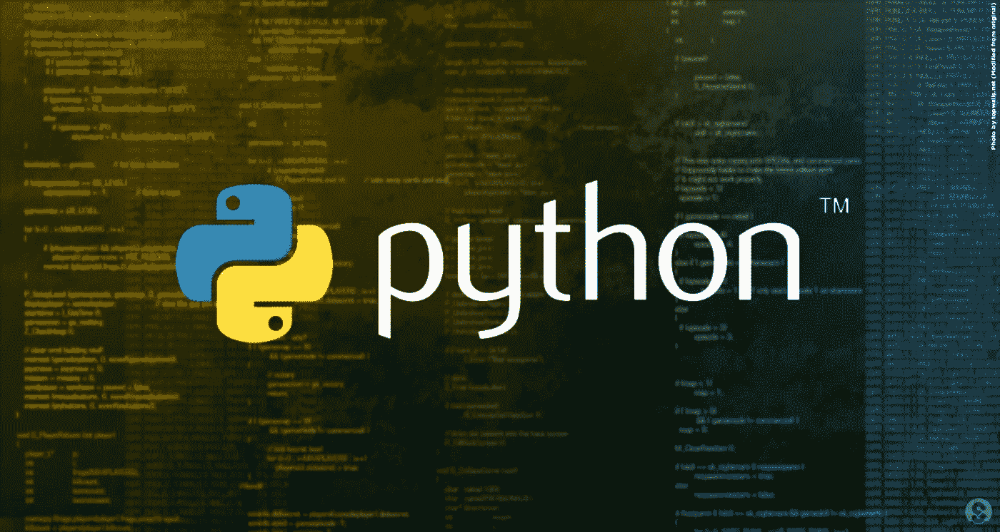
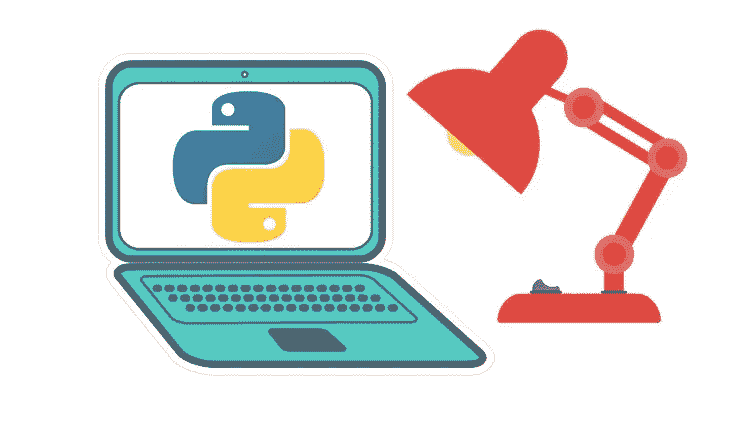
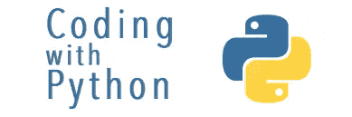

# 10+最佳 Python 初学者教程[2023 年 3 月]—在线学习 Python

> 原文：<https://medium.com/quick-code/top-free-online-courses-to-learn-python-dcd22b03db62?source=collection_archive---------0----------------------->

## 2023 年最佳 Python 初学者教程，学习 Python，更轻松地进行 web 开发。

Python 是一种面向对象的语言，非常类似于英语，这使它成为初学者和经验丰富的专业人员学习的好语言。Python 是一种很容易学习的编程语言，在许多领域都有各种各样的高薪工作，包括数据科学、web 开发和网络编程。由于其简单性，Python 是人工智能领域中使用最广泛的编程语言之一。它可以无缝地用于数据结构和其他常用的人工智能算法。使用 Python 的网站有 Instagram、YouTube、Reddit、NASA、IBM、诺基亚等。

## 1.[Python 编程:初学者实践介绍](https://coursesity.com/r/site/programming-with-python-hands-on-introduction-for-beginners)

本课程是为希望获得 Python 实践学习经验的初学者设计的，从基础开始教你编程的概念，Python 是初学者最简单的入门语言。现在开始学习按需 Python 语言是正确的时间，因为它在数据科学、后端开发、物联网等领域越来越受欢迎。

## 2.[为大家编程](https://coursera.pxf.io/c/1137078/1213622/14726?u=https%3A%2F%2Fwww.coursera.org%2Flearn%2Fpython&subId1=BotTutorials)

本课程旨在教大家使用 Python 进行计算机编程的基础知识。它涵盖了如何从 Python 中的一系列简单指令构造程序的基础知识。本课程将涵盖教材《Python 面向所有人》的第 1-5 章。一旦学生完成这门课程，他们将准备参加更高级的编程课程。本课程涵盖 Python 3。

在本课程中，您将学习:

*   描述 Python 编程语言的基础
*   使用变量来存储、检索和计算信息
*   安装 Python 并编写你的第一个程序
*   利用核心编程工具，如函数和循环

## 3.[高级 Python](https://www.linkedin.com/learning/advanced-python?trk=learning-serp_learning_search-card&upsellOrderOrigin=homepage-learning_learning-search-bar_search-submit)

发展您的 Python 编程技能。

该课程包括:

*   Python 语言特性
*   内置函数
*   高级 Python 函数
*   高级收藏
*   高级类和对象
*   使用日志记录
*   Python 理解

在本课程中，您可以了解如何利用下一级 Python 功能，如面向对象的特殊类方法，使用日志记录来跟踪性能和用户活动，了解如何将代码从 Python 2 移植到 Python 3，并使您的代码更高效、更易于阅读和维护。

该课程还展示了如何操作数据、构建自定义类和函数、创建列表以及编写更优雅、优化的代码。

## 4.[完整的 Python 机器学习&面向假人的数据科学](https://www.eduonix.com/complete-python-machine-learning-and-data-science-for-dummies/UHJvZHVjdC0zMjMyMDA=)

面向编程初学者的机器学习和数据科学，使用 python 和 scikit-learn、SciPy、Matplotlib 和 Pandas

在本课程中，您将学习:

*   机器学习的概念、定义和类型。
*   机器学习的分类及应用。
*   Python 基础。
*   NumPy 的基础。
*   CSV 数据文件。
*   如何加载和读取 CSV 数据文件？

本课程主要关注机器学习。在本课程中，您将准备一台机器，使其为预测测试做好准备。

此外，在整个课程中，您将学习 Python、NumPy、matplotlib 和 Pandas 的基础知识。

## 5.[使用 Python 进行研究](https://www.awin1.com/cread.php?awinmid=6798&awinaffid=466009&clickref=quickcode&ued=https%3A%2F%2Fwww.edx.org%2Fcourse%2Fusing-python-for-research)

让您的 Python 编程入门知识更上一层楼，并学习如何在研究中使用 Python 3。

在本课程中，您将学习:

*   Python 3 编程基础(综述)。
*   用于研究应用的 Python 工具(例如 NumPy 和 SciPy 模块)。
*   如何在实际环境中应用 Python 研究工具？

本课程弥补了 Python 入门课程和高级课程之间的差距。在本课程中，首先回顾 Python 3 的基础知识，然后您将了解研究环境中常用的工具。这个版本的课程包括一个关于统计学习的新模块。

使用引导式介绍和更独立的深入探索的组合，您将能够通过各种案例研究来练习您的新 Python 技能，这些案例研究是根据它们的科学广度和它们对不同 Python 特性的覆盖范围而选择的。

## 6.[全速巨蟒](https://www.educative.io/courses/full-speed-python?affiliate_id=5088579051061248)

你将考察这门语言的基础。您还可以试验所提供的代码，从而更好地理解事情是如何工作的。

该课程包括:

*   基本数据类型
*   列表
*   模块和功能
*   迭代和循环
*   字典
*   班级
*   迭代器
*   发电机
*   异步编程

## 7.[面向数据分析师的 Python](https://pluralsight.pxf.io/c/1137078/424552/7490?u=https%3A%2F%2Fwww.pluralsight.com%2Fcourses%2Fpython-data-analysts&subId1=quickcode)

本课程涵盖 Python 入门的基础知识，包括变量的语义、简单和复杂的数据类型，以及使用循环进行迭代和使用函数进行代码重用。

在本课程中，您将:

*   从概念上理解 Python 相对于其他技术的一些优势。
*   获得编写 Python 程序的能力，并利用编程和数据分析的基本构件。
*   了解编程语言(如 Python)、电子表格(如 Microsoft Excel)和基于 SQL 的技术(如数据库)之间的区别，以及它们之间的相互操作。
*   一头扎进 Python 编程，安装 Python，从简单的程序开始。
*   理解使用变量保存数据的方式，以及 Python 中简单和复杂数据类型在语义上的不同。

最后，您将通过使用 if 语句、循环和函数进行条件求值来完善您的知识。您将了解 Python 如何将函数视为一级实体，这是函数式编程的一个关键促成因素。

当你完成本课程时，你将拥有技能和知识来识别什么情况下 Python 是你的正确选择，并使用 Python 实现简单而可靠的程序。

## 8.[用 Flask 构建 Python Web 应用](https://www.pjatr.com/t/TUJGR0lLR0JHR0pMSUtCR0ZISk1N?sid=quickcode&url=https%3A%2F%2Fwww.codecademy.com%2Flearn%2Fpaths%2Fbuild-python-web-apps-flask)

学习这个流行框架的基础知识，这样您就可以用 Python 后端创建自己的 web 应用程序。

在本课程中，您将学习如何:

*   了解 Python 的基础知识，Python 是世界上最流行、最强大的编程语言之一。
*   理解数据结构和循环的力量。
*   创建您自己的 Flask 应用程序，并使用模板和表单添加功能。
*   为您的 web 应用程序添加数据存储功能。
*   使用帐户和身份验证为 Flask 应用程序添加个性化和安全性等高级功能。
*   部署您自己的 Flask 应用程序，这样您就可以与全世界共享您的应用程序。
*   创建并部署一个全功能的 Flask 应用程序。
*   了解 web 开发的基础。

了解如何使用 Python 和 Flask 框架构建交互式 web 应用的后端。

将数据库添加到您的 web 应用程序中，以自定义用户体验，并确保使用您的 web 应用程序的用户的个性化和安全性。

## 9.[用 Python 进行 AI 编程](https://imp.i115008.net/c/1137078/788805/11298?u=https%3A%2F%2Fwww.udacity.com%2Fcourse%2Fai-programming-python-nanodegree--nd089&subId1=quickcode)

学习 Python、NumPy、pandas、Matplotlib、PyTorch、微积分和线性代数——这些都是构建自己的神经网络的基础。

在本课程中，您将学习如何:

*   开始用 Python 编码，利用库和自动化脚本快速解决复杂问题。
*   使用 Python 中处理数据的所有关键工具:Jupyter Notebooks、NumPy、Anaconda、pandas 和 Matplotlib。
*   理解人工智能成功所需的基本线性代数:向量、线性变换和矩阵——以及神经网络背后的线性代数。
*   了解微积分的基础，以了解如何训练神经网络:绘图，导数，链规则，等等。
*   在人工智能最热门的领域获得坚实的基础:神经网络、深度学习和 PyTorch。

学习人工智能的基本基础:编程工具(Python，NumPy，PyTorch)，数学(微积分和线性代数)，以及神经网络的关键技术(梯度下降和反向传播)。

## 10.[Python 中的交互式编程](https://click.linksynergy.com/deeplink?id=Fh5UMknfYAU&mid=39197&u1=quickcode&murl=https%3A%2F%2Fwww.udemy.com%2Finteractive-programming-in-python%2F)

本课程的目标是通过实践教学向学生介绍 Python 版编程。它将展示如何安装 Python 和使用 Spyder IDE(集成开发环境)来编写和调试程序。本课程从 python 的基本框架开始，向您展示从零开始的一切。如果你想通过动手的方式学习 Python 编程语言，那你来对地方了。

## 11. [Python 初学者用示例](https://coursesity.com/course-detail/python-for-beginners-with-examples)

本 Python 课程将帮助您快速掌握 Python，节省您搜索视频教程、练习和示例的时间。本课程涵盖了所有这些内容。您将从零开始，在课程结束时，您将知道如何编写 Python 程序，并且您将构建您的第一个 Python 程序，该程序具有使用 Python Tkinter 创建的图形用户界面(GUI)。您将开发的 Python 程序可以作为独立程序在 Windows 和 Mac 上运行。本课程还指导你如何用 Python 构建更高级的程序。您将学习如何使用 Python 第三方库在广泛的应用领域开发程序。如果您想学习 Python 来构建 web 应用程序、处理数据库、进行数据科学、图像处理和桌面应用程序，请查看付费课程“[**Python 大型课程:构建 10 个真实世界的应用程序**](https://click.linksynergy.com/deeplink?id=Fh5UMknfYAU&mid=39197&u1=quickcode&murl=https%3A%2F%2Fwww.udemy.com%2Fthe-python-mega-course%2F) ”。

## 12.[面向初学者的 Python 3 中 OOP 的四大支柱](https://click.linksynergy.com/deeplink?id=Fh5UMknfYAU&mid=39197&u1=quickcode&murl=https%3A%2F%2Fwww.udemy.com%2Fpython-oops-beginners%2F)

在本课程中，您将学习如何在 Python 中实现面向对象的编程，方法是学习如何在一个类中捆绑属性和方法，并通过一个对象实例化它们。您将了解到支撑面向对象编程的四大支柱，即抽象、封装、多态和继承。

> 感谢您阅读本文。我们策划了更多主题的顶级教程，您可能想看看:

 [## 15+初学者最佳 Bootstrap 4 教程—在线学习 Bootstrap 4

### 2022 年，用最佳初学者引导教程学习 web 开发的引导

medium.com](/quick-code/top-tutorials-to-develop-responsive-websites-using-bootstrap-4-c934172f3ebd)  [## 15+最佳 Django 初学者教程——在线学习 Django

### 用 2022 年的最佳 Django 初学者教程学习 Django 进行 web 开发

medium.com](/quick-code/top-tutorials-to-learn-django-framework-for-python-beginners-fe1a9e315aa9)  [## 10+初学者最佳 Flask Python 教程—在线学习 Flask

### 用 2022 年初学者的最佳 Flask 教程学习 Flask for web 开发

medium.com](/quick-code/top-online-tutorials-to-learn-flask-python-c2723df5326c) 

披露:我们与本文中提到的一些资源有关联。如果你通过本页的链接购买课程，我们可能会得到一小笔佣金。谢谢你。