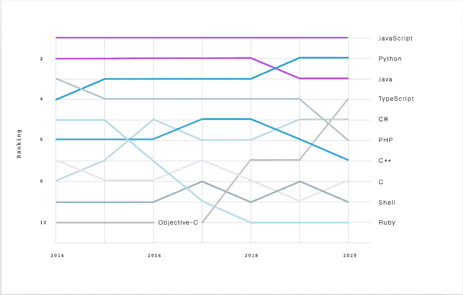
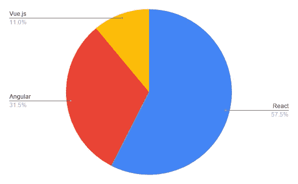
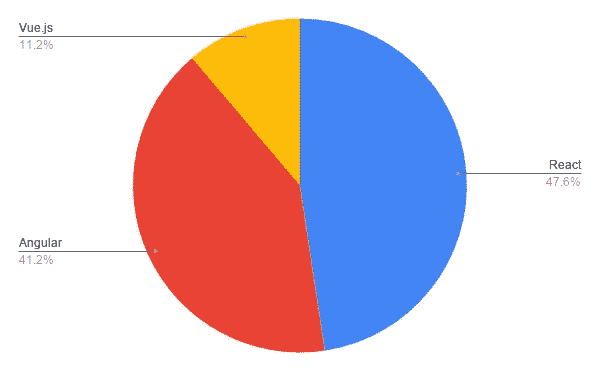
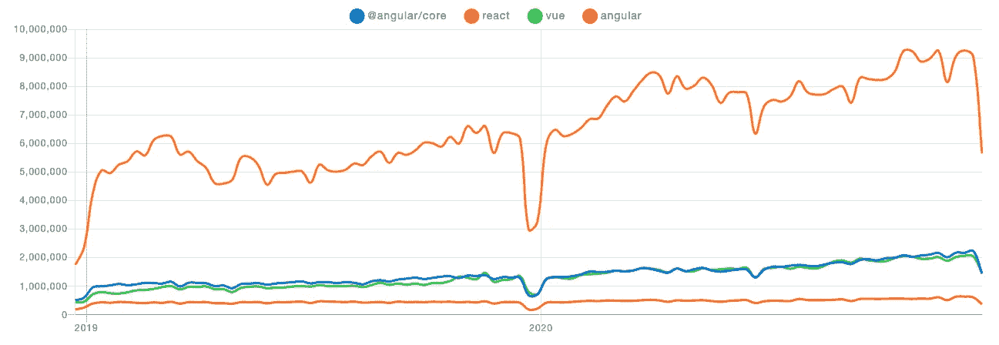
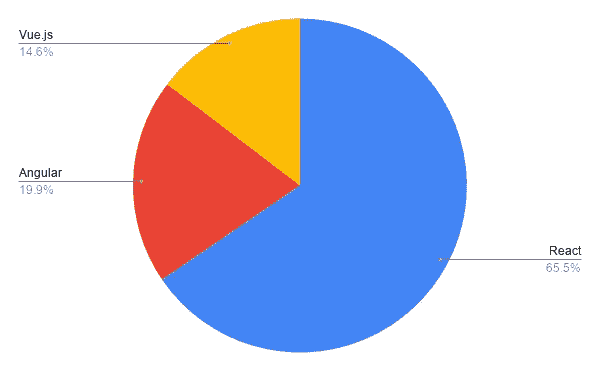
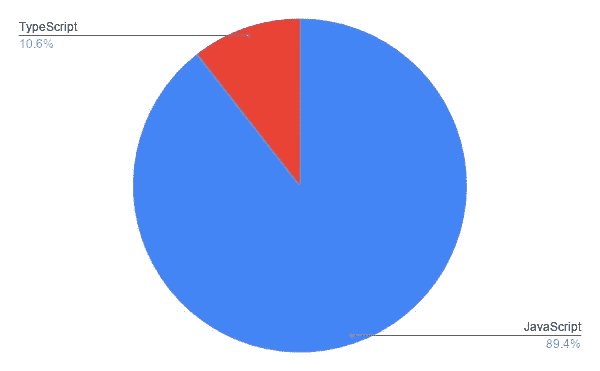
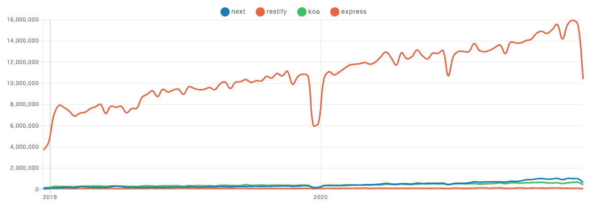
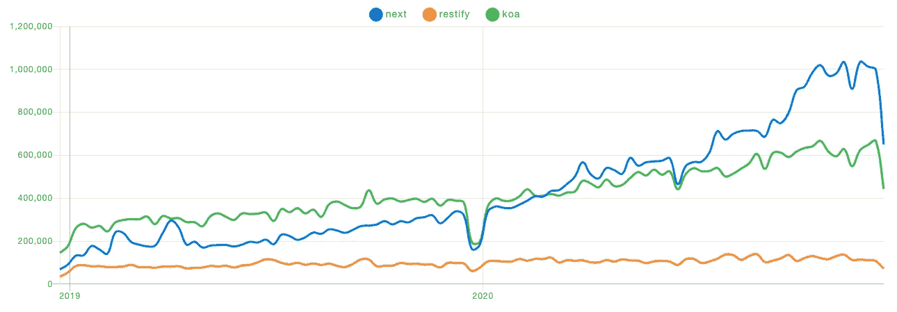
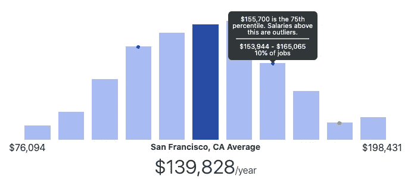
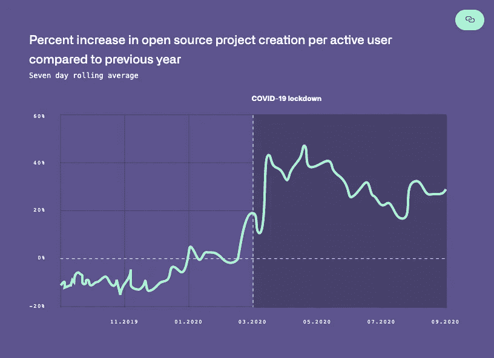

# 2021 年顶级 JavaScript 框架和技术趋势

> 原文：<https://medium.com/javascript-scene/top-javascript-frameworks-and-tech-trends-for-2021-d8cb0f7bda69?source=collection_archive---------0----------------------->

新年快乐是时候回顾一下 2020 年 JavaScript 和技术的大趋势了，并考虑一下我们进入 2021 年的势头。

我们的目标是突出具有最高潜在工作投资回报率的学习主题和技术。这不是关于哪个是最好的，而是哪个最有潜力让你在 2021 年找到一份好工作。最后，我们还将关注一些更大的技术趋势。

# 语言排名

JavaScript 仍然在 GitHub 和堆栈溢出上独占鳌头。技巧 1:学习 JavaScript，特别是，[学习 JavaScript 中的函数式编程。大多数 JavaScript 的顶级框架，包括](/javascript-scene/composing-software-the-book-f31c77fc3ddc) [React](https://reactjs.org/) 、 [Redux](https://redux.js.org/) 、 [Lodash](https://lodash.com/) 和 [Ramda](https://ramdajs.com/) ，都是基于函数式编程概念。

TypeScript 超越了 PHP，C#排名第四，仅次于 Java、Python 和 JavaScript。Python 超越 Java 获得第二名，可能是因为对人工智能的兴趣迅速攀升，以及针对 GPU 加速的动态深度神经网络的 [PyTorch 库](https://github.com/pytorch/pytorch)，这使得网络结构的实验更加容易和快速。

Source: GitHub State of the Octoverse, 2020

[JavaScript 也连续第八年在栈溢出](https://insights.stackoverflow.com/survey/2020)中排名第一。Python、Java、C#、PHP 和 TypeScript 击败了 C++、C、Go、Kotlin 和 Ruby 等语言。

# 结构

说到前端框架，绝大多数 JavaScript 开发人员使用 React、Vue.js 或 Angular。jQuery 仍然有惊人的大显示，几乎是 Vue.js 显示的两倍，但我猜测 jQuery 在应用程序工作中使用较少，在内容网站和 WordPress 模板中使用较多，所以我们今年将排除它。

## 搜索量

React 占搜索量的 57.5%，Angular 占 31.5%，Vue.js 占 11%。

Source: [Google Trends](https://trends.google.com/)

****方法论:*** *所有搜索趋势都是按主题而不是按关键词选择的，以排除误报。*

## 乔布斯

如果你想学习能让你在 2021 年找到工作的最佳几率的框架，你最好的选择仍然是 React，并且从 2017 年开始就是这样。在提到通用前端框架的列表中，47.6%提到了 React，Angular 提到了 41.2%，Vue.js 落后于 11.2%。

值得一提的是，大多数工作列表都说他们需要少数几个指定框架之一的经验，但当你查看它们列出的技术堆栈时，*这些列表中的很大一部分实际上是为 React 工作招聘的，并且会显示出对具有丰富 React 知识的候选人的偏好。你会在下面的下载趋势中看到一些支持的证据。*

****方法论:*** *对 Indeed.com 进行求职。为了剔除误报，我将搜索与关键词“软件”配对，以增加相关性。我也省略了”。js ”,因为许多列表不包含。js”。所有 SERPS 都按日期分类，并抽查相关性。*

## 下载

npm 下载量看起来与搜索趋势非常相似，但揭示了一些有趣的事情:Angular 2+和 Vue.js 的下载量几乎不分上下，但如果你加上使用旧 Angular 框架的人数，Angular 在下载量上遥遥领先于 Vue.js。

Source: [npmtrends.com](https://www.npmtrends.com/@angular/core-vs-react-vs-vue-vs-angular)

如果我们在饼状图上看一下最近的下载份额，它显示 React 为大约 66%，Angular(所有版本)为大约 20%，Vue 为大约 15%。

## 类型脚本与 JavaScript

10.6%的雇主在工作列表中特别提到打字稿，高于去年的 7.4%。

Source: [Indeed.com](https://www.indeed.com/)

不可否认，开发人员对 TypeScript 的兴趣非常浓厚，而且还在迅速增长。我预测这一趋势将在 2021 年继续，用户将学会规避使用 TypeScript 的一些[成本(例如，通过更喜欢接口而不是内联类型注释)。](/javascript-scene/the-typescript-tax-132ff4cb175b)

特别提到 TypeScript 的工作数量仍然相对较少，但一些使用 TypeScript 的经验将略微增加你在 2021 年找到工作的几率。到 2022 年，一些打字经验可能会让你在就业市场上获得优势。然而，由于 JavaScript 开发人员学习 TypeScript 比学习一门全新的语言更容易，TypeScript 团队通常愿意雇佣和培训优秀的 JavaScript 开发人员。

## 服务器框架

在服务器端，Express 仍然在下载量上占主导地位，以至于很难看出热门竞争者之间的相对表现。

Source: [npmtrends.com](https://www.npmtrends.com/@angular/core-vs-react-vs-vue-vs-angular)

正如我去年预测的那样，不包括 express，我们看到 [Next.js](https://nextjs.org/) 已经成为最大的竞争者，这并不奇怪，因为 Next.js 是一个灵活的、全栈的、基于 React 的框架，可以帮助您交付静态优化的内容，但当您需要动态生成内容时，也可以依靠 API routes 和 SSR 的无服务器函数。您甚至可以在第一次请求时按需静态生成内容，然后从 CDN 提供缓存的静态内容，这对基于用户生成内容的应用程序非常有用。

Next 还有许多其他优势，包括页面包的自动优化，使用[新图像标签](https://nextjs.org/docs/api-reference/next/image)的自动图像优化，以及内置的[性能分析](https://vercel.com/docs/next.js/analytics)来帮助您改善用户的页面加载体验。

如果你使用 GitHub 并在 [Vercel](https://vercel.com/) 上部署，你也可以自动部署每个 PR，以及一个非常平滑的 CI/CD 管道。从本质上来说，这就像拥有最好的全职 DevOps 团队，但你不用支付他们工资，而是在托管账单方面节省了大量资金。

预计 Next.js 将在 2021 年继续爆发。

# 远程工作趋势

2020 年，团队被迫学习通过全球疫情进行远程协作。2021 年，远程工作仍将是一个重要的话题。首先，因为在新冠肺炎大范围接种疫苗之前[可能是 6 月](https://www.wsj.com/articles/the-covid-19-vaccine-when-will-it-be-available-for-you-11606339361)，第二，因为许多团队在封锁期间经历了生产率的提高和成本的降低，[许多](https://www.washingtonpost.com/technology/2020/10/01/twitter-work-from-home/?arc404=true) [员工](https://www.nytimes.com/2020/05/21/technology/facebook-remote-work-coronavirus.html) [将在 2021 年](https://www.cnn.com/2020/10/13/success/dropbox-virtual-first-future-of-work/index.html)[返回](https://www.rei.com/newsroom/article/rei-co-op-to-pursue-sale-of-headquarters-embrace-distributed-work-model) [办公室](https://www.cnn.com/2020/08/25/business/office-space-remote-work-pandemic/index.html)。

远程工作也带来了更多的地点自由，促使开发商搬到他们能够获得对他们来说重要的东西的地方，如家庭和更实惠的住房。此外，毕马威调查的 72%的雇主表示，远程工作拓宽了他们的潜在人才库。

> 远程优先和混合远程团队将成为未来十年的新常态。

根据 Indeed 的数据，2020 年 JavaScript 开发人员的平均工资略有下降，从 11.4 万美元/年降至 11.3 万美元/年，部分原因可能是远程工作将员工队伍扩大到了旧金山和纽约等科技中心以外，这些城市的生活成本往往更高，因此要求更高的工资来补偿。旧金山 JavaScript 开发人员的平均工资是 13 万美元。

尽管如此，许多总部位于旧金山和其他科技中心的公司支付给远程员工的薪酬介于美国全国平均水平和旧金山薪酬之间，这提供了一个高于市场利率的溢价，以吸引更好的人才，并且仍然比在本地招聘和支付办公场所费用节省资金。

由于这种趋势，对于中级开发人员来说，许多远程工作都在 11.5 万美元到 13 万美元之间。高级开发人员通常能找到 12 万到 15 万美元的工作，*不管在哪里。*

Source: [ZipRecruiter](https://www.ziprecruiter.com/Salaries/senior-javascript-developer-Salary-in-San-Francisco,CA?ind=null)

GitHub 的数据表明，2020 年，团队远程工作的效率更高，而不是慢下来。当封锁开始时，GitHub 活动激增。

Source: GitHub State of the Octoverse, 2020

GitHub 上的工作量大幅增加，平均拉取请求合并时间减少了 7.5 小时。

越来越多的证据表明*远程工作有效。*

# 密码已经过时了

2021 年，密码是过时的、不安全的技术，绝对不应该用来保护你的用户或你的应用。

问题的关键在于，大约一半的用户在多个应用程序和网站上重复使用密码，攻击者受到经济激励，为破解用户密码的问题带来巨大的计算能力，以便他们可以在银行账户、亚马逊等上尝试密码。

如果你不是谷歌、微软或亚马逊，很可能你负担不起抵御现代密码破解者所需的计算能力。不相信我？检查出[已经过](https://haveibeenpwned.com/)检查。剧透:如果你使用过互联网，你的密码被盗了。

多年来，我一直在警告密码的危险，但在 2020 年，[新的选项](https://magic.link/) [出现了](https://www.w3.org/TR/webauthn-1/)，它允许我们永久地留下密码。2020 年是这样，现在依然是这样:2021 年，任何新应用都不应该使用密码。

但是一旦你留下密码来交换密钥对，你的应用程序也会获得 Web3 的超能力。这让我想到了下一个话题:密码。

# 秘密党员

到 2021 年，加密仍将是最重要的全球转型技术之一。以下是 2020 年的一些亮点:

*   比特币爆炸式增长，创下历史新高，这在一定程度上要归功于 PayPal 等公司的大力支持。预计 2021 年还会有更多类似的情况。
*   [**以太坊 2.0 信标链推出**](https://www.coindesk.com/ethereum-2-0-beacon-chain-goes-live-as-world-computer-begins-long-awaited-overhaul)**这为以太坊成为一个可扩展性更强的平台奠定了基础。此外，可扩展性解决方案，如[侧链](https://matic.network/)和 [zkRollups](https://zksync.io/faq/intro.html#introduction) 在 2020 年获得了发展势头。预计在 2021 年将会看到更多的 DApps(去中心化应用)集成这些扩展解决方案。**
*   ****DeFi(去中心化金融)现在是一个******150 亿美元的市场**(在我去年写这篇文章时是 6 . 5 亿美元)，主要在以太坊区块链上运作。2020 年，许多数百万美元的漏洞困扰着 DeFi 生态系统。智能合约安全将在 2021 年继续成为热门话题和巨大机遇。****
*   ****[**不可替代代币**](https://en.wikipedia.org/wiki/Non-fungible_token) **在 2020 年获得了发展势头**，几款售价在数万美元的单个代币高调销售。Rarible 推出了自己的社区令牌，并开始向市场用户空投令牌，从而增加了交易量。每天都有价值数百万美元的非金融资产被买卖，但这仅仅是开始。因为它们几乎可以代表任何有价值的东西，所以潜在的市场总额高达数万亿美元。****
*   ******[**流区块链推出了**](https://www.onflow.org/post/a-year-in-review-with-flow-2020) ，并为主流区块链采用带来了许多希望。NBA Top Shot 在 NBA 品牌的 NFT 时刻中销售了超过 600 万美元，这是 NBA 比赛中关键时刻的短视频剪辑。******
*   ****[**θ网**](https://www.thetatoken.org/) **推出智能合约和 NFTs。**除此之外，NFT 将用于 [Theta.tv](https://www.theta.tv/) 上的贴纸和徽章，这是 Twitch 的分散式替代方案，每月有数百万活跃用户。****

# ****人工智能****

****2020 年对人工智能来说是开创性的一年。通过 GPT-3 的发射，我们了解到语言模型和转换器总体上可能是通向人工通用智能的一条可行的道路(AGI)。****

****人类思维通过将各种问题与我们已经知道的事情联系起来来解决这些问题的能力在人工智能领域被称为零射击和少射击学习。我们不需要大量的指导或例子来承担对我们来说是新的任务。我们经常可以通过几个(或者没有)例子(镜头)来解决新类型的问题。****

****人类认知技能的普遍适用性被称为一般智力。在人工智能中，人工通用智能(AGI)是“一台机器的假设智能，它有能力理解或学习人类可以完成的任何智力任务。”****

****GPT-3 展示了它可以自学数学，如何编码，如何翻译文本，以及通过其庞大的训练集(基本上包括整个公共网络( [Common Crawl](https://commoncrawl.org/the-data/get-started/) ，WebText2，Books1，Books2 和 Wikipedia)，结合其巨大的模型大小，几乎无限多种其他技能。GPT 3 号使用了 1750 亿个参数。对于上下文来说，这是先前技术水平的一个数量级(10 倍),但仍然比人脑小几个数量级。****

****扩大 GPT 3 号的规模很可能会带来更多的突破。****

## ****自动驾驶汽车****

****2020 年 10 月，Waymo 开始在 100%的乘坐中提供完全无人驾驶的乘坐(司机座位上没有人)。在推出时，有 1500 个月活跃用户和数百辆汽车服务于凤凰城地铁区。****

****2020 年 12 月，通用汽车的 Cruise 在旧金山的街道上推出了完全无人驾驶的乘坐方式。****

## ****无人机送货****

****UPS 在 2020 年开展了 2 次无人机试验。一个为佛罗里达州的退休社区提供处方，另一个在北卡罗来纳州的医疗保健机构之间提供医疗用品，包括个人防护设备(PPE)。****

****监管、安全、噪音和技术挑战可能会继续意味着无人机送货服务在 2021 年的缓慢增长，但随着持续的 COVID 限制可能会至少持续到 6 月份，现在是在更高效和非接触式送货方面取得快速进展的最佳时机。****

# ****量子计算****

****中国的研究人员报告说，他们已经实现了量子优势，比谷歌去年报告的量子优势快 100 亿倍。研究人员正在取得快速进展，但量子计算仍然需要极其昂贵的硬件，世界上只有少数量子计算机取得了任何一种量子优势。****

****抗量子密码术、量子辅助密码术和用于机器学习的[量子计算](/cambridge-quantum-computing/quantum-natural-language-processing-748d6f27b31d)是潜在的重点领域，在这些领域的突破将产生重大的行业跨越和全球影响。我相信有一天，量子计算在人工智能领域的应用将推动该技术向前发展许多个数量级——这将对人类产生深远的影响。****

****在我看来，这不太可能在 2020 年代发生，但我希望在 2021 年听到更多关于量子优势的公告，或许在量子计算机能够计算的各种算法上有所突破。我们可能还会看到更多实用的[量子计算 API](https://developer.ibm.com/depmodels/quantum-computing/)服务和用例。****

# ****后续步骤****

****编写软件将教你 JavaScript 函数式编程的基础。你可以得到[作曲软件电子书](https://leanpub.com/composingsoftware)、[印刷版](https://www.amazon.com/Composing-Software-Exploration-Programming-Composition/dp/1661212565/ref=as_li_ss_tl?dchild=1&keywords=composing+software&qid=1609298294&sr=8-1&linkCode=ll1&tag=eejs-20&linkId=63f3489a3593d05270201095ab1baadf&language=en_US)，或者开始这一切的[博文系列](/javascript-scene/composing-software-the-book-f31c77fc3ddc)。****

****在[EricElliottJS.com](https://ericelliottjs.com/)上学习 React、Redux、Next.js、TDD 等更多内容。访问会员视频课程和互动代码练习的宝库。****

****1:1 指导是学习软件开发的最佳方式。 [DevAnywhere.io](https://devanywhere.io) 提供函数式编程、React、Redux 等课程，由经验丰富的导师使用 Eric Elliott 设计的详细课程进行指导。****

*******埃里克·艾略特*** *是一位科技产品和平台顾问，《 [*【作曲软件】*](https://leanpub.com/composingsoftware)*[*【EricElliottJS.com】*](https://ericelliottjs.com)*[*devanywhere . io*](https://devanywhere.io)*的联合创始人，以及 dev 团队导师。他曾为 Adobe Systems、* ***、Zumba Fitness、*** ***【华尔街日报、*******【ESPN、*******【BBC】****等顶级录音艺人和包括* ***Usher、【Metallica】************

*****他和世界上最美丽的女人享受着与世隔绝的生活方式。*****