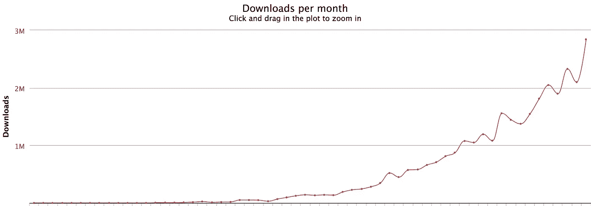

# 2019 年要学习的热门 JavaScript 框架和主题

> 原文：<https://medium.com/javascript-scene/top-javascript-frameworks-and-topics-to-learn-in-2019-b4142f38df20?source=collection_archive---------1----------------------->

Image: Jon Glittenberg Happy New Year 2019 (CC BY 2.0)

# 你掉进了时光倒流机！
[点击这里回到 2020 年。](/javascript-scene/top-javascript-frameworks-and-topics-to-learn-in-2020-and-the-new-decade-ced6e9d812f9)

又到了一年一度的时候:JavaScript 技术生态系统的年度概览。我们的目标是突出具有最高潜在工作投资回报率的学习主题和技术。人们在工作中使用什么？趋势是什么样的？当面试官问你:“你知道 __(填空)_ _ _”时，我们并不试图挑选什么是最好的，而是使用数据驱动的方法来帮助你专注于可能真正帮助你找到工作的东西

我们不打算看哪个是最快的，或者哪个具有最好的代码质量。我们假设他们都是速度恶魔，他们都足够好来完成任务。焦点集中在一件事上:实际上在大规模使用什么？

# 组件框架

我们要关注的大问题是组件框架的当前状态，我们将主要关注三大组件:React、Angular 和 Vue.js，主要是因为它们在工作场所采用方面都远远领先于其他组件。

去年，我注意到 Vue.js 的增长速度有多快，并提到它可能在 2018 年赶上 Angular。这并没有发生，但它仍在快速增长。我还预测，转化 React 用户会困难得多，因为 React 的用户满意度比 Angular 高得多——React 用户根本没有令人信服的理由来转换。这在 2018 年如期进行。React 在 2018 年牢牢占据了领先地位。

有趣的是，这三个框架每年都在呈指数增长。

## 预测:React 在 2019 年继续占据主导地位

React 仍然拥有比 Angular 高得多的满意度，这是我们连续第三年跟踪它，它没有向挑战者放弃任何阵地。我目前看不到任何可能在 2019 年挑战它的东西。除非有什么疯狂的大事情出现并扰乱它，否则 React 将是 2019 年底再次击败的框架。

说到反应，越来越好了。新的 [React 钩子 API](https://reactjs.org/docs/hooks-reference.html) 取代了自 React 0.14 以来我一直忍受的`class` API。(`class` API 仍然工作，但是 hooks API 确实*好得多*)。React 伟大的 API 改进，比如对代码拆分和并发渲染的更好支持(见[细节](https://reactjs.org/blog/2018/11/13/react-conf-recap.html))，将在 2019 年让它变得很难被击败。毫无疑问，React 现在是这个领域中对开发者最友好的前端框架。我不能推荐它。

## 数据源

我们将通过一些关键数据来衡量行业的兴趣和用途:

1.  **谷歌搜索趋势。不是我最喜欢的指标，但有利于宏观视野。**
2.  **包下载。**这里的目标是在使用框架的过程中抓住真正的用户。
3.  **来自 Indeed.com 的求职公告板。**为保持一致性，使用前几年的相同方法。

## **谷歌搜索趋势**

Framework search trends: Jan 2014 — Dec 2018

React 在 2018 年 1 月的搜索趋势中超过 Angular，并在年底保持领先地位。Vue.js 现在在图表上占据了明显的位置，但在搜索趋势中仍然是一个小因素。对比一下:去年的图表:

Framework search trends: Jan 2014 — Dec 2017

## 包下载

包下载给了我们一个实际使用的公平指示，因为开发人员经常在他们工作的时候下载他们需要的包。

过度聪明的读者会注意到，有时他们会从他们内部的公司软件包回购协议中下载这些东西，对此我回答说，“是的，这确实会发生——所有三个框架都是如此。”他们都已经在企业中站稳了脚跟，我对大规模数据的平均能力充满信心。

**React 月下载量:2014–2018**

**Angular 月下载量:2014–2018**

**Vue 月下载量:2014–2018**

让我们来看看下载份额的快速直观对比:

“但是你完全忘记了 Angular 1.0！这在企业中仍然是巨大的。”

不，我没有。Angular 1.0 仍然在企业中大量使用，就像 Windows XP 仍然在企业中大量使用一样。它肯定有足够多的数量值得注意，但是新版本早就让它相形见绌，以至于它现在没有其他框架重要。

为什么？因为整个软件行业，以及所有部门(包括企业)对 JavaScript *的全面使用*增长如此之快，以至于新安装的软件很快让旧安装的软件相形见绌，即使传统应用*从不升级。*

作为证据，再看看那些下载图表。2018 年的下载量超过了前几年*的总和。*

## 工作公告板发布

Indeed.com 汇总了来自各种职务公告板的职务公告。每年，*我们都会统计提到每个框架的招聘信息*，让你更好地了解人们招聘的目的。这是今年的情况:

Dec 2018 Job Board Postings Per Framework

*   反应:24640
*   角度:19032 度
*   jQuery:14272
*   Vue: 2，816
*   烬(没有照片):2397

同样，今年的工作岗位总数比去年多了很多。我放弃了 Ember，因为它显然没有以其他事物的速度增长。我不建议学习它来为将来的工作做准备。jQuery 和 Ember 乔布斯变化不大，其他都成长了不少。

令人欣慰的是，2018 年加入软件工程领域的新人数量也增长了很多，但我们需要继续雇佣和培训初级开发人员(这意味着我们需要[合格的高级开发人员来指导他们](https://devanywhere.io))，否则我们将无法跟上爆炸性的就业增长。作为比较，这里是去年的图表:

平均工资在 2018 年再次攀升，从 110 万美元/年升至 111 万美元/年。有趣的是，薪资清单落后于新员工的预期，如果招聘经理不根据开发商的市场进行调整并提供更大的加薪，他们将很难雇用和留住开发商。2018 年，随着员工跳槽去其他地方寻找高薪工作，留住和挖人仍然是一个巨大的问题。

1.  ***方法论:*** *对 Indeed.com 进行求职调查。为了剔除误报，我将搜索与关键词“软件”配对，以加强相关性，然后乘以约 1.5(大致是使用“软件”和不使用“软件”的编程工作列表之间的差异)。)所有 SERPS 都按日期分类，并抽查相关性。得到的数字不是 100%准确，但是对于本文中使用的相对近似值来说已经足够好了。*

# JavaScript 基础知识

我每年都这么说:关注基本面。今年你会得到一些额外的帮助。所有的软件开发都是组合:将复杂的问题分解成更小的问题，并将这些更小问题的解决方案组合成应用程序的行为。

但是当我问 JavaScript 受访者软件工程中最基本的问题时，“什么是函数组合？”以及“什么是物体构成？”他们几乎总是不能回答这些问题，尽管他们每天都在做。

我早就认为这是一个需要解决的非常严重的问题，所以我写了一本书，主题是: [**【排版软件】**](https://leanpub.com/composingsoftware) 。

> 2019 年不学别的，就好好学学怎么编软件吧。

## 在打字稿上

TypeScript 在 2018 年继续增长，它继续被高估，因为[类型安全似乎不是真的](/javascript-scene/the-shocking-secret-about-static-types-514d39bf30a3)(似乎没有减少多少生产 bug 密度)，没有 TypeScript 帮助的 JavaScript 中的[类型推断](/javascript-scene/you-might-not-need-typescript-or-static-types-aa7cb670a77b)确实相当不错。您甚至可以使用 TypeScript 引擎通过 Visual Studio 代码在普通 JavaScript 中获得类型推断。或者为你喜欢的编辑器安装 Tern.js 插件。

对于大多数高阶函数，TypeScript 仍然表现平平。也许我只是不知道如何正确地使用它(多年来经常使用它——在这种情况下，他们真的需要改善可用性、文档或两者都改善),但我仍然不知道如何在 TypeScript 中正确地键入地图操作，并且它似乎对[转换器](/javascript-scene/transducers-efficient-data-processing-pipelines-in-javascript-7985330fe73d)中发生的任何事情都漠不关心。它无法捕捉错误，并且经常抱怨根本不是真正错误的错误。

它不够灵活，功能也不够全面，不足以支持我对软件的看法。但我仍然希望有一天它会添加我们需要的功能，因为尽管它的缺点让我在尝试将它用于实际项目时感到沮丧，但我也喜欢在它真正有用时能够正确(和选择性地)键入东西的潜力。

我目前的评价:在非常精选的受限用例中非常酷，但是被高估了，笨拙，对于大型生产应用来说投资回报率非常低。这很讽刺，因为 TypeScript 自称是“可伸缩的 JavaScript”。也许他们应该加上一个词:“JavaScript 难以扩展。”

JavaScript 需要的是一个更多模仿 Haskell，而不是 Java 的类型系统。

## 要学习的其他 JavaScript 技术

*   [GraphQL](https://graphql.org/) 用于查询服务
*   [恢复](https://redux.js.org/)管理应用状态
*   [还原传奇](https://github.com/redux-saga/redux-saga)隔离副作用
*   [react-feature-toggles](https://github.com/paralleldrive/react-feature-toggles) 简化连续交付和测试
*   美观易读的单元测试

# 密码产业的崛起

去年，我预测区块链和金融科技将是 2018 年值得关注的大科技。那个预测完全正确。2017-2018 年的主题之一是加密的兴起和建立**价值互联网的基础。**记住这句话。你很快就会听到很多。

如果你和我一样，自从 P2P 爆炸以来，你一直在关注去中心化的应用程序，这已经是很长一段时间的事情了。现在，比特币点燃了导火索，并展示了去中心化的应用如何能够使用加密货币自我维持，爆炸是不可阻挡的。

比特币在短短几年内增长了几个数量级。你可能听说过 2018 年是“密码冬天”，并认为密码行业陷入了某种困境。那完全是胡说八道。真正发生的是在 2017 年底，比特币在史诗般的指数增长曲线中又达到了 10 倍的倍数，市场又回调了一点，每当比特币市值再增长 10 倍时就会发生这种情况。

Bitcoin 10x Inflection Points

在这个图表中，每个箭头从另一个 10 倍点开始，指向价格修正的低点。

crypto ICOs(初始硬币发行)的融资在 2018 年初达到顶峰，2017-2018 年的融资泡沫为生态系统带来了一系列新的职位空缺，在 2018 年 1 月达到顶峰，超过 1 万个职位空缺。据 Indeed.com 报道，这一数字已经回落到 2400 英镑左右，但我们现在还很早，这场派对才刚刚开始。

关于新兴的加密行业还有很多要说的，但那是另外一篇博文了。如果你有兴趣，请阅读[“2019 年值得关注的区块链平台和技术”](/the-challenge/blockchain-platforms-tech-to-watch-in-2019-f2bfefc5c23)。

## 其他值得关注的技术

正如去年预测的那样，这些技术在 2018 年继续爆发:

**人工智能/机器学习**正在如火如荼地进行，2018 年底有 3 万个空缺职位，深度假货，难以置信的生成艺术，Adobe 等公司研究团队令人惊叹的视频编辑能力——探索人工智能从未像现在这样令人兴奋。

**渐进式网络应用**正在迅速成为现代网络应用的正确构建方式——增加了来自谷歌、苹果、微软、亚马逊等公司的功能和支持。令人难以置信的是，我这么快就把手机上的 PWAs 当成了理所当然。例如，我的手机上不再安装 Twitter Android 应用程序。我只使用推特 PWA 而不是 T11。

**AR** (增强现实) **VR** (虚拟现实) **MR** (混合现实)都聚在一起，像 Voltron 一样联合起来，成为 **XR** (扩展现实)。全职 XR 沉浸的未来来了。我预测在 5-10 年内，消费者会大量采用 XR 眼镜。20 以内的隐形眼镜。2018 年开辟了数千个新的工作岗位，这个行业在 2019 年将继续爆发。

**机器人、无人机、自动驾驶汽车**自动驾驶飞行无人机已经在这里，自动驾驶机器人不断完善，更多的自动驾驶汽车正在 2018 年底与我们共享道路。从 2019 年到未来 20 年，这些技术将继续发展并重塑我们周围的世界。

**量子计算**在 2018 年取得了令人钦佩的进展，正如预测的那样，正如预测的那样，它还没有成为主流。事实上，我的预测“可能要到 2019 年或更晚，颠覆才会真正开始”可能非常乐观。

密码领域的研究人员对量子安全加密算法给予了额外的关注(量子计算将使今天许多关于计算成本高昂的假设无效，而密码依赖于计算成本高昂的东西)，但尽管 2018 年不断涌现出大量有趣的研究进展，最近的一份报告[让人们看到了一些东西](https://www.theregister.co.uk/2018/12/06/quantum_computing_slow/):

> “从 2000 年到 2017 年，量子计算已经在 Gartner 的炒作名单上出现了 11 次，每次都出现在炒作周期的最早阶段，每次都说是在十多年后。”

这让我想起了早期的人工智能努力，这些努力在 20 世纪 50 年代开始升温，在 20 世纪 80 年代和 90 年代取得了有限但有趣的成功，但只是在 2010 年左右才开始真正令人震惊。

[Start your free lesson on EricElliottJS.com](https://ericelliottjs.com/premium-content/lesson-pure-functions)

***艾里克·艾略特*** *著有《书籍》、* [*【排版软件】*](https://leanpub.com/composingsoftware)*[*【编程 JavaScript 应用】*](http://pjabook.com) *。作为*[*【EricElliottJS.com】*](https://ericelliottjs.com)*和*[*devanywhere . io*](https://devanywhere.io)*的联合创始人，他教授开发者必备的软件开发技能。他为加密项目组建开发团队并提供建议，为 Adobe Systems、* ***、Zumba Fitness、*** ***《华尔街日报》、*******【ESPN、*******BBC、*** *和顶级录音师(包括****【Usher】******

**他和世界上最美丽的女人享受着与世隔绝的生活方式。**