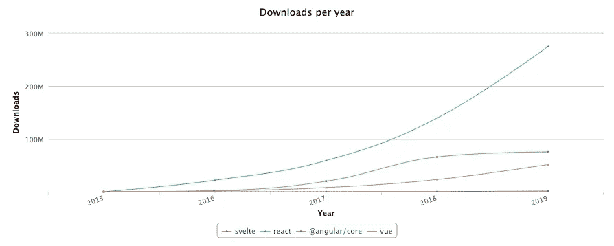
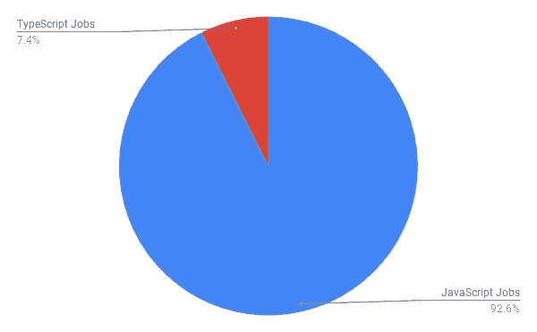

# 2020 年和新十年要学习的顶级 JavaScript 框架和主题

> 原文：<https://medium.com/javascript-scene/top-javascript-frameworks-and-topics-to-learn-in-2020-and-the-new-decade-ced6e9d812f9?source=collection_archive---------0----------------------->

如果你想获得一份很棒的 JavaScript 工作，或者想了解 2020 年的重要技术和未来十年的重要技术，这篇文章就是为你准备的。这篇文章的重点不是告诉你哪些技术栈和框架是“最好的”或最受欢迎或最受欢迎的，而是告诉你哪些技术栈和框架最有可能在 2020 年及以后获得一份好工作。

我们将查看来自各种来源的数据:

*   [按主题分类的谷歌搜索趋势](https://trends.google.com/trends/)
*   [JS 调查状态](https://2019.stateofjs.com/)
*   [堆栈溢出调查](https://insights.stackoverflow.com/survey/2019)
*   [Npm 下载量](https://npm-stat.com/charts.html?package=react&package=vue&package=%40angular%2Fcore&package=svelte&package=jquery&from=2015-12-30&to=2019-12-30)
*   [汇总的职位发布](https://www.indeed.com/)

这些指标没有一个是完美的，但是对于我们的目的来说，npm 下载计数和职位发布获得了最大的权重，当我们从整体上看这些指标时，它们描绘了 JavaScript 技术前景和趋势的清晰一致的画面。根据这些指标选择一个框架来学习是个好主意吗？那取决于你的目标。

因为我们有一个明确的目标——为求职者了解投资回报率——这比试图告诉你什么对每个人最好要容易得多。虽然没有对所有目的都是最好的这种东西，但是客观地定义什么会给你实现一个特定的、具体的目标带来最好的机会还是很容易的。我们来看一些数据。

# 首先，学习 JavaScript

在你过于担心技术栈之前，先学习 JavaScript 以及如何用它来编写软件。如果不能解释什么是函数组成，对象组成，模块，[从这里开始](/javascript-scene/composing-software-the-book-f31c77fc3ddc)。所有的软件开发都是组合:我们把一个大的、复杂的问题分解成更小的问题，我们可以用软件的构件来解决:功能、对象、模块等等。我们将这些解决方案组合起来，形成我们的应用程序。从很好的理解 JavaScript 和软件组成开始 2020 年。

# React 主导了 2019 年，很可能会主导 2020 年

我喜欢 npm 下载量指标，因为它很好地显示了一个框架的活跃使用情况*。行业中普遍使用的框架在下载上得分会非常高，因为用户在他们的本地机器上运行`npm install`。

***注意:*** *jQuery 在这里被排除在外，因为许多 jQuery 项目是不使用 npm 的遗留项目，所以无论如何它都会被严重低估。Svelte 被包括在内是为了提供一些关于其在市场中的相对地位的见解，并解释其在其余图表中的缺席——目前还没有足够的数据让 Svelte 在图表中做出有意义的显示。例如，它还不是谷歌搜索趋势中的一个可用主题。*

# 汇总的职位发布

此图表统计了提及特定框架的当前空缺职务公告。*

Dec 2019 Job Board Listings by UI Framework — [Source](https://indeed.com)

React 巩固了与去年相比的领先优势，而 Angular 和 jQuery 都输给了 Vue。这是一个饼图，显示了每个框架的相对就业市场份额:

Top Framework Job Market Share

2019 年 JavaScript 开发者平均薪资再次上涨，从 11.1 万美元/年涨到 11.4 万美元/年([来源](https://www.indeed.com/salaries/javascript-developer-Salaries))。

****方法论:*** *对 Indeed.com 进行求职调查。为了剔除误报，我将搜索与关键词“软件”配对，以加强相关性，然后乘以约 1.5(大致是使用“软件”和不使用“软件”的编程工作列表之间的差异)。)所有 SERPS 都按日期分类，并抽查相关性。得到的数字不是 100%准确，但是对于本文中使用的相对近似值来说已经足够好了。*

# 谷歌搜索趋势

[Source](https://trends.google.com/trends/explore?date=2017-01-01%202019-12-01&q=%2Fm%2F012l1vxv,%2Fg%2F11c6w0ddw9,%2Fg%2F11c0vmgx5d,%2Fm%2F0268gyp)

正如你所料，搜索兴趣*在一定程度上反映了就业市场份额，但也有一些有趣的差异。我们可以清楚地看到，从 2017 年到今天，人们对 jQuery 的兴趣正在减弱，而 Vue.js 搜索兴趣却在强劲增长。以下是搜索共享:

与招聘信息一样，React 遥遥领先，吸引了 36%的前端框架搜索量，其次是 Angular 和 jQuery，分别占 27%和 25%。Vue.js 的搜索兴趣远远大于其就业市场份额，但这一数据通常与排名中的就业市场数据一致。看起来我们成功地证实了。

****方法:*** *对于所有术语，数据是按主题收集的，而不是按搜索术语收集的，以便从不相关的关键字匹配中剔除误报。*

# 未来值得关注的框架

比起其他流行的，但不太广泛使用的框架，如 Svelte 或 Vue(这两个框架都有很高的满意度，但相对来说行业采用率要低得多)，更多的工作在寻找 React 的技能。

> 学习 Svelte 或 Vue 可能很酷——但是如果你的目标是找工作，如果你先学习 React，你会有更好的机会。

也就是说，[Svelte 和 Vue 在 JavaScript 2019 年状态调查中的用户满意度得分都很高](https://2019.stateofjs.com/front-end-frameworks/)。在过去，React 的高用户满意度得分预示着相对于 Angular 的快速增长，Angular 当时占主导地位，但满意度得分相对较低。

2019 年，React 以 89%的用户满意度排名用户满意度最高。亚军包括 Svelte (88%)和 vue . js(87%——低于去年的 91%)。Svelte 或 Vue 不太可能抢走足够多的 React 用户，但仍有许多使用 Angular 和 jQuery 的用户可能会转向 Svelte 或 Vue，从而推动这两个框架在 2020 年进一步强劲增长。

> 很有可能，掌握 React 将增加你在 2020 年找到并保住一份好工作的几率。

# 类型脚本与 JavaScript

毫无疑问，TypeScript 在过去几年中发展非常迅速，根据 JavaScript 的调查结果， [89%的 TypeScript 用户](https://2019.stateofjs.com/javascript-flavors/)会再次使用它，66%的调查受访者要么使用 TypeScript，要么对使用 TypeScript 感兴趣(比去年的 71%略有下降)。

但是，尽管人们对打字稿的兴趣的确很浓厚，使用量似乎也在迅速增长，但在就业市场上，打字稿的使用经验还不是很抢手。只有大约 7%的 JavaScript 职位空缺在职位描述中提到了 TypeScript([来源](https://www.indeed.com/))。这可能有点低估了 TypeScript 工作，因为招聘经理希望 JavaScript 开发人员能够毫不费力地掌握 TypeScript，所以他们有可能不会在招聘信息中提及 TypeScript。

我袖手旁观我的评估是[打字稿语言的投资回报可能很低，甚至是负的](/javascript-scene/the-typescript-tax-132ff4cb175b)。这可能会损害而不是提高您的生产力，如果您已经使用了很好的错误预防措施，如 TDD、代码审查和设计审查，那么用 TypeScript 编码不太可能提供显著的减少错误的好处。

也就是说，TypeScript 有很多优点，你当然不应该害怕它，或者因为他们使用 TypeScript 而不是 JavaScript 而拒绝一份工作。因为 TypeScript 是 JavaScript 的超集，所以从 JavaScript 到 TypeScript 的过渡不像学习一种完全不同的语言那样困难。

你可能不需要学习 TypeScript 语言来在 2020 年的就业市场竞争中获得优势，但 TypeScript 引擎非常有用，即使对于标准 JavaScript 也是如此。

我每天都用它来为使用 Visual Studio 代码的标准 JavaScript 提供[智能感知。甚至可以使用 JSDoc(类型脚本引擎理解并解释它，就像它解释类型批注一样)或外部 d.ts 文件来增强智能感知，VS 代码将自动获取您使用的模块的类型脚本定义。](https://code.visualstudio.com/docs/nodejs/working-with-javascript)

***注:*** *我使用 TernJS 和 Atom 已经享受了几年类似的好处，但是那个组合缺少 TypeScript 引擎+ VS 代码的维护和社区支持。*

如果您还没有尝试过 Visual Studio 代码，您可能想从那里开始。顺便说一下， [VS Code 在 State 的受访者中主导了 JavaScript IDE 市场](https://2019.stateofjs.com/other-tools/)，拥有 57%的市场份额(其次是 WebStorm，拥有 14%的市场份额)。

# 数据管理

Redux 在州经理竞选中仍然遥遥领先，但 GraphQL 和 Apollo 的满意度和兴趣正在上升。预计 GraphQL 将在 2020 年继续增长。

也就是说，即使你使用 GraphQL，我仍然认为 Redux 状态管理有很强的理由，我认为每个人都会从学习 Redux 中受益，即使他们不使用这个框架。

GraphQL 是近年来流行的一种查询语言。它的语法很简单，但是因为它在整个堆栈中使用，并且学习它需要学习如何将其与您的数据存储层联系起来，所以集成起来可能会很困难——但是非常值得。

GraphQL 不会很快完全取代 JSON REST APIs，但它在 2019 年增长更快，我预计强劲的增长将持续到 2020 年。

# 后端

Express 是占主导地位的节点框架，满意度非常高，到 2020 年没有严重的挑战，但随着无服务器的兴起，我预计随着新十年的展开，Express 的主导地位将会下降。

[Next.js](https://nextjs.org/) 是一个全栈 React 框架，最初构建在 Express 之上，但后来从 Express 转向了**无服务器**和静态优化，并且它正在疯狂增长。

当我们将[EricElliottJS.com](https://ericelliottjs.com)从 Express 切换到无服务器 Next.js 时，我们的托管费用减少了 90%,页面加载速度也加快了。我不能强烈推荐它。我们现在使用 Next.js 和 [Vercel 托管](https://vercel.com/)我们所有的应用。

# 测试

Jest 和 Cypress 分别是最受欢迎的单元测试和功能测试，但是我更喜欢 [RITEWay](https://github.com/ericelliott/riteway) 和 [TestCafe](https://devexpress.github.io/testcafe/) 。RITEWay 是单元测试禅:一个测试框架，它总是回答每个单元测试必须回答的 [5 个问题](/javascript-scene/what-every-unit-test-needs-f6cd34d9836d)。

TestCafe 是一个功能测试工具，和 Cypress 一样，它不需要你与 Selenium 斗争，但是它有更好的跨浏览器支持和一个很酷的测试记录器/IDE。我强烈建议 QA 团队去看看 TestCafe。

# 功能工具

Lodash、Ramda、Immer、Redux、RxJS 是我经常使用的功能工具。

Ramda 在 2019 年成长了很多，提供了一些 Lodash 没有的工具，包括[镜头](/javascript-scene/lenses-b85976cb0534)和[换能器](/javascript-scene/transducers-efficient-data-processing-pipelines-in-javascript-7985330fe73d)。RxJS 通过其[管道操作器](https://github.com/ReactiveX/rxjs/blob/master/doc/pipeable-operators.md)提供传感器式功能。

Immer 使得在不改变 JavaScript 对象的情况下对其进行操作变得很容易。Redux 是一个状态管理工具。

# 2020 年的科技格局

有几项新兴技术将在未来十年对人类生活产生巨大影响。以下是每种技术的现状:

## 人工智能

人工智能可能是有史以来最具变革性的技术。各种学者和固执己见的亿万富翁将人工智能描述为一个奇迹般的乌托邦，或人类的末日。

正如我们所知，这当然可能是人类的终结，但也可能是人类和机器之间美好合作的开始。我们只是开始隐约看到人工智能会变成什么样子。有些很吓人(比如[深度假货](https://www.youtube.com/watch?v=cQ54GDm1eL0))，有些非常有用(比如 Adobe Premiere 新推出的[视频编辑自动重构](https://www.youtube.com/watch?v=4ZHRV_-yXSY))。到目前为止的事实是，人工智能既令人难以置信地可怕，又令人难以置信地有用。人工智能将继续带来一些可怕的东西，但人工智能改善人类生活的潜力是巨大的。潘多拉的盒子已经打开了，再也关不上了，所以我希望你能好好利用它来解决重要问题，改善生活。

2019 年，人工智能领域有许多重要突破。近年来，研究团队一直在各种视频游戏中争夺超人的性能，但一些类别的游戏对人工智能来说仍然具有挑战性，包括长期战略游戏，如星际争霸 2。DeepMind 的 [AlphaStar 程序](https://deepmind.com/blog/article/AlphaStar-Grandmaster-level-in-StarCraft-II-using-multi-agent-reinforcement-learning)在 Battle.net 官方服务器上使用人类玩家可以访问的相同资源，已经达到了大师级的游戏水平。星际争霸是一个复杂的游戏，涉及长期的战略思维，曾经被认为超出了人工智能的能力。战略思维代表了通往通用人工智能道路上的一个重要里程碑。

如果这些游戏看起来像是对资源的愚蠢使用，那么考虑一下像 DeepMind 这样的项目也在文本到语音转换方面取得了令人难以置信的进步，这可以给人工智能代理和个人助理更多自然的声音，但更重要的是，[将声音还给失去它们的人类](https://youtu.be/V5aZjsWM2wo?t=1650)。

人工智能还被用于诊断癌症、预测蛋白质折叠(可用于了解疾病和发现新药)、恢复残疾人的肢体控制、生成逼真的图像等。([来源](https://www.stateof.ai/))

自动驾驶汽车在变革型人工智能技术中值得拥有自己的类别。这个生态系统中的大玩家包括克鲁斯、优步、Waymo、Nuro、Aurora、福特等。现在还为时尚早，过度乐观已经给这个行业带来了真正的问题，但我毫不怀疑我们将在 21 世纪 20 年代看到超人的自动驾驶能力。我对 2015 年的自驾做了一个预测:

> "到 2045 年，人类驾驶汽车将看起来像一匹拉着童车的马."

5 年后，我想我可能低估了自动驾驶汽车上市的速度。2018 年，Waymo 车辆行驶了超过 100 万英里，24 个美国城市的公共道路上有自动驾驶汽车。今天，我预测到 2025 年，来自多家制造商的多种车型将实现完全的第 5 级自主。请关注特斯拉、通用、福特和宝马。

人工智能研究论文出版物在过去十年中增长了 10 倍，现在人工智能正在将实用、有用的工具放到主流用户手中，预计这一趋势将持续到新的十年。

我们已经开始看到人工智能做一些仅仅在几年前大多数人都不相信可能的事情。期待人工智能在 2020 年代创造更多惊人的奇迹。

## 区块链和加密货币

2019 年是区块链和加密货币世界中具有纪念意义的一年。区块链技术开始闯入主流。我期待在 2020 年有更多的增长和主流采用。

DeFi 爆炸式增长，实现了用户友好、无权限和无银行借贷。目前有[6.5 亿美元](https://defipulse.com/)锁定在 DeFi 合同中(包括 4.5 亿美元的无银行贷款)，2019 年是这项技术可用的第一年。随着越来越多的人投资加密货币，我预测未来会有更多加密支持的 DeFi 贷款。

人们可以在不牺牲其加密投资的机会成本的情况下获得流动性，或者使用 DeFi 贷款以杠杆方式投资加密(增加其投资的风险/回报)。

加密和区块链技术正在突破主流。比特币和以太坊的日活跃地址在 2018 年 1 月达到峰值，随后一年由于市场下跌，人们的兴趣逐渐减弱(在每 10 倍的攀升后，加密价格会大幅回落，然后在下一个周期中攀升至高于前一个峰值 10 倍的水平)。

Daily Active Addresses on the Bitcoin and Ethereum Blockchains ([Source](https://coinmetrics.io/charts/#assets=btc,eth_log=false_roll=90_left=AdrActCnt_zoom=1279411200000,1577836800000))

*   **Square 的** [**现金 App**](https://cash.app/) **安卓下载量超 1000 万**——用户可以在一个简单的 App 中买卖、收发比特币，UX 很大。
*   [**比特币基地**](https://www.coinbase.com/) **安卓下载量超过 1000 万。**
*   [**勇者**](https://brave.com/) **推出内置以太坊钱包**从 10 月份的 870 万月活跃用户到 11 月底的[**1040 万 MAU**](https://twitter.com/BrendanEich/status/1202703230154633216) 。
*   得益于[silver . TV](https://www.sliver.tv/)和 [DLive](https://dlive.tv/) ，2000 万视频游戏迷正在使用 Theta 网络进行分散流媒体播放。

2019 年我最喜欢的发展是 [**Fortmatic**](https://fortmatic.com/) 的推出。无论您是否正在构建一个加密应用程序，您都可以用 Fortmatic 取代您的用户身份验证并提高安全性，摆脱供应商锁定，并添加端到端加密、签名交易等功能。

如果你在 2020 年开发一个新的应用，考虑使用 Fortmatic，而不是使用你自己的用户名/密码认证(在 2020 年[没人会这么做](https://haveibeenpwned.com/))，或者授权给谷歌、脸书等等。

我写了一篇文章讨论如何[利用加密技术来提高应用程序的认证和安全性](/javascript-scene/improving-user-authentication-and-security-ddb60b1ef69b)。我期待着在 2020 年看到主流应用程序采用像 Fortmatic 这样的技术。

[以太坊](https://ethereum.org/)轻松拿下 2019 年智能合约平台赛。我预测它将在 2020 年继续占据主导地位。

# 扩展现实

我从 2015 年开始每年都写 AR 的承诺，从小就梦想着。在未来，XR 将取代手机。这只是时间问题。多少时间仍然是一个悬而未决的问题，但看起来这种转变可能会在未来十年内发生。它甚至可能在未来 5 年内开始。

随着 VR 和 AR 之间的界限变得模糊，业界现在将整个领域称为 XR(扩展现实)。 [ARKit](https://developer.apple.com/augmented-reality/) 和 [ARCore](https://developers.google.com/ar/discover) (苹果和谷歌的增强现实 SDK)自推出以来已经成长了很多。[从 2017 年到 2019 年 5 月，月活跃用户从 4700 万增长到 1.5 亿](https://mobidev.biz/blog/augmented-reality-future-trends-2018-2020)。

WebAR 在 2019 年站稳了脚跟，并有可能在 2020 年继续增长。如果你很好奇，可以看看 [AR.js](https://github.com/jeromeetienne/AR.js/) 、 [React 360](https://facebook.github.io/react-360/) 或 [Viro React](https://viromedia.com/viroreact) 。

硬件有了很多进步。Hololens 1 在 2016 年首次发布开发者版时的价格约为 5k 美元。从那以后发生了什么？

Hololens 2 仍然是 3500 美元，他们还没有为消费者做好准备。仍然存在削波、SLAM(抖动和漂移)、视野等问题。你不想整天戴着这些东西。但是由于 99 美元/月的定价，即使您不得不在等候名单上等待一段时间，您也有可能得到一个开发工具包。

# 嗡嗡声

美国已经销售了大约 200 万架无人机，它们已经改变了建筑、地理勘测、测绘、电影、航空摄影、农业、环境科学和娱乐。2020 年，美国很有可能最终实现商用无人机送货。

FPV 无人机竞速是我最喜欢的观赏性运动，无人机竞速联盟直播流比赛。他们还有[，一个精心设计的模拟器](https://store.steampowered.com/app/641780/The_Drone_Racing_League_Simulator/)，如果你想了解它是什么样子的。

所有这些新的无人机活动都需要大量的软件，包括图像处理、无人机测绘软件、交付的飞行规划、遥测记录和处理、分析、行业应用集成等。

与人工智能也有很多重叠——自动飞行的无人机需要图像处理、防撞等等。

# 结论

2010 年给了我们许多变革性的技术，其中许多我们已经习以为常，但却产生了巨大的影响:

*   照片墙
*   Spotify
*   优步
*   虚拟助手
*   无线耳塞
*   主流虚拟现实
*   增强现实(如热门游戏《T4》中使用的那样)
*   负担得起的特斯拉
*   共享经济(汽车、滑板车、自行车)
*   主流平板电脑
*   主流生物识别技术(触摸识别、面部识别)
*   众筹

我迫不及待地想看看你在新的十年里会建设什么。

> 变点魔法。

# 后续步骤

在[EricElliottJS.com](https://ericelliottjs.com/)上学习 React、Redux、Next.js、TDD 和更多。访问会员视频课程和互动代码练习的宝库。

***艾里克·艾略特*** *著有《书籍》、* [*【排版软件】*](https://leanpub.com/composingsoftware)*[*【编程 JavaScript 应用】*](https://pjabook.com) *。作为*[*【EricElliottJS.com】*](https://ericelliottjs.com/)*和*[*devanywhere . io*](https://devanywhere.io/)*的联合创始人，他教授开发者必备的软件开发技能。他为加密项目组建开发团队并提供建议，为 Adobe Systems、* ***、Zumba Fitness、*** ***【华尔街日报、*******【ESPN、*******BBC、*** *以及包括* ***Usher、弗兰克·奥申、金属乐队在内的顶级录音******

**他和世界上最美丽的女人享受着与世隔绝的生活方式。**