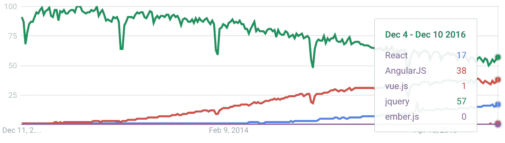
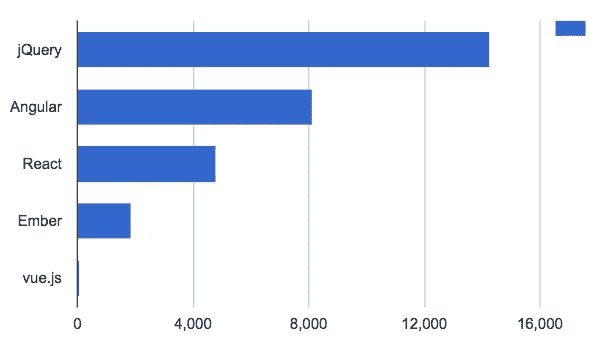

# 2017 年要学习的热门 JavaScript 框架和主题

> 原文：<https://medium.com/javascript-scene/top-javascript-frameworks-topics-to-learn-in-2017-700a397b711?source=collection_archive---------0----------------------->

# 你掉进了时光倒流机！
[点击这里回到 2020 年。](/javascript-scene/top-javascript-frameworks-and-topics-to-learn-in-2020-and-the-new-decade-ced6e9d812f9)

JavaScript 的流行导致了一个非常活跃的技术、框架和库的生态系统。伴随着生态系统中惊人的多样性和能量而来的是许多人的高度困惑。你应该关心哪些技术？

你应该把你的时间投资在哪里以获得最大的收益？公司现在在招聘哪些技术人员？哪些最有增长潜力？

现在需要了解的最重要的技术是什么？这篇文章高度概括了你需要知道的东西，并附有链接，在那里你可以了解到所有相关信息。

请记住，当您学习用一些实际的代码进行实验时。可以在 [Codepen.io](http://codepen.io/) 上互动玩代码。如果你还在学习 ES6，你可以使用[巴别塔 REPL](https://babeljs.io/repl/) 看看它是如何翻译的。

这将是一个很长的列表，但不要气馁。你能做到的！如果你正在看这个列表，担心你将如何学习构建现代应用程序所需的一切，请阅读[“为什么我感谢 JavaScript 疲劳”](/javascript-scene/why-im-thankful-for-js-fatigue-i-know-you-re-sick-of-those-words-but-this-is-different-296fae0c888f)。然后认真工作。

## 关于可选学习的一个注记

有些东西是严格可选的，也就是说，如果你对它们感兴趣，或者你为了工作需要了解它们，我会推荐它们，但是你不应该觉得有义务去学习它们。任何标有星号的内容(如**示例*** )都是可选的。

任何没有标*的都应该学习，但是不要觉得有义务去学习所有的知识。你需要意识到那些不可选择的东西，但是你不需要成为绝对每件事情的权威专家。

# JavaScript 和 DOM 基础知识

在你尝试使用 JavaScript 找工作之前，你应该很好地掌握 JavaScript 的基础知识:

*   [**ES6**](/javascript-scene/how-to-learn-es6-47d9a1ac2620)**:**JavaScript 的当前版本是 ES2016(又名 ES7)，但是很多开发者还没有正确学习 ES6。是时候学习至少[基础知识](/javascript-scene/a-functional-programmers-introduction-to-javascript-composing-software-d670d14ede30)了:箭头函数、rest/spread、默认参数、简洁的对象文字、析构等等…
*   [**闭包**](/javascript-scene/master-the-javascript-interview-what-is-a-closure-b2f0d2152b36) **:** 了解 JavaScript 的函数作用域是如何运作的。
*   **函数&**
*   [**函数式编程基础知识**](/javascript-scene/the-rise-and-fall-and-rise-of-functional-programming-composable-software-c2d91b424c8c#.rhe7ap36l) **:** 函数式编程通过组合数学函数产生程序，避免共享状态&可变数据。我已经很多年没有见过大量使用函数式编程的 JavaScript 应用了。是时候掌握基本面了。
*   [**局部应用&咖喱**](/javascript-scene/curry-or-partial-application-8150044c78b8)
*   **内置方法:**学习标准数据类型的方法(特别是[数组](https://developer.mozilla.org/en-US/docs/Web/JavaScript/Reference/Global_Objects/Array)、[对象](https://developer.mozilla.org/en-US/docs/Web/JavaScript/Reference/Global_Objects/Object)、[字符串](https://developer.mozilla.org/en-US/docs/Web/JavaScript/Reference/Global_Objects/String)和[数字](https://developer.mozilla.org/en-US/docs/Web/JavaScript/Reference/Global_Objects/Number))。
*   **回调:**回调是另一个函数使用的函数，当有结果准备好时发出信号。你说，“做你的工作，完成后打电话给我。”
*   [**承诺**](https://developers.google.com/web/fundamentals/getting-started/primers/promises) **:** 承诺是一种处理未来价值的方式。当一个函数返回一个承诺时，您可以使用`.then()`方法附加回调，以便在承诺完成后运行。解析后的值被传递到回调函数中，例如`doSomething().then(value => console.log(value));`

*   [**Ajax &服务器 API 调用**](https://github.com/mzabriskie/axios) **:** 大多数有趣的 app 最终都需要与网络对话。你应该知道如何与 API 通信。
*   [**类**](https://developer.mozilla.org/en-US/docs/Web/JavaScript/Reference/Classes) (注: [**避免类继承**](/javascript-scene/the-two-pillars-of-javascript-ee6f3281e7f3) )。见[如何利用班级和晚上睡觉](/@dan_abramov/how-to-use-classes-and-sleep-at-night-9af8de78ccb4)。)
*   [**生成器**](/javascript-scene/7-surprising-things-i-learned-writing-a-fibonacci-generator-4886a5c87710)**&**[**async/await**](/javascript-scene/the-hidden-power-of-es6-generators-observable-async-flow-control-cfa4c7f31435)**:**在我看来，编写看起来同步的异步代码的最好方式。它有一个学习曲线，但是一旦你学会了，代码会更容易阅读。
*   **性能:** [**导轨**](https://developers.google.com/web/fundamentals/performance/rail)**——**从[【page speed Insights】](https://developers.google.com/speed/pagespeed/insights/)&[【web pagetest . org】](https://www.webpagetest.org/)
*   **渐进式网络应用(PWAs):** 参见[“原生应用注定要失败”](/javascript-scene/native-apps-are-doomed-ac397148a2c0) & [“为什么原生应用真的注定要失败”](/javascript-scene/why-native-apps-really-are-doomed-native-apps-are-doomed-pt-2-e035b43170e9)
*   [**节点&Express**](/javascript-scene/introduction-to-node-express-90c431f9e6fd#.gl2r6gcnn)**:**节点让您可以在服务器上使用 JavaScript，这意味着您的用户可以在云中存储数据，并在任何地方访问数据。Express 是最受欢迎的节点框架。
*   [**洛达什**](https://lodash.com/) **:** 一个伟大的、模块化的 JavaScript 实用工具带，里面装满了函数式编程的好东西。从`lodash/fp`导入最新的功能模块。

# 工具作业

*   [**Chrome 开发工具**](https://developer.chrome.com/devtools)**:**[DOM inspect](https://developer.chrome.com/devtools#dom-and-styles)&[JS 调试器](https://developer.chrome.com/devtools#debugging-javascript):IMO 最好的调试器，不过 Firefox 也有一些非常酷的工具，你可能也想试试。
*   [**NPM**](https://www.npmjs.com/)**:**JavaScript 语言的标准开源软件包库。
*   [**git**](https://try.github.io/levels/1/challenges/1)**&**[**GitHub**](http://github.com/)**:**分布式版本管理器——随时跟踪您的源代码变化。
*   [**Babel**](https://babeljs.io/)**:**用于编译 ES6，以便在较老的浏览器上工作。
*   [**web pack**](https://webpack.github.io/)**:**标准 JavaScript 最流行的捆绑器寻找简单的初学者工具包/样板配置示例，让事情快速运行)
*   [**Atom**](https://atom.io/) **，** [**VSCode**](https://code.visualstudio.com/d?utm_expid=101350005-35.Eg8306GUR6SersZwpBjURQ.3&utm_referrer=https%3A%2F%2Fwww.google.com%2F) **，或者**[**WebStorm**](https://www.jetbrains.com/webstorm/)**+**[**vim**](http://vim.rtorr.com/)**:**你需要一个编辑器。Atom 和 VSCode 是当今最流行的 JS 编辑器。Webstorm 是另一个对高质量工具提供强大支持的解决方案。我建议学习 vim，或者至少用书签标记备忘单，因为迟早你会需要在服务器上编辑文件，这是最简单的方法——vim 安装在几乎所有的 Unix 兼容操作系统上，并且在 SSH 终端连接上运行良好。
*   [**ESLint:**](http://eslint.org/) 及早发现语法错误和样式问题。在代码审查和 TDD 之后，减少代码中的 bug 的第三个最好的方法。
*   [**Tern.js:**](https://ternjs.net/) 标准 JavaScript 的类型推理工具，也是目前我最喜欢的 JavaScript 类型相关工具——不需要编译步骤或注释。我已经尝试了所有的方法，Tern.js 提供了大部分的好处，而且几乎没有为 js 使用静态类型系统的成本。
*   [**Yarn**](https://yarnpkg.com/)***:**类似于 npm，但是安装行为是确定性的，Yarn 的目标是比 npm 更快。
*   [**TypeScript*:**](https://www.typescriptlang.org/) 静态类型为 JavaScript。*完全可选*除非你在学习 Angular 2+。如果您使用的不是 Angular 2+，那么在选择 TypeScript 之前应该仔细评估。我非常喜欢它，我也钦佩 TypeScript 团队的出色工作，但是您需要了解一些权衡。**必读:** [【关于静态类型的令人震惊的秘密】](/javascript-scene/the-shocking-secret-about-static-types-514d39bf30a3) & [【你可能不需要 TypeScript】](/javascript-scene/you-might-not-need-typescript-or-static-types-aa7cb670a77b)。
*   [**【流* 】:**](https://flowtype.org/)静态 JavaScript 类型检查器。参见[《打字稿 vs 流》](http://djcordhose.github.io/flow-vs-typescript/flow-typescript-2.html#/)对两者的深刻而客观的比较。请注意，即使使用[核素](https://nuclide.io/)，我也很难获得良好的 IDE 反馈。

# 反应

[**React**](https://facebook.github.io/react/) 是一个用于构建用户界面的 JavaScript 库，由脸书创建。它基于单向数据流的思想，这意味着对于每个更新周期:

1.  React 将组件的输入作为道具，如果 DOM 的特定部分的数据发生了变化，则有条件地呈现 DOM 更新。此阶段的数据更新无法重新触发渲染，直到下一个绘制阶段。
2.  事件处理阶段——在呈现 DOM 之后，React 自动将 DOM 事件委托给位于其 DOM 树根处的单个事件侦听器(以获得更好的性能)。您可以监听事件并更新数据作为响应。
3.  使用对数据的任何改变，该过程在 1 重复。

这与双向数据绑定相反，在双向数据绑定中，对 DOM 的更改可以直接更新数据(例如，Angular 1 和 Knockout 就是这种情况)。使用双向绑定，在 DOM 渲染过程中对 DOM 的更改(在 Angular 1 中称为摘要周期)可能会在绘制完成之前重新触发绘制阶段，从而导致回流和重画—降低性能。

React 没有规定数据管理系统，但是推荐使用基于流量的方法。React 的单向数据流方法借鉴了函数式编程和不可变数据结构的思想，改变了我们对前端框架架构的看法。

有关 React & Flux 架构的更多信息，请阅读[“学习编码的最佳方式是编码:通过构建应用来学习应用架构”](/javascript-scene/the-best-way-to-learn-to-code-is-to-code-learn-app-architecture-by-building-apps-7ec029db6e00)。

*   [**create-React-app *:**](https://github.com/facebookincubator/create-react-app)React 的最快入门方式。
*   [**react-router *:**](https://github.com/ReactTraining/react-router)死简单路由为 React。
*   [**Next.js*:**](https://zeit.co/blog/next) 死简单通用渲染&路由为节点&反应过来。
*   [**velocity-React *:**](https://github.com/twitter-fabric/velocity-react)React 动画——允许您使用 VMD 书签工具在页面上进行交互式视觉运动设计。

# Redux

[**Redux**](https://github.com/reactjs/redux) 为您的应用提供事务性、确定性的状态管理。在 Redux 中，我们迭代 action 对象流，以还原到当前的应用程序状态。要了解为什么这很重要，请阅读[“更好的 Redux 架构的 10 个技巧”](/javascript-scene/10-tips-for-better-redux-architecture-69250425af44)要开始使用 Redux，请查看 Redux 的创建者[丹·阿布拉莫夫](https://medium.com/u/a3a8af6addc1?source=post_page-----700a397b711--------------------------------)的优秀课程:

*   [**【Redux 入门】**](https://egghead.io/courses/getting-started-with-redux)
*   [**“用惯用 Redux 构建 React 应用程序”**](https://egghead.io/courses/building-react-applications-with-idiomatic-redux)

**Redux 是强制学习，即使你从来没有在一个生产项目中使用 Redux** 。

为什么？因为它会给你大量的实践，教会你使用**纯函数**的价值，教会你思考**归约器**的新方法，归约器是**通用函数**，用于迭代数据集合并从中提取一些值。减压器非常有用，因此`Array.prototype.reduce`被添加到 JS 规范中。

reducer 不仅仅对于数组很重要，学习使用 reducer 的新方法本身就很有价值。

*   [**redux-saga*:**](https://github.com/yelouafi/redux-saga) 一个用于 redux 的同步风格的副作用库。使用它来管理 I/O(例如处理网络请求)。

# 角度 2+*

[**Angular 2**](https://angular.io/)**+**是来自 Google 的广受欢迎的 Angular 框架的继承者。因为它的疯狂流行，它会在你的简历上看起来很棒——但我建议先学习 React。

比起角度 2 +我更喜欢[反应，因为:](/javascript-scene/angular-2-vs-react-the-ultimate-dance-off-60e7dfbc379c)

1.  更简单，而且
2.  它非常受欢迎，并在许多工作中使用(Angular 2+也是如此)

为此，我建议学习 React，但我认为 Angular 2+ **严格可选*** 。如果你对 Angular 2+有强烈的偏好，可以随意调换。先学 Angular 2+，考虑 React 可选。无论哪一种都会让你受益，并且在你的简历上看起来很棒。

无论你选择哪一个，试着专注于它至少 6 个月——在跑去学习另一个之前 1 年。真正沉入强大的熟练度是需要时间的。

# RxJS*

[**RxJS**](https://github.com/Reactive-Extensions/RxJS) 是一个针对 JavaScript 的反应式编程实用工具集合。把它想象成溪流的洛达什。反应式编程已经正式登上了 JavaScript 舞台。ECMAScript Observables 建议是第一阶段的草案，RxJS 5+是规范的标准实现。

虽然我很喜欢 RxJS，但是如果你一次导入所有的东西，**它真的会增加你的包的大小**(有很多操作符)。为了对抗包膨胀，不要全部导入。请改用修补程序导入:

使用补丁导入可以将包中 rxjs 依赖项的大小减少大约 200k。这真的是一件大事。它会让你的应用**快很多**。

# 编辑:为什么没有列出<your favorite="" thing="">？</your>

有几个人问我为什么不列出他们喜欢的框架。我考虑的一个重要标准是“这在实际工作中有用吗？”。

是的，这是一场受欢迎程度的竞赛，但是当你决定将学习投资的重点放在哪里时，了解一个框架将带来的机会是一个重要的考虑因素。

为了回答这个问题，我查看了一些关键指标。首先，谷歌趋势。如果你想重现谷歌趋势图，记得按主题选择，而不是关键词，因为其中几个词会带来很多误报。换句话说，这些是以主题为中心的趋势，**而不是关键词搜索:**

JS Topics on Google Trends

这告诉我们的是对各种项目的相对兴趣。如果人们正在搜索它们，很可能他们正在探索他们的选择，或者搜索帮助或文档。这是相对使用水平的一个相当不错的指标。

另一个很好的数据来源是 Indeed.com，它汇总了来自各种来源的职位列表数据。近年来，职位发布的受欢迎程度急剧下降，但他们仍然收集了足够的数据来进行良好的相对比较，从而告诉你人们在生产项目和工作中实际使用的框架:

要重现这些发现，请搜索 <framework name="">javascript，并将位置留空。你可以清楚地看到:</framework>

棱角和反应占主导地位:其他任何东西都无法与之相比。(除了 jQuery，它在所有网站(包括非应用程序)的很大一部分上使用，因为它被几乎所有的遗留系统使用，包括像 WordPress 这样流行的 CMS 系统)。

在这些清单中，您可能会看到 Angular 比 React 有明显优势。为什么我建议先学 React？因为:

1.  [对学习 React 感兴趣的人比 Angular 多](/@sachagreif/the-state-of-javascript-front-end-frameworks-1a2d8a61510)
2.  [React 在用户满意度方面大幅领先 Angular](/@sachagreif/the-state-of-javascript-front-end-frameworks-1a2d8a61510)

换句话说， **React 正在赢得思想份额和客户满意度之战，**如果过去一年半的趋势继续发展，React 很有可能取代 Angular 成为主导的前端框架。

Angular 2+有机会扭转局面，所以 Angular 可能会卷土重来，但迄今为止，React 正在进行一场真正的战斗。

## 要关注的框架

*   [**vue . js**](https://vuejs.org/)*****有一吨 GitHub 明星和下载量。如果事情继续这样发展下去，它在 2017 年将会做得很好，但我不认为它会在未来一年左右的时间里取代 React 或 Angular(这两者都在快速增长)。在学完反应或角度之后再学这个**。**
*   [**MobX**](https://github.com/mobxjs/mobx)*****是一个很棒的数据管理库，已经成为 Redux 的热门替代品。它也在快速增长，我预计它在 2017 年也会表现良好。对于大多数应用程序，我更喜欢 Redux，但肯定有 MobX 是更好的选择的情况。例如，如果一个页面上有成千上万的动态 DOM 对象，那么它的性能可能会更好。此外，如果您的应用程序工作流都很简单，并且您不需要事务性的、确定性的状态，您可能不需要 Redux。MobX 绝对是更简单的解决方案。在学完 Redux 之后再学这个**。**

[Start your free lesson on EricElliottJS.com](https://ericelliottjs.com/premium-content/lesson-pure-functions)

***埃里克·艾略特*** *是一位科技产品和平台顾问，《 [*【作曲软件】*](https://leanpub.com/composingsoftware)*[*【EricElliottJS.com】*](https://ericelliottjs.com)*[*devanywhere . io*](https://devanywhere.io)*的联合创始人，以及 dev 团队导师。他曾为 Adobe Systems、* ***、Zumba Fitness、*** ***【华尔街日报、*******【ESPN、*******【BBC】****等顶级录音艺人和包括* ***Usher、【Metallica】********

*他和世界上最美丽的女人享受着与世隔绝的生活方式。*