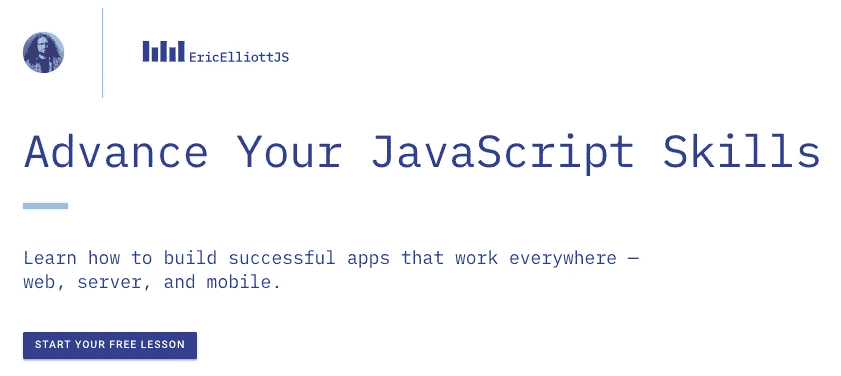

# 2018 年最值得学习的 JavaScript 库和技术

> 原文：<https://medium.com/javascript-scene/top-javascript-libraries-tech-to-learn-in-2018-c38028e028e6?source=collection_archive---------0----------------------->

Alex Proimos — New York Public Library Grand Study Hall (CC BY 2.0)

# 你掉进了时光倒流机！
[点击这里回到 2020 年。](/javascript-scene/top-javascript-frameworks-and-topics-to-learn-in-2020-and-the-new-decade-ced6e9d812f9)

去年，我写了一篇文章，总结了 2017 年需要学习的[顶级技术。今年有一些惊喜。](/javascript-scene/top-javascript-frameworks-topics-to-learn-in-2017-700a397b711)

> 我们开始回答“哪些学习主题会给你带来最大的投资回报？”

JavaScript has the most packages, by a landslide.

首先，软件吃掉了世界，网络吃掉了软件，JavaScript 吃掉了网络。2018 年，React 在吃 JavaScript。

# 2018:反应之年

React 在 2017 年赢得了人气战。

仍然有许多开发人员致力于 Angular 代码库，这在 Google trends 中有所体现:

但随着 React 继续赢得客户满意度调查，React 的增长已经将 Angular(以及其他一切)远远甩在了身后。

## Vue.js 呢？我听说天气很热

每个人都喜欢对 Vue.js 这样的替代产品说些好听的话。下面是我去年对此的评论:

> [**Vue.js**](https://vuejs.org/) 有一吨的 GitHub 明星和下载量。如果事情继续这样发展下去，它在 2017 年将会做得很好，但我不认为它会在未来一年左右的时间里取代 React 或 Angular(这两者都在快速增长)。学了这个**之后**你就学会了反应或者角度。

Vue.js 在 2017 年确实做得非常好。它上了很多头条，很多人对此感兴趣。正如我预测的那样，它 ***没有接近*** 的颠覆性反应，我有信心预测它在 2018 年也不会颠覆性反应。也就是说，它可能会在 2018 年超过 Angular:

Vue.js downloads/month

如你所见，Vue.js 的下载量正在增加:

angular/core downloads/month

但 React 拥有强大的领先优势和与之匹配的强劲增长率:

React downloads/month

Vue.js 的增长速度还是比 React 快。为什么它会与 2017 年的 React vs Angular 有所不同？

2016 年底，JavaScript 世界已经为新框架做好了准备。Angular 用户非常不满意，React 用户非常满意，很多人想学 React，很少人想学 Angular。2017 年底，Angular 2+用户满意度仍不到一半，为 49%。

**React 与 Vue.js 的情况非常不同** [React 在用户满意度方面击败 vue . js](https://stateofjs.com/2017/front-end/results)(93%比 90%)。2017 年初从 React 转向的主要动机是因为对 React 许可证的困惑。脸书听到了用户的声音，更换了许可证。

在这个阶段，我根本看不到令人信服的证据表明，市场有动力从对任何其他事物做出反应转变为对其他事物做出反应。Vue.js 从 React 窃取用户比从 jQuery 和 Angular 窃取用户要困难得多。

Vue.js 有足够的空间快速获得大量 Angular 和 jQuery 用户，但当他们不得不开始从 React 窃取用户以继续增长时，他们可能会碰壁。

我预计 Vue.js 在未来一两年内将保持强劲增长，随后将与 React 展开一场更加激烈的竞争，Vue.js 将退居第二，除非有重大变化打破平衡。

# 乔布斯

> jQuery 沦陷了。

在工作列表中，React 完全起飞并超过了 jQuery——十年来第一个在工作受欢迎程度上超过 jQuery 的库*。我们在这里见证的是一个时代的终结。*

**

*React Rising — the first library to unseat jQuery this decade (source: Indeed.com)*

*与去年的图表相比:*

**

*jQuery is so 2016*

*这些图表中真正有趣的是，其他库的增长远远超过 jQuery 的下降。提及前端框架的总空缺职位比去年增加了约 1 万多个。*

*随着工作岗位的增加，我们也看到了平均工资的增长:[11 万美元](https://www.indeed.com/salaries/Javascript-Developer-Salaries)相比 2016 年底的 9.3 万美元。同期通货膨胀率[保持在 2%以下](https://data.bls.gov/timeseries/CUUR0000SA0L1E?output_view=pct_12mths)，只占工资增长的一小部分。*

*显然，2018 年仍然是候选人的市场。*

> ***1。方法:在 Indeed.com 进行求职调查。为了剔除误报，我将搜索与关键词“软件”配对，以加强相关性，然后乘以约 1.5(大致是使用“软件”和不使用“软件”的编程工作列表之间的差异)。)所有 SERPS 都按日期分类，并抽查相关性。得到的数字不是 100%准确，但是对于本文中使用的相对近似值来说已经足够好了。***

# *框架建议*

*看了今年的数字后，我准备强烈推荐 React 用于大多数一般的应用程序开发用例，包括移动应用程序(PWAs，React Native)、web 应用程序、大多数办公生产力应用程序和桌面媒体内容制作应用程序(见[电子](https://electronjs.org/))。*

*值得注意的例外是，有些东西可能更适合你:轻量级营销登陆页面(完全跳过框架)，3D 游戏，AR/VR。对于 3D 内容，请查看 [Unity](https://unity3d.com/) 、[虚幻](https://www.unrealengine.com/en-US/what-is-unreal-engine-4)或 [PlayCanvas](https://playcanvas.com/) 。也就是说，React 也被用于 3D 内容用户界面。*

*今年，我将所有其他前端框架评为严格可选。这并不意味着他们不酷，只是不适合在就业市场上竞争。请记住，这个列表是关于学习投资回报率，而不是哪种技术是“最好的”。*

# *为什么对反应这么感兴趣？*

*浏览 React 的工作列表，我注意到一个有趣的趋势——其中很多都是我们不认为是前端网络工作的东西:*

*   *React Native(从长远来看，这些开口比 Vue.js 开口的总数还要多)*
*   *为物联网做出反应*
*   *对 AR/VR 作出反应(Oculus Rift 领先的租赁费用)*
*   *对你从未听说过的晦涩难懂的计算事物作出反应*

> *React 已经脱离了它的网络根基。*

*多功能性是 React 的一大卖点。与许多其他框架不同，购买 React 并不需要购买一些内置的数据模型，甚至浏览器或 DOM 本身。事实上，我发现相当多的 React 工作列表甚至没有提到 JavaScript。*

*React 还依托 React 事实上的标准提供了一个丰富、充满活力的生态系统——这是自 jQuery 插件统治 web 以来 JavaScript 世界从未见过的。*

> *问题不再是“哪个框架？”
> 问题是“哪种技术与 React 配合得最好？”*

*在 2018 年(甚至可能是 2019 年)，没有什么能让 React 下台。你安全了。JavaScript 疲劳似乎正在消退。我们现在有一个很好的框架来构建应用程序，并且围绕 React 有一个很好的生态系统。*

# *应该研究哪些课题？*

*像去年一样，你不能把重点放在本质上，但你应该把更多的重点放在 React 应用的函数式编程上。*

*React 很棒，主要有两个原因:*

*   *确定性视图渲染*
*   *将视图层从直接 DOM 操作中抽象出来*

*确定性最好通过使用纯函数构建应用程序来实现，这本质上是函数式编程的定义。*

*记住这一点，这里有一些你应该研究的主题:*

*   *[**基本 ES6 语法**](/javascript-scene/a-functional-programmers-introduction-to-javascript-composing-software-d670d14ede30)*
*   *[**类语法及其诸多陷阱**](/javascript-scene/why-composition-is-harder-with-classes-c3e627dcd0aa) —对 React 组件使用`class`是可以的，但要避免从自己的类扩展，避免`instanceof`，避免强迫自己类的用户使用`new`关键字。*
*   *[**功能编程&软件组成**](/javascript-scene/composing-software-an-introduction-27b72500d6ea)*
*   *[**逢迎**](/javascript-scene/a-functional-programmers-introduction-to-javascript-composing-software-d670d14ede30#0355)*
*   *[**闭包**](/javascript-scene/master-the-javascript-interview-what-is-a-closure-b2f0d2152b36)*
*   *[**纯功能**](/javascript-scene/master-the-javascript-interview-what-is-a-pure-function-d1c076bec976)*
*   *[**承诺**](/javascript-scene/master-the-javascript-interview-what-is-a-promise-27fc71e77261)*
*   *[**发电机**](/javascript-scene/7-surprising-things-i-learned-writing-a-fibonacci-generator-4886a5c87710)**&**[**异步功能**](/javascript-scene/the-hidden-power-of-es6-generators-observable-async-flow-control-cfa4c7f31435)*
*   *[TDD](/javascript-scene/the-outrageous-cost-of-skipping-tdd-code-reviews-57887064c412)*
*   *[**轨道性能模型**](https://www.smashingmagazine.com/2015/10/rail-user-centric-model-performance/)*
*   ***渐进式网络应用(PWAs):** 参见[“原生应用注定要失败”](/javascript-scene/native-apps-are-doomed-ac397148a2c0) & [“为什么原生应用真的注定要失败”](/javascript-scene/why-native-apps-really-are-doomed-native-apps-are-doomed-pt-2-e035b43170e9)*
*   ***GraphQL** 在 2017 年成熟了很多，正在快速接管 REST APIs。Apollo 正在添加内置的离线第一客户端缓存架构，这将使 Apollo+GraphQL 成为 2018 年 Redux 的重要替代(或补充)。*

# *库和工具*

*这些是我觉得最有用的库和工具:*

*   *[**反应过来**](https://reactjs.org/)*
*   *[**雷杜**](https://redux.js.org/)*
*   *[**Redux-Saga**](https://github.com/redux-saga/redux-saga) 管理异步 I/O 并隔离副作用*
*   *[**Next.js**](https://github.com/zeit/next.js/) —带节点的 SSR&Express，自动束分裂，styled-jsx*
*   *[**物料 UI**](http://www.material-ui.com/)*
*   *[**故事书**](https://github.com/storybooks/storybook)*
*   *[**Cheerio**](https://github.com/cheeriojs/cheerio) 用于单元测试 React 组件(比起酶我更喜欢这个)*
*   *[**Lodash**](https://lodash.com/) (我更喜欢`lodash/fp`的实用程序)。只导入您需要的实用程序，以避免扩大您的包的大小。*
*   *[**Babel**](https://babeljs.io/)**:**用于编译 ES6，以便在较旧的浏览器上工作。*
*   *[**web pack**](https://webpack.github.io/)**:**标准 JavaScript 最流行的捆绑器，寻找简单的初学者工具包/样板配置示例，让事情快速运行)*
*   *[**ESLint:**](http://eslint.org/) 及早发现语法错误和风格问题。在代码审查和 TDD 之后，减少代码中的 bug 的第三个最好的方法。*
*   *[**Ramda**](http://ramdajs.com/)**—多用于镜头和传感器。***
*   ***[**节点&表达**](/javascript-scene/introduction-to-node-express-90c431f9e6fd#.gl2r6gcnn)***
*   ***[**RxJS**](http://reactivex.io/rxjs/)**:**JavaScript 的可观察对象。最近，我更多地使用传感器。记住[使用管道操作符](https://github.com/ReactiveX/rxjs/blob/master/doc/pipeable-operators.md)来避免扩大你的包大小。***

*****TypeScript** 在 2017 年做得很好，但我看到它碍手碍脚，让应用变得比它帮助的还要复杂。它的主要缺点是过度依赖注释而不是推理，并且不能正确地输入高阶函数而不出现难以描述的扭曲。我给它做了一段时间的全职日常试用，但这些仍然适用:[【关于静态类型的惊人秘密】](/javascript-scene/the-shocking-secret-about-static-types-514d39bf30a3) & [【你可能不需要打字稿】](/javascript-scene/you-might-not-need-typescript-or-static-types-aa7cb670a77b)。Flow 也有同样的问题，开发者工具不如 TypeScript 的好。***

# ***2018 年值得关注的技术***

***2018 年，R&D 的所有这些领域都在创造真正的就业机会:***

*   ***渐进式网络应用(PWAs)***
*   ***区块链和金融科技***
*   ***医疗技术***
*   ***AR/VR — Hololens、Meta 和 ODG 今天发货。ODG R-9 原定于 2017 年发货，但可能会改为在 2018 年发货。MagicLeap 已经承诺 2018 年出货。AR 将比手机更能改变人类的体验。***
*   ***3D 打印***
*   ***人工智能***
*   ***嗡嗡声***

***量子计算也准备好改变世界，但这种颠覆可能要到 2019 年或更晚才会真正开始。网上有工作的量子计算机，但它们还不能做太多。对于大多数开发人员来说，开始富有成效的试验还为时过早。微软最近宣布了其用于量子计算的 [Q#编程语言](https://arstechnica.com/gadgets/2017/12/microsofts-q-quantum-programming-language-out-now-in-preview/)。与此同时， [IBM](https://www.forbes.com/sites/alexkonrad/2017/12/14/why-companies-like-jpmorgan-chase-and-samsung-are-partnering-with-ibm-in-quantum-computing/#123ce0592c4d) 和[谷歌](https://www.inverse.com/article/38917-google-quantum-simulator-creates-a-butterfly)也在继续大举投资，以占有萌芽状态的云量子计算市场。***

***如果你想为学习量子计算做好准备，你会想学习线性代数。还有基于[λ演算](https://plato.stanford.edu/entries/lambda-calculus/)的量子计算的功能探索。***

***很可能，正如我们在人工智能方面看到的那样，云 API 将被开发出来，让数学背景较少的人利用量子计算的一些功能。***

***

[Start your free lesson on EricElliottJS.com](https://ericelliottjs.com/premium-content/lesson-pure-functions)*** 

******埃里克·艾略特*** *是一位科技产品和平台顾问，《 [*【作曲软件】*](https://leanpub.com/composingsoftware)*[*【EricElliottJS.com】*](https://ericelliottjs.com)*[*devanywhere . io*](https://devanywhere.io)*的联合创始人，以及 dev 团队导师。他曾为 Adobe Systems、* ***、Zumba Fitness、*** ***【华尔街日报、*******【ESPN、*******【BBC】****等顶级录音艺人和包括* ***Usher、【Metallica】***********

***他和世界上最美丽的女人享受着与世隔绝的生活方式。***