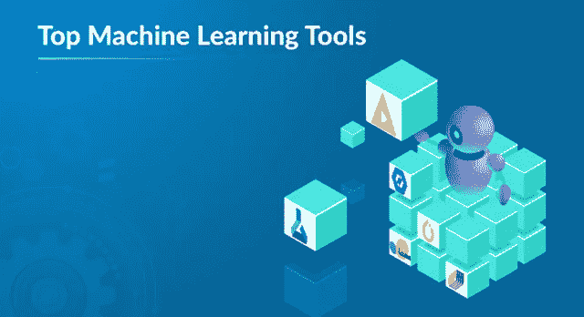
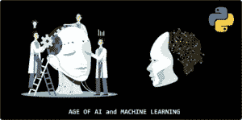
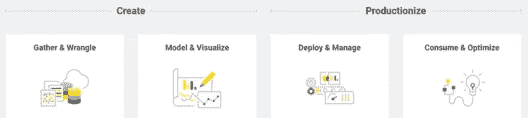
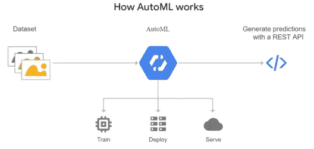
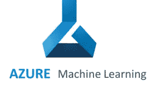

# 2021 年你需要了解的 10 大机器学习工具

> 原文：<https://medium.com/edureka/top-machine-learning-tools-f4ee7ef4c19e?source=collection_archive---------0----------------------->

Machine Learning Tools -Edureka

机器学习的时代已经到来，它在技术领域取得了很多进展，根据 Gartner 的报告，到 2020 年，机器学习和人工智能将创造 230 万个就业机会，这种巨大的增长导致了我们将在本文中讨论的各种机器学习工具的发展。

*   什么是机器学习？
*   顶级机器学习工具

# 什么是机器学习？

机器学习是一种人工智能，允许软件应用程序从数据中学习，并在没有人类干预的情况下更加准确地预测结果。

机器学习是一个概念，它允许机器从例子和经验中学习，并且不需要显式编程。为了实现这一点，我们现在有很多机器学习工具。让我们来看看一些最重要和最受欢迎的。

# 顶级机器学习工具

## sci kit-学习

它是 Python 编程语言的免费软件机器学习库。它是一个简单有效的数据挖掘和数据分析工具。基于 NumPy、SciPy 和 Matplotlib 构建。

它在 Python 中提供了一系列监督和非监督学习算法，如分类、回归、聚类、降维。

## **KNIME**

KNIME (Konstanz Information Miner)是一个免费的开源数据分析、报告和集成平台，为基于 **GUI 的**工作流的强大分析而构建。这意味着您不必知道如何编码就能使用 KNIME 工作并获得洞察力。

您可以从 ***收集数据和创建模型一直工作到部署和生产*** 。它将整个流程的所有功能整合到一个工作流程中。

## **张量流**

由谷歌大脑团队创建的 **TensorFlow** 是一个用于数值计算和大规模机器学习的开源库。当谈到人工智能框架摊牌时，你会发现 TensorFlow 在大多数时候都是明显的赢家。

TensorFlow 提供了一个可访问和可读的语法，这对于使这些编程资源更容易使用是必不可少的，并且作为一个**低级**库提供了更多的灵活性，随着新的 v2.0 的推出，它将成为任何机器学习或深度学习目的的首选。这是目前最好的机器学习工具之一。

## **WEKA**

WEKA(Waikato Environment for Knowledge Analysis)是一款**开源** **Java 软件**，拥有一系列用于数据挖掘和数据探索任务的机器学习算法。它是最强大的机器学习工具之一，用于理解和可视化本地机器上的机器学习算法。

它既有**图形**界面，又有**命令行**界面。唯一的缺点是没有太多的文档和在线支持。

## **火炬/ Pytorch**

Pytorch 是一个**基于 python 的库**,作为深度学习开发平台提供了灵活性。PyTorch 的工作流程尽可能接近 python 的科学计算库——NumPy。它被**脸书**积极用于其所有的机器学习或深度学习工作。

**动态计算图形**是 Pytorch 的一大亮点。对 **CUDA** 的支持确保了代码可以在 GPU 上运行，从而减少了运行代码所需的时间，提高了系统的整体性能。

## **RapidMiner**

RapidMiner 是一个面向团队的数据科学平台，它将 ***数据准备、机器学习和预测模型部署*** 结合在一起。它有一个强大而健壮的图形用户界面，使用户能够创建、交付和维护预测分析。

有了 RapidMiner，整洁、无组织和看似无用的数据变得非常有价值，因为它简化了数据访问，并让您以一种您和您的团队易于理解的方式组织它们。

## **谷歌云汽车**

Google Cloud AutoML 使您可以使用机器学习的力量，即使您对机器学习的知识有限。谷歌的**人类标签服务**可以让一组人注释或清理你的标签，以确保你的模型正在接受高质量数据的训练。多酷啊！

他们有各种不同用途的产品，这使它成为一个非常好的机器学习工具。其中一些是:

*   **自动视觉**:图像
*   **AutoML 视频智能**:视频
*   **AutoML 自然语言**:文本的结构和意义
*   **自动翻译**:动态检测语言间的翻译
*   **AutoML 表格**:在结构化数据上建立模型

## **Azure 机器学习工作室**

Microsoft Azure Machine Learning Studio 是一款协作式的**拖放式**机器学习工具，您可以使用它来构建、测试和部署针对您的数据的预测分析解决方案。

你将数据集和分析模块拖放到一个交互式画布上，将它们连接在一起形成一个**实验**，在 Machine Learning Studio 中运行。没有**不需要编程**，只需要可视化连接数据集和模块来构建您的预测分析模型。

## **Accord.NET**

雅阁。NET 是一个完全用 C#编写的结合了**音频和图像处理库**的. NET 机器学习框架。口号是“ ***一分钟内完成的机器学习*** ”。

它是构建生产级计算机视觉、计算机听觉、信号处理和统计应用程序的完整框架。库可以从源代码中获得，也可以通过可执行安装程序& **NuGet** 包管理器获得。唯一的缺点是它只支持 supported 语言。

## **COLAB**

CoLab (Collaboratory)是一个免费的 **Jupyter 笔记本**环境，不需要设置，完全在云中运行。这是谷歌的一个研究项目，旨在帮助传播机器学习教育和研究。

它是迄今为止最顶级的机器学习工具之一，尤其是对数据科学家来说，因为**你不必手动安装**所有的包和库，只需通过调用它们来直接导入它们。你可以直接在 Google Drive、GitHub 或任何地方以各种格式保存你的项目。

就这样，我们结束了这篇文章。如果你想查看更多关于人工智能、DevOps、道德黑客等市场最热门技术的文章，你可以参考 Edureka 的官方网站。

请留意本系列中的其他文章，它们将解释 Python 和数据科学的各个方面。

> *1。* [*Python 教程*](/edureka/python-tutorial-be1b3d015745)
> 
> *2。* [*Python 编程语言*](/edureka/python-programming-language-fc1015de7a6f)
> 
> *3。* [*Python 函数*](/edureka/python-functions-f0cabca8c4a)
> 
> *4。*[*Python 中的文件处理*](/edureka/file-handling-in-python-e0a6ff96ede9)
> 
> *5。* [*Python Numpy 教程*](/edureka/python-numpy-tutorial-89fb8b642c7d)
> 
> *6。* [*Scikit 学习机*](/edureka/scikit-learn-machine-learning-7a2d92e4dd07)
> 
> *7。* [*Python 熊猫教程*](/edureka/python-pandas-tutorial-c5055c61d12e)
> 
> *8。* [*Matplotlib 教程*](/edureka/python-matplotlib-tutorial-15d148a7bfee)
> 
> 9。 [*Tkinter 教程*](/edureka/tkinter-tutorial-f655d3f4c818)
> 
> *10。* [*请求教程*](/edureka/python-requests-tutorial-30edabfa6a1c)
> 
> *11。* [*PyGame 教程*](/edureka/pygame-tutorial-9874f7e5c0b4)
> 
> *12。* [*OpenCV 教程*](/edureka/python-opencv-tutorial-5549bd4940e3)
> 
> *13。* [*网页抓取用 Python*](/edureka/web-scraping-with-python-d9e6506007bf)
> 
> *14。* [*PyCharm 教程*](/edureka/pycharm-tutorial-d0ec9ce6fb60)
> 
> *15。* [*机器学习教程*](/edureka/machine-learning-tutorial-f2883412fba1)
> 
> *16。*[*Python 中从零开始的线性回归算法*](/edureka/linear-regression-in-python-e66f869cb6ce)
> 
> *17。* [*用于数据科学的 Python*](/edureka/learn-python-for-data-science-1f9f407943d3)
> 
> *18。*[*Python 中的循环*](/edureka/loops-in-python-fc5b42e2f313)
> 
> *19。* [*Python 正则表达式*](/edureka/python-regex-regular-expression-tutorial-f2d17ffcf17e)
> 
> *20。* [*Python 项目*](/edureka/python-projects-1f401a555ca0)
> 
> *21。* [*机器学习项目*](/edureka/machine-learning-projects-cb0130d0606f)
> 
> *22。*[*Python 中的数组*](/edureka/arrays-in-python-14aecabec16e)
> 
> *23。* [*在 Python 中设置*](/edureka/sets-in-python-a16b410becf4)
> 
> *24。*[*Python 中的多线程*](/edureka/what-is-mutithreading-19b6349dde0f)
> 
> 25。 [*Python 面试题*](/edureka/python-interview-questions-a22257bc309f)
> 
> *26。*[*Java vs Python*](/edureka/java-vs-python-31d7433ed9d)
> 
> *27。* [*如何成为一名 Python 开发者？*](/edureka/how-to-become-a-python-developer-462a0093f246)
> 
> 28。 [*Python Lambda 函数*](/edureka/python-lambda-b84d68d449a0)
> 
> *29。* [*网飞如何使用 Python？*](/edureka/how-netflix-uses-python-1e4deb2f8ca5)
> 
> 三十。[*Python 中的套接字编程是什么*](/edureka/socket-programming-python-bbac2d423bf9)
> 
> *31。* [*Python 数据库连接*](/edureka/python-database-connection-b4f9b301947c)
> 
> *32。*[*Golang vs Python*](/edureka/golang-vs-python-5ac32e1ef2)
> 
> *33。* [*Python Seaborn 教程*](/edureka/python-seaborn-tutorial-646fdddff322)

*原载于 2019 年 7 月 17 日*[*https://www.edureka.co*](https://www.edureka.co/blog/top-machine-learning-tools/)*。*