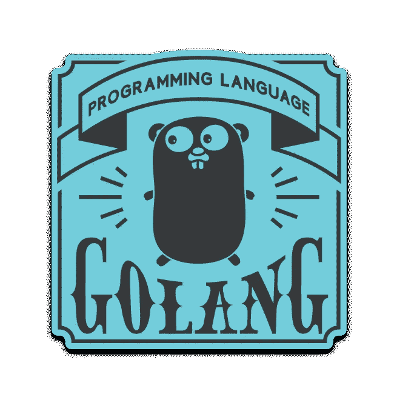
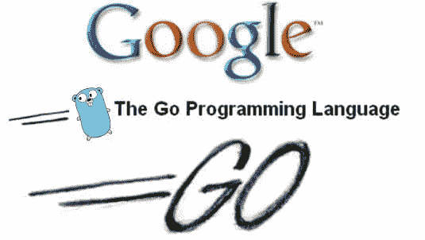
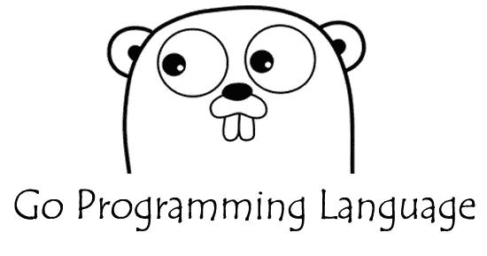

# 10 个最好的 Golang 初学者教程[2023 年 3 月]-在线学习

> 原文：<https://medium.com/quick-code/top-online-courses-to-learn-go-programming-language-golang-for-beginners-c228c615946c?source=collection_archive---------0----------------------->

## 用 2023 年最好的 golang 初学者教程学习计算机编程求职的 Go 编程。

Go 是 Google 创建的开源编程语言。作为受欢迎程度增长最快的语言之一，现在是学习围棋基础知识的好时机。对于一门语言来说，Go 是一个令人惊讶的选择，因为它是由创造 C 编程语言、Unix 和 UTF-8 的一些人开发的，这些人对计算机科学做出了一些最有影响力的贡献。Robert Griesemer、Rob Pike 和 Ken Thompson 将 Go 打造成为一种现代语言，它可以轻松使用多个内核、轻松实现并发、轻松在分布式环境中工作，并轻松允许程序员编写程序——它具有非常精简和用户友好的语法。

> 披露:如果你通过本页的链接购买课程，我们可能会得到一小笔代销商佣金。谢谢你。

## 1. [Go:完全开发者指南(Golang)](https://coursesity.com/r/site/go-the-complete-developer-s-guide-golang)

掌握 Go 编程语言(Golang)的基础和高级特性。

***课程评分:4.6 分(总分 9435 分)***

本课程旨在让您尽快开始使用 Go。我们将快速介绍基础知识，然后深入了解该语言的一些更高级的特性。

围棋被设计成容易上手，但很难掌握。通过多个项目、测验和作业，你将很快开始掌握这门语言的奇特之处。围棋就像任何其他语言一样——你必须编写代码来学习它！这门课程将会给你足够的机会去开创你自己的事业，并开始从事你自己的项目。

在本课程中，您将:

*   理解语言的基本语法和控制结构
*   应用 Go 的并发模型构建大规模并行系统
*   掌握类型的用途，如果您来自 Javascript 或 Ruby 之类的动态类型语言，这一点尤其重要
*   通过使用包来组织代码
*   使用 Go 运行时来构建和编译项目
*   深入了解语言中的关键设计决策
*   了解何时使用基本语言功能

Go 是近十年来发展最快的编程语言之一。

Top Golang Tutorials

## 2.[Go 入门](https://coursera.pxf.io/c/1137078/1213622/14726?u=https%3A%2F%2Fwww.coursera.org%2Flearn%2Fgolang-getting-started&subId1=BotTutorials)

了解 Go 的基础知识，这是一种开源编程语言，最初由 Google 的一个团队开发，并由开源社区的许多贡献者进行了增强。这门课程是为以前有过使用 C、Python 或 Java 等语言编程经验的人设计的，涵盖了 Go 的基本元素。主题包括数据类型、协议、格式以及编写包含 RFC 和 JSON 的代码。

最重要的是，你将有机会练习编写围棋程序，并从你的同伴那里得到反馈。完成本课程后，你将能够执行简单的围棋程序，这将为你后续更高级的学习做好准备。

本课程将涵盖:

*   模块 1:Go 入门
*   模块 2:基本数据类型
*   模块 3:复合数据类型
*   模块 4:协议和格式

本课程是 Google Go 专业化 **的 [*编程的一部分。*](https://click.linksynergy.com/deeplink?id=BuGceriufQM&mid=40328&u1=quickcode&murl=https%3A%2F%2Fwww.coursera.org%2Fspecializations%2Fgoogle-golang)**该专业介绍了 Google 的 Go 编程语言，并向学习者概述了 Go 的特殊功能。完成这三门课程后，学习者将获得使用 Go 创建简洁、高效和简洁的应用程序所需的知识和技能。

## 3.[Go 编程语言指南——像专家一样编程](https://www.eduonix.com/courses/Software-Development/the-go-programming-language-guide-code-like-a-pro/UHJvZHVjdC0zMjMyMDA=)

这篇围棋教程的设计考虑到了初学者和高级开发者。该课程将分解甚至最难的概念，使学习变得有趣和容易。对于高级用户来说，你不仅可以重温编程语言，还可以找到一些有用的技巧。

在本课程中，您将学习:

*   什么是 Go 编程语言，为什么要使用它
*   设置 Go 开发环境
*   Go 语法和应用程序开发简介
*   围棋语言基础，如基本围棋类型、函数和指针
*   Go 并发，如 Go 内存模型、Goroutines 和 Go 管道
*   如何将 Go 与包括 Google Cloud、Amazon Cloud 和 Docker 在内的云服务配合使用
*   Go 如何处理 C、Python 和 Java 等语言绑定
*   创建应用程序时会出现什么问题以及如何处理这些问题

## 4.[围棋编程入门](https://www.educative.io/collection/10370001/6199152924950528?affiliate_id=5088579051061248)

本课程旨在为初学者提供详细的围棋入门知识。此外，它还阐明了 Go 与程序员习惯的传统编程语言有什么不同，以便让准备用这种语言深入研究 Go 的程序员熟悉。本课程还提供免费预习课程。

Best Golang Courses & Tutorials

## 5.[学围棋](https://www.pjatr.com/t/TUJGR0lLR0JHR0pMSUtCR0ZISk1N?sid=quickcode&url=https%3A%2F%2Fwww.codecademy.com%2Flearn%2Flearn-go)

Go(或 Golang)是一种开源编程语言，旨在大规模构建快速、可靠、高效的软件。

在本课程中，您将学习如何:

*   用谷歌新的编程语言，Go。
*   使用变量在 Go 中创建和存储值。
*   使用不同的类型来指示这些变量存储什么值。
*   在 Go 中实现条件句。
*   编写 Go 函数。

您将了解 Go 环境的设置以及如何创建 Go 文件。您还将了解 Go 的数据类型和变量。

最后，您将了解 Go 的条件语句以及如何在 Go 中使用函数。

## 6.[学习如何编码:谷歌的 Go (golang)编程语言](https://coursesity.com/r/site/learn-how-to-code-google-s-go-programming-language)

向一位拥有超过 15 年教学经验的计算机科学大学教授学习编程。

***课程评分:4.5 分(总分 11087 分)***

Go 是一种开源编程语言，可以轻松构建简单、可靠、高效的软件。

但是谷歌为什么要创造一种新的语言呢？

用谷歌的话说，“Go 诞生于对现有系统编程语言和环境的失望。编程变得太难了，语言的选择是部分原因。人们不得不在高效编译、高效执行或编程简便之间做出选择；这三个版本都没有相同的主流语言版本。程序员可以通过转向动态类型语言，如 Python 和 JavaScript，而不是 C++或更小程度上的 Java，来选择轻松而不是安全和效率。Go 试图将解释型、动态类型语言的编程简易性与静态类型、编译型语言的效率和安全性结合起来。它还旨在现代化，支持网络和多核计算。最后，使用 Go 的目的是快速:在单台计算机上构建一个大型可执行文件最多需要几秒钟。为了实现这些目标，需要解决一些语言问题:一个有表现力但轻量级的类型系统；并发和垃圾收集；严格的依赖规范；诸如此类。库或工具不能很好地解决这些问题；需要一种新的语言。”

Go 是你今天能学到的最好的编程语言。Go 也是当今收入最高的编程语言。

来了解有史以来最伟大的编程语言。你将带着资源和代码样本离开，开始让你所有的软件和应用真正运行起来。

# 7.[在 Go 中掌握并发！](https://www.educative.io/collection/10370001/5895695963783168?affiliate_id=5088579051061248)

Go 支持开箱即用的并发性，这使得实现变得容易。事实上，Go 中的并发性比其他任何主要语言都更容易实现，速度也更快。

在本课程中:

*   您将从对并发性的一般性介绍开始，逐步学习更高级的概念和 Go 中的实现。
*   您还将有机会经历一些常见的模式，这些模式将使您的生活更轻松，代码更高效。
*   完成后，您将能够利用 Go 编写使用并发的高效实用的应用程序。

## 8.[用谷歌的 Go (golang)编程语言进行网络开发](https://coursesity.com/course-detail/web-development-w-googleas-go-golang-programming-language)

向一位拥有超过 15 年教学经验的计算机科学大学教授学习 Web 编程。

***课程评分:4.6 分(总分 3668 分)***

Go 是当今用于创建 web 应用程序、web API、微服务和其他分布式服务的最强大、性能最高和可伸缩的编程语言。

在本课程中，你将获得一个坚实的网络开发基础。您将了解以下所有内容以及更多内容:

体系结构

*   网络架构
*   客户机/服务器体系结构
*   请求/响应模式
*   IETF 定义的 RFC 标准
*   客户端请求和服务器响应的格式

模板

*   模板在服务器端编程中扮演的角色
*   如何使用 Go 标准库中的模板
*   修改数据结构以更好地使用模板

服务器

*   TCP 和 HTTP 之间的关系
*   如何建立一个响应 HTTP 请求的 TCP 服务器
*   如何创建一个充当内存数据库的 TCP 服务器
*   如何创建处理各种路由和方法的 restful TCP 服务器
*   网络服务器、服务器、多路复用器和多路复用器之间的区别
*   如何使用朱利安·施密特的路由器等第三方服务器
*   HTTP 方法和状态代码的重要性

net/http 包

*   使用 net/http 包简化您的 web 开发
*   net/http 包的细微差别
*   处理程序接口
*   http。ListenAndServe
*   创建您自己的 servemux
*   使用默认的 servemux
*   http。句柄& http。处理者
*   http。Handlefunc，func(ResponseWriter，*Request)，& http。手柄功能
*   http。ServeContent，http。ServeFile 和 http。文件服务器
*   http。剥离固定
*   http。NotFoundHandler

状态和会话

*   如何创建状态:UUID、cookies、URL 中的值、安全性
*   如何创建会话:登录、权限、注销
*   如何终止会话

部署

*   如何购买域名
*   如何将应用程序部署到 Google Cloud

亚马逊网络服务

*   如何使用亚马逊网络服务(AWS)
*   如何在 AWS EC2(弹性云计算)上创建虚拟 linux 机器
*   如何使用安全外壳(SSH)管理虚拟机
*   如何使用安全拷贝(SCP)将文件传输到虚拟机
*   什么是负载平衡器以及如何在 AWS 上使用它们

关系型数据库

*   如何在 AWS 上使用 MySQL
*   如何将 MySQL 工作台连接到 AWS

MongoDB

*   了解 CRUD
*   如何使用 MongoDB & Go

MVC(模型视图控制器)设计模式

*   理解 MVC 设计模式
*   使用 MVC 设计模式

码头工人

*   虚拟机与容器
*   了解使用 Docker 的好处
*   Docker 图像、Docker 容器和 Docker 注册表
*   实现 Docker 和 Go
*   部署 Docker 和 Go

谷歌云

*   谷歌云存储
*   Google Cloud 无 sql 数据存储
*   谷歌云内存缓存
*   谷歌云 PAAS 应用引擎

网络开发工具包

*   创建交互式、快速动态网页应用的网页开发技术
*   JSON
*   json。马尔萨尔& json 公司。解组
*   json。Encode & json。译
*   哈希消息验证码(HMAC)
*   Base64 编码
*   网络存储
*   语境
*   TLS & HTTPS
*   带有 Go 的 JSON 使用标签

建筑应用

*   照片博客
*   推特的复制品

本课程结束时，您将掌握 web 开发的基础知识。

Golang Programming Courses For Beginners

# 9. [Go (Golang):完整的训练营](https://click.linksynergy.com/deeplink?id=Fh5UMknfYAU&mid=39197&u1=quickcode&murl=https%3A%2F%2Fwww.udemy.com%2Fcourse%2Flearn-go-the-complete-bootcamp-course-golang%2F)

从零开始深刻理解和掌握 Go 编程语言(Golang)1000+动手练习和项目

***课程评分:4.5 分(总分 972 分)***

在本课程中，您将学习:

*   掌握接口的全部功能(面向对象)
*   掌握地图内部:地图标题
*   掌握切片内部:切片头和内存分配
*   使用结构对 JSON 进行编码和解码
*   创建日志文件解析器
*   创建垃圾邮件伪装
*   使用阵列创建一个基于控制台的动画复古 Led 时钟
*   使用切片创建弹跳球动画
*   使用地图创建一个字典程序

本课程还包括 1000+练习和解答。参加本课程，通过在整个课程中构建多个 Golang 项目来学习 Golang 编程。

# 10.[掌握围棋编程](https://click.linksynergy.com/deeplink?id=Fh5UMknfYAU&mid=39197&u1=quickcode&murl=https%3A%2F%2Fwww.udemy.com%2Fmastering-go-programming%2F)

通过学习如何编写地道、有效的代码来掌握 Golang 编程。

***课程评分:4.3 分(总分 405 分)***

Go 已经从试验性的状态走向了大规模的采用。对于越来越多的系统级编程领域来说，它像 C 一样的速度、简单性和强大的功能使它成为使用老式笨重的静态类型语言的程序员的一个有吸引力的选择。Golang 作为一种完全可行的语言进入了这个领域，用于完成大量低级编程和服务基础设施任务。

本视频课程不仅让您深入了解该语言背后的基本机制，还涵盖了关于 Go for modern software architecture 的广泛实践主题。它向您展示了如何以一种智能的、惯用的方式编写 Go。在简单了解了 Go 的关键构建模块之后，我们还将探讨如何利用该语言的独特功能来编写有效、强大的代码，以便开发软件。我们关注包、面向对象编程、并发性和反射等等。此外，您还将了解 Go 令人敬畏的内置测试支持特性。在此过程中，培养您在文件处理技术、数据库的 Go 包、数据序列化方法、Go 服务和 Go web 应用程序之间的消息通信方面的技能。获得大量说明性代码示例、练习和真实场景，帮助您构建自己的应用程序。

本课程结束时，您将学会如何运用这些强化的知识，独自构建一个具有惊人功能的真实世界的宇宙飞船应用程序。

# 11.[构建实时应用——使用 Golang，React Js & RethinkDB](https://click.linksynergy.com/deeplink?id=Fh5UMknfYAU&mid=39197&u1=quickcode&murl=https%3A%2F%2Fwww.udemy.com%2Frealtime-apps-with-reactjs-golang-rethinkdb%2F)

教你 ReactJs，Golang & RethinkDB 的实用指南。最佳节奏，没有废话。你会学得很快。

本课程采用最佳进度，因此您会学得很快。你的时间是宝贵的，我不想浪费它，尝试免费预览，我想你会明白我所说的快速/精益学习的意思。

反应 Js

Reactjs 是一个由脸书创建和维护的令人惊叹的 Javascript 前端库。React 的设计者对行业“最佳实践”提出了质疑，并设计了一个非常独特、速度极快且非常高效的库，此外，与它一起工作也很愉快。Reactjs 使编写 JavaScript 应用程序再次变得有趣，因为它的简单性和根本不同的概念。

戈朗

Golang 是一种由 Google 创建和维护的令人敬畏的新编程语言。Golang 是一种现代语言，简单易学，易于使用。Golang 特别适合高度并发的应用程序，如实时应用程序，因为它对协同程序(称为 goroutines)提供了一流的语言支持。用 Golang 创建的应用速度很快，可以在所有主流平台(Mac / Windows / Linux)上运行。

重新思考 DB

RethinkDB 是我所知道的唯一一个专注于实时特性的数据库。使用 RethinkDB，您可以轻松创建高度可伸缩的实时应用程序。RethinkDB 提供了一组丰富的特性，使用它是一种乐趣。

你将建造什么

在本课程中，您将构建一个松弛克隆。

先决条件

对编程和网络的一般了解。你将从零开始，快速移动，只学习你需要知道的，而不是别的。

# 12.[学习 Google Go — Golang 初学者编程— Lite](https://click.linksynergy.com/deeplink?id=Fh5UMknfYAU&mid=39197&u1=quickcode&murl=https%3A%2F%2Fwww.udemy.com%2Flearn-google-go-golang-programming-for-beginners-lite%2F)

学习 Go 语言编程的基础知识

这门课程教授用 Go 语言编程的基础知识。Go 是一种适合各种任务的语言，从系统编程到编写 web 服务器。

在本课程中，我们将学习围棋的语法，但更重要的是，如何“在围棋中思考”虽然许多任务可以像在其他编程语言中一样以相同的方式执行，但 Go 通常会提供更精简的解决方案，这就是我们在这里要学习的。

Best Golang Tutorials

# 13.[Golang:REST API(Go 编程语言)简介](https://click.linksynergy.com/deeplink?id=Fh5UMknfYAU&mid=39197&u1=quickcode&murl=https%3A%2F%2Fwww.udemy.com%2Fcourse%2Fbuild-a-restful-api-with-golang-go-programming-language%2F)

Golang:用 Golang (Go 编程语言)介绍 RESTful API & 1.5 小时的 React-Redux 附加内容(前端)

***课程评分:4.2 分(总分 182 分)***

本课程涵盖:

*   从 Golang 的结构类型和切片创建一个模型，并向其中添加记录
*   创建一个路由器，并向其注册 API 端点和处理函数
*   构建处理函数来执行 CRUD 操作
*   创建一个 Postgres 数据库实例和一个表来保存记录
*   建立与数据库的连接，查询表中的记录，以及插入、更新和删除单个记录
*   构建处理函数来查询数据库并对持久数据执行 CRUD 操作
*   使用 gorilla/mux、strconv、reflect 等软件包

在本课程中，您将使用 Golang (Go)创建 RESTful APIs，这些 API 将对保存在数据库中的数据执行 CRUD 操作，如创建、读取、更新和删除。您还将使用结构和切片来创建模型，并存储和传递数据。在下一阶段，您将创建一个路由器来注册您的 API 端点和处理函数。您还将学习如何重构代码并创建模块化的文件结构。

本课程结束时，您将利用 PostgreSQL 数据库等技术来保存记录，Postman 用于发出 API 请求，gorilla/mux 等第三方包用于路由，其他包用于加载环境变量、发出 http 请求、编码和解码 JSON、执行字符串转换和检查类型。

# 14.[Golang——Go 中微服务的终极指南](https://click.linksynergy.com/deeplink?id=Fh5UMknfYAU&mid=39197&u1=quickcode&murl=https%3A%2F%2Fwww.udemy.com%2Fcourse%2Fgolang-the-ultimate-guide-to-microservices-in-go-part-1%2F)

你需要认真对待 Golang 微服务设计和开发的一切:从设计到生产指标

***课程评分:4.6 分(总分 37 分)***

在本课程中，您将:

*   安装、配置和设置开始
*   REST 微服务的分析与设计。
*   在 Go 中实现它们的不同架构和模式。
*   边走边测试。保证你的工作质量。
*   高级并发模式。
*   多核虚拟机上的并行执行。
*   HTTP 框架、比较和设备。
*   使用外部 API。测试他们。嘲笑他们。测量它们。使用它们。
*   模仿应用程序不同层的终极和最佳方式。
*   调试和全面测试您的应用程序。

本课程涵盖的主题包括:

*   原生 web 服务器、HTTP 框架、基准、包组织、MVC 模式、接口、处理日期、单元、集成和功能测试。
*   模仿应用程序的不同工件，消费外部 API，模仿外部 API 响应，基于每个需求的不同并发设计。
*   并行性当我们拥有多核虚拟机时，对我们的应用、指标、日志记录、调试和分析进行压力测试。

> 感谢您阅读本文。我们策划了更多主题的顶级教程，您可能想看看:

 [## 15+最佳 Spring 框架教程—在线学习 Spring

### 2022 年用最好的 spring 教程学习 web 应用开发的 spring 框架

medium.com](/quick-code/top-tutorials-to-learn-spring-framework-for-the-java-application-12db01d9c288)  [## 10+最佳 ECMAScript 初学者教程—在线学习 ES6

### 通过 2022 年面向初学者的最佳 ECMAScript 教程，在万维网上学习用于客户端脚本的 ES6

medium.com](/quick-code/the-best-tutorials-to-learn-ecmascript-es6-for-beginners-55fe602382cd)  [## 初学者学习 C++编程的 15+最佳教程—在线学习 C++

### 学习 C++在 2022 年为初学者提供最好的 C++教程，创建跨多个领域和平台的高性能应用程序

medium.com](/quick-code/top-tutorials-to-learn-c-programming-d3dd13769a0c) 

披露:我们与本文中提到的一些资源有关联。如果你通过本页的链接购买课程，我们可能会得到一小笔佣金。谢谢你。