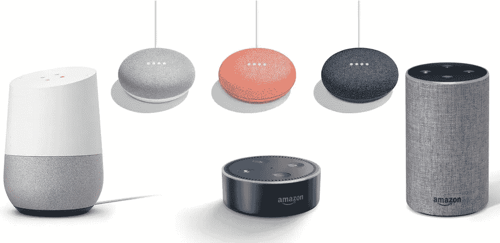
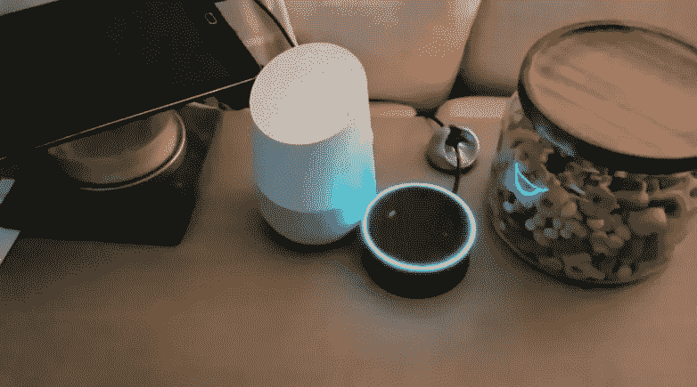
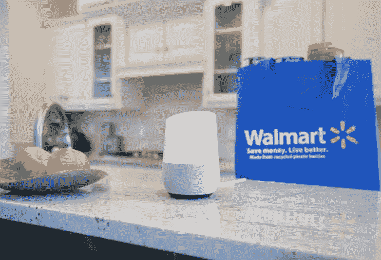
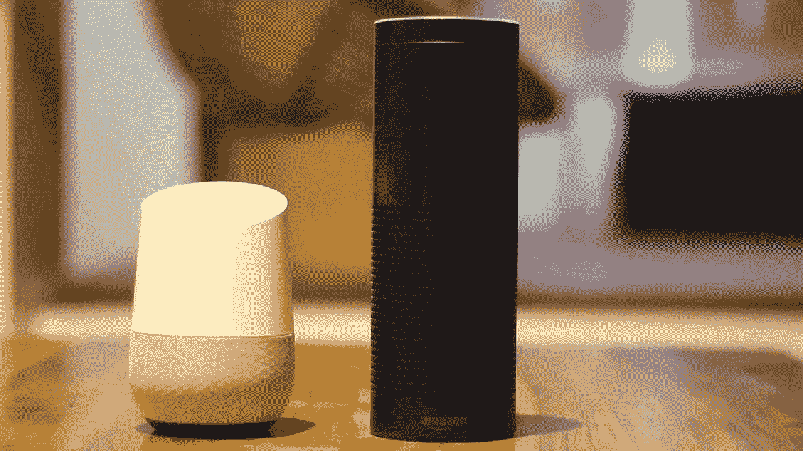

# 给初学者的 8 个最好的 Alexa 技能(亚马逊)课程——在线学习 Alexa 技能

> 原文：<https://medium.com/quick-code/top-online-courses-to-learn-skills-development-for-amazon-alexa-google-home-3048b0a7bcca?source=collection_archive---------0----------------------->

## 学习如何使用 Alexa 工具包创建 Alexa 技能，为初学者提供 2021 年最好的 Alexa 课程。

声控应用的使用正在迅速增加。很少有开发者知道如何构建亚马逊 alexa 技能或谷歌 home mini 应用。学习如何使用 alexa kit 创建 Alexa 技能将使开发人员获得巨大的优势，并获得超过其他开发人员的报酬。开始学习 alexa 技能和 google home 应用程序，参加为您策划的最好的 Alexa 技能教程& [免费语音助手课程](http://coursesity.com/free-courses-learn/voice-assistants)。

科技领域最大的行业被人工智能、机器人和语音技术所包围。我相信语音技术将成为 21 世纪新的用户界面，它不仅能理解基本的命令，而且非常智能，能理解你告诉它的任何东西。这就是亚马逊和谷歌下大赌注的原因；仅 Alexa 一家就计划到 2020 年创造近 110 亿美元的收入。苹果版本的谷歌主页“HomePods”也将于 2017 年底上市。现在，谷歌的版本已经上市，正在迅速从亚马逊手中夺取市场份额。谷歌了解数据，知道这是市场的发展方向。在主流开始开发应用之前，现在是学习这些技能的最佳时机。我们都知道智能手机应用程序的故事，这是一回事。

# 1.[循序渐进 Alexa 技能开发](https://click.linksynergy.com/deeplink?id=Fh5UMknfYAU&mid=39197&u1=quickcode&murl=https%3A%2F%2Fwww.udemy.com%2Fstep-by-step-alexa-skill-development%2F)

通过建立自定义 Alexa 技能来学习自定义 Alexa。

你好，学习者，这是一个关于 Alexa 技能开发的初级课程，一步一步地跟随课程，你将可以开发你自己的 Alexa 技能，并以你自己的方式定制 Alexa。

该课程从配备 Alexa 的设备以及设置这些设备的说明开始。接下来，著名的 Raspberry Pi 设备通过将 Alexa 语音服务引入其中而配备了 Alexa。然后，该课程继续建设自定义技能，一个非常基本的自定义技能开发将在通常的长时间内完成，让您知道开发一个所需的完整处理，稍后将再次使用 Alexa 技能工具包技能开发工具包实现相同的基本技能。然后将开发更多的自定义技能，使用相同的 SDK 探索 AWS DynamoDB 和 AWS S3。

该课程明确说明了如何安装所需的软件来使用 Alexa 技能控制 Raspberry Pi 设备。接下来，将开发 Alexa 控制 LED、伺服电机、网络摄像头和与 Raspberry Pi 连接的温度传感器的技能。该课程还通过简单的编码片段详细解释了开发 Alexa 技能所涉及的所有编码。

这门课程很少有项目可以帮助你自己练习和掌握这些概念。在做项目和学习课程的时候，你可以在 Udemy 论坛上提出你的疑问。您将在一个工作日内得到回复。谢谢你，祝你学习愉快。

# 2.[学习构建 Alexa 技能](https://linkedin-learning.pxf.io/c/1137078/646189/8005?u=https%3A%2F%2Fwww.linkedin.com%2Flearning%2Flearning-to-build-alexa-skills&subId1=quickcode)

Alexa 还为具有基本编程经验的开发人员提供了一个巨大的机会来构建他们自己的 Alexa 功能，称为技能。

该课程包括:

*   Alexa 基础知识
*   设置
*   了解自定义技能
*   构建自定义技能
*   配置自定义技能
*   培养训练者技能
*   测试技能
*   扩展技能

在本课程中，您将学习如何使用 Alexa 技能工具包和 Node.js 为 Alexa 设备构建自定义语音命令。

探索 Alexa 生态系统和组成自定义 Alexa 技能的组件。

了解如何在 Amazon 开发人员门户中配置您的技能，并使用 Node.js、Lambda 函数和 Amazon Web Services 创建、编码和部署它。

此外，了解如何在浏览器和实际的 Alexa 设备上测试您的技能，并提交技能认证，以便您可以与其他 Alexa 用户分享。

## 3.[学习编程 Alexa](https://www.pjatr.com/t/TUJGR0lLR0JHR0pMSUtCR0ZISk1N?sid=quickcode&url=https%3A%2F%2Fwww.codecademy.com%2Flearn%2Flearn-alexa)

随着对开发自定义 Alexa 技能的过程的全面了解，您将准备发布自己的程序，并与其他语音用户界面(VUI)应用程序一起工作。

在本课程中，您将学习如何:

*   使用 Alexa 技能工具包和亚马逊网络服务(AWS)为 Alexa 建立技能。
*   使用 AWS 控制台创建自己的 Lambda 函数。
*   使用 Alexa sdk 中的行为使 Alexa 技能具有交互性。
*   在 Alexa 技能期间和之间保持值。

你将学习如何创建一个简单的“你好 Codecademy”Alexa 技能。

您将构建交互模型和 Amazon Lambda 函数，用个人欢迎消息响应用户的声音。

# 4.[初级 Alexa 技能包开发](https://click.linksynergy.com/deeplink?id=Fh5UMknfYAU&mid=39197&u1=quickcode&murl=https%3A%2F%2Fwww.udemy.com%2Fbeginners-alexa-skills-kit-development%2F)

建立你的第一个亚马逊 Alexa 技能。

在本课程中，我将指导你逐步建立基本的迎宾技能。注意:这不是一门理论课。我确实给出了 Alexa 在引擎盖下发生的事情的简要概述，但是，我喜欢让我给你的信息实用并且易于应用到现实世界中。

开始兴奋了吗？你想知道智能语音应用程序是如何构建的，但又害怕遇到如此复杂的东西吗？不再害怕！有了这个初学者课程，你将能够在 1 小时内开始建立自己的技能！

# 5. [Google Home 开发:从初级到中级](https://click.linksynergy.com/deeplink?id=Fh5UMknfYAU&mid=39197&u1=quickcode&murl=https%3A%2F%2Fwww.udemy.com%2Fgoogle-home-development-from-beginner-to-intermediate%2F)

最全面最完整的 Google Home 课程。构建和部署

本课程包含超过 55 堂课和 4 小时的内容。它是为初学者设计的，可以在语音领域使用新的平台。您将学习构建 Google Home 应用程序所需的工具，如何创建对话，能够访问数据驱动应用程序的 API，通过 Amazon API Gateway 创建 API。

# 6.[亚马逊 Alexa 开发:从初级到中级](https://click.linksynergy.com/deeplink?id=Fh5UMknfYAU&mid=39197&u1=quickcode&murl=https%3A%2F%2Fwww.udemy.com%2Famazon-alexa-development-from-beginner-to-intermediate%2F)

了解如何创建和发布 Alexa 技能，了解语音 UI，并熟练使用 AWS 和 Alexa 技能工具包。

科技领域最大的行业被人工智能、机器人和语音技术所包围。我相信语音技术将成为 21 世纪新的用户界面，它不仅能理解基本的命令，还能聪明地理解你告诉它的任何东西。这就是为什么亚马逊对 Alexa 下了大赌注，计划到 2020 年创造近 110 亿美元的收入。他们对 Amazon Echo 有所了解，这就是为什么现在是在主流开始开发应用程序之前学习这些技能的最佳时机。我们都知道智能手机应用程序的故事，这是一回事。

本课程包含 50 多堂课和 1.5 小时的内容。它是为初学者设计的，可以在语音领域使用新的平台。你将学习建立 Alexa 技能所需的工具，Alexa 技能如何工作，并将技能发布到亚马逊的 Alexa 商店。

# 7.[综合 Alexa 技能发展课程 2017](https://click.linksynergy.com/deeplink?id=Fh5UMknfYAU&mid=39197&u1=quickcode&murl=https%3A%2F%2Fwww.udemy.com%2Fcomprehensive-alexa-skill-development-course%2F)

学习如何使用 Alexa 技能工具包(ASK)开发 Alexa 技能。添加自定义技能到您的亚马逊回声，回声点设备。

这是学习 Alexa 技能发展的最佳时机。很快就会有很多对 Alexa 技能开发人员的要求，因为许多公司希望将 Alexa 语音控制添加到他们的产品和服务中。这个全面的 Alexa 技能教程教授成为 Alexa 技能开发者所需的技能。本课程几乎涵盖了 Alexa Skills Kit (ASK)的所有功能，并提供了真实世界的示例技能(包括一个已发布的技能)，包括 47 堂课、源代码和 9.5 小时的内容。

以下是本课程的几个亮点:

1.  学习如何使用 Lambda 函数和 Web 服务作为终点来开发技能。
2.  Node.js 教程—如果您不熟悉 Node.js 编码，本课程将教授 Node.js 方面的必要知识，以培养 Alexa 技能。
3.  从头开始编码——对于第一个技能，我们不会使用任何模板。我们将从空文件和逐行代码开始，这样你就会明白整个 Alexa 技能流是如何端到端工作的。
4.  通过实例学习——我相信通过实例学习，所以我们将通过开发技能来学习和练习 Alexa 的功能。
5.  从初学者到专家——我精心设计了这门课程，它适用于所有层次的学生。
6.  了解如何设置您的本地环境和 AWS CLI，以便您可以从本地机器上自动上传 Alexa 技能
7.  帐户链接功能—在本课程中，您将学习如何使用 Alexa 技能工具包的帐户链接功能，以便您可以将 Alexa 用户与您系统中的用户链接起来。我们将利用这一功能开发一种叫做“电子邮件检查”的技能。
8.  了解如何使用 Node.js 和 Python 语言培养技能。
9.  了解 Alexa 技能工具包的大部分功能，例如:
10.  SSML 标签
11.  在您的回复中包括卡
12.  会话功能
13.  内置意图和插槽
14.  帐户链接功能
15.  了解如何设置您的本地环境和 AWS CLI，以便您可以从本地机器上自动上传 Alexa 技能
16.  学习使用 Mocha 测试框架和 Python Unittest 对你的技能进行自动化测试。
17.  学习 FLASK-ASK 框架——使用 Web 服务作为端点来开发技能。
18.  了解如何从你的 Alexa 技能访问像 AWS DynamoDB 外部数据库存储每个用户的信息
19.  了解如何从你的 Alexa 技能访问外部 API

# 8.[使用亚马逊的 Alexa 和 Lex 构建应用](https://click.linksynergy.com/deeplink?id=Fh5UMknfYAU&mid=39197&u1=quickcode&murl=https%3A%2F%2Fwww.udemy.com%2Fbuilding-voice-apps-using-amazon-alexa%2F)

Alexa、Siri、Cortana 和 Google Now——语音激活的个人助理是目前最热门的技术趋势之一。它们是以自由流畅的对话方式向客户传达复杂信息的绝佳方式。Alexa 是构建它们的一个很好的方式——一个为 Echo、FireTV 和一系列 Alexa 感知设备构建对话界面的 AWS 服务。

*   Alexa 和 Lex 是最先进的，对新设备的支持一直在增加
*   由基于深度学习的引擎提供支持，该引擎解析用户语音并将用户话语的内容解析为 API 调用和参数值
*   构建复杂的语音和聊天应用不需要深度学习或自然语言处理专业知识
*   提供指定对话界面的直观方式
*   自动和动态地调整会话响应
*   易于构建、测试和发布应用程序

在关于 Alexa 的章节中，我们将涵盖:

*   大图——语音和文本界面以及人机交互的当前趋势
*   Alexa、Lex、Echo 和亚马逊生态系统的其他部分是如何结合在一起的
*   交互模型:话语、意图、位置、提示及其在 API 调用中的解析
*   实现模型:使用 AWS lambdas 实现用户意图，以及 AWS Lambdas 如何提供平滑、无操作、自动缩放的代码端点

在关于 Lex 的章节中，我们将介绍:

*   交互模型:话语、意图、位置、提示及其在 API 调用中的解析
*   实现模型:使用 AWS lambdas 实现用户意图，以及 AWS Lambdas 如何提供平滑、无操作、自动缩放的代码端点
*   第三方集成:如何将聊天机器人添加到您的空闲工作区

> 感谢您阅读本文。我们策划了更多主题的顶级教程，您可能想看看:

 [## 10+最佳 AWS 培训在线课程—为 AWS 认证做准备

### 用 2021 年最好的新手 AWS 培训课程为开发者准备 AWS 认证。

medium.com](/quick-code/top-tutorials-to-prepare-for-aws-certification-exams-e991c55b54b0)  [## 10+初学者最佳 Flask Python 教程—在线学习 Flask

### 用 2021 年初学者的最佳 Flask 教程学习 Flask for web 开发

medium.com](/quick-code/top-online-tutorials-to-learn-flask-python-c2723df5326c)  [## 面向初学者的 15+最佳 Node.js 教程—在线学习 Node.js

### 学习 Node.js 从 2021 年最好的 Node.js 初学者教程开始学习 web 开发

medium.com](/quick-code/the-best-tutorials-to-learn-node-js-34818d757013) 

披露:我们与本文中提到的一些资源有关联。如果你通过本页的链接购买课程，我们可能会得到一小笔佣金。谢谢你。