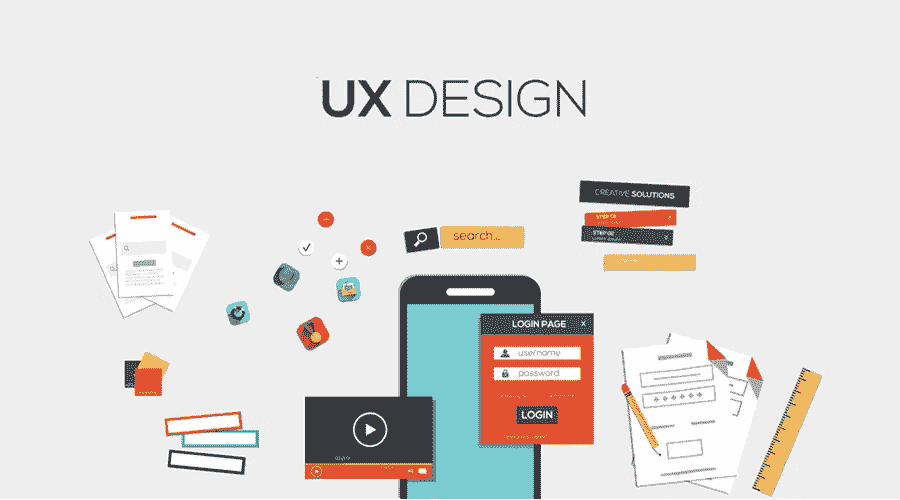

# 10+最佳 UX 初学者设计课程——在线学习 UX 设计

> 原文：<https://medium.com/quick-code/top-online-courses-to-learn-ux-design-efdd9a18689e?source=collection_archive---------0----------------------->

## 学习 UX 设计，在 2021 年为初学者提供最佳 UX 设计教程，创造惊人的用户体验。

# 1. [UX &网页设计硕士课程:战略、设计、开发](https://click.linksynergy.com/deeplink?id=Fh5UMknfYAU&mid=39197&u1=quickcode&murl=https%3A%2F%2Fwww.udemy.com%2Fux-web-design-master-course-strategy-design-development%2F)

在本课程中，学习如何将用户体验(UX)原则应用到你的网站设计中，编写各种网站代码，并增加销售额。你将清楚地了解良好 UX 的原则和好处，以及如何将其应用到你的网站上，这是一个确保你知道人们需要从你的网站上得到什么，以及你或你的客户需要从网站上得到什么以取得成功的策略

你将了解什么样的信息应该包含在你的网站中，以及如何设计它来提高转化率和用 HTML、CSS、WordPress 和其他工具编写各种网站代码的能力。

这门课程将教你所有你需要知道的关于 UX 的知识，包括设计、内容和编码。你会从头开始学习。你将学习原则和策略，你将学习如何实际应用这些抽象的概念，为三种不同的受众编写三个不同的网站。

这门课程将帮助你脱颖而出，成为一名网页设计师，教你如何应用用户体验(UX)策略，让你建立的每个网站都有用、可用、有价值。

## 2. [UX 设计基础](https://coursera.pxf.io/c/1137078/1213622/14726?u=https%3A%2F%2Fwww.coursera.org%2Flearn%2Fux-design-fundamentals&subId1=BotTutorials)

这门实践课程考察了如何组织和构建内容来为用户创造体验，以及设计师在创造和塑造用户体验中所扮演的角色。

在本课程中，您将学习如何:

*   描述并应用当前 UX 设计的最佳实践和惯例。
*   运用 UX 设计的基本原理来塑造观众对特定内容的体验。

你将专注于如何表达和构建你的想法和目标，如何使用命名和语言作为你的应用程序的身份的一部分。你还会看到受众研究和以用户为中心的设计。

你将学会开发、计划和测试你的应用程序想法。你将从勾画出更广泛的内容并将其映射到一个结构中开始。

为了测试你的应用程序的哪些方面是有效的，你将会看到如何创建一个非可视化的纸上原型，并朝着网站地图的方向前进。

当你开发应用程序的逻辑时，你也将开始开发它的外观和感觉:可视化开发过程。

通过构建我们界面的线框，你将利用我们的用户测试信息来找出我们的应用程序的层次和结构，找出什么去哪里，在哪些页面上。

最后，你将拿着你的线框或应用程序屏幕，制作一个简单的功能数字原型来模拟交互性的体验。

Youn 将使用简单的原型软件将你的静态屏幕放入现实环境中，并模拟交互以了解你的应用程序的感觉，以便排查和解决问题。

# 3.[非设计师用户体验(UX)](https://linkedin-learning.pxf.io/c/1137078/646189/8005?u=https%3A%2F%2Fwww.linkedin.com%2Flearning%2Fuser-experience-ux-for-non-designers&subId1=quickcode)

这门课程从一个需要与 UX 团队、工作室和项目合作的非设计师的角度教授用户体验设计的原则。

这些课程包括:

*   什么是 UX？
*   研究:那么谁会使用它呢
*   概念化:那么它看起来像什么
*   设计:这是它真正的样子
*   设计:设计系统
*   原型和用户测试

它解释了 UX 设计的四个阶段的过程，从用户研究开始——在这个阶段你构建人物角色、用户场景和用户流。

接下来，学习 UX 概念化，最初的想法被转化为草图、线框和纸上原型。该课程然后处理实际的设计过程。

在这个阶段，您可以看到功能原型是如何生成的，包括图像、复制和基本的交互。

此外，了解在过程中的多个点测试您的设计以及在移交给开发人员之前整合反馈的重要性。

# 4. [UX 设计](https://www.awin1.com/cread.php?awinmid=6798&awinaffid=466009&clickref=quickcode&ued=https%3A%2F%2Fwww.edx.org%2Fcourse%2Fux-design)

通过以用户为中心的设计，掌握设计思维和 UX 设计，提供创新的用户体验。学习发散思维方法，以创造性地解决问题；学习聚合思维方法，以在你的商业环境中创新。

在本课程中，您将学习:

*   以用户为中心的设计方法(UCD)，
*   UX 设计过程中 UX 研究的整合，
*   渐进式、突破性和颠覆性创新，
*   设计思维理论与实践，
*   发散和收敛的思维方法，
*   构思结果分析。

学习发散思维方法，将创造力带入问题解决中，无论是简单的重新设计还是数字产品的重大改变。

使用聚合思维方法在您的业务环境中锚定一个新概念，为项目团队、整个组织(包括外部最终用户)中的所有相关方寻求双赢的创新。

通过创新进行思考有助于从长远角度看待哪怕是最小的变化。难怪设计思维是一种非常受重视的方法。

## 5.[UX 和无障碍设计介绍](https://click.linksynergy.com/deeplink?id=BuGceriufQM&mid=42801&u1=quickcode&murl=https%3A%2F%2Fwww.futurelearn.com%2Fcourses%2Fintroduction-to-ux-and-accessible-design)

探索用户界面和无障碍设计的世界，并发现如何开始 UX 设计师的职业生涯。

在本课程中，您将学习如何:

*   解释用户体验(UX)和界面在设计中的作用。
*   描述无障碍数字 UX 设计的主要特征。
*   比较不同类型的数字 UX 设计问题。
*   描述无障碍网站 UX 背后的原则。
*   探索无障碍设计方法。
*   探索无障碍设计的方法和阶段。
*   确定无障碍界面设计领域所需的角色和技能。

您将从残疾用户体验(UX)专家那里了解残疾用户面临的问题。

你将掌握用户界面的指导和规则，学习掌握 CSS 和 JavaScript 来制作更容易使用的界面，迈出成为 UX 设计师的第一步。

# 6.[UX 设计的原型技术](https://pluralsight.pxf.io/c/1137078/424552/7490?u=https%3A%2F%2Fwww.pluralsight.com%2Fcourses%2Fux-design-prototyping-techniques&subId1=quickcode)

在本课程中，你将探索制作有效原型的不同方法和技术。了解要测试什么，以及使用什么过程来获得可能的最佳结果。

该课程包括:

*   有效的原型
*   原型的种类
*   测试方法

在“UX 设计的原型制作技术”这门课程中，你将看到原型制作的好处，并带你一步一步地完成创作过程。

首先，您将发现不同的测试方法。接下来，您将探索什么是有效的原型，并演示您可以使用的不同级别的保真度以及如何在它们之间进行选择。

最后，您将深入利用不同的测试方法。本课程结束时，您将掌握制作原型的知识，从而以更低的风险投入您的下一个项目。

# 7.[用户体验设计基础](https://click.linksynergy.com/deeplink?id=Fh5UMknfYAU&mid=39197&u1=quickcode&murl=https%3A%2F%2Fwww.udemy.com%2Fuser-experience-design-fundamentals%2F)

在这个精心设计的课程中，您将学习如何创建有效的网站、移动网站和移动应用程序，以鼓励转化并让用户想要更多。

在这个动态课程中，Joe 将指导您了解用户体验的关键要素——策略、范围、结构、框架和表面。随着你的学习，你将能够作为一名开发人员或设计人员将这些知识应用到你自己的工作中。

在本课程中，您将:

*   理解用户体验设计及其重要性
*   理解用户体验的要素
*   理解用户体验的元素是如何协同工作的
*   将策略理解为用户体验的一个元素
*   了解研究过程
*   确定业务目标和用户需求
*   将范围理解为用户体验的一个元素
*   创建功能规范
*   了解如何开发内容需求
*   学会区分规格和需求的优先顺序
*   将结构理解为用户体验的一个元素
*   有效地构建信息
*   了解数字媒体的组织原则
*   将骨架理解为用户体验的一个元素
*   理解导航设计
*   创建有效的信息设计
*   学习创建线框
*   将 surface 理解为用户体验的一个元素
*   学习视觉设计原理
*   理解对比和一致性
*   了解颜色和排版的最佳用途
*   了解 A/B 测试流程
*   了解可用于帮助用户体验设计流程的资源

如果你是一个正在进入更复杂的数字世界的设计师，或者是一个偶尔也要做设计师的开发人员，那么这个课程是为你准备的。完成这一激动人心的课程后，你会更加自信地做出关于布局、颜色、信息、设计和排版的设计决策。

# 8.用户体验(UX):可用性和 UX 的终极指南

在本课程中，您将:

*   在用户体验中准备 BCS 基础证书。
*   计划对最终用户的实地访问。
*   创建人物角色、用户故事、红色路线和用户旅程地图。
*   揭示和描述用户的心智模型。
*   为分类和组织信息选择合适的方案。
*   设计并开展在线和离线卡片分类会议。
*   选择合适的用户界面设计模式。
*   开发便宜的、一次性的原型，从你的用户那里获得快速和频繁的反馈。
*   创建用户界面设计，利用视觉设计的普遍原则。
*   设计可用性测试来衡量任务时间、成功率和用户满意度。
*   主持可用性测试，并对观察结果进行优先排序。
*   通过应用可用性试探法来评估系统的可用性。

如果你想在用户体验的所有阶段都得到实践，这个课程是为你准备的。也许你正在用户体验领域起步。或者你可能想从现在的工作角色转换到 UX 的职业生涯。无论你的背景如何，你都要将你的技能应用到现实世界的项目中，这将成为你的 UX 作品集的第一个条目。

# 9.[成为 UX 设计师](https://click.linksynergy.com/deeplink?id=Fh5UMknfYAU&mid=39197&u1=quickcode&murl=https%3A%2F%2Fwww.udemy.com%2Flearn-real-world-ux%2F)

通过本课程，获得 UX 技能，你可以立即应用，以改善您的项目和职业生涯。学习如何进行有效和有用的研究。理解如何运用 UX 战略来设定目标和定义成功。在开始设计之前，先了解你需要知道的东西。更聪明地学会素描。学会有效地、有说服力地展示你的工作。在该领域保持最新的提示和指导。有影响力的作品。UX 的一个完整、实用的真实世界的基础。

本课程将带您了解 UX 的关键概念和步骤，因为它们会出现在现实世界的项目中，因此您将完全了解如何实践 UX——从研究、战略到设计。

内容大多是简短、有趣、切中要点的视频，随后是作业，在作业中你将应用你所学的知识，以便深入理解。无论你需要有效地学习 UX 并立即应用，或者你正在寻找补充你的技能，或者你只是好奇进入这个有趣和有利可图的领域，本课程是为你设计的。

学习完这门课程后，你将对 UX 以及与该领域相关的主要活动有一个深入的了解。你也可以利用这些知识，用它来做更好的工作，促进你的职业发展。

# 10.[用户体验设计:完成 UX 基础课程](https://click.linksynergy.com/deeplink?id=Fh5UMknfYAU&mid=39197&u1=quickcode&murl=https%3A%2F%2Fwww.udemy.com%2Fuser-experience-design-the-accelerated-ux-course%2F)

该课程分为 7 个精心设计的部分，每个部分都以易于学习为原则。虽然 UX 书籍和其他 UX 在线课程需要花数小时复习理论内容，但这门课程能让你快速找到好的内容。你将深入 UX 最好的地方，所以你可以很快完成课程。

在本课程中，您将:

*   了解用户体验设计(UX)开始设计 web 和移动应用程序，让您的用户保持参与和快乐。
*   理解 UX 设计的基本原理，并将基本原理应用于常见的设计问题
*   确定 UX 设计的哪些方面阻碍了项目的进展
*   深入了解 UX 专业化设计的子组件

这个互动点播课程包括你在 UX 世界从零到 60 岁所需的一切。虽然达到精通需要几年时间，但本课程的目标是帮助你快速跟踪开始的步骤。

UX 速成课程是你在网上能找到的最快、最划算的 UX 课程。它将为你提供 UX 设计的每个主要领域的知识，所以你可以开始自己设计网络和移动应用程序。

# 11.[面向初学者的 UX 设计——UX 原理、概念&模型](https://click.linksynergy.com/deeplink?id=Fh5UMknfYAU&mid=39197&u1=quickcode&murl=https%3A%2F%2Fwww.udemy.com%2Fux-for-beginners-design-delightful-digital-experiences%2F)

在本课程中，你将学习用户体验原则和人类行为模式，并应用它们来改进网站和移动应用的 UX 设计。

您将了解到:

*   培养成为一名伟大的 UX 设计师所需的技能
*   将心智模型和映射应用到您的产品中
*   了解启示和标志，以及如何将它们应用到任何产品中
*   我们如何感知事物，我们的记忆如何工作
*   在移动和网络应用中发现并解决 UX 问题
*   提高任何网站或应用程序的可用性
*   了解设计师和开发人员犯的所有常见 UX 错误
*   将 UX 的知识应用到你正在编写的用户界面或应用程序中
*   改善任何产品的用户体验

本课程将带您了解人类在使用网站、移动应用或任何产品时的所有原则、基本概念和行为模式，以便您可以设计更好的数字产品并取悦您的用户。

本课程充满了许多设计师、开发人员和产品经理用他们的产品制作的 UX 问题的最新实例和截图。

# 12.[使用 Adobe XD 的 Web UI UX 设计——Adobe 体验设计](https://click.linksynergy.com/deeplink?id=Fh5UMknfYAU&mid=39197&u1=quickcode&murl=https%3A%2F%2Fwww.udemy.com%2Fui-ux-web-design-using-adobe-xd%2F)

在本课程中，使用 Adobe XD (Adobe Experience Design)创建用户界面和用户体验。学习设计网站和手机应用程序。使用字体和颜色。用交互原型化你的设计。在手机上测试。发送您的设计以获得反馈和评论。导出生产就绪资产。

创建你的第一个 UX 简介和人物。创建快速线框。如何使用预制的 UI 套件？学习专业的工作流程技巧和快捷方式。你会得到完成的文件。

本课程面向设计和用户体验新手。它将告诉你如何建立一个良好的简报& UX 的形象。然后你将学习创建简单的线框，从那里我们将学习如何在你的设计中正确地实现颜色和图像。你将学习为网络和移动应用选择字体的注意事项。

# 13.[为 UX 设计师写生——用笔&纸提升 UX 作品！](https://click.linksynergy.com/deeplink?id=Fh5UMknfYAU&mid=39197&u1=quickcode&murl=https%3A%2F%2Fwww.udemy.com%2Fsketching-for-ux-designers%2F)

了解如何通过绘制用户界面、动画和故事板来提升您的 UX 设计工作流程。课程结束时，你将能够画出用户界面、用户流、用户界面动画和故事板。

你会明白，你不需要任何艺术技巧，素描就是产生和交流想法。这门课程也是视觉思维其他领域的一个很好的起点，比如图形促进或草图标注。您将学习如何通过草图来提升您的 UX、用户界面或产品设计工作流程。

三个主要部分是:热身和绘制基本形状草图用户界面，用户流和 UI 动画创建故事板。你将能够在更多的 UX 设计或服务设计方法中使用你的草图技能，比如创建移情图、用户旅程图和人物角色。

此外，该课程为视觉思维的其他领域提供了一个很好的起点，如图形促进或草图标注，因为在故事板部分，我向您展示了如何绘制人物、位置、对象，如何表达过程，使用容器、颜色和效果，等等。

# 14.UX 设计职业工具包第一部分:UX 适合你吗？

这门课程将为你提供判断 UX 职业是否适合你所需的工具。你将了解使 UX 设计师成功的核心特质。你将会了解到在 UX 工作时没有人谈论的秘密缺点。

本课程将为你提供帮助你自己做出决定的工具。它将简要概述什么是 UX 设计，以及成为一个好的 UX 设计师的特质。它将谈论作为一名 UX 设计师令人沮丧的部分。它会给你一系列问题来问自己，这将有助于你审视自己，并决定 UX 是否是一条对你有意义的职业道路。

# 15. [UX 设计&初学者用户体验设计课程](https://click.linksynergy.com/deeplink?id=Fh5UMknfYAU&mid=39197&u1=quickcode&murl=https%3A%2F%2Fwww.udemy.com%2Fhow-to-change-careers-and-become-a-ux-designer%2F)

这门课程是为任何有兴趣成为 UX 设计师的人开设的。你将了解 UX 设计师的相关工具。你会发现一个 UX 设计师能挣多少钱。你将学习如何研究 UX 项目。你将了解 UI 和 UX 的区别。

你会学到 UX 设计师的责任。您将能够运行您的第一个用户测试会话。你会知道如何进行竞争对手研究。您将学习如何建立用户档案和角色。您将学习如何创建线框。您将学习如何使用 Vision 构建模型。您将学习如何报告您的用户测试结果。

这门课程是为任何有兴趣成为 UX 设计师的人开设的。这门课程对已经掌握图形或网页设计技能的人尤其有益。

> 感谢您阅读本文。我们策划了更多主题的顶级教程，您可能想看看:

 [## 10+最佳初学者素描教程——在线学习素描

### 学习素描矢量图形编辑与 2021 年初学者的最佳素描教程

medium.com](/quick-code/top-tutorials-to-learn-sketch-for-ui-and-ux-design-ddb0cd7e8a9b)  [## 7 个最佳 Figma 初学者教程——在线学习 Figma

### 用 2021 年最好的 Figma 初学者教程学习 UI/UX 设计的 Figma。

medium.com](/quick-code/top-online-tutorials-to-learn-figma-for-ui-ux-design-4e9c6721a72d)  [## 面向初学者的 10+最佳平面设计教程——在线学习平面设计

### 2021 年，学习平面设计的基础知识及其与最佳初学者平面设计教程的合作

medium.com](/quick-code/top-tutorials-to-learn-graphic-design-fb0f732d892f) 

> 你喜欢邮报吗？
> 
> 给我鼓掌👏！你可以给 clap 50 次，让更多的人发现和知道这个帖子，当然，不要忘记分享。
> 
> 让我们看看掌声！

披露:我们与本文中提到的一些资源有关联。如果你通过本页的链接购买课程，我们可能会得到一小笔佣金。谢谢你。