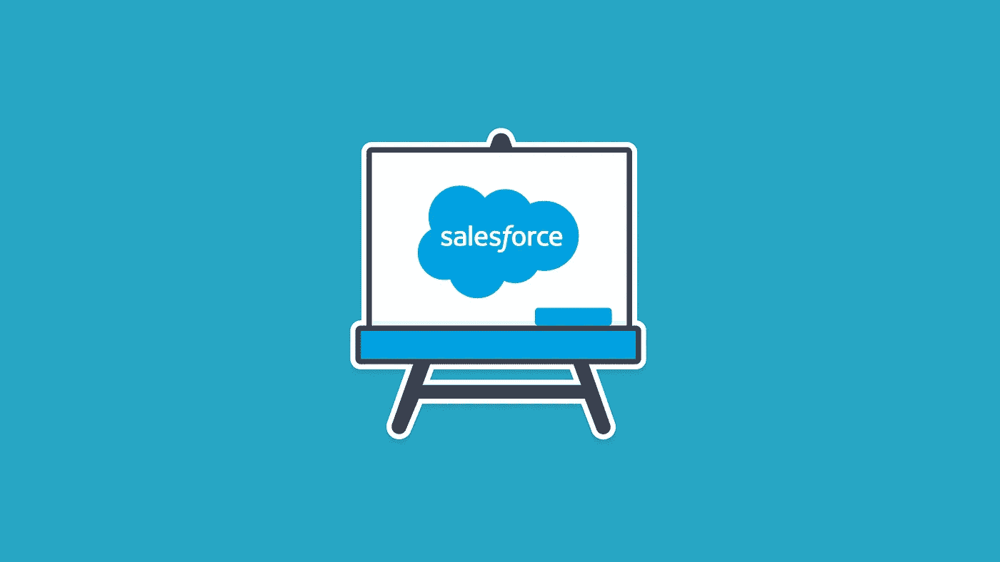

# 10+最佳 Salesforce 培训课程[2022 年 5 月]—在线准备 Salesforce 认证考试

> 原文：<https://medium.com/quick-code/top-online-courses-to-prepare-for-salesforce-certification-exams-5ab2c0434167?source=collection_archive---------0----------------------->

## 准备 Salesforce 认证考试，并在 2022 年开始您作为认证 Salesforce 开发人员的职业生涯，为初学者提供最佳 Salesforce 课程

Salesforce 认证管理员、顾问和开发人员是技术行业最需要的。对 Salesforce Admin 的需求呈指数级增长。成为 Salesforce 认证管理员是您应该考虑的一个不错的职业选择。您可以开始准备 Salesforce 认证考试，参加本文中列出的[免费 salesforce 认证课程](https://coursesity.com/free-tutorials-learn/salseforce-certification)和最佳 salesforce 课程。

## 1.[完整的 Salesforce 管理员认证课程](https://coursesity.com/r/site/the-complete-salesforce-classic-administrator-certification)

包含 Salesforce Admin 60 问题模拟测试！加入超过 42，000 名学生。遵循 Salesforce 管理考试指南。

在本课程中，您将:

*   理解考试中的所有核心概念，以便通过 salesforce 管理员认证考试
*   像专家一样管理 salesforce
*   部署 salesforce 闪电体验
*   推出 salesforce mobile
*   使用 salesforceA
*   使用 salesforce 闪电和经典

本课程是为新的 Salesforce 管理员而设计的。它深入涵盖了《管理员学习指南》的每个部分，在界面中提供了示例以及实践经验，以便您能够应用所学的概念。

10 Best Salesforce Certification Courses

## 2.[客户管理&销售队伍设计](https://coursera.pxf.io/c/1137078/1213622/14726?u=https%3A%2F%2Fwww.coursera.org%2Flearn%2Faccount-management&subId1=BotTutorials)

销售运营/管理专业化、客户管理和销售队伍设计的第一门课程旨在向学员介绍各种销售方法。

在这里，您将确定战略规划中的步骤，以及销售职能如何参与战略规划。本课程将简要介绍销售管理。具体来说，它将描述销售经理的七项任务或职责。以及它是如何随着时间的推移而演变的。

你还将谈论销售经理的生活，你将见到一位真正的销售经理，并了解他是如何走到现在这个位置的，以及他的一天是怎样的。

最后，您将看到两种销售操作:内部销售和外部销售。您还将了解个人销售的概况，并介绍购买中心的概念。

## 3.[学习 Salesforce for Admins](https://linkedin-learning.pxf.io/c/1137078/646189/8005?u=https%3A%2F%2Fwww.linkedin.com%2Flearning%2Flearning-salesforce-for-admins&subId1=quickcode)

了解如何简化 Salesforce 的用户体验和管理。

该课程包括:

*   用户和数据可见性
*   使用 Salesforce
*   定制、品牌和社交
*   报告
*   数据管理
*   数据安全

在本课程中，您将学习如何配置和管理 Salesforce，以便此 CRM(客户关系管理)工具的功能符合您的业务需求和目标。

了解如何为您的团队自定义销售路径和机会阶段、设置自定义字段以及创建自定义报告。

本课程还展示了如何保护您的数据，以及如何配置具有不同访问级别的用户帐户。使用这些提示更智能地工作，并为您的 Salesforce 用户提供更多价值。

## 4. [Salesforce 认证管理员:实践测试指南【15 小时】](https://www.eduonix.com/salesforce-certified-admin-practical-test-guide/UHJvZHVjdC0zMjMyMDA=)

学习掌握核心 Salesforce 概念并通过 Salesforce 认证管理员认证。

在本课程中，您将学习如何:

*   设置开发人员沙箱。
*   导航管理设置菜单。
*   解释闪电和经典界面的区别。
*   使用配置文件、角色和共享设置实现安全模型。
*   设计和构建定制应用程序。
*   了解字段数据类型。
*   解释 Salesforce 数据模型并理解对象关系。
*   使用页面布局、记录类型、紧凑布局和 Lightning 页面创建和修改用户界面。
*   解释销售和服务云的工作原理，以及它们包含的内容。
*   使用工作流、流程构建器、云流程设计器和审批流程自动处理复杂的业务场景。
*   通过学习如何使用数据导入向导和数据加载器导入和导出数据来管理数据。
*   举报分析！通过构建报告和仪表板，为您的业务用户提供他们需要的指标。
*   通过活动管理来管理和了解您的用户与客户沟通的方式。

## 5. [Apex 学院:Salesforce 中编码的绝对初学者指南](https://pluralsight.pxf.io/c/1137078/424552/7490?u=https%3A%2F%2Fwww.pluralsight.com%2Fcourses%2Fapex-absolute-beginner-guide-coding-salesforce&subId1=quickcode)

一个关于如何编写 Apex 代码以及为什么学习编码会让你的职业生涯(和钱包)暴涨的速成班！

该课程包括:

*   引入 Apex
*   编写基本 Apex 触发器
*   编写测试类
*   部署代码

您将参加 Salesforce 开发速成班，并学习如何编写、测试和部署 Apex 触发器。不需要编程经验——任何人都可以编码！

## 6. [Salesforce 管理员认证实践测试](https://click.linksynergy.com/deeplink?id=Fh5UMknfYAU&mid=39197&u1=quickcode&murl=https%3A%2F%2Fwww.udemy.com%2Fsalesforce-administrator-certification-practice-tests%2F)

三个完整的 Salesforce 管理员认证定时测试—每个 60 个问题—总共 180 个问题—部分级别反馈

本课程包含 3 次模拟考试，每次时间为 90 分钟。它遵循 Salesforce 的官方考试指南，以及 15 个知识领域和每个领域的相应权重，因此您可以参加实际的 Salesforce 管理员认证考试。

您将收到您的最终总分，以及部门级别的反馈，因此您可以确定您需要改进和进一步学习的领域。

## 7.[sales force Platform App Builder 开发者 401 认证](https://click.linksynergy.com/deeplink?id=Fh5UMknfYAU&mid=39197&u1=quickcode&murl=https%3A%2F%2Fwww.udemy.com%2Fsalesforce-platform-app-builder%2F)

以前的 Salesforce Developer 401 认证现在是平台应用构建器—构建应用并获得认证

在本课程中，您将学习如何:

*   了解平台应用构建器认证的所有核心概念
*   在 salesforce 平台上构建应用程序
*   在 salesforce 上设置安全性和访问权限
*   在 salesforce 中创建工作流自动化过程
*   自定义 Salesforce1 移动应用程序用户界面、导航和操作
*   配置角色层次结构
*   创建权限集
*   在全新的闪电体验界面上开发应用
*   使用 lightning 应用程序构建器和 lightning 组件
*   从 AppExchange 安装应用程序

本课程涵盖了通过平台应用构建者认证考试所需了解的每个核心概念。有用的测验结束了课程的每一部分，因此您可以在获得认证的过程中测试您对这些核心概念的记忆和知识。

## 8. [Salesforce 管理员认证课程](https://click.linksynergy.com/deeplink?id=Fh5UMknfYAU&mid=39197&u1=quickcode&murl=https%3A%2F%2Fwww.udemy.com%2Fbuild-your-app-using-salesforce%2F)

通过您的 Salesforce 管理员认证考试。涵盖 Salesforce 学习指南中提到的所有主题。

在本课程中，您将学习如何:

*   使用声明性语法构建应用程序。
*   了解高级需求，并将其转化为 Salesforce 上的应用程序
*   使用对象、字段、关系和验证规则构建数据模型
*   使用工作流和批准流程构建业务逻辑
*   使用记录类型、页面布局、选项卡和应用程序构建用户界面
*   创建简档和权限集以控制用户访问级别
*   使用组织范围的默认值设置记录安全性
*   创建用户并将他们分配到适当的简档和权限集。
*   管理许可证
*   使用角色层级等工具构建共享模型
*   使用数据加载器工具导入、更新、删除和导出记录
*   构建报告和仪表板

在本课程的每一部分之后，你会发现作业和测验。本课程有超过 7 小时的视频内容，最后是最新的 Salesforce 管理转储。它涵盖了像简档、关系、权限集和角色这样的主题。

## 9. [Salesforce 认证管理员(aka 201) 2018](https://click.linksynergy.com/deeplink?id=Fh5UMknfYAU&mid=39197&u1=quickcode&murl=https%3A%2F%2Fwww.udemy.com%2Fsalesforce-certified-administrator-201-2017%2F)

想通过 Salesforce 管理考试吗？包括模拟测试？想要获得 Salesforce 认证吗？做这门课！

通过本课程:

*   通过 salesforce 认证管理员考试
*   熟悉 salesforce 平台
*   成为云专家
*   了解如何在云中创建应用
*   成为 salesforce 认证

在本课程中，您将了解如何导航和更改 Salesforce 的用户界面，以及如何在平台上配置和制作发票应用程序。然后，您将继续深入了解 Salesforce 中的流程自动化、安全性和报告功能，然后深入了解两种云:销售和营销以及支持云，最后了解数据管理。

本课程严格遵循 Salesforce Administrator 教学大纲，因此您只需学习考试所需的知识，并在此过程中进行最佳实践。

## 10. [Salesforce 认证:服务云快速考试准备](https://click.linksynergy.com/deeplink?id=Fh5UMknfYAU&mid=39197&u1=quickcode&murl=https%3A%2F%2Fwww.udemy.com%2Fsalesforce-certification-service-cloud-rapid-exam-prep%2F)

服务云顾问认证的 40 个具有挑战性的现实实践问题，并配有视频解释

通过本课程，您将成功通过服务云认证考试，确定需要花更多时间学习的领域，并更好地理解服务云解决方案设计。

在本课程中，您将学习:

*   行业知识
*   案例管理
*   解决方案设计
*   互动渠道
*   知识管理
*   实施策略
*   联系中心分析集成
*   数据管理

## 11.[sales force Platform App Builder 认证实践测试](https://click.linksynergy.com/deeplink?id=Fh5UMknfYAU&mid=39197&u1=quickcode&murl=https%3A%2F%2Fwww.udemy.com%2Fsalesforce-platform-app-builder-certification-practice-tests%2F)

2 次限时模拟测试，每题 60 个问题。Salesforce Platform App Builder 认证的部门级反馈

本课程包含两个针对 salesforce platform app builder 认证的定时模拟测试。这些测试的时间为 90 分钟，并提供部分级别的评分。

您还会收到对每个答案的反馈，包括正确答案的更多细节以及原因。

## 12.[销售云顾问认证:快速备考](https://click.linksynergy.com/deeplink?id=Fh5UMknfYAU&mid=39197&u1=quickcode&murl=https%3A%2F%2Fwww.udemy.com%2Fsales-cloud-consultant-certification-rapid-exam-prep%2F)

使用视频练习试题准备 Salesforce 销售云考试

通过本课程，您将:

*   预测销售云顾问考试中可能出现的话题
*   找出薄弱环节，集中额外的学习时间
*   最终，在销售云认证考试中获得及格分数！

您将学习行业知识、实施战略、销售云、解决方案设计、营销和销售线索客户和联系人管理、机会管理、销售生产力社区和站点管理、销售云分析、集成和数据管理。

## 13. [Salesforce 管理员认证:通过 2017 年 ADM201 考试！](https://click.linksynergy.com/deeplink?id=Fh5UMknfYAU&mid=39197&u1=quickcode&murl=https%3A%2F%2Fwww.udemy.com%2Fsalesforce-certification-ace-the-17-admin-exam-today%2F)

快速获得您的 Salesforce 认证|60 多个实践考试问题|包括免费的 Salesforce 帐户登录

本课程将:

*   回答考试问题、应用知识并展示 Salesforce 管理能力
*   描述公司概况的组成部分(例如，财政年度、营业时间、货币管理、默认设置、公司信息)。
*   确定设置和/或维护用户的步骤(例如，分配许可证、重置密码和解析锁定的用户帐户)。
*   解释各种组织安全选项(例如，密码、IP 限制、身份确认、网络设置)。
*   描述标准的对象架构和关系模型。
*   描述创建或自定义报告时可用的选项(例如，报告类型、报告格式、字段、汇总数据、过滤数据、图表、计划和条件突出显示)。

您准备好参加实践课程了吗？该课程旨在使您具备回答考试问题、应用知识和演示、销售队伍管理能力、描述公司概况的组成部分、确定设置和/或维护用户的步骤、解释各种组织安全选项、描述标准对象架构和关系模型以及描述创建或自定义报表时可用的选项的技能。

## 14.[开始您的 Salesforce 顾问生涯简介](https://click.linksynergy.com/deeplink?id=Fh5UMknfYAU&mid=39197&u1=quickcode&murl=https%3A%2F%2Fwww.udemy.com%2Fsalesforce-consultant-certification%2F) —【免费课程】

Salesforce 是通向云的最容易实现的职业道路，并且非常需要顾问技能和认证。

在本课程中:

*   您将了解到该认证的要求是什么
*   了解平台咨询所需的行业知识
*   熟悉一些实施策略
*   学习如何让你的学习和事业更进一步

本课程涵盖了您需要了解的行业知识和关键概念，以便在 salesforce 中开始咨询职业生涯，或提供进一步的背景知识和背景知识以从事任何 salesforce 顾问工作。

> 感谢您阅读本文。我们策划了更多主题的顶级教程，您可能想看看:

 [## 10+最佳 AWS 培训在线课程—为 AWS 认证做准备

### 用 2022 年最好的新手 AWS 培训课程为开发者准备 AWS 认证。

medium.com](/quick-code/top-tutorials-to-prepare-for-aws-certification-exams-e991c55b54b0)  [## 10+最佳微软 Azure 初学者教程—在线学习微软 Azure

### 2022 年用最好的 Azure 初学者教程学习 Azure for cloud 开发

medium.com](/quick-code/top-tutorials-to-learn-microsoft-azure-for-cloud-computing-258affcd2c5d)  [## 10+最佳 JIRA 初学者教程—在线学习 JIRA

### 用 2022 年 JIRA 最佳初学者教程学习 JIRA 管理 bug 跟踪和敏捷项目管理

medium.com](/quick-code/top-tutorials-to-learn-jira-9120b409ccee) 

***披露:*** *如果您通过本页面的链接购买课程，我们可能会获得一小笔代销商佣金。谢谢你。*