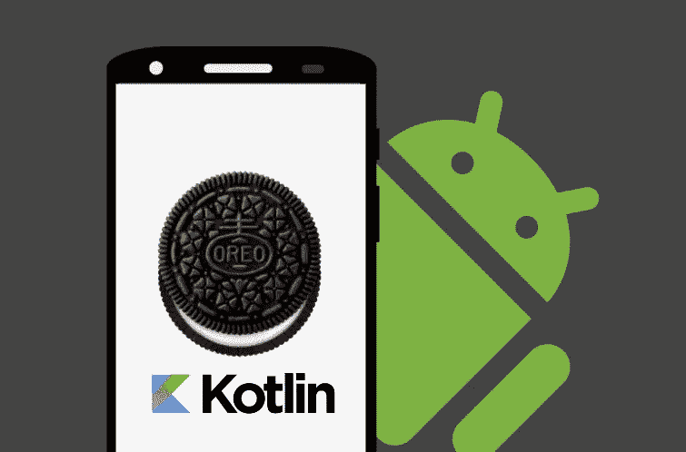

# 10+最佳新手 Android 开发教程[2022 年 11 月]—在线学习 Android 开发

> 原文：<https://medium.com/quick-code/top-online-tutorials-to-learn-android-oreo-app-development-bb0203163f14?source=collection_archive---------0----------------------->

## 2022 年用最好的 android 开发教程学习如何创建一个 android 应用程序

Android 是 90 多种平板电脑、6 种电子阅读器和 300 种智能手机的主要操作系统。Google Play 商店中有超过 1，460，800 个应用程序&它们正以惊人的速度增长！全世界每天大约有 150 万台 Android 设备被激活。Google play 商店中大约 60%的应用程序是完全免费的！这些课程来自定期更新的 [**最佳安卓课程**](https://coursesity.com/best-tutorials-learn/android) 。

# 1. [Android O & Java —手机应用开发](https://click.linksynergy.com/deeplink?id=Fh5UMknfYAU&mid=39197&u1=quickcode&murl=https%3A%2F%2Fwww.udemy.com%2Fandroid-app-development-with-java%2F)

Android Studio 和 Java 的完整 Android 课程。从初学者到专业应用开发者。

您将学会:

*   构建任何你想要的 Android 应用程序
*   有一个应用程序组合来申请 jr .开发人员的工作
*   为您的企业构建应用
*   能够作为一个自由的机器人承包商工作

这个 Android with Java 课程基于伦敦的一个面对面的应用程序开发训练营。

该课程包括数小时的高清视频教程，并通过制作真实世界的应用程序来积累您的编程知识。本课程结束时，你将能够流利地使用 Java 编程，并准备好制作自己的应用程序，或者作为一名 Android 开发人员开始一份自由职业。课程结束时，你不仅会熟悉，还会完全理解:

*   面向对象编程(OOP)的概念:类型系统、变量、函数和方法、继承、类和协议。
*   控制结构:使用 If/Else 子句、Switch 语句和逻辑来控制执行流程。
*   数据结构:如何使用集合，如数组、映射和数组列表。
*   软件设计:如何组织和格式化代码以提高可读性，以及如何实现模型视图控制器(MVC)设计模式。
*   联网:如何进行异步 API 调用，从云中存储和检索数据，以及使用 JSON 格式进行服务器通信。

它提供了最好的教师，精心制作的内容，美丽的动画和边做边学。

## 2.[打造你的第一款 Android 应用(以项目为中心的课程)](https://coursera.pxf.io/c/1137078/1213622/14726?u=https%3A%2F%2Fwww.coursera.org%2Flearn%2Fandroid-app&subId1=BotTutorials)

在这个以项目为中心的课程中，你将为 Android 移动平台设计、构建和分发你自己独特的应用程序。

在本课程中，您将学习如何:

*   使用一组可定制的构建模块创建许多不同类型的应用程序，您可以将它们组装到一起
*   熟悉 Android 开发的许多重要特性。
*   记录您的个性化应用程序，以获得潜在用户的反馈或整理您的想法。

你将从用户的角度设计你的个性化应用。本课程将向你展示在你的设计中可以组合的元素。

本课程指导您使用 Android Studio 集成开发环境(IDE)开发 Android 应用程序。

首先，它为您指出了安装 Android Studio IDE 和 Android 软件开发工具包(SDK)的正确位置。

接下来，它将带您完成使用它们创建一个基本的“Hello World”应用程序的步骤，并描述如何转移应用程序，以便在物理 Android 设备和仿真器上执行。

# 3. [Android 开发:导航架构组件](https://linkedin-learning.pxf.io/c/1137078/646189/8005?u=https%3A%2F%2Fwww.linkedin.com%2Flearning%2Fandroid-development-the-navigation-architecture-component&subId1=quickcode)

导航架构有可能通过简化应用程序中目的地之间导航的实现，从根本上改变应用程序的设计方式。

在本课程中，您将学习如何:

*   添加片段作为目的地。
*   将数据传递到目的地。
*   使用动作导航。

本课程首先介绍这一激动人心的 Android Jetpack 功能。您将了解什么是导航架构组件，以及如何将导航添加到活动中。

它还详细介绍了如何将片段添加为目的地、将数据传递到目的地、使用动作导航等等。

# 4.[安卓游戏开发——打造你的第一款手机游戏](https://www.eduonix.com/android-game-development/UHJvZHVjdC0zMjMyMDA=)

通过在 SurfaceView 中制作完整的 Flappy Bird 游戏，学习用 Android Studio 和 Java 进行 Android 游戏开发。

该课程包括:

*   Android 游戏开发简介
*   在 Android Studio 中创建项目
*   创建 BitmapBank 类预览
*   创建游戏视图职业预览
*   创建 GameThread 类预览
*   创建 BackgroundImage 类预览
*   继续构建游戏引擎预览版
*   完成框架

该课程将一步一步地向您展示如何为您的游戏创建不同的关卡，并以最简单的方式添加一些功能，如更改游戏背景和增加每个后续关卡的管道速度，以使您的游戏更加有趣和迷人。

本课程将提高您解决问题的能力，因为它将邀请您自己寻找解决方案，这样您就可以像专业人员一样思考和编码。

你将演示如何通过谷歌 AdMob 横幅和间隙(全屏)广告货币化你的应用程序，这样你就可以开始获得一些收入。

一旦你购买了这门课程，你将会得到所有的项目源代码，你可以自由地将它用于你的个人工作。

在课程结束时，您将能够使用 Java 构建一个完整的 Flappy Bird 游戏，并将其发布到 Google Play 上。

随着 Java 技能的提高，你将对 2D 游戏背后的核心概念有一个清晰的理解。

# 5.[用 Java 开发现代安卓应用](https://www.educative.io/courses/modern-android-app-development?affiliate_id=5088579051061248)

在本课程中，您将采用基于项目的实践方法来开发 Android 应用程序。

该课程包括:

*   安卓生态系统
*   你好世界
*   旅游博客—登录屏幕
*   旅游博客-详细信息屏幕
*   旅游博客-列表屏幕
*   旅游博客—搜索和排序

您将使用 Android 开发人员日常使用的最常用工具，包括 Java、Groovy 和 XML。

随着您的学习，您将构建一个功能齐全的旅游博客应用程序，这将是您的投资组合的一大亮点。

本课程结束时，您将已经构建了一个功能完整的 Android 应用程序，并准备好构建更复杂的项目。

# 6.[安卓:SQLite 基础](https://pluralsight.pxf.io/c/1137078/424552/7490?u=https%3A%2F%2Fwww.pluralsight.com%2Fcourses%2Fandroid-sqlite-fundamentals&subId1=quickcode)

本课程将指导您如何使用 Android SQLite 为您的应用程序创建数据库。这里涵盖了使用 SQLite 持久保存数据并使其对应用程序保密所需的所有细节。

该课程包括:

*   熟悉 SQLite
*   定义模式和契约类
*   使用 SQL Helper 创建数据库
*   将数据插入数据库
*   从数据库中读取和显示数据
*   修改 SQLite 数据库中的数据
*   比较 SQLite 数据库

在本课程“Android: SQLite 基础”中，您将学习在自己的应用中使用 SQLite 的基础知识。

首先，您将了解什么是 SQLite 以及如何开始使用它。接下来，您将了解如何设计和创建数据库，并为您的应用程序向其中插入数据。

最后，您将探索如何与数据库中的数据进行交互。学完本课程后，您将掌握在 Android 中使用 SQLite 以一种结构良好且安全的方式处理应用数据的技能和知识。

## 7.[学习安卓基础知识](https://www.pjatr.com/t/TUJGR0lLR0JHR0pMSUtCR0ZISk1N?sid=quickcode&url=https%3A%2F%2Fwww.codecademy.com%2Flearn%2Flearn-the-basics-of-android)

在本课程中，您将被介绍到 Android 的奇妙世界。你会发现为什么 Android 是一个开发应用程序的好地方。

在本课程中，您将学习:

*   为什么为 Android 开发是如此重要的一步，开始使用 Android Studio——Android 集成开发环境。
*   深入 Android Studio —了解如何启动项目、在设备上运行应用程序，以及制作您的第一个 Android 应用程序。
*   Android 开发基础，提高您构建计算器应用程序的技能。

您将见到 Android Studio——Android 的集成开发环境(IDE ),您将学习构建简单 Android 应用程序并在真实或模拟虚拟设备上运行它们所需的基本技能！

# 8.[学习 Android O 开发，打造 10 款 app](https://click.linksynergy.com/deeplink?id=Fh5UMknfYAU&mid=39197&u1=quickcode&murl=https%3A%2F%2Fwww.udemy.com%2Fandroid-o-course%2F)

用 Java 完成 Android O 课程—构建 10 个应用。还包括 Firebase 部分。在本课程中，您将:

*   在 Android 中构建 10 个应用程序
*   了解 Android 开发流程
*   能够在公司申请 Jr 安卓开发者

本课程的目标是让你为成为一名 Android 应用程序开发人员做好准备，这样你就可以制作你梦想中的应用程序，或者申请成为 Jr. Android 应用程序开发人员。此外，在本课程结束时，你将有 10 个应用程序作为投资组合，这样你就更容易在面试过程中脱颖而出。

这里有一个你将建立的应用程序列表:
1。发光灯泡创意 App
2。蛇与梯子 App
3。井字游戏
4。Patatap 克隆—音乐应用
5。学习西班牙数字
6。提醒 App
7。天气 App
8。在地图 App 上标注奇观
9。待办事宜应用
10。谷歌 Firebase 登录
11。定制 Firebase 映像上传器

在本课程中有很多关于 Firebase 的内容。Firebase 是完整的后端解决方案，由 Google 官方支持。声音、GPS、位置、数据库、图库访问等功能都包含在本课程中。您还将通过查看 google 资源和堆栈溢出内容来学习解决问题的方法。

# 9. [Kotlin for Android O 开发:从初级到高级](https://click.linksynergy.com/deeplink?id=Fh5UMknfYAU&mid=39197&u1=quickcode&murl=https%3A%2F%2Fwww.udemy.com%2Fkotlinandroid%2F)

学习使用 Kotlin 编写和设计 Android 应用程序，同时构建 Instagram 和 Foursquare clone 等真实应用程序示例。

在我们课程结束时，您将能够从头开始创建专业应用程序并提交到 play store！你也将拥有专业开发人员的技能，他们可以通过开发应用程序赚取数千美元。

你将从下载 Java JDK 和 Android Studio 开始。一旦你安装了这些，你将通过构建像 Instagram & Foursquare 克隆这样的真实应用来学习！

当你完成我们的全部课程时，你将能够在 Android 中创建几乎任何你想要的应用程序！

您将学习以下主题的有用技能:

*   科特林基础
*   草图版式设计
*   科特林精要
*   表格视图
*   SQLite 解析
*   Firebase APIs
*   使用服务器
*   AWS 服务器设置
*   社交媒体和网络

您还将学习相关主题，并通过构建类似“艺术书籍”、“抓住肯尼游戏”、“实时货币转换器”、“Instagram 克隆”、“旅行地图”、“Foursquare 克隆”的应用程序来实践它们。在本课程中，您还将学习 Firebase 和 Parse，而大多数在线指南只教您一种！

# 10.【Android O 开发者基础课程(Java)

详细了解如何使用 Java 在 Android O 中编写应用程序。您将能够:

*   编写高效和高质量的 Android 应用程序
*   了解如何使用 Android Studio 编译和测试 Android 应用程序
*   了解 Android 开发的各个方面，从初级主题到高级主题
*   了解如何在 Android 中设计和实现图形用户界面
*   了解如何将数据库集成到 android 应用程序中来存储持久数据
*   了解如何向谷歌 Play 商店提交应用并通过广告和应用内购买获得收入
*   了解如何将片段用于多种屏幕尺寸的动态用户界面
*   了解如何使用 Java 编程语言实现移动应用

您将学习在 Android 平台上使用 Java 编程语言编写移动应用程序。这将包括以下主题:Android 生命周期、Android 资源、用户界面设计和实现、用户界面控件(如按钮和文本字段)、数据库交互、基于位置的服务、地图、Google Play 服务 API、Firebase、片段和各种其他主题。本课程帮助您了解 Android 平台及其各种应用编程接口。

本课程结束时，您将能够使用 Android 平台及其 API 的所有方面编写自己的 Android 应用程序。您将能够向谷歌 Play 商店提交您的应用程序，并了解如何将您的应用程序货币化。

# 11.[完整的 Android Oreo 开发者课程——构建 23 个应用！](https://click.linksynergy.com/deeplink?id=Fh5UMknfYAU&mid=39197&u1=quickcode&murl=https%3A%2F%2Fwww.udemy.com%2Fthe-complete-android-oreo-developer-course%2F)

使用 Java & Kotlin 学习 Android 应用程序开发，并构建真正的应用程序，包括超级马里奥 Run、Whatsapp 和 Instagram！在本课程中，您将:

*   制作几乎任何你喜欢的 Android 应用程序(你唯一的限制是你的想象力)
*   将您的应用提交到 Google Play，并通过 Google Pay 和 Google Ads 创收
*   成为一名专业的应用程序开发人员，从事自由职业，在世界任何地方工作

无论你是希望迎来下一代智能电视、健身可穿戴设备、游戏机、改变游戏规则的人工智能、智能手表，还是仅仅为了老式的乐趣而开发简单的应用程序，Android 8.0 Oreo 都是你发挥无限创造力的关键。

为您带来迄今为止最全面的安卓课程。一门经过严格测试的、详尽的课程，带有严重的冲击因素。

# 12.[使用 Android Oreo 的 Android Kotlin 开发大师班](https://click.linksynergy.com/deeplink?id=Fh5UMknfYAU&mid=39197&u1=quickcode&murl=https%3A%2F%2Fwww.udemy.com%2Fandroid-oreo-kotlin-app-masterclass%2F)

Kotlin 将在 Android 应用开发方面超越 Java。使用 Android Studio 改善职业选择。在本课程中:

*   您将发现 Android 应用程序开发的力量，并获得大幅提升您作为软件开发人员的职业前景的技能。
*   你也将比其他使用过时工具和 Android 早期版本的开发人员领先一步。
*   你被教导为最新版本的 Android Oreo 编写代码，重点是 AppCompat。这样，你构建的应用程序也将支持旧版本的 Android。
*   你的技能水平得到了最大化，因此你的应用可以接触到更多的用户，这意味着更多的下载，这意味着更多的钱。

这是你参加本课程的额外津贴:

*   为最新版本的 Android 8 Oreo 开发应用程序，这些应用程序也可以在运行旧版本 Android 操作系统的旧 Android 设备上运行。
*   下载、安装和配置必要的(免费)软件。
*   创建您的第一个应用程序。
*   构建一系列展示 Android 框架关键方面的应用程序。
*   在模拟器或真正的安卓手机或平板电脑上测试你的应用。
*   您将学习 Kotlin 编程，因为 Google 最近刚刚在 Android 应用程序开发中添加了对 Kotlin 的支持。包括科特林教程视频，将让你快速上手。
*   确保您的应用程序能够在手机和平板电脑上与当前和旧版本的 Android 兼容。
*   使用 Android studio 3，这是谷歌首要 Android 工具的最新版本。
*   了解如何使用数据库、web 服务，甚至让您的应用程序说话！
*   了解所有新的约束布局，用于“拖放”屏幕创建。
*   使用强大的代码库来播放视频、下载网站数据、处理图像

为了巩固你在课程中学到的知识，我们设计了许多挑战来帮助你理解所教授的每一个概念。你还会看到挑战的解决方案，这样你就知道你总是在正确的轨道上。

# 13. [Kotlin Android 开发大师班—使用 Android Oreo](https://click.linksynergy.com/deeplink?id=Fh5UMknfYAU&mid=39197&u1=quickcode&murl=https%3A%2F%2Fwww.udemy.com%2Fkotlin-android-developer-masterclass%2F)

从零开始学习 Kotlin 1.2，Android 开发，Android Studio & IntelliJ IDEA。您将学会:

*   用 Kotlin 构建 Android 应用程序。
*   使用 Kotlin 构建复杂的 Android Oreo 应用程序
*   快速掌握 Kotlin 编程语言
*   通过本教程和完整的课程，在 Android 开发、Android Studio、IntelliJ IDEA 和面向对象的 Kotlin 编程方面打下坚实的基础。
*   使用 Android Studio、IntelliJ IDEA 和 Kotlin 编程语言从头开始构建 Android 应用程序

本课程将在 5 周内带你从一个对 Android O app 开发一无所知的人，成长为一个完整的 Android 开发者。您将了解以下内容:

*   IntelliJ 理念和构建用户界面(设置和演练)
*   Android Studio 和构建用户界面(设置和演练)
*   用于构建 Android 应用程序输入的 Kotlin 编程基础，
*   按钮和反应式界面 Android 构建模块变量、数组、循环、数组列表、列表视图
*   在屏幕间导航，在屏幕间传递信息

此外，一旦您购买了课程，它将永远属于您。你可以随时查阅你想修改的任何部分。如果你了解 Android 和 Kotlin，你将永远在市场上保持竞争力。

# 14. [Android 开发基础培训:你的第一个 Kotlin 应用](https://linkedin-learning.pxf.io/c/1137078/646189/8005?u=https%3A%2F%2Fwww.linkedin.com%2Flearning%2Fandroid-development-essential-training-your-first-app-with-kotlin&subId1=quickcode)

在本课程中，您将逐步了解如何使用混合编程语言(包括 XML 和 Kotlin)创建您的第一个 Android 应用程序。

在本课程中，您将学习如何:

*   配置 Android Studio、Android SDK 和仿真器软件。
*   探索典型 Android 应用程序中的不同文件，包括构建脚本和应用程序清单文件。

了解如何配置 Android Studio、Android SDK 和仿真器软件，并探索典型 Android 应用程序中的不同文件，包括构建脚本和应用程序清单文件。

最后，学习如何自下而上地构建一个应用程序，包括屏幕、活动和布局。查看本系列的后续课程，继续培养您的应用程序开发技能。

> 感谢您阅读本文。我们策划了更多主题的顶级教程，您可能想看看:

 [## 10+最佳科特林初学者教程-在线学习科特林

### 2021 年用最好的 Kotlin 初学者教程学习 Kotlin for android 开发

medium.com](/quick-code/top-tutorials-to-learn-kotlin-android-development-for-beginners-fad63af16996)  [## 10+适合初学者的最佳颤振教程——在线学习颤振

### 学习 Flutter，使用一个代码库，为初学者提供最好的 Flutter 教程，一起构建 Android 和 iOS 应用程序…

medium.com](/quick-code/best-video-tutorials-of-flutter-to-develop-application-for-android-ios-30909618f8e5)  [## 10+最佳新手 Android 开发教程——在线学习 Android 开发

### 2021 年学习如何用最好的 android 开发教程创建一个 android 应用程序

medium.com](/quick-code/top-online-tutorials-to-learn-android-oreo-app-development-bb0203163f14) 

披露:我们与本文中提到的一些资源有关联。如果你通过本页的链接购买课程，我们可能会得到一小笔佣金。谢谢你。