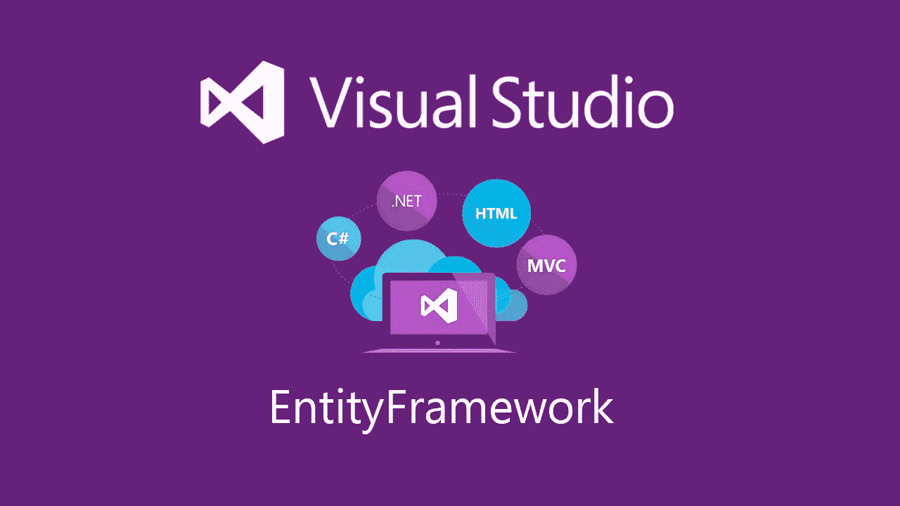
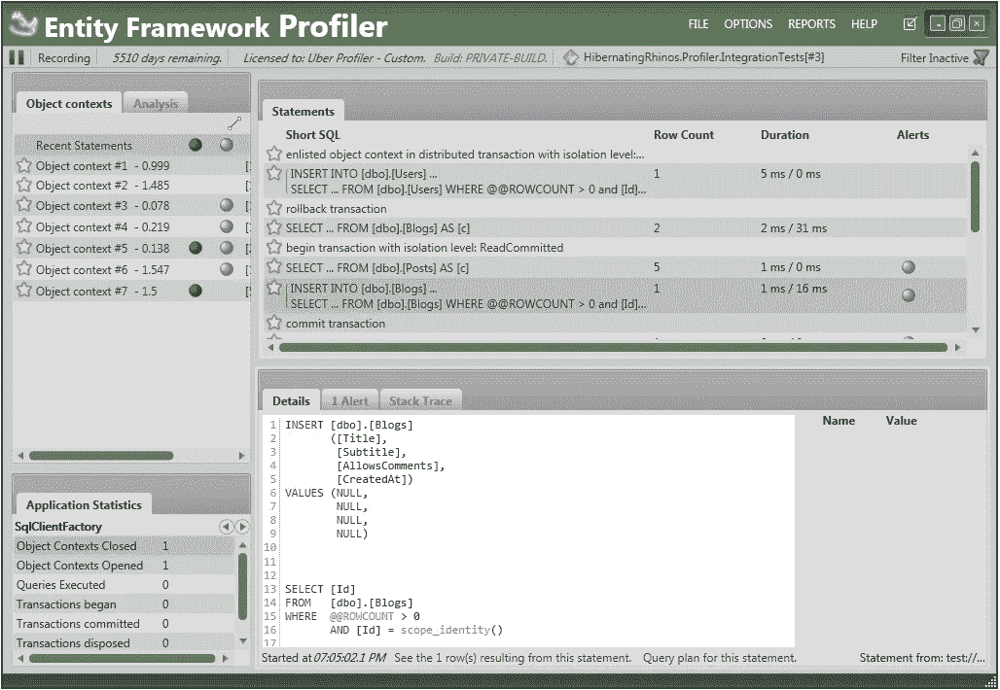

# 初学者的 8 个最佳实体框架教程[2022 年 7 月] —在线学习实体

> 原文：<https://medium.com/quick-code/top-online-tutorials-to-learn-entity-framework-for-orm-1af60de7fb8?source=collection_archive---------0----------------------->

## 学习实体的基础知识和对象关系映射器(ORM)的高级概念，2022 年为初学者提供最佳实体教程

实体框架是一个对象关系映射器(ORM ),帮助您从数据库读取数据和向数据库写入数据。实体框架帮助开发人员使用特定于领域的对象来处理关系数据。使用实体框架，开发人员可以省去他们需要编写的大部分数据访问代码。

# 1.[实体框架深度:完整指南](https://click.linksynergy.com/deeplink?id=Fh5UMknfYAU&mid=39197&u1=quickcode&murl=https%3A%2F%2Fwww.udemy.com%2Fentity-framework-tutorial%2F)

将应用程序连接到 SQL Server 数据库。

在本课程中，您将:

*   理解数据库优先和代码优先工作流之间的区别
*   使用数据库优先工作流构建领域模型
*   使用代码优先的工作流构建域模型(使用现有的或新的数据库)
*   使用代码优先迁移来升级或降级您的数据库
*   覆盖代码优先约定(使用数据注释和 fluent API)
*   使用 LINQ 查询数据(使用查询语法和扩展方法)
*   有效地使用急切加载、延迟加载和显式加载
*   添加、更新和删除对象
*   使用其他工具对您的应用程序进行分析和故障排除
*   理解什么是存储库模式，需要什么和是否需要，以及如何实现它
*   通过实体框架应用最佳实践

本课程通过一系列清晰、简洁、动手操作的讲座，教你实体框架的核心概念。通过本课程，您将能够:

*   理解代码优先和数据库优先工作流之间的区别
*   使用数据库优先工作流构建领域模型
*   使用代码优先工作流构建域模型(使用新的或现有的数据库)
*   使用代码优先迁移来升级或降级您的数据库
*   覆盖代码优先约定(使用数据注释和 fluent API)
*   使用 LINQ 查询数据(使用查询语法和扩展方法)
*   有效地使用急切加载、延迟加载和显式加载
*   添加、更新和删除对象
*   使用其他工具对您的应用程序进行分析和故障排除
*   理解什么是存储库模式，为什么、何时以及如何使用它
*   通过实体框架应用最佳实践

在每一部分，你都会找到练习来帮助你巩固材料。

# 2.[对遗留数据库使用实体框架核心](https://linkedin-learning.pxf.io/c/1137078/646189/8005?u=https%3A%2F%2Fwww.linkedin.com%2Flearning%2Fusing-entity-framework-core-with-legacy-databases&subId1=quickcode)

使用本课程中展示的实用技术，您可以将 EF Core 用于现有的关系数据库，并根据需要修改生成的代码。

在本课程中，您将学习如何:

*   连接到一个数据库，用它搭建一个模型。
*   编写干净的、跨平台的代码，从长远来看易于维护。

本课程展示了如何连接到数据库，从数据库构建模型，并开始改进该模型。

它使用影子属性、并发令牌和其他技术来最好地将数据库映射到应用程序。

不管你的表格和字段有多乱，EF Core 都会帮你写出干净的、跨平台的、长期来看容易维护的代码。

# 3.[实体框架核心:入门](https://pluralsight.pxf.io/c/1137078/424552/7490?u=https%3A%2F%2Fwww.pluralsight.com%2Fcourses%2Fgetting-started-entity-framework-core&subId1=quickcode)

本课程帮助那些对早期版本的 EF 和 EF Core 有经验的人，以及对实体框架完全陌生的开发者。

该课程包括:

*   使用 EF Core 3.1 创建您的第一个应用
*   控制数据库创建和模式更改
*   映射多对多和一对一关系
*   与您的 EF 核心数据模型互动
*   与相关数据交互
*   使用视图、存储过程和原始 SQL
*   使用 EF 芯和 ASP.NET 芯的
*   使用 InMemory 提供程序而不是真实的数据库进行测试

了解如何使用 EF Core 3.1 构建数据模型，使用 EF Core 让您的软件与数据库中的数据进行交互，并将 EF Core 整合到您的自动化测试中

首先，您将学习如何构建数据模型并与之交互。然后，您将发现如何设置日志记录来深入了解 EF Core 如何与您的数据库交互。

最后，您将探索如何让 EF Core 使用您自己的数据库逻辑，并在测试和【ASP.NET】T4 核心应用程序中使用 EF Core。

本课程结束时，您将能够使用 EF Core 3.1 并从中受益。

# 4.[学 C#:用实体框架做一个数据库化的 App](https://click.linksynergy.com/deeplink?id=Fh5UMknfYAU&mid=39197&u1=quickcode&murl=https%3A%2F%2Fwww.udemy.com%2Flearn-c-make-a-databased-app-with-entity-framework%2F)

首先学习如何用 C#创建一个可以使用实体框架和代码生成自己的数据库的应用程序。

在本课程中，您将能够:

*   仅使用 C#代码定义和构建 SQL 数据库。不需要数据库开发！
*   使用 C#代码对实体执行 CRUD 操作(创建、读取、更新、删除)。
*   使用代码优先迁移处理实体更改。
*   如果需要，调用自定义 SQL 语句。

在本课程中，您将学习如何使用 Microsoft Visual Studio 创建一个简单的 C#应用程序，该应用程序使用 Entity Framework 创建并连接到 SQL 数据库，而无需进行数据库开发！

您将使用代码优先开发原则，仅使用 C#代码来定义所有数据库表和列。所有数据库表和列都将由 C#代码自动生成，无需直接编辑数据库。

# 5.[完整的 ASP.Net 核心 MVC & EF 核心(原 MVC5-EF6)](https://click.linksynergy.com/deeplink?id=Fh5UMknfYAU&mid=39197&u1=quickcode&murl=https%3A%2F%2Fwww.udemy.com%2Faspnet-mvc-with-entity-framework-from-scratch%2F)

这两种 web 开发方法。Net 框架到。网络核心

在本课程中，您将能够:

*   理解实体框架的核心概念
*   开始使用实体框架作为您的数据访问层
*   使用实体框架时处理所有实时场景
*   了解 Asp.Net MVC 的基础知识
*   制作一个真正的、生产就绪的 web 应用程序
*   使用 Asp.Net MVC 和实体框架构建任何 web 应用程序

首先，本课程包含基本实体框架课程中 ObjectContext 的所有内容和高级实体框架课程中 DbContext 的所有内容，涵盖了普通开发人员在使用实体框架作为数据访问层的任何项目中需要了解的所有领域。它的范围从基本操作如插入、更新、删除和选择到高级操作如事务和优化技术(延迟加载、快速加载等)。,).

最后，表现逻辑层将是 ASP.Net MVC，你将学习 ASP。NET MVC 是一个使用成熟的设计模式来构建可扩展的、基于标准的 web 应用程序的框架。

您还将学习如何通过实现定制验证器来验证表单和实现业务规则验证。

# 6.[学习实体框架核心](https://click.linksynergy.com/deeplink?id=Fh5UMknfYAU&mid=39197&u1=quickcode&murl=https%3A%2F%2Fwww.udemy.com%2Flearning-entity-framework-core%2F)

从头开始学习实体框架核心，构建高效安全的 web 应用程序。

在本课程中，您将学习如何:

*   探索对象关系映射
*   安装实体框架核心
*   创建数据库上下文
*   创建、执行和回滚迁移
*   执行复杂的关系模型
*   为数据库设定种子
*   编写自定义 SQL 查询
*   使用现有数据库

在本课程中，您将学习如何创建、执行和回滚您自己的迁移。您还将熟悉创建复杂关系模型所需的一切。

您将探索实体框架的一些最重要的高级特性，如影子属性、数据库生成的值和原始 SQL 查询。您将知道如何利用现有的数据库，并以最少的干预编写基于它的项目。

# 7.[使用 MVC 6 和实体框架核心 1.0 学习 ASP.NET 核心](https://click.linksynergy.com/deeplink?id=Fh5UMknfYAU&mid=39197&u1=quickcode&murl=https%3A%2F%2Fwww.udemy.com%2Flearn-aspnet-core-mvc-web-apis-ef-core-bonus-ios-app%2F)

使用名为 ASP.NET(5)核心的全新完全从头开始编写的框架学习 web 应用程序开发。

在本课程中，您将学习如何:

*   使用 MVC 和实体框架核心开发 Asp.Net 核心 web 应用程序
*   使用 Asp.Net 核心在云中开发和托管 Web APIs
*   从头开始使用 Swift 从 iOS (iPhone)应用程序使用 Web APIs

在这门新课程中，您将学习使用全新的完全从头开始编写的框架(称为 ASP.NET 核心 1.0，使用 MVC 6 和实体框架)开发 web 应用程序。

# 8.[实体框架:综合教程](https://click.linksynergy.com/deeplink?id=Fh5UMknfYAU&mid=39197&u1=quickcode&murl=https%3A%2F%2Fwww.udemy.com%2Fentity-framework-a-comprehensive-course%2F)

深入的实体框架。涵盖从基础到高级的主题，如代码优先、LINQPad、项目

通过本课程:

*   学习 ORM 技术—基本概念
*   了解实体框架—概述
*   用 EF 读取数据
*   使用实体框架创建、更新、删除
*   执行本机 SQL 查询
*   连接和分组表格
*   附着和分离对象
*   实现代码优先 main
*   创建数据库交互
*   实现代码优先迁移
*   配置映射
*   实现 LINQPad
*   在实体框架中创建交易记录
*   理解存储库模式和工作单元
*   创建演示项目

> 感谢您阅读本文。我们策划了更多主题的顶级教程，您可能想看看:

 [## 15+最佳 Spring 框架教程—在线学习 Spring

### 2021 年用最好的 spring 教程学习 web 应用程序开发的 spring 框架

medium.com](/quick-code/top-tutorials-to-learn-spring-framework-for-the-java-application-12db01d9c288)  [## 10 个最好的 PostgreSQL 初学者教程——在线学习 PostgreSQL

### 学习 PostgreSQL 的学习强大的数据库管理系统与最好的 PostgreSQL 教程初学者在…

medium.com](/quick-code/top-tutorials-to-learn-postgresql-database-for-beginners-99ff0deb9f84)  [## 15+最佳 Django 初学者教程——在线学习 Django

### 用 2021 年的最佳 Django 初学者教程学习 Django 进行 web 开发

medium.com](/quick-code/top-tutorials-to-learn-django-framework-for-python-beginners-fe1a9e315aa9) 

披露:我们与本文中提到的一些资源有关联。如果你通过本页的链接购买课程，我们可能会得到一小笔佣金。谢谢你。