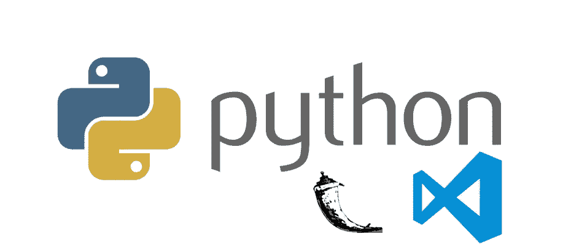
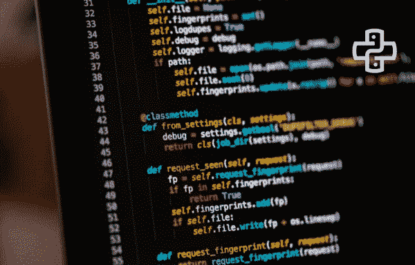

# 10+初学者最佳 Flask Python 教程[2023 年 3 月] —在线学习 Flask

> 原文：<https://medium.com/quick-code/top-online-tutorials-to-learn-flask-python-c2723df5326c?source=collection_archive---------0----------------------->

## 用 2023 年初学者最佳 Flask 教程学习 Flask for web development

Flask 是 Python 的一个微框架，用于构建 web 应用程序。通过“微框架”这个词，我们不限制 Flask 的能力。Flask 同样适用于大型应用程序和小型应用程序。

> **披露:**如果您通过本页的链接购买课程，我们可能会获得一小笔会员佣金。谢谢你。

## 1. [Python Flask for 初学者:用 Python 3 构建 CRUD web app](https://click.linksynergy.com/deeplink?id=0F1O0otUXQc&mid=47901&u1=csMedium&murl=https%3A%2F%2Fwww.udemy.com%2Fcourse%2Fpython-flask-beginners%2F)

学习使用 Python 和 Flask 构建动态 web 应用|学习 Flask 最实用的课程。您将学会:

*   使用 Flask 创建 web 服务器
*   理解网络实际上是如何工作的
*   执行 MySQL 数据库的创建、读取、更新和删除操作
*   使用 PyYAML，使用 YAML 文件来存储和检索配置参数
*   使用 flask-mysqldb 轻松地将应用程序连接到 MySQL 数据库
*   使用 Flask 的 Jinja2 模板引擎
*   通过 HTTP POST 请求提交用户表单
*   哈希用户提交的敏感信息
*   理解 HTTP GET 请求和 HTTP POST 请求之间的区别
*   使用 flask-ckeditor 将 CKEditor 集成到您的博客应用程序中

本课程旨在帮助您熟悉使用 Python 的 Flask 框架构建 web 应用程序。

本课程将从基础开始教你 Flask，涵盖更高级的主题，你将最终使用 Flask 构建一个博客应用。

Python 一直是最容易编程的语言之一。本课程假设您熟悉 Python 的基础知识，如变量、数据类型、函数等。它也期望你知道 HTML 和 CSS 的基础知识。

## 2.[用 Python 和 Flask 创建你的第一个 Web 应用](https://coursera.pxf.io/c/1137078/1213622/14726?u=https%3A%2F%2Fwww.coursera.org%2Fprojects%2Fpython-flask&subId1=csMedium)

在这里，您将学习使用 Flask 框架使用 Python 开发 web 应用程序的基础知识。

在本课程中，您将学习如何:

*   用 Flask 创建 Web 应用程序。
*   在 Flask 应用程序中使用 WTForms 和 SQLAlchemy。
*   在烧瓶应用中使用模板。

通过动手实践，您将了解创建 Flask 应用程序、在 Flask 应用程序中使用模板、在 Flask 中使用 SQLAlchemy 和 SQLite 以及使用 Flask 和 WTForms 等概念。

然后，您将应用这些概念用 Python 和 Flask 创建您的第一个 web 应用程序。

## 3.[带砂箱的全堆叠网开发](https://linkedin-learning.pxf.io/c/1137078/646189/8005?u=https%3A%2F%2Fwww.linkedin.com%2Flearning%2Ffull-stack-web-development-with-flask&subId1=quickcode)

希望构建自己的个人或专业 web 应用程序？

在本课程中，您将学习如何:

*   使用 Python 和流行的 Python web 框架 Flask 构建动态 web 应用程序。
*   设置您的环境。
*   创建一个 Flask 项目，并使用模板。
*   为您的应用程序设置和配置数据库系统，即 Flask-MongoEngine，以帮助存储和跟踪数据。

您将学习如何使用 web 表单；集成 Flask-Security，它允许您添加通用的安全机制；并使用 Postman 创建和测试 REST APIs。

## 4. [Flask:用 Python 开发 Web 应用](https://www.educative.io/courses/flask-develop-web-applications-in-python?affiliate_id=5088579051061248)

这个基于项目的课程是使用日益流行的 Flask 框架开发 web 应用程序的详细指南。

该课程包括:

*   烧瓶简介
*   首次烧瓶应用
*   静态模板
*   静态文件
*   动态模板
*   表单处理
*   数据库ˌ资料库
*   模型上的操作

## 5.[烧瓶:入门](https://pluralsight.pxf.io/c/1137078/424552/7490?u=https%3A%2F%2Fwww.pluralsight.com%2Fcourses%2Fflask-getting-started&subId1=quickcode)

在本课程中，您将学习使用 Flask 进行 web 开发的基础知识。

在本课程中，您将学习如何:

*   了解 Flask 的基础知识。
*   Web 开发入门。
*   为 Flask web 应用程序编写代码。

本课程将帮助您开始 Python web 开发。首先，您将学习如何创建一个烧瓶视图函数。

接下来，您将了解如何创建 HTML 页面。最后，您将探索 web 表单并处理用户输入。

本课程结束时，你将能够为 Flask web 应用程序编写代码。

## 6.[用 Flask 构建 Python Web 应用](https://www.pjatr.com/t/TUJGR0lLR0JHR0pMSUtCR0ZISk1N?sid=quickcode&url=https%3A%2F%2Fwww.codecademy.com%2Flearn%2Fpaths%2Fbuild-python-web-apps-flask)

学习这个流行框架的基础知识，这样您就可以用 Python 后端创建自己的 web 应用程序。

在本课程中，您将学习如何:

*   了解 Python 的基础知识，Python 是世界上最流行、最强大的编程语言之一。
*   通过学习数据结构和循环的力量，深入 Python 的世界。
*   了解 web 开发的基础。
*   创建您自己的 Flask 应用程序，并使用模板和表单添加功能。
*   深入数据库和 SQL 的世界，为您的 web 应用程序添加数据存储功能。
*   使用帐户和身份验证为 Flask 应用程序添加个性化和安全性等高级功能。
*   部署您自己的 Flask 应用程序，这样您就可以与全世界共享您的应用程序。
*   创建并部署一个全功能的 Flask 应用程序。

您将学习如何使用 Python 和 Flask 框架来构建交互式 web 应用程序的后端。

您将学习将数据库添加到您的 web 应用程序中，以自定义用户体验。

此外，您将确保使用您的 web 应用程序的人的个性化和安全性。

## 7 .**。** [**用 Flask Course 构建 SAAS App**](https://coursesity.com/r/site/the-build-a-saas-app-with-flask-course)

使用 Python、Flask 和 Docker 构建真实世界的 web 应用程序。学会接受 Stripe 支付等等。通过本课程:

*   了解大型应用程序是如何分阶段构建的
*   构建复杂的 web 应用程序和网站
*   投标烧瓶/网页开发自由职业者的工作
*   有信心申请软件公司的职位
*   精通服务器端开发和数据库
*   一个非常棒的基于 Docker 的开发环境

通过学习这门课程，你不仅会成为一名烧瓶大师，还会获得开发 web 应用程序的信心，这样你就能掌握作为一名软件开发人员应得的时薪。以下是参加本课程后您将学到的一些知识:

*   了解如何使用 Docker 对 web 应用程序进行“Docker 化”
*   了解什么是 Flask，以及如何在您的应用程序中使用它的功能
*   了解如何创建兼容 Python 2 和 3 的代码库
*   了解如何使用 PostgreSQL、Redis 和芹菜与 Flask
*   创建一个成熟的用户管理系统
*   创建灵活的自定义管理界面
*   接受定期和微交易信用卡付款
*   处理 HTML 模板和 JSON 响应
*   日志、中间件和错误处理
*   数据库迁移和国际化(i18n)

你将得到一个久经沙场的 web 应用程序，它可以作为你下一个项目的防弹基础。你不必坐在那里事后批评自己，而自己去研究一切。

您将获得已经在生产环境中运行的经过良好测试的代码。大量的边缘案例已经被解决，并且由于现实生活的需要而增加了一些特性。您将看到应用程序是如何从单个文件开始构建的，一直到跨越几十个文件和文件夹的 4，000 多行的项目。

## **8。**[**REST API 与 Flask 和 Python**](https://coursesity.com/course-detail/build-rest-apis-with-flask-and-python-the-complete-course)

用 Python、Flask、Flask-RESTful 和 Flask-SQLAlchemy 构建专业的 REST APIs。通过本课程，您将能够:

*   通过 REST APIs 将 web 或移动应用程序连接到数据库和服务器
*   创建安全可靠的 REST APIs，包括身份验证、日志记录、缓存等等
*   了解 web 服务器的不同层次以及 web 应用程序如何相互交互
*   利用令牌刷新等高级功能处理无缝用户身份认证
*   使用 JWT 黑名单处理注销并防止 REST APIs 中的滥用
*   在专家指导下开发专业级 REST APIs

本课程将指导您创建简单、中级和高级 REST APIs，包括认证、部署、缓存等等。我们将从 Python 复习开始，带您从最基础的到 Python 的一些最高级的特性——让您永远不会迷失或困惑。

使用 Flask 和流行的扩展 Flask-RESTful、Flask-JWT 和 Flask-SQLAlchemy，我们将开始开发完整的、可靠的、生产就绪的 REST APIs。我们还将研究基本技术 Git、Heroku、nginx 和 Varnish。

您将能够:

*   使用 Flask 和流行的扩展创建基于资源的、生产就绪的 REST APIs
*   使用 SQLAlchemy 在数据库中轻松高效地存储资源；
*   理解 REST APIs 部署和性能的复杂性。

## 9.[**Python 和 Flask Bootcamp:使用 Flask 创建网站！**](https://coursesity.com/r/site/python-and-flask-bootcamp-create-websites-using-flask)

使用 Python 强大的 Flask 框架创建令人敬畏的网站！在本课程中，您将:

*   学习基本的 HTML 来创建模板
*   学习基本的 CSS 来设计你的网页
*   理解 Python，包括函数、装饰器和面向对象的编程
*   使用 Flask 创建基本的登录页面
*   使用 WTForms 接受来自 Flask 应用程序的用户输入
*   使用 Flask 和 SQLAlchemy 作为 SQL 数据库的 ORM
*   使用蓝图构建更大的烧瓶应用程序
*   用 Flask 创建一个功能齐全的社交网站
*   使用 Flask 启用用户验证和授权
*   了解 OAuth 与 Flask 应用
*   用 Flask 创建简单的 REST APIs
*   接受条纹和烧瓶付款

该课程包括一个完整的 Python 复习工具，从最基础的开始，快速带您了解高级特性，包括函数、装饰器和面向对象编程。然后，我们将学习如何创建表单来接受用户信息，如何将信息保存到 SQL 数据库，并将其转发给用户。

本课程包括一个完整的社交网络项目，包括用户登录、关注者、认证、蓝图、模板和 SQL 数据库。在本课程中，我们将涵盖您需要了解的一切，包括:

*   HTML 速成班
*   CSS 速成班
*   Bootstrap 4 速成班
*   Python 3 的完整概述
*   利用烧瓶基础知识
*   用 Flask 和 Jinja 创建模板
*   使用 Flask 和 WTForms 创建表单
*   用 SQL 创建数据库并将它们连接到 Flask
*   用蓝图构建大型应用程序
*   创建用户登录、注册和验证
*   创建完整的应用程序，包括社交网络项目
*   REST APIs 和 Flask 接受 Stripe 支付等等！

## 10.[**用 Python、Flask 和 SQLAlchemy**](https://click.linksynergy.com/deeplink?id=Fh5UMknfYAU&mid=39197&u1=quickcode&murl=https%3A%2F%2Fwww.udemy.com%2Fflask-is-fun-and-easy-from-basics-to-building-scalable-apps%2F) 构建可扩展的 WebApps

通过 Awesome 项目学习使用 Flask、PostgreSQL、SQLAlchemy、git 和 Heroku 构建可伸缩的 Python Web 应用程序。您将学会:

*   使用 Flask 框架构建功能全面、可扩展且安全的 Web 应用程序
*   使用各种 Flask 扩展，如 Blueprints、Bootstrap、WTForms、Bcrypt 等。
*   向 Python Web 应用程序添加 PostgreSQL 数据库，并使用 SQLAlchemy ORM 查询数据
*   将您的应用程序部署到 Heroku
*   掌握 GitHub 基础知识
*   了解如何使用亚马逊 S3
*   在学习的同时享受构建动态 Web 应用程序的乐趣

Python、HTML 和 CSS 的基础知识是本课程的先决条件。对面向对象概念和数据库有所了解会有所帮助，但不是强制性的。

本课程内容全面，涵盖了使用 Flask 框架构建可扩展 Web 应用程序所涉及的大部分方面，如 Flask Blueprints、WTForms、安全性、向支持 CRUD 操作(创建、更新、读取、删除数据库记录)的应用程序添加健壮的数据库层。您还将了解如何使用亚马逊 S3 来存储数据并在项目中引用它们。

随着课程的进行，您将能够建立一个依赖于 PostgreSQL 数据库的在线图书目录，并允许用户注册、登录、注销和执行 CRUD 操作。您将把您的代码保存到 GitHub，使用 Flask Bootstrap 设计应用程序并设置其样式，使用 SQLAlchemy ORM 查询数据，最后将其部署到 web 托管平台 Heroku。

## 11. [**《烧瓶》超级教程**](https://click.linksynergy.com/deeplink?id=Fh5UMknfYAU&mid=39197&u1=quickcode&murl=https%3A%2F%2Fwww.udemy.com%2Fflask-mega-tutorial%2F)

使用 Python 和 Flask 进行 web 开发的最完整介绍。在本课程中，您将学习:

*   使用 Python 和 Flask 编写完整的 web 应用程序
*   通过 web 表单接受用户输入
*   使用关系数据库
*   管理用户登录和验证
*   翻译和本地化应用程序消息
*   实现一个搜索引擎
*   添加 JavaScript 用户友好特性
*   应用编程接口(API)
*   在 Linux 服务器或 Docker 容器上部署您的应用程序
*   在 Heroku 上部署您的应用程序

Flask 大型教程是针对 Python 初学者和中级开发人员的总体教程，教授使用 Flask 框架进行 web 开发。所涵盖的概念远远超出了 Flask，包括 Python web 开发人员在编写自己的应用程序时需要了解的广泛主题。

本课程的目标是建立一个功能完善的社交博客网络应用程序。第 1 章从这个应用程序的一个非常简单的版本开始，只有几行代码。然后，每一个连续的章节都会增加一个新的特性。本课程的 23 个章节可以大致分为两个部分:前 12 章着重于基本的 web 开发概念，而剩下的 11 章涵盖了中级和高级技术。本教程中的所有代码都是开源的，可以在 GitHub 上获得。

## 12.[**Python REST API 有 Flask、Docker、MongoDB、AWS DevOps**](https://click.linksynergy.com/deeplink?id=Fh5UMknfYAU&mid=39197&u1=quickcode&murl=https%3A%2F%2Fwww.udemy.com%2Fpython-rest-apis-with-flask-docker-mongodb-and-aws-devops%2F)

使用 Flask 框架学习使用 RESTful APIs 的 Python 编码。您将学习的内容包括:

*   了解如何使用 MongoDB、Docker 和张量流。
*   对使用 Python 进行 web 开发的核心要素有更深入的了解和理解
*   理解并能够使用 flask 框架
*   为 Amazon EC2 实例规划、构建、设置和部署 RESTful API
*   利用 NoSQL (MongoDB)数据库
*   使用 Tensorflow 构建用于图像识别的机器学习 API

你将能够学习和理解如何通过 Flask 框架设计和实现 RESTful API。

您甚至将学习如何使用 TensorFlow 构建一个用于图像识别的机器学习 API。另一个热门话题是 DevOps，您将了解到这一点，并经历在 Amazon EC2 实例上部署 RESTful API 的过程。简而言之，本课程旨在让您掌握基本的 Python 技能，并在最短的时间内达到更高的水平。本课程涵盖的主题:

*   了解 Python Flask 框架的基础知识
*   理解和实现 REST API
*   码头工人
*   MongoDB

你将带着对所有部分如何独立工作的坚定理解离开，更重要的是它们如何组合在一起。
这确实是一门全方位的课程，可以让你快速了解这些主题。

## 13. [**完成 Python Web 课程:构建 8 个 Python Web app**](https://click.linksynergy.com/deeplink?id=Fh5UMknfYAU&mid=39197&u1=quickcode&murl=https%3A%2F%2Fwww.udemy.com%2Fthe-complete-python-web-course-learn-by-building-8-apps%2F)

使用 Python 和 Flask 从初学者到专家构建 Python Web 应用程序。在本课程中，您将学习:

*   使用 Python 和 web 语言设计、开发和部署引人入胜的 web 应用程序
*   从所有发展领域的角度理解互联网的工作方式
*   开发使用 MongoDB 数据库的应用程序

完整的 Python Web Developer 课程将引导你走上一条理解和技能的道路，通过努力和耐心，很可能会带来收入的增加或职业的改变。这是一个一站式商店，涵盖了你开始有想法和创建吸引访问者并为他们提供价值的 Python web 应用程序所需的一切。

课程从基础开始，包括 Python 基础、编程和用户交互。然后，您将了解互联网是如何工作的，使用 Python 发出 web 请求并解析网页以从中获取数据。

您将能够创建一个奇妙的 Python web 应用程序，在网上商店的商品价格下降时通知您；一个真正有用的 web 应用程序！
在此期间，您将学习如何部署 Python web 应用程序，如何使它们能够适应成千上万的用户，以及可用性和安全性问题。在整个课程中，您将学到:

*   计算机编程语言
*   超文本标记语言
*   半铸钢ˌ钢性铸铁(Cast Semi-Steel)
*   自举响应设计
*   Java Script 语言
*   jQuery
*   MongoDB
*   Linux (UNIX)
*   API(创建它们并与之交互)
*   部署到 Heroku 和 DigitalOcean。

学完本课程后，您将掌握 Python 和 web 开发的大量基础知识和广博知识，这将使您能够轻松地继续学习和开发越来越高级、越来越有吸引力的 web 应用程序。

## 14.[**完整 Python 大师班:从零开始学 Python**](https://click.linksynergy.com/deeplink?id=Fh5UMknfYAU&mid=39197&u1=quickcode&murl=https%3A%2F%2Fwww.udemy.com%2Fpython-masterclass-course%2F)

面向初学者的 Python 课程，学习 Python 编程、Python Web Framework Django、Flask、Web scraping 等等。您将:

*   理解和学习每一个 Python 概念。
*   使用 Python 制作 Web 应用程序。
*   用 Python 制作基于 GUI 的应用程序
*   了解如何使用 Python 和 Django 制作全栈 web 应用
*   了解如何使用 Python 制作自己的 web 抓取工具
*   理解所有 Django 概念
*   理解所有烧瓶概念
*   了解如何使用 Python 执行数据分析
*   学习 Python 中的面向对象编程

以下是您将在本完整课程中学到的所有内容:
本完整课程分为 6 个主要部分

*   **第一节:** Python。
*   **第二节:**使用 Tkinter 在 Python 中制作 GUI。
*   **第三节:**数据分析。
*   **第四节:** Python Web 框架 Django。
*   **第五节:** Python Web 框架 Flask。
*   **第六节:**Python 中的 Web 抓取。

首先，您将从学习 Python 的基础知识和安装编写 Python 代码所需的工具开始。这包括数据结构、面向对象编程、函数式编程、控制流等所有概念。

在下一节中，您将学习 Tkinter 的基础知识，这将允许您构建具有吸引人的用户界面的桌面 Python 应用程序。这门课最有趣的部分是姜戈。本节涵盖了 Django，从基础开始，到使用 Django 构建一个示例迷你 web 应用程序。然后，您将了解 Flask，它也是一个 web 开发框架。它还涵盖了 Flask 中的所有基本概念。

最后，您将学习 web 抓取，这是您可以用 Python 做的最有趣的事情之一。它将从头开始构建一个 web scraper，编写代码并逐行解释。

## 15. [**高级可扩展 Python Web 开发使用烧瓶**](https://click.linksynergy.com/deeplink?id=Fh5UMknfYAU&mid=39197&u1=quickcode&murl=https%3A%2F%2Fwww.udemy.com%2Fadvanced-python-flask%2F)

学习使用 Flask、MongoDB 和 Amazon AWS 创建可伸缩的 web 应用程序，为数百万用户提供服务。您将:

*   学习 Flask web 开发的高级概念，包括蓝图
*   介绍 MongoDB 和 NoSQL 数据库的概念
*   了解将应用程序扩展到每秒数百万次读写的策略
*   通过 Boto 库学习使用亚马逊网络服务，如 S3 和 SES

本课程将教你一些当今顶尖科技公司使用的先进开发理念。
该课程介绍了使用 Python Flask 和市场上最流行的文档存储数据库 MongoDB 构建社交网络应用程序的过程。它将介绍建模最佳实践，如何构建有效的索引，以及如何使用流行的 MongoEngine ORM 与之交互。

在课程结束时，你将面临一个期末项目的挑战，完成这个项目需要用到所有的课程材料。

如果您已经了解 Python 和 Flask 的基础知识，并且有兴趣拓展您的知识，本课程将介绍 web 应用程序开发、架构设计、数据库建模和利用云基础架构服务的一些高级概念。本课程分为 7 个部分:

*   介绍
*   基本概念
*   MongoDB 和 Flask 蓝图
*   用户模块和 AWS 简介
*   关系模块
*   进给模块
*   最终方案

该课程有超过 13 个小时的视频教程以及每节课结束时的源代码，以便您可以确切地看到整个项目在每个阶段的样子。
根据您每天完成的材料量，本课程可能需要 10 天到一个月的时间来完成。

> 感谢您阅读本文。我们策划了更多主题的顶级教程，您可能想看看:

 [## 15+最佳 Django 初学者教程——在线学习 Django

### 用 2022 年的最佳 Django 初学者教程学习 Django 进行 web 开发

medium.com](/quick-code/top-tutorials-to-learn-django-framework-for-python-beginners-fe1a9e315aa9)  [## 10+适合初学者的最佳 Python 教程—在线学习 Python

### 通过 2022 年面向初学者的最佳 Python 教程，学习 Python 以实现更轻松的 web 开发

medium.com](/quick-code/top-free-online-courses-to-learn-python-dcd22b03db62)  [## 面向初学者的 15 门以上最佳 Python 课程——在线学习 Python

### 2022 年用最好的 Python 教程学习 Python，产生更清晰更有逻辑的代码

medium.com](/quick-code/top-tutorials-to-learn-python-programming-200a4283995f) 

> **更新**:我们创建了最新版本的[上瓶教程](http://blog.coursesity.com/best-flask-tutorials/?utm_source=botsfloor&utm_medium=referral&utm_campaign=mediumPost&utm_term=learn-Flask)。请随意查看年度最佳烧瓶教程。

***披露:*** *如果您通过本页的链接购买课程，我们可能会获得一小笔会员佣金。谢谢你。*