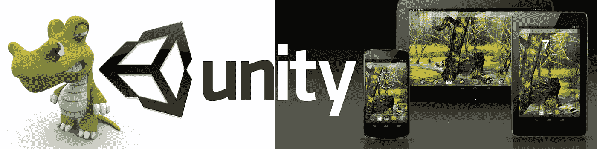
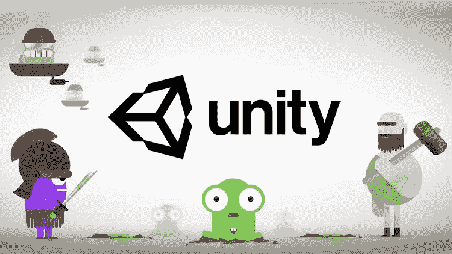
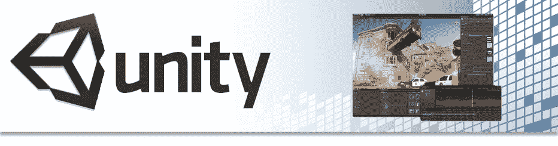

# 游戏开发者的 10 个最佳 Unity 教程[2023 年 3 月]

> 原文：<https://medium.com/quick-code/top-online-tutorials-to-learn-game-development-using-unity-55497ad51169?source=collection_archive---------0----------------------->

## 学习 Unity 从 2023 年最好的 Unity 新手教程开始学习游戏开发。

Unity 是终极游戏开发平台。使用 Unity 构建高质量的 3D 和 2D 游戏，在移动、桌面、VR/AR、游戏机或网络上部署它们，并与忠诚和热情的玩家和客户联系。先从以下课程开始学习 unity 进行游戏开发。

## 1.[完成 C# Unity 开发者 2D:学习代码制作游戏](https://coursesity.com/r/site/c-unity-developer-2d-learn-to-code-by-making-video-games)

游戏开发和设计。在 C#中使用 Unity 2018 学习 C#。你的前 7 个 2D 网页游戏，Mac 和 PC。包括 Tilemaps

***课程评分:4.7 满分 5.0(*****65680*评分合计)***

在本课程中，您将:

*   从零开始学习 C#，一门强大的现代语言。没有编程经验是必要的。
*   变得擅长使用 Unity 游戏引擎。
*   为游戏设计和游戏开发打下坚实的基础，这将有助于您构建自己的游戏。
*   了解面向对象编程在实践中是如何工作的。
*   创建可玩的游戏项目——对你的投资组合有好处，或者只是为了你自己的成就感。
*   将本课程中的知识传授给。NET、其他语言等等。
*   发展高度可转移的编码问题解决技能。

该课程是基于项目的，所以你不仅仅是学习枯燥的编程概念，而是将它们应用到真正的独立游戏中。所有的项目文件都将包括在内，还有额外的参考和资源——您永远不会被卡住。有讲头视频，强大的图表，质量截屏和更多。

对于每个演示游戏，您将遵循以下流程构建…

*   挑战自己构建整个游戏。
*   被一步一步地展示如何建立它。
*   接受应用的挑战，定期重新应用你的知识。

Top Unity Tutorials

## 2.[Unity 游戏开发专业化 C#编程](https://coursera.pxf.io/c/1137078/1213622/14726?u=https%3A%2F%2Fwww.coursera.org%2Fspecializations%2Fprogramming-unity-game-development&subId1=BotTutorials) —免费课程

这个专业是为那些想要学习如何使用 C#编写 Unity 游戏的初级程序员设计的。第一门课程假设没有编程经验，在专业化的 5 门课程中，你将学习如何用 C#编程，以及如何使用 C#知识来编程 Unity 游戏。

***课程评分:4.8 分(总分 846 分)***

在这一专业化过程中，您将了解以下主题:

*   C#编程和 Unity 简介
*   Unity 游戏的中间面向对象编程
*   游戏开发者的数据结构和设计模式

## 3. [Unity 游戏编程初学者](https://www.eduonix.com/unity-game-programming-for-absolute-beginners/UHJvZHVjdC0zMjMyMDA=)

***课程评分:*** ***4.5 满分 5.0 (* 448 *评分合计)***

本课程是一门实践课程，旨在帮助您熟悉 Unity 3D 软件。你完全不需要设计经验，即使你不擅长绘画，你也可以用这个神奇的软件创造你自己的游戏。

该课程将帮助您从头开始实际构建一个完整的 2D 游戏，同时您将了解 Unity 软件的基础知识。通过熟悉 Unity 3D 的用户界面和基本工具，您将了解如何开始用 C#设计角色和编写游戏代码。

在本课程中，您将学到:

*   熟悉 Unity 3D 界面
*   了解编辑器、工具包等基础知识。
*   学习 C#的基础知识，这样你就可以开始自己的游戏了
*   钻研物理、动画等更复杂的概念。
*   从头开始创建自己的 2D 游戏

Best Unity 2D and 3D game development Courses List

## 4.[用 Unity Services 构建游戏:货币化&分析](https://pluralsight.pxf.io/c/1137078/424552/7490?u=https%3A%2F%2Fwww.pluralsight.com%2Fcourses%2Funity-services-monetization-analytics-building-games&subId1=quickcode)

货币化和跟踪玩家行为对于创造有利可图和吸引玩家的游戏至关重要，玩家会一次又一次地回来玩这些游戏。本课程将介绍让您的游戏更上一层楼所需的所有知识。

该课程包括:

*   整合 Unity 广告
*   使用 Unity Analytics

在本课程《用 Unity Services 构建游戏:货币化和分析》中，您将发现利用 Unity Services 整合广告和跟踪玩家行为所需的技能。

首先，您将学习如何在一个项目中有效地构建多个管理器脚本。接下来，您将深入到在沙盒环境中显示广告，创建自定义广告位置，以及使用您的游戏服务。

最后，您将使用 Unity Analytics API 来创建定制的可跟踪事件、数据通道，并配置远程设置以简化测试。

完成本课程后，您将对 Unity 货币化和分析服务有一个基本的了解，这将有助于您构建自己的游戏。

## 5.[用 Unity & Vuforia](https://coursesity.com/course-detail/build-15-augmented-reality-(ar)-apps-with-unity-&-vuforia) 打造 15 款增强现实(AR)应用

关于无标记跟踪、云增强现实、3D 物体检测的增强现实(AR)教程，以及 Unity 和 Vuforia 的更多内容

***课程评分:*** ***4.4 满分 5.0 (1523 次评分合计)***

在本课程中，您将:

*   了解不同形式的增强现实及其应用。
*   为 Android 和 iOS 从头开始构建 15 个增强现实应用。
*   开发和 ARBook 应用程序，将检测多个图像目标。
*   使用 AR 虚拟按钮创建交互式名片。
*   一个 AR 贺卡 app，一打开就播放声音，动画。
*   使用 3D 对象跟踪检测真实的玩具汽车，并在真实汽车上叠加数字汽车
*   跟踪圆柱形物体并在圆柱周围放置数字模型。
*   使用无标记跟踪将真人大小的兰博基尼汽车放置在现实世界中。
*   使用 Vuforia Mid Air 功能将真人大小的无人机放置在空中
*   在现实世界中播放/暂停视频
*   云计算认可和最佳实践
*   理解虚拟现实和增强现实的基本区别。
*   用 C#编程语言写代码创建 AR apps。

在第一部分中，您将首先了解什么是增强现实？接下来，您将了解四种不同的增强现实技术及其应用。在这之后，你会看到 Unity 的基础知识，因为 Unity 是我们用来构建增强现实应用的主要软件。

在本课程中，您将创建不同的应用程序，并学习以下内容:

*   创建 Vuforia 帐户
*   为 AR 应用程序创建许可证密钥
*   上传图像作为图像目标
*   了解 Vuforia 图像识别系统
*   Vuforia 版本 6.2.10 中白色图像目标问题的解决方案
*   从 Unity 资产商店下载 3D 模型
*   将 3D 模型放在图像目标的顶部
*   从 Vuforia 下载 ARONE 应用程序数据库，并在 Unity 中激活它
*   为 Android 和 Ios 构建此应用程序

## 6.【Unity 2022 游戏开发终极指南

与 Unity Technologies 合作创建:通过开发 2D 和 3D 游戏来学习 C#，这是一个全面的指南。

***课程评分:*** ***4.6 满分 5.0(总评分 9093)***

本课程由 Unity Technologies 授权并与其合作制作。

如果你对开发可以在各种平台上运行的惊人的、商业质量的游戏感兴趣，那么你来对地方了。***Unity 游戏开发终极指南*向你介绍 Unity 引擎和 C#编程的基础。然后，课程将深入开发你的第一个 2D 和 3D 游戏。你会发现如何通过 Unity 的最新功能，包括后期处理效果和动画系统，将你的游戏与众不同。**

**在本 Unity 课程中，您将:**

*   **掌握 C#概念，如变量和 if 语句**
*   **检测碰撞，接收用户输入，并创建玩家运动**
*   **创建电源，包括三倍拍摄，激光束，速度提升，和盾牌**
*   **应用变换游戏背景的着色器**
*   **用基本的人工智能行为创造敌人**
*   **收集和销毁游戏物品**
*   **实现声音效果、背景音乐和粒子效果**
*   **激活并使用 Unity 的团队协作服务**
*   **导航 Unity 引擎，发现独特的功能，如资产商店**
*   **使用 Unity 将您的游戏部署到 20 多个网络或移动平台上**

**本 Unity 课程还包括 30 多项互动挑战，您可以用刚刚学到的概念测试自己的知识。这些挑战将帮助你建立两个商业质量的游戏:一个 2D 银河射击游戏与抛光精灵和电影效果，和一个 3D 第一人称控制器游戏。访问由 Unity 课程提供的独特艺术作品，并为您的游戏添加复杂的功能，使您看起来像是多年来一直在编程。**

## **7.[学习中级 Unity C#编码- RPG 核心战斗创造者](https://click.linksynergy.com/deeplink?id=Fh5UMknfYAU&mid=39197&u1=quickcode&murl=https%3A%2F%2Fwww.udemy.com%2Funityrpg%2F)**

**在 Unity 中构建一个角色扮演游戏(RPG)。学习中级 C#，代码架构，游戏&关卡设计。**

*****课程评分:*** ***4.7 满分 5.0(总评分 5498)*****

**在本课程中，我们将重点关注任何优秀 RPG 的核心，在精心制作的关卡中为您的玩家提供有趣的战斗时刻，这是基于坚实的游戏设计，使用健壮的代码架构构建的。你将遵循我们的项目，但也使游戏完全属于你自己。**

**你将处理人工智能寻路，创建一个灵活的特殊能力系统，并学习如何协调一个复杂的项目。你将学习如何实现点击移动游戏，使用资源包，调试，制作粒子效果等等。**

**在你开始之前，你需要对 Unity 和 C#有一个基本的了解，从那里我们会教你更高级的编程技术，比如 C#委托、接口、协同例程等等。**

**制作一个 RPG 是提升你游戏开发技能的一个神奇的方法。**

****

**Best Unity 2019 Courses For Beginners**

## **8. [Unity 游戏开发:用 C#制作 2D 和 3D 游戏](https://click.linksynergy.com/deeplink?id=Fh5UMknfYAU&mid=39197&u1=quickcode&murl=https%3A%2F%2Fwww.udemy.com%2Fcourse%2Funity-game-development-create-2d-and-3d-games-with-c%2F)**

**掌握游戏开发的基础知识，学习如何使用 Unity 游戏引擎创建 2D 和 3D 游戏**

*****课程评分:*** ***4.6 满分 5.0(总分 153 分)*****

**在本课程中，您将:**

*   **学习用 C#编程。**
*   **发展强大的、可移植的解决问题的技能。**
*   **学习好的编码和设计模式。**
*   **获得使用 Unity 游戏引擎的经验。**
*   **获得优秀的游戏创作知识。**
*   **了解面向对象编程在实践中是如何工作的。**
*   **了解如何创建令人惊叹的 2D 和 3D 游戏。**

**这是最全面的在线课程，将带您从初学者到在 Unity Game Engine 中创建令人惊叹的 3D 游戏。**

**我们将从简单的事情开始，这样即使你是第一次使用 Unity，你也会感到舒适。这也适用于你的编码技能，如果你以前没有编码，不要担心，我们将深入涵盖 C#从基本到高级的特性。**

**本课程是一个单一的地方，将有你需要学习如何使用 Unity 游戏引擎创建 2D 和 3D 游戏的所有资源。**

**您将在本课程中学到的一些东西:**

*   **Unity 的界面**
*   **导入资产**
*   **组织项目**
*   **初级、中级和高级 C#编程**
*   **基础人工智能**
*   **高级人工智能**
*   **基本和高级角色动画**
*   **音效和音乐**
*   **基本、中级和高级粒子特效**
*   **近战战斗系统**
*   **老板打架**
*   **游戏攻击中的特殊**
*   **了解如何使用 Unity 的 UI 系统**
*   **创建菜单并制作动画**
*   **创建动画触发事件**

## **9.[通过在 Unity 中制作 2D 平台学习编码](https://click.linksynergy.com/deeplink?id=Fh5UMknfYAU&mid=39197&u1=quickcode&murl=https%3A%2F%2Fwww.udemy.com%2Funity2dplatformer%2F)**

**游戏开发变得简单。使用 Unity 学习 C#并创建您自己的 2D 平台。**

*****课程评分:*** ***4.6 满分 5.0(*2255*评分合计)*****

**了解如何使用 Unity3D 创建您自己的平台游戏，unity 3d 是世界各地许多大型游戏工作室和独立开发者使用的行业标准程序。**

**在本课程中，你不仅要学习编程概念，还要将这些概念与真实的游戏开发应用联系起来。您将可以访问课程论坛，在那里您可以讨论课程中涉及的主题以及课程完成后的后续步骤。**

**本课程旨在让每个人都容易理解，因此无论您是一个完全的初学者、一个希望扩大游戏开发范围的艺术家还是一个对理解游戏设计感兴趣的程序员，本课程都将帮助您更好地理解开发。**

**本课程结束后，您将具备创建游戏元素的能力，如:**

*   **要控制的角色**
*   **硬币、额外生命和额外健康等收藏品**
*   **不同类型的敌人战斗**
*   **危险，如钉子、锯子和移动平台**
*   **具有交互式菜单的用户界面**
*   **多个级别和一个级别选择屏幕**
*   **一场独特而富有挑战性的 boss 战**

## **10. [Unity 游戏开发学院:制作 2D & 3D 游戏](https://click.linksynergy.com/deeplink?id=Fh5UMknfYAU&mid=39197&u1=quickcode&murl=https%3A%2F%2Fwww.udemy.com%2Fdevslopes-unity3d%2F)**

**学习 Unity 游戏设计& 2D & 3D 游戏开发&在 Unity 3D 中制作自己的 C#游戏。**

*****课程评分:*** ***4.4 满分 5.0(*4444*评分合计)*****

**这是*网上关于 Unity 3d 最*全面的课程。我们是狂热的游戏开发者，厌倦了那里所有的垃圾——教学生如何在没有真实世界游戏开发的情况下制作 3D 立方体。**

**这门课程将带你走上一条有指导的学习之路。你将学习用 C#编写代码，然后继续开发 2D 和 3D 游戏。**

**你不仅会构建游戏，还会学习如何像职业玩家那样做。它甚至将涵盖高级主题，如照明，电影艺术和多人游戏。**

**这里有一些你将会学到的东西**

1.  **安装和设置**
2.  **物理学**
3.  **寻路**
4.  **基础人工智能**
5.  **闪电和光照贴图**
6.  **摄像机动画和过场动画**
7.  **角色动画**
8.  **脚本，脚本，脚本！**
9.  **材料和天空盒**
10.  **声音效果和音乐**
11.  **局域网和互联网上的多人游戏**
12.  **粒子特效**
13.  **近战和远程战斗系统**
14.  **塔防游戏**
15.  **冒险游戏**
16.  **僵尸！**

## **11.[用 Unity 2017 成为 iOS/Android 游戏开发者](https://click.linksynergy.com/deeplink?id=Fh5UMknfYAU&mid=39197&u1=quickcode&murl=https%3A%2F%2Fwww.udemy.com%2Fiosgamedev%2F)**

**重新创建最受欢迎的应用程序，并将其发布到 App Store / Play Store。**

*****课程评分:*** ***4.5 满分 5.0 (* 334 *评分合计)*****

**在本课程中，您将了解两个最流行的手机游戏，并使用 Unity 和 C#重新制作它们。**

**然后，您将使用 xCode 将这些游戏部署到我们的 Android 设备以及 iOS 设备上。您将了解 xCode 在 App Store 开发中的重要性。了解如何利用广告(视频广告)通过免费游戏赚钱。最后，我们将向您展示如何将这些游戏发布到 App Store 和/或 Play Store。**

## **12.[通过制作游戏学习 C#代码—完成 Unity Developer 2.0](https://click.linksynergy.com/deeplink?id=Fh5UMknfYAU&mid=39197&u1=quickcode&murl=https%3A%2F%2Fwww.udemy.com%2Funitycourse2%2F)**

**游戏开发和设计。使用 Unity Engine 学习 C#。你的第一个网络，Mac 和 PC 的 3D 游戏。**

*****课程评分:4.6 满分 5.0(*****14042*评分合计)*****

**这是期待已久的完整 Unity Developer 的续集，是互联网上最受欢迎的电子学习课程之一！用全新的项目和我们最新的教学技巧完全从头开始。**

**在本课程中，您将:**

*   **从零开始学 C#。强大的现代语言。**
*   **获得使用 Unity 2017 的体验，这是一款非常通用的 3D 工具。**
*   **获得优秀的视频游戏设计常识。**
*   **统一制作 2.5D 和 3D 游戏。**
*   **把你的知识传授给。NET、其他语言等等。**
*   **了解面向对象编程在实践中是如何工作的。**
*   **学习好的编码和设计模式。**
*   **学习使用源代码控制，这是在小团队中工作的一个有价值的工具。**

**Unity 2018 是一个令人难以置信的 3D 包，用于制作视频游戏、建筑和医疗成像等。挑战在于使用起来又大又复杂，尤其是对于编码和游戏开发的完全初学者来说。我们通过一步一步地引导您创建令人兴奋的游戏，使学习编码变得简单而有趣。**

**如果你正在阅读这篇文章，你可能已经拥有了开始阅读的一切。Unity 2018 个人版是免费下载的。通过定期访问互联网连接，您将能够参与我们蓬勃发展的社区。**即使你没有编码或 3D 软件包的经验**，它也会从基本原则开始指导你完成所有的事情。慢慢开始，然后在你所学的基础上，你很快就会对 Unity 有一个非常扎实的工作知识。**

**不要相信我们的话，请看学生们花时间写的精彩评论。我们很自豪能够改变生活，让 1000 人掌握有价值的新技能。我们希望你现在就成为他们中的一员。**

**该课程是基于项目的，所以你不仅仅是学习枯燥的编程概念，而是在进行过程中立即将它们应用到真正的独立游戏中。所有的项目文件都将包括在内，还有额外的参考和资源——您永远不会被卡住。有“会说话的头”，强大的图表，优质的截屏等等。**

**对于每个演示游戏，您将遵循以下流程构建…**

*   **挑战自己构建整个游戏。**
*   **被一步一步地展示如何建立它。**
*   **接受应用的挑战，定期重新应用你的知识。**

> **感谢您阅读本文。我们策划了更多主题的顶级教程，您可能想看看:**

** [## 10+最佳虚幻引擎 4 初学者教程

### 用 2022 年最好的虚幻引擎新手教程学习游戏开发的虚幻引擎 4

medium.com](/quick-code/top-tutorials-to-learn-unreal-engine-4-for-beginners-1a21c287c553)  [## 面向初学者的 15+最佳 C++编程教程—在线学习 C++

### 学习 C++在 2022 年用最好的初学者 C++教程创建跨几个域和平台的高性能应用程序…

medium.com](/quick-code/top-tutorials-to-learn-c-programming-d3dd13769a0c)  [## 面向初学者的 15 门以上最佳 Python 课程——在线学习 Python

### 2022 年用最好的 Python 教程学习 Python，产生更清晰更有逻辑的代码

medium.com](/quick-code/top-tutorials-to-learn-python-programming-200a4283995f) 

***披露:*** *如果您通过本页面的链接购买课程，我们可能会获得一小笔附属佣金。谢谢你。***