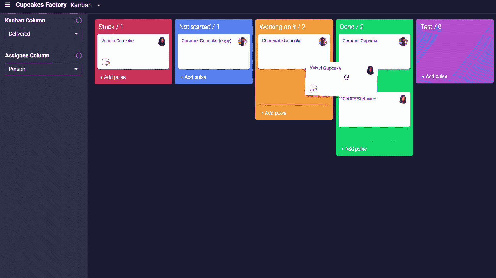

# 面向初学者的 8 门最佳看板培训认证课程[2022 年 7 月]—在线学习看板

> 原文：<https://medium.com/quick-code/top-online-tutorials-to-learn-kanban-for-project-management-779d0dec0cad?source=collection_archive---------0----------------------->

## 通过 2022 年面向初学者的最佳看板课程，学习看板来提高您的敏捷项目管理技能。

看板是一个简单的系统，用于在连续交付的基础上生产产品。这个系统起源于日本的制造系统，但是你可以用它在工作或你的生意或个人生活中实现更多。

## 1.[看板基础:如何变得疯狂高效](https://coursesity.com/r/site/kanban-fundamentals:-how-to-become-insanely-productive)

学习看板的基本原理来提高生产率。

通过本课程:

*   学习和理解看板
*   了解如何使用看板来帮助您的团队更有效地确定优先级
*   探索基本的精益原则
*   了解如何使用看板、工作流程、在制品限制、优先级设置、拉动式系统等。

在本课程中，您将学习基本的精益原则，并了解如何使用看板来帮助您的团队更有效地确定优先级。了解如何启动企业精益，建立董事会，优化您的流程，等等。

5 Best Kanban certification courses

## 2.[利用看板保持精益](https://linkedin-learning.pxf.io/c/1137078/646189/8005?u=https%3A%2F%2Fwww.linkedin.com%2Flearning%2Fstay-lean-with-kanban&subId1=quickcode)

看板是在您的组织中引入精益原则的一种重要方式。精益可以帮助您的团队更好地确定工作的优先级，并通过消除流程中的浪费或“大木”来持续改进。

该课程包括:

*   了解精益原则
*   启动企业精益
*   竖起一块看板
*   设置董事会
*   离开董事会工作

在本课程中，探索基本的精益原则，并了解如何使用看板板来帮助您的团队更有效地确定优先级。

了解如何启动企业精益、建立董事会、优化流程等。

## 3.[看板:生产力&敏捷精益项目的效率](https://click.linksynergy.com/deeplink?id=Fh5UMknfYAU&mid=39197&u1=quickcode&murl=https%3A%2F%2Fwww.udemy.com%2Fkanban-board%2F)

学习如何利用看板减少瓶颈，可视化工作流程，并与 scrum plus scrumban 指针相结合。

本课程将向您全面介绍看板以及如何使用看板来可视化工作流程。在本课程中，您将学习:

*   看板的简明概述——包括起源、如何使用看板、工作流程、在制品限制、优先级设置、拉动式系统。
*   基于真实行业经验和研究的事实——看板的正确术语和使用对于掌握看板至关重要。

每一部分都概述了看板的一个特定方面，如看板的起源、如何使用看板、工作流程、在制品限制、优先级设置、拉动式系统。在整个课程中，例子都包含了高质量的视频和音频。一切都是基于现实世界的经验。

## 4.[如何用 Scrum/看板/Extreme 建立令人敬畏的敏捷团队](https://click.linksynergy.com/deeplink?id=Fh5UMknfYAU&mid=39197&u1=quickcode&murl=https%3A%2F%2Fwww.udemy.com%2Fhow-to-build-awesome-agile-teams-with-scrum-kanban-extreme-progrrammin%2F)

如何使用 Scrum，看板，极限来建立令人敬畏的敏捷团队？

在本课程中，您将学习:

*   有能力让您的组织为敏捷做好准备
*   为成功的敏捷项目做好基础工作
*   了解敏捷的历史以及我们为什么使用它。
*   能够启动和运行敏捷项目
*   能够获得执行发起人的支持
*   了解敏捷团队、角色和职责
*   能够让你的团队自我组织起来

本课程将使用一个示例项目来展示如何建立您的敏捷团队。具有敏捷思维的团队是自组织的、协作的、负责任的。它还概述了实现中固有的常见陷阱:新团队需要注意混淆他们的角色，并理解管理自组织团队的挑战。

image [source](https://support.monday.com/hc/en-us/articles/360000700605-How-to-build-your-boards-in-Kanban-style-)

## 5.[特雷罗精通:学习看板组织的秘密艺术](https://click.linksynergy.com/deeplink?id=Fh5UMknfYAU&mid=39197&u1=quickcode&murl=https%3A%2F%2Fwww.udemy.com%2Flearn-trello%2F)

使用 Trello 从初级用户一路提升到高级大师。

通过本课程:

*   让您的数字世界从混乱无序走向易于管理的幸福
*   使用 Trello 满足您所有的项目管理需求
*   通过使用公告板、列表和卡片成为组织的主人
*   当您了解如何轻松管理多个主板时，您的工作效率将会大幅提升
*   了解特雷罗的秘密捷径和隐藏的用途
*   如何获得超级酷的 Trello 奖金
*   当你观看多种方式时，发现使用了特雷罗尚未想到的
*   你再也不会使用普通的待办事项列表了
*   从开始到结束学习各种不同项目类型的项目管理
*   学习创建易于访问的共享购物清单
*   个性化项目模板创建
*   学习与业务团队成员的协作

学完这门课程后，你将会精通以上所有使用 Trello 的方法，甚至更多。

## 6.[用看板完成工作](https://click.linksynergy.com/deeplink?id=Fh5UMknfYAU&mid=39197&u1=quickcode&murl=https%3A%2F%2Fwww.udemy.com%2Fgetting-things-done-with-kanban%2F)

提高你的效率。消除压力。开心点。

通过本课程，您将学会如何:

*   养成整洁的生活习惯，提高日常工作的动力和效率
*   使用看板管理工作
*   设定好长期和短期目标
*   限制正在进行的工作，以便更加专注，完成更多的事情
*   通过频繁适应障碍和变化来保持工作流程顺畅
*   通过持续改进来提高自己

学习完本课程后，你将能够掌握个人看板方法的两个重要原则:(1)工作和工作流程可视化；(2)限制正在进行的工作。

这种方法将帮助你提高个人生产力，完成工作，控制压力。本课程由 5 个小部分组成。每一部分都着重介绍一种或多种你可以立即应用到当前工作中的技术。

## 7.[Trello 的看板项目管理](https://click.linksynergy.com/deeplink?id=Fh5UMknfYAU&mid=39197&u1=quickcode&murl=https%3A%2F%2Fwww.udemy.com%2Fkanban-based-project-management-with-trello%2F)

管理任务、协作，比以往任何时候都更高效。

在本课程中，您将学习:

*   什么是看板
*   如何利用它来提高 Trello 的工作效率。
*   如何将您的工作流程定义为 Trello 板
*   如何使用您的板与他人协作，并更深入地了解您的工作进度。

无论您是项目管理领域的新手，想要从另一个项目管理系统转移到 Kanban & Trello，还是已经是 Trello 的用户，您都会在本课程讨论的主题以及随后提供的示例和模板中找到价值。

## 8.[从 A 到 Z 的软件开发——OOP、UML、敏捷等等](https://click.linksynergy.com/deeplink?id=Fh5UMknfYAU&mid=39197&u1=quickcode&murl=https%3A%2F%2Fwww.udemy.com%2Fsoftware-development-from-a-to-z%2F)

了解 OOP、UML、敏捷、看板、SCRUM 等等！深入了解软件开发行业。

通过本课程:

*   离你成为专业软件开发人员的目标更近一步
*   理解面向对象编程的基础
*   阅读 UML 图，创建类图和序列图来描述软件系统
*   了解敏捷、瀑布、看板和 SCRUM
*   深入了解专业软件开发团队的日常活动

这个综合课程探索软件开发的原则和技术。它使用易于理解的类比来解释每个概念。
主题包括:揭穿关于成为开发人员的神话，围绕软件开发的误解，核心面向对象概念:类、抽象、多态等等。

> 感谢您阅读本文。我们策划了更多主题的顶级教程，您可能想看看:

 [## 10+最佳 JIRA 初学者教程—在线学习 JIRA

### 用 2021 年 JIRA 最佳初学者教程学习 JIRA 管理缺陷跟踪和敏捷项目管理。

medium.com](/quick-code/top-tutorials-to-learn-jira-9120b409ccee)  [## 初学者的 9 个最佳 GraphQL 教程——在线学习 GraphQL

### 用 2021 年最好的初学者 GraphQL 教程学习后端开发工作的 GraphQL

medium.com](/quick-code/top-online-video-tutorials-to-learn-graphql-458056e3b583)  [## 10+最佳初学者 Scrum 和敏捷教程——在线学习 Scrum 和敏捷

### 学习 Scrum 和敏捷，在 2021 年为初学者提供最好的 Scrum 和敏捷教程，以发展你作为软件项目经理的职业生涯。

medium.com](/quick-code/top-tutorials-to-learn-scrum-and-agile-4199b0f36c24) 

披露:我们与本文中提到的一些资源有关联。如果你通过本页的链接购买课程，我们可能会得到一小笔佣金。谢谢你。