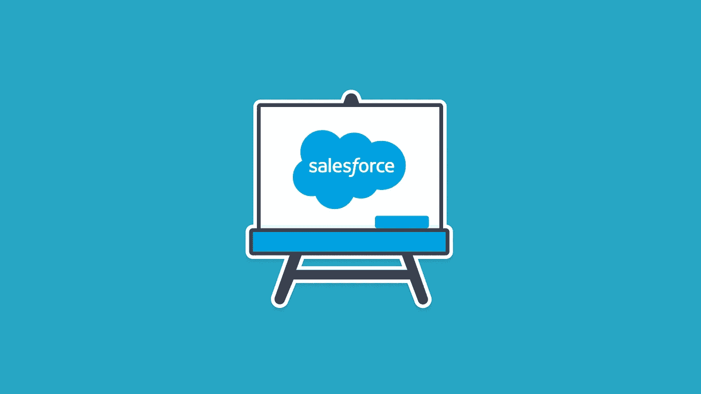

# 10+最佳新手 SEO 教程[2022 年 7 月]——在线学习 SEO

> 原文：<https://medium.com/quick-code/top-online-tutorials-to-learn-seo-to-rank-your-websites-on-google-f0f84bb4415b?source=collection_archive---------8----------------------->

## 2022 年，学习 SEO，通过有机搜索结果增加网站流量，为初学者提供最佳 SEO 教程

搜索引擎优化是一套策略，技术，以及通过有机搜索引擎结果增加网站流量的过程。SEO 工具让你轻松提高知名度，在搜索引擎中获得高排名。

# 1. [SEO 2018:完成 SEO 培训 WordPress 网站 SEO](https://click.linksynergy.com/deeplink?id=Fh5UMknfYAU&mid=39197&u1=quickcode&murl=https%3A%2F%2Fwww.udemy.com%2Fseo-get-to-number1-in-google-search%2F)

技术搜索引擎优化，0.5s 页面速度，UX 搜索引擎优化，反向链接搜索引擎优化，关键词研究搜索引擎优化+ WordPress 搜索引擎优化培训在谷歌排名第一。

在本课程中，您将:

*   了解所有 13 个技术性搜索引擎优化因素
*   搜索引擎优化你的网站，从谷歌和其他搜索引擎带来更多的有机流量
*   让您的网站在不到 0.5 秒的时间内加载，将销售/转化率提高 2 倍
*   学习为谷歌、必应和 Yandex 搜索引擎优化网站的基本技巧
*   更快地被搜索引擎索引
*   改善网站的用户体验——未来的搜索引擎优化因素
*   降低网站访问者的跳出率，增加他们在网站上停留的时间
*   学会使用最好的免费搜索引擎优化工具
*   通过使用所选择的交易/信息长尾关键词，为你的网站带来有针对性的流量
*   获得低竞争、高流量的优化长尾关键词列表—动手操作
*   解开链接建设的神话，学习什么类型的反向链接效果最好
*   了解哪些类型的反向链接是不值得了
*   获得超过 25 个白帽反向链接生成来源的可操作列表
*   学习过期的 SEO 技术/神话，这会伤害你的网站
*   让你的网站免受负面搜索引擎优化攻击，并识别你网站的不良反向链接

整个 SEO 2018 课程基于一项关键词研究，该研究从 2014 年、2015 年、2016 年、2017 年排名前 30 位的 SERPs 的 10，000 个关键词中汇编而成。因此，他们都是新的，正在工作，他们 100%适用于 2018 年及以后。在本课程中，SEO 需求详细讲解了它的重要性以及如何实现它。

通过这门课程，你将学到从积极的 SEO 因素到消极的 SEO 因素，掌握它们并在你的网站上实现，从而在搜索引擎中获得最高排名。

## 2.[搜索引擎优化入门](https://coursera.pxf.io/c/1137078/1213622/14726?u=https%3A%2F%2Fwww.coursera.org%2Flearn%2Fsearch-engine-optimization&subId1=BotTutorials)

本课程是搜索引擎优化专业的第一门课程，旨在让你体验一下搜索引擎优化，并在谷歌上看到一些有趣的实践。

您将了解最流行的搜索引擎 Google 是如何工作的，搜索引擎优化的前景是如何不断变化的，以及您对未来的预期。

你将讨论核心的搜索引擎优化战略和战术，用于推动更有机的搜索结果，以一个特定的网站或一组网站，以及战术，以避免从谷歌惩罚。

你将讨论和定义搜索引擎优化的基本概述，并探索搜索引擎优化行业内的职业类型和薪资期望。

你还将能够解释三种主要 SEO 工作类型之间的差异，并准备选择最适合你当前目标的职业。

你将学会至少总结搜索引擎发展的时间表，以及展示对关键时期和改变搜索工作方式以及人类与网络互动方式的个人的理解。

你将获得评论广告和公司资金在搜索发展中的作用的能力，并解释网络货币化的过程。

你将讨论 SEO 花费大量时间处理的项目:SEO 最佳实践，寻找它们的算法更新以及不遵守它们的潜在惩罚。

你将能够说明相关性的概念，因为它适用于搜索结果，比较和对比搜索引擎算法更新的功能，并严格检查网站管理员试图规避这些算法的方式。

您还将能够定义现代搜索引擎使用的重要排名因素，并学习必要的步骤来避免(或纠正)搜索引擎算法应用的任何惩罚。

本课程结束时，你将能够解释主题关联和语义分析等概念如何与搜索结果的相关性和可信度相关联。

你也要做好充分的准备，为一个能改善搜索结果的网站编写和优化你自己的内容，并为客户制定一个优化策略，在遵循最佳实践的同时帮助他们提高排名。

最后，你将能够展示品牌和品牌对搜索结果的影响，并批判性地分析社交媒体和其他新兴技术对 SEO 今天、明天以及未来的影响！

# 3. [SEO 基础](https://linkedin-learning.pxf.io/c/1137078/646189/8005?u=https%3A%2F%2Fwww.linkedin.com%2Flearning%2Fseo-foundations-2&subId1=quickcode)

这门课程是关于掌握这些基本原理的。

在本课程中，您将了解:

*   搜索引擎优化基础。
*   做出改进，提高你的网站在搜索引擎上的可见性。
*   搜索引擎优化的基础，包括如何阅读结果页面，看看排名如何影响大大小小的企业。

你将学习如何提高你的网站在搜索引擎上的可见性，吸引合适的流量到你网站上合适的页面。

探索 SEO 的基础知识，包括如何阅读结果页面，了解排名如何影响大大小小的企业。

了解如何实施基础优化策略和技术，包括如何进行关键字研究，建立内部和外部链接，优化您的页面和内容，衡量您的成功和进展，以及规划长期的 SEO 策略。

此外，学习针对电子商务、本地搜索和移动受众的具体 SEO 技巧，以扩大你的影响力。

# 4.[完美的 SEO 优化文章在谷歌排名第一](https://www.eduonix.com/the-perfect-seo-optimized-article-to-rank-page-1-in-google/UHJvZHVjdC0zMjMyMDA=)

写作，编辑优化和营销文章是很难的。获得精心编写的内容=大量的有机流量。

该课程包括:

*   介绍
*   关键词规划器
*   免费关键词研究工具
*   付费关键词研究工具
*   优化文章预览
*   优化可读性
*   WordPress 永久链接设置
*   WordPress Yoast 搜索引擎优化设置
*   WordPress 最快的缓存设置
*   任何站点的实时分析
*   WordPress 缓存速度测试
*   一个搜索引擎优化插件
*   实时排名案例研究

# 5.[跟随顶级 SEO 专家彼得·肯特完成 SEO 培训！](https://click.linksynergy.com/deeplink?id=Fh5UMknfYAU&mid=39197&u1=quickcode&murl=https%3A%2F%2Fwww.udemy.com%2Fsearch-engine-optimization-for-beginners-seo-that-works%2F)

赢得搜索引擎优化游戏&与畅销书《傻瓜搜索引擎优化》的作者一起主宰搜索引擎。

在本课程中，您将学习:

*   挑选搜索引擎优化的最佳关键词
*   准备你的网站，包括避免伤害你的网站搜索引擎优化的事情
*   理解内容在搜索引擎优化中的作用
*   优化你的页面——元标签，格式化正文和图片等。
*   用结构化数据标记提升 SEO
*   向搜索引擎和目录提交您的站点
*   本地搜索引擎优化
*   理解 SEO 中链接的重要性

你将从理解关键词对 SEO 的重要性开始，如何找出人们在网上搜索的内容和频率，以及如何选择正确的 SEO 关键词。你还会听到你可以为你的网站做些什么准备，以确保网站有最好的机会排名。

你将学习向搜索引擎“提交”你的网站的最佳方法，如何使用搜索目录，以及关于网站管理员帐户，特别是谷歌搜索控制台。

# 6.[本地商业网站排名 SEO 完全指南](https://click.linksynergy.com/deeplink?id=Fh5UMknfYAU&mid=39197&u1=quickcode&murl=https%3A%2F%2Fwww.udemy.com%2Frank-local-business-websites%2F)

看着你在谷歌的第一页上重新设计和排列一个真实的本地商业网站

通过本课程，您将:

*   在谷歌的第一页排列一个本地商业网站
*   从头到尾了解整个本地搜索引擎优化过程
*   为本地企业确定最佳、最有利可图的关键词
*   适当优化本地网站，以获得最大的搜索引擎优化效益
*   寻找并获得高质量的反向链接和特定的本地业务反向链接机会
*   建立高质量的引用，在谷歌本地包中快速排名

本课程将带您一起观看它在 Google 首页和 Google local pack 中对一个真实的本地商业网站的排名。

该课程教你应该从本地客户那里收集的确切信息，如何通过重新设计过程保持当前排名，如何在重新设计后监控你的网站，以及检查网站的 SEO 健康状况以提高排名。

在组织好并更好地了解网站的健康状况后，你将开始搜索引擎优化过程，研究最佳的目标关键词，如何找到你的主要竞争对手，看看你需要做些什么来超越他们，如何在重新设计过程中建立一个演示网站，如何阻止谷歌索引你的演示网站和建立本地页面，以及在哪里放置关键词以获得最大利益。

# 7. [SEO 培训:通过 SEO 获得免费的网站流量](https://click.linksynergy.com/deeplink?id=Fh5UMknfYAU&mid=39197&u1=quickcode&murl=https%3A%2F%2Fwww.udemy.com%2Fseo-roadmap%2F)

搜索引擎优化培训在谷歌排名第一。搜索引擎优化审计，关键词研究，网页搜索引擎优化，链接建设，WordPress 搜索引擎优化&更多！

通过本课程，您将了解关键词研究:寻找低竞争、高转化率的关键词，页面优化:围绕这些关键词优化您的内容，以及页面外优化:围绕您的关键词和带有反向链接的内容建立权威。

本课程为您提供清晰可行的讲座、下载和实践活动，帮助您发展 SEO 业务。

通过本课程，您将学会如何:

*   大幅提高您的搜索位置、流量和销售额
*   避免危险的 SEO 神话，这会伤害你的生意
*   获得即时访问最好的免费搜索引擎优化工具
*   为你的生意找到最赚钱的关键词
*   编写完美的 SEO 优化内容
*   每次发现 8 个更聪明的方法来赚取高质量的反向链接
*   如何在没有内容营销的情况下对你的本地业务进行排名
*   免费对任何网站进行完整的搜索引擎优化审计
*   用谷歌分析跟踪搜索引擎优化指标
*   执行页面加载速度和移动友好性测试

# 8.【WordPress 的 SEO【初学者】:#1 循序渐进的 SEO 系统

“搜索引擎优化:发现如何轻松地让你的网站出现在 Google，Yahoo！&冰！

在本课程中，你将学习如何一步一步地进入第一页，这样你就能确切地知道每一步你需要做什么。你还会发现:

*   如何选择一个 SEO 优化域名
*   如何轻松设置您的托管帐户，以超越您的竞争对手
*   高级关键词研究和购买关键词
*   关键词分析
*   如何使用简单而有效的 WordPress 插件，点击几下就能提升你的排名。
*   如何轻松地编写 SEO 优化的文章和博客文章，在谷歌、雅虎和必应上快速排名。
*   如何设置你的永久链接
*   如何使用 H1、H2 和 H3 标签
*   如何组织文章的第一段以获得最佳效果？
*   如何为搜索引擎优化你的图片

# 9.[通过搜索引擎优化和社交媒体达到 100 万的营销战略](https://click.linksynergy.com/deeplink?id=Fh5UMknfYAU&mid=39197&u1=quickcode&murl=https%3A%2F%2Fwww.udemy.com%2Fmarketing-plan-strategy-become-a-great-marketer%2F)

利用数字营销实现 100 万人在线增长黑客:2019 年搜索引擎优化和社交媒体营销策略

本课程为您提供:

*   额外关注搜索引擎优化和赢得最佳长尾关键词研究
*   不同公司的案例研究&它们是如何接触到 100 万用户的
*   如何制作排名靠前的 SEO 页面
*   写更好的标题，增加点击率
*   关于如何推广亚马逊/Kindle 图书并成为畅销书的完整章节
*   搜索引擎优化策略让几乎所有的网页都进入前 10
*   提高音频/视频质量
*   基于访谈的案例研究:一个客户如何通过宣传获得数百万的网站访问者

本课程结合了 SEO 和社交媒体，以一种智能的方式最大化各自的结果。

首先，您将为您的博客、电子商务或商业网站实施现代 SEO，为您提供无限的长期潜力，同时也让您获得早期成果。接下来，你将建立你的社会媒体营销，给你的企业惊人的品牌，推动销售和提高你的搜索引擎优化的努力。

# 10.[定制 SEO 策略:关键词研究、审核&链接建设](https://click.linksynergy.com/deeplink?id=Fh5UMknfYAU&mid=39197&u1=quickcode&murl=https%3A%2F%2Fwww.udemy.com%2Fprofitable-keyword-research%2F)

成功地将你的网站排在谷歌的第一页。选择最佳关键词，优化你的网站并建立链接

在本课程中，您将学习如何:

*   利用关键词研究更好地从搜索引擎优化中获利
*   了解你的目标关键词的经济价值
*   熟悉免费和优质的关键词研究工具
*   了解不同类型的关键字，以选择最有利可图的
*   如何快速生成数百个关键词创意
*   为你的搜索引擎优化活动制定一个关键词计划
*   知道哪些关键词你可以排名
*   创建并实施一个完整的链接建设活动
*   找到任何网站的最佳反向链接
*   分析竞争对手，了解如何超越他们
*   了解反向链接的内容、位置、时间、原因和方式
*   开发一个内部链接结构，以提高排名和改善链接建设的努力
*   知道哪些免费(和优质)工具可以用在链接建设过程中
*   理解什么是搜索引擎优化审计，为什么它是实现顶级搜索引擎排名的关键
*   了解执行 SEO 审计的一步一步的过程，以充分了解一个网站的排名潜力
*   使用各种页面优化技术来提高搜索引擎排名
*   理解网站建设对转化访问者的重要性

通过本课程，您将确切地了解如何创建和实施一个成功的链接建设活动来提升您的搜索引擎排名。本课程教授的技巧注重长期效果，而不是“速赢”或“黑帽方法”通过使用这些技术，你将能够避免谷歌的处罚，保持你的排名，尽管搜索引擎算法的变化，并在竞争中保持领先地位。

# 11.[掌握 SEO，这样你就可以开始 SEO 业务](https://click.linksynergy.com/deeplink?id=Fh5UMknfYAU&mid=39197&u1=quickcode&murl=https%3A%2F%2Fwww.udemy.com%2Fwhat-is-seo-sem-search-engine-optimization%2F)

遵循我们一步一步的顶级 SEO 课程，开始你自己的 SEO 事业！今天就学习 SEO 和关键词！

通过本课程，您将学会如何:

*   在所有搜索引擎中对网站的各种关键词进行排名。
*   作为企业家在家工作。
*   开始搜索引擎优化顾问业务。
*   通过联盟营销谋生。
*   了解搜索引擎优化的一切

在这个课程中，你将学习 SEO 掌握&如何从初级到高级开始 SEO 业务。你将能够优化你的网站和内容，增加转化率，降低广告成本，因为 SEO 等于有机流量。今天你就可以让你的网站被谷歌正确抓取了。你将能够走在搜索引擎 algortithmm 更新的前面，并在各种关键字搜索的第一页保持排名。

# 12.[我如何在谷歌上排名第一:2019 年完整搜索引擎优化课程](https://click.linksynergy.com/deeplink?id=Fh5UMknfYAU&mid=39197&u1=quickcode&murl=https%3A%2F%2Fwww.udemy.com%2Fseo-ultimate-guide%2F)

提高搜索位置、转换、流量、销售、页面速度、内容、分享和链接的秘密

通过本课程，您将学会如何:

*   通过提高网站速度来提高 100%的转化率
*   用一种很少使用的技术大幅提高点击率
*   优化你网站上的每个帖子/页面，让谷歌看到你的内容是高质量的、权威的和信息丰富的
*   用两个惊人的插件和一个成熟的策略传播病毒
*   让你的网站在高流量新闻领域被提及(CNN，纽约时报)
*   创建 240+反向链接为您的本地业务今天
*   引导你的访问者从信息发布到购买页面
*   让你的网站移动友好(使用智能手机的人比使用台式机的人多)
*   增加人们花在你网站上的时间
*   从 SEO 能见度高的网站建立链接
*   了解如何优化您的网站，以带来更多的搜索引擎流量

每个部分的末尾都有一个清单，上面有你在视频中看到的每个网站的链接。

> 感谢您阅读本文。我们策划了更多主题的顶级教程，您可能想看看:

 [## 初学者的 7 个最佳 Gulp Js 教程——在线学习 Gulp Js

### 在 2021 年为初学者提供的最佳 Gulp 教程中学习自动化开发任务的 Gulp

medium.com](/quick-code/top-tutorials-to-learn-gulp-js-11aeeb789f35)  [## 15+最佳 Docker 初学者教程——在线学习 Docker

### 用 2021 年面向初学者的最佳 Docker 教程学习面向开发者的 Docker 容器开发

tutorials.botsfloor.com](https://tutorials.botsfloor.com/top-tutorials-to-learn-docker-to-run-distributed-applications-bce896e260ec)  [## 15+初学者最佳 Bootstrap 4 教程—在线学习 Bootstrap 4

### 在 2021 年，用最好的初学者引导教程学习 web 开发的引导

medium.com](/quick-code/top-tutorials-to-develop-responsive-websites-using-bootstrap-4-c934172f3ebd) 

*最初发表于*[*【blog.coursesity.com】*](http://blog.coursesity.com/top-tutorials-to-learn-seo-for-websites/)*。*

披露:我们与本文中提到的一些资源有关联。如果你通过本页的链接购买课程，我们可能会得到一小笔佣金。谢谢你。