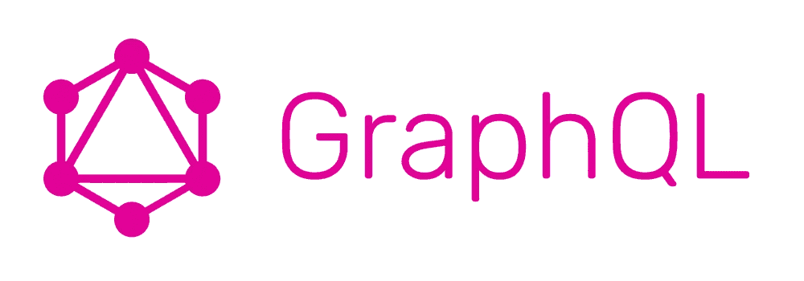
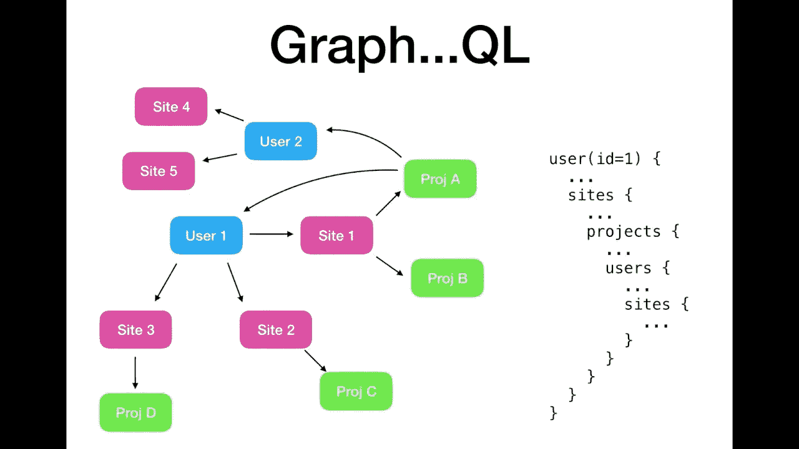
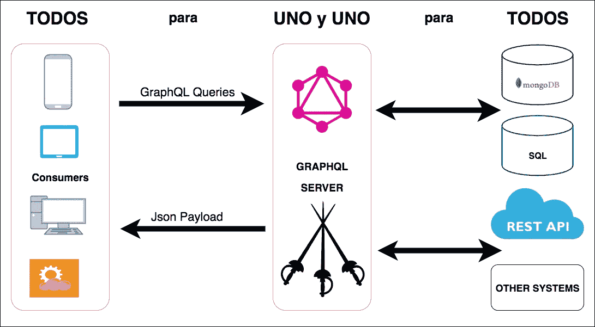
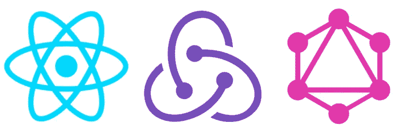

# 初学者的 9 个最佳 GraphQL 教程[2023 年 3 月]——在线学习 GraphQL

> 原文：<https://medium.com/quick-code/top-online-video-tutorials-to-learn-graphql-458056e3b583?source=collection_archive---------0----------------------->

## 用 2023 年最好的新手 GraphQL 教程学习后端开发工作的 GraphQL。

GrapghQL 是 REST 的替代品，REST 是 API 设计的行业标准，由于其性能优势，许多大公司如 Google、Airbnb、Shopify 已经在使用它。

掌握 GraphQL 将使你成为高薪工程和后端开发工作的理想候选人，因为你将能够在他们的业务中实施这一尖端技术。以下是由时代专家整理的顶级 GraphQL 教程列表中的一些课程，您应该参加这些课程来深入了解 GraphQL 开发。这些是你必须从最好的 GraphQL 课程开始学习 GraphQL 开发的在线课程。

# 1. [GraphQL API —自动化&与邮递员一起开发 QA & SDET](https://click.linksynergy.com/deeplink?id=Fh5UMknfYAU&mid=39197&u1=quickcode&murl=https%3A%2F%2Fwww.udemy.com%2Fcourse%2Flearn-graphql-api-automation-with-postman-for-sdet-qa-analyst%2F)

自动化和开发 GraphQL APIs 的初学者指南。

在本课程中，您将学习:

*   graph QL API——与邮递员一起为质量保证和 SDET 实现自动化和开发。
*   理解 GraphQL 操场文档。
*   编写和发送 GraphQL 查询和变异请求。
*   GraphQL API 响应的自动化测试。
*   了解如何为 GraphQL API 开发/添加新功能。
*   了解什么是 GraphQL 类型定义和解析器。
*   能够做 GraphQL API 项目工作和练习)。

在本课程中，将向您介绍 GraphQL，这是向 API 发送请求的新标准查询语言(QL)。主题包括:GraphQL 语法、GraphQL 查询和变异、GraphQL Playground、API 文档、使用 Playground 和 Postman 发送请求、使用 Postman/JavaScript 进行自动化测试、API 开发主题(如解析器、Typedefs)以及向 API 添加 2 个新功能。

# 2.[面向开发者的 AWS:带 GraphQL 的 AWS app sync](https://linkedin-learning.pxf.io/c/1137078/646189/8005?u=https%3A%2F%2Fwww.linkedin.com%2Flearning%2Faws-for-developers-aws-appsync-with-graphql&subId1=quickcode)

随着移动应用程序的成熟，用户越来越希望数据可以在各种设备上使用，即使是离线状态，也希望数据能够实时更新。AWS AppSync 有助于这两者，同时还将 GraphQL 用于 API。

在本课程中，您将学习如何:

*   在您的移动应用程序开发工作流程中利用 AWS AppSync 和 GraphQL。
*   定义架构；通过 Amplify 生成手机应用程序代码。
*   开发一个具有用户登录、离线可用的在线数据和实时更新的应用程序。

您将发现如何在您的移动应用程序开发工作流程中利用 AWS AppSync 和 GraphQL。它将带您从现有的 DynamoDB 表创建一个在线 GraphQL API，反之亦然。

它显示了如何定义模式；通过 Amplify 生成手机 app 代码；开发一个用户登录、在线数据离线可用、实时更新的应用程序。

# 3.[graph QL 实用指南:从客户端角度出发](https://www.educative.io/collection/10370001/5717730879602688?affiliate_id=5088579051061248)

这门课程被编写得尽可能实用。它提供了一个交互式的学习体验，从 GraphQL 的一般介绍开始，到允许您使用 GitHub 的 GraphQL API 来处理 GraphQL 查询和变化。

在熟悉了 GraphQL 的基础知识之后，本课程将继续学习如何将 GraphQL 与 React 结合使用，以及如何将其与 Apollo Client 集成。您将使用 GraphQL 结合 React 和 Apollo 客户端实现一个问题跟踪器应用程序

# 4.[graph QL Apollo Server with node . js，MongoDB — GraphQL APIg](https://www.eduonix.com/graphql-apollo-server-with-node-js-mongodb-graphql-api/UHJvZHVjdC0zMjMyMDA=)

GraphQL API 服务器用 Apollo，Node.js，MongoDB。Jwt 认证、游标分页、数据库查询批处理和缓存

在本课程中，您将学习如何:

*   在 Node.js、Express 和 MongoDB 中用 Apollo Server 构建 GraphQL API。
*   在 Apollo GraphQL API 中添加 JWT 认证。
*   使用基于光标的分页策略实现更快的分页。我们还将实现偏移限制分页，并将对它们进行比较。
*   添加数据加载器，通过批处理和缓存数据库查询，更快地从服务器返回数据。
*   对查询、变异和订阅等 GraphQL 概念充满信心。
*   在 GraphQL 中执行最佳实践，并使用适当的模式设计构建可伸缩的 API。
*   执行高效且可扩展的 GraphQL 模式设计策略。
*   处理深度嵌套的 GraphQL 查询。
*   高效使用 GraphQL 游乐场工具。
*   很好地理解 GraphQL 中的模式和“类型”。
*   使用订阅设置客户端和服务器之间的实时通信。
*   管理 GraphQL 中的身份验证上下文。
*   使用 Graphql 解析器中间件保护各种查询和变化，并从上下文中验证状态。
*   定义各种对象类型之间的关系。

# 5.[探索 GraphQL:一种用于 API 的查询语言](https://www.awin1.com/cread.php?awinmid=6798&awinaffid=466009&clickref=quickcode&ued=https%3A%2F%2Fwww.edx.org%2Fcourse%2Fexploring-graphql-a-query-language-for-apis)

了解 GraphQL，它是 REST 的一种替代方法，并在交互式游戏中练习 GraphQL 查询。

在本课程中，您将学习:

*   什么是 GraphQL，它是如何工作的。
*   何时使用 GraphQL。
*   GraphQL 相对于 REST 等其他范式有哪些优势。

您将了解什么是 GraphQL，以及为什么它会受到软件工程师如此多的关注。

您将了解它相对于 REST 的优势，使用它的 web 架构类型，以及为什么它对前端和后端开发人员都有好处。

您将有机会在一个互动的操场上练习 GraphQL 查询。

您还将学习一些高级主题，例如如何在后端实现 GraphQL 服务器，如何在客户端使用 GraphQL 服务器，以及如何保证 GraphQL 服务器的安全。

# 6. [GraphQL:大图](https://pluralsight.pxf.io/c/1137078/424552/7490?u=https%3A%2F%2Fwww.pluralsight.com%2Fcourses%2Fgraphql-big-picture&subId1=quickcode)

在本课程中，您将了解 GraphQL，它的核心概念，以及为什么您应该选择 GraphQL 来构建您的 API。探索不断发展的 GraphQL 生态系统和工具，为您提供卓越的开发体验。

该课程包括:

*   GraphQL 是什么？
*   GraphQL 核心概念
*   为什么选择 GraphQL？
*   GraphQL 生态系统和工具

在这个课程中，GraphQL: The Big Picture，你会明白为什么 GraphQL 变得如此流行。

首先，您将探索 GraphQL 的整体概况，并了解其核心概念。

接下来，您将研究何时以及为什么应该选择 GraphQL。

最后，您将发现目前可用的各种 GraphQL 生态系统和工具。观看本课程后，您将对 GraphQL 的核心特性、功能和优势有一个清晰的了解。

本课程将帮助您就 GraphQL 是否适合您的公司做出明智的决定。

# 7.[构建 GraphQL API 的完整指南](https://click.linksynergy.com/deeplink?id=Fh5UMknfYAU&mid=39197&u1=quickcode&murl=https%3A%2F%2Fwww.udemy.com%2Fcomplete-guide-to-building-a-graphql-api%2F)

构建自己的 GraphQL API 所需的一切

GraphQL 是一种由脸书开发的查询语言，用于支持他们的移动应用程序。它取代了传统的 REST API，更加灵活和快速。使用 GraphQL，您可以通过向服务器发出一个请求来查询多个资源。使其成为 web 应用程序和移动应用程序的理想选择。

编写自己的 GraphQL API 非常容易。它与任何数据库兼容，如果需要，甚至可以跨不同的数据库引擎工作。现在就开始，让您的 GraphQL API 立即运行起来。

# 8.[从 REST 迁移到 GraphQL](https://linkedin-learning.pxf.io/c/1137078/646189/8005?u=https%3A%2F%2Fwww.linkedin.com%2Flearning%2Fmigrating-from-rest-to-graphql&subId1=quickcode)

了解何时应该从 REST 迁移到 GraphQL，以及如何将 REST API 的添加、更新和删除操作转换成 GraphQL 的变体。

在本课程中，您将学习如何:

*   将 REST API 的添加、更新和删除操作转换成 GraphQL 变异。
*   构建简单、有用的查询；在查询中使用参数、片段和别名。
*   使用 GraphQL 执行操作。

本课程还解释了如何构建简单、有用的查询；在查询中使用参数、片段和别名。并使用 GraphQL 执行操作。

# 9.【Ruby on Rails 的 GraphQL 基础知识

学习在 Rails 应用程序中使用 GraphQL 与您的前端客户端对话。

本课程讲授在 Rails 应用程序中使用 GraphQL 的基础知识。GraphQL 是一种查询语言，由脸书在 2012 年发明，并于 2015 年开源。虽然它比 REST 有一些明显的优势，但是它也有一个更陡峭的学习曲线。

这些讲座以简单易懂的方式组织，将帮助您开始使用 GraphQL 在后端和前端应用程序之间循环数据。

在第一部分中，我们将学习如何读取数据；第二，关于改变数据；稍微高级一点的第三部分是关于保护数据的。

# 10.[用 GraphQL 构建更好的 APIs】](https://click.linksynergy.com/deeplink?id=Fh5UMknfYAU&mid=39197&u1=quickcode&murl=https%3A%2F%2Fwww.udemy.com%2Fbuilding-better-apis-with-graphql%2F)

用 GraphQL 构建更好更快的 API 的分步指南。

这个课程教给你所有你需要知道的关于 GraphQL 的知识。GraphQL 于 2015 年由脸书开源，是一种全新的 API 开发方法。GraphQL 将在未来几年取代 REST。

*   我们从头开始构建两个项目，这样您就拥有了使用 GraphQL 所需的一切

您将学到的内容:

*   GraphQL 模式如何工作，以便您可以在自己的服务器上使用 GraphQL
*   如何查询 GraphQL 以便访问和修改数据
*   我们将从简单的开始，用虚拟数据创建一个模式
*   然后，我们将把我们的 with 模式连接到一个实时的星球大战 API
*   我们将学习如何使用 DataLoader 查询数据、过滤数据以及优化查询
*   我们将介绍如何将模式放在 Express 服务器上，这样您就可以只通过 HTTP 请求来访问数据
*   然后我们将从突变开始，REST 的 POST、PUT 和 DELETE 的 GraphQL 版本
*   我们将构建一个博客 API，仅使用 GraphQL 的变异和查询，结合我们目前所学的一切
*   我们将讨论 GraphQL 订阅的状态，这是一个新兴的、不断发展的标准

# 11.[开始图 QL](https://click.linksynergy.com/deeplink?id=Fh5UMknfYAU&mid=39197&u1=quickcode&murl=https%3A%2F%2Fwww.udemy.com%2Fcourse%2Fbeginning-graphql%2F)

学习如何使用这种查询语言更快地获取数据，并提高应用程序的性能

在本课程中，您将学习如何:

*   将核心 GraphQL 概念应用于不同的语言。
*   实现 GraphQL 应用程序的整体结构。
*   将 Apollo GraphQL 用于服务器和客户端 JavaScript 应用程序。
*   使用真实的业务场景创建应用程序。
*   探索 GraphQL 和 REST 之间的差异。
*   发现 GraphQL 相对于 REST 的优势。

这个快节奏的课程是专门为学习 GraphQL 的各个方面而设计的。你将从理解这种语言的基本特征开始。

您将学习如何将 GraphQL 与服务器端应用程序集成，以及如何实现实时数据查询。您还将发现使用 Apollo 客户机将 GraphQL 与服务器端应用程序连接起来的方法。

课程结束时，您将能够成功创建快速的客户端-服务器 REST 式应用程序。

# 12.[接力 Modern+graph QL+React+MongoDb](https://click.linksynergy.com/deeplink?id=Fh5UMknfYAU&mid=39197&u1=quickcode&murl=https%3A%2F%2Fwww.udemy.com%2Frelay-modern-graphql-react-mongodb%2F)

主要是接力摩登。

中继现代是最迷人的网络技术。本课程是接力现代教程。

您将从头开始，只需要中级 JavaScript 知识，在课程结束时，您将对 Relay 如此着迷，以至于您永远不会回头看或怀疑其他技术是否更好。

> 感谢您阅读本文。我们策划了更多主题的顶级教程，您可能想看看:

 [## 初学者的 9 个最佳 Postman 教程——在线学习 Postman API 测试

### 用 2021 年最好的 Postman 初学者教程学习 Postman 进行 RESTful API 测试

medium.com](/quick-code/top-tutorials-to-learn-postman-for-rest-api-testing-3bdf9788e0ba)  [## 面向初学者的 15+最佳 Node.js 教程—在线学习 Node.js

### 学习 Node.js 从 2021 年最好的 Node.js 初学者教程开始学习 web 开发

medium.com](/quick-code/the-best-tutorials-to-learn-node-js-34818d757013)  [## 10+最佳 AWS 培训在线课程—为 AWS 认证做准备

### 用 2021 年最好的新手 AWS 培训课程为开发者准备 AWS 认证。

medium.com](/quick-code/top-tutorials-to-prepare-for-aws-certification-exams-e991c55b54b0) 

> **更新**:我们为[学习 GraphQL](http://blog.coursesity.com/best-graphql-tutorials/?utm_source=botsfloor&utm_medium=referral&utm_campaign=mediumPost&utm_term=learn-graphql) 制作了最新版本的顶级教程。请随意查看年度最佳 GraphQL 教程。

披露:我们与本文中提到的一些资源有关联。如果你通过本页的链接购买课程，我们可能会得到一小笔佣金。谢谢你。