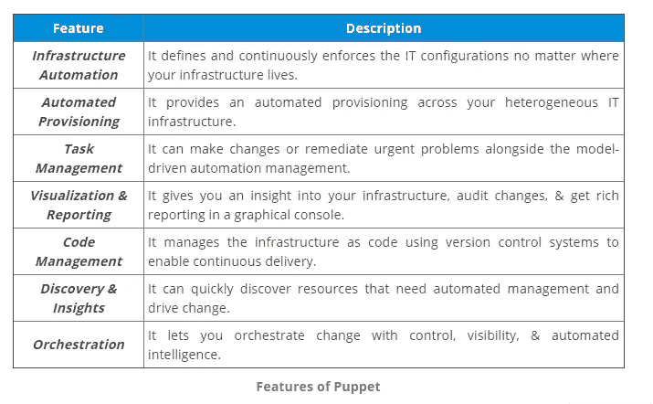
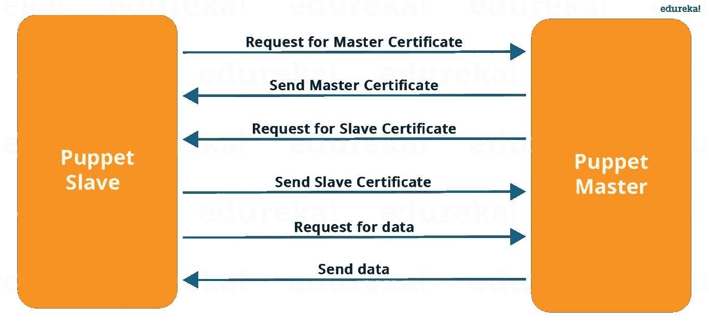
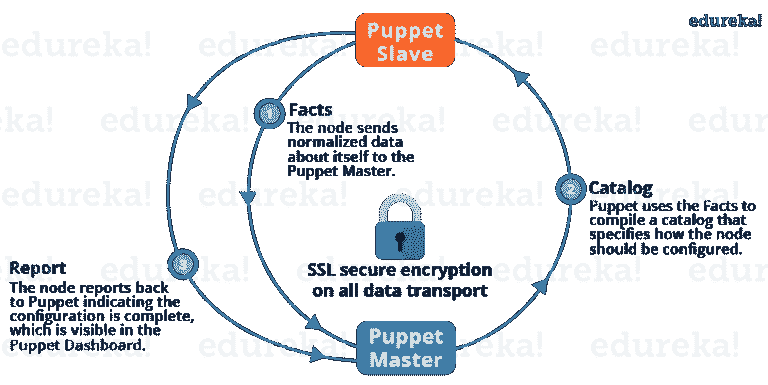

# 2021 年最热门的木偶面试问题

> 原文：<https://medium.com/edureka/top-puppet-interview-questions-9ec80b912a8?source=collection_archive---------2----------------------->


# 木偶面试问题

Puppet 是最成熟、使用最广泛的配置管理工具。这很有可能成为你面试中讨论的重点。因此，我这里有一套常见的木偶面试问题。

毫无疑问，在这篇木偶面试问题文章中，第一个问题必须是:

# Q1。什么是木偶？

我劝你先给木偶一个小定义。Puppet 是一个配置管理工具，用于自动化管理任务。



现在，你应该描述一下傀儡师和代理人是如何交流的。

Puppet 有一个主-从架构，其中从必须首先向主发送一个证书签名请求，主必须签署该证书，以便在 Puppet Master 和 Puppet Slave 之间建立安全连接，如下图所示。傀儡从设备向傀儡主设备发送请求，然后傀儡主设备将配置推送到从设备上。

请参考解释上述说明的下图:



# Q2。木偶是如何工作的？

对于这个问题，请解释木偶建筑。请参考下图:



上图中执行了以下功能:

*   傀儡代理人将事实发送给傀儡主人。事实基本上是表示从状态的某个方面的键/值数据对，比如它的 IP 地址、运行时间、操作系统，或者它是否是一个虚拟机。稍后我会在博客中详细解释这些事实。
*   Puppet Master 使用这些事实来编译一个目录，该目录定义了应该如何配置从设备。Catalogis 是一个文档，它描述了傀儡主设备在从设备上管理的每个资源的期望状态。稍后我将详细解释目录和资源。
*   Puppet Slave 向 Master 报告配置已完成，这可以在 Puppet 仪表板中看到。

现在面试官可能会深入挖掘，所以下一组木偶面试问题将测试你对木偶各组成部分的了解。

# Q3。木偶清单是什么？

这是一个非常重要的问题，只是要确保你进入了一个正确的流程，根据我的说法，你应该首先定义清单。

每个节点(或 Puppet 代理)在 Puppet Master 中都有自己的配置细节，用本地 Puppet 语言编写。这些细节是用木偶能理解的语言写的，被称为显化。清单由 Puppet 代码组成，它们的文件名使用。pp 扩展。

现在举一个例子，您可以在 Puppet Master 中编写一个清单，创建一个文件并在连接到 Puppet Master 的所有傀儡代理(奴隶)上安装 apache。

# Q4。什么是木偶模块，它和木偶清单有什么不同？

对于这个答案，我倾向于下面提到的解释:

Puppet 模块是清单和数据(比如事实、文件和模板)的集合，它们有特定的目录结构。模块对于组织 Puppet 代码很有用，因为它们允许您将代码分成多个清单。使用模块来组织几乎所有的木偶清单被认为是最佳实践。

木偶程序被称为清单。清单由 Puppet 代码组成，它们的文件名使用。pp 扩展。

# Q5。木偶中的因素是什么？

你应该回答 Facter 在 Puppet 中到底是做什么的，所以，根据我的说法，你应该从解释开始:

Facter 基本上是一个库，它发现并向傀儡主人报告每个代理的事实，比如硬件细节、网络设置、操作系统类型和版本、IP 地址、MAC 地址、SSH 密钥等等。这些事实随后在傀儡师的清单中作为变量出现。

# Q6。什么是木偶目录？

我建议你先讲一下木偶目录的用途。

当配置一个节点时，Puppet Agent 使用一个称为 catalog 的文档，它从 Puppet Master 下载这个文档。该目录描述了应该被管理的每个资源的期望状态，并且可以指定应该以特定顺序被管理的资源的依赖性信息。

如果你的面试官想知道更多，请提到以下几点:

Puppet 使用三个主要的配置信息来源来编译目录:

*   代理提供的数据
*   外部数据
*   木偶清单

# Q7。什么规模的组织应该使用木偶？

没有最小或最大的组织规模可以从 Puppet 中受益，但是有一些规模更有可能受益。只有少量服务器的组织不太可能认为维护这些服务器是一个真正的问题，拥有许多服务器的组织更可能发现手动管理这些服务器很困难，因此使用 Puppet 对这些组织更有利。

# Q8。我应该如何升级木偶和 Facter？

安装和升级 Puppet 和 Facter 的最佳方式是通过您的操作系统的包管理系统，使用您的供应商的存储库或 Puppet Labs 的公共存储库之一。

如果您从源代码安装了 Puppet，请确保在升级之前完全删除旧版本(包括所有应用程序和库文件)。配置数据(通常位于/etc/puppet 或/var/lib/puppet 中，尽管位置可能不同)可以在两次安装之间保留。

下一组木偶面试问题将测试你的木偶体验。

# Q9。检查从傀儡代理(奴隶)到傀儡主人的证书请求的命令是什么？

依我看，你应该先提命令。

要检查傀儡代理向傀儡主发送的证书签名请求列表，请在傀儡主中执行**傀儡证书列表**命令。

我会建议你也加上:

如果你想签署一个特定的证书，执行:**傀儡证书签名<代理的主机名>。**您也可以通过执行:**木偶证书签署所有**来一次签署所有证书。

# Q10。傀儡代理上的 etckeeper-commit-post 和 etckeeper-commit-pre 有什么用？

这个问题的答案很直接，只需说出上述命令的用法:

*   **etckeeper-commit-post:** 在这个配置文件中，您可以定义在代理上推送配置后执行的命令和脚本。
*   **etckeeper-commit-pre** :在这个配置文件中，您可以定义在将配置推送到代理之前执行的命令和脚本。

*希望你已经喜欢上了上面一套木偶面试问题，下一套问题会更有挑战性，所以要做好准备。*

# Q11。类名中允许使用什么字符？在模块名称中？在其他标识符中？

我建议你通过提及以下角色来回答这个问题:

类名可以包含小写字母、数字和下划线，并且应该以小写字母开头。“::”(范围解析运算符)可以用作命名空间分隔符。

在命名已定义的资源类型、模块和参数时，应该使用相同的规则，尽管模块和参数不能使用命名空间分隔符。

变量名可以包括字母数字字符和下划线，并且区分大小写。

# Q12。Puppet 在 windows 上运行吗？

是的。从 Puppet 2.7.6 开始，基本类型和提供者确实在 Windows 上运行，测试套件也在 Windows 上运行，以确保将来的兼容性。

# Q13。Puppet 支持哪个版本的 Ruby？

我建议你在回答中提到以下几点:

*   某些版本的 Ruby 用 Puppet 进行了比其他版本更彻底的测试，而有些版本根本没有进行测试。运行 **ruby -version** 来检查你系统上的 ruby 版本。
*   从 Puppet 4 开始，Puppet 代理包不再依赖于操作系统的 Ruby 版本，因为它捆绑了自己的 Ruby 环境。您可以将 puppet-agent 与任何版本的 Ruby 一起安装，或者安装在没有安装 Ruby 的系统上。
*   Puppet Enterprise (PE)也不依赖于操作系统的 Ruby 版本，因为它捆绑了自己的 Ruby 环境。您可以将 PE 与任何版本的 Ruby 一起安装，或者安装在没有安装 Ruby 的系统上。
*   Puppet Labs 提供的 Windows 安装程序不依赖于操作系统的 Ruby 版本，可以与任何版本的 Ruby 一起安装，也可以安装在没有安装 Ruby 的系统上。

# Q14。你用哪些开源或社区工具让 Puppet 更强大？

解释一些你和 Puppet 一起使用的工具来完成一个特定的任务。你可以参考下面的例子:变更和请求通过吉拉出票，我们通过内部流程管理请求。然后，我们使用 Git 和 Puppet 的代码管理器应用程序按照最佳实践来管理 Puppet 代码。此外，我们使用烧杯测试框架，通过我们在 Jenkins 的持续集成管道运行我们所有的 Puppet 变更。

# Q15。告诉我你使用协作和傀儡来帮助解决团队中的冲突的时候？

向他们解释你过去的木偶经历，以及它如何有助于解决冲突，你可以参考下面提到的例子:

开发团队想要在由 Puppet 管理的测试机器上进行 root 访问，以便进行特定的配置更改。我们的回应是每周与他们会面，就开发人员交流配置变更的过程达成一致，并授权他们做出许多他们需要的变更。通过我们的共同努力，我们想出了一种方法，让开发人员通过 Hiera 抽象的数据自己更改特定的配置值。事实上，我们甚至教其中一个开发人员如何与我们合作编写木偶代码。

# Q16。我可以用 Puppet 中的 Facter 访问环境变量吗？

我建议你这样回答:

不是直接的。然而，Facter 从环境变量的一个特殊子集读入定制事实。当 FACTER 运行时，任何带有 FACTER_ 前缀的环境变量都将被转换为事实。

现在用一个例子来解释面试官:

```
$ FACTER_FOO="bar"
$ export FACTER_FOO</span>
$ facter | grep 'foo'</span>
foo => bar
```

FACTER_FOO 环境变量的值现在可以在您的 Puppet 清单中以$foo 的形式获得，并且将具有值“bar”。使用 shell 脚本将环境变量的任意子集作为事实导出，留给读者作为练习。

# Q17。虚拟资源在木偶中有什么用

首先，您需要定义虚拟资源。

虚拟资源指定资源的期望状态，而不一定强制该状态。虽然虚拟资源只能声明一次，但是可以实现任意次。

我建议您也提及虚拟资源的用途:

*   其管理依赖于满足多个条件中的至少一个的资源。
*   任意数量的类可能需要重叠的资源集。
*   仅当满足多个跨类条件时才应管理的资源。

一旦你准备好了上面的木偶面试问题，你的梦想工作就不远了。

这是我关于 Nagios 面试问题的文章的结尾。如果你想查看更多关于人工智能、Python、道德黑客等市场最热门技术的文章，你可以参考 Edureka 的官方网站。

请留意本系列中的其他文章，它们将解释 DevOps 的各个方面。

> *1。* [*DevOps 教程*](/edureka/devops-tutorial-89363dac9d3f)
> 
> *2。* [*Git 教程*](/edureka/git-tutorial-da652b566ece)
> 
> *3。* [*詹金斯教程*](/edureka/jenkins-tutorial-68110a2b4bb3)
> 
> *4。* [*码头工人教程*](/edureka/docker-tutorial-9a6a6140d917)
> 
> *5。* [*Ansible 教程*](/edureka/ansible-tutorial-9a6794a49b23)
> 
> *6。* [*木偶教程*](/edureka/puppet-tutorial-848861e45cc2)
> 
> *7。* [*厨师教程*](/edureka/chef-tutorial-8205607f4564)
> 
> *8。* [*Nagios 教程*](/edureka/nagios-tutorial-e63e2a744cc8)
> 
> *9。* [*如何编排 DevOps 工具？*](/edureka/devops-tools-56e7d68994af)
> 
> *10。* [*连续交货*](/edureka/continuous-delivery-5ca2358aedd8)
> 
> *11。* [*持续集成*](/edureka/continuous-integration-615325cfeeac)
> 
> *12。* [*连续部署*](/edureka/continuous-deployment-b03df3e3c44c)
> 
> *13。* [*持续交付 vs 持续部署*](/edureka/continuous-delivery-vs-continuous-deployment-5375642865a)
> 
> *14。* [*CI CD 管道*](/edureka/ci-cd-pipeline-5508227b19ca)
> 
> *15。* [*Docker 作曲*](/edureka/docker-compose-containerizing-mean-stack-application-e4516a3c8c89)
> 
> *16。* [*码头工人群*](/edureka/docker-swarm-cluster-of-docker-engines-for-high-availability-40d9662a8df1)
> 
> *17。* [*Docker 联网*](/edureka/docker-networking-1a7d65e89013)
> 
> *18。* [*易变拱顶*](/edureka/ansible-vault-secure-secrets-f5c322779c77)
> 
> *19。* [*岗位职责*](/edureka/ansible-roles-78d48578aca1)
> 
> 20。 [*可用于 AWS*](/edureka/ansible-for-aws-provision-ec2-instance-9308b49daed9)
> 
> *21。* [*詹金斯管道*](/edureka/jenkins-pipeline-tutorial-continuous-delivery-75a86936bc92)
> 
> *22。* [*顶级 Docker 命令*](/edureka/docker-commands-29f7551498a8)
> 
> *23。*[*Git vs GitHub*](/edureka/git-vs-github-67c511d09d3e)
> 
> *24。* [*顶级 Git 命令*](/edureka/git-commands-with-example-7c5a555d14c)
> 
> *二十五。* [*DevOps 面试问题*](/edureka/devops-interview-questions-e91a4e6ecbf3)
> 
> *二十六。* [*谁是 DevOps 工程师？*](/edureka/devops-engineer-role-481567822e06)
> 
> *27。* [*DevOps 生命周期*](/edureka/devops-lifecycle-8412a213a654)
> 
> *28。*[*Git ref log*](/edureka/git-reflog-dc05158c1217)
> 
> *29。* [*易变条款*](/edureka/ansible-provisioning-setting-up-lamp-stack-d8549b38dc59)
> 
> *30。* [*组织正在寻找的顶尖 DevOps 技能*](/edureka/devops-skills-f6a7614ac1c7)
> 
> *30。* [*瀑布 vs 敏捷*](/edureka/waterfall-vs-agile-991b14509fe8)
> 
> *31。* [*詹金斯小抄*](/edureka/jenkins-cheat-sheet-e0f7e25558a3)
> 
> *32。* [*不可译的备忘单*](/edureka/ansible-cheat-sheet-guide-5fe615ad65c0)
> 
> *33。* [*Ansible 面试问答*](/edureka/ansible-interview-questions-adf8750be54)
> 
> *34。* [*50 码头工人面试问题*](/edureka/docker-interview-questions-da0010bedb75)
> 
> *35。* [*敏捷方法论*](/edureka/what-is-agile-methodology-fe8ad9f0da2f)
> 
> *36。* [*詹金斯面试问题*](/edureka/jenkins-interview-questions-7bb54bc8c679)
> 
> *37。* [*Git 面试问题*](/edureka/git-interview-questions-32fb0f618565)
> 
> 38。 [*码头建筑*](/edureka/docker-architecture-be79628e076e)
> 
> 39。[*devo PS 中使用的 Linux 命令*](/edureka/linux-commands-in-devops-73b5a2bcd007)
> 
> *四十。* [*詹金斯 vs 竹子*](/edureka/jenkins-vs-bamboo-782c6b775cd5)
> 
> *41。* [*Nagios 教程*](/edureka/nagios-tutorial-e63e2a744cc8)
> 
> 42。 [*Nagios 面试问题*](/edureka/nagios-interview-questions-f3719926cc67)
> 
> 43。 [*DevOps 实时场景*](/edureka/jenkins-x-d87c0271af57)
> 
> 44。 [*詹金斯和詹金斯 X 的区别*](/edureka/jenkins-vs-bamboo-782c6b775cd5)
> 
> *45。*[*Windows Docker*](/edureka/docker-for-windows-ed971362c1ec)
> 
> *46。*[*Git vs Github*](http://git%20vs%20github/)

*原载于 2017 年 7 月 12 日*[*https://www.edureka.co*](https://www.edureka.co/blog/interview-questions/puppet-interview-questions/)*。*