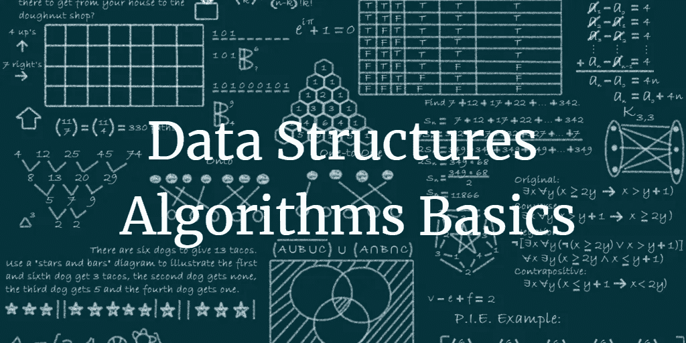
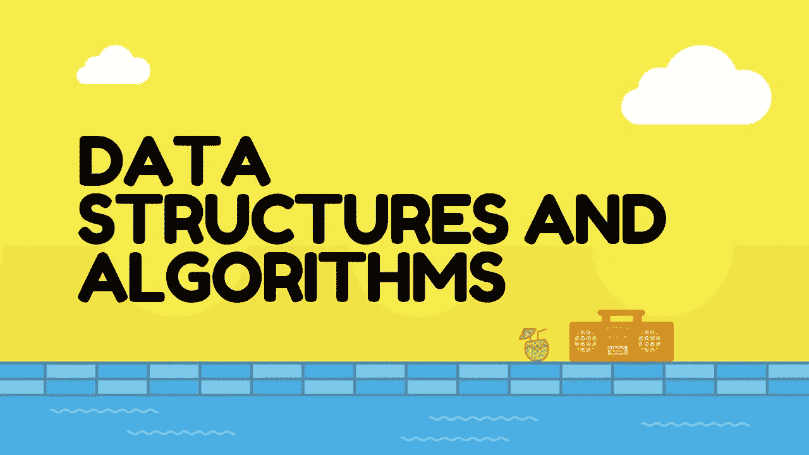
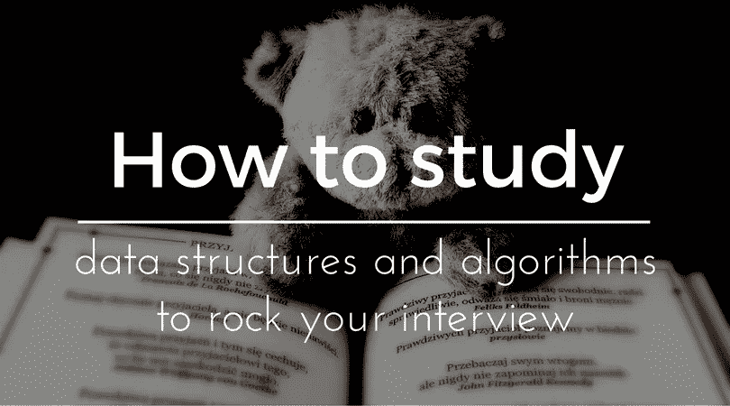
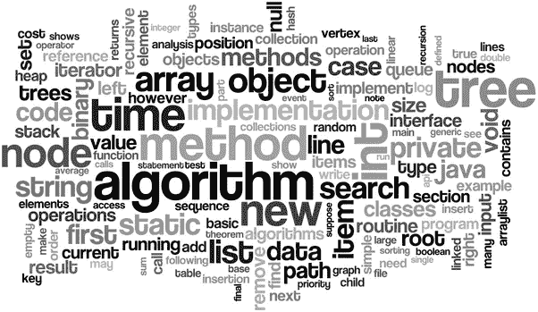
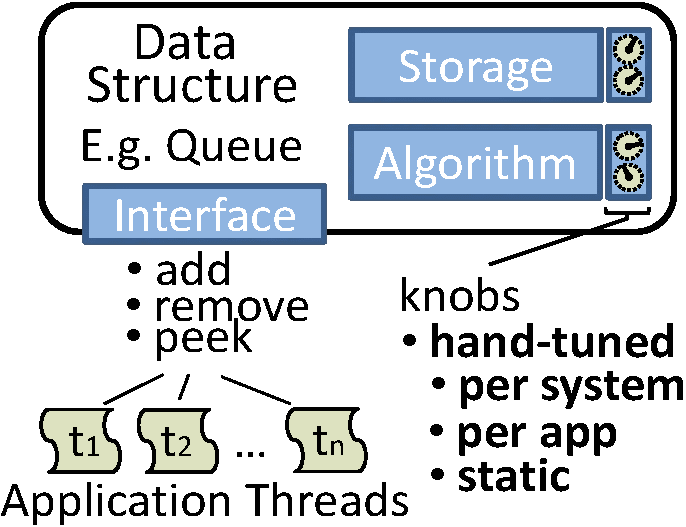

# 20 门最佳数据结构和算法初学者课程[2023 年 3 月]

> 原文：<https://medium.com/quick-code/top-tutorials-learn-data-structure-and-algorithm-for-an-interview-preparation-96e1f7518e26?source=collection_archive---------0----------------------->

## 学习最佳数据结构算法教程，包括 2023 年初学者最佳数据结构算法教程系统设计。

## 1.[编码面试训练营:算法+数据结构](https://coursesity.com/r/site/the-coding-interview-bootcamp-algorithms--data-structures)

掌握数据结构和算法，赢得下一次 Javascript 编码面试。

***课程评分:4.7 满分 5.0(******8022 评分合计)***

如果你对你的第一次编程面试感到紧张，或者对申请下一份工作感到焦虑，这是为你准备的课程。我厌倦了面试官问一些刁钻的问题，这些问题只有你以前见过才能回答，所以我开了这门课！本视频课程将教你在编码面试中会遇到的最常见的面试问题，为你提供在下一次白板面试中胜出所需的工具。

编码面试是出了名的吓人，但是有一个方法可以成为更好的面试官——那就是实践！练习几十个面试问题是 12 万美元的工作邀请和另一封拒绝邮件之间的区别。这门课程不仅会给你几十个问题来练习，还会确保你理解解决每个问题背后的技巧，这样你就能在真正的面试中表现出来。

在本课程中，您将学习:

*   对每一个问题都有清晰的、有条理的解释，以确保你理解解决方案
*   需要了解的最重要的数据结构概述。这些是为没有计算机科学学位的人准备的。
*   大量常见算法问题的集合，包括从“反转字符串”到“确定 BST 的宽度”的所有内容
*   解决系统设计问题的明智策略
*   回答面试官真正想要什么的内部技巧

Top Data Structures & Algorithm Tutorials

## 2.[数据结构和算法专门化](https://coursera.pxf.io/c/1137078/1213622/14726?u=https%3A%2F%2Fwww.coursera.org%2Fspecializations%2Fdata-structures-algorithms&subId1=BotTutorials)

掌握算法编程技术。通过编程学习算法，推进你的软件工程或数据科学事业。

***课程评分:4.6 满分 5.0 (*** ***10，181 总评分)***

这个专业是理论和实践的结合:你将学习解决各种计算问题的算法技术，并用你选择的编程语言实现大约 100 个算法编码问题。

本课程涵盖了在实际应用中经常出现的计算问题的基本算法技术和思想:排序和搜索，分治，贪婪算法，动态规划。我们将学到很多理论:如何对数据进行分类，以及它如何有助于搜索；如何将一个大问题分解成几个部分并递归地解决它们，什么时候贪婪地进行是有意义的，动态编程如何用于基因组研究。你将练习解决计算问题，设计新的算法，并有效地实现解决方案。

本课程涵盖了各种计算问题中常用的数据结构。你将学习如何在不同的编程语言中实现这些数据结构，并在我们的编程作业中练习实现它们。这将有助于您理解数据结构的特定内置实现内部正在发生什么，以及从中可以得到什么。您还将学习这些数据结构的典型用例。

在本课程中，你将学习什么是图，以及什么是最重要的属性。您将学习几种遍历图的方法，以及如何在以某种顺序遍历图的同时做一些有用的事情。

没有任何其他算法在线课程能为你提供下一次求职面试时可能面临的大量编程挑战。

## 3.[编程基础:数据结构](https://linkedin-learning.pxf.io/c/1137078/646189/8005?u=https%3A%2F%2Fwww.linkedin.com%2Flearning%2Fprogramming-foundations-data-structures-2&subId1=quickcode)

本课程深入概述了现代编程中最基本的数据结构。

在本课程中，您将了解:

*   复杂的数据结构，如链表、堆栈和队列、哈希表、树和图。
*   使用各种语言的数据结构，如 C#、Swift、JavaScript、Java 或 Python。

本课程从简单的数据分组方式开始，如数组和结构，逐渐引入更复杂的数据结构，如链表、堆栈和队列、哈希表、树和图。

每一课都附有一个真实的、实际的例子，展示了数据结构的作用。

完成本课程后，您将对数据结构有一个清晰的了解，并了解如何使用它们——无论您用什么语言编程:C#、Swift、JavaScript、Java 或 Python。

## 4.[JavaScript 中的数据结构](https://www.eduonix.com/data-structures-in-javascript/UHJvZHVjdC0zMjMyMDA=)

通过我们的数据结构教程成为一名数据专家，该教程将帮助你学会如何有效地使用 JavaScript 数据结构。

***课程评分:4.1 满分 5.0 (*** ***448* *评分合计)***

在本课程中，您将从一开始就了解数据结构，包括它们是什么，它们的属性是什么，JavaScript 中不同类型的数据结构，以及如何开始使用这些数据结构从头构建您自己的数据结构。

在本课程结束时，您不仅会熟悉数据结构，而且会真正学会如何以更高效的方式存储数据，以及如何改进自己编写的 JavaScript 代码。

您将了解到:

*   JavaScript 中的数据结构介绍
*   复习编程实践
*   计算机科学中常用的重要数据结构
*   浏览数组、堆栈、链表、队列、哈希表和树形图等结构
*   排序和搜索算法的详细介绍
*   数据结构的不同优势

Best Data Structures and Algorithms Courses List

## 5.[系统设计面试](https://www.educative.io/collection/5668639101419520/5649050225344512?affiliate_id=5088579051061248)

***课程评分:3* ，737 *推荐***

系统设计问题已经成为软件工程面试过程的标准部分。这些面试中的表现反映了你处理复杂系统的能力，并转化为面试公司提供给你的职位和薪水。大多数工程师都在系统设计面试(SDI)中苦苦挣扎，部分原因是他们缺乏开发大型系统的经验，部分原因是 SDI 的非结构化性质。

即使有一些构建这种系统的经验的工程师也对这些面试感到不舒服，主要是因为没有标准答案的设计问题的开放性。本课程是掌握 SDIs 的完整
指南。它是由在谷歌、脸书、微软和亚马逊工作过的招聘经理创造的。我们精心选择了一系列问题，这些问题不仅在顶级公司反复被问到，而且还提供了处理任何系统设计问题的全面经验。

## 6.[算法和数据结构顶点](https://www.awin1.com/cread.php?awinmid=6798&awinaffid=466009&clickref=quickcode&ued=https%3A%2F%2Fwww.edx.org%2Fcourse%2Falgorithms-and-data-structures-capstone)

综合你的算法和生物学知识，构建你自己的软件来解决生物学挑战。

在本课程中，您将学习:

*   图形算法
*   基因组组装算法
*   算法优化

你将学会为基因组测序设计你自己的优化软件程序。

这一大数据挑战将涵盖整个 MicroMasters 计划。在简要介绍了构建基因组组装器所需的步骤之后，您将自己采取措施，开始使用从测序机器中获取的真实数据，并看看您是否可以设计出能够与全球数百个测序实验室每天使用的流行软件相竞争的基因组组装软件。

## 7.[数据结构和算法](https://imp.i115008.net/c/1137078/788805/11298?u=https%3A%2F%2Fwww.udacity.com%2Fcourse%2Fdata-structures-and-algorithms-nanodegree--nd256&subId1=quickcode)

获得 100 多种数据结构和算法练习的实际操作，并在需要时获得技术导师的支持，以帮助您为面试和在职场景做好准备。

在本课程中，您将学习:

*   你的项目概述。
*   如何刷新你的 Python 技能？
*   解构任何开放式问题的框架。
*   时间和空间复杂性的概念。
*   可用于存储数据的不同数据结构。
*   如何实现不同的方法来操作这些数据结构并检查效率。
*   不同数据结构的优势和应用。
*   如何处理开放式问题(无论是在面试中还是在现实世界中)并根据需求选择合适的数据结构。
*   如何在不同的数据结构上实现搜索、排序等基本算法，并考察这些算法的效率。
*   如何用递归实现这些算法？
*   如何不用递归实现这些算法？
*   针对各种面试问题练习选择和修改这些算法。

您将通过解决 80+练习题来学习数据结构和算法。

通过学习更高级的算法，如强力贪婪算法、图形算法和动态编程(通过将结果存储到子问题来优化递归),来提高您的算法技能。

你将从学习解决与特定数据结构和算法相关的问题开始每门课程。

在每门课程结束时，你将能够针对任何开放式问题评估不同的数据结构和算法，并根据你的设计选择实现一个解决方案。

## 8.[Python 中的算法和数据结构](https://coursesity.com/course-detail/algorithms-and-data-structures-in-python)

从头开始实现最新算法的指南:数组、链表、图形算法和排序。

***课程评分:4.3 满分 5.0(*****1730*评分合计)***

这门课程是关于数据结构和算法的。我们将用 Python 来实现这些问题，但我尽量做到通用:这样算法的核心可以用 C++或 Java 来实现。我强烈建议你自己把这些数据结构和算法打几遍，以便很好地掌握它。

在课程的第一部分，我们将学习基本的数据结构，如链表、栈、队列、二分搜索法树、堆，以及一些高级的数据结构，如 AVL 树和红黑树。第二部分将是关于图的算法，如生成树，最短路径算法，和图遍历。我们将尽可能优化每个数据结构。

在每一章中，我将讲述每个算法或数据结构的理论背景，然后我们将一步一步地用 Python 编写代码。

大多数高级算法都非常依赖于这些主题，因此理解这些基础知识绝对是值得的。这些原则可以用于几个领域:投资银行、人工智能或股票市场的电子交易算法。研究机构主要使用 Python 作为编程语言:从机器学习到复杂网络，有很多可供公众使用的库。

## 9.[数据结构和算法:使用 Java 进行深入研究](https://click.linksynergy.com/deeplink?id=Fh5UMknfYAU&mid=39197&u1=quickcode&murl=https%3A%2F%2Fwww.udemy.com%2Fdata-structures-and-algorithms-deep-dive-using-java%2F)

了解数组、链表、树、哈希表、堆栈、队列、堆、排序算法和搜索算法。

***课程评分:4.4 满分 5.0 (*** ***共 4304 分)***

本课程回顾了事物如何工作的理论，但只是给你理解所涉及的实现所需要知道的东西。完整的源代码包括在内，可供您下载。

主题包括:-

1.  数组
2.  链接列表
3.  树
4.  哈希表
5.  大量
6.  行列
7.  很
8.  排序算法
9.  搜索算法

该课程也比同类课程中的大多数课程花费更多的时间来了解 JDK 有哪些课程。希望了解事物如何“在引擎盖下”工作的学生将从本课程中受益匪浅。

本课程回顾了事物如何工作的理论，但只是给你理解所涉及的实现所需要知道的东西。本课程的主要重点是让你真正理解事物是如何在幕后工作的，这样你就可以将其应用到未来的编程项目中。

如果你想真正理解事物是如何工作的，并且能够把这种理解应用到你自己的程序中，那么这个课程就是为你准备的。

## 10. [JavaScript 算法和数据结构 Masterclass](https://click.linksynergy.com/deeplink?id=Fh5UMknfYAU&mid=39197&u1=quickcode&murl=https%3A%2F%2Fwww.udemy.com%2Fcourse%2Fjs-algorithms-and-data-structures-masterclass%2F)

失踪的计算机科学和编码面试训练营

***课程评分:4.7 满分 5.0 (*** **总分 5436*)***

在本课程中，您将:

*   学习所有你需要的东西来应对困难的编码面试。
*   掌握数十种流行算法，包括 6 种排序算法！。
*   从头开始实现 10 多种数据结构。
*   提高解决问题的能力，成为更强的开发者。

内容从基础开始，然后最终涵盖类似课程回避的“高级主题”，如堆、图和 Dijkstra 的最短路径算法。

本课程教你如何使用大 O 符号分析你的代码的时间和空间复杂度，也包括递归的细节。您将学习一个 5 步法来解决任何困难的编码问题和常见的编程模式。

在本课程中，你将实现流行的搜索算法并编写 6 种不同的排序算法:冒泡、选择、插入、快速、合并和基数排序。然后，您将从头开始学习实现自己的数据结构，包括链表、树、堆、哈希表和图形。

在最后一节，您将学习遍历树和图，并涵盖 Dijkstra 的最短路径算法。该课程还包括一整节致力于动态编程。

Best Data Structures and Algorithms Courses For Beginners

## 11.[使用 C 和 C++](https://click.linksynergy.com/deeplink?id=Fh5UMknfYAU&mid=39197&u1=quickcode&murl=https%3A%2F%2Fwww.udemy.com%2Fcourse%2Fdatastructurescncpp%2F) 掌握数据结构&算法

使用 C 和 C++学习、分析和实现数据结构。学习递归和排序。

***课程评分:4.6 满分 5.0 (*** ***3、* 497 *评分合计)***

在本课程中，您将:

*   学习各种流行的数据结构及其算法..
*   发展你对数据结构的分析技能，然后有效地使用..
*   学习数据结构的递归算法。
*   了解各种排序算法。
*   用 C 和 C++实现数据结构。

您可能是数据结构的新手，或者您已经学习并实现了数据结构，但您仍然觉得需要详细了解数据结构，以便它能帮助您解决具有挑战性的问题并有效地使用数据结构。

本课程涵盖的主题包括:

1.递归

2.数组表示

3.数组 ADT

4.链表

5.堆

6.行列

7.树

8.二叉查找树

9.AVL 树

10.图表

11.散列技术

## 12.[实用数据结构&Java+HW 中的算法](https://click.linksynergy.com/deeplink?id=Fh5UMknfYAU&mid=39197&u1=quickcode&murl=https%3A%2F%2Fwww.udemy.com%2Fpractical-data-structures-algorithms-in-java%2F)

保持实用！深入学习最流行的数据结构和搜索算法。

***课程评分:4.5 满分 5.0(******1186 分总评分)***

如果我必须选择软件开发中最重要的一个话题，那就是数据结构和算法。可以把它看作是每个计算机程序员都可以使用的基本工具。你对这些工具掌握得越好，你就越有信心成为一名程序员。软件开发是一个广阔的领域，需要各种各样的技能，但擅长这个单一的主题是你编程旅程中的一个巨大飞跃，它肯定会为成功的编程生涯铺平道路。

本课程的主题将涵盖数据结构，如列表、堆栈、队列、树和一些最强大的排序、搜索和图形算法，这些算法彻底改变了计算领域。在整个课程中，我保持事情的实用性，并提供真实的例子来说明所有这些算法是如何工作的，以及何时何地可以应用它们来编写高效的计算机程序。

## 13.[JavaScript 中的数据结构:访谈复习者](https://www.educative.io/collection/5642554087309312/5663204961157120?affiliate_id=5088579051061248)

***课程评分:* 76 *推荐***

数据结构是计算机科学的基础之一，通常是开发高效程序的核心决策。因此，当涉及到行业面试时，他们也在很大程度上被归类为计算机科学知识的重要基准。本课程包含了所有常见数据结构的详细回顾，并提供了 JavaScript 实现级别的详细信息，使读者能够很好地掌握所有不同的数据结构，以便编写更好的代码！

## 14.[从零开始学习 JavaScript 中的数据结构](https://click.linksynergy.com/deeplink?id=Fh5UMknfYAU&mid=39197&u1=quickcode&murl=https%3A%2F%2Fwww.udemy.com%2Flearning-data-structures-in-javascript-from-scratch%2F)

通过学习数据结构编写更高效和高性能的代码。对技术性面试问题做好充分准备。

***课程评分:4.6 满分 5.0 (*** ***总分 1669 分)***

本课程从头开始教授数据结构(链表、二分搜索法树、哈希表)。数据结构允许你提高代码/程序/应用程序的效率、性能、速度和可伸缩性。您将学习什么是数据结构，为什么它们很重要，以及如何用 JavaScript 将它们编码出来。在这个过程中，您还将学习其他重要的编程概念，如递归、时间复杂性、“this”关键字、原型对象和构造函数，因为数据结构本质上使用这些概念。本课程大量使用图表和动画来帮助理解材料。

这门课程也非常适合任何在大公司和小公司面试开发人员/工程工作的人。面试官经常会要求应聘者用代码写出数据结构，本课程将帮助你做好这方面的准备。如果你刚刚从一个编码训练营毕业或者正在找工作，你会发现这个课程是有益的。了解数据结构将帮助你在技术面试中脱颖而出。

Learn Data Structures and Algorithm Concepts

## 15.[编码面试的动态编程模式](https://www.educative.io/collection/5668639101419520/5633779737559040?affiliate_id=5088579051061248)

***课程评分:484 推荐***

动态编程(DP)问题可能是编码面试中最令人生畏的问题。即使实际上很清楚一个问题是否可以使用 DP 来解决(这种情况很少发生)，甚至知道从哪里开始解决也是相当具有挑战性的。除非你接受了解决 DP 问题的方法培训。

这个课程就是为了这个目标而从头开始的。它将为你配备一套易于理解的技术来处理任何 DP 问题。不仅仅是让你试着记忆解决方案，你将会经历五种潜在的 DP 模式，然后应用它们来解决 35 个以上的 DP 问题。

在每个模式中，我们将从递归强力解决方案开始——这实际上是开始解决 DP 问题的最佳方式！一旦我们有了一个递归的解决方案，你就可以应用先进的动态规划的记忆和制表方法。本课程的练习题是精心挑选的，涵盖了编码面试中最常被问到的 DP 问题。

## 16.[数据结构介绍&Java 中的算法](https://click.linksynergy.com/deeplink?id=Fh5UMknfYAU&mid=39197&u1=quickcode&murl=https%3A%2F%2Fwww.udemy.com%2Fintroduction-to-data-structures-algorithms-in-java%2F)

旨在帮助理解 DS 和算法的基本原理。编程面试必备。

***课程评分:4.4 满分 5.0 (*** ***2* ，392 *评分合计)***

本课程介绍了一些基本的数据结构(数组、链表、栈、队列、树和堆)和算法(各种排序算法，以及对二分搜索法树和堆进行操作的算法)。在本课程中，我们还将涉及递归。图形和动画的使用使得讲座非常容易理解和消化。学完这门课，你将不再害怕数据结构和算法。

## 17. [Python 用于数据结构、算法和面试！](https://click.linksynergy.com/deeplink?id=Fh5UMknfYAU&mid=39197&u1=quickcode&murl=https%3A%2F%2Fwww.udemy.com%2Fpython-for-data-structures-algorithms-and-interviews%2F)

让您的职业生涯有一个良好的开端，并通过编码面试。

***课程评分:4.4 分满分 5.0 分(*** ***共 5971 分)***

这是最全面的在线课程，帮助你通过编码面试，学习数据结构和算法！本课程利用易于阅读的 Python 编程语言，高效地教你获得梦想中的技术工作所需的知识！

本课程将教会你在软件技术领域找到一份好工作所需的一切，包括:

*   制作一份出色的简历
*   创建 LinkedIn 和 GitHub 档案供招聘人员查找
*   建立和利用工作机会网络
*   网上最新的求职工具
*   非技术性面试问题和答案
*   面试后话题(薪资谈判和推荐信准备)
*   Jupyter 笔记本概述
*   算法分析和 Big-O 符号
*   数组序列
*   堆栈队列和队列
*   链接列表
*   递归
*   树
*   搜索和排序算法
*   图形算法
*   谜语和脑筋急转弯
*   4 模拟面试！

understand data structure and algorithms basics and advanced concepts

## 18.Java 中的算法和数据结构—第一部分

AVL 树、红黑树、B 树、二叉查找树、数组、链表、堆栈、队列和展开树。

***课程评分:4.5 满分 5.0 (*** **1，186 *评分合计)***

这门课程是关于数据结构和算法的。我们将用 Java 来实现这些问题，但我尽量做到通用:这样算法的核心可以用 C++或 Python 来实现。完成本课程大约需要 11 个小时。我强烈建议你自己把这些数据结构打几遍，以便很好地掌握它。

在课程的第一部分，我们将学习基本的数据结构，如链表、堆栈和队列、堆，以及一些高级的数据结构，如 AVL 树、红黑树或哈希表。我们将尽可能优化每个数据结构(例如避免过时的引用)。

在每一章中，我将谈论每个算法或数据结构的理论背景，然后我们将一步一步地用 Eclipse，Java 编写代码。

大多数高级算法都非常依赖于这些主题，因此理解这些基础知识绝对是值得的。这些原则可以用于几个领域:投资银行、人工智能或股票市场的电子交易算法。

## 19.[从零开始学习 JavaScript 中的数据结构](https://www.eduonix.com/learning-data-structures-in-javascript-from-scratch/UHJvZHVjdC0zMjMyMDA=)

本课程旨在帮助分解数据结构，并通过示例、图表和动画让你更直观地理解数据结构。

***课程评分:4.6 满分 5.0 (*** ***459* *评分合计)***

您将了解到:

*   什么是数据结构及其在编码和编程中的重要性
*   如何用 JavaScript 编写它们
*   重要的编程概念，如递归、时间复杂性、“this”关键字、原型对象和构造函数
*   如何为你的程序编写有效的数据结构

在本课程结束时，你将掌握编程和开发的最重要的组成部分之一，数据结构。

## 20.[编码面试:编码问题的模式](https://www.educative.io/collection/5668639101419520/5671464854355968?affiliate_id=5088579051061248)

***课程评分:878 推荐***

编码面试一天比一天难。几年前，温习关键数据结构并完成 50-75 道练习题对面试来说已经足够了。今天，每个人都可以接触到大量的编码问题，他们已经变得更加难以解释。这一过程变得更具竞争性。当我们的团队坐在一起集思广益，让候选人的
面试过程变得更容易时，我们很快意识到，在我们准备编码面试时，有一项技能对我们帮助最大:
“将新问题映射到已知问题的能力。”为了帮助候选人，我们根据解决问题所需技术的相似性，为
编码问题列出了 15 种模式。因此，一旦你熟悉了一种模式，你就能够用它来解决许多问题。这门课程教授的技术已经帮助开发者在顶级公司找到工作，包括谷歌、脸书、亚马逊和微软。

## 21.[数据结构和算法——完整的大师课](https://click.linksynergy.com/deeplink?id=Fh5UMknfYAU&mid=39197&u1=quickcode&murl=https%3A%2F%2Fwww.udemy.com%2Fcourse%2Fdata-structures-and-algorithms-the-complete-guide%2F)

通过掌握数据结构和算法来破解编码面试，成为数据结构和算法高手

***课程评分:4.7 分满分 5.0(******779**评分合计)***

在本课程中，您将:

*   理解编码原则，并通过选择正确的数据结构和有效的算法来理解如何以低效的方式编写代码。
*   如何根据需要选择正确的数据结构？
*   理解数组、链表、哈希表、树、图、栈、队列、排序算法和搜索算法背后的概念。
*   理解数据结构和算法的基础。
*   了解流行的算法，以及在需要的时候如何使用。
*   学习你需要的一切来破解困难的编码面试。
*   数据结构适用性和可用性的原因。

> 感谢您阅读本文。我们策划了更多主题的顶级教程，您可能想看看:

 [## 10+适合初学者的最佳 Python 教程—在线学习 Python

### 通过 2022 年面向初学者的最佳 Python 教程，学习 Python 以实现更轻松的 web 开发

medium.com](/quick-code/top-free-online-courses-to-learn-python-dcd22b03db62)  [## 10+最佳 ECMAScript 初学者教程—在线学习 ES6

### 通过 2022 年面向初学者的最佳 ECMAScript 教程，在万维网上学习用于客户端脚本的 ES6

medium.com](/quick-code/the-best-tutorials-to-learn-ecmascript-es6-for-beginners-55fe602382cd)  [## 15+最佳初学者 Java 教程——在线学习 Java

### 用 2022 年最好的初学者 Java 教程学习软件开发 Java

medium.com](/quick-code/top-tutorials-to-learn-java-programming-a06f828895d8) 

***披露:*** *如果您通过本页面的链接购买课程，我们可能会获得一小笔附属佣金。谢谢你。*