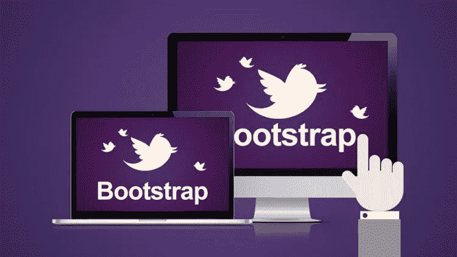

# 15+初学者最佳 Bootstrap 4 教程[2023 年 3 月]—在线学习 Bootstrap 4

> 原文：<https://medium.com/quick-code/top-tutorials-to-develop-responsive-websites-using-bootstrap-4-c934172f3ebd?source=collection_archive---------0----------------------->

## 用 2023 年最好的初学者引导教程学习 web 开发的引导。

**Bootstrap** 是世界上最流行的 HTML、CSS 和 JavaScript 移动就绪 web 开发框架。如果你想快速建立一个跨设备和浏览器的超级酷的网站，Bootstrap 是适合你的。简单易学，超级强大。除了 Bootstrap 3(Bootstrap 的稳定版本)之外，我们最近还包括了 Bootstrap 4 beta 的新项目。

# 1.[用 5 个项目从零开始自举 4 个](https://click.linksynergy.com/deeplink?id=Fh5UMknfYAU&mid=39197&u1=quickcode&murl=https%3A%2F%2Fwww.udemy.com%2Fbootstrap-4-from-scratch-with-5-projects%2F)

掌握最新版本的 Bootstrap (4.0.0 Beta)，在学习 HTML5 语义& CSS3 的同时构建 5 个真实世界的主题。

本课程将带你从对 Bootstrap 3 或 4 一无所知，到学习所有的实用程序、组件、小部件和网格，以及构建真实世界的主题和网站。在本课程中，您不需要了解 Bootstrap 3。即使您已经知道 Bootstrap 4，也可以跳过学习部分，直接进入第 6 部分，创建自定义工作流并开始项目。一切都完全模块化！

完成沙盒后，我们将安装初学者工具包，这也是我在本课程中创建的。这将给我们一个真正的开发工作流程，从源代码编译 Bootstrap 4 并编译 Sass。它甚至会给我们一个自动加载的开发服务器。这是我们将用于 5 个项目

我们将使用初学者工具包创建 5 个真实世界的主题，包括

1.  loop lap——一个社交 UI 主题
2.  mizuxe——书籍/产品展示主题
3.  blogen——博客管理区用户界面
4.  glozzom——一个多页面主题，带有一个旋转木马和一些第三方脚本
5.  portfoligrid——使用网格、flexbox 和折叠小部件的投资组合主题

## 2.[前端 Web UI 框架和工具:Bootstrap 4](https://coursera.pxf.io/c/1137078/1213622/14726?u=https%3A%2F%2Fwww.coursera.org%2Flearn%2Fbootstrap-4&subId1=BotTutorials)

本课程将向您概述客户端 web UI 框架，尤其是 Bootstrap 4。您将了解网格和响应式设计、引导 CSS 和 JavaScript 组件。

在本课程中，您将学习如何:

*   使用 Bootstrap 4 及其组件设置、设计和设计网页。
*   创建一个响应式网页设计。
*   利用网络工具建立和管理网站。

您将学习 Bootstrap 的基础知识，使用 Bootstrap 建立一个 web 项目。您将了解响应式设计和引导网格系统。

您将了解导航和导航栏。然后，您将了解按钮、表单、表格、卡片、图像和媒体、标签、提醒和进度条。

你将了解标签，药丸和标签导航，折叠，手风琴，scrollspy，词缀，工具提示，弹出，模态和旋转木马。

本课程将讨论 CSS 预处理器，Less 和 Sass。最后，您将讨论通过使用 NPM 脚本的任务自动化，以及 Grunt 和 Gulp 等任务运行器来构建和部署我们的 Web 项目。

# 3. [Bootstrap 4 布局:响应式单页设计](https://linkedin-learning.pxf.io/c/1137078/646189/8005?u=https%3A%2F%2Fwww.linkedin.com%2Flearning%2Fbootstrap-4-layouts-responsive-single-page-design&subId1=quickcode)

了解 Bootstrap 4 如何将您的标准 HTML 网站转变为富有灵感的单页设计。

该课程包括:

*   构建页眉和页脚
*   自举布局和组件
*   添加交互性
*   创建动画

本课程采用基于项目的方法来解释如何使用 Bootstrap 框架来操作网站布局。

在整个课程中，您将学习流行的布局模式，帮助您熟悉使用 Bootstrap 创建内聚布局的关键概念。

本课程处理引导布局类，并展示如何定制 CSS，解决布局挑战，如多网格和多列。

了解如何利用 Scrollspy 插件来跟踪导航，如何创建图像轮播，以及如何构建动画。

另外，本课程为你提供了一个现成的模板，你可以用它来开始新的项目。

# 4.[学习 Bootstrap 4 响应式 Web 开发](https://www.eduonix.com/learn-bootstrap-4-responsive-web-development/UHJvZHVjdC0zMjMyMDA=)

在本课程中，您将学习使用 Bootstrap 4 创建响应式网站和应用程序的基础知识。您将从学习 Bootstrap 的基础开始，然后进一步详细了解如何使用这个出色的框架实际创建网站。

在本课程中:

*   Bootstrap 4 简介，以及如何设置项目
*   了解网格系统
*   媒体对象介绍，包括嵌套媒体对象和媒体对象对齐
*   按钮介绍以及如何创建各种不同的按钮
*   深入了解各种很酷的引导功能，如大屏幕、标签、提醒等。
*   卡片介绍
*   导航的详细介绍
*   其他功能，如面包屑，分页，寻呼机，进度，列表组，工具提示，弹出窗口等。

# 5.[自举:入门](https://pluralsight.pxf.io/c/1137078/424552/7490?u=https%3A%2F%2Fwww.pluralsight.com%2Fcourses%2Fbootstrap-getting-started&subId1=quickcode)

Bootstrap 是最流行的 CSS 框架，用于创建响应迅速、移动优先的网站。本课程将教你如何使用 Bootstrap 框架创建一个真实网站的第一页。

该课程包括:

*   了解 Bootstrap
*   使用 Bootstrap 创建页面布局
*   使用引导添加样式
*   使用引导组件引入功能
*   创建启用引导的表单
*   让页面与支持 JavaScript 的组件交互

在本课程“Bootstrap 入门”中，您将学习以实际动手的方式使用 Bootstrap 框架。

首先，您将探索 Bootstrap 框架的关键部分，以便了解 Bootstrap 可以帮助您实现什么。

接下来，您将发现如何基于网格和其他引导类创建一个响应式布局。

最后，您将学习如何添加组件来增强用户在您的站点上的体验。

学完本课程后，你将具备构建现代移动网站所需的引导技能和知识。

## 6.[学习自举](https://www.pjatr.com/t/TUJGR0lLR0JHR0pMSUtCR0ZISk1N?sid=quickcode&url=https%3A%2F%2Fwww.codecademy.com%2Flearn%2Flearn-bootstrap)

您将看到 Bootstrap 如何使设计和创建交互式和响应性网站变得容易。

在本课程中，您将学习如何:

*   使用最流行的前端框架之一 Bootstrap 4 来快速布局和设计您的网站！

您将学习 Bootstrap 的网格系统来构建复杂的布局。然后，您将使用 Bootstrap 的实用程序类和组件来设计和填充您的站点。

有了 Bootstrap、HTML，再熟悉一些 CSS 和 JavaScript，你马上就能制作网站了。

# 7.[通过构建项目学习引导程序—包括引导程序 4](https://click.linksynergy.com/deeplink?id=Fh5UMknfYAU&mid=39197&u1=quickcode&murl=https%3A%2F%2Fwww.udemy.com%2Flearn-bootstrap-development-by-building-10-projects%2F)

使用 Bootstrap 3 和 Bootstrap 4 掌握响应式 Web 开发，同时构建真实的项目。

引导 3 个项目

照片应用销售网站:一个简单的项目让你开始。它将帮助你快速掌握基本的引导结构，你将很快建立并运行你的第一个引导网站。

使用 SASS 的投资组合简历——学习在下一个项目中使用 SASS 和 Bootstrap。在本课程中了解网格系统、列表样式和进度条组件。

社交网络模板——这将是一个相当复杂的项目，有多个引导组件。您将了解嵌套网格、按钮组、图库插件和响应媒体查询。

该项目开发了一个登陆页面使用较少。少的是一个 CSS 预处理程序。您还将学习大屏幕展示，向下滚动效果和字体真棒图标。

照片库—您将学习使用网格 UI 和选项卡小部件等组件创建照片库显示。您还将学习引导图像转盘和照片灯箱 Jquery 插件的使用。

CMS 管理模板—学习为内容管理系统构建管理模板。你将学习引导表类、图标、面包圈和按钮组的使用

虚拟主机公司网站——这个项目将教你 Bootswatch UI 工具、内容转盘、堆栈图标和时尚字体等引导组件。

电子商务模板——学习构建电子商务网站的前端。了解选项卡小部件、产品网格和自定义标题等组件。

商业引导主题——通过动画 css 学习在你的网站中使用动画。通过这个惊人的项目，你还可以学习如何优化你的移动网站。

博客网站——学习用下拉菜单、联系表单、轮播缩略图和网格视图等组件构建博客的前端。

# 8. [Bootstrap 4 初学者:编写一个响应式登录页面](https://click.linksynergy.com/deeplink?id=Fh5UMknfYAU&mid=39197&u1=quickcode&murl=https%3A%2F%2Fwww.udemy.com%2Fbootstrap-4-beginners-code-a-responsive-landing-page%2F)

了解如何使用 HTML 和 CSS 在 bootstrap 4 中从头开始编写一个完全响应的专业登录页面。

了解在新的 bootstrap 4 框架内构建功能全面的专业登录页面所需的基本概念、工具和功能。非常适合各种技能的学生，无论是初学者还是只想提高编码技能的学生。

通过这个全新的课程，编写一个专业的登录页面，并使用 HTML 和 CSS 在 Bootstrap 4 框架中建立一个强大的基础。

*   完全响应的登录页面
*   新的引导组件
*   对网格系统和媒体查询有扎实的理解
*   应用自定义字体
*   CSS 覆盖
*   使用字体很棒的图标
*   应用动画 CSS 和 WOW js

本课程将帮助您为自己的个人投资组合或业务创建一个完美的引导响应登录页面。理想情况下，你应该对 HTML 和 CSS 有一点了解，但是，这并不是必需的，因为我将指导你完成代码的每一步，以确保你对 bootstrap 框架和工具有正确的理解，以便在你完成课程后进一步学习。

## 9.[2021 年用 Bootstrap 开发 WordPress 主题](https://click.linksynergy.com/deeplink?id=Fh5UMknfYAU&mid=39197&u1=quickcode&murl=https%3A%2F%2Fwww.udemy.com%2Fcourse%2Fbootstrap-to-wordpress%2F)

学习如何在 2021 年为初学者设计和建立定制的、漂亮的、有反应的 WordPress 网站和主题。

在本课程中，您将学习如何:

*   作为一个临时的自由职业者，或者全职在家工作的自由职业者，获得开始赚钱的技能。
*   用 Bootstrap 轻松创建一个漂亮的 HTML & CSS 网站(这看起来不像普通的 Bootstrap 网站！).
*   将任何静态的 HTML & CSS 网站转换成自定义的 WordPress 主题。
*   对利用 PHP 创建 WordPress 网站和主题有透彻的理解。
*   对将静态网站转变为动态 WordPress 网站的过程感到舒适。
*   在 WordPress 中使用自定义文章类型和高级自定义字段。
*   允许您的客户通过创建用户帐户自行更新他们的网站。

在这个 WordPress 初学者课程中，你将从一个初学者转变为一个非常有价值的网页设计者和开发者，能够创建漂亮的、定制的和响应迅速的网站、主题和模板。

了解如何用有效、语义和漂亮的 HTML5 和 CSS3 手工制作一个令人惊叹的网站。

# 10.[包含 21 页的主引导程序 4 和代码 6 项目](https://click.linksynergy.com/deeplink?id=Fh5UMknfYAU&mid=39197&u1=quickcode&murl=https%3A%2F%2Fwww.udemy.com%2Fbootstrap-4-responsive-web-design-and-development%2F)

了解所有关于 Bootstrap 4 的 70 个编码练习、5 个测验和一个包含 100 多个源文件的免费学习工具包。

本课程涵盖了 Bootstrap 4 的以下所有方面:

*   如何使用断点、Bootstrap 强大的网格系统等创建流畅且响应迅速的布局
*   如何组织各种内容，包括排版、图像、图表、表格和代码块
*   如何构建所有 21 个组件，包括按钮、卡片、转盘、下拉菜单、表单、模态和导航
*   如何使用所有 15 个工具，包括改变颜色，大小，间距和排版的简单方法
*   如何用 Bootstrap 4 建立 14 个反应灵敏的现代通用网页模板
*   如何使用 Bootstrap 4 的高级功能:定制样式、添加图标、使用谷歌字体等等
*   如何建立一个完整的和定制的登陆页面
*   如何建立一个在线论坛
*   如何建立一个博客
*   如何建立知识库
*   如何建立简历和简历页面
*   如何建立一个小型商业网站

除了学习 Bootstrap 4 的不同部分之外，您还将详细了解如何构建不同的响应式现代通用网页模板，包括照片库、视频库、混合库、音频库、登录、联系人、页脚、网站地图、快捷方式、常见问题、感谢、员工、定价表和创建帐户。

您还将了解如何使用 web 字体、图标和 JavaScript 功能以及在线论坛创建自己的完整定制登录页面。

本课程涵盖了世界上最流行的前端框架 Bootstrap 4 的最新版本的所有重要方面。Bootstrap 已经被世界上成千上万的人使用，并被精心开发以覆盖广泛的典型用户界面。使用 Bootstrap 4 构建的网页适用于各种设备、浏览器和屏幕尺寸，同时还兼顾了可访问性和简洁现代的设计。

本课程是为想从底层开始学习 Bootstrap 4 的初学者设计的。它会经过所有不同的部分，但每个讲座都可以独立观看。最后，您将学习如何制作通用网页模板，以及如何使用 Bootstrap 4 的更多高级功能。

# 11. [Bootstrap 4 速成班:网站建设入门](https://click.linksynergy.com/deeplink?id=Fh5UMknfYAU&mid=39197&u1=quickcode&murl=https%3A%2F%2Fwww.udemy.com%2Fbootstrap-4-crash-course-introduction-to-building-websites%2F)

发现新的 Bootstrap 4 测试版的可能性—从头开始创建和开发一个响应性网站。

这个课程总共结合了 *10 个创意组成部分*——每一个都是从零开始构建的，而我展示的是构建哪怕是最小的细节背后的完整过程。这是我们将在整个速成课程中构建的所有组件的列表。

让我向您介绍我们将在整个课程中构建的 *10 个组件*:

1.  导航条 *:* 一个完整的导航条，从头开始构建，适用于所有的屏幕尺寸，看起来光滑而现代。
2.  下拉菜单:每当我们点击父列表项目/链接时，工作下拉菜单显示更多的选项。
3.  大屏幕 *:* 显示重要信息的英雄区在 Bootstrap 4 中被称为大屏幕。我们将在我们的课程中使用一个。
4.  卡和徽章*:*Bootstrap 4 卡有多种不同的样式，以简洁的方式显示信息，旁边的徽章显示特定跨度的重要信息。
5.  *滑块/传送带:*灵敏、现代、干净的滑块是当今的必需品。由于 Bootstrap 4 的出色，您可以立即了解如何构建一个。
6.  *进度条:*进度条是以视觉上吸引人的方式显示指标的一种很酷的方式。使用 div 和自定义数据属性，创建丰富多彩和有趣的进度条从未如此简单。
7.  模态和按钮:模态是显示附加内容的现代方式，不会干扰最初的设计。
8.  表单:表单总是网站最重要的部分，因为它允许人们联系你。不要错过 Bootstrap 4 超赞响应表单的设计。

# 12.[网站从零开始使用 Bootstrap 4](https://click.linksynergy.com/deeplink?id=Fh5UMknfYAU&mid=39197&u1=quickcode&murl=https%3A%2F%2Fwww.udemy.com%2Fcourse-bootstrap-4%2F)

应用 Bootstrap 4 class 从零开始建立一个现代化的网站。

从空白网页开始使用 Bootstrap 进行快速 web 开发。本课程将向你展示如何利用这个空白文件创建一个网站。最重要的是，一旦你熟悉了 Bootstrap，你就可以在一个小时内创建像本课程中那样的网站！源代码包括在内，所以你也可以跟随课程内容，并在课程完成后创建一个网站。

本课程涵盖

*   引导 4 网格
*   构建一个响应式导航条
*   如何使用自举 4 卡
*   （电视机的）超大屏幕
*   更多

# 13.[初学者的 Bootstrap 4——从头开始建立 5 个网站](https://click.linksynergy.com/deeplink?id=Fh5UMknfYAU&mid=39197&u1=quickcode&murl=https%3A%2F%2Fwww.udemy.com%2Fbootstrap4-course%2F)

探索 Bootstrap 4，了解如何应用布局、使用组件和实用工具来快速设计和开发网站。

了解 Bootstrap Grid 以及使其更易于使用的新变化。了解如何使用 Bootstrap 4 导航条使其响应迅速。在表格、列表和卡片中组织内容。使用令人惊叹的 Bootstrap 4 工具让文本脱颖而出。

本课程将向你展示如何用引导类来构建网站。了解并观看运行中的引导组件和实用程序！完成本课程后，您将掌握在自己的项目中使用它的知识。课程包括源代码、代码片段和练习，帮助您快速学习 Bootstrap。节省时间，不需要使用 CSS 或 JavaScript，使用 Bootstrap 类带来所有惊人的功能。

Bootstrap 充满了 web 设计和开发中常用的特性。使用 Bootstrap，您可以获得大量漂亮的通用 HTML 元素文档、许多定制的 HTML 和 CSS 组件以及令人惊叹的 jQuery 插件。一个框架，每个设备。Bootstrap 使用单一代码库轻松高效地扩展您的网站和应用程序，从手机到平板电脑再到带有 CSS 媒体查询的桌面。

Bootstrap 拥有快速开发网站所需的一切，不需要设计风格或编码，一切都是预先构建好的，可以在 bootstrap 库中使用。利用 bootstrap 所提供的功能 bootstrap 是一个令人惊叹的前端框架，它通过 HTML 页面 HTML 和网站元素中的类和属性直接整合了样式和功能。建立网站从未如此简单，bootstrap 让这一切成为可能。

了解 Bootstrap 4 了解新功能以及如何将 Bootstrap 应用到您的 web 项目中。

*   了解如何添加引导到您的网站
*   包括资源和顶部链接
*   探索容器如何工作
*   添加类使事情发生
*   媒体大小和断点
*   了解什么是引导网格以及它是如何工作的
*   列和行以及如何组织内容
*   使用排版来突出内容
*   列出群组和更多群组内容
*   自定义组件，如大屏幕和徽章
*   用按钮做惊人的事情
*   进度条，警告
*   自定义颜色和字体
*   了解引导表
*   引导卡是新的，看看它们是如何工作的
*   了解 Bootstrap 如何增强表单
*   元素的下拉列表和分组
*   查看响应的导航栏和导航项目
*   探索交互式引导组件，如工具桌面和弹出窗口
*   看看模态如何增强你的用户体验
*   动态 jQuery 组件就像旋转木马，等等
*   包括源代码和示例

# 14.[创建网站自举 4 快速网站开发](https://click.linksynergy.com/deeplink?id=Fh5UMknfYAU&mid=39197&u1=quickcode&murl=https%3A%2F%2Fwww.udemy.com%2Fwebsite-bootstrap-4%2F)

使用 Bootstrap 4 Beta 快速开发和设计网站。

使用 Bootstrap 4，您可以通过应用 Bootstrap 类来快速轻松地构建网站。你想学习如何建立网站吗？Bootstrap 使它变得简单，本课程将向您展示如何操作。

Bootstrap 是一个用于设计网站和 web 应用程序的开源前端 web 框架。了解为什么 Bootstrap 是当今在线使用的最流行的前端框架。Bootstrap 让你快速创建惊人的完全响应的网站。Bootstrap 4 更好，控制更多。Bootstrap 适用于任何地方的任何人。Bootstrap 使前端 web 开发更快更容易。

*   查看运行中的引导网格
*   探索构建完全响应的导航栏
*   使用卡片帮助组织内容
*   添加引导按钮
*   高清质量视频
*   拥有超过 18 年真实世界经验的讲师
*   顶级链接和资源
*   包含源代码
*   使用 jQuery 动画制作滚动效果的附加内容

# 15. [Bootstrap 4 —创建 4 个真实世界项目(最新— 4.1.1)](https://www.eduonix.com/bootstrap-4-create-4-real-world-projects-latest-4-1-1/UHJvZHVjdC0zMjMyMDA=)

本课程由几个部分组成，它将从引导基础开始，如印刷术和实用工具。然后，它将能够学习如何使用 bootstrap 网格系统在页面上对齐元素，此外，由于这一点，bootstrap 4 使用 CSS Flexbox，它也将涵盖这一主题。

之后，开始课程的主要和最有趣的部分。它将开始构建项目，在这些项目中，您将能够学习 bootstrap 的其余主题，如 bootstrap 组件等等。我们的第一个项目将使用纯 bootstrap 构建，不使用任何 CSS 或 jQuery 代码。

第二个项目将是管理仪表板，其中我们将使用大量的引导，也有一些 CSS 和 jQuery 的一点点。因此，在本节中，您将能够学习如何为管理员创建现代且设计良好的仪表板。

下一个项目将是 photoX，这将是一个类似摄影公司的网站。这个项目由多个部分组成，在这些部分中，您将会遇到使用 bootstrap、CSS 和 jQuery 构建的更高级、更复杂的东西。

# 16.[通过设计单页网站从零开始的 Bootstrap 4](https://click.linksynergy.com/deeplink?id=Fh5UMknfYAU&mid=39197&u1=quickcode&murl=https%3A%2F%2Fwww.udemy.com%2Fcreate-single-page-website-using-twitter-bootstrap%2F)——【免费课程】

为那些想在 2 小时内使用 Twitter Bootstrap 4 制作单页网站的人提供速成课程。

在这个速成课程中，我们将学习如何使用 Twitter bootstrap 4 建立一个响应迅速的单页网站。本课程最初是使用 Bootstrap 3.x 完成的，但现在已更新到 Bootstrap 4.0。除了 Twitter bootstrap，我还会教你如何使用 Google Web 字体和一些有趣的 CSS3 特性。

到本教程结束时，你不仅会有一个响应的单页网站，而且还有一个模板，你可以重新设计和转售给你的潜在客户。还有，你会知道有多少设计师和开发者使用 Twitter bootstrap 做快速开发。

> 感谢您阅读本文。我们策划了更多主题的顶级教程，您可能想看看:

 [## 10+最佳 UX 初学者设计课程——在线学习 UX 设计

### 学习 UX 设计，在 2021 年为初学者提供最佳 UX 设计教程，创造惊人的用户体验。

medium.com](/quick-code/top-online-courses-to-learn-ux-design-efdd9a18689e)  [## 10+最佳初学者素描教程——在线学习素描

### 学习素描矢量图形编辑与 2021 年初学者的最佳素描教程

medium.com](/quick-code/top-tutorials-to-learn-sketch-for-ui-and-ux-design-ddb0cd7e8a9b)  [## 初学者的 15 个最佳 Web 开发教程——在线学习 Web 开发

### 用 2021 年最好的新手网页开发教程学习网页开发

medium.com](/quick-code/top-tutorials-to-learn-web-development-for-beginners-4023595ebaa0) 

披露:我们与本文中提到的一些资源有关联。如果你通过本页的链接购买课程，我们可能会得到一小笔佣金。谢谢你。