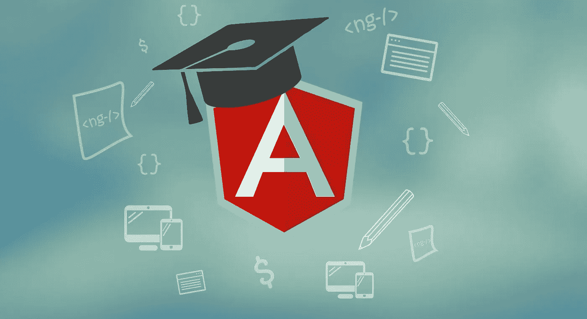
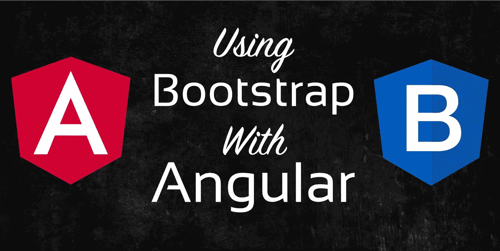

# 10+初学者最佳 Angular JS 教程[2023 年 3 月]—在线学习 Angular

> 原文：<https://medium.com/quick-code/top-tutorials-to-learn-angular-js-for-beginners-2f401566d5f1?source=collection_archive---------3----------------------->

## 用 2023 年的初学者最佳 Angular 教程学习 Angular 构建客户端应用。

Angular 是用 HTML、CSS 和 TypeScript 构建客户端应用程序的最流行的框架之一。如果你想成为一名前端或全栈开发者**，**你需要学习 Angular。Angular 是迄今为止你能学到的最现代、最高效、最强大的前端框架之一。它允许你构建伟大的网络应用程序，提供令人敬畏的用户体验！

# 1.[完整角度教程:初级到高级](https://click.linksynergy.com/deeplink?id=Fh5UMknfYAU&mid=39197&u1=quickcode&murl=https%3A%2F%2Fwww.udemy.com%2Fthe-complete-angular-master-class%2F)

最全面的 Angular 4 (Angular 2+)课程。用 Angular，Firebase 和 Bootstrap 4 构建一个真正的电子商务应用程序

*   用 Angular 自行构建真正的客户端应用
*   常见编译时和运行时错误疑难解答
*   像专业人士一样编写干净且可维护的代码
*   构建 Angular 应用程序时应用最佳实践

从一开始，你就可以在几分钟内创建你的第一个 Angular 应用。

在 8 个小时内，您将学习使用 Angular 构建客户端应用程序的要点:

*   显示数据和处理事件
*   构建可重用组件
*   使用指令操作 DOM
*   使用管道格式化数据
*   构建模板驱动和反应式表单
*   消费 HTTP 服务
*   正确处理 HTTP 错误
*   使用反应式延伸和可观察值
*   添加路线和导航
*   使用 JSON Web 令牌实现身份验证和授权(JWT)
*   将您的应用部署到 GitHub Pages、Firebase 和 Heroku

您将了解更多高级主题，如使用 Firebase 构建实时、无服务器应用程序，使用角度动画制作 DOM 元素动画，使用角度材料构建漂亮的 ui，实现 Redux 架构，编写单元和集成测试。

课程结束时，您将使用 Angular 4、Firebase 4 和 Bootstrap 4 构建和部署一个实时电子商务应用程序。这个应用程序展示了许多现实应用程序中常见的模式，如主/细节、CRUD 操作、带有自定义验证的表单、搜索、排序和分页、身份验证和授权。

## 2.[带 AngularJS 的单页面 Web 应用](https://coursera.pxf.io/c/1137078/1213622/14726?u=https%3A%2F%2Fwww.coursera.org%2Flearn%2Fsingle-page-web-apps-with-angularjs&subId1=BotTutorials)

了解 angular js 1 . x(angular js 1 最新版本)的核心设计、组件和代码组织技术。

在本课程中，您将学习如何:

*   通过利用依赖注入来重用现有服务以及编写自己的服务，增强 web 应用程序的功能。
*   创建可重用的 HTML 组件，利用 AngularJS 数据绑定，并使用 AngularJS 的一个非常强大的功能(称为指令)扩展 HTML 语法。
*   设置路线，以便我们的 SPA 可以有多个视图。
*   对你的功能进行单元测试。
*   使用 AngularJS 构建一个功能齐全、组织良好且经过测试的 web 应用程序，并将其部署到云上。

你将会学到这门课如何评分，以及如何找到你将会在整个课程中看到的所有源代码。

然后，您将深入了解 Mac 和 Windows 的开发环境设置。

了解如何使用角度过滤器将我们的数据处理成我们想要的格式，并了解如何创建我们自己的自定义过滤器。

然后，您将深入了解 digest 循环，这是 AngularJS 使用 ViewModel 或控制器中的绑定数据神奇地更新我们的网页的过程。

之后，您将学习 Javascript 编程语言中最基本的概念之一，即原型继承。

了解如何创建自己的自定义角度服务以及如何配置它们。通过定制角度服务，您将能够在我们应用程序中的不同控制器或其他组件之间共享数据。

您将了解 Promise API。对于理解使用 Javascript 的现代 web 开发来说，这确实是一个重要的话题。您还将了解如何通过名为 HTTP 服务的内置 Angular 服务调用服务器。

您将深入研究 AngularJS 组件 API。然后，您将了解 AngularJS 事件系统，以及如何将我们的应用程序拆分成更小的模块，然后将这些模块粘合在一起，生成我们的最终应用程序。

最后，您将学习如何用 Angular 来验证表单。然后，您将深入单元测试我们的 AngularJS 代码。

您将了解如何为每种类型的主要角度工件设置测试:控制器、服务、指令和组件，以及如何测试通过 HTTP 服务访问网络的服务。

# 3.[角度基础训练](https://linkedin-learning.pxf.io/c/1137078/646189/8005?u=https%3A%2F%2Fwww.linkedin.com%2Flearning%2Fangular-essential-training-2&subId1=quickcode)

在本课程中，将向您介绍该平台的基本要素，包括双向数据绑定、综合路由和依赖注入等强大功能。

在本课程中，您将学习:

*   双向数据绑定、全面路由和依赖注入等强大功能。
*   什么是 Angular，它能做什么。

本课程一步一步地介绍平台的一个特性，重点是 Angular 的基于组件的体系结构。了解 Angular 是什么以及它能做什么，因为 Justin 从头到尾构建了一个全功能的 web 应用程序。

掌握了基础知识后，你可以学习我们图书馆中其他基于项目的课程，并创建自己的 Angular 应用程序。

# 4.[从零开始学习用 Angular 5 构建真实世界的应用](https://www.eduonix.com/build-a-complete-cms-app-using-angular-5/UHJvZHVjdC0zMjMyMDA=)

在本 Angular 5 教程中，您将了解 Angular 文档、框架概念、材质设计、Firebase、Angular CLI、材质图标等等。

课程将从浏览 Angular 5 文档开始，涵盖框架的不同重要概念以及其他相关技术，如材料设计、Firebase、Angular CLI、材料图标等。与讲师一起，您将实际使用 Firebase 构建一个完整的 Angular 5 应用程序，该应用程序结合了 Angular 材质设计和 Google CloudFireStore。

在本课程中，您将了解:

*   Angular 5 及其文档简介。
*   检查重要的命令，如组件、指令、管道、服务、类、防护、接口、枚举等..
*   浏览 Angular 5 文档，包括表格、验证、路线和导航等..
*   AngularFire 工具组件。
*   CloudFireStore 包括如何在 CloudFireStore 中添加、编辑、修改和删除集合。
*   Visual Studio 代码编辑器。
*   角度 CLI。
*   材料设计和材料图标。
*   集成授权指示和授权。
*   带卡片的技术博客网站示例。

# 5.[棱角分明:入门](https://pluralsight.pxf.io/KEqoe)

在本课程中，您将通过快速了解 Angular 的组件、模板和服务，学习如何创建出色的 web 应用程序，并了解最新的应用程序开发技术。

您将通过学习主要主题(如设置您的环境、了解组件、模板和数据绑定以及它们如何协同工作)、了解如何使用强类型代码构建干净的组件、构建嵌套组件以及如何使用依赖注入来注入您构建的服务，以及如何使用 HTTP、导航和路由来检索数据来实现这一目标。

本课程结束时，你将掌握所有最新的 Angular 知识，并能够在未来使用 Angular 创建出色的应用程序。

## 6.[学弯角](https://www.pjatr.com/t/TUJGR0lLR0JHR0pMSUtCR0ZISk1N?sid=quickcode&url=https%3A%2F%2Fwww.codecademy.com%2Flearn%2Flearn-angularjs)

AngularJS 是一个功能齐全的框架，在开发人员中非常受欢迎。对于单页应用程序，AngularJS 框架为实时体验创建了丰富的交互功能。

在本课程中，您将学习如何:

*   从头开始构建 AngularJS 应用程序，快速启动并运行。
*   使用指令制作独立的 UI 组件。
*   使用服务与服务器通信。
*   添加路线以构建强大的单页应用程序。

您将学习应用您对 HTML 和 JavaScript 的理解，学习如何使用这个流行的 JavaScript 框架构建单页面 web 应用程序。

本课程结束时，您将了解模型-视图-控制器(MVC)编程模式，并有机会从头开始构建自己的应用程序。

# 7.[忙碌开发者的角度速成班](https://click.linksynergy.com/deeplink?id=Fh5UMknfYAU&mid=39197&u1=quickcode&murl=https%3A%2F%2Fwww.udemy.com%2Fangular-crash-course%2F)

你可能听说过，如今有棱角的开发人员很吃香。而你在这里学角快。如果您学习 Angular 4 (Angular 2+)的时间有限，请参加本课程，在 10 个小时内学习 Angular。

在本课程中，您将学习:

*   类型脚本和面向对象编程的基础
*   显示数据和处理事件
*   构建可重用组件
*   使用指令操作 DOM
*   使用管道格式化数据
*   构建模板驱动和反应式表单
*   消费 HTTP 服务
*   正确处理 HTTP 错误
*   使用反应式延伸和可观察值
*   添加路线和导航

# 8.[棱角分明从前到后](https://click.linksynergy.com/deeplink?id=Fh5UMknfYAU&mid=39197&u1=quickcode&murl=https%3A%2F%2Fwww.udemy.com%2Fangular-4-front-to-back%2F)

掌握 Angular 5，从基础到使用 Firebase 集成构建高级应用程序。

本课程涵盖以下概念:

*   使用 Angular 5+构建惊人的单页应用程序
*   掌握角度概念
*   了解 Angular 应用程序的文件和文件夹结构
*   使用身份验证和 Firebase 的 Firestore 构建一个客户端管理应用程序
*   将 Bootstrap 4 集成到角度项目中

您将从零开始，学习如何为 Angular 5+创建开发环境，设置 Angular CLI 并学习所有基础知识。一旦您深入学习了核心基础知识，您将从一个基本项目开始，然后转移到一个更高级的客户端管理系统，该系统使用 Firebase 平台进行身份验证和数据存储。任何水平的开发人员都可以从本课程中受益。

# 9. [Angular 7(原 Angular 2) —完整指南](https://www.udemy.com/the-complete-guide-to-angular-2/?ranMID=39197&ranEAID=Fh5UMknfYAU&ranSiteID=Fh5UMknfYAU-Cw5uGzH_eIbMzW2SKJ3B.Q&LSNPUBID=Fh5UMknfYAU)

掌握 Angular (Angular 2+，包括 Angular 5)并使用 Angular.js 的继任者构建令人惊叹的反应式 web 应用程序。

参加本课程，学习如何使用 Angular 7 开发现代、复杂、响应迅速且可扩展的 web 应用程序。完全理解 Angular 7 应用程序背后的架构以及如何使用它。利用他们对 Angular 7 基础知识的深刻理解，迅速成为前端开发人员。使用最现代的 JavaScript 框架创建单页面应用程序。

本课程将教你所有关于模块、指令、组件、数据绑定、路由、HTTP 访问等的基础知识。你将进行大量的深度潜水，每一部分都有一个真实的项目支持。所有例子都展示了 Angular 提供的功能以及如何正确应用它们。

具体来说，您将了解到:

*   Angular 使用哪种架构
*   如何使用 TypeScript 编写角度应用程序
*   所有关于指令和组件的内容，包括自定义指令/组件的创建
*   数据绑定如何工作
*   所有关于路由和处理导航
*   什么是管道以及如何使用管道
*   如何访问网络(例如 RESTful 服务器)
*   什么是依赖注入以及如何使用它
*   如何在 Angular 中使用模块
*   如何优化你的(更大的)角度应用
*   在本课程中，我们将建立一个主要项目

# 10.[角形(全 App)带角形材料，角形火焰& NgRx](https://www.eduonix.com/angular-full-app-with-angular-material-angularfire-ngrx/UHJvZHVjdC0zMjMyMDA=)

使用 Angular、Angular Material、Angularfire(带 Firestore 的+ Firebase)和 NgRx 来构建一个真正的 Angular App

在本课程中，您将学习:

*   简要回顾一下 Angular，以防你忘记了它是如何工作的(或者从来没有学过)
*   角材料的详细介绍，它的文件和它的用途
*   一个现实的应用程序，使用许多有角度的材料组件
*   日期选择器、Sidenavs 或材料数据表等组件的示例(包括排序、过滤和实时更新！)
*   由 Firebase(使用 Firestore)和 Angularfire 支持的实时数据库连接
*   更好地理解 RxJS 可观测量
*   借助 NgRx 实现最先进的状态管理

在本课程中，你将构建一个完整的、真实的应用程序，它看起来绝对漂亮，使用谷歌的材料设计。使用 Firebase 和 Angularfire，您将添加实时数据库功能，并且几乎在进行更新之前就能看到更新。

# 11.[均值堆栈教程——用 Angular 4 & Nodejs](https://www.eduonix.com/angular-2-and-nodejs-the-mean-stack-guide/UHJvZHVjdC0zMjMyMDA=) 构建真实 App

通过 mean stack 指南了解如何构建 angular 前端和 nodejs 后端框架。利用 Mean Stack 教程注册并提升您的职业生涯。

在本课程中，您将学习:

*   借助 Angular CLI 设置一个 NodeJS + Express + MongoDB + Angular 应用程序。
*   高效使用 NodeJS 和 Express。
*   在 Angular 中构建可重用的组件，并使用 Angular 提供的工具创建反应式用户体验。
*   连接你的 NodeJS(或者任何其他语言！)通过 Angular HttpClient 服务与您的 Angular App 进行后端。
*   在您的后端提供适当的端点，供您的前端使用。
*   添加文件上传和分页等高级功能。
*   通过实现用户、身份验证和授权，使您的应用程序更加安全。
*   优雅地处理错误

# 12.[角度基本原理](https://pluralsight.pxf.io/LExz0)

本课程将教你使用最新版本 Angular 的基本原理。您将了解创建完整应用程序所需的一切，包括:组件、服务、指令、管道、路由、HTTP，甚至测试。

您将学习如何引导应用程序，以及如何使用角度组件和新的角度语法构建页面和可重用元素。您还将学习以下基础知识:路由、创建可重用服务和依赖注入、构建带验证的表单，以及使用 HTTP 和 observables 与服务器通信。

# 13.[棱角分明:材质设计](https://linkedin-learning.pxf.io/c/1137078/646189/8005?u=https%3A%2F%2Fwww.linkedin.com%2Flearning%2Fangular-material-design-2&subId1=quickcode)

在这个基于项目的课程中，学习如何开始使用角形材料。

在本课程中，您将学习:

*   关于材料设计及其核心概念。
*   如何安装角材？
*   如何使用布局、组件和主题化功能给项目带来用户体验的彻底改变。

本课程通过介绍材料设计背后的核心概念以及如何安装角形材料来帮助您熟悉材料设计。

它还展示了如何使用布局、组件和主题化功能来全面改善项目的用户体验。

> 感谢您阅读本文。我们策划了更多主题的顶级教程，您可能想看看:

 [## 面向初学者的 10+最佳 TypeScript 教程—在线学习 TypeScript

### 用 2021 年最适合初学者的 TypeScript 教程学习应用程序开发的 TypeScript

medium.com](/quick-code/top-tutorials-to-learn-typescript-c08834892e69)  [## 10+最佳新手萨斯教程——在线学习萨斯和 SCSS

### 学习萨斯和 SCSS，在 2021 年为初学者创建最好的萨斯教程的专业网站

medium.com](/quick-code/top-tutorials-to-learn-sass-and-scss-33e4dcd63e9b)  [## 10+最佳离子入门教程——在线学习离子

### 学习 Ionic，在 2021 年使用一个代码库为初学者提供最好的 Ionic 教程，构建混合的跨平台移动应用程序

medium.com](/quick-code/top-tutorials-to-learn-ionic-for-hybrid-mobile-apps-development-e9d53d54420c) 

披露:我们与本文中提到的一些资源有关联。如果你通过本页的链接购买课程，我们可能会得到一小笔佣金。谢谢你。