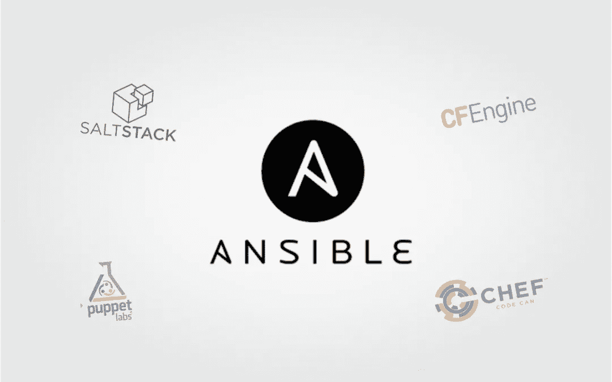

# 10+最佳 Ansible 初学者教程[2023 年 3 月]——在线学习 Ansible

> 原文：<https://medium.com/quick-code/top-tutorials-to-learn-ansible-33afd23ea160?source=collection_archive---------1----------------------->

## 用 2023 年最好的 Ansible 初学者教程学习 Ansible 进行 IT 自动化开发

Ansible 是一个非常简单的 IT 自动化平台，使您的应用程序和系统更容易部署。避免编写脚本或自定义代码来部署和更新您的应用程序——使用一种接近简单英语的语言，使用 SSH 来实现自动化，无需在远程系统上安装代理。

# 1.[掌握 Ansible](https://click.linksynergy.com/deeplink?id=Fh5UMknfYAU&mid=39197&u1=quickcode&murl=https%3A%2F%2Fwww.udemy.com%2Fmastering-ansible%2F)

Ansible 配置管理和编排完整指南。掌握 Ansible 是学习 Ansible 进行配置管理和编排的一步一步的旅程。

本课程将讲述如何使用 Ansible 对服务器执行临时命令，编写 Ansible 配置行动手册以部署 3 层 web 应用程序，使用任务、处理程序、文件、模板和默认变量配置 Ansible 角色，编写操作行动手册以检查集群状态并执行集群重启，优化 Ansible 行动手册以减少行动手册执行时间，以及测试和排除 Ansible 行动手册执行故障。

本课程旨在从头开始配置一个现实的应用程序堆栈。在我们构建和重构应用程序时，主题会根据应用程序日益增长的复杂性进行排序，而不是一页一页地浏览 Ansible 文档。

我们的目标是建立一个工作流，其中所有的配置和故障排除都通过可翻译的行动手册来完成，这些行动手册可以提交给存储库，并随着时间的推移得到改进。

本课程使用 Ansible 版本 1.9.3 构建，适用于在 Ubuntu Linux 服务器上利用 NGINX、Apache2、Python 和 MySQL 的三层 web 应用环境。在本课程中，我们不介绍 Windows 服务器的管理。

本课程旨在介绍 Ansible，同时也是对配置管理、流程编排、基础设施即代码和 devops 原则感兴趣的工程师的指南。

# 2.[可行的基本训练](https://linkedin-learning.pxf.io/c/1137078/646189/8005?u=https%3A%2F%2Fwww.linkedin.com%2Flearning%2Fansible-essential-training&subId1=quickcode)

本课程涵盖了大规模使用该工具的中级到高级用例。

本课程教授:

*   任务执行管理
*   循环任务
*   在模板中循环
*   重用带有角色的代码
*   加密数据
*   网络管理
*   创造幂等戏剧
*   系统基础设施管理

在本课程中，您将学习如何使用角色重用 Ansible 功能，使用 Ansible Vault 加密机密数据，支持幂等性，以及使用 Ansible Tower 管理多组系统。

本课程解释了如何将这些概念串在一起，以最有效的方式使用 Ansible:将资源变量化，将想法捕获到角色中，并将 Ansible 从简单的服务器管理扩展到网络管理。

# 3.[从头开始学习 ansi ble:devo PS 指南](https://www.eduonix.com/learn-ansible-from-ground-up-the-devops-guide/UHJvZHVjdC0zMjMyMDA=)

了解如何开始使用 Ansible 软件，这是一款用于创建服务器的流行 IT 自动化软件。掌握 Ansible &成为自动化向导。

本课程是一个循序渐进的教程，帮助您学习配置和管理您的 IT 系统和服务器。本课程将带您开始一段旅程，您不需要了解 Ansible 或任何其他配置和自动化工具。

本课程旨在帮助您确切了解自动化工具如何简化您的生活和工作，同时实际操作最流行的自动化工具之一 Ansible。

该课程包括理论和实践知识的平衡结合，帮助学生实际操作他们的软件，而不是简单地学习理论。除此之外，本课程还包含了大量的例子，以帮助直观地模拟学习者。

在本课程中，您将学到:

*   自动化工具的详细介绍，包括 Ansible，Puppet，Chef 等的区别。
*   设置并配置 Ansible 环境
*   Ansible 基础和基本概念
*   如何使用 Ansible 的基本命令
*   如何在您的服务器上设置和部署 Ansible

# 4.[以正确的方式自动化网络](https://pluralsight.pxf.io/c/1137078/424552/7490?u=https%3A%2F%2Fwww.pluralsight.com%2Fcourses%2Fautomating-networks-ansible-right-way&subId1=quickcode)

了解如何使用 Ansible 及其设计模式更智能地管理您的网络。

在本课程中，您将:

*   通过编程学习像
    专业人员一样管理网络所需的基础知识。
*   了解作为代码的基础设施，它在技术层面如何工作，以及在业务层面的重要性。
*   了解几个基于 SSH/CLI 的实现，它们可以在任何网络设备上工作。
*   了解现代 API，如 NETCONF 和 RESTCONF，以及 Ansible 如何利用这些技术来简化网络管理。
*   探索如何通过使用各种辅助工具将质量构建到您的代码中，将项目转化为生产就绪。

本课程结束时，您将具备在生产环境中设计、实施、操作和排除基于网络的自动化解决方案故障所需的技能和知识。

# 5.[负责网络工程师:快速入门 GNS3 &负责](https://click.linksynergy.com/deeplink?id=Fh5UMknfYAU&mid=39197&u1=quickcode&murl=https%3A%2F%2Fwww.udemy.com%2Fansible-for-network-engineers-cisco-quick-start-gns3-ansible%2F)

在本课程中，学习 Ansible for Network Engineers with GNS 3、ansi ble 和 Cisco IOS。学习网络自动化和可编程性，使用 Ansible 自动化网络配置，使用 Ansible 排除网络故障，学习如何利用 DevOps (Ansible)的强大功能

本课程是为网络工程师开设的。本课程将向您展示如何使用 GNS3、Cisco IOS 和 Ansible 快速轻松地开始网络编程。

您将在 GNS3 中看到 Cisco 路由器和交换机的配置演示。例如，如何在多台交换机上配置多个 VLANs，或者如何在路由器上配置 OSPF 等等。

了解如何使用 Ansible 排除网络故障。使用一个 Ansible 命令在几秒钟内从多台交换机检索 mac 地址表信息。然后将输出通过管道传输到一个正则表达式，过滤到一个 MAC 地址。您再也不会以同样的方式排除网络故障了！

本课程将向您展示使用 Ansible 以编程方式配置思科网络设备的实际例子，而不仅仅是说说而已。

了解如何使用以下工具实现网络自动化:

*   嘘
*   可转换的网络模块
*   翻译剧本
*   可行的特别命令

# 6. [Ansible 高级](https://click.linksynergy.com/deeplink?id=Fh5UMknfYAU&mid=39197&u1=quickcode&murl=https%3A%2F%2Fwww.udemy.com%2Flearn-ansible-advanced%2F)

学习和练习 Ansible 中的高级主题，包括角色、Jinja2、查找、过滤器。学习开发定制模块。

在本课程中，学习:

*   为高级用例开发可翻译的行动手册
*   使用策略了解 Ansible 的执行流程
*   学习如何处理剧本执行过程中的错误-
*   了解如何使用查找从外部来源检索数据。
*   使用 Ansible Vault 保护关键信息
*   理解并使用 Jinja2 开发模板
*   开发定制模块、过滤器和插件
*   开发和重用自定义角色
*   在剧本开发过程中遵循可行的最佳实践
*   使用 Ansible Galaxy 与 Ansible 社区共享工作
*   在行动手册中使用动态库存
*   获得开发行动手册的良好实践经验

本课程将重点介绍 Ansible 中的高级概念和一些现实生活中的用例。本课程介绍了高级主题，如角色、jinja2 模板、查找、错误处理、保险库等。本课程还讨论了策略、过滤器和插件，以及如何自己开发定制的。本课程是为那些对 Ansible 有基本了解并愿意获得 Ansible 开发专业知识的人开设的。

# 7.Devops 学校举办的终极可答训练营

ex 407 red hat ansi ble 自动化认证专家指南

本课程旨在帮助您一步一步地掌握 Ansible。它从与作为代码的基础设施相关的基本概念开始，什么是 ansible，什么是幂等性，是什么让 Ansible 脱颖而出。然后，它通过采用一个用例来帮助你将 ansible 与你的项目联系起来。一旦你用 codespaces 工具设置了环境，你就开始一次一个概念地进入 ansible 的简单和复杂的世界。

作为本课程的一部分，您将设置一个服务器组清单并配置 ansible 来管理这些清单为基本系统配置编写行动手册创建用于自动执行 web 服务器配置和配置的角色使用 galaxy 角色来设置负载平衡器使用 group_vars 自定义角色来定义您的数据库和应用程序配置使用 ansible vault 保护数据库密码以滚动方式部署应用程序，而不停机

本课程教授:

*   什么是可行的，为什么需要它，它是如何工作的
*   如何配置 ansible 和设置静态/动态库存
*   临时服务器管理，并行运行作业
*   使用可变模块管理系统实体
*   编写行动手册，将基础设施的状态定义为代码
*   创建模块化、可重用的角色代码
*   使用变量和模板创建动态代码
*   使用 Ansible 银河
*   使用 Vault 加密敏感数据
*   服务发现和管理多种环境
*   应用程序部署策略，滚动更新

本课程结束时，您将掌握 ansible，并能够使用它来自动化服务器和应用程序，并理解 ansible 提供的所有原语。

# 8.[从头开始学习 ansi ble:devo PS 指南](https://click.linksynergy.com/deeplink?id=Fh5UMknfYAU&mid=39197&u1=quickcode&murl=https%3A%2F%2Fwww.udemy.com%2Flearn-ansible-from-ground-up-the-devops-guide%2F)

使用 Ansible 学习应用程序部署、配置管理和持续交付。学习自动化您的 IT 基础架构任务。使用 Ansible 学习连续交付和部署。学习以最佳方式管理和配置您的基础架构。学习使用实验室和真实世界的例子。

从头开始构建服务器架构是一项单调乏味的任务，需要一遍又一遍地编写数小时枯燥、重复和乏味的代码。嗯，有了 Ansible，你可以大大减少你的编码时间。

Ansible 是目前市场上最受欢迎的 it 自动化软件之一，可以轻松设置、配置和部署您的服务器和 IT 系统。此外，它还有助于从头开始设计完整的网络。

就自动化软件而言，Ansible 与其他软件相比具有一些惊人的优势，例如:

不需要中央服务器使用 SSH 本机不需要安装任何代理使用 Python 作为主要语言相对容易学习。

本课程假设您从未使用过任何自动化工具，只要求您知道如何使用 Linux。在本课程中，您将学习如何安装它，设置它的环境，学习关键组件，并使用这款出色的软件实际开始自动化您的服务器。

在本课程结束时，您将具备开始使用 Ansible 的知识，以及开始将 Ansible 融入您自己的工作生活的经验。

# 9.[适合绝对初学者——动手操作](https://click.linksynergy.com/deeplink?id=Fh5UMknfYAU&mid=39197&u1=quickcode&murl=https%3A%2F%2Fwww.udemy.com%2Flearn-ansible%2F)

本课程向 DevOps 的绝对初学者介绍 Ansible。在浏览器中用编码练习练习 Ansible。

本课程向 DevOps 初学者介绍 Ansible 的基础知识，并提供简单的动手练习，您可以直接在浏览器中练习。本课程首先介绍 Ansible 的基本使用案例，然后介绍 Ansible 清单、剧本、模块、变量、条件、循环和角色。每个讲座都附有一套编码练习，让用户在开发可行的行动手册时有实际操作的经验。

在本课程中，您将学习:

*   Ansible 初级入门
*   YAML 简介和动手练习
*   通过动手练习建立可行的库存文件
*   通过动手练习建立可行的库存文件
*   自动化供应和 web 服务器部署

# 10.[掌握 Ansible](https://click.linksynergy.com/deeplink?id=Fh5UMknfYAU&mid=39197&u1=quickcode&murl=https%3A%2F%2Fwww.udemy.com%2Fmastering-ansible-x%2F)

在本课程中，利用 Ansible 的强大功能来加速可伸缩的编排、开发和自动化。学习在所有主要平台(Mac、Windows 和 Linux)上安装和配置 Ansible。了解更多关于 Ansible 模块、Ansible 行动手册的结构、Ansible 行动手册的创建和执行、Ansible 事实和 Jinja2 模板。

本课程包括有关 Ansible Playbook 高级主题的详细信息:使用内置模块、动态清单、并行循环、条件执行、任务委托、魔术变量、注册结果、Ansible Vault、创建模块和创建插件。

该课程还教授如何构建 Ansible 行动手册:包括、角色、标签、将 Ansible 用于云服务和容器、AWS 和 Docker、使用 Ansible 进行故障排除、使用 Ansible 进行验证和测试以及最佳实践。

这门关于 Ansible 的课程通过大量的主题来指导用户理解和专业地掌握 Ansible。它旨在帮助您在处理和学习多个主题的同时掌握 Ansible。它从 Ansible 的架构以及如何提供有效的可扩展自动化开始。然后，我们继续在各种平台上安装和配置它。此外，我们研究了具有 YAML 语法的 Ansible 模块和剧本，并执行它。接下来，您将了解高级的可翻译剧本，甚至构建它们。

您将学习将 Ansible 用于云服务和容器，并通过 AWS 和 Docker 提供它。最后，您将掌握 Ansible 的故障排除、验证和测试。

# 11. [Cumulus Linux 基础，加上 Ansible automation](https://click.linksynergy.com/deeplink?id=Fh5UMknfYAU&mid=39197&u1=quickcode&murl=https%3A%2F%2Fwww.udemy.com%2Fcumulus-linux-fundamentals-plus-ansible-automation%2F)

学习积云 Linux，Ansible。了解 SDN、白盒交换、Ansible、网络分解和 Linux。讨论基于 Linux 的网络并配置 Cumulus Linux 交换机。

本课程包括使用积云 VX 和物理交换机的实际操作演示。最好的部分是你可以在你的笔记本电脑上练习使用 GNS3 和积云 VX。

Cumulus Linux 支持类似于 x86 服务器硬件/软件分解的数据中心交换机分解。数据中心网络正在商用芯片上快速标准化，通过 Cumulus Linux，网络正在采用 Linux 的原则和计算世界的分解。

> 感谢您阅读本文。我们策划了更多主题的顶级教程，您可能想看看:

 [## 初学者的 9 个最佳 Appium 教程——在线学习 Appium

### 通过 2021 年面向初学者的最佳 Appium 教程，了解如何自动化 android、ios 和混合移动应用的移动应用测试

medium.com](/quick-code/top-tutorials-to-learn-appium-for-mobile-automation-testing-8b87ac3bfd69)  [## 初学者的 10 个最佳 Selenium 教程——在线学习 Selenium

### 学习 Selenium，成为更好的测试开发人员和质量工程师，为初学者提供最好的 Selenium 教程

medium.com](/quick-code/top-tutorials-to-learn-selenium-for-beginners-4e1f301585)  [## 面向初学者的 8 个最佳 SoapUI 教程——在线学习 SoapUI

### 学习 SoapUI，用 2021 年最好的面向初学者的 SoapUI 教程创建 web 服务和 Rest APIs 的测试自动化

medium.com](/quick-code/top-tutorials-to-learn-soapui-for-rest-api-testing-1b3e14b1037e) 

> **更新**:我们制作了最新版本的顶级教程给[学习 Ansible](http://blog.coursesity.com/best-ansible-tutorials/?utm_source=botsfloor&utm_medium=referral&utm_campaign=mediumPost&utm_term=learn-ansible) 。请随意查看年度最佳 ansible 教程。

披露:我们与本文中提到的一些资源有关联。如果你通过本页的链接购买课程，我们可能会得到一小笔佣金。谢谢你。