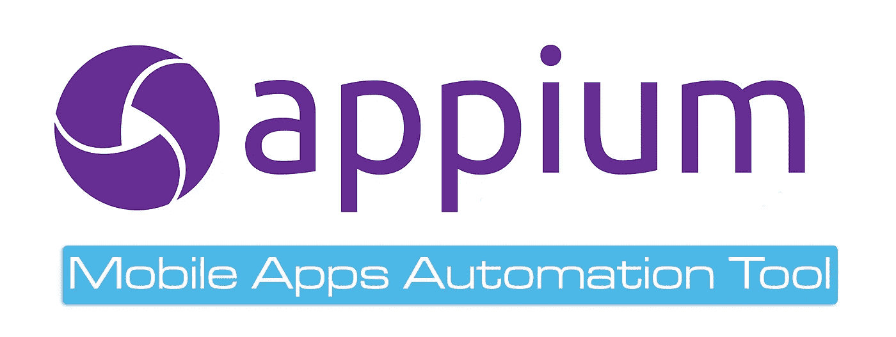

# 初学者的 9 个最佳 Appium 教程[2022 年 10 月]——在线学习 Appium

> 原文：<https://medium.com/quick-code/top-tutorials-to-learn-appium-for-mobile-automation-testing-8b87ac3bfd69?source=collection_archive---------0----------------------->

## 学习 Appium，在 2022 年为初学者提供最佳 Appium 教程，以自动化 android、ios 和混合移动应用的移动应用测试

移动应用市场正在蓬勃发展，在这些平台上进行质量测试成为一个主要挑战，尤其是找到一个适合所有移动平台的自动化工具。Appium 是一个开源测试自动化框架，可用于本地、混合和移动 web 应用。它使用 WebDriver 协议驱动 iOS、Android 和 Windows 应用程序。Appium 的主要优势在于它可以在 Android 和 IOS 上运行。

# 1.[app ium(Selenium)——从零开始的移动自动化测试](https://click.linksynergy.com/deeplink?id=Fh5UMknfYAU&mid=39197&u1=quickcode&murl=https%3A%2F%2Fwww.udemy.com%2Fmobile-automation-using-appiumselenium-3%2F)

关于移动自动化的讲座，从基础到框架级别，并附有实时示例。

在本课程中，您将:

*   了解如何使用 Appium 自动化 Android/IOS 中的任何(本地、混合)应用
*   获得关于 Selenium 3.0 最新版本的完整知识，您将能够自动化任何移动/web 应用程序
*   了解编写最佳移动自动化脚本的编码标准
*   了解 appium 框架组件，如 TesNG、Maven、ANT、Jenkins、pageobject model 等
*   能够从头开始开发移动自动化框架

还有一个关于 Selenium Webdriver 基础知识的部分，对于那些不了解 Selenium 的人，你可以浏览这些内容以巩固他们的基础知识，并切换回 Appium 以获得更好的理解。

本课程包括的主题如下:

*   未来应用
*   Appium 内部架构
*   设备上的配置设置
*   处理原生应用
*   开发混合应用
*   Appium API 的解释
*   移动手势自动化
*   自动化浏览器应用
*   在应用程序和浏览器上识别对象的提示
*   在真实设备上实现自动化
*   如何从 IOS 开始
*   IOS 功能和指南
*   Appium 最新更新
*   Appium 与 Maven Selenium 基础知识的集成(可选)

# 2.[带 Appium 的移动测试](https://linkedin-learning.pxf.io/c/1137078/646189/8005?u=https%3A%2F%2Fwww.linkedin.com%2Flearning%2Fmobile-testing-with-appium&subId1=quickcode)

用任何语言编写脚本——Java、Python、Ruby 或 JavaScript——并在任何设备上测试:iOS 或 Android。

该课程包括:

*   Appium
*   应用程序设置
*   应用程序会话
*   查找和使用元素
*   中级应用程序脚本

本课程将带您了解 Appium 中基于代码的自动化工作流程。

了解如何为 Appium 准备您的系统，让它运行，并设置测试代码环境。

了解如何在 iOS 和 Android 上使用原生移动应用程序启动自动化会话，并与屏幕元素进行基本交互。

从那里，你将处理更高级的主题，比如合成触摸手势。每一课都有助于您在应用程序开发周期中实现更高水平的质量和效率。

# 3.[UI 测试和应用入门](https://pluralsight.pxf.io/c/1137078/424552/7490?u=https%3A%2F%2Fwww.pluralsight.com%2Fcourses%2Fgetting-started-ui-testing-appium&subId1=quickcode)

本课程将教你如何使用开源工具 Appium，用你喜欢的编程语言为 iOS、Android、Mac 和 Windows 上的应用程序编写 UI 测试自动化，包括 UWP、WPF 和 Windows 窗体应用程序。

该课程包括:

*   Appium:它的工作原理及其主要组件
*   创建您的第一个测试
*   测试 iOS 应用程序
*   测试 Android 应用程序
*   测试 Windows 应用程序

您将学习如何使用您喜欢的任何编程语言为任何平台编写 UI 测试自动化。

首先，您将了解 Appium 的工作原理。接下来，您将探索可以用来编写自动化 UI 测试的基本自动化原语。

最后，您将发现在 iOS、Android 和 Windows 平台上安装、配置和运行测试所需的细节。

完成本课程后，您将能够在您的应用程序支持的任何平台上为您自己的应用程序编写第一个 UI 测试自动化。

# 4.[用 Appium 编写可维护的 UI 测试自动化](https://pluralsight.pxf.io/c/1137078/424552/7490?u=https%3A%2F%2Fwww.pluralsight.com%2Fcourses%2Fwriting-maintainable-ui-test-automation-appium&subId1=quickcode)

学习如何编写更好的测试自动化，这样你的测试就不会那么频繁地中断，并且在中断时更容易修复。你可以通过应用 DRY，Single Responsibility 原则，Page Object 模式，DAMP，和 Screenplay 模式来做到这一点。

该课程包括:

*   提高测试可维护性
*   应用干燥原理
*   运用单一责任原则
*   应用阻尼原理

您将学习如何改进您编写测试自动化的方式，以便您的测试不那么频繁地中断，并且使在测试中断时修复测试变得更简单。

首先，您将探索是什么因素使得 UI 测试如此脆弱和容易被破坏。您将会看到高质量的测试是什么样子的，并且会看到什么有助于提高测试的可维护性。

接下来，您将发现一组模式和实践，它们可以帮助您编写高质量、可维护的测试。

最后，您将回顾一组常见的示例测试场景，以及您如何通过应用这些模式来逐步重构它们，并且您将看到如何在您自己的测试场景中使用这些模式。

完成本课程后，您应该能够将您自己的测试场景重构为高质量、可维护性好的测试，并且您将学习如何应用 DRY、单一责任模式、页面对象、DAMP 和剧本模式。

# 5.[移动测试自动化:Appium、Cucumber 和 Ruby](https://click.linksynergy.com/deeplink?id=Fh5UMknfYAU&mid=39197&u1=quickcode&murl=https%3A%2F%2Fwww.udemy.com%2Ftest-automation-with-appium-cucumber-and-ruby%2F)

使用 Cucumber、Appium 和 Ruby 自动化 Android 原生应用程序。

在本课程中，您将:

*   知道如何在 Android 操作系统上使用 Appium 框架
*   知道如何使用 Appium 自动化任何 Android 应用程序
*   知道如何在任何测试项目中使用 cumber framework，包括 Selenium
*   知道如何使用 Android 真实设备和模拟器
*   知道如何使用 Appium 检查器和 UI automator 查看器来识别应用程序中的元素
*   知道如何安装所有需要的工具来开始测试自动化
*   能够使用 Cucumber 和 Ruby 实现可扩展的框架
*   知道如何使用 Appium 手势:滑动、滚动、点击

本课程教你如何从头开始创建自己的项目，包括安装所有需要的工具，创建框架结构，学习什么是 Appium 以及如何使用它。你将在市场上学到最好的工具:黄瓜、苹果和红宝石。您还将了解如何使用基本元素为 iOS 应用程序设置 project，以及如何为 Android 应用程序设置 project。

# 6. [Appium —最新 1.7.1 和实时项目的移动测试](https://click.linksynergy.com/deeplink?id=Fh5UMknfYAU&mid=39197&u1=quickcode&murl=https%3A%2F%2Fwww.udemy.com%2Fappium-selendroid-tutorials%2F)

关于在真实设备上使用 Appium 实现 IOS 和 Android 移动应用自动化的深入培训。

在本课程中，您将接受使用 Appium 和 Selendroid 自动化任何基于移动设备的本地、混合和 web 应用程序的培训。

这是市场上的 Appium & Selendroid 培训教程，将帮助你使用即将发布的 Selenium 3.0 APIs 以非常简单的方式学习 IOS 和 Android 的移动应用自动化测试。本课程涵盖模拟器/仿真器以及真实的 IOS 和 Android 设备上的示例。

# 7.[实际项目有效应用教程](https://click.linksynergy.com/deeplink?id=Fh5UMknfYAU&mid=39197&u1=quickcode&murl=https%3A%2F%2Fwww.udemy.com%2Feffective-appium-tutorial-with-real-project%2F)

帮助您以最有效的方式开始使用 Appium 移动自动化的实用课程。

在本课程中，您将:

*   用 Appium 有效地开始移动自动化测试
*   理解基于真实 QA 项目场景的业务和技术需求
*   知道如何从 Xcode 使用 iOS 模拟器
*   知道如何使用 Android 和 Genymotion 模拟器
*   使用 Chrome 有效识别移动浏览器的定位器
*   使用正确的页面同步策略

本课程提供了如何设置 Appium、Java、Maven、Xcode、Git、JUnit 以及 Xcode、Android SDK 和 Genymotion 仿真器来构建移动自动化测试框架的分步指南。

本课程是根据一个与电子邮件相关的 Web UI 自动化项目设计的。它向您展示了如何设计测试框架和集成最先进的工具来实现业务需求。它将逐步引导您完成这些工具的设置。

# 8.[使用 Appium C#开发自动化框架(高级)](https://click.linksynergy.com/deeplink?id=Fh5UMknfYAU&mid=39197&u1=quickcode&murl=https%3A%2F%2Fwww.udemy.com%2Fautomation-framework-development-with-appium%2F)

使用 Appium 在 C#中自动运行 Windows 和 MacOS 中的 Android 和 iOS 应用程序。

在本课程中，您将了解:

*   理解 C#的应用基础
*   了解 Appium 如何用于本地和混合应用自动化
*   从代码开始的初始阶段理解建筑行业标准代码
*   理解在应用程序代码开发阶段可以解决的不同问题
*   理解跨平台框架的构建

本课程是关于用 C#和 Appium 在 Windows 和 MacOS 操作系统中自动运行 Android 和 iOS 应用程序。本课程分为两个季节。

以下是第一季涵盖的主题:

*   appium 的基础知识及其工作原理
*   了解如何在 Windows 10 和 MacOS 中使用 appium 桌面客户端
*   在 Windows 10 中为 Ionic 应用程序自动运行 Android 应用程序
*   带有 appium 的页面对象模型
*   在 MacOS for Xamarin 应用程序中自动化 iOS 应用程序
*   解决最常见的问题。

第二季内容:

*   面向应用设计的 BDD 与 specflow
*   开发应用程序框架
*   应用框架报告

# 9.[用于移动自动化测试的 Appium—Selenium](https://click.linksynergy.com/deeplink?id=Fh5UMknfYAU&mid=39197&u1=quickcode&murl=https%3A%2F%2Fwww.udemy.com%2Fappium-selenium-for-mobile-automation-testing%2F)—【免费课程】

自动化移动测试应用程序课程，涵盖从应用程序下载到面试问题(移动自动化工具)。

完成课程后，您应该能够掌握使用 Appium APIs 进行移动自动化测试。这门应用课程将涵盖从非常基础的硒元素到专家水平。

通过本课程，您将学会:

*   如何使用 Appium 编写测试脚本
*   如何使用 Appium 识别各种移动元素
*   如何使用 Appium 网格
*   Appium 的最佳实践
*   将 Appium 与 TestNg、Maven、Ant、GitHub、Sauce Labs 配合使用
*   关于各种测试自动化框架的知识
*   自动化移动应用程序(本机、Web 和混合)
*   你应该如何使用 Appium 进行自动化框架

本课程将涵盖与 Appium 一起使用的所有最佳实践，例如 TestNG、Maven、Ant 等，涵盖所有可用的流行框架，例如页面对象模型、数据驱动框架。

本课程涵盖:

*   混合应用、本地应用和 web 应用
*   UIAutomator 的概念
*   缺点和局限性
*   在本地机器上下载和配置 Android
*   了解 Api 级别和 Android 版本之间的差异
*   在模拟器上配置应用程序
*   从 Maven/POM 依赖项下载/配置 Appium、Selenium
*   如何使用 Android UI Automator'sUISelector()及其函数获取任何应用程序的 Apk 文件、AppActivityName 和 AppPackage
*   在压缩布局中使用 UI Automator
*   查找选定元素使用 Android UIAutomator 命令通过文本查找元素
*   从 WebDriver 启动 XML 视图
*   Android 关键事件，如 home、backspace、delete 等
*   网络应用
*   测试 Selenium 自动化所需的所有工具和概念
*   多个应用程序的应用程序示例
*   Appium 面试的 Appium 网格准备
*   Jenkins 与 Appium 的集成，用于持续集成
*   Maven 应用程序页面
*   对象模型 Appium 与酱油实验室
*   应用和测试框架
*   带有 Git 存储库的 Appium

> 感谢您阅读本文。我们策划了更多主题的顶级教程，您可能想看看:

 [## 初学者的 9 个最佳 Postman 教程——在线学习 Postman API 测试

### 用 2021 年最好的 Postman 初学者教程学习 Postman 进行 RESTful API 测试

medium.com](/quick-code/top-tutorials-to-learn-postman-for-rest-api-testing-3bdf9788e0ba)  [## 初学者的 10 个最佳 Selenium 教程——在线学习 Selenium

### 学习 Selenium，成为更好的测试开发人员和质量工程师，为初学者提供最好的 Selenium 教程

medium.com](/quick-code/top-tutorials-to-learn-selenium-for-beginners-4e1f301585)  [## 面向初学者的 10+最佳 TypeScript 教程—在线学习 TypeScript

### 用 2021 年最适合初学者的 TypeScript 教程学习应用程序开发的 TypeScript

medium.com](/quick-code/top-tutorials-to-learn-typescript-c08834892e69) 

披露:我们与本文中提到的一些资源有关联。如果你通过本页的链接购买课程，我们可能会得到一小笔佣金。谢谢你。