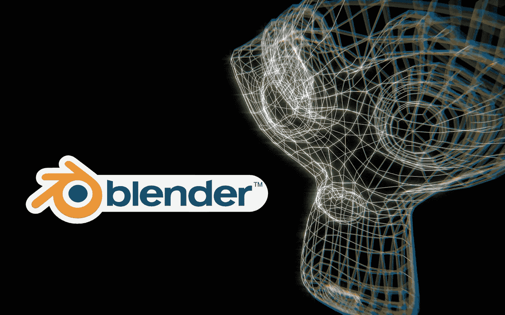
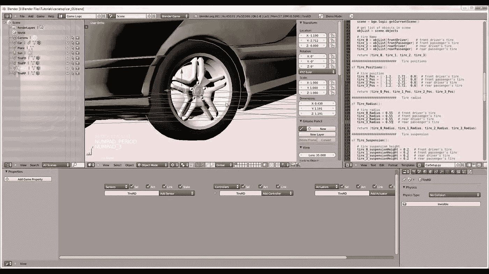

# 10+最佳搅拌机教程-在线学习搅拌机三维建模

> 原文：<https://medium.com/quick-code/top-tutorials-to-learn-blender-for-3d-modeling-3f4bc3eae1d0?source=collection_archive---------0----------------------->

## 学习 Blender，在 2021 年为初学者提供最好的 Blender 教程，为视频游戏、房屋设计、3D 打印等创建有吸引力的 3D 模型

## 1.[学习 3D 建模——完整的 Blender Creator 课程](https://coursesity.com/r/site/the-complete-guide-to-3d-modeling-with-blender)

使用 Blender 为视频游戏、3D 打印、房屋设计等创建漂亮的 3D 模型。不需要先验知识。在本课程中，您将:

*   使用 Blender 并理解它的界面
*   理解建模的原理
*   用简单的颜色创建 3D 模型
*   学习动画的基础知识
*   探索粒子效果并从中获得乐趣
*   创建您自己的材料
*   UV 贴图和展开你的模型
*   将您的模型导出到外部包

为视频游戏创建资产。制作独特的 3D 打印礼物。设计你梦想中的房子、汽车等，通过 3D 艺术作品表达自己。

了解如何使用免费的 3D 制作套件 Blender 为游戏创建 3D 模型和资源。本课程从超级简单开始，所以你很少或没有经验也没问题。

本课程以项目为基础，因此您将立即将新技能应用到真实的 3D 模型中。将包括所有项目文件，以及其他参考和资源。有讲头视频，强大的图表，质量截屏和更多。

您只需支付一次性费用，即可获得终身使用权。课程结束时，你将对 3D 建模和渲染的基础非常有信心，并渴望了解更多。

# 2.[搅拌机 2.8 基础培训](https://linkedin-learning.pxf.io/c/1137078/646189/8005?u=https%3A%2F%2Fwww.linkedin.com%2Flearning%2Fblender-2-8-essential-training-2&subId1=quickcode)

本课程提供了搅拌机功能集的全面概述，以及将专业知识与健康的操作方法相结合的实用生产技术。

在本课程中，您将了解:

*   特定的技术，如场景布局和建模，雕刻，纹理和阴影。
*   让 Blender 更快地渲染您的作品的性能提升技巧。
*   如何获得为多个平台创作专业作品所需的控制和技能。

该课程深入到具体的技术，如场景布局和建模，雕刻，纹理和阴影，2D 和三维动画，动态模拟，渲染和视频效果(VFX)。

此外，获得性能提升技巧，让 Blender 更快地渲染您的创作。每一课都帮助你获得为多个平台(游戏、电影和动画)创作专业作品所需的控制和技能。

# 3.[学习 Blender 3D！造低聚房屋&楼房](https://www.eduonix.com/learn-blender-3d-make-low-poly-houses-buildings/UHJvZHVjdC0zMjMyMDA=)

制作用于游戏和城市设计的艺术资产和模型。做一个基本的建筑？使用微块

在本课程中，您将学习如何:

*   将您在本课程中制作的积木用于游戏、城市设计、3D 打印以及更多需要 3D 艺术的项目。
*   了解设计技巧和更多技术。
*   创建自己的材料。
*   培养创造性和技术性的眼光。

# 4.[使用 Blender 的基本 3D 建模](https://www.awin1.com/cread.php?awinmid=6798&awinaffid=466009&clickref=quickcode&ued=https%3A%2F%2Fwww.edx.org%2Fcourse%2Fbasic-3d-modeling-using-blender)

学习基本的 3D 建模技能，包括建模，纹理和照明，使用免费的开源工具:Blender。

在本课程中，您将学习如何:

*   探索 3D 可视化概念。
*   增强您的 3D 建模、纹理和照明技能。
*   应用第三维的概念来创建逼真的 3D 模型。
*   理解免费开源 3D 动画工具 Blender 的复杂性。

本课程使用开源 3D 动画工具 Blender，为动画技能开发创建一个可持续的解决方案。

通过本课程，你可以发展 3D 动画的技能，以便学习 3D 建模和 Blender 的细微差别。

# 5.[搅拌机基础知识](https://pluralsight.pxf.io/c/1137078/424552/7490?u=https%3A%2F%2Fwww.pluralsight.com%2Fcourses%2Fblender-fundamentals&subId1=quickcode)

本课程将带您从头开始，完成创建无人驾驶飞船的每一步。

在本课程中，您将学习如何:

*   熟悉 Blender 所需的基本技能。
*   掌握给无人机添加纹理和材质的过程。
*   理解 Blender 中导航和建模的基础，以及纹理、装配、动画、照明和渲染。

首先，你将熟悉开始在 Blender 中移动和舒适地工作所需的基本技能。

然后，您将开始探索 Blender 中强大的建模功能，并开始构建无人机。向前推进，你将潜水到索具和动画，以及学习如何利用 Blender 的动态引擎来创建一个火焰效果。

最后，您将征服照明，并使用在 Blender 的合成器中创建的最终后期制作效果来渲染场景。

当你完成这个 Blender 课程时，你不仅会从头开始创建一个无人驾驶飞船的 3D 过程的每一步，而且你还会对 Blender 中的所有核心功能有很强的理解。

# 6.[学习 3D 动画——终极搅拌机指南](https://click.linksynergy.com/deeplink?id=Fh5UMknfYAU&mid=39197&u1=quickcode&murl=https%3A%2F%2Fwww.udemy.com%2Fblendercourse%2F)

用 Blender 学习 3D 动画和建模的 A-Z 指南，让你走上创建令人敬畏的 3D 艺术品的道路。本课程带给你以下几个方面:

*   从 3D 和动画的基础开始，在你学习的过程中通过 Blender 创建项目的来龙去脉来工作&你完成了一个完整的动画！
*   自信地在 Blender 和所有不同的工具中导航和创作！
*   创建你的第一个卡通人物的一步一步的指南
*   为成品制作角色动画
*   最后，充满信心，知道如何从一个想法到成品，创建自己的项目和动画
*   使用你学到的技能，然后创建自己的作品和动画

在本课程中，您将学习 3D 艺术技巧，这将使您能够创建自己的 3D 艺术作品。

在本课程结束时，你将能够创建自己的角色和动画场景，并知道从一无所有到完全完成动画项目所需的所有不同步骤。

本课程是以项目为基础的，所以你将会使用你在这个过程中学到的技能来创作一些令人敬畏的艺术品和动画。

# 7.[学习 Unity 视频游戏开发的 Blender 3D 建模](https://click.linksynergy.com/deeplink?id=Fh5UMknfYAU&mid=39197&u1=quickcode&murl=https%3A%2F%2Fwww.udemy.com%2Flearn-blender-3d-modeling-for-unity-video-game-development%2F)

学习使用 Blender 3D 为 Unity 开发人员创建或编辑道具、设计关卡、应用材料和简单动画。您将学习如何:

*   使用 Blender 3D 像专业人员一样设计 Unity 游戏道具和关卡
*   通过将 Unity 资源(道具)导入 Blender 来对其进行调整。
*   动画陷阱和其他障碍为您的游戏设计
*   为你的 Unity 游戏设计模块化关卡
*   使用 Blender 3D 自信地创建自己的 Unity 道具

无论你是对为你的游戏设计独特的 3D 道具感兴趣，建立令人敬畏的关卡，还是调整你现有的 Unity 资产，本课程都可以帮助你通过学习曲线，并让你成为驾驶员。

你将像一个专业人士一样学习如何使用所有最常用的工具来编辑视频游戏道具和关卡设计。它涵盖了所有的基本术语、键盘快捷键、最佳实践、节省时间的技巧，以及不使用骨骼或索具制作动画、使用无缝纹理快速应用材质或使用环境遮挡纹理贴图微调最终产品的全面介绍。

# 8. [Unity & Blender Masterclass:制作 3D Zenda 游戏！](https://click.linksynergy.com/deeplink?id=Fh5UMknfYAU&mid=39197&u1=quickcode&murl=https%3A%2F%2Fwww.udemy.com%2Fbuild-the-legend-of-zenda-game-in-unity3d-and-blender%2F)

学会在 Unity 中构建游戏。在 Blender 中从头开始创建游戏的艺术。在本课程中，您将学习如何:

*   从头开始在 Unity 中构建一个 3D“Zenda 传奇”游戏。
*   导航 Unity 编辑器。
*   C#中的代码。
*   使用 Blender 并浏览其界面。
*   UV 映射和展开你的模型。
*   在 Blender 中为游戏建立 3D 模型。
*   将 Blender 的艺术融入 Unity。
*   建立视频游戏关卡。
*   创建自己的材料。
*   学习动画的基础知识。

在本课程中，您将学习如何使用 Unity 和 Blender 构建 3D 游戏。这个课程是独一无二的，因为它从零开始制作游戏的代码和艺术。它教你设计、编码和建模 3D 游戏的基本原理。

首先你在 Unity 中设计游戏“曾达传奇”及其功能。您将学习如何用 C#编写代码并构建视频游戏关卡。它开始很简单，并随着课程的进行增加更多的内容。

然后你在 Blender 中创建游戏的 3D 模型。你为游戏建立所有的艺术资产，包括角色、武器、大炮、地牢和神殿。你学习如何将你的作品从 Blender 整合到 Unity 中。

# 9.[用搅拌机创造游戏角色](https://click.linksynergy.com/deeplink?id=Fh5UMknfYAU&mid=39197&u1=quickcode&murl=https%3A%2F%2Fwww.udemy.com%2Fcreate-game-characters-with-blender%2F)

在 Blender 中为你自己的游戏角色建模、制作纹理、装备和制作动画。在本课程中，您将:

*   在 Blender 中建模和塑造游戏角色
*   使用 Blender 的重组工具
*   创建 UV 贴图和烘焙纹理贴图
*   使用 Blender 的纹理绘制工具
*   用 Blender 的 Rigify 插件装备一个角色
*   为游戏角色制作游戏循环动画
*   将 Blender 字符导入 Unity
*   在 Unity 中设置一个角色控制器来移动你的角色

建立您的技能，以便您可以在 Blender 中创建自己的游戏角色。

在本课程中，您将从 Blender 中的第一个多边形到 Unity 游戏引擎中的最终可控角色创建一个游戏角色。在整个课程中，你将学习 Blender 的建模、纹理、装配和动画工具。你将学习处理这样一个复杂项目所需的技术和策略，这样你就可以把你自己的角色带入生活。

然后，您将学习为游戏角色创建动画循环的基础知识。您将使用 Blender 的图形编辑器和摄影表来制作空闲和运行动画，以及创建跳跃姿势。

# 10.[Blender Character Creator——从头开始制作 3D 动画](https://click.linksynergy.com/deeplink?id=Fh5UMknfYAU&mid=39197&u1=quickcode&murl=https%3A%2F%2Fwww.udemy.com%2Fblendercharacters%2F)

学习搅拌机基础知识，操纵和出口到游戏引擎。在本课程中，您将学习:

*   使用基于骨骼的骨架正确装配模型。
*   创建一个简单有趣的角色模型。
*   让你的模型栩栩如生。
*   将您的作品导出到 Unity 和虚幻游戏引擎中。
*   为视频游戏创建资产。
*   制作独特的动画角色。
*   成为一名经验丰富的装配工和动画师。
*   通过 3D 艺术作品表达自己。

您将学习如何在 Blender 中建模、装配和动画 3D 模型，以及像 Unity 和 Unreal 这样的游戏引擎。你将开始超级简单，所以没有以前的 3D 建模经验是必需的。

整个课程都是基于项目的，所以你将立即把你的新技能应用到真实的 3D 模型中。将包括所有项目文件，以及其他参考和资源。有有声视频，强大的图表，高质量的截屏。

对于您构建的每个模型，您将遵循以下流程:

*   接受挑战，自己构建整个模型。
*   被一步一步地展示如何建立它。
*   定期应用你的知识。
*   全程鼓励和支持

课程结束时，你会对搅拌机的基础知识非常有信心。你将能够在游戏引擎和 Blender 中模拟基本的角色，装配和动画简单的角色。

如果你是一个完全的初学者，它会教你所有你需要的建模基础知识。如果你是一名艺术家，它会教你真正将你的资产带入生活。如果你是一名程序员，它会教你建模和设计原则。

# 11.[搅拌机 2.83 基础培训](https://linkedin-learning.pxf.io/c/1137078/646189/8005?u=https%3A%2F%2Fwww.linkedin.com%2Flearning%2Fblender-2-83-essential-training&subId1=quickcode)

Blender 是一个强大的开源解决方案，用于 2D 和 3D 建模、动画、合成和后期制作。

在本课程中，您将学习:

*   Blender 2.83 中的功能集概述，以及实用的制作技术。
*   关于具体的技术，如场景布局和建模，雕刻，纹理和阴影。
*   如何获得为多个平台创作专业作品所需的控制和技能。

您将全面了解 Blender 2.83 的功能集，以及将专业知识与健康的操作方法相结合的实用生产技术。

它深入到具体的技术，如场景布局和建模，雕刻，纹理和阴影，2D 和三维动画，角色操纵，动态模拟，渲染和视频效果(VFX)。

此外，获得性能提升技巧，让 Blender 更快地渲染您的创作。每一课都帮助你获得为多个平台(游戏、电影和动画)创作专业作品所需的控制和技能。

# 12.[在 Blender 中创建 3D 环境](https://click.linksynergy.com/deeplink?id=Fh5UMknfYAU&mid=39197&u1=quickcode&murl=https%3A%2F%2Fwww.udemy.com%2Fblender-environments%2F)

本课程帮助您创建精彩的环境场景，组织您的工作流程，并找到合适的灵感。在本课程中，您将学习:

*   创造令人惊叹的独特环境
*   组织您的工作流程以制作大型环境场景
*   所有场景资产，包括建筑物、岩石、草地、树木
*   搅拌机基础章节的完整课程文档
*   烘焙模型并在 Unity 3D 中导入

通过每一个课程，你会了解到强大的免费搅拌机三维计划。熟悉 Blender 用户界面后，您将学习如何从头开始创建一个景观设计。最后，这个系列将向你展示如何制定一个组织计划，并创建一个非常先进的环境场景，包括建筑物和人物。

您将了解到:

*   安装搅拌机和制作一些简单的物体。
*   制作栅栏并添加简单的木质纹理。您将接触 UV 图像编辑器，并学习如何在模型上应用纹理。
*   如何制作一个简单的着色器组合来添加围栏上的苔藓。
*   从建造过程开始，首先建造一个简单的建筑，但是在取得一些进展后你将开始建造更高级的建筑，包括装饰品。
*   使用“Grove 3D”生成树。在自然部分之后，你将制作一个风景场景，并添加所有的物体，包括一条有水坑的沙路。
*   关注气氛和照明，使用点光源和太阳灯进行灯光设置。
*   使用环境贴图照亮场景。使用一些大气雾在场景中创建薄雾。

然后是创建最终场景的时候了，你从头开始，使用一个场景贴图作为参考，做一个粗略的设置。从那时起，你构建场景，并面对环境建模带来的所有挑战。本课程录制于 blender 2.78c 和 2.79。

# 13. [Blender 新手角色建模高清](https://click.linksynergy.com/deeplink?id=Fh5UMknfYAU&mid=39197&u1=quickcode&murl=https%3A%2F%2Fwww.udemy.com%2Fblender-character-modeling-for-beginners-hd%2F)

学习在 Blender 中建模 3D 角色。在本课程中:

*   您将学习如何在 Blender 中为动画和视频游戏建模 3D 人物角色
*   您将学习如何使用 Blender 软件，并熟练掌握其功能

您将被引导通过一步一步的过程，从零开始创建一个高质量的 3D 人物角色设计，使用一个基于公式的系统，不使用任何参考。首先，您将使用一个简单的立方体构建一个逼真的人体模型，然后使用特殊的公式。

基于公式的系统的强大之处在于，你可以跟随它得到同样精确的结果。当你构建表面解剖结构时，你也会变得非常熟悉使用这个基于公式的系统的人体设计。

本课程旨在教你如何使用 blender，并让你更有信心从头开始开发自己的角色设计。每一步都解释得很清楚，所以你可以轻松地跟随。

# 14.[创建&在 Blender 中设计一个现代的 3D 房子](https://click.linksynergy.com/deeplink?id=Fh5UMknfYAU&mid=39197&u1=quickcode&murl=https%3A%2F%2Fwww.udemy.com%2Fblendermadeeasy-modernhouse%2F)

了解如何使用 Blender 建模 3D 照片真实感建筑渲染！在本课程中，您将:

*   使用 Blender 创建您自己的建筑渲染
*   纹理，并为自己的场景制作逼真的材质。
*   在搅拌机中舒适地工作

本课程结束时，你将已经完成一个漂亮的 3D 现代房屋。本课程的第一部分将着重于我们现代房屋的建模。

在接下来的几节中，你将添加材质，纹理，建模和灯光到你的场景中。你将学习如何渲染你的图像和后期处理。从建模的基础到像用粒子系统创建草这样的高级技术。

你将看到如何创建一个搅拌机现代沙发。你要做的第一件事是建模和雕刻它。这将添加一些折痕，使其更加真实。然后当然是材质和效果图。

在本课程中，您将使用以下程序。

*   Blender 3D
*   用计算机修改（图片或照片）

> 感谢您阅读本文。我们策划了更多主题的顶级教程，您可能想看看:

 [## 10+最佳初学 Photoshop 教程——在线学习 Photoshop

### 2021 年最佳 Photoshop 初学者教程，学习如何使用 Photoshop CC

medium.com](/quick-design/best-online-tutorials-to-learn-photoshop-68c0de7e53c7)  [## 10+最佳 Maya 初学者教程—在线学习 Maya

### 2021 年学习 Maya 创建 3D 计算机图形应用程序，为初学者提供最佳 Maya 教程

medium.com](/quick-code/top-tutorials-to-learn-maya-for-3d-computer-animation-33152ff9bb44)  [## 10+游戏开发者最佳 Unity 教程

### 学习 Unity 从 2021 年最好的 Unity 新手教程开始学习游戏开发

medium.com](/quick-code/top-online-tutorials-to-learn-game-development-using-unity-55497ad51169) 

披露:我们与本文中提到的一些资源有关联。如果你通过本页的链接购买课程，我们可能会得到一小笔佣金。谢谢你。