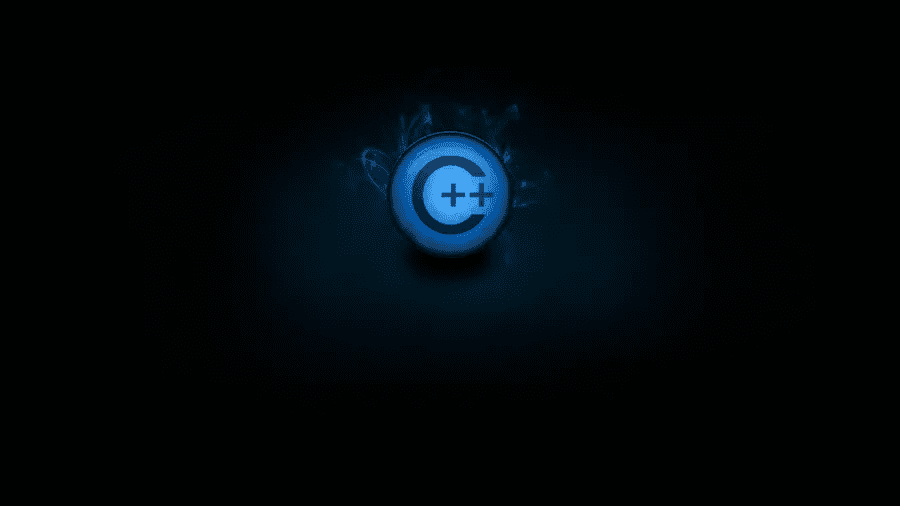
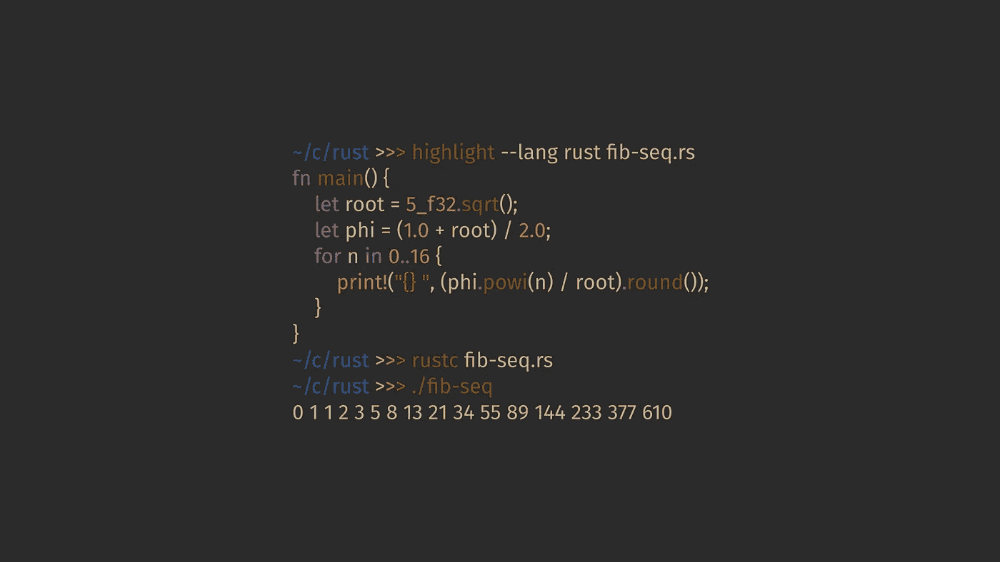

# 15+最佳 C++初学者编程教程[2022 年 7 月] —在线学习 C++

> 原文：<https://medium.com/quick-code/top-tutorials-to-learn-c-programming-d3dd13769a0c?source=collection_archive---------5----------------------->

## 学习 C++在 2022 年为初学者提供最好的 C++教程，创建跨多个领域和平台的高性能应用程序

C++是一种通用编程语言，由比雅尼·斯特劳斯特鲁普在 37 年前发明。它仍然是最流行的编程语言之一，用于创建跨各种领域和平台的高性能应用程序。

# 1.C++——初学者在 7 天内掌握 c++的 3 个步骤

像专业人士一样学习 C++！从基础开始，一直到创建自己的应用程序！

通过本课程，您将:

*   学会专业地使用 C++
*   学习用 C++开发函数和类。
*   从头开始建立对 C++的完整理解
*   理解复杂的编程主题。
*   了解如何在几分钟/几小时内开发出令人印象深刻的 windows 应用程序。

在本课程中，你将学习计算机编程的所有基础知识，并能够将它们应用到 C++编程语言中。这门课程将教你如何用 C#编写程序和应用程序，每堂课都有完整的编码截屏。

## 2.[面向 C 程序员的 C++，A 部分](https://coursera.pxf.io/c/1137078/1213622/14726?u=https%3A%2F%2Fwww.coursera.org%2Flearn%2Fc-plus-plus-a&subId1=BotTutorials)

本课程是为想用 C++编程的有经验的 C 程序员开设的。这些例子和练习要求对算法和面向对象软件有基本的理解。

在这里，您将学习如何将现有的 C 程序转换为 C++，以及类型安全输入/输出的用途。

本课程将回顾 Dijkstra 的最短路径算法。C++函数和泛型。您还将学习 Prim 和 Kruskal 的算法以及基本容器类的使用。

# 3.[学习 C++](https://linkedin-learning.pxf.io/c/1137078/646189/8005?u=https%3A%2F%2Fwww.linkedin.com%2Flearning%2Flearning-c-plus-plus-3&subId1=quickcode)

本课程将帮助你快速入门。

在本课程中，您将了解:

*   简单数据类型，包括数字和字符串；像循环这样的流量控制功能。
*   处理文件和特殊的数据结构，如类和链表。

它涵盖了简单的数据类型，包括数字和字符串；像循环、if、else 和 switch 语句这样的流控制特性；和函数，封装程序执行的任务的代码。

本课程还包括使用文件和特殊数据结构，如类和链表。每章都充满了实用的代码示例和挑战，以帮助您练习 C++技能。

# 4.[通过实例学习 C++编程 75 个已解决的问题](https://www.eduonix.com/learn-by-example-cplusplus-programming-75-solved-problems/UHJvZHVjdC0zMjMyMDA=)

使用实用的方法从头开始学习 C++编程语言。通过 75 个不同的已解决的示例获得 C++实践。

该课程包括:

*   基本主题，如对象、类、继承、运行时、多态性
*   C++陷阱以及运算符重载、常量、静态、引用、C++强制转换、异常
*   更高级的概念，如模板和标准模板库(STL)

本课程将帮助你在例子的帮助下零零碎碎地学习 C++，这些例子将是独立的，附有代码源，并涉及一个具体的 C++用例。

# 5.[c++入门](https://www.awin1.com/cread.php?awinmid=6798&awinaffid=466009&clickref=quickcode&ued=https%3A%2F%2Fwww.edx.org%2Fcourse%2Fintroduction-to-c-3)

从微软的专家那里获得 C++语言的简介。

在本课程中，您将学习:

*   C++语法。
*   C++语言基础。
*   如何在 C++中创建函数

通过学习 C++，您可以创建在各种硬件平台上运行的应用程序，如运行 Windows、Linux、UNIX 和 Mac OS X 的个人电脑，以及小尺寸硬件，如基于 Raspberry PI 和 Arduino 的主板等物联网设备。

# 6.[学习 C++面向对象编程](https://www.educative.io/courses/learn-object-oriented-programming-in-cpp?affiliate_id=5088579051061248)

面向对象编程(OOP)已经存在了几十年。如果你对 C++有一个基本的了解，并且有兴趣提升你的技能，这个课程将帮助你做到这一点。

该课程包括:

*   面向对象的介绍
*   功能
*   两颗北极指极星
*   班级
*   数据隐藏
*   遗产
*   多态性
*   组成、聚集和关联

从概述基础知识开始，您将深入了解使用用户定义的类实现复杂应用程序的由来已久的技术。

接下来讨论类和对象，然后讨论包括继承和多态在内的高级主题。

在整个课程中，您将完全沉浸在面向对象的 C++中，每一步都有插图、练习、测验和动手挑战。

您将理解类和对象的行为，并能够轻松地创建简单、高效、可重用和安全的代码。

## 7.[学习 C++](https://www.pjatr.com/t/TUJGR0lLR0JHR0pMSUtCR0ZISk1N?sid=quickcode&url=https%3A%2F%2Fwww.codecademy.com%2Flearn%2Flearn-c-plus-plus)

本课程将从基本的编程概念开始，然后深入探讨更高级的 C++主题。

在本课程中，您将学习如何:

*   编写、编译和执行你的第一个 C++程序。
*   理解 1。变量和基本数据类型。
*   使用条件和逻辑来构建产生不同结果的程序。
*   理解循环的目的。
*   使用 C++ vectors，这是组织数据的好方法。

您将构建从哈利波特分院帽到可以审查文本的程序的所有东西！

# 8.[成为一名 C++开发人员](https://imp.i115008.net/c/1137078/788805/11298?u=https%3A%2F%2Fwww.udacity.com%2Fcourse%2Fc-plus-plus-nanodegree--nd213&subId1=quickcode)

学习 C++，这是一种用于世界上最令人兴奋的工程工作的高性能编程语言——从自动驾驶汽车和机器人到网络浏览器、媒体平台、服务器，甚至视频游戏。

在本课程中，您将学习如何:

*   开发、编译和执行 C++程序以及语法、函数和容器。
*   将多个文件链接在一起。
*   构建类、接口和通用模板来创建面向对象的 C++程序。
*   现代 C++包括许多用于编写干净、可重用代码的工具。
*   在 C++中控制静态和动态内存使用的资源获取是初始化模式、指针、引用和移动语义。

学习使用 OpenStreetMap 数据构建路线规划器，为您的计算机编写进程监视器，并实现您自己的智能指针。

C++支持并行运行多个执行路径。了解如何启动进程和线程，以便并行执行逻辑。

然后进入线程同步和通信，体验并发编程的全部功能。

在你的顶点项目中，你将运用你所有的新 C++技能！利用这个 Nanodegree 项目的核心概念——面向对象编程、内存管理和并发性——使用 C++构建自己的应用程序。

最后，通过构建多线程流量模拟器和编写您自己的 C++应用程序来展示您所有的新技能。

# 9.[学习高级 C++编程](https://click.linksynergy.com/deeplink?id=Fh5UMknfYAU&mid=39197&u1=quickcode&murl=https%3A%2F%2Fwww.udemy.com%2Flearn-advanced-c-programming%2F)

探索从中级到高级的 C++，包括 C++ 11 对 C++标准的奇妙补充。

通过本课程，您将能够:

*   开发复杂的 C++应用程序
*   理解 C++ 11

这门课程将带你从 C++的基础知识到使用该语言的更高级的特性。

本课程从 C++文件处理开始，介绍 STL、模板类、运算符重载、lambda 表达式和移动构造函数。它将向你展示如何创建一个生成分形图像的程序，使用一些语言特性给你一个很好的智能指针和数组。

# 10. [C++:从初学者到专家](https://click.linksynergy.com/deeplink?id=Fh5UMknfYAU&mid=39197&u1=quickcode&murl=https%3A%2F%2Fwww.udemy.com%2Fvideo-course-c-from-beginner-to-expert%2F)

专为没有任何编程知识但想用 C++编程的人设计

在本课程中，您将学习:

*   如何在行动中使用 C++语言
*   什么是编译器/ IDE /变量/变量类型等。
*   如何使用文件— fstream 库(对文件的 i/o 操作)

本课程包括各种主题，如运算符——算术、赋值、逻辑、按位、条件，如 if/ else/ switch、数组/多维数组、循环——for/while/do-while、函数、重载函数、向函数传递变量等。结构、引用、指针、内存的动态分配、在 IDE 中创建项目、类、面向对象的编程、类和函数模板、命名空间、异常、输入/输出流和数据验证。

# 11.[开始 C++编程——从入门到超越](https://click.linksynergy.com/deeplink?id=Fh5UMknfYAU&mid=39197&u1=quickcode&murl=https%3A%2F%2Fwww.udemy.com%2Fbeginning-c-plus-plus-programming%2F)

获得游戏、系统和应用程序开发所需的现代 C++面向对象编程(OOP)和 STL 技能。

通过本课程，您将学习使用当今最强大的编程语言之一 C++进行编程，获得也适用于其他编程语言的关键编程概念，学习现代 C++，并学习 C++从基础到更高级的功能，如继承和多态函数。

本课程为您带来测验、现场编码练习、挑战编码练习和作业。涵盖的主要主题包括:

*   使用 while、do/while for、基于范围的 for 语句和递归进行循环
*   执行计算和显示结果
*   功能
*   两颗北极指极星
*   使用现有的类和创建对象
*   创建自己的类
*   使用基本的标准模板库类，如 Vector
*   构造函数和析构函数
*   复制和移动语义包括复制构造函数、移动构造函数以及复制和移动赋值
*   如何重载运算符
*   使用继承和类层次结构
*   使用多态函数和动态绑定
*   使用智能指针
*   使用流 I/O
*   C++ STL 简介
*   异常处理简介

课程形式包括理论和概念，然后用实际的代码例子来加强。C++调试器通常用于单步调试代码和分析变量，以便更好地理解 C++的行为。

# 12.[开始现代 C++ (C++11/C++14)](https://click.linksynergy.com/deeplink?id=Fh5UMknfYAU&mid=39197&u1=quickcode&murl=https%3A%2F%2Fwww.udemy.com%2Fbeg-modern-cpp%2F)

具有 C++11/14 特性的最全面的 C++教程

在本课程中，您将学习如何:

*   用 C++编写真实世界的应用程序
*   在程序中应用现代 C++
*   使用 C++作为面向对象的语言
*   C++11/14 引入的现代特性
*   了解动态内存分配(malloc，new[]，2D 数组，字符串)
*   理解 C++并发性(std::thread、std::mutex 等)
*   使用模板、函数对象、lambda 表达式、标准模板库
*   理解虚拟继承、异常处理、文件 I/O、文件系统(C++17)
*   理解字符串、字符串流、枚举、继承、多态

本课程强调使用语言的现代特性编写 C++代码，例如移动语义、自动类型推断、线程、lambda 表达式和智能指针。

本课程将 C++作为一门具有现代特征的面向对象语言来教授。它侧重于教授 C++概念，包括新旧概念，并附有清晰的示例。它建立在基本语言工具的基础上，这些工具可以用来构建更复杂的程序，包括类、操作符重载、组合、继承、多态和模板。在每几个主题之后，会有一个测验来测试你对前面主题的理解。

# 13.[现代 C++中的设计模式](https://click.linksynergy.com/deeplink?id=Fh5UMknfYAU&mid=39197&u1=quickcode&murl=https%3A%2F%2Fwww.udemy.com%2Fpatterns-cplusplus%2F)

用 C++探索设计模式的现代实现！

通过本课程，您将学会如何:

*   识别和应用设计模式
*   重构现有设计以使用设计模式
*   关于设计模式的适用性和可用性的推理
*   使用现代 C++的不同方面

本课程从实用的角度全面概述了现代 C++中的设计模式。本课程特别涵盖了使用最新版本的 C++编程语言的模式、现代编程方法的使用:依赖注入、协程的使用等等、现代开发工具(如 CLion 和 ReSharper C++)的使用、模式变化和替代方法的讨论。

本课程还提供了所有四人组(g of)设计模式的概述，以及现代的变化、调整，并讨论了模式在语言中的内在使用。

## 14. [C 编程初学者—掌握 C 语言](https://click.linksynergy.com/deeplink?id=Fh5UMknfYAU&mid=39197&u1=quickcode&murl=https%3A%2F%2Fwww.udemy.com%2Fcourse%2Fc-programming-for-beginners-%2F)

c 编程会增加职业选择。通过学习 c 成为其他语言的更好的开发者。

在本课程中，您将学习如何:

*   理解 C 编程语言的基础。
*   让自己在入门级编程岗位上更有市场。
*   创建您的第一个 C 应用程序。
*   理解世界上最流行、最广泛使用的语言之一。
*   理解变量和不同的数据类型。
*   应聘实时编程岗位。
*   了解大多数现代语言所基于的核心语言。
*   写出高质量的代码。

在这里，您将理解变量和不同的数据类型，能够利用函数和数组，理解指针的概念，了解控制流(决策语句和迭代)。

你将处于一个申请实时编程职位的位置，并真正理解大多数现代语言所基于的核心语言！

本课程结束时，您将了解 C 编程语言的基础，并使自己更适合入门级编程职位。

# 15. [C++编程从初学者到进阶一步一步来。](https://click.linksynergy.com/deeplink?id=Fh5UMknfYAU&mid=39197&u1=quickcode&murl=https%3A%2F%2Fwww.udemy.com%2Fcplusplus-programming-step-by-step%2F)

从 C++基础开始，然后精通文件 I/O，面向对象编程 OOP，STL，函子，lambda 与 C++ 11/14！

在本课程中，您将:

*   深入理解面向对象编程 OOPs 概念
*   理解基本的编程结构，如分支和循环。
*   理解指针和动态内存分配的细节以及内存管理技术。
*   理解函数，通过值和引用传递的参数
*   了解使用 struct 和 class 的用户定义类型。
*   学习构造函数、方法重载和动态多态。
*   学习运算符重载，友函数。
*   深入了解继承和动态多态，运行时多态如何帮助编写更灵活和动态的代码。

本课程将教你 C++从零开始，逐步达到使用 C++11/14 的面向对象编程(OOP)的高级水平。面向对象的编程概念解释得很清楚。除了基本的编程概念，如变量、分支和循环、函数、引用参数、数组、字符串和 C++中的向量，您还将学习类、对象、继承、运行时、多态性、运算符重载。

你将详细学习 STL 或标准模板库，以及函子和 lambda 的概念。文件 I/O 已经过详细讨论，在迷你项目中，文件 I/O 被广泛使用。

# 16. [C++基础训练](https://linkedin-learning.pxf.io/c/1137078/646189/8005?u=https%3A%2F%2Fwww.linkedin.com%2Flearning%2Fc-plus-plus-essential-training-2&subId1=quickcode)

学习 C++编程，从基础开始。C++广泛用于系统和应用程序开发，几乎可用于所有操作系统，并影响和影响了许多衍生语言，包括 C#和 Java。

在本课程中，您将学习如何:

*   设置您的编码环境并剖析基本 C++程序的结构。
*   复习基本语句和表达式、变量、条件、运算符、循环和函数。
*   理解递归、类型转换和运算符重载等概念。

这门课程将指导你学习这门基本语言的具体细节。它帮助您建立编码环境，并剖析基本 C++程序的结构。

它回顾了基本要素——语句和表达式、变量、条件、操作符、循环和函数——并转移到更复杂的主题，如数据结构、类和对象以及模板。

在此过程中，您还将学习递归、类型转换和运算符重载等概念，并深入了解标准模板库(STL)中强大的容器类和算法。

这些详尽的教程为有经验的程序员和语言新手提供了坚实的 C++参考。

> 感谢您阅读本文。我们策划了更多主题的顶级教程，您可能想看看:

 [## 10+最佳新手 Git 教程——在线学习 Git

### 在 2021 年的最佳 Git 初学者教程中学习 Git 的代码管理和版本控制

medium.com](/quick-code/top-tutorials-to-learn-git-for-beginners-622289ffdfe5)  [## 15+初学者最佳 Bootstrap 4 教程—在线学习 Bootstrap 4

### 在 2021 年，用最好的初学者引导教程学习 web 开发的引导

medium.com](/quick-code/top-tutorials-to-develop-responsive-websites-using-bootstrap-4-c934172f3ebd)  [## 15+最佳 Spring 框架教程—在线学习 Spring

### 2021 年用最好的 spring 教程学习 web 应用程序开发的 spring 框架

medium.com](/quick-code/top-tutorials-to-learn-spring-framework-for-the-java-application-12db01d9c288) 

*原载于*

# *对最好和最高评级的在线编程课程感兴趣？[注册](http://www.coursesity.com)在任何人之前获得独家更新。*