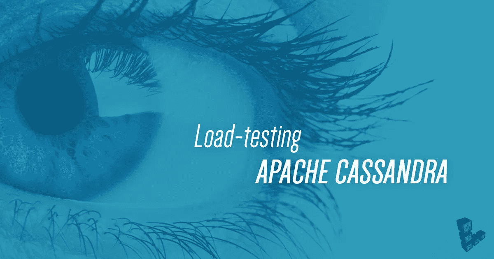
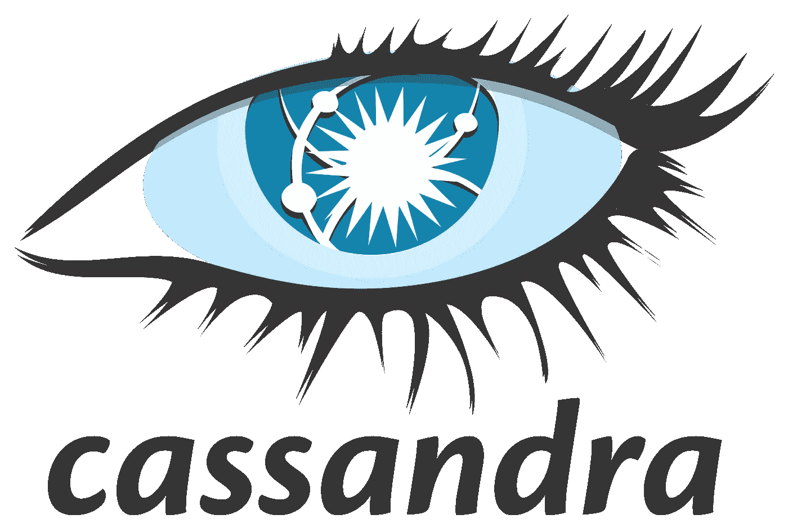

# 初学者的 8 个最佳 Cassandra 教程[2023 年 3 月]——在线学习 Cassandra

> 原文：<https://medium.com/quick-code/top-tutorials-to-learn-cassandra-for-beginners-bbc03ea3e676?source=collection_archive---------5----------------------->

## 用 2023 年最好的 Cassandra 初学者教程学习数据库管理的 Cassandra。

## 1.[开始使用 Apache Cassandra](https://click.linksynergy.com/deeplink?id=Fh5UMknfYAU&mid=39197&u1=quickcode&murl=https%3A%2F%2Fwww.udemy.com%2Fapache-cassandra%2F)

这个 Apache Cassandra 培训课程“无限技能”教你使用 Cassandra 的基本知识。这个课程是为绝对初学者设计的，也就是说不需要 Cassandra 的经验。建议有数据库、SQL 和编程经验。

您将从学习如何安装 Cassandra 开始，然后了解与 Cassandra 通信的方式。在此基础上，本课程将教您如何创建数据库、创建表以及插入数据和建立数据模型。本视频教程还将介绍如何创建应用程序、更新和删除数据、选择硬件以及向集群添加节点。您还将学习如何监视集群、修复和删除节点以及重新定义集群。

一旦您完成了这个基于视频的培训课程，您将对 Cassandra 有一个坚实的了解，并能够在您自己的开发项目中使用 Cassandra。工作文件包括在内，允许您跟随作者在整个课程。

## 2.[从零开始学习阿帕奇卡珊德拉](https://coursesity.com/r/site/learn-apache-cassandra-from-scratch-in-our-online-tutorial-)

该课程从基本的 Cassandra 概念开始，接着是 CQL，最后教你使用 Cassandra 和 NodeJs 构建一个真正的应用程序。本课程涵盖以下几个部分:

*   Cassandra 概述
*   Cassandra 数据模型
*   内部工作
*   Hadoop
*   卡珊德拉装置
*   Linux 操作系统
*   Windows 操作系统
*   Cassandra 查询语言
*   Cassandra 中的表和查询
*   卡桑德拉的 Crud 业务
*   卡桑德拉的项目建筑
*   使用 Cassandra 和 Nodejs 构建一个简单的 Twitter 克隆应用程序

## 3.[面向开发者的卡珊德拉](https://pluralsight.pxf.io/c/1137078/424552/7490?u=https%3A%2F%2Fwww.pluralsight.com%2Fcourses%2Fcassandra-developers&subId1=quickcode)

本课程旨在让您熟悉 Cassandra 的弹性分布式架构，同时让您全面了解 Cassandra 查询语言(CQL)。

在本课程中，您将了解:

*   卡珊德拉简史。
*   如何用 Docker 立一个 Cassandra 集群？
*   复制策略和 Cassandra 对“可调一致性”的支持

您将了解 Cassandra 的简史，以及如何使用 Docker 建立 Cassandra 集群。首先，您将发现复制策略和 Cassandra 对“可调一致性”的支持

然后，将向您介绍 CQL 以及表、键空间和公共数据类型。接下来，您将探索主键以及它们如何由分区键和聚集键组成。

最后，您将看到辅助索引、批处理和轻量级事务。

学完本课程后，您将掌握在 Cassandra 中存储时间序列数据的技能和知识，如集合、列表、映射、元组和用户定义的类型。

## 4.[从 0 到 Cassandra 分布式数据库](https://click.linksynergy.com/deeplink?id=Fh5UMknfYAU&mid=39197&u1=quickcode&murl=https%3A%2F%2Fwww.udemy.com%2Ffrom-0-to-1-the-cassandra-distributed-database%2F)

授课团队包括 2 名斯坦福毕业的前谷歌员工和 2 名前 Flipkart 首席分析师。这个团队在大规模数据处理方面有几十年的实践经验。

庞大、难以处理的数据:本课程帮助您建立一个具有多个节点的集群，以便在不同的机器上分发数据

*   非结构化:Cassandra 是一个柱状商店。当您存储具有可变和扩展属性的数据时，没有空单元格或空间浪费
*   始终可用:Cassandra 使用分区和复制来确保即使集群中的节点出现故障，您的数据仍然可用

本课程包括哪些内容:

*   Cassandra 集群管理器(CCM)用于设置和管理您的集群
*   Cassandra 查询语言(CQL ),用于创建键空间、列族、对列族执行 CRUD 操作以及其他管理任务
*   设计主键和辅助索引，对键进行分区和聚集
*   基于主键和辅键设计的查询限制
*   使用仲裁和本地仲裁的可调一致性。节点中的读写一致性
*   架构和存储组件:提交日志、内存表、表、布隆过滤器、索引文件、摘要文件和数据文件
*   一个真实的项目:一个使用 Cassandra Java 驱动程序的小型目录管理系统

## 5.[从零开始学习阿帕奇卡珊德拉](https://click.linksynergy.com/deeplink?id=Fh5UMknfYAU&mid=39197&u1=quickcode&murl=https%3A%2F%2Fwww.udemy.com%2Flearn-apache-cassandra-from-scracth%2F)

Cassandra 是高性能开源分布式数据库系统。它在新的数据库系统中表现出最高的增长率，并为巨大的增长做好了准备。我们的课程旨在为您提供开始使用 Cassandra DB 所需的一切。该课程从基本的 Cassandra 概念开始，接着是 CQL，最后教你使用 Cassandra 和 NodeJs 构建一个真正的应用程序。本课程涵盖以下几个部分

**卡珊德拉概述**

*   Cassandra 数据模型
*   内部工作
*   Hadoop

**卡珊德拉安装**

*   Linux 操作系统
*   Windows 操作系统

**Cassandra 查询语言**

*   Cassandra 中的表和查询
*   卡桑德拉的 Crud 业务

**在卡桑德拉的项目建设**

*   使用 Cassandra 和 Nodejs 构建一个简单的 Twitter 克隆应用程序

该课程包括演示文件、源代码和视频培训材料，遵循简单易懂的教学方法，注重实践，教给你所有的交易技巧。

## 6.[卡桑德拉管理局](https://click.linksynergy.com/deeplink?id=Fh5UMknfYAU&mid=39197&u1=quickcode&murl=https%3A%2F%2Fwww.udemy.com%2Fcassandra-administration%2F)

本视频课程为您提供了在 Cassandra 中有效管理和执行操作的必要知识。您还将从架构的角度了解 Cassandra 与传统数据库和其他流行的 NoSQL 数据库有何不同。

本课程首先向您展示构建自己的集群的步骤，并向您介绍 Cassandra 的不同使用案例。在这个过程中，您会遇到基于可能不太适合的场景的警告。在学会如何安装 Cassandra 之后，您将学会如何使用不同的监控工具和方法来导入和导出大量数据。接下来，解释主索引和辅助索引，以帮助您选择适当的索引，从而实现快速高效的数据查找，以响应搜索和检索请求。最后，您将使用各种工具来促进性能调优，对集群进行压力测试，并解释性能结果。

本课程结束时，您将掌握安装和设置任何 Cassandra 集群所需的技能，并轻松管理日常操作。

## 7.[使用 Cassandra 和 HBase 与 NoSQL 一起学习大数据测试](https://click.linksynergy.com/deeplink?id=Fh5UMknfYAU&mid=39197&u1=quickcode&murl=https%3A%2F%2Fwww.udemy.com%2Fcassandra-for-testing%2F)

这一 Cassandra 和 HBase 课程旨在测试想要学习大数据的个人资料用户。

本课程面向愿意从事大数据测试的测试人员。

我已经包括了测试人员开始使用 Cassandra 和 HBase 工具所需的所有可能的材料，即从安装到编写不同的查询。

观看视频后，用户应该能够安装，在 Cassandra 和 HBase 工具创建查询。

本教程对开始学习 Cassandra 和 HBase 工作工具的初学者非常有帮助。

完整的课程将通过示例指导您完成 Cassandra 和 HBase 测试。

## 8.[终极实践 Hadoop —驯服您的大数据！](https://click.linksynergy.com/deeplink?id=Fh5UMknfYAU&mid=39197&u1=quickcode&murl=https%3A%2F%2Fwww.udemy.com%2Fthe-ultimate-hands-on-hadoop-tame-your-big-data%2F)

Hadoop 和“大数据”的世界可能令人生畏，数百种不同的技术以神秘的名称组成了 Hadoop 生态系统。通过本课程，您不仅将了解这些系统是什么以及它们是如何组合在一起的，而且还将亲自动手学习如何使用它们来解决实际的业务问题。

在这个由亚马逊和 IMDb 的前工程师和高级经理讲授的综合课程中，学习和掌握最流行的大数据技术。我们将超越 Hadoop 本身，深入研究您可能需要集成的各种分布式系统。

*   使用 Hortonworks 和 Ambari UI 在您的桌面上安装并使用真正的 Hadoop 安装
*   使用 HDFS 和 MapReduce 管理集群上的大数据
*   用 Pig 和 Spark 编写程序在 Hadoop 上分析数据
*   使用 Sqoop、Hive、MySQL、HBase、Cassandra、MongoDB、Drill、Phoenix 和 Presto 存储和查询您的数据
*   使用 Hadoop 生态系统设计真实世界的系统
*   了解如何使用 YARN、Mesos、Zookeeper、Oozie、Zeppelin 和 Hue 管理集群
*   使用 Kafka、Flume、Spark Streaming、Flink 和 Storm 实时处理流数据

对于在拥有大量数据的公司工作的任何人来说，理解 Hadoop 是一项非常有价值的技能。

几乎所有你想去工作的大公司都以某种方式使用 Hadoop，包括亚马逊、Ebay、脸书、谷歌、LinkedIn、IBM、Spotify、Twitter 和雅虎！而且不仅仅是科技公司需要 Hadoop 甚至纽约时报也使用 Hadoop 来处理图像。

在这门课程中，你会发现适合各个层次的人的一系列活动。如果你是一个项目经理，只是想学习一些术语，那么课程中的许多活动都有 web UI，不需要编程知识。如果您熟悉命令行，我们也将向您展示如何使用它们。如果你是一名程序员，我将挑战你在 Hadoop 系统上使用 Scala、Pig Latin 和 Python 编写真正的脚本。

通过本课程，您将对 Hadoop 及其相关的分布式系统有一个真正的、深刻的理解，并且您可以将 Hadoop 应用于现实世界的问题。再加上一份价值不菲的结业证书在最后等着你。

> 感谢您阅读本文。我们策划了更多主题的顶级教程，您可能想看看:

 [## 10+最佳 Hadoop 初学者教程—在线学习 Hadoop

### 2022 年学习 Hadoop 存储和处理大型数据集的最佳 Hadoop 初学者教程

medium.com](/quick-code/top-tutorials-to-learn-hadoop-for-big-data-3fa31f399063)  [## 8 个最好的 Redis 初学者教程——在线学习 Redis

### 用 2022 年最好的 Redis 初学者教程学习数据库管理的 Redis

medium.com](/quick-code/top-tutorials-to-learn-redis-for-beginners-b06c55639e43)  [## 10 个最好的 PostgreSQL 初学者教程——在线学习 PostgreSQL

### 学习 PostgreSQL 的学习强大的数据库管理系统与最好的 PostgreSQL 教程初学者在…

medium.com](/quick-code/top-tutorials-to-learn-postgresql-database-for-beginners-99ff0deb9f84) 

***披露:*** *如果您通过本页面的链接购买课程，我们可能会获得一小笔附属佣金。谢谢你。*