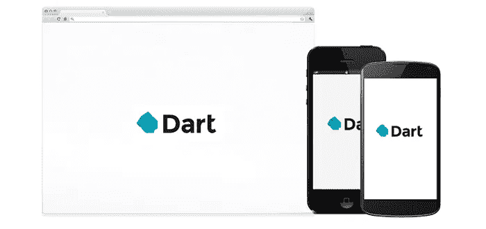
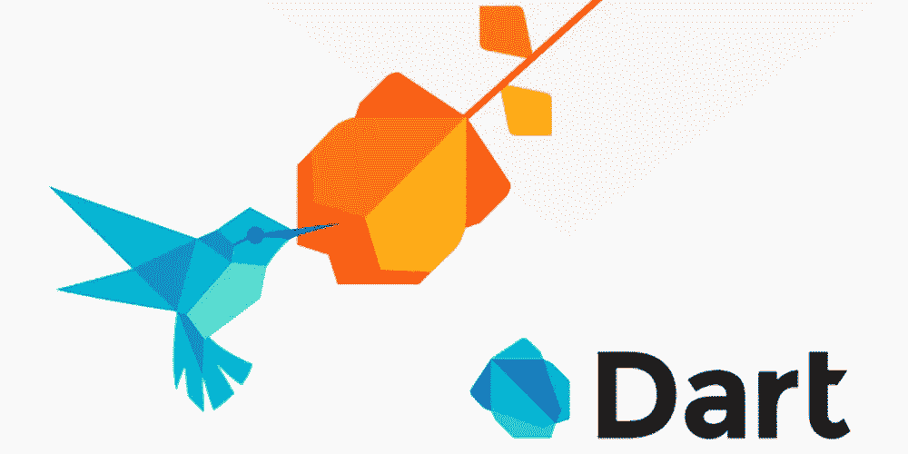

# 10 个最适合初学者的 Dart 教程[2023 年 3 月]—在线学习 Dart

> 原文：<https://medium.com/quick-code/top-tutorials-to-learn-dart-to-build-applications-262b946a3fc9?source=collection_archive---------3----------------------->

## 通过 2023 年面向初学者的最佳 Dart 教程，了解移动应用程序开发 Dart

Dart 是一种基于类的面向对象的语言，它简化了结构化现代应用程序的开发，从小脚本扩展到大应用程序，并且可以编译成 JavaScript 以在任何现代浏览器中使用。

Dart 反驳了 JavaScript 应该垄断 web 应用程序开发的观点。它可以用于服务器端(dartVM)和客户端(web 浏览器)来构建任何应用程序，从简单的脚本到成熟的 3D web 游戏。

> 披露:我们与本文中提到的一些资源有关联。如果你通过本页的链接购买课程，我们可能会得到一小笔佣金。谢谢你。

# 1.[飞镖和颤振:完整的开发者指南](https://www.udemy.com/dart-and-flutter-the-complete-developers-guide/?ranMID=39197&ranEAID=Fh5UMknfYAU&ranSiteID=Fh5UMknfYAU-6AqZNO.Zi1td5Vvqf0UeuA&LSNPUBID=Fh5UMknfYAU)

用 Flutter 和 Dart 构建移动应用需要知道的一切，包括 RxDart 和动画！

在本课程中，您将了解 Dart 语言及其主要功能。您将了解如何通过离线存储在用户设备上长时间存储信息。还将学习如何优化网络请求以提高移动网络的性能。本课程将教你用复杂的动画让你的用户开心，并通过多屏导航展示你的应用的功能。该课程还将介绍如何浏览数量惊人的 Flutter 文档，通过使用 RxDart 掌握流的反应式编程，实现 Google 官方 Flutter 团队倡导的高级设计模式，如何通过表单验证处理用户输入。您将学习构建开源 Dart 包，并将它们分发给其他开发人员。

在本课程中，您将学习:

*   用 Flutter 构建漂亮的多屏应用
*   了解在 Flutter 应用程序中加载和维护数据的不同方法
*   使用 Dart 创建和发布开源项目
*   了解如何构建支持离线的应用程序，并以令人难以置信的效率加载数据
*   理解阅读数量惊人的 Flutter 文档的最佳方法
*   使用 SQLite 在用户的物理设备上存储长期数据
*   掌握流并理解反应式编程来创建 Flutter 应用程序

# 2.[颤振:第 5 部分颤振和飞镖包](https://linkedin-learning.pxf.io/c/1137078/646189/8005?u=https%3A%2F%2Fwww.linkedin.com%2Flearning%2Fflutter-part-05-flutter-and-dart-packages&subId1=quickcode)

了解如何使用软件包来播放声音、整合动态响应的输入、自定义应用程序外观以及输出消息。

该课程包括:

*   使用 Flutter 和 Dart 包加速开发:木琴项目

在本课程中，您将接受 Dart 功能挑战，测试您的新颤振技能。

每一课都使用一个有趣的真实世界项目来说明，这是一个音乐木琴应用程序，您可以构建、定制并添加到您的 Flutter 文件夹中。

# 3.[Flutter&Dart——完整的 Flutter App 开发教程](https://www.eduonix.com/flutter-dart-the-complete-flutter-app-development-course/UHJvZHVjdC0zMjMyMDA=)

使用单一代码库构建 iOS 和 Android 应用程序—了解 Google 的 Dart 和 Flutter 移动开发框架。Flutter 是谷歌创建的新的跨平台移动开发框架，允许开发者构建 Android 和 iOS 应用。

# 4.[学飞镖:扑的第一步](https://www.educative.io/courses/learn-dart-first-step-to-flutter?affiliate_id=5088579051061248)

本课程将帮助您学习 Dart 的基础知识，并帮助您开始学习 Flutter。从今天开始学习。

该课程包括:

*   Dart 入门
*   数据类型和变量
*   经营者
*   达特的收藏
*   控制流语句
*   探索功能

# 5.[飞镖—初级班](https://click.linksynergy.com/deeplink?id=Fh5UMknfYAU&mid=39197&u1=quickcode&murl=https%3A%2F%2Fwww.udemy.com%2Fdart-beginners-course%2F)

了解如何创建基本的 Dart 程序。本课程面向没有编程经验的绝对初学者。Dart 是一种表达能力强、功能强大的语言，具有非常友好的学习曲线。这使它成为一种很好的入门语言。Dart 通过客户端优化的语言、丰富而强大的框架、灵活的工具，帮助您在所有屏幕上打造美丽、高质量的体验

本课程涵盖的概念有:安装 IDE、变量包、数组、流控制、函数、错误处理。

# 6.[学扑&飞镖打造 iOS &安卓应用](https://www.udemy.com/learn-flutter-dart-to-build-ios-android-apps/?ranMID=39197&ranEAID=Fh5UMknfYAU&ranSiteID=Fh5UMknfYAU-daDqihloUxWMaYWsaKUP_g&LSNPUBID=Fh5UMknfYAU)

用于构建原生 iOS 和 Android 应用的 Flutter SDK 和 Flutter 框架的完整指南。在本课程中，您将学习为 Android 和 iOS 构建引人入胜的原生移动应用，并使用谷歌地图、设备摄像头、身份验证等功能！

本课程涵盖:

*   macOS 和 Windows 的详细设置说明
*   对 Flutter、Dart 和窗口小部件背后的概念的全面介绍
*   内置部件概述以及如何添加自己的部件
*   调试提示和技巧
*   带有选项卡、侧抽屉和基于堆栈的导航的页面导航
*   状态管理解决方案
*   处理和验证用户输入
*   通过发送 Http 请求将你的 Flutter 应用连接到后端服务器
*   用户认证
*   添加谷歌地图
*   使用本机设备功能，如摄像头
*   添加漂亮的动画和页面过渡
*   如何将您的应用发布到应用商店

# 7.[飞镖——中级](https://click.linksynergy.com/deeplink?id=Fh5UMknfYAU&mid=39197&u1=quickcode&murl=https%3A%2F%2Fwww.udemy.com%2Fdart-intermediate-course%2F)

继续初学者课程。这门课程从初学者课程中断的地方开始。在本课程中，您将学习类、范围、包以及如何使用文件系统。我们还将探索泛型编程。本课程中的所有代码都可以在 GitHub 上免费获得。它涵盖了类、包、范围和文件系统。

# 8.[飞镖—进阶](https://click.linksynergy.com/deeplink?id=Fh5UMknfYAU&mid=39197&u1=quickcode&murl=https%3A%2F%2Fwww.udemy.com%2Fdart-advanced-course%2F)

学习 Dart 中的高级编程。使用进程、套接字、加密、压缩和数据库。要学习本课程，您至少应该对 Dart 编程语言有中级理解。

从处理、压缩、加密、套接字和数据库开始，了解如何使用 dart 中的高级概念和代码。

# 9.[快速轻松地理解 DART 编程的概念](https://www.eduonix.com/understand-concepts-of-dart-programming-quickly-and-easily/UHJvZHVjdC0zMjMyMDA=)

这是学习移动应用程序开发中最新、最棒的编程语言的实用方法。

本课程讲授安装、配置、IDE、工具等过程是多么简单。在 Dart 程序中。

本课程还涵盖了 dart 语言的面向对象方面。本课程将教你高级特性——异步编程、生成器、可调用类、隔离等。这些是特定于 Dart 的。

这是一个初级 Dart 编程课程。本课程帮助开发人员通过实践路线轻松学习 dart 的基础知识。

# 10.[Flutter&Dart——完整的 Flutter App 开发教程](https://click.linksynergy.com/deeplink?id=Fh5UMknfYAU&mid=39197&u1=quickcode&murl=https%3A%2F%2Fwww.udemy.com%2Fflutter-dart-the-complete-flutter-app-development-course%2F)

学习谷歌的 Dart 和 Flutter 移动开发框架，用单一代码库构建 iOS 和 Android 应用。

本课程旨在让您能够在短短六周内开始学习 Dart 编程语言(与 Flutter SDK 一起用于构建原生 iOS 和 Android 应用)和 Flutter 框架，并立即制作跨平台的移动应用。

它将带您一步一步地学习高清视频教程，并通过制作真实世界的应用程序(如地震、身体质量指数、天气、聊天应用程序等)来积累 Dart 和 Flutter 编程知识！

您将从头开始学习关于通用 Dart 编程语言的所有知识。即使你以前从未编程过，你也可以用 Flutter SDK 编写并理解所有你需要的编程概念，来开始构建健壮的、制作精美的 iOS 和 Android 应用。

本课程结束时，您将能够流利地使用 Dart 编程，并准备好制作自己的应用程序或开始作为 Dart & Flutter 应用程序开发人员的自由职业工作。拿到这个课程，你可以放心，这个课程是经过深思熟虑，精心编辑的。有漂亮的动画解释所有困难的概念，我总是可以回答学生的问题。

所以在课程结束时，你会完全理解:面向对象编程(OOP)的概念:类型系统，变量，函数和方法，继承，类和抽象类和接口。控制结构:使用 If/Else 子句、Switch 语句和逻辑来控制执行流程。数据结构:如何使用集合，比如列表和映射。软件设计:如何组织和格式化代码以提高可读性，以及如何实现模型视图控制器(MVC)设计模式。网络:如何进行异步 API 调用，从远程服务器存储和检索数据，以及使用 JSON 格式进行服务器通信。地图:如何制作位置感知的应用程序 Firebase 和实时数据库——构建动态、实时的应用程序，可以快速、轻松地扩展等等。

> 感谢您阅读本文。我们策划了更多主题的顶级教程，您可能想看看:

 [## 20 多门最佳数据结构和算法课程

### 学习最佳数据结构算法教程，包括系统设计用的最佳数据结构算法教程…

medium.com](/quick-code/top-tutorials-learn-data-structure-and-algorithm-for-an-interview-preparation-96e1f7518e26)  [## 10+适合初学者的最佳颤振教程——在线学习颤振

### 学习 Flutter，使用一个代码库，为初学者提供最好的 Flutter 教程，一起构建 Android 和 iOS 应用程序…

medium.com](/quick-code/best-video-tutorials-of-flutter-to-develop-application-for-android-ios-30909618f8e5)  [## 10+最佳科特林初学者教程-在线学习科特林

### 2021 年用最好的 Kotlin 初学者教程学习 Kotlin for android 开发

medium.com](/quick-code/top-tutorials-to-learn-kotlin-android-development-for-beginners-fad63af16996) 

披露:我们与本文中提到的一些资源有关联。如果你通过本页的链接购买课程，我们可能会得到一小笔佣金。谢谢你。