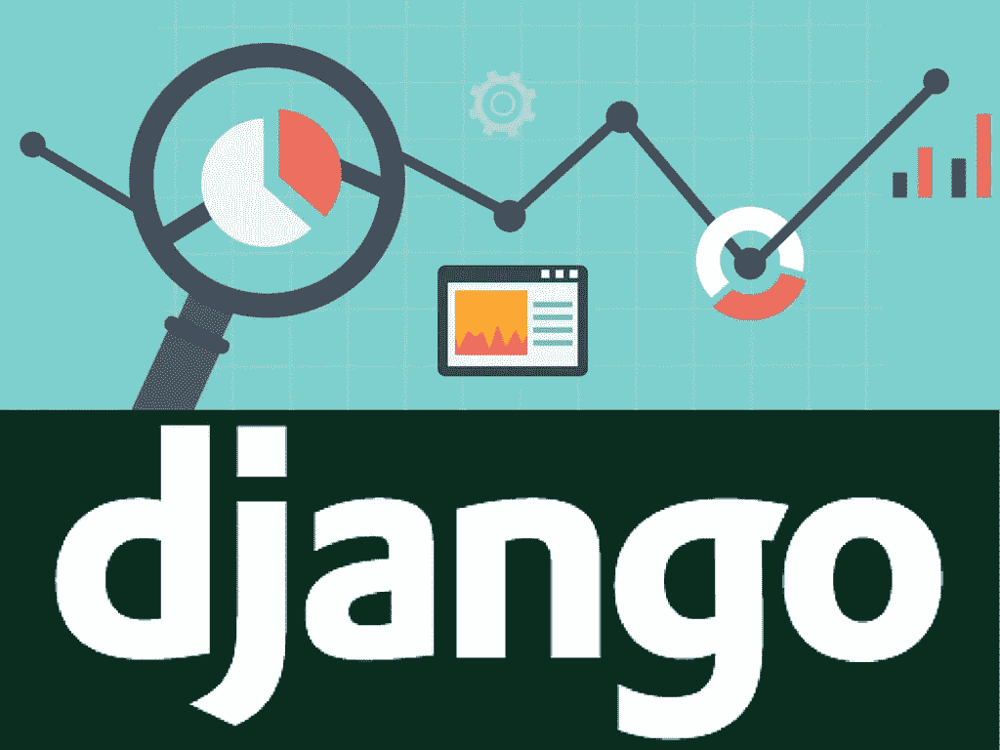
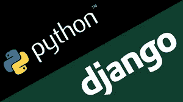

# 15 个最佳 Django 初学者教程[2023 年 3 月]——在线学习 Django

> 原文：<https://medium.com/quick-code/top-tutorials-to-learn-django-framework-for-python-beginners-fe1a9e315aa9?source=collection_archive---------0----------------------->

## 用 2023 年最好的 Django 初学者教程学习 Django 进行 web 开发。

Django 是一个用 Python 编写的开源 web 框架。它创建于大约十二年前，但在 2017 年 12 月，Django 2 发布了一套全新的特性和功能！

Django 对于 web 开发人员来说是一个令人惊叹的框架，因为它提供了数据库驱动的网站所需的基础设施，这些网站具有用户认证、内容管理、联系表单、文件上传等等。您可以使用 Django 框架并利用这些已经构建好的组件，而不是从头开始创建所有这些特性，并将您的时间集中在开发您的 web 应用程序上。我们先从以下课程开始学习 python Django 框架。

***披露:*** *如果您通过本页面的链接购买课程，我们可能会获得一小笔附属佣金。谢谢你。*

## 1. [Python 和 Django 全栈 Web 开发者训练营](https://coursesity.com/r/site/python-and-django-full-stack-web-developer-bootcamp-1)

学习用 HTML，CSS，Bootstrap，Javascript，jQuery，Python 3，和 Django 建立网站。

欢迎来到 Python 和 Django 全栈 Web 开发人员训练营！在本课程中，我们涵盖了使用 Python、Django 和许多其他 web 技术构建网站所需的一切知识。

它将教你用 Python 3 和 Django 构建伟大的 web 应用程序的最新技术。但是我们不仅仅教授这些，我们还教授你需要了解的前端技术，包括 HTML、CSS 和 Javascript。这门课程可以满足你的一切需求！当你开始成为一名 web 开发人员时，它将作为你的许多问题的有用参考。

以下是本课程中包含的主题的一小部分:

*   计算机编程语言
*   Django 基础
*   Django 模板
*   Django 表单
*   Django 管理定制
*   ORM
*   基于类别的视图
*   REST APIs
*   用户认证
*   HTML5
*   CSS3
*   java 描述语言
*   jQuery
*   引导 3 和 4
*   文档对象模型

Best Django Courses List

## 2.[在 Django 中构建 Web 应用](https://coursera.pxf.io/c/1137078/1213622/14726?u=https%3A%2F%2Fwww.coursera.org%2Flearn%2Fdjango-build-web-apps&subId1=BotTutorials)

在本课程中，您将学习 Django 如何通过模型对象与数据库通信。您将探索数据库访问的对象关系映射(ORM ),以及 Django 模型如何实现这种模式。

在本课程中，您将学习如何:

*   回顾 Python 中的面向对象(OO)模式。
*   了解基本的结构化查询语言(SQL)和数据库建模，包括一对多和多对多关系
*   理解 SQL 和 Django 模型之间的关系。

探索如何在 Django 中定义模型，然后您将学习构建数据模型并探索我们的应用程序的管理界面。

数据模型是 Django 与底层数据库交互以存储和检索数据的方式。

您将回顾 Python 面向对象，并查看 Django 中的通用视图功能。该课程通过扩展 Django 类来创建一个新的视图类，从而使用通用视图。

最后，您将了解 GET 和 POST 是如何工作的，表单是如何从 HTML 构建的，我们如何保护我们的应用程序不受跨站点脚本伪造(CSRF)的影响，以及如何处理 POST 后的浏览器刷新。

## 3.[学习 Django](https://linkedin-learning.pxf.io/c/1137078/646189/8005?u=https%3A%2F%2Fwww.linkedin.com%2Flearning%2Flearning-django-2&subId1=quickcode)

使用 Django，您可以在几个小时内将 web 应用程序从概念设计到发布。

该课程包括:

*   建立 Django 项目
*   与 Django 模型和管理一起工作
*   构建 URL 处理程序和视图
*   构建 Django 模板

在本课程中，学习使用 Django 所需的知识。

您将创建一个全新的 Django 项目，定义一个数据模型和字段，查询数据库，并使用框架内置的 URL 处理程序、视图和模板来构建后端的其余部分。

另外，学习如何结合 CSS 和 JavaScript 来增强 Django 模板的风格和可用性。

## 4.[姜戈项目:了解姜戈建筑项目](https://www.eduonix.com/courses/Web-Development/projects-in-django-learn-django-building-projects/UHJvZHVjdC0zMjMyMDA=)

在本课程中，您将学习什么是 Django，如何安装 Django，如何使用其终端，甚至如何使用这个令人惊叹的框架设计网站和应用程序。

本课程涵盖的五个项目从简单到复杂的网站和应用程序，您将掌握如何创建功能性网站，包括一个电子商务网站。

**项目 1:数据库驱动的网站—** 你将学习如何创建一个网站并将其与数据库结合，以及如何在你的 HTML 页面中使用动态代码。

项目 2: Django 应用程序 —你将学习如何构建一个完整的功能应用程序，以及如何让它与其他应用程序通信。

**项目 3:电子邮件发送表单** —在这个项目中，您将创建一个电子邮件表单，该表单将被发送到一个真实的电子邮件帐户，以了解 Django 中的消息传递是如何工作的。

**项目 4:电子商务网站** —在这个项目中，你将学习如何设计一个完整的电子商务网站，以及购物车和结账流程。

**项目 5:用户认证** —您将学习如何进行用户认证，用户可以注册、登录和修改他们的管理面板。

## 5. [Django: Python Web 开发被释放](https://www.educative.io/courses/django-python-web-development?affiliate_id=5088579051061248)

Django 是一个用 Python 编写的免费开源 web 应用框架。

该课程包括:

*   Django 简介
*   第一个 Django 应用
*   Django 的模板
*   Django 的静态文件
*   Django 模型
*   Django 表单
*   模型上的操作

在这个课程中，你将在初级和中级水平上学习 Django。

借助交互式小工具获得实践学习体验。在课程结束时，你将已经在 Django 中创建了一个可以在你的文件夹中使用的项目。

## 6.[姜戈:入门](https://pluralsight.pxf.io/c/1137078/424552/7490?u=https%3A%2F%2Fwww.pluralsight.com%2Fcourses%2Fdjango-getting-started&subId1=quickcode)

Django 是最流行和最成熟的 Python web 开发框架。它让你用更少的代码更快地构建更好的 web 应用。在本课程中，您将学习如何使用 Django 和 Python 构建您的第一个 web 应用程序。

该课程包括:

*   启动 Django 项目
*   创建简单的网页
*   建立数据模型
*   组合模型、视图和模板
*   网址和链接建设
*   模板、样式和静态内容
*   使用模型表单添加用户交互

在本课程《Django:入门》中，您将学习如何使用 Django 构建您的第一个 web 应用程序。首先，您将学习如何创建一个显示简短文本消息的简单页面。

接下来，您将了解如何使用 Django 模板创建 HTML 页面。

然后，您将接触到如何创建一个数据库模型，以便您可以存储和检索我们的数据，当然，您将看到如何在您的页面上显示这些数据。

最后，您将探索向您的站点添加 CSS 样式，以及如何使用表单使用户能够与我们的站点进行交互。

完成课程后，你将对 Django 的所有重要部分以及它们如何协同工作有一个很好的概述，这样你就可以继续在 Django 中建立自己的网站。

## 7. [Django 2 & Python |终极网络开发训练营](https://click.linksynergy.com/deeplink?id=Fh5UMknfYAU&mid=39197&u1=quickcode&murl=https%3A%2F%2Fwww.udemy.com%2Fthe-ultimate-beginners-guide-to-django-django-2-python-web-dev-website%2F)

建立三个完整的网站，学习后台和前端 web 开发，并使用 DigitalOcean 在线发布您的网站。

我相信我们通过实践学得最好。因此，在整个课程中，您将会看到编码测验和挑战，以便测试您刚刚学到的内容。这种形式可以让你真正学习 Django，而不是像机器人一样跟着学。

我们将在本课程中使用 python，因此如果您以前从未使用过 python，我们将从 Python 复习开始，让您快速入门(不需要其他 Python 经验)。

然后，我们将着手制作三个完整的网站:

1-字数统计网站:一个简单的网站，统计一篇文章中最常用的单词。您将学习如何:

*   安装 Django
*   创建新项目
*   使用 Django 的 URL 路由
*   提交和处理 HTML 表单数据

2——个人作品集:创建你自己的作品集，向潜在雇主展示你的简历、以前的项目和一个功能齐全的博客。您将学习如何:

*   将应用程序添加到项目中
*   使用数据库，包括 SQLite 和 Postgres
*   访问管理面板
*   创建超级用户
*   创建虚拟环境
*   用 Bootstrap 4 制作一个响应性网站
*   处理静态和媒体文件

3-产品搜索克隆:制作一个简化版的 awesome 网站来分享新的技术产品。您将学习如何:

*   使用认证系统(注册、登录、注销)
*   重用模板
*   创建模型关系
*   通过图标添加图标

我还将向您介绍 Git，这是一个非常棒的开发工具，允许您创建多个版本的代码。我将解释为什么这是有用的，并帮助您理解为什么您应该使用它。

此外，我将向您展示如何利用您在本课程中制作的项目，并通过虚拟专用服务器将它们发布到网上。

## 8.[使用 Django REST 框架构建自己的后端 REST API](https://coursesity.com/course-detail/build-a-backend-rest-api-with-python--django---beginner)

最后，在这个完整速成课程中创建 App +全功能用户数据库来构建 REST API。

欢迎学习如何使用 Django、Django REST Framework、Python、vagger、VirtualBox、Atom 和 ModHeaders 从头构建 REST API 的综合课程。

本课程教授的技能对于创造用户喜爱且离不开的成功产品是绝对必要的。

脸书、Instagram、Snapchat，应有尽有。这些应用都有自己的后端 REST APIs，每天处理数百万个调用请求。没有后端 REST API，就无法构建成功的应用。

它不仅对你正在构建的应用或 MVP 至关重要，而且你在本课程中学到的技能将使你在工作场所成为一名出色的开发者。

如果你是一名前端开发人员，并且你参加了这个课程，你将能够和你的同事“说后端”并且理解你所有项目的“幕后”发生了什么，增加你的自信并且赢得你的同事的尊重。

如果你是一名后端开发人员，本课程将有助于提高你在当今市场上最受欢迎的技术方面的技能:Django、Django REST 框架和 Python。

如果你是一个开发新手或者刚刚开始你的职业生涯，这个课程将为你建立你的投资组合和增加你的收入潜力提供一个非常实用的基础。

在本课程中，您将学习构建自己的 REST API 的最佳实践方式。

您将学习如何创建一个本地开发服务器并测试您的代码。

无论您是希望获得一些后端开发的经验，还是希望创建一个 REST API 来将您的应用程序想法变为现实，本课程都适合您。

在本课程结束时，我保证您已经构建了一个功能完整的 REST API，可以处理:

*   创建和更新用户配置文件。
*   登录和认证。
*   发布状态更新。
*   查看状态更新源。

Top Django Tutorials for Python Framework

## 9. [Python Django 开发到部署](https://click.linksynergy.com/deeplink?id=Fh5UMknfYAU&mid=39197&u1=quickcode&murl=https%3A%2F%2Fwww.udemy.com%2Fcourse%2Fpython-django-dev-to-deployment%2F)

学习 Python 并使用 Django 框架和 PostgreSQL 构建和部署一个房地产应用程序

本课程涵盖了 Django 框架的所有重要概念:

*   基本 Python(列表、字典、函数、条件等)
*   设置虚拟环境
*   安装和配置 Django
*   创建 Django“应用程序”
*   Postgres 设置(本地和远程)
*   模式规划、模型和迁移
*   管理员定制
*   自举集成
*   完整的搜索功能
*   用户认证
*   使用 Gunicorn 和 Nginx 部署到数字海洋

在本课程中，您将构建真正的工作应用程序。这将包括从一个虚构的公司获取一个需求列表，使用 Django 构建一个具有基本 html/css Bootstrap 4 主题的房地产应用程序。

在本课程中，您将学习:

*   学习 Python 及其核心基本语法
*   使用 Django 框架& Postgres 构建一个房地产应用程序
*   了解应用、模板、模型和迁移、管理员定制等
*   使用 Gunicorn 和 Nginx 构建虚拟环境并进行部署

## 10.[Django 1.11 终极初学者指南](https://click.linksynergy.com/deeplink?id=Fh5UMknfYAU&mid=39197&u1=quickcode&murl=https%3A%2F%2Fwww.udemy.com%2Fthe-ultimate-beginners-guide-to-django-python-web-dev-website%2F)

学习如何用 Django 和 Python 制作和发布网站。我们将制作三个完整的应用程序，并在网上发布一个。

欢迎来到 Django 初学者终极指南。如果你是 Django 的新手，或者在在线教程中迷路了，这是为你准备的课程。我将带你从一个完全的初学者到实际创建三个完整的 Django 网站。我们还将介绍如何发布您的站点。

本课程从 Python 复习开始。Django 是一个用 Python 编写的 web 框架。如果您是 Python 的新手，或者只是有点生疏，这一节将让您尽快熟悉 Python。做 Django 网站不需要成为 Python 专家，但是需要一个基础知识。在 Python Refresher 中，我将教你一个新概念，给你看一些例子，然后给你一个编码挑战，以确保你已经理解了这个概念。

我们要做的三个网站如下:

1.  猪拉丁翻译-一个简单的两页网站，把任何文本变成猪拉丁！创建这个网站会教你 Django 的基础知识。
2.  你的个人博客——不要使用 WordPress 或 Tumblr 来分享你的想法；创建自己的博客！这个网站将教你如何使用数据库和数据模型。我们还将介绍如何处理静态图像和用户上传的图像！
3.  Reddit 克隆——这是我们将在课程中制作的最先进、最复杂的网站。该网站重点关注创建用户帐户和身份验证，将向您传授本课程涵盖的更高级的主题。

本课程涵盖哪些关键主题？

*   URL 调度
*   基于函数和类的视图(FBV 诉 CBV)
*   如何开始一个新项目
*   如何在项目中创建应用程序，以及它们为什么重要
*   使用 Virtualenv 在虚拟环境中运行您的项目
*   在运行 Ubuntu Linux 的 VPS(虚拟专用服务器)上发布你的站点
*   使用模板
*   排除故障
*   格尼科恩
*   处理 GET 和 POST 请求
*   使用数据库和模型
*   管理界面
*   静态和用户上传的图像
*   身份验证和用户帐户

## 11. [Python 电子商务|构建 Django 电子商务网络应用](https://click.linksynergy.com/deeplink?id=Fh5UMknfYAU&mid=39197&u1=quickcode&murl=https%3A%2F%2Fwww.udemy.com%2Fpython-ecommerce-build-a-django-ecommerce-web-application%2F)

通过一步一步地学习构建自己的电子商务应用程序来启动您的业务。

本课程利用 Python 构建了一个使用 Django 框架的全功能电子商务网站和应用程序。

*   姜戈是为速度而生的。无论是在功能上还是在开发时间上。
*   一些顶尖的科技公司都建立在 Django 的基础上:Instagram 和 Pinterest 就是其中的两个例子。
*   Django 是用 Python 写的，因此它有助于你进一步掌握 Python。
*   来自全世界开发者的巨大支持。遇到 python 或 Django 的问题了吗？快速的谷歌搜索可能会得到答案(如果没有，我也会试着帮你)。

## 12.[用 Django 一步一步打造类似 Twitter 的应用](https://click.linksynergy.com/deeplink?id=Fh5UMknfYAU&mid=39197&u1=quickcode&murl=https%3A%2F%2Fwww.udemy.com%2Ftweetme-django%2F)

通过构建一个像 Twitter 一样工作的真实项目，逐步学习 Django 1.10、jQuery 和 Bootstrap。

社交媒体改变了我们相互交流的方式。社交媒体背后的力量让我们可以一起做令人惊奇的事情。背后到底是什么？良好的..这是简单的 web 应用程序概念，可以应用于您可能构建的所有 Web 应用程序。

在本课程中，我们将教你 Twitter 的工作原理。现在，Twitter 有数百名开发人员，所以我们实际上正在建立的是 Twitter 曾经的基础，通过学习更多的 Django，这绝对是最简单的事情。

我们要学什么:

*   Ajax + jQuery 来“发布”消息
*   直接标记用户(@user)
*   使用标签(#newtag)
*   集成自举
*   在引导模式中使用 Ajax 表单
*   Django Rest 框架
*   关注用户(通过 Ajax)
*   喜欢帖子(通过 Ajax)
*   转发帖子(通过 Ajax)
*   基于类别的视图
*   自定义模板标签
*   计算表单中的字符数
*   基本注册
*   还有更多！

## 13.Django 核心| Django 核心概念参考指南

深入探究用 Python 编写的 power Django 框架背后的核心概念。在 Python 3 中使用 Django 1.10。

在本课程中，我们将深入探讨各种 Django 概念，为以下主题提供全面的指导:

*   Django 模型
*   模型实例方法和属性
*   模型级字段验证
*   模型如何映射到数据库和主键
*   Django 表单和表单集
*   在 Django 中将数据与外键相关联
*   用 Django 主机处理子域
*   表单验证
*   模型形式
*   基于功能的视图(fbv)
*   基于类的视图(cbv)
*   Django 视图中的 CRUD(创建检索更新删除列表)
*   Django 模板
*   模板继承
*   模板快捷方式和过滤器
*   Django 翻译
*   还有更多！

## 14.[试试 Django 1.11——Python Web 开发](https://click.linksynergy.com/deeplink?id=Fh5UMknfYAU&mid=39197&u1=quickcode&murl=https%3A%2F%2Fwww.udemy.com%2Ftry-django-v1-11-python-web-development%2F)——【免费课程】

用 Django//Python 的#1 web 开发框架构建 Web 应用程序。

Python 是世界上最好的编程语言之一。有几个原因:

*   它经过验证且可扩展
*   这是开源的
*   物联网和树莓派
*   它引领着未来技术的变革

成熟且可扩展:Python 运行 Instagram 的后端。它还运行着 Pinterest、NASA、Mozilla 和无数其他网站。它可以伸缩。

物联网(IoT)和 Raspberry PI 连接设备正在一波接一波地到来。连接这些设备最简单的方法是使用 Raspberry Pi 并用 Python 编写代码。Python 是通用的，所以它使得用 Raspberry Pi 控制真实世界的对象变得简单。

如果你使用 Python，很有可能你需要互联网连接的数据，这些数据被*安全地*存储并且*可靠*。这就是姜戈的用武之地。Django 是一个网络框架，它可以处理你所有的数据，而且处理得比任何网络框架都好。

Django 是 Python 的首选 Web 框架，原因是:它对初学者来说足够简单，但对专业人士来说又足够强大。Instagram 通过 Django 的方式使用 Python。Pinterest 也是如此。还有美国宇航局。还有 Mozilla。这可能不是他们使用的唯一技术，但它是…他们所有人的支柱。

如果 Python 是底层技术的未来，Django 将是它的近亲，如果你喜欢 Python，Django 将很快成为你的朋友。

## 15.尝试 Django 1.10 |创建 URL 缩短服务 —【免费课程】

Django 是一个强大的 web 框架，它使得构建 web 应用程序变得很容易，这也是它成为#1 Python 库的原因。

通常，主题包括:

*   我们如何制作 Kirr url 缩短服务
*   Django 项目设置
*   基于类的视图(和一些基于函数的视图)
*   模型，模型表单，表单，表单验证
*   覆盖模型保存方法
*   在实时服务器上启动(通过 Heroku)
*   直接在 Django 字段上自定义验证
*   更多

django Framework(1.10 版):Instagram 和 Pinterest 等顶级网站使用的强大后端框架。Django 使得拥有一个强大的 web 应用程序来用于所有类型的项目变得更加容易。Django 是用 Python 编写的(也是世界上最流行的 Python 库之一)。

bootstrap(3.3 版):一个强大的前端框架，被全球数千个网站使用。Bootstrap 使得拥有一个响应迅速的 web 应用程序变得更加容易，因此它在任何移动设备和桌面计算机上都看起来棒极了。

Python 3:世界上最顶尖的编程语言之一。对专家来说足够强大，对初学者来说足够简单。为什么？它使用空格和换行符以及最少的特殊字符(比如！@#$;*)这意味着它比大多数编程语言更接近英语。

我们所有的教程都有一个简单的目标:通过一步一步的训练，让你快速地构建出真实的东西。

## 16.[试试 Django 1.9——建立一个博客，学习 Python 的#1 库](https://click.linksynergy.com/deeplink?id=Fh5UMknfYAU&mid=39197&u1=quickcode&murl=https%3A%2F%2Fwww.udemy.com%2Ftry-django%2F)——【免费课程】

学习一步一步地构建 Django 博客 Web 应用程序，并让您的项目进入现实世界。

三个项目教程帮助你在本月启动你的项目*。这个课程通过建立一个先进的现代博客来教你 Django 的基础知识；用 Python 编写的#1 Web 框架。*

在博客 API 部分学习 Django Rest 框架，构建一个强大的 RESTful API 服务。

> Django 很棒，上手也很简单。一步一步的教程是为了帮助你理解工作流程，让你开始做一些真正的事情，然后我们的目标是让你问问题…“我为什么做 X？”或者“我该怎么做？”这些是你不知道要问的问题。毕竟，问题会带来答案。

这是来自我们的编码企业家 Youtube 频道的 Try Django 1.9 教程系列的无广告版本。高分辨率视频下载也包括在内。

> 感谢您阅读本文。我们策划了更多主题的顶级教程，您可能想看看:

 [## 10+适合初学者的最佳颤振教程——在线学习颤振

### 学习 Flutter，使用一个代码库，为初学者提供最好的 Flutter 教程，一起构建 Android 和 iOS 应用程序…

medium.com](/quick-code/best-video-tutorials-of-flutter-to-develop-application-for-android-ios-30909618f8e5)  [## 10+初学者最佳 Flask Python 教程—在线学习 Flask

### 用 2022 年初学者的最佳 Flask 教程学习 Flask for web 开发

medium.com](/quick-code/top-online-tutorials-to-learn-flask-python-c2723df5326c)  [## 10+适合初学者的最佳 Python 教程—在线学习 Python

### 通过 2022 年面向初学者的最佳 Python 教程，学习 Python 以实现更轻松的 web 开发

medium.com](/quick-code/top-free-online-courses-to-learn-python-dcd22b03db62) 

***披露:*** *如果您通过本页面的链接购买课程，我们可能会获得一小笔附属佣金。谢谢你。*