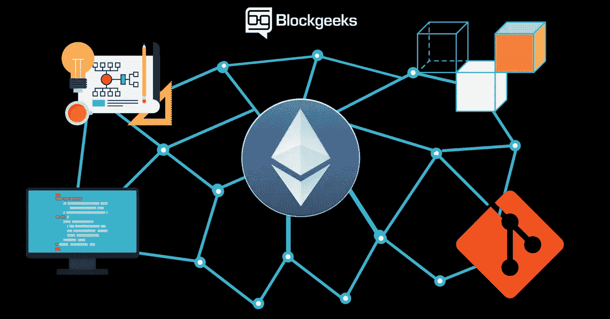
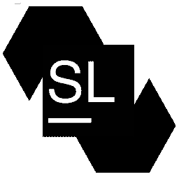
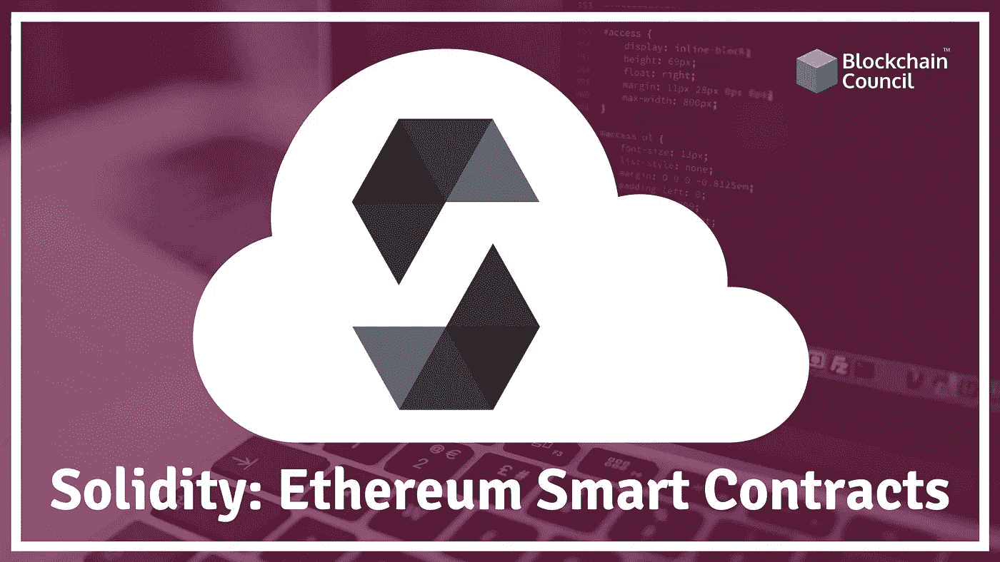

# 以太坊的 10 个最佳坚实度教程[2023 年 3 月]——在线学习坚实度

> 原文：<https://medium.com/quick-code/top-tutorials-to-learn-ethereum-solidity-at-different-level-23700a04ae80?source=collection_archive---------0----------------------->

## 用 2023 年最佳新手坚实度教程学习撰写智能合同的坚实度。

数字加密货币比特币是第一个区块链应用。比特币的成功导致了以太坊平台的诞生。鉴于比特币是“区块链应用”，以太坊是“区块链平台”。以太坊不仅支持分布式账本，还支持智能合约。

智能合同是具有代码的计算机程序，该代码实现两方或多方之间的合同协议(规则)。智能合约中编码的规则由现实世界中的事件触发，并自动执行一些预定义的操作。所有这些都不需要任何中介、web 服务器或后端数据库。

让我给你举个例子——易贝是买卖双方的中间人。买家每从卖家那里买一件东西，易贝就赚 100 美元。在分散投标应用程序中，智能合同可以取代中介 EBay。合同中编码的规则将是，当买方付款时，卖方将把物品运送给买方。资金将被保存在智能合同中，直到买方确认收到货物。一旦买方确认收到货物，资金将被释放给卖方。智能合同在以太坊网络节点上执行，而不是由中介(例如 Ebay)拥有的集中式服务器基础设施。节点是在网络参与者的计算机上运行的以太坊客户端进程。

任何人都可以编写以太坊去中心化应用程序，所以换句话说，你可以在公共以太坊网络上创建自己的类似加密货币的比特币或类似 Ebay 的应用程序。请注意，并非所有应用都适合区块链技术，例如，在区块链技术上建立一个静态网站并不是该技术的正确用途。

> Solidity 是一种用于编写智能合同的编程语言。本质上，把它想象成一种用代码控制银行账户的方式。有了 Solidity，我们可以编写模拟大众融资活动、彩票、贷款或任何其他类型的金融工具的应用程序。不要被学习“另一种”编程语言吓倒；众所周知，Solidity 与 Javascript 非常相似，对于任何有过 JS 经验的人来说都非常容易掌握。这门课程会给你所有你需要掌握的工具。

## 1.[用 Solidity 编译你的第一份以太坊智能合约](https://click.linksynergy.com/deeplink?id=Fh5UMknfYAU&mid=39197&u1=quickcode&murl=https%3A%2F%2Fwww.udemy.com%2Fcompile-your-first-ethereum-smart-contract%2F)

了解如何使用 Geth、Solidity 和 Mist 建立自己的私有区块链节点。

我将向您介绍如何在本地测试环境中编译和运行您的第一个智能契约。

这将包括

1.  安装 Solidity，用于将合同编译成可以在区块链上部署的字节码。
2.  安装 Geth，它运行一个本地节点，还有一个 JavaScript 命令行，可以用来与区块链对话。
3.  创建一个私有的本地节点，这样就可以不花钱实验了。
4.  创建几个测试帐户
5.  将智能合约部署到测试区块链中
6.  调用我们的智能合约的函数来查看它是否在工作。

我们不承保:

1.  深度固化编程，仅展示如何设置环境、编译和与合同交互。
2.  用于编程的工作流和 IDE

## 2.[区块链专业化](https://coursera.pxf.io/c/1137078/1213622/14726?u=https%3A%2F%2Fwww.coursera.org%2Fspecializations%2Fblockchain&subId1=BotTutorials)

这种专业化引入了区块链，这是一种革命性的技术，可以在没有任何中介的情况下实现数字资产的点对点传输，预计将与互联网一样具有影响力。更具体地说，它为学习者在以太坊区块链上编程做准备。这四门课程为学习者提供(I)基本区块链概念的理解和工作知识，(ii)设计和实施智能合同的技能集，(iii)在区块链开发分散应用的方法，以及(iv)关于正在进行的特定行业范围区块链框架的信息。

该专业化涵盖了一系列基本主题，从区块链技术的加密基础到在私有以太坊区块链平台上实现分散式应用。

它非常适合参与开发和实现区块链应用程序的程序员和设计人员，以及任何有兴趣了解其潜力的人。

在本课程中，您将学习:

*   了解智能合同，这是区块链的核心理念和计算模型，可实现自动化、自治、可扩展性和透明性。
*   如何设计和编程智能合同和分散式应用程序？
*   对新兴的区块链技术有一定的理解和应用知识。
*   如何考虑创新的应用模式，利用区块链技术。

## 3.[以太坊:构建区块链去中心化应用](https://linkedin-learning.pxf.io/c/1137078/646189/8005?u=https%3A%2F%2Fwww.linkedin.com%2Flearning%2Fethereum-building-blockchain-decentralized-apps-dapps&subId1=quickcode)

您有兴趣编写区块链应用程序或将加密货币集成到您现有的应用程序中吗？

在本课程中，您将学习:

*   如何在以太坊区块链环境中工作？
*   关于以太坊开发的关键编程概念和技术。
*   如何使用一些 web 编程语言构建分散式应用程序。

该课程向广泛熟悉编程概念的移动和 web 开发人员展示了如何在以太坊区块链环境中工作。

随着您逐步创建智能合约、web 用户界面以及链接这两者所需的 JavaScript，本课程将帮助您熟悉围绕以太坊开发的关键编程概念和技术。

了解什么是以太坊区块链，以及它与比特币有何不同。获得 Solidity 的介绍，Solidity 是一种用于在以太网上编写智能合同的编程语言。

此外，学习如何使用一些您已经熟悉的 web 编程语言来构建分散式应用程序(DApps)。

## 4.[利用 Solidity 创建以太坊&区块链应用](https://www.eduonix.com/create-ethereum-blockchain-applications-using-solidity/UHJvZHVjdC0zMjMyMDA=)

了解以太坊和基于区块链的应用以及如何对它们进行编程。一步一步的过程是用来显示和解释这些主题的每一个方面。

通过本课程很好地理解以下概念:

*   什么是坚固？
*   如何创建区块链应用？
*   什么是区块链？
*   区块链是如何工作的？
*   比特币是什么？
*   以太坊是什么？
*   编写区块链程序
*   什么是加密货币？
*   加密货币是如何工作的？
*   替代加密货币
*   密码学基础

## 5.[在以太坊区块链上开发应用](https://pluralsight.pxf.io/c/1137078/424552/7490?u=https%3A%2F%2Fwww.pluralsight.com%2Fcourses%2Fethereum-blockchain-developing-applications&subId1=quickcode)

学习为以太坊平台开发应用。从区块链和以太坊的基础开始，然后学习使用 Solidity 编程语言编写智能合同的核心技能。

该课程包括:

*   以太坊协议
*   智能合同入门
*   可靠性编程语言
*   以太坊 API
*   块菌框架
*   开发高级智能合同
*   以太坊的网络应用

在这个课程中，在以太坊区块链上开发应用，你将获得为以太坊开发去中心化应用的能力。

首先，你将学习区块链和以太坊平台的基础知识。

接下来，您将了解如何使用 Solidity 开发智能合约，如何与智能合约交互，以及如何为以太坊项目创建高效的开发环境。

最后，您将探索如何开发与以太坊区块链交互的 web 应用程序。

完成本课程后，您将具备开发公共和私有网络应用程序所需的以太坊平台的技能和知识。

## 6.[成为区块链开发者](https://imp.i115008.net/c/1137078/788805/11298?u=https%3A%2F%2Fwww.udacity.com%2Fcourse%2Fblockchain-developer-nanodegree--nd1309&subId1=quickcode)

对区块链开发商的需求正在飙升。在这个项目中，你将使用比特币和以太坊协议，为现实世界的应用构建项目，并获得在这个动态空间中工作的基本技能。

在本课程中，您将学习:

*   通过使用 Node.js 和 Leveldb 创建您自己的私有区块链，了解区块链数据模型的基本工作原理。
*   如何利用以太网智能合同将你的区块链技能提升到第二代区块链服务？
*   区块链架构和先进的概念，如隐私，安全和分散式文件管理。
*   如何通过开发分散式应用程序(Dapp)来提升您的区块链技能集，该应用程序将基于外部触发器执行操作并处理支付。

了解区块链平台的基本原理。创建您自己的私人区块链，并使用区块链身份保护数字资产。

探索以太坊平台，利用 Solidity 和智能合约开发自己的去中心化 app。

## 7.[提升你在区块链中的技能](https://linkedin-learning.pxf.io/c/1137078/646189/8005?u=https%3A%2F%2Fwww.linkedin.com%2Flearning%2Fpaths%2Fadvance-your-skills-in-the-blockchain&subId1=quickcode)

特别是对于 IT 行业的人来说，彻底了解区块链的工作方式以及关键的开发技能是什么，可以让你走上一条新的职业发展道路。

在本课程中，您将学习如何:

*   掌握基本的区块链和加密货币概念。
*   了解固体和以太坊的开发能力技能。
*   iOS 版区块链编程大师。

了解区块链以及分散式加密数据存储对企业和社会的影响。

您将了解区块链以及分散式加密数据存储对商业和社会的影响

了解如何使用一些您已经熟悉的 web 编程语言来构建分散式应用程序(DApps)。

本课程将教你如何用 Solidity 构建一个简单的基于契约的应用。了解如何使用 Swift 在 iOS 框架中实施基于区块链的存储和加密。

您将了解加密货币如何创建、交易和挖掘的基础知识。探索加密货币的一些基本安全要求，并就如何降低安全风险提供指导。

## 8.[以太坊游戏开发:在区块链上构建游戏](https://click.linksynergy.com/deeplink?id=Fh5UMknfYAU&mid=39197&u1=quickcode&murl=https%3A%2F%2Fwww.udemy.com%2Fethereum-blockchain-game-development%2F)

使用 Solidity 和其他工具，构建一个有趣的游戏！在以太坊区块链开发中获得更高的熟练程度。

在这个以太坊游戏开发课程中，我们将帮助你缓解你在以太坊区块链上构建一些实用的东西时遇到的所有问题。

我们将帮助你在以太坊区块链上构建一个井字游戏，这样你就可以成为一名更熟练的以太坊区块链开发者。接下来，你将在更高级的层面上使用以太坊区块链。

这是纯粹而简单的目标，但是，这需要涵盖以太坊区块链开发之旅的每个元素，我们相信您会发现这很有趣。

## 9.[学习可靠性:智能合约的编程语言](https://click.linksynergy.com/deeplink?id=Fh5UMknfYAU&mid=39197&u1=quickcode&murl=https%3A%2F%2Fwww.udemy.com%2Fbest-solidity-tutorial-course-ethereum-blockchain-development%2F)

在线最佳 Solidity 教程，用于在以太坊网络上构建基于区块链的去中心化应用 DApps。

Solidity 是一种编写智能合约的编程语言，运行在区块链上的以太坊虚拟机上。它是一种面向契约的高级语言，其语法类似于 JavaScript，旨在针对以太坊虚拟机。

在本课程中，您将学习与 Solidity 相关的所有内容，以便在以太坊上构建基于智能合约的区块链应用。

*   以太坊、智能合约&区块链是什么？
*   什么是 Solidity &以太坊虚拟机？
*   如何安装和设置 Solidity 开发环境？
*   如何撰写第一份基本智能合同？
*   数据类型、控制结构、函数、继承、数学运算等。
*   如何在 Solidity 中部署和测试智能合约？
*   建筑 2 应用

1.  区块链投票
2.  筹款申请

本课程将使您能够使用 Solidity 在以太坊上构建任何类型的区块链应用程序，Solidity 是编写以太坊区块链最常见的语言。

## 10.[以太坊开发者大师班:构建真实世界项目](https://click.linksynergy.com/deeplink?id=Fh5UMknfYAU&mid=39197&u1=quickcode&murl=https%3A%2F%2Fwww.udemy.com%2Fethereum-masterclass%2F)

循序渐进:使用最新的 Solidity，Web3js，Truffle，TestRPC 和 MetaMask 在区块链上进行真实世界的 dApps。

以太坊开发者大师班:构建真实世界项目——是在线最完整的以太坊区块链开发课程，帮助您使用 solidity 成功构建复杂的、真实世界的、基于以太坊的分布式应用。

本课程非常适合那些想要开始区块链、可靠性和以太坊之旅，同时构建大型且有意义的东西的人。那些对高级编码(包括成熟的工作流和技术)感兴趣的人会非常喜欢这门课程。

**1。**在本课程中，我们将向您详细介绍以太坊区块链开发生态系统的方方面面，帮助您使用 Solidity 构建复杂的去中心化应用。

**2。**在本课程中，我们将指导您在以太坊上创建和推出您自己的初始硬币产品，然后您将了解它在技术层面上是如何工作的。

**3。**通过参加并完成本课程，我们将指导您完成各个步骤，帮助您成功构建自己的完全分散式 exchange，并将其部署到 Rinkeby-Testnet。

## 11.[成为一名以太坊、扎实的区块链开发者](https://click.linksynergy.com/deeplink?id=Fh5UMknfYAU&mid=39197&u1=quickcode&murl=https%3A%2F%2Fwww.udemy.com%2Fgetting-started-with-ethereum-solidity-development%2F)

在以太坊区块链上从头开始开发您的第一个分散式应用程序。

本课程是使用 Solidity 语言和 Truffle 构建框架在以太坊区块链上开发分散式应用程序(Dapp)的完整介绍。

不需要了解任何关于区块链的知识，你只需要有一些基本的软件开发经验。无论你是否已经编写了一些后端、web 或移动应用程序的代码，通过这门课程，你应该足以成为一名区块链开发者。

区块链最近风靡一时，围绕它有很多理论上的或预期的讨论，但本课程将帮助你用实际代码来构建你的第一个分散式应用程序。这种技能可以让你获得一份区块链开发者的实际工作，这种技能现在需求量很大。

你是否曾经回首 90 年代，认为你会喜欢成为网络革命的一部分。好了，别做梦了:区块链就在眼前，它有望比网络甚至移动革命更大。

*   我们简要介绍了区块链的理念，既作为加密货币系统，也作为开发平台
*   然后我们将解释区块链是如何工作的，它们的主要组成部分是什么，以及它的生态系统是如何构成的
*   之后，我们快速回顾一下您需要了解的主要加密工具
*   我们继续描述完美的开发环境，包括大多数专业区块链开发人员使用的工具
*   本课程最大的部分致力于指导你完成链表分布式应用的迭代创建、开发、测试和部署

你会遇到的工具

*   当然是以太坊
*   Metamask Chrome 扩展
*   稳健的智能合同语言
*   Truffle 构建和测试框架(Truffle 4)
*   加纳切以太坊节点仿真器
*   Github 页面
*   Atom(文本编辑器)
*   林克比测试网络

## 12.[以太坊:去中心化应用设计&开发](https://click.linksynergy.com/deeplink?id=Fh5UMknfYAU&mid=39197&u1=quickcode&murl=https%3A%2F%2Fwww.udemy.com%2Fethereum-dapp%2F)

使用 Web3J、TruffleV4、MetaMask、Ganache、Solidity ++在未来两周内开发一个完整的 DAPP | ICO | Setup 专用网络。

要构建以太坊分散式应用程序，您需要学习一些技巧。本课程可以帮助您学习所有这些技能，但是本课程有一些先决条件:

1.  Javascript 或 Java 经验。课程不会教 Javascript
2.  对 Javascript/HTML DOM 模型的基本理解
3.  可访问 PC 或 MAC，并可访问互联网(至少需要 4GB，最好是 6 GB)
4.  适应新软件安装和动手编程

本课程采用“边做边学”的方法。鼓励学生在每次讲座后自己尝试这些技术的各个方面。讲座中讨论的几乎所有概念都通过代码示例等方式展示出来。讲座中使用的演示代码可以从 *GitHub* 下载，这样学生可以修改代码来尝试新事物。

分散式应用程序的前端通常使用 Javascript/HTML/CSS 创建为单页面或桌面应用程序。因为有多种 Javascript 框架，所以决定保持讲座独立于任何特定的 JS 框架。学生可以自由选择使用任何一个或多个 JS 框架。

每个部分的多个测验将验证学生的知识。编码练习将帮助他们更好地理解概念并获得信心。

课程分为 10 个部分:

*第一节*

介绍区块链和以太坊技术

*第 2 部分*

深入探讨以太坊区块链技术

概念，钱包

*动手:*装钱包，采醚，交易

*第 3 部分*

以太坊客户端

*动手:*安装 geth，尝试 Geth 命令的&选项

第 4 节获取 Javascript 管理 API

实践:通过编写脚本，尝试各种 API i 控制台

第五部分

Web3 API

*动手:*开发用于在 TestNet 上执行合同的 Javascript/HTML 前端

第 6 部分

为智能合同开发做准备

了解用于开发智能合同的各种工具和框架

*动手:*安装:Visual Studio，松露框架 4.0 版，Ganache，Meta-Mask

第 7 部分

智能合同开发的可靠性

学习固体语言的概念

*动手:*在 Solidity 中编写简单的契约+编写测试用例进行测试

第 8 部分

可靠性和基础设施模式

*动手:*编写智能合同

端到端应用程序演练

*动手:* DIY 项目&解决方案

第 9 部分

涵盖了专用网络的设置

管理专用网络的工具

第 10 部分

*关于初始硬币发行的一切& ERC20* 创造和发行硬币的标准

学生将学习如何创建一个硬币，并在常用工具中管理它。

## 13.[以太坊区块链开发者:使用 Solidity 构建项目](https://click.linksynergy.com/deeplink?id=Fh5UMknfYAU&mid=39197&u1=quickcode&murl=https%3A%2F%2Fwww.udemy.com%2Fblockchain-developer%2F)

最大、最深入的以太坊区块链开发课程之一，帮助你使用 Solidity 构建项目。

以太坊区块链开发者:使用 Solidity 构建项目——是最大、最深入的以太坊在线开发课程之一。该课程包含许多实践练习，这将有助于你将学到的所有知识付诸实践，创造出有价值的东西。

通过学习本课程，您将能够在实践层面上使用以太坊区块链，一步一步的指导您完成整个过程。本课程体现了我们在实践中学习的精神，因为完成本课程后，您将拥有自己的项目。

**1。**我们正处于以太坊技术的早期采用阶段，因此您目前有机会在以太坊技术进入下一个采用阶段之前就开始接触并精通它。

**2。对于新技术来说，成为社区的一员是至关重要的，以太坊社区是最友好的社区之一，因此在本课程中，你可以通过创建自己的项目与他们进行有效的交流。**

**3。区块链开发商不多，但需求巨大！如果你决定继续在这个领域前进，你可以放心，有公司在寻求你的技能。**

## 14.[以太坊和坚固性:完整的开发者指南](https://coursesity.com/r/site/code-with-ethereum--solidity-the-complete-developer-guide)

使用以太坊、Solidity 和智能合约来构建基于区块链的生产就绪型应用。

开发社区仍在寻找使用以太坊创建新的令人兴奋的应用程序的最佳方式。我花了大量的时间来研究和创建从 Javascript 与以太坊交互的最佳实践。我怎么夸张都不为过；本课程将向您展示使用以太坊创建生产就绪型应用程序的最佳且最容易重复的模式。

> 感谢您阅读本文。我们策划了更多主题的顶级教程，您可能想看看:

 [## 面向初学者的 6 门最佳加密货币交易课程—在线学习加密货币交易

### 学习加密货币交易，了解如何用最好的加密货币课程进行加密货币交易

medium.com](/quick-code/the-best-online-guide-to-learn-about-cryptocurrency-ec2560cd570e)  [## 10+最佳 Swift 初学者教程—在线学习 Swift

### 学习 Swift，在 2022 年成为拥有最佳 Swift 初学者教程的高级移动开发者。

medium.com](/quick-code/top-tutorials-to-learn-ios12-swift-4-ed1c934535e4)  [## 面向初学者的 10+最佳加密货币课程—在线学习加密货币

### 学习加密货币课程，在 2022 年为初学者提供最佳加密货币教程，以增加您的利润

medium.com](/quick-code/top-10-online-courses-to-learn-about-cryptocurrency-in-2018-1486628655b5) 

*披露:如果你通过本页的链接购买课程，我们可能会得到一小笔会员佣金。谢谢你。*