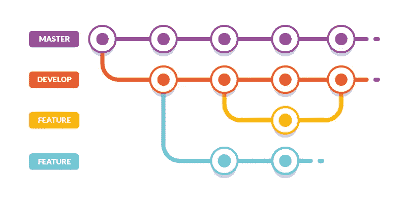
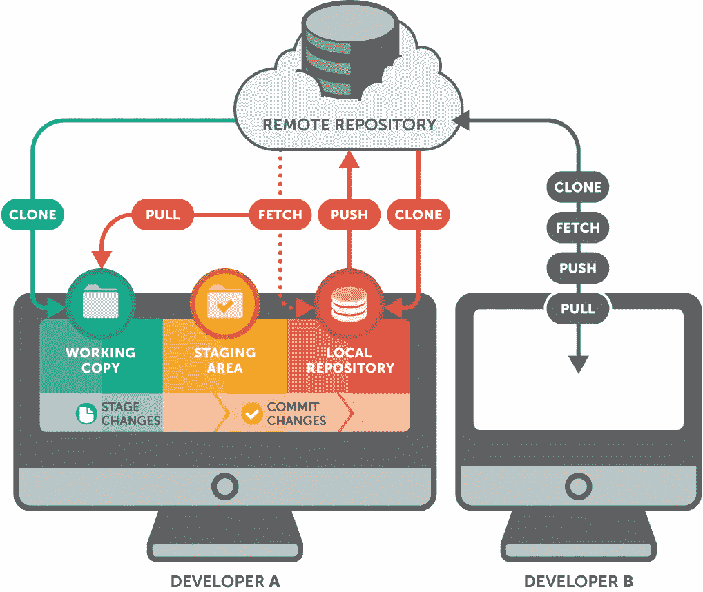
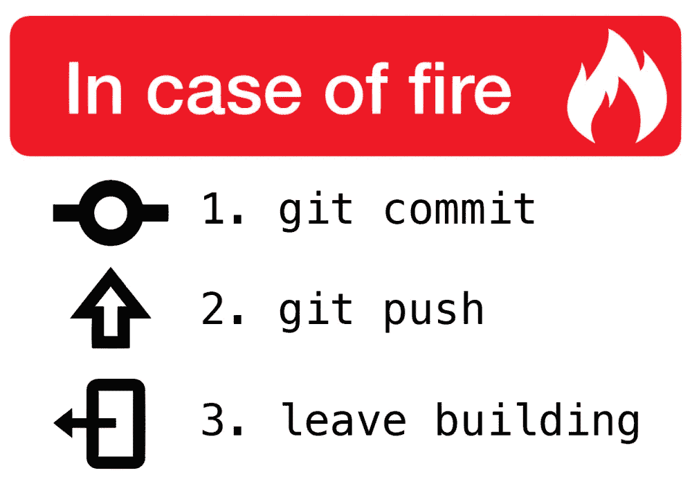

# 初学者的 10 个最佳 Git 教程[2023 年 3 月]-在线学习 Git

> 原文：<https://medium.com/quick-code/top-tutorials-to-learn-git-for-beginners-622289ffdfe5?source=collection_archive---------1----------------------->

## 用 2023 年最好的 Git 初学者教程学习 Git 进行代码管理和版本控制。

Git 是最初由 Linus Torvalds 创建的开源软件。Git 管理大型和小型项目的团队文件。这使得团队能够持续改进其产品。它被大多数主要的技术公司使用，并被认为是许多现代编程和 It 工作的知识。它是 DevOps、持续交付管道和云原生计算的核心组件。您还可以使用 Git 来管理您正在编写的那本书的许多持续改进的修订版。

以下是由时代专家整理的顶级 git 教程列表中的一些课程，您应该参加这些课程来深入了解 git 开发。基于评级、评论和质量，由专家策划的*顶级 git 教程列表*。让我们从以下课程开始学习 git。

## 1.[Git Complete:Git 的权威分步指南](https://coursesity.com/r/site/git-complete-the-definitive-step-by-step-guide-to-git)

通过简单易懂的示例，使用 Git 源代码控制一步步从零到英雄。成为下一个 Git 专家。

***课程评分:4.3 满分 5.0 (*** ***共 8612 分)***

本课程旨在成为 Git 的综合方法，这意味着不需要预先的知识或经验，但学生最终将对 Git 和相关源代码控制概念有非常扎实的理解和实践经验。

课程介绍和概述介绍了本课程和 Git 源代码控制系统，并为课程的其余部分做好了准备。介绍完之后，我们做的第一件事就是 Windows 和 Mac 的 Git 安装。

快速入门快速(15 分钟)动手介绍 Git。我们首先注册 GitHub，在那里创建一个存储库，制作一个本地副本(克隆)，本地更改(添加/提交)，然后用我们的更改更新 GitHub(推送)。

在基本命令中，我们将介绍启动由 Git 管理的新项目(或为现有项目启用 Git)所需的所有基本命令，一直到提交，包括常见的文件操作，如移动和删除文件。我们还将介绍如何排除意外提交的错误文件，以及如何查看您的存储库的历史。

有了坚实的基础，我们探索在 Git 中进行比较的方法，包括所有不同的本地状态、提交之间以及本地和远程存储库之间的比较。

我们非常重视 Git 中的分支和合并。我们从简单的“快乐之路”开始，学习“快进”合并以及如何控制它们。它遍历常见的“自动”合并。最后，我们故意制造麻烦，这样我们就可以用可视化合并工具逐步解决冲突合并。

有了分支和合并的坚实基础后，我们将讨论一个更复杂的主题，重定基础。在那一节中，我们将介绍几个重定基础的例子，包括如何解决重定基础的冲突。

在“存储”部分，当我们处理更紧迫的问题时，我们会保存正在进行的工作，然后从我们停止的地方继续。

在标记部分，我们标记项目中的重要里程碑或版本。我们稍后还会使用这些标签来比较重要里程碑之间的差异。我们也看看如何在 GitHub 中使用标签。

所有工具都有*安装*和*配置*部分，以确保没有人被落下。

Top Git Tutorials

## 2.[用 Git 进行版本控制](https://coursera.pxf.io/c/1137078/1213622/14726?u=https%3A%2F%2Fwww.coursera.org%2Flearn%2Fversion-control-with-git&subId1=BotTutorials)

Git 版本控制课程为您理解 Git 版本控制系统提供了坚实的实践基础。

***课程评分:4.7 分满分 5.0 (*** ***697 分总评分)***

在本课程中，您不会学到关于 Git 的所有知识，但是您将对该技术建立一个强有力的概念理解，并且之后能够自信地深入挖掘您感兴趣的任何主题。本课程假设您之前没有 Git 知识，但是如果您有 Git 经验，您会发现本课程既有用又有挑战性。如果你目前“只知道足够危险的 Git”，这一点尤其正确。

这门课程有两条路径。两者都非常依赖动手实验室。一种方法假设您有使用命令行界面的经验，另一种方法使用 Sourcetree 图形客户端。如果您不熟悉命令行，我们强烈建议您使用 Sourcetree 路径。最终，您可能希望经历这两种途径，这样您就可以决定使用哪种工具来完成特定的任务。

在本课程中，您将学习:

*   创建第一个存储库
*   分支和合并
*   Git 工作流

## 3. [Git 基础训练:基础知识](https://linkedin-learning.pxf.io/c/1137078/646189/8005?u=https%3A%2F%2Fwww.linkedin.com%2Flearning%2Fgit-essential-training-the-basics&subId1=quickcode)

了解如何使用 Git(流行的开源版本控制软件)来管理几乎所有项目的源代码。

课程包括:

*   Git 是什么？
*   安装 Git
*   入门指南
*   Git 概念和架构
*   对文件进行更改
*   在实际项目中使用 Git
*   撤消更改
*   忽略文件

在本课程中，您将探索版本控制系统和 Git 架构背后的基本概念。

通过一步一步的方法，他展示了如何安装 Git，并展示了实现高效代码管理的命令。

了解如何添加、更改和删除存储库中的文件。查看以前提交的日志；和比较文件的版本。

另外，了解如何撤销对文件的更改并忽略 Git 存储库中的某些文件。

## 4. [Git 和 GitHub 基础知识](https://www.eduonix.com/courses/Software-Development/git-and-github-essentials/UHJvZHVjdC0zMjMyMDA=)

从头开始学习 Git、Github 和版本控制，包括如何在这个 Git & Github 在线课程中安装 Git。

在本课程中，您将学习:

*   Git 和 Github 的介绍，包括如何在你的 Linux 系统上安装 Git。
*   Git 的第一步。
*   如何开始使用远程存储库？
*   如何处理不同的文件？
*   如何重温历史，分支和从失败中恢复。
*   如何定制 Git 以充分利用它，包括使用子模块。
*   Github 的详细介绍。
*   如何托管自己的 Github 库？
*   了解并运用最佳实践。

使用 Linux 作为示例系统，HTML 作为主要编程语言，本课程将引导您穿越 Git 和 Github 的波涛汹涌的大海，帮助您学习如何掌握这些出色的技术，并使用它来简化您的编程生活。

## 5.[Git 指南&版本控制](https://www.educative.io/courses/guide-to-git-and-version-control?affiliate_id=5088579051061248)

本课程是对版本控制和 Git 的全面指导，Git 是软件工程师最常用的工具之一。

该课程包括:

*   在本地配置 Git
*   分支
*   合并分支
*   远程存储库
*   重建树枝基

在本课程中，您将学习版本控制的基础知识，Git 如何对您的项目有用，以及 GitHub 如何作为软件开发平台。

您将学习如何为您自己的项目设置 Git，随着课程的进行，您将涵盖更复杂的主题，包括 Git 提交、分支、合并和重定基础。

在本课程结束时，你将拥有一项伟大的新技能，这项技能将贯穿你的整个职业生涯。

## 6.[Git 入门](https://pluralsight.pxf.io/c/1137078/424552/7490?u=https%3A%2F%2Fwww.pluralsight.com%2Fcourses%2Fgetting-started-git&subId1=quickcode)

本课程将通过一个实践性的、循序渐进的项目教你 Git 的日常基础知识。来看看为什么全球领先的公司依靠 Git 来提高代码项目和协作的速度、透明度和可靠性。

该课程包括:

*   使用 Git 开始运行
*   日常 Git 的基本命令
*   日常 Git 的扩展命令

在本课程《Git 入门》中，您将学习流行的版本控制系统 Git，以及为什么它在创建更好的项目中起着重要作用。

首先，您将看到理解 Git 的基础知识。接下来，您将探索 Git 如何在一个有趣且简单的逐步体验中提升他的项目。

最后，您将发现 Git 中日常使用的通用和扩展命令。当你完成本课程时，你将有 Git 作为项目版本控制系统的工作知识。

## 7.[学习 Git](https://www.pjatr.com/t/TUJGR0lLR0JHR0pMSUtCR0ZISk1N?sid=quickcode&url=https%3A%2F%2Fwww.codecademy.com%2Flearn%2Flearn-git)

Git 是最流行的版本控制工具——开发人员使用它来保存他们工作的所有相关版本，以避免类似的时刻。Git 还让开发人员可以轻松地与其他人协作和共享工作！

在本课程中，您将学习:

*   Git 及其一些核心特性的介绍。
*   撤销对 Git 项目所做更改的不同方式以及何时使用它们。
*   如何用分支管理一个项目的多个版本？
*   Git 与远程协作的介绍，拉和推。

本课程将教你一个基本的工作流程和 Git 的核心特性，撤销变更或保存项目多个版本的不同方法，以及如何与其他开发者协作。

## 8.[获得一份网络开发人员的工作:掌握现代工作流程](https://coursesity.com/course-detail/git-a-web-developer-job-mastering-the-modern-workflow)

学习 Git，GitHub，Node.js，NPM，面向对象的 JavaScript，ES6，webpack，Gulp，BEM 和工作面试技巧。

***课程评分:4.7 满分 5.0 (*** ***共 5117 分)***

你已经了解了 HTML 和 CSS 的基础知识，但你不一定觉得自己能胜任你想要的 web 开发人员工作。在本课程中，我们将通过一步一步地构建一个移动优先的响应网站来弥合这一差距。在这个过程中，我们将学习公司在开发人员中寻找的现代技能。

我知道公司在寻找什么，因为作为一名高级开发人员，我参加过招聘面试。每次我们错过一个候选人时，我都会对自己说“如果我们能给他们介绍一门课程，教授我们所需要的技能，那就太好了。”

本课程结束时，你将能够使用现代技能、工具和最佳实践来构建网站，这些都是公司开发人员所需要的。

## 9. [GitHub 旗舰版:Git 大师和 GitHub——初学者到专家](https://click.linksynergy.com/deeplink?id=Fh5UMknfYAU&mid=39197&u1=quickcode&murl=https%3A%2F%2Fwww.udemy.com%2Fgithub-ultimate%2F)

通过循序渐进、无假设的学习，从 Git 和 GitHub 的完全新手变成专家。

***课程评分:*** ***4.4 满分 5.0(总评分 3655)***

本课程将全面介绍 GitHub 托管服务，作为 Git 源代码控制工具的配套工具，这意味着不需要任何先验知识或经验。学生们最终将对 Git *和* GitHub 有一个非常扎实的理解和实际操作体验。

本课程分为四个主要部分:

*   简介和设置
*   学习 Git 源代码控制
*   关于 GitHub 的一切
*   奖金

上述每个部分都跨越了本课程的多个部分。

简介提供了对本课程的欢迎，包括一些有用的提示，以充分利用本课程以及本课程的设计。接下来是核心概念，在直接进入 Git 之前先回顾一些重要的理论。

在介绍和核心概念之后，我们要做的第一件事是快速安装 Windows 和 Mac。奖金部分有一个更全面的，一步一步的过程，为那些喜欢它。

在基础部分，我们将介绍启动由 Git 管理的新项目(或为现有项目启用 Git)所需的所有基本命令，一直到提交，包括常见的文件操作，如移动和删除文件。我们还将介绍如何排除意外提交的错误文件，以及如何查看您的存储库的历史。

有了坚实的基础，我们将探索一些更高级的 Git 主题，比如比较差异、分支和合并解析、标记特殊事件、保存正在进行的工作，甚至一点时间旅行。

本课程的主要部分都是关于 GitHub 的。我们将从源代码管理托管库的角度深入探讨 GitHub。

在欢迎使用 GitHub 的文章中，我们通过创建一个新的存储库并将我们的本地存储库与它关联起来，开始探索 GitHub 的一些基本特性。然后，我们通过设置 SSH 身份验证来为课程的剩余部分做准备，我们将从现在开始使用 SSH 身份验证。之后，我们继续查看 GitHub 库，包括许多我们在本地执行但直接在 GitHub 中完成的相同操作。然后在 GitHub 资源库分支中，我们深入了解 GitHub 上的分支和我们的本地系统如何相互协作。

在我们全面介绍了 GitHub 存储库如何工作之后，我们将重点关注 GitHub 标签和发布是如何工作的，以及它们与 Git 中本地标签的关系。然后我们可以在 GitHub 上比较差异时使用标签/发布。

我们开始在社交编码中把东西绑在一起，我们通过*分叉*加入 GitHub 上的其他项目，然后使用*拉请求*提交我们的贡献。

一旦成为团队的一员，您可能会使用 GitHub 问题来跟踪缺陷或增强请求。

有时，您只需要共享一个文件或一组文件的一小部分，但不想为一个完整的 Git 存储库而烦恼。这就是 GitHub Gists 的作用——共享一小部分代码或整个文件。

最后，将相关的 GitHub 存储库与 GitHub 组织进行分组，并使用团队管理权限和访问。

Best Git & Github Courses List

## 10.[完整的 Git 和 GitHub 大师班:从初学者到 Git 专家](https://click.linksynergy.com/deeplink?id=Fh5UMknfYAU&mid=39197&u1=quickcode&murl=https%3A%2F%2Fwww.udemy.com%2Fgit-basic-concept-fundamentals-github%2F)

最全面的，一步一步 Git & GitHub 教程，有很好的和容易理解的例子和测验。

***课程评分:*** ***4.5 满分 5.0(总评分 1054 分)***

本课程旨在为 Git 提供坚实的基础。它涵盖了最需要的基本和中级 Git 概念，这些概念构成了这个奇妙的源代码控制管理系统(SCM)的基础，因此学生可以在几个小时内开始运行。但是，这并不是说这个 Git 课程涵盖了《匆匆》里的东西。相反，所有的基础 Git 概念都被解释得非常仔细，这样学生(假设是一个新手或初学者)就会对这些经过深思熟虑和尽职调查的概念感到舒服。致力于 GitHub 的部分与 Git 上的部分具有相同的小心和清晰的标志。

Git & GitHub 课程充满了密集的实践实验环节，涵盖了非常详细的基本概念。实验是本 Git 课程的重点，它实现了在演示中详尽解释的所有概念。

“简介和入门”一节涵盖了 Git 的一个很好的概述，这将使学生在理解后续章节中的概念之前做好准备。为了增加趣味，本文简要介绍了 Git 的历史。接下来，管理 Git 的基本原则用图解解释，这样学生在面对实现这些概念和原则的实验时就不会遇到困难。本节还介绍了讲师，并解释了如何完成本 Git 课程，以便从中获得最大收益。

“Git 设置和安装”一节演示了 Git 在所有三种主流平台上的安装过程，即 Windows / Linux / Mac。每个平台都有详细的解释，因此学生在理解 Git 设置过程时不会遇到任何困难，并且可以顺利地开始运行。

“设置 Git 存储库”一节详细解释了 Git 配置过程，这是进入下一步创建 Git 存储库之前的基本先决条件。一旦满足了先决条件，接下来的讲座会仔细讲解 Git 存储库创建过程的一步一步的过程。Git 存储库的创建过程有三种风格——从零开始创建，将未版本化的代码库转换为 Git 存储库，以及克隆 GitHub 上已有的 Git 存储库。

“进入 GitHub”一节非常仔细和精确地解释了这个非常流行的基于 web 的 Git 库。它解释了非常流行和有效的 GitHub“分叉”和“克隆”过程。在此之前，有几个部分通过 GitHub 导航，以便让学生熟悉 GitHub 网站、其用户界面和一般远程存储库管理流程。

“在 Git 中提交更改”一节是行动开始接近高潮的地方。在这里，学生将进行实验，以便理解构成 Git 支柱的几个概念，即“Git 状态”。人们可以理解一个工件(文件/目录等)是如何通过 Git 工作流到达顶点的，其中工件被安全地放置在 Git 数据库中。

“检查 Git 存储库中发生了什么”一节解释了如何窥视 Git 的内部工作。简而言之——幕后发生的事情！Git 状态和日志检查的内容非常详细，学生们开始欣赏 Git 的魅力。

“Git 分支基础”一节涵盖了分支的基本概念。分支是一个高级的概念，并且已经尝试不要用这个高级概念的血淋淋的细节来加重学生的负担。

“撤销 Git 存储库中的更改”一节详细介绍了撤销 Git 存储库中的更改的机制，以防有人改变主意，想要恢复更改或修复任何混乱。Git 存储库的重置、恢复、清理和签出等技术已经得到了非常仔细和详细的处理。

当学生们开始学习如何将自己的手臂从本地机器上的本地存储库延伸到 GitHub 上的远程存储库时,“推进 GitHub”这一节让事情变得更加激烈。本地-远程交互和游戏非常有趣，因为本节中的讲座以循序渐进的方式揭示了 Git 和 GitHub 的用法。

“GitHub via SSH”一节是一个高级的小节，因此被放在最后。在这里，您将了解如何通过 SSH 协议连接 GitHub。在学习过程中，学生将学习公钥加密的基础知识及其在 GitHub 中的实现。SSH 密钥生成和使用它们连接本地 Git 存储库和 GitHub 在整个学习过程中形成了一个刺激的过程。

“使 Git bash 更友好和更高效”一节将使您能够使用 Git bash 提示符，允许在内容、颜色和功能方面进行定制。它使 Git 命令及其输出具有很强的可读性，并为 git bash 终端中的所有操作增加了更多的表现力和色彩。

“为 Git 安装和配置默认文本编辑器”一节演示了如何安装一个图形化文本编辑器(Sublime Text)并将其配置为 Git 的默认文本编辑器。

“为 Git 存储库安装和配置比较和合并工具”一节演示了如何将“p4merge”安装和配置为 Git 比较和合并工具。

“使用 Git Diff 工具(p4merge)进行 Git 比较”一节演示了如何使用“p4merge”在 Git 存储库的各个部分之间执行 Git 比较

“Git 分支和合并技术”一节演示了 Git 分支和合并的高级技术，包括—快进合并、非快进合并、合并冲突解决过程中的三向合并。

“Git 中的提交历史重写”一节展示了各种修改提交历史以满足项目需求的技术。你可以修改你的提交，重定基数等等。

“Git 标签”一节演示了如何使用标签来标记生产版本，以及如何操作标签以获得最佳结果

“git 工具集”一节展示了 Git 工具“stash ”,这是一个非常方便的保存未完成工作的工具。

本课程大量实践，大量的实验课穿插着简短的幻灯片演示，展示概念迷宫。相关章节中使用的所有命令都以文本/pdf 的形式总结在每一节的末尾，以巩固之前提出的概念。

## 11.[快速 Git:一小时 Git 速成班](https://coursesity.com/r/site/git-going-fast-one-hour-git-crash-course-)

通过这个简单易懂的课程，学习 Git 和 GitHub 的关键概念和基本工作流程。

***课程评分:*** ***4.3 满分 5.0(总评分 4729)***

本课程旨在将学术理论削减至关键概念，并专注于 Git 中的基本任务，以便快速提高工作效率。学生可以期望在不到一个小时的时间内学会开始使用 Git 所需的最低要求。

课程介绍和概述介绍了本课程和 Git 源代码控制系统。讨论了关键概念和基本工作流程。

设置和配置提供了如何为 Windows 和 Mac OS X 设置 Git、如何使用 Git 的帮助命令以及如何设置开始使用 Git 所需的最低配置的分步说明。

在本地使用 Git 的过程中，我们遍历了启动由 Git 管理的新项目(或为现有项目启用 Git)所需的所有命令，一直到提交，包括移动和删除文件等常见的文件操作。我们还将介绍如何排除意外提交的错误文件，以及如何查看您的存储库的历史。

走向远程包括在 GitHub 上发布本地创建的存储库(上一节)。首先设置 SSH 验证，创建我们的存储库的远程版本，将本地存储库与 GitHub 上的远程版本链接起来，最后将我们的更改发送到远程存储库。

Best Git and GitHub Courses For Beginners

## 12. [Git Github Gitkraken:没有命令行的版本控制](https://click.linksynergy.com/deeplink?id=Fh5UMknfYAU&mid=39197&u1=quickcode&murl=https%3A%2F%2Fwww.udemy.com%2Fgit-github-gitkraken-version-control-without-command-line%2F)

使用 Git 最直观的图形用户界面学习版本控制。只需点击。

***课程评分:*** ***4.7 满分 5.0(总分 228 分)***

在本课程中，您将学习如何开始使用 Git 版本控制。我们将使用 Gitkraken 的图形用户界面(GUI ),而不是使用命令行方式。在课程结束时，你将高度熟练，并有足够的实践经验，以立即投入工作。

在本课程中，您将:

*   免费下载软件和课程材料。
*   创建一个存储库(存储所有备份的房间)。
*   制作备份并从备份中恢复(提交)。
*   在团队环境中协作，没有覆盖他人工作的风险。
*   通过 Github 免费上传你的备份到云端。

## 13.[极客 Git:开发者快速 Git 培训](https://click.linksynergy.com/deeplink?id=Fh5UMknfYAU&mid=39197&u1=quickcode&murl=https%3A%2F%2Fwww.udemy.com%2Fgit-for-geeks%2F)

对于刚接触 Git 的有经验的软件工程师来说，用更少的时间了解 Git 的核心特性。

***课程评分:*** ***4.4 满分 5.0(总计 4846 次评分)***

本课程旨在将学术理论削减至关键概念，并专注于 Git 中的基本任务，以便快速提高工作效率。学生可以在两个小时内学会 Git 的所有主要特性。

*课程介绍*欢迎参加本课程，并就如何充分利用本课程提出了一些建议。之后，在用 Git 弄脏我们的手之前，我们在核心概念章节中讨论最小理论。

*快速安装*概述了本课程所需的所有工具的安装过程。奖金部分有更详细的说明。

在*基础篇*中，我们将介绍启动 Git 管理的新项目(或为现有项目启用 Git)所需的所有命令，一直到提交，包括常见的文件操作，如移动和删除文件。我们还将介绍如何排除意外提交的错误文件，以及如何查看您的存储库的历史。

然后在*高级*部分，我们会更深入地讨论比较变更、分支和合并(包括合并冲突解决)、标记里程碑、保存临时工作，甚至一点时间旅行。

最后，*走向远程*包括在 GitHub 和 BitBucket 上发布本地创建的存储库(前几节)。我们涵盖了与使用任何远程 Git 存储库相关的主要概念，并比较了两种最流行的 Git 托管服务之间的差异。

在课程的主要部分之后，本课程提供了几个额外的部分，为那些想了解更多信息的人更详细地探讨了一些主题。

Learn Git for Beginners

## 14.[完全初学者的 Git](https://click.linksynergy.com/deeplink?id=Fh5UMknfYAU&mid=39197&u1=quickcode&murl=https%3A%2F%2Fwww.udemy.com%2Fgit-for-complete-beginners%2F)

饭桶。你需要知道的就是开始使用它。

***课程评分:*** ***4.2 满分 5.0(总分 77 分)***

本课程简单地教授如何使用 Git，流行的开源版本控制软件，来管理源代码和文本文件的变更。

通过一步一步的方法，您将学习实现高效代码管理的命令，并揭示版本控制系统和 Git 架构背后的基本概念。了解如何跟踪存储库中文件的更改、查看以前的编辑以及比较文件的版本。创建分支来测试新想法，而不改变主项目；如果可行的话，将这些变更合并到项目中。本课程首先演示单用户、独立环境中的版本控制，然后探讨远程存储库如何允许用户有效地协作进行项目。

## 15. [Git 与 GitHub Bootcamp &集成流行的 ide](https://coursesity.com/r/site/git--github-bootcamp--integration-with-most-popular-ides)

掌握 Eclipse、Android studio、IntelliJ 和命令行中的 Git 和 Github。在简历中加入有价值的技能。

***课程评分:*** ***4.4 满分 5.0(总分 656 分)***

在本课程中，你将发现 Git 和版本控制系统，并获得现实世界中有价值的技能，这些技能可以极大地增加你作为软件开发人员的职业前景。

事实是，总体而言，对版本控制系统和源代码控制的理解对于 2016 年的开发者来说至关重要，本课程将让你快速上手。

Git 是雇主在简历中寻找的技能之一，所以不要因为你没有必要的技能而错过机会。

您将学习如何:

*   为您的操作系统设置并安装 Git，为 Windows、Mac 和 Linux 提供单独的视频。
*   如何从命令行/shell，或者从 IntelliJ、Android Studio 和 Eclipse 等软件开发工具使用 Git。
*   如何在本地计算机上创建和维护自己的 Git 存储库。
*   理解核心 Git 命令，如添加、推送、拉取、检出、克隆等等
*   了解如何在 Github 上创建新的存储库。
*   获得将 GitHub 设置为本地 Git 存储库的远程存储库的技能。
*   了解如何下载和安装一个有价值的免费工具，让你非常容易理解 Git 是如何工作的。
*   理解集中式版本控制系统和分布式版本控制系统之间的核心区别，以及为什么使用正确的系统至关重要。
*   为了加分，找出 Linux 的发明者 Linus Torvalds 最初开发 Git 的原因！

Learn Github for Beginners

## 16.[边做边学 Git:版本控制分步指南](https://click.linksynergy.com/deeplink?id=Fh5UMknfYAU&mid=39197&u1=quickcode&murl=https%3A%2F%2Fwww.udemy.com%2Flearn-git-by-doing-a-step-by-step-guide-to-version-control%2F)

通过详细且易于理解的视频来学习 Git 的基础知识。今天就开始使用 Git。

***课程评分:*** ***4.4 满分 5.0(总分 988 分)***

本课程旨在让学生尽快使用 Git 和 Github。课程结束时，学生将拥有使用 Git 和 Github 的实践经验，并将能够在任何项目中使用版本控制。

课程原则

1.  *边做边学* —我们相信最好的学习方式是边做边学。这就是为什么所有的核心视频都是为你设计的，让你能够通过打字来理解和强化视频中教授的概念。
2.  *80/20 法则* —对于大多数技术，需要 20%的技术知识才能完成 80%的任务。因此，从学习关键的 20%开始是很重要的，这 20%能让你快速掌握并运用这项技术。我们仍然认为您也应该学习其余的内容，所以我们已经在高级主题部分包含了这些内容，并将继续添加。
3.  *我做，我们做，你做* —我们相信学习一项新技术的最佳方式是首先观察它是如何被使用的，然后和某人一起编码，最后自己使用这项技术。这就是为什么我们在整个课程中都有我们的视频和作业，让你巩固你从跟随中学到的东西。

课程分为两个主要部分:核心能力和高级主题。

在核心能力中，我们首先为完全没有终端使用经验的学生讲解如何使用终端(这一部分可以很容易地被那些已经习惯于使用终端的学生跳过)。我们教学生如何浏览他们的文件夹结构，并创建文件和文件夹。然后，我们直接进入 Git，教学生如何创建存储库和提交更改。然后，我们教学生如何在转移到分支和合并之前，通过重置和恢复“回到过去”。在讲授完 Git 的基础知识后，我们添加了 Github，向学生展示如何与远程存储库进行交互，然后我们回顾了使用远程存储库进行协作的正确工作流程。

在学习了核心能力之后，我们认为学生将有一个坚实的基础，能够与合作者一起使用 Git 完成他们可能需要解决的 80%的任务。

在高级主题部分，我们会定期添加一些关于 git 更高级方面的内容，包括重定基础、堆叠、高级合并场景等。确保学生始终有地方学习他们可能不常看到但仍然需要了解的高级概念。

> **更新**:我们创建了最新版本的顶级教程给[学习 Git](http://blog.coursesity.com/best-git-tutorials?utm_source=botsfloor&utm_medium=referral&utm_campaign=mediumPost&utm_term=learn-git) 。请随意查看今年最好的 git 教程。

> 感谢您阅读本文。我们策划了更多主题的顶级教程，您可能想看看:

 [## 2022 年 10+最佳 JIRA 初学者教程

### 学习吉拉在 2022 年为初学者管理 bug 跟踪和敏捷项目管理。

medium.com](/quick-code/top-tutorials-to-learn-jira-9120b409ccee)  [## 面向初学者的 8 门最佳看板培训认证课程——在线学习看板

### 学习看板，提高你的敏捷项目管理技能，2022 年最佳新手看板教程

medium.com](/quick-code/top-online-tutorials-to-learn-kanban-for-project-management-779d0dec0cad)  [## 初学者的 9 个最佳 GraphQL 教程——在线学习 GraphQL

### 用 2022 年最好的 GraphQL 初学者教程学习后端开发工作的 GraphQL

medium.com](/quick-code/top-online-video-tutorials-to-learn-graphql-458056e3b583) 

*披露:如果你通过本页的链接购买课程，我们可能会得到一小笔代销商佣金。谢谢你。*