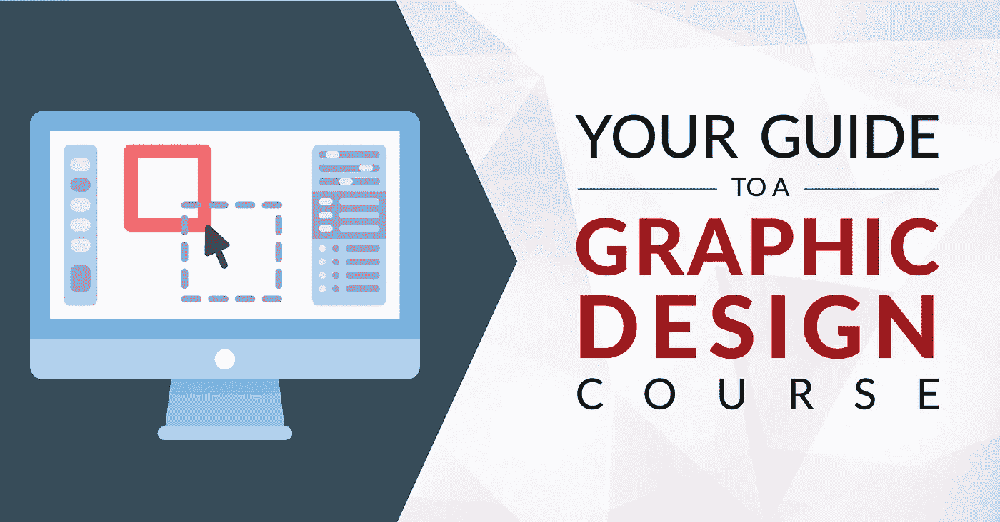
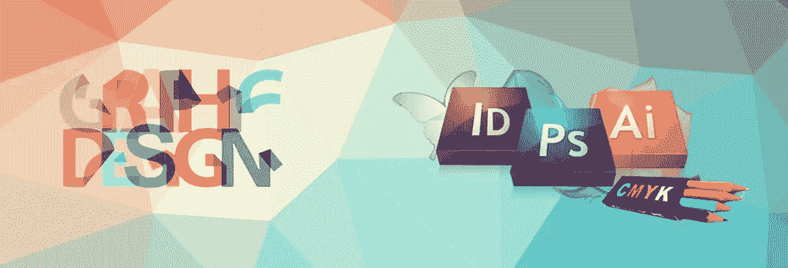

# 面向初学者的 10+最佳平面设计教程——在线学习平面设计

> 原文：<https://medium.com/quick-code/top-tutorials-to-learn-graphic-design-fb0f732d892f?source=collection_archive---------1----------------------->

## 2021 年，学习平面设计的基础知识及其与最佳初学者平面设计教程的合作

# 1.[平面设计训练营](https://click.linksynergy.com/deeplink?id=Fh5UMknfYAU&mid=39197&u1=quickcode&murl=https%3A%2F%2Fwww.udemy.com%2Fgraphic-design-for-beginners%2F)

在设计真实世界的项目时，学习 Photoshop、Illustrator 和 InDesign 的基本知识。在本课程中，您将学习:

*   清楚了解如何在 Photoshop、Illustrator 和 InDesign 中处理印刷和 web 项目。
*   制作传单、名片、网页图片等物品的技能和信心。
*   如何建立一套技能，可以让你在创意行业中成为一名平面设计师。

这门课程是为任何有兴趣成为平面设计师的人开设的，尤其是面向初学者。它将向您展示如何制作一些业内最受欢迎的项目，例如:

*   自定义徽标
*   商业名片
*   小册子
*   网络图形

它将使用 Photoshop、InDesign 和 Illustrator 图形设计的行业标准应用程序。

在每一节的开头，所有的项目文件都是免费下载的，欢迎您随意使用这些文件，或者在学习课程的过程中简单地跟随项目。

## 2.[平面设计专业化](https://coursera.pxf.io/c/1137078/1213622/14726?u=https%3A%2F%2Fwww.coursera.org%2Fspecializations%2Fgraphic-design&subId1=BotTutorials)

做出引人注目的设计。学习并运用平面设计的原则来完成一个全面的品牌项目。

在本课程中，您将学习:

*   获得成为平面设计师所需的基本技能。
*   通过图像制作和排版进行交流。
*   完成一个顶点项目，添加到您的专业组合。
*   在界面设计、动画和编辑设计中你需要知道的一切。

本课程将教你平面设计的基本原则:图像制作、排版、构图、色彩和形状的处理以及平面设计实践所有领域中常见的基本技能。

你将学习、命名和测量字体的特征。你将考虑选择和组合类型所涉及的实际问题。

你将会看到熟悉字体丰富的历史、文化和美学。您将讨论在设置类型时经过时间考验的惯例和最佳实践，它们受层次和空间组织原则的支配。你将探索字体的表现力和创造意义的潜力。

你将尝试一系列的材料和技术来制作图形设计的图像。为了讨论你的工作和其他人的工作，你将在制作和谈论工作方面扩大你的视觉词汇。

你将学习如何制作、操作和安排图像来创造构图，最终以设计和制作一本基于图像的书而告终。

# 3.[平面设计入门](https://linkedin-learning.pxf.io/c/1137078/646189/8005?u=https%3A%2F%2Fwww.linkedin.com%2Flearning%2Fintroduction-to-graphic-design-3%2F&subId1=quickcode)

了解每个设计师都需要知道的概念和软件。

在本课程中，您将了解:

*   平面设计背后的创意过程
*   如何创建布局、构图和网格概念
*   字体和颜色的使用
*   如何使用 Photoshop 转换图像和资源
*   使用 adobe Illustrator 绘制徽标
*   使用 adobe InDesign 设计图形和文档

完成本课程后，你将会有一个更好的成为平面设计师所需的知识。

# 4.[专业平面设计工具](https://www.eduonix.com/graphic-design-tools-for-professionals/UHJvZHVjdC0zMjMyMDA=)

了解 Adobe Photoshop CC 的基本工具，以便在 Photoshop 中设计漂亮的图形和照片。

在本课程中，您将学习:

*   初学 Photoshop CC。
*   定制您的工作空间和面板。
*   创建新的 photoshop 项目预览。
*   将照片放入您的项目。
*   选择、缩放和移动项目。
*   初学的 Premiere Pro CC。
*   后效抄送。
*   Adobe InDesign CC。

## 5.[平面设计基础](https://coursera.pxf.io/c/1137078/1213622/14726?u=https%3A%2F%2Fwww.coursera.org%2Flearn%2Ffundamentals-of-graphic-design&subId1=BotTutorials)

这门课程将教你平面设计的基本原理:图像制作、排版、构图、色彩和形状的运用。

在本课程中，您将学习如何:

*   通过一系列图像制作技术探索和研究视觉表现。
*   理解形状、颜色和图案的基本原理。
*   理解排版的语言和技巧。

本课程将向你展示一系列模拟和数字图像制作技术，并讨论它们是如何工作的。

在第一次同行评议作业中，你将创造自己的一系列图像，用正式的技术进行实验。

在那之后，你将在一项可选的任务中，重新加工这些图像，以增强它们通过内涵传达思想的能力。

您将了解排版术语和创建排版的基本规则。

本课程将向你展示一系列使用字体的技巧和技术，既有功能性的，也有表达性的，你还将了解制作和控制字体的过程。

你将学习设计中的视觉对比、色彩、节奏和图案。本课程将向你展示从形状制作抽象设计的过程，以及如何使用该元素来创建重复的图案设计。

你会明白视觉对比和色彩是如何工作的。你将创造自己的简单和复杂的设计主题，在第二次作业中，你将用它们作为设计重复图案的中心元素。

你将看到设计师如何在单一图像和复杂构图中运用视觉对比、裁剪、层次和方向。

你会发现如何控制和使用比例，重量，方向，纹理和空间的组成，以及如何组成工作范围从复杂到最小。

你将创作自己的抽象作品，展示你对视觉对比的知识和控制。

# 6.[成为专业平面设计师](https://click.linksynergy.com/deeplink?id=Fh5UMknfYAU&mid=39197&u1=quickcode&murl=https%3A%2F%2Fwww.udemy.com%2Fbecome-a-professional-graphic-designer-udemy%2F)

学习你需要知道的进入平面设计世界的知识。在本课程中，您将:

*   掌握平面设计中最常用的软件
*   学习图形设计和视觉传达的原理
*   深入了解当前的平面设计行业
*   了解如何打造平面设计师的职业道路

从在 Photoshop 中使用图层和选区，到在 Dreamweaver 中格式化文本和菜单，再到在 Illustrator 中使用路径查找器和特殊效果，您将学到一切。

完成本课程后，你将具备进入平面设计领域所需的坚实基础，以及立即开始专业工作所需的技能。本课程中使用的工具有:

*   Adobe Photoshop:用于编辑和处理照片和图像。改善照明和色彩，添加特殊效果，去除瑕疵，从头开始创建您自己的图像，等等。
*   Adobe Illustrator:图形设计的标准软件，也是您完成大部分工作的地方。创建任何类型的矢量艺术或插图，你的头脑有能力思考了！
*   Adobe Acrobat:将您的作品转换成任何人都可以查看的 PDF 格式。这个程序还能让你创建、操作、打印和管理你完成的项目文件。
*   Adobe Dreamweaver:轻松设计和开发漂亮的网站，包括设计视图和代码编辑器，因此您可以实时看到您在各个方面所做的更改。

# 7.[在 Photoshop 中学习专业的 2D 游戏平面设计](https://click.linksynergy.com/deeplink?id=Fh5UMknfYAU&mid=39197&u1=quickcode&murl=https%3A%2F%2Fwww.udemy.com%2Fcreate-quick-professional-2d-game-backgrounds-in-photoshop%2F)

了解如何在 Photoshop 中快速创建自己的专业游戏图形！通过本课程:

*   在 Photoshop 中从头开始构建专业的风格化背景
*   用你的新技能赚钱
*   创建您自己的游戏图形

2D 游戏背景创建课程将向您展示如何为游戏和动画创建快速高质量的风格化背景，这些背景将成为专业作品。本课程教授的技术可以转化为道具和角色的创造。本课程将提高或给予你在数字艺术创作领域的技能。

该课程是你建立惊人的有吸引力的背景的轨道。无论是你自己的游戏还是其他人的项目。这门课程将带你从对 Photoshop 知之甚少，到在短短一周内创建专业背景。

您将可以立即访问课程的所有五个部分，包括奖金部分，将向您展示在哪里以及如何找到可以在世界任何地方创作数字艺术作品的工作。您还将获得 50 项为您的个人和商业用途而创建的资产。这些资产可以在你自己的游戏中反复使用。本课程旨在一步一步地带领您快速完成在 Photoshop 中创建数字背景的过程。

# 8.[平面设计——领域概述](https://click.linksynergy.com/deeplink?id=Fh5UMknfYAU&mid=39197&u1=quickcode&murl=https%3A%2F%2Fwww.udemy.com%2Fgraphic-design-secrets%2F)

探索九个平面设计专业调查课程。在本课程中，您将:

*   了解好的设计通常是概念驱动的
*   理解为什么一些设计媒介需要比其他媒介更快的交流
*   学习伟大的平面设计背后的思想，并获得整个领域的鸟瞰图

这是一门调查课程，所以它不会深入到作品是如何创作的细节，而是会探究为什么作品是好的，其中包含的思想，以及关于每个领域的任何其他轶事。

它涵盖了九个平面设计专业。它们是:

*   逻各斯圣语
*   包装
*   海报
*   书籍封面
*   运动图形
*   网站
*   年度报告
*   环境图形
*   编辑设计

# 9. [Canva 为创业者设计图形——设计 11 个项目](https://click.linksynergy.com/deeplink?id=Fh5UMknfYAU&mid=39197&u1=quickcode&murl=https%3A%2F%2Fwww.udemy.com%2Fcanva-graphic-design-course%2F)

从零开始学习 Canva。与 Canva 一起专门为企业家创建 11 个平面设计项目。通过本课程:

*   创建 11 个不同的实用项目，用来帮助你的企业或品牌。
*   利用特定于所需平台的模板和工具，为社交媒体和互联网构建特定的图形设计元素。
*   快速高效地轻松创作自己的作品，节省时间和金钱。

这个在线课程将教你如何使用 Canva 为你的企业或品牌创建实际的项目。

你可以花几个小时甚至几天的时间在网上寻找合适的教程。外包工作可能是一个更大的挑战，只是为了找到合适的人选来做你需要做的事情。无论你只是想提高你的 Canva 业务技能，或有一个具体的项目，你需要马上做好，这个课程是为你。

它会指引你前进的每一步，确保你的事业成功。完成课程后获得结业证书！

# 10.[平面设计大师班:更上一层楼](https://click.linksynergy.com/deeplink?id=Fh5UMknfYAU&mid=39197&u1=quickcode&murl=https%3A%2F%2Fwww.udemy.com%2Fgraphic-design-masterclass-the-next-level%2F)

用真实世界的项目提升你的平面设计技能:标志设计、照片处理、数字设计。在本课程中:

*   你将能够创造精美实用的标志设计和品牌资产
*   能够为完整的数字营销活动创建图像，包括脸书和 Instagram
*   为广告设计制作复杂的照片操作，理解立体布局和设计原则
*   创建真实的阴影，并能够做中级照片润饰
*   轻松勾画标志设计和概念，理解黄金比例以及如何将其融入你的设计过程
*   了解成为自由职业者的基本知识，并为自由设计项目定价
*   了解通过销售创意内容和资源赚钱的多种方式

这是一门实用的设计课程，旨在展示和制作真实世界的客户项目。

课程的第一部分着重于 Adobe Photoshop 和照片编辑和处理。您将查看照片修饰，并学习内容感知工具，它可以加快您的工作流程，几乎像魔术一样工作。它将刷你的笔刷工具，并学习如何创建逼真的阴影。

您将学习如何使用黄金比例，甚至尝试基于黄金比例的标志。你将从头开始做一个完整的标志设计和品牌项目，包括概念开发阶段，以及如何选择适当的字体，风格和颜色。

# 11.[平面设计大师班:在项目中学习平面设计](https://click.linksynergy.com/deeplink?id=Fh5UMknfYAU&mid=39197&u1=quickcode&murl=https%3A%2F%2Fwww.udemy.com%2Fgraphic-design%2F)

使用 Illustrator、InDesign 和 Photoshop 进行平面设计原理、排版和色彩控制。在本课程中，您将:

*   学习并应用图形设计原理，在 Photoshop、Illustrator 和 InDesign 中制作出有效的设计。
*   学习并应用色彩理论和实践，在 Photoshop、Illustrator 和 InDesign 中制作出有效的设计。
*   学习并应用有效的排版，在 Photoshop、Illustrator 和 InDesign 中制作有效的设计。
*   设计一个在线广告，设计一个有效颜色的信息图，创建一个以文字为设计元素的 gig 海报，创建一个说明性的明信片。

在本课程中，您将学习并应用设计原则来创建各种图形设计，包括在线广告、有效的信息图、以字体为设计元素的 gig 海报以及插图明信片设计。您将学习如何在图形设计中创建和应用配色方案。你也将学习有效的排版如何改善你的设计。课程结构如下:

*   在最初的几个部分，你将了解到本课程的最大好处，然后了解各种设计原则，如接近、对齐、重复、对比、平衡、负空间和节奏。你会马上应用这些设计原则，这样你就能更有效地学习它们。这也可以让你学习设计技巧。
*   在颜色部分，您将了解有效颜色，以及如何在 Photoshop、InDesign 和 Illustrator 中创建配色方案。您将使用 Illustrator 创建一个色轮。
*   在排版部分，你将学习字体术语，以便知道如何应用有效的字体。您还将学习编辑和应用文字的最佳实践。

所有的支持文件都包含在后续练习和项目中，包括设计原则、颜色、排版和项目。奖金文件也包括在内，如照片和 Photoshop 画笔。

# 12.[平面设计大师班——学习伟大的设计](https://click.linksynergy.com/deeplink?id=Fh5UMknfYAU&mid=39197&u1=quickcode&murl=https%3A%2F%2Fwww.udemy.com%2Fgraphic-design-masterclass-everything-you-need-to-know%2F)

终极平面设计课程，涵盖 Photoshop、Illustrator、InDesign、设计理论、品牌和标志设计。在本课程中，您将:

*   对排版、色彩理论、照片、布局和分块等设计技巧有深刻的理解
*   了解和学习 Adobe Photoshop、Illustrator 和 InDesign 的基本工具和功能
*   为潜在客户创建徽标和品牌包装
*   学习照片编辑和操作

它将广泛审查排版，色彩理论，布局和组成，如何在设计中使用照片，照片处理和编辑和杂志版面设计，品牌和标志设计。您还将学习 Adobe Photoshop、illustrator 和 InDesign 的基础知识，并使用真实世界的应用程序做项目。

在 Adobe Photoshop 中，您将回顾照片编辑和操作技术，如如何剪切对象、液化工具，并且您将使用新学到的 Photoshop 技能创建一个引人注目的社交媒体图形。

在 Adobe Illustrator 中，您将通过手动描摹简单和复杂的形状来掌握钢笔工具。您将探索形状生成器工具的强大功能，在本节的最后，您将设计一个完整的徽标。

您将在 InDesign 中创建杂志版面，并学习母版页工具，以便在处理多页面版面时大幅加快设计工作流程。

# 13.[完整的 Canva 课程](https://click.linksynergy.com/deeplink?id=Fh5UMknfYAU&mid=39197&u1=quickcode&murl=https%3A%2F%2Fwww.udemy.com%2Fthe-complete-canva-course-for-beginners%2F)

面向初学者的平面设计——了解如何使用 Canva 创建令人惊叹的设计。通过本课程:

*   在 Canva 中创建精彩、专业的图形设计，全部免费
*   学习可以转移到你所有设计项目中的核心设计技能
*   设计 9 个不同的有趣且吸引人的项目，每一个都非常实用
*   掌握 Canva 中的所有元素，每次都能产生令人惊叹的效果

在本课程中，您将学习如何在 Canva(世界领先的免费图形设计应用程序之一)中创建令人惊叹的、美丽的、专业的图形设计。

本课程分为三个部分:

*   第 1 部分涵盖了高效使用 Canva 所需的所有核心技能。它将教您如何使用所有可用的工具和元素，并涵盖以下主题:

文本和排版使用形状和线条添加图标和插图使用图片和滤镜调整颜色、对齐和透明度导出您的作品

*   在第 2 部分中，您将把您的新技能应用到现实世界的例子中，并参与 9 个不同的项目。您将能够制作:

专辑封面、Youtube 视频缩略图、Youtube 频道艺术、Twitter 标题、脸书封面、脸书邮报、电子书封面、带有数据图表的 A4 文档、演示幻灯片。

*   最后，在第 3 部分，它将涵盖一些基本的图形设计理论，并向您展示 Canva 中的一些提示和技巧，以帮助您的作品脱颖而出。它将涵盖以下领域:
*   排版和字体配对
*   线条和间距
*   快捷方式和快速技巧
*   文本屏蔽
*   基本色彩理论

本课程结束时，你将已经为自己创造了一些令人惊叹的设计，并且掌握了获得专业成果所必需的技能。

> 感谢您阅读本文。我们策划了更多主题的顶级教程，您可能想看看:

 [## 10+最佳 InDesign 初学者教程—在线学习 InDesign

### 了解如何使用 Adobe InDesign Tool 和 2021 年面向初学者的最佳 InDesign 教程

medium.com](/quick-design/top-tutorials-to-learn-indesign-fc0b2f516fd2)  [## 10+最佳插画初学者教程—在线学习插画

### 学习 Adobe Illustrator，在 2021 年用最好的 Illustrator 教程为初学者创建宏伟的插图

medium.com](/quick-code/best-online-tutorials-to-learn-illustrator-196cf2f67b98)  [## 10+最佳初学 Photoshop 教程——在线学习 Photoshop

### 2021 年最佳 Photoshop 初学者教程，学习如何使用 Photoshop CC

medium.com](/quick-design/best-online-tutorials-to-learn-photoshop-68c0de7e53c7) 

> 你喜欢邮报吗？
> 
> 给我鼓掌👏！你可以给 clap 50 次，让更多的人发现和知道这个帖子，当然，不要忘记分享。
> 
> 让我们看看掌声！

披露:我们与本文中提到的一些资源有关联。如果你通过本页的链接购买课程，我们可能会得到一小笔佣金。谢谢你。