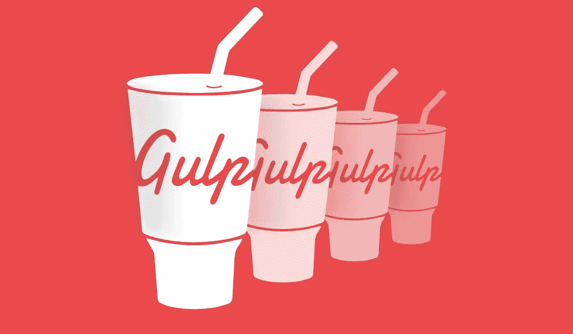
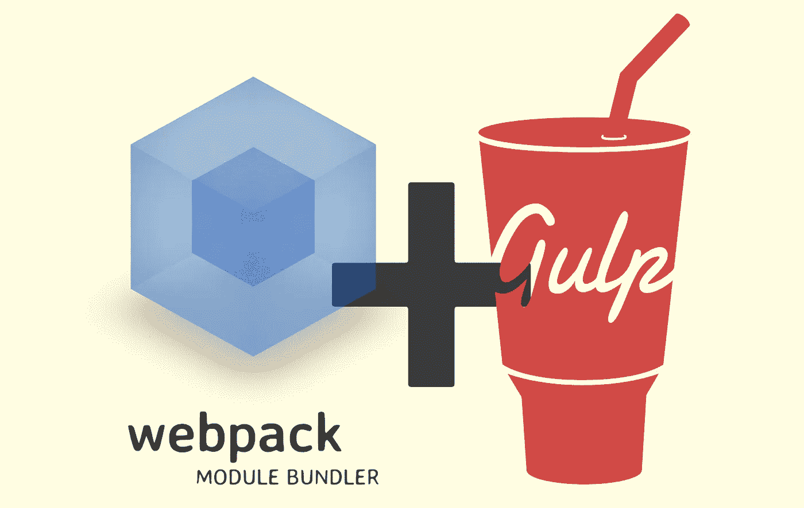

# 7 个初学者最佳 Gulp Js 教程[2023 年 3 月]——在线学习 Gulp Js

> 原文：<https://medium.com/quick-code/top-tutorials-to-learn-gulp-js-11aeeb789f35?source=collection_archive---------4----------------------->

## 在 2023 年为初学者提供的最佳 Gulp 教程中学习自动化开发任务的 Gulp

Gulp 是一个任务运行器，它自动化了网站开发人员每天要做几十次的无聊、重复和耗时的事情。

现代 web 开发充满了大量的工具和技术，但是很难知道从哪里开始。您既希望工作效率高，又希望站点性能高；一饮而尽把它带到了你的门前。

# 1.[快速吞咽](https://click.linksynergy.com/deeplink?id=Fh5UMknfYAU&mid=39197&u1=quickcode&murl=https%3A%2F%2Fwww.udemy.com%2Frapid-gulp%2F)

本课程将教会你:

*   借助 Gulp 的简单性和灵活性实现任务自动化
*   将简单的子任务组合起来，完成以前看起来很困难的复杂任务。
*   优化网站的 JavaScript，CSS 和图像，并定义一切看起来的方式
*   通过自动化测试将您从所有那些严格的测试会话中解放出来
*   使用 CoffeeScript 等预处理程序超越 JavaScript
*   处理错误以确保构建过程的可靠性

本课程将通过清晰的示例和循序渐进的指导，教你使用创建更好网站所需的工具。

您将从设置 Gulp 和编写基本任务开始，并通过常见用例从头开始创建插件。您将通过本课程附带的许多实际示例学习如何使用 Gulp，如优化我们网站的文件和自动化测试代码的过程，以及如何充分利用 Gulp 的技巧。我们将通过查看流如何工作以及如何定义自定义插件来获得更深入的理解。创建你的网站，优化它的性能，用 Gulp 让它好看。

# 2. [Gulp.js: Web 项目工作流程](https://linkedin-learning.pxf.io/c/1137078/646189/8005?u=https%3A%2F%2Fwww.linkedin.com%2Flearning%2Fgulp-js-web-project-workflows&subId1=quickcode)

Gulp.js 使设置压缩、缩小、预处理和其他常见任务像编写设置文件一样简单。

在本课程中，您将学习如何:

*   使用 gulp.js 构建工作流，使管理网站构建过程变得更加简单。
*   使用 gulp.js 实现常见流程的自动化。
*   创建串行工作流并处理 JavaScript。

您将学习使用 gulp.js 构建工作流，使管理网站构建过程变得更加简单。

课程还演示了如何使用 gulp.js 实现常见流程的自动化，包括如何创建串行工作流和用 Babel 处理 JavaScript。

# 3.[使用 Gulp JS 改进您的工作流程](https://click.linksynergy.com/deeplink?id=Fh5UMknfYAU&mid=39197&u1=quickcode&murl=https%3A%2F%2Fwww.udemy.com%2Fimproving-your-workflow-with-gulp-js%2F)

了解如何使用这个 Javascript 任务运行器更有效地构建和测试 web 项目。使用 GulpJS 来自动化 web 开发任务。借助自动化的工作流程和测试流程，更高效地创建网站。

在本课程中，学习如何使用这个免费软件来自动化任务和建立网站。您将从学习如何安装 Gulp JS 开始，然后学习如何创建 Gulp 任务。从那里，它将教你关于 HTML，CSS 和 JavaScript 处理。

本教程还涵盖了自动化测试，如何找到 Gulp JS 插件，以及其他 Gulp JS 资源。你将完全有能力使用 Gulp JS 自动完成任务，并从头开始创建自己的网站。

# 4.[学会一饮而尽，流式构建系统](https://click.linksynergy.com/deeplink?id=Fh5UMknfYAU&mid=39197&u1=quickcode&murl=https%3A%2F%2Fwww.udemy.com%2Fgulp-101%2F)

轻松实现所有前端任务的自动化，成为本课程的吞咽专家。这个全面的课程涵盖了开发人员在日常生活和工作场所中有效使用 Gulp 所需要知道的一切。

本课程包含:

*   解释什么是吞咽，它应该被用来做什么
*   在他们的工作站上安装 Gulp 和 Gulp 插件
*   根据需要寻找并安装新的 Gulp 插件
*   从命令行使用 Gulp
*   为任何需要的任务写一个定制的 Gulpfile
*   使用个人创建的 Gulpfile 自动化整个项目

您将学习如何在 Mac 或 PC 上安装 Gulp。如何从命令行运行 Gulp 并使用 Gulp 命令行参数，Gulp 如何工作以及何时应该使用它。您将了解各种基本的 gulp 插件，包括 gulp-less、gulp-concat 和 gulp-uglify，如何按顺序运行 gulp 任务，如何在某些文件更新时自动运行 gulp 任务，如何编写成熟的 Gulp 文件来管理复杂的项目 Gulp 是一个非常强大且易于使用的工具。

本课程展示了一个完整的 Gulpfile，在这个实践研讨会中，您将自动化较少的 JavaScript 和 HTML 处理。你将实时使用吞咽丑陋、无吞咽、浏览器同步等功能，这样你就可以在家编写代码了。

# 5.[从一饮而尽开始](https://click.linksynergy.com/deeplink?id=Fh5UMknfYAU&mid=39197&u1=quickcode&murl=https%3A%2F%2Fwww.udemy.com%2Fstarting-with-gulp%2F)

在本课程中，你将了解什么是构建系统，gulp 能为你做什么，如何安装和配置 Gulp。然后，课程分为两个部分；为发展而吞咽，为生产而吞咽。在前者中，您将了解预处理 SASS、自动化构建、备受称赞的“观察”功能和实时重新加载功能。

在后一种情况下，我们将关注 JavaScript 和 CSS 的生产，我们将教你关于生成源地图所需要知道的一切。

您也将准备好使用这个聪明的工具包来管理您的 JavaScript 项目，缩小、重写和连接您的代码，并基本上使您的开发生活变得更加容易。

在本课程中，学习:

*   使用 Gulp 作为 JavaScript 构建系统
*   学会让 Gulp 完成所有单调的 JavaScript 任务
*   使用 Gulp 作为 JavaScript 构建系统
*   学习使用 Gulp 管理您的 JavaScript 项目
*   理解 Gulp 基于任务的本质
*   使用 Gulp 插件创建任务
*   用吞咽来缩小你的 JavaScript
*   用一个命令创建可运行的“构建”
*   实现 Gulp 的“观察”特性来自动构建您的 JS 项目
*   使用咽预处理和 minfify 你的 SASS 文件
*   自动将所有 JavaScript 连接成一个可下载的文件
*   让 Gulp 重写你的 HTML 文件来引用串联的、精简的 JS 和 CSS
*   学习安装、配置和编程 Gulp

# 6. [Gulp JS —自动化和优化 Web 开发](https://click.linksynergy.com/deeplink?id=Fh5UMknfYAU&mid=39197&u1=quickcode&murl=https%3A%2F%2Fwww.udemy.com%2Fgulp-js-automate-and-optimize-web-development%2F)

学习使用 Gulp Task Runner——一个 JavaScript 构建系统来自动化和优化 web 开发。

本课程将教你如何使用 gulp js 来自动化前端开发，以便在修改或添加文件时运行 build。你将学会通过缩小 js、css 和 html 的文件大小来优化网站和 web 开发的性能。您还将学习通过减小图像尺寸来提高性能。您将知道如何通过使用浏览器同步将多个设备的浏览器与服务器上的文件同步来减少开发时间。

在本课程中，您将了解:

*   安装和使用 Node.js 和 NPM(节点包管理器)
*   为不同的任务安装 Gulp 和 Gulp 插件
*   创建和运行 Gulp 任务可以缩小 Javascripts、HTML 和 CSS 以减少加载时间。
*   把 LESS 和 SASS 编译成 CSS。
*   编译其他 java 脚本预处理语言，如 CoffyScript 和 Typescript 等。
*   最小化图像尺寸，以优化 web 应用程序，监视文件修改并相应地运行任务。
*   使用浏览器同步，通过同步多个设备浏览器进行测试来减少开发时间。

# 7. [Gulp —构建一个 Web 开发人员入门工具包](https://click.linksynergy.com/deeplink?id=Fh5UMknfYAU&mid=39197&u1=quickcode&murl=https%3A%2F%2Fwww.udemy.com%2Fcourse%2Fbuild-a-web-developer-starter-kit%2F) —【免费课程】

用 javascript 自动化您的本地环境。

在本课程中，您将学习如何:

*   自动化您的 Web 开发环境。
*   将您的 SASS 编译成 CSS
*   将您的 ES6 编译成 Javascript
*   执行自动重装。

通过构建 web developer 初学者工具包，学习自动化您的 web 开发环境。这是所有开发人员都应该具备的最重要的技能之一。

学习将你的 SASS 编译成 CSS，以获得新的特性来设计你的网站。还要学习使用 webpack 和 babel，以便能够使用最新的 javascript 特性。

在本课程中，你将学到成为现代开发人员所需的一切。

> 感谢您阅读本文。我们策划了更多主题的顶级教程，您可能想看看:

 [## 10+最佳新手萨斯教程——在线学习萨斯和 SCSS

### 学习萨斯和 SCSS，在 2021 年为初学者创建最好的萨斯教程的专业网站

medium.com](/quick-code/top-tutorials-to-learn-sass-and-scss-33e4dcd63e9b)  [## 面向初学者的 8 个最佳 SoapUI 教程——在线学习 SoapUI

### 学习 SoapUI 创建 web 服务和 Rest APIs 的测试自动化，拥有 2021 年面向初学者的最佳 SoapUI 教程。

medium.com](/quick-code/top-tutorials-to-learn-soapui-for-rest-api-testing-1b3e14b1037e)  [## 10+最佳 ECMAScript 初学者教程—在线学习 ES6

### 通过 2021 年面向初学者的最佳 ECMAScript 教程，在万维网上学习用于客户端脚本的 ES6

medium.com](/quick-code/the-best-tutorials-to-learn-ecmascript-es6-for-beginners-55fe602382cd) 

披露:我们与本文中提到的一些资源有关联。如果你通过本页的链接购买课程，我们可能会得到一小笔佣金。谢谢你。