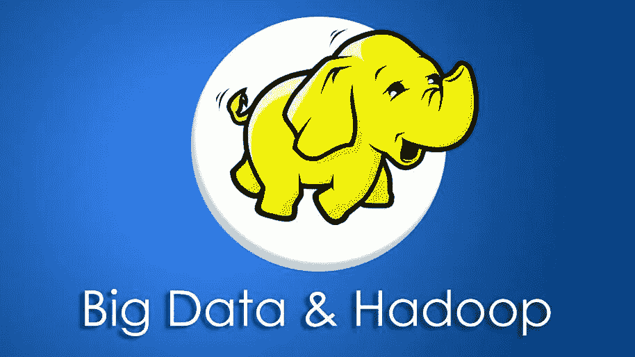

# 面向初学者的 10 个最佳 Hadoop 教程[2023 年 3 月]—在线学习 Hadoop

> 原文：<https://medium.com/quick-code/top-tutorials-to-learn-hadoop-for-big-data-3fa31f399063?source=collection_archive---------0----------------------->

## 用 2023 年最佳 Hadoop 初学者教程学习 Hadoop 存储和处理大数据集的数据。

## 1.[终极实践 Hadoop —驯服您的大数据！](https://coursesity.com/r/site/hadoop-framework-certification-course-mapreduce-hdfs-pig)

Hadoop、MapReduce、HDFS、Spark、Pig、Hive、HBase、MongoDB、Cassandra、Flume——不胜枚举！超过 25 项技术。

**Hadoop** 和“大数据”的世界可能令人生畏——数百种不同的技术以神秘的名称组成了 Hadoop 生态系统。通过本课程，您不仅将了解这些系统是什么以及它们是如何组合在一起的，而且还将亲自动手学习如何使用它们来解决实际的业务问题。

在这个综合课程中，学习和掌握最流行的大数据技术，由来自**亚马逊**和 **IMDb** 的前工程师和高级经理授课。您将超越 Hadoop 本身，深入到您可能需要集成的各种分布式系统中。

*   使用 **Hortonworks** 和 **Ambari** UI 在您的桌面上安装并使用真正的 Hadoop 安装
*   使用 **HDFS** 和 **MapReduce** 管理集群上的大数据
*   用 **Pig** 和 **Spark** 编写程序在 Hadoop 上分析数据
*   用 **Sqoop** 、 **Hive** 、 **MySQL** 、 **HBase** 、 **Cassandra** 、 **MongoDB** 、 **Drill** 、 **Phoenix** 和 **Presto** 存储和查询您的数据
*   **使用 Hadoop 生态系统设计真实世界的系统**
*   学习如何用**纱**、**梅索斯**、**动物园管理员**、 **Oozie** 、**齐柏林**和**色相**来管理你的集群
*   用 **Kafka** 、 **Flume** 、 **Spark Streaming** 、 **Flink** 和 **Storm** 实时处理流数据

对于在拥有大量数据的公司工作的任何人来说，理解 Hadoop 是一项非常有价值的技能。

几乎每个你可能想去工作的大公司都以某种方式使用 Hadoop，包括亚马逊、Ebay、脸书、谷歌、LinkedIn、IBM、Spotify、Twitter 和雅虎。而且不仅仅是科技公司需要 Hadoop 甚至纽约时报也使用 Hadoop 来处理图像。

在这门课程中，你会发现适合各个层次的人的一系列活动。如果你是一个项目经理，只是想学习一些术语，那么课程中的许多活动都有 web UI，不需要编程知识。如果您熟悉命令行，我们也将向您展示如何使用它们。如果你是一名程序员，我将挑战你在 Hadoop 系统上使用 **Scala、**和 **Python** 编写真正的脚本。

通过本课程，您将对 Hadoop 及其相关的分布式系统有一个真正的、深刻的理解，并且您可以将 Hadoop 应用于现实世界的问题。请注意，本课程的重点是应用开发，而不是 Hadoop 管理。虽然你会学到一些管理技能。

## 2. [Hadoop 平台和应用框架](https://coursera.pxf.io/c/1137078/1213622/14726?u=https%3A%2F%2Fwww.coursera.org%2Flearn%2Fhadoop&subId1=BotTutorials)

本课程面向希望了解用于争论和分析大数据的核心工具的程序员新手或商务人士。

在本课程中，您将学习:

*   大数据炒作的技术机遇和挑战。
*   关于 Hadoop 堆栈以及与大数据解决方案相关的工具和技术。
*   Hadoop 分布式文件系统基础(HDFS)。
*   HDFS 的主要设计目标。
*   映射/还原概念。
*   如何在 map/reduce 框架中设计、实现和执行任务。

您将深入了解大数据宣传、其技术、机遇和挑战。您将深入了解 Hadoop 堆栈以及与大数据解决方案相关的工具和技术。

您将详细了解 Hadoop 堆栈，从基本的 HDFS 组件到应用执行框架、语言和服务。

您将详细了解 Hadoop 分布式文件系统(HDFS)。您将讲述 HDFS 的主要设计目标，了解 HDFS 的读/写过程，可以调整以控制 HDFS 性能和稳定性的主要配置参数，并概述在 HDFS 上访问数据的不同方法。

您将学习并练习映射/简化概念。您将了解 map/reduce 的主要思想，以及如何在 Map/Reduce 框架中设计、实现和执行任务。您还将了解 map/reduce 中的权衡以及它如何激励其他工具。

最后，您将重点关注 Apache Spark 集群计算框架，这是 Hadoop MapReduce 在大数据领域的重要竞争者。

## 3.[使用 Hadoop 和 Apache Spark 进行大数据分析](https://linkedin-learning.pxf.io/c/1137078/646189/8005?u=https%3A%2F%2Fwww.linkedin.com%2Flearning%2Fbig-data-analytics-with-hadoop-and-apache-spark&subId1=quickcode)

Apache Hadoop 是大数据技术领域的先驱，并将继续成为企业大数据存储领域的领导者。

该课程包括:

*   简介和设置
*   用于分析的 HDFS 数据建模
*   使用 Spark 摄取数据
*   用 Spark 提取数据
*   优化火花处理

在本课程中，学习如何利用这两种技术来构建可扩展和优化的数据分析管道。

本课程探索了优化 HDFS 数据建模和存储的方法；讨论使用 Spark 的可伸缩数据接收和提取；并提供了在 Spark 中优化数据处理的技巧。

另外，它提供了一个用例项目，允许你练习你的新技术。

## 4.[面向初学者的大数据和 Hadoop 亲身实践！](https://click.linksynergy.com/deeplink?id=Fh5UMknfYAU&mid=39197&u1=quickcode&murl=https%3A%2F%2Fwww.udemy.com%2Fbig-data-and-hadoop-for-beginners%2F)

大数据你需要知道的一切，通过设计数据管道学习 Hadoop、HDFS、MapReduce、Hive & Pig。

本课程的主要目标是帮助您理解 Hadoop 及其组件的复杂架构，引导您朝着正确的方向开始，并快速开始使用 Hadoop 及其组件。

它涵盖了大数据初学者所需的一切。了解大数据市场、不同的工作角色、技术趋势、Hadoop 的历史、HDFS、Hadoop 生态系统、Hive 和 Pig。在本课程中，我们将了解作为初学者应该如何开始使用 Hadoop。本课程附带了许多实践示例，将帮助您快速学习 Hadoop。

本课程有 6 个部分，重点关注以下主题:

大数据一览:了解大数据和大数据市场所需的不同工作角色。了解全球大数据薪资趋势。了解市场上最热门的技术及其趋势。

Hadoop 入门:了解 Hadoop 及其复杂的架构。用简单的例子学习 Hadoop 生态系统。了解 Hadoop 的不同版本(Hadoop 1.x vs Hadoop 2.x)、市场上不同的 Hadoop 厂商以及云上的 Hadoop。了解 Hadoop 如何使用 ELT 方法。学习在你的机器上安装 Hadoop。我们将看到从命令行运行 HDFS 命令来管理 HDFS。

Hive 入门:了解 Hive 在大数据中解决什么样的问题。了解它的架构设计和工作机制。了解 Hive 中的数据模型、Hive 支持的不同文件格式、Hive 查询等。我们将在 Hive 中看到正在运行的查询。

Pig 入门:了解 Pig 如何解决大数据中的问题。了解它的架构设计和工作机制。理解猪拉丁语在猪中的工作原理。你会明白 SQL 和猪拉丁的区别。在 Pig 中运行不同查询的演示。

用例:Hadoop 的实际应用对于更好地理解 Hadoop 及其组件非常重要，因此我们将通过在 Hadoop 中设计一个样本数据管道来处理大数据。此外，了解公司如何在其数据基础架构中采用现代数据架构，即数据湖。

练习:用庞大的数据集练习。通过使用实际应用的数据集设计数据模型和数据管道，学习设计和优化技术。

## 5.[学习大数据:Hadoop 生态系统大师课](https://click.linksynergy.com/deeplink?id=Fh5UMknfYAU&mid=39197&u1=quickcode&murl=https%3A%2F%2Fwww.udemy.com%2Flearn-big-data-the-hadoop-ecosystem-masterclass%2F)

使用 HDFS、MapReduce、Yarn、Pig、Hive、Kafka、HBase、Spark、Knox、Ranger、Ambari、Zookeeper 掌握 Hadoop 生态系统。

在本课程中，您将学习使用 Hadoop 生态系统的大数据。为什么选择 Hadoop？这是 It 行业最受欢迎的技能之一。美国的平均年薪为 11.2 万美元，旧金山的平均年薪高达 16 万美元(来源:的确如此)。

本课程面向希望了解大数据的软件工程师、数据库管理员和系统管理员。其他 IT 专业人员也可以参加本课程，但是可能需要做一些额外的研究来理解一些概念。

您将学习如何使用目前大数据行业最流行的软件，使用批处理和实时处理。这个课程会给你足够的背景知识，让你能够和行业内的专家讨论真正的问题和解决方案。用这些技术更新你的 LinkedIn 个人资料会让招聘者希望你能得到世界上最有声望的公司的面试机会。

课程实用性很强，6 个多小时的授课。你想自己尝试所有的事情，增加几个小时的学习时间。如果你在尝试的时候遇到了技术上的困难，你可以得到支持。我会在留言板上回答你的留言，我们有一个脸书小组，你可以在那里张贴问题。

## 6.[精通 Apache Hadoop —无限技能 Hadoop 培训](https://click.linksynergy.com/deeplink?id=Fh5UMknfYAU&mid=39197&u1=quickcode&murl=https%3A%2F%2Fwww.udemy.com%2Fmaster-apache-hadoop%2F)

希望掌握 Apache Hadoop，来自 Infinite Skills 的本课程将向您展示如何使用 Hadoop 框架。

来自 Infinite Skills 的 Apache Hadoop 入门培训课程将向您传授在这个开源软件框架中工作所需的工具和功能。本课程是为绝对初学者设计的，这意味着不需要以前有 Hadoop 的经验。

您将从学习 Hadoop 的基础开始，包括 Hadoop 运行模式和作业类型以及云中的 Hadoop。然后，您将了解 Hadoop 分布式文件系统(HDFS)，如 HDFS 架构、二级名称节点和访问控制。本视频教程还将涵盖包括 MapReduce、调试基础知识、hive 和 pig 基础知识以及 impala 基础知识在内的主题。最后，本课程将教您如何导入和导出数据。

一旦您完成了这个基于计算机的培训视频，您将完全能够使用您所学的工具和功能在 Hadoop 中成功工作。工作文件包括在内，允许您跟随作者在整个课程。

## 7.[学习大数据:实践完整的 Hadoop 生态系统](https://click.linksynergy.com/deeplink?id=Fh5UMknfYAU&mid=39197&u1=quickcode&murl=https%3A%2F%2Fwww.udemy.com%2Flearn-big-data-complete-hadoop-ecosystem-with-practicals%2F)

用实例学习完整的大数据(Spark+MongoDB+Pig+Hadoop+Hive+Cassandra+h base+Redis+Beeline)。

本课程专为所有 profile 学生设计，即希望将其职业生涯发展到现实世界中的大数据领域的开发人员和测试人员。因此，我设计了这个课程，以便他们可以开始使用所有大数据相关的工具和技术，即完整大数据中的 Hadoop、Hive、Pig、HBASE、CASSANDRA、MONGODB、REDIS。所有在大数据领域工作或寻找职业生涯并希望进入测试领域的用户都应该参加本课程，并仔细阅读包含初学者进阶知识的完整教程。

它将提供用于开发和测试所有大数据相关工具和技术的不同命令和查询的详细信息，包括测试人员进入更大范围(即大数据生态系统环境)所需的完整查询/命令中的不同数据库应用。

本课程结构合理，包含不同大数据相关工具和技术数据库的所有元素，即完整大数据中的 Haoop、Hive、HBase + Cassandra + MongoDB + Redis，并通过不同主题以实用方式提供高级命令。希望从头开始学习端到端大数据生态系统技术(包括完整大数据中的不同数据库)的学生应该学习本课程。

## 8. [Hadoop 变得非常简单](https://click.linksynergy.com/deeplink?id=Fh5UMknfYAU&mid=39197&u1=quickcode&murl=https%3A%2F%2Fwww.udemy.com%2Fbig-data-hadoop-masterclass%2F)

通过实践方法学习 Hadoop、Pig、Hive 和 Mahout，无需花费太多时间，并促进您的职业发展。

本课程通过基于示例和实践的方法，从头开始教你 Hadoop、Pig、Hive 和 Apache Mahout。

轻松掌握大数据、Hadoop 和 Mahout 的基本概念

*   了解大数据和 Apache Hadoop 环境
*   通过示例和动手实验学习 HDFS 和 MapReduce 概念
*   了解 Hadoop 流
*   使用 Pig 和 Hive 了解 Hadoop 的分析
*   机器学习概念
*   Apache Mahout 协同过滤
*   基于 Mahout 和 Hadoop 的真实世界推荐系统

大数据和数据科学基金会为您提供最专业的技能

强调核心概念，重点是为关键的 Hadoop、Map Reduce 和协作过滤概念奠定坚实的基础，在此基础上，您可以了解同一领域的几乎所有其他技术。初步的 Java 和 Unix 知识是预期的。

前几个主题将重点关注大数据的兴起以及 Apache Hadoop 如何融入其中。您将关注 Hadoop 的基础及其核心组件:HDFS 和 Map Reduce。然后，您将设置并使用 Hadoop 和 HDFS，然后通过实例深入了解 MapReduce 编程。您还将花时间学习合并器和分割器，以及它们如何提供帮助。您还将在 Hadoop Streaming 上花费时间:这是一个帮助非 Java 专业人员利用 Hadoop 的强大功能并在其上进行 POC 的工具。

一旦您对 HDFS 和 MapReduce 有了坚实的基础，在接下来的几个主题中，您将探索 Hadoop 生态系统的更高级组件:Hive 和 Pig。您将通过安装 Hive 和 Pig 并使用示例来深入了解它们的细节。Hive 和 Pig 可以让您的生活变得简单，因为它们可以让您避开编写《乔布斯先生》的复杂性，同时利用 Hadoop 框架的并行处理能力。

在接下来的几堂课中，你会看到一些非常有趣的东西:Apache Mahout 和机器学习。Apache Mahout 是一个 Java 库，可以让您轻松编写机器学习应用程序。你将学习机器学习的基础，并深入到协作过滤和推荐系统，这是 Mahout 擅长的。

您将看到一些相似性算法，理解它们在现实生活中的含义，并在使用 Mahout 和 Hadoop 构建真实世界的电影推荐系统时应用它们。

## 9.[现实世界中的 Hadoop 开发者](https://click.linksynergy.com/deeplink?id=Fh5UMknfYAU&mid=39197&u1=quickcode&murl=https%3A%2F%2Fwww.udemy.com%2Fhadoopinrealworld%2F)

该课程涵盖了所有必须知道的话题，如 HDFS，MapReduce，纱，阿帕奇猪和蜂巢等。我们深入探索这些概念。你不能停留在简单的概念上，我们会更进一步，涵盖重要和复杂的主题，如文件格式、自定义可写内容、输入/输出格式、故障排除、优化等。

所有概念都得到有趣的实践项目的支持，例如分析百万首歌曲数据集以找到不太熟悉的热门歌曲艺术家，用维基百科的页面转储对页面进行排名，模拟脸书的共同朋友功能，等等。

## 10.[举一反三:Hadoop、MapReduce 解决大数据问题](https://click.linksynergy.com/deeplink?id=Fh5UMknfYAU&mid=39197&u1=quickcode&murl=https%3A%2F%2Fwww.udemy.com%2Flearn-by-example-hadoop-mapreduce%2F)

Hadoop、MapReduce 和“并行”思维艺术的实践练习。

本课程是一个放大、缩小、动手练习，涉及 Hadoop、MapReduce 和并行思维艺术。

放大，缩小:这门课既宽又深。它非常详细地介绍了 Hadoop 的各个组件，并从更高的层面向您展示了它们之间的交互方式。

涉及 Hadoop、MapReduce 的动手练习:本课程将让您很早就动手操作 Hadoop。您将了解如何使用虚拟机和云来设置自己的集群。涵盖了 MapReduce 的所有主要特性——包括高级主题，如总排序和二级排序。

并行思考的艺术:MapReduce 完全改变了人们处理大数据的思维方式。将任何问题分解成可并行的单元是一门艺术。本课程中的例子将训练你“并行思考”。

涵盖的内容:

*   使用 MapReduce 来
*   在社交网站中推荐朋友:使用协同过滤算法生成前 10 名朋友推荐。
*   为搜索引擎构建倒排索引:使用 MapReduce 并行化为搜索引擎构建倒排索引的庞大任务。
*   从文本中生成二元模型:生成二元模型并计算它们在文本语料库中的频率分布。
*   构建您的 Hadoop 集群:
*   以独立、伪分布式和完全分布式模式安装 Hadoop
*   使用 Linux 虚拟机设置 hadoop 集群。
*   使用 Cloudera Manager 在 AWS 上设置云 Hadoop 集群。
*   理解 HDFS、MapReduce 和 YARN 及其交互
*   自定义您的 MapReduce 作业:
*   将多个 MR 作业链接在一起
*   编写您自己定制的分区程序
*   总排序:通过对输入文件进行采样，对大量数据进行全局排序
*   二次分类
*   用 MR 单元进行单元测试
*   使用 Hadoop 流 API 与 Python 集成

..当然还有所有的基本要素:

*   MapReduce:映射器、缩减器、排序/合并、分区、洗牌和排序
*   HDFS 和 YARN: Namenode、Datanode、资源管理器、节点管理器、MapReduce 应用程序的剖析、YARN 调度、配置 HDFS 和 YARN 以优化集群性能。

## 11.[从零开始一步步掌握大数据和 Hadoop](https://click.linksynergy.com/deeplink?id=Fh5UMknfYAU&mid=39197&u1=quickcode&murl=https%3A%2F%2Fwww.udemy.com%2Flearn-hadoop-step-by-step-from-scratch%2F)

以简化的方式学习从基础到与大数据和 Hadoop 相关的高级概念。

课程概述:

*   十年来要求最高、最受欢迎的技能。
*   通过学习大数据和 Hadoop 来保护您的职业生涯。
*   课程采用非常创新和简化的教学方法。
*   课程涵盖与 Hadoop 管理以及 Hadoop 开发相关的所有主题。

课程描述:在本课程中，您将学习与大数据和 Hadoop 相关的所有概念和术语，如 NameNode、辅助 NameNode、DataNode、JobTracker 和 TaskTracker，以及与之相关的其他概念，如机架感知和简化的 NameNode 联合的含义。它还解释了 Hadoop 分布式文件系统(HDFS)如何管理数据，并解释了在 Hadoop 分布式文件系统上读写数据的过程。在本课程的后面部分，您还将学习如何在现有集群中添加或删除 DataNode 或 TaskTracker，如何检查 HDFS 是否有错误，如何平衡 DataNode 等等。除了使用 MapReduce 编写程序，您还将学习所有与 MapReduce 编程相关的概念。学完本课程后，您将对与 Hadoop 相关的所有概念有一个清晰的了解，这足以帮助您开始管理 Hadoop 集群以及为 Hadoop 集群开发 MapReduce 应用程序。

> 感谢您阅读本文。我们策划了更多主题的顶级教程，您可能想看看:

 [## 8 个最好的 Redis 初学者教程——在线学习 Redis

### 用 2022 年最好的 Redis 初学者教程学习数据库管理的 Redis

medium.com](/quick-code/top-tutorials-to-learn-redis-for-beginners-b06c55639e43)  [## 10 个最好的 PostgreSQL 初学者教程——在线学习 PostgreSQL

### 学习 PostgreSQL 来学习一个强大的数据库管理系统，为初学者提供最好的 PostgreSQL 教程…

medium.com](/quick-code/top-tutorials-to-learn-postgresql-database-for-beginners-99ff0deb9f84)  [## 初学者的 8 个最佳 Cassandra 教程——在线学习 Cassandra

### 用 2022 年最好的 Cassandra 初学者教程学习数据库管理的 Cassandra

medium.com](/quick-code/top-tutorials-to-learn-cassandra-for-beginners-bbc03ea3e676) 

***披露:*** *如果您通过本页面的链接购买课程，我们可能会获得一小笔附属佣金。谢谢你。*