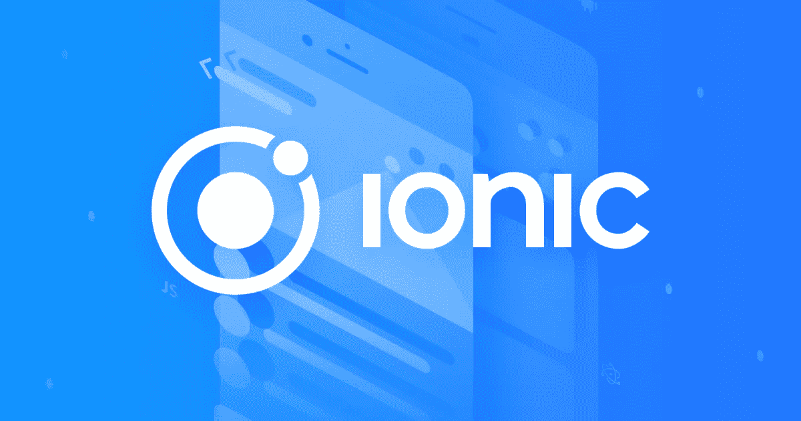
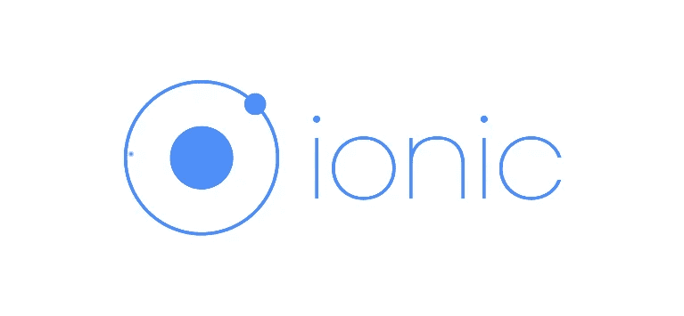

# 10+最佳离子 5 初学者教程[2022 年 10 月]—在线学习离子

> 原文：<https://medium.com/quick-code/top-tutorials-to-learn-ionic-for-hybrid-mobile-apps-development-e9d53d54420c?source=collection_archive---------0----------------------->

## 学习 Ionic，在 2022 年使用一个代码库为初学者提供最好的 Ionic 教程来构建混合跨平台移动应用程序

Ionic 是一个移动开发框架，使您能够使用 JavaScript、HTML 和 CSS 等 web 技术为 iOS、Android、Windows 和其他移动平台创建令人惊叹的应用程序。它在前端使用 Angular 框架，在后端利用 Apache Cordova 的能力来创建混合移动应用程序。

Ionic 为您提供了大量的用户界面组件、现代前沿风格、图标、动画、过渡和更多开箱即用的功能。

# 1.[爱奥尼亚 4 速成班与心石 API &角](https://click.linksynergy.com/deeplink?id=Fh5UMknfYAU&mid=39197&u1=quickcode&murl=https%3A%2F%2Fwww.udemy.com%2Fionic-4-crash-course-with-heartstone-api-angular%2F)

使用 Ionic 4 和 Angular 6 为 Android、iOS 和浏览器创建混合应用程序。使用 Ionic & Cordova 构建本地应用程序。

本课程讲授以下内容:

*   使用 Ionic 4 开发美观、现代且现实可用的移动应用
*   为 Android、iOS 和浏览器编写一个代码库
*   使用 Ionic 4 释放编写混合应用程序的力量。
*   在激动人心的移动应用程序开发环境中确立自己的地位

在本课程中，您将构建一个连接到 Heartstone api 的应用程序，其中列出了每张扑克牌。它将介绍 Ionic 的基础知识，并解释一些 UI 组件。您将致力于更有用的功能，如搜索和功能，使卡片成为最喜爱的，并将使用离子存储。

您将学习如何从 firebase 直接向您的应用程序发送推送通知，并通知您的用户。您将在浏览器、模拟器和真实设备中运行应用程序。

Ionic framework. image source: [https://ionicframework.com](https://ionicframework.com)

## 2.[利用 Web 技术开发多平台移动应用:Ionic 和 Cordova](https://coursera.pxf.io/c/1137078/1213622/14726?u=https%3A%2F%2Fwww.coursera.org%2Flearn%2Fionic-cordova&subId1=BotTutorials)

本课程着重于使用 Web 技术(HTML5、CSS 和 Javascript)开发多平台移动应用程序。

在本课程中，您将学习如何:

*   使用 Cordova 混合应用程序框架，通过单一代码库开发和定位多个移动平台。
*   利用你的 HTML5、CSS、Javascript 和 Angular 技能。
*   使用 Ionic 框架的各种特性来构建混合移动应用。

您将了解 Ionic 框架，并探索 Ionic 框架的一些功能，以实现一个基于 Angular 应用程序的 Ionic 应用程序，该应用程序是在之前的 Angular 课程中实现的。

本课程探讨了对表单的离子支持，也讨论了离子列表的高级特性。

此外，所有在屏幕上叠加信息的不同方法，如模态、弹出窗口、弹出窗口、动作表和加载都将被研究。也简要考虑了对手势的离子支持。

您将了解如何在应用中使用本地存储。然后，您将了解如何配置您的计算机，以便为各种平台构建您的应用程序，并将您的应用程序部署到仿真器和设备。

最后，您将探索 Cordova 和 Ionic 本机包装器，它们使您能够访问移动设备的本机功能。

为了理解在 Ionic 应用程序中使用这些插件的一般概念和模式，您将使用一些插件。

# 3. [Ionic 4.0:部署 Ionic 应用](https://linkedin-learning.pxf.io/c/1137078/646189/8005?u=https%3A%2F%2Fwww.linkedin.com%2Flearning%2Fionic-4-0-deploying-ionic-apps&subId1=quickcode)

构建移动应用具有挑战性，在多个平台上部署一个应用需要注意各种额外的细节。

在本课程中，您将学习:

*   构建和部署兼容移动、网络和桌面的应用程序代码的复杂性。
*   如何设置您的环境。
*   如何使用 Ionic Appflow 进行移动开发和 Ionic Deploy 进行部署。

本课程介绍了构建和部署兼容移动、web 和桌面应用程序代码的复杂性。

首先，它向您展示了如何设置您的环境，安装 Ionic、Cordova、Git 和 Gradle。然后，它涵盖了开发过程，接着是测试。

该课程演示了如何使用 Ionic Appflow 进行移动开发，如何使用 Ionic Deploy 进行部署，如何使用 Ionic DevApp 运行应用，以及如何使用 PWA 服务人员进行推送通知。

它还讨论了如何使用 Capacitor 来构建本地 web 应用。他将带您完成使用电子桌面的步骤，从而结束本课程。

# 4.[Ionic 4——用 Ionic & Angular](https://www.eduonix.com/ionic-2-build-ios-and-android-apps-with-angular/UHJvZHVjdC0zMjMyMDA=) 构建 iOS、Android &网络应用

使用 Angular、Capacitor 和 Ionic 框架构建原生 iOS 和 Android 以及渐进式网络应用。

在本课程中，您将学习如何:

*   构建可以编译成本地移动应用的网络应用，在任何 iOS 或 Android 设备上运行。
*   将它们发布为渐进式 web 应用程序。

Ionic 使你能够使用一个代码库(用 HTML、JS 和 CSS 编写)来构建和发布普通(渐进式)网络应用程序以及 iOS 和 Android 的真正原生移动应用程序。

本课程从零开始教你最新版本的 Ionic，不需要事先了解它。

# 5.[用离子和电子构建桌面应用](https://pluralsight.pxf.io/c/1137078/424552/7490?u=https%3A%2F%2Fwww.pluralsight.com%2Fcourses%2Fbuilding-cross-platform-apps-ionic-electron&subId1=quickcode)

在本课程中，使用 Ionic 和 electronic 构建桌面应用程序，您将获得运用辛苦获得的 web 开发技能来构建令人惊叹的桌面应用程序的能力。

该课程包括:

*   用 Ionic 构建桌面用户界面
*   储存；储备
*   添加电子:与主机操作系统交互
*   应用通信
*   打包和部署

首先，你将学习如何用 Ionic 和 Angular 构建一个实用且有吸引力的 UI。接下来，您将发现如何将 UI 包装到电子应用程序外壳中。

最后，您将探索如何打包您的应用程序并准备好进行分发。

学完本课程后，你将具备向 Windows 和 macOS 用户部署和分发漂亮应用程序所需的离子和电子开发技能和知识。

# 6.[从零开始学习爱奥尼亚 3](https://click.linksynergy.com/deeplink?id=Fh5UMknfYAU&mid=39197&u1=quickcode&murl=https%3A%2F%2Fwww.udemy.com%2Flearn-ionic-3-from-scratch%2F)

使用 Ionic 3、Angular 4、TypeScript 和 Firebase 创建跨平台移动应用程序。

在本课程中，了解:

*   创建一个与 GitHub API 接口的移动应用程序。
*   使用 Ionic 3 和 Firebase 创建实时聊天应用程序
*   使用 Adobe Experience Design 创建应用程序原型
*   拥有 UX 驱动的应用程序开发方法。
*   了解 Ionic 3 和 Angular 4 的复杂性，并使用它们来制作强大的跨平台移动应用程序。
*   将各种 Ionic 原生插件与您的移动应用程序集成。

本课程结束时，您将能够使用 Angular 4、TypeScript 和 Ionic 3 制作跨平台的移动应用程序。您将能够使用 web 技术(HTML5 和 JavaScript)创建高性能的移动应用程序。你会对 Ionic 3，TypeScript，Angular 4 有很强的理解。使用 Ionic Native 和 Cordova 来挂钩本机设备功能。在本课程中，您还将学习使用定制风格来设计 Ionic 应用程序的主题，并理解常见的可访问性模式。掌握带有生命周期挂钩的 Ionic 3 导航模式，以及如何通过延迟加载提高 Ionic 3 应用程序的性能。

## 7. [Ionic React:使用 Ionic 5 进行跨平台移动开发](https://click.linksynergy.com/deeplink?id=Fh5UMknfYAU&mid=39197&u1=quickcode&murl=https%3A%2F%2Fwww.udemy.com%2Fcourse%2Fionic-react%2F)

使用 React、Ionic Framework 5、Capacitor 和 Firebase 从单一代码库创建移动 web 和原生 Android/iOS 应用程序。

在本课程中，您将学习如何:

*   利用 Ionic 和 React 的网络技术开发移动应用。
*   构建一个移动网站，以及来自相同代码库的 Android 和 iOS 原生应用。
*   与 Firebase 后端集成，以处理用户身份验证和存储数据。

本课程将一步步向你介绍 Ionic，从一个普通的纯 JavaScript 的 React app 开始，逐渐加入越来越多的 Ionic 组件。

然后，它将指导您开发一个简单而完整的应用程序，其中包括一些表单元素和一个图表(基于 Recharts)，并向您展示如何使用 Capacitor 将该应用程序不仅构建为移动网站，还构建为原生 Android 和 iOS 应用程序。

然后，您将看到如何使用 Ionic CLI 快速生成一个新的 Ionic React 项目，包括 TypeScript 支持。

稍后，您将学习如何构建一个更复杂的应用程序，包括页面导航/路由和与 Firebase API 的集成，处理用户身份验证，在云 Firebase 数据库中存储数据，以及将用户生成的文件(如图片)上传到云存储。

最后，本课程将展示如何将移动应用发布到 Android 的 Google Play 商店和 iOS 的 Apple App Store。

# 8.面向 WooCommerce 的 Ionic 3 应用程序:构建一个电子商务移动应用程序

使用 Ionic Framework 3 从头到尾构建一个电子商务移动应用程序，使用 HTML、SCSS 和 TypeScript 构建 WooCommerce。

本课程将教会你:

*   用 Ionic 框架构建 Android 和 iOS 应用。
*   构建和部署跨平台混合应用。
*   用 WooCommerce 构建电子商务应用程序。
*   在本地部署 WooCommerce，将其作为后端。
*   使用离子成分和自然特征。
*   在 Ionic/Cordova 应用程序中集成 PayPal 支付网关。
*   在 Play Store 中发布应用程序。
*   在 Ionic 应用中集成推送通知。

本课程将帮助您了解最新版本的 Ionic Framework v3 的基础知识，并逐步引导您使用 WooCommerce 商店作为后端，为 Android 和 iOS 构建完整的电子商务应用程序。

您将构建一个电子商务应用程序，允许用户浏览产品目录，在特定产品类别中搜索产品，将产品添加到购物车，然后为订单付款。顾客可以使用贝宝支付网关支付。每次你发布新产品，用户都会收到推送通知。

# 9.[Ionic 2/Ionic 3——用 Angular](https://click.linksynergy.com/deeplink?id=Fh5UMknfYAU&mid=39197&u1=quickcode&murl=https%3A%2F%2Fwww.udemy.com%2Fionic-2-the-practical-guide-to-building-ios-android-apps%2F) 构建 iOS & Android 应用

在本课程中，使用 Angular 2+、Cordova 和 Ionic 3 框架构建原生 iOS 和 Android 应用，深入了解 Ionic 2/ 3 以了解更多非常高级的功能并优化其应用，在真实设备上测试 iOS 和 Android 应用，并将这些应用发布到这两个平台的应用商店。

本课程将带你从零到已发布的应用，走一条非常注重实践的路线。在整个课程中，您将构建四个主要的应用程序，了解 Ionic 2/ 3 的基础知识、其丰富的组件库、如何获取和处理用户输入、如何存储数据和访问本机设备功能。每个应用程序将专注于不同的主题，如组件、导航、选项卡、侧菜单、用户输入、本机设备功能(如摄像头)、存储、Http、身份验证。

你将会学到:

*   角度 2(=角度 5)的简要复习
*   如何设置您的 Ionic 2/ 3 项目
*   关于 Ionic 2/ 3 的基础知识:导航是如何工作的，项目是如何构建的，以及如何使用丰富的组件库
*   使用许多 Ionic 组件:后退按钮导航，标签和侧菜单显示模式，提醒，祝酒和其他有用的用户界面组件
*   在浏览器、模拟器和真实设备上测试应用程序
*   了解如何配置您的应用程序并将其发布到 App Store 或谷歌 Play 商店
*   了解如何通过输入、文本字段、下拉菜单、对话框和滑块获取和处理用户输入
*   验证用户身份并访问 web 服务器访问本地设备存储和本机设备功能，如摄像头或地理定位。

# 10.[Ionic 3——了解如何设计 Ionic 应用](https://click.linksynergy.com/deeplink?id=Fh5UMknfYAU&mid=39197&u1=quickcode&murl=https%3A%2F%2Fwww.udemy.com%2Fdesign-ionic-apps%2F)

通过学习如何*设计* &开发 Ionic 移动应用，提高您的 Ionic 框架知识。

在本课程中，学习如何创建介绍/欢迎滑块，如何在 Ionic 应用程序中使用 Google 字体，如何在项目中设置字体 Awesome，如何设计有吸引力的登录页面，如何为 YouTube 和 Vimeo 创建视频流页面，如何为您的应用程序创建视差图像，创建自动滑块，如何创建侧菜单页面以及许多其他很酷的东西。

本课程涵盖:

*   设计和开发 Ionic 应用
*   作为 Ionic 应用程序设计师的自由职业者
*   设计和开发用于转售的 Ionic 应用程序主题

# 11.[面向 WooCommerce 的 Ionic 应用:打造一款电子商务手机应用](https://click.linksynergy.com/deeplink?id=Fh5UMknfYAU&mid=39197&u1=quickcode&murl=https%3A%2F%2Fwww.udemy.com%2Fionic-apps-for-woocommerce-build-an-ecommerce-mobile-app%2F)

学习 Ionic 框架，开始使用 HTML、CSS 和 AngularJS 为 Android 和 iOS 构建自己的电子商务应用程序。

本课程将教会您:

*   使用 Ionic 创建令人惊叹的移动应用
*   创建可以在 Android 和 iOS 上运行的应用程序
*   构建电子商务应用
*   构建使用 WooCommerce 作为后端的应用程序
*   使用 HTML 和 JS 编写应用程序
*   编写和理解 AngularJS 应用程序
*   在 Android 上构建和部署应用

在本课程中，您将从学习如何将 WooCommerce 与 Ionic 结合使用开始。你将从头开始学习 Ionic 框架，然后开始使用 Ionic 框架知识构建一个电子商务应用程序。

如果你是一名网络开发人员，想要开发移动应用，Ionic 将能够编写出在 Android 和 iOS 上都能运行的令人惊叹的应用。每个讲座都有一个 Github 分支，位于为这门课程创建的 Repo 中。

# 12. [Ionic 4.0 基础培训](https://linkedin-learning.pxf.io/c/1137078/646189/8005?u=https%3A%2F%2Fwww.linkedin.com%2Flearning%2Fionic-4-0-essential-training&subId1=quickcode)

了解如何使用 Ionic 开发一个高性能的移动应用程序，该应用程序兼容流行的移动和桌面操作系统。

在本课程中，您将学习:

*   4.0 框架的详细情况。
*   创建一个可以在 iOS、Android 和 Windows 上有效工作的单一代码库。
*   关于 Ionic，并介绍了最新版 mobile SDK 的主要特性。

您将了解 4.0 框架的来龙去脉。本课程向您展示了如何创建一个能够在 iOS、Android 和 Windows 上有效工作的单一代码库。

首先，它提供了 Ionic 的概述，并介绍了最新版本的移动 SDK 中的关键特性。

然后，它将带您逐步完成构建应用程序的过程，包括设置过程、使用模板、在设备上预览应用程序、开发 UI 和导航组件、使用 Ionic Natives、连接到后端等。

> 感谢您阅读本文。我们策划了更多主题的顶级教程，您可能想看看:

 [## 8 个最适合初学者的 React Native 教程——在线学习 React Native

### 通过 2021 年面向初学者的最佳 React Native 教程，了解面向 Android 和 iOS 移动应用开发的 React Native

medium.com](/quick-code/top-tutorials-to-learn-react-native-90867a836c3e)  [## 10+最佳科特林初学者教程-在线学习科特林

### 2021 年用最好的 Kotlin 初学者教程学习 Kotlin for android 开发

medium.com](/quick-code/top-tutorials-to-learn-kotlin-android-development-for-beginners-fad63af16996)  [## 初学者的 9 个最佳 Appium 教程——在线学习 Appium

### 了解如何针对 android、ios 和混合移动应用进行自动化移动应用测试。

medium.com](/quick-code/top-tutorials-to-learn-appium-for-mobile-automation-testing-8b87ac3bfd69) 

披露:我们与本文中提到的一些资源有关联。如果你通过本页的链接购买课程，我们可能会得到一小笔佣金。谢谢你。