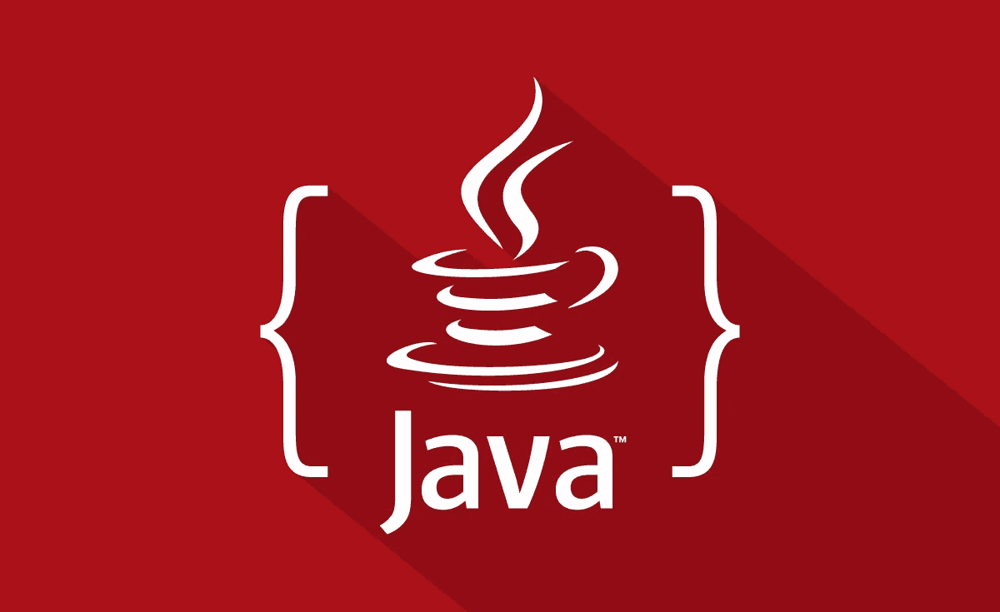

# 15+最佳初学者 Java 教程[2022 年 7 月]——在线学习 Java

> 原文：<https://medium.com/quick-code/top-tutorials-to-learn-java-programming-a06f828895d8?source=collection_archive---------1----------------------->

## 用 2022 年最好的初学者 Java 教程学习软件开发 Java

Java 是最流行的编程语言之一。Java 提供了面向对象和函数式编程特性。Java 在软件开发中无处不在。学习 Java 让你在编程生涯中占据优势。这些是你必须从最好的 java 课程开始学习 Java 开发的在线课程。基于评级、评论和质量，由专家策划的 [*顶级 Java 教程*](https://coursesity.com/best-tutorials-learn/java) 列表。让我们从以下课程开始学习 Java。

*披露:我们与本文中提到的一些资源有关联。如果你通过本页的链接购买课程，我们可能会得到一小笔佣金。谢谢你。*

# 1.[面向软件开发人员的 Java 编程大师班](https://click.linksynergy.com/deeplink?id=Fh5UMknfYAU&mid=39197&u1=quickcode&murl=https%3A%2F%2Fwww.udemy.com%2Fjava-the-complete-java-developer-course%2F)

学习这门课的 java，成为一名电脑程序员。获得有价值的核心 Java 技能和 Java 认证。

通过本课程:

*   学习申请 Java 开发人员职位所需的核心 Java 技能
*   如果您愿意，可以参加并通过 Oracle Java 证书考试。
*   能够向未来的雇主展示你对 Java 的理解。
*   向专业人士学习 Java 软件开发的行业“最佳实践”
*   获得过渡到 Spring 框架、java EE 和 Android 开发的基本 Java 基础知识
*   精通 Java 8 和 Java 11。

学习 java 开发所需的核心 java 材料在前七节中有所介绍。Java 基础知识包含在这些章节中，课程的其余部分包含中级、高级和可选材料。

本课程假设你以前没有编码经验，从绝对初学者的核心概念，比如向你展示你需要下载和安装的免费工具，到编写你的第一个 Java 程序。所有必要的 Java 关键字、操作符、语句和表达式都需要完全理解您在编码什么以及为什么编码——使编程更容易掌握，更少挫折。

它包括面向对象编程的完整章节和 Java API(构建应用程序的协议和工具)的许多方面，因此您可以为所有平台编写代码，并限制您的程序的用户群(和潜在销售)。

## 2. [Java 编程:用软件解决问题](https://coursera.pxf.io/c/1137078/1213622/14726?u=https%3A%2F%2Fwww.coursera.org%2Flearn%2Fjava-programming&subId1=BotTutorials)

学习用 Java 编写代码，提高你的编程和解决问题的能力。你将学习设计算法以及开发和调试程序。

在本课程中，您将学习如何:

*   编辑、编译和运行 Java 程序。
*   在 Java 程序中使用条件和循环。
*   编写程序时使用 Java API 文档。
*   用科学的方法调试 Java 程序。
*   写一个 Java 方法解决一个具体问题。
*   作为开发程序的一部分，开发一组测试用例。
*   创建一个包含多个方法的类，这些方法共同解决一个问题。
*   对于使用多种方法的程序，使用分治设计技术。

您将学习编写和运行您的第一个 Java 程序，包括一个打印“Hello！”在不同国家的语言和另一个地方，你将分析形状的周长和其他信息。

为了完成这些任务，您将学习 Java 语法的基础，以及如何用程序设计逐步解决方案。

您将学习如何使用 Java String 类的重要方法，并在 Java 程序中适当地使用条件、for 循环和 while 循环。

您将能够在由字符串表示的数据中找到模式，以帮助为您的程序开发算法。你会理解设计程序将不同的数据处理步骤分开的重要性。

在本课程中，您将学习使用 StorageResource iterable 来存储一些数据以供进一步处理。您将能够依靠 Java 文档来更好地理解如何使用不同的 Java 包和类。

使用自定义的开源类，您将编写访问和转换图像、网站和其他类型数据的程序。

课程结束时，你将构建一个程序，通过分析逗号分隔值(CSV)文件来确定不同婴儿名字在美国的流行程度。

# 3.[高级 Java 编程](https://linkedin-learning.pxf.io/c/1137078/646189/8005?u=https%3A%2F%2Fwww.linkedin.com%2Flearning%2Fadvanced-java-programming-2&subId1=quickcode)

想从 Java 语言和平台中获得更多吗？

该课程包括:

*   Java 中的泛型
*   高级数据结构
*   Java 中的函数式编程
*   Java 中的模块化编程
*   Java 中的多线程
*   输入和输出
*   使用文件和目录

在本课程中，您将深入了解 Java 的一些更高级的特性，这些特性将帮助您拓展编程技能。

您将掌握在任何使用 Java 的地方构建应用程序时可以使用的技术:在 web、移动和桌面应用程序中。

它涵盖了各种主题，包括泛型、使用集合框架和函数式编程。另外，学习 Java 中的 I/O，使用文件和目录，以及使用 Java 中可用的模块化系统构建应用程序。

# 4. [Java 编程基础知识](https://www.awin1.com/cread.php?awinmid=6798&awinaffid=466009&clickref=quickcode&ued=https%3A%2F%2Fwww.edx.org%2Fcourse%2Fjava-programming-fundamentals)

获得 Java 语言的入门级编程技能，并准备好处理任何编程工作中需要的任何任务。

在本课程中，您将学习如何:

*   理解 OOP 范例的基本机制:类、接口、继承、多态等。
*   用条件和循环开发程序
*   设计和实现递归算法
*   编写、编译和运行基本的 Java 应用程序。
*   使用网络接口来交流不同的程序

学习如何使用函数、for 循环、条件语句、递归算法解决编程问题，并学习面向对象的范例(OPP)。

# 5.[学习 Java 面向对象编程](https://www.educative.io/courses/learn-object-oriented-programming-in-java?affiliate_id=5088579051061248)

面向对象编程(OOP)已经存在了几十年。作为最初的面向对象语言，Java 是计算机编程领域的中流砥柱。

该课程包括:

*   面向对象编程简介
*   类别和对象
*   数据隐藏
*   遗产
*   多态性
*   抽象类和接口
*   组成、聚集和关联

从基础开始，回顾复杂的主题，如继承和多态。

您将理解类和对象的行为，并能够轻松地创建简单、高效、可重用和安全的代码。

# 6.[学习 Java 面向对象编程](https://www.educative.io/courses/learn-object-oriented-programming-in-java?affiliate_id=5088579051061248)

面向对象编程(OOP)已经存在了几十年。作为最初的面向对象语言，Java 是计算机编程领域的中流砥柱。

该课程包括:

*   面向对象编程简介
*   类别和对象
*   数据隐藏
*   遗产
*   多态性
*   抽象类和接口
*   组成、聚集和关联

从基础开始，回顾复杂的主题，如继承和多态。

您将理解类和对象的行为，并能够轻松地创建简单、高效、可重用和安全的代码。

## 7.[学 Java](https://www.pjatr.com/t/TUJGR0lLR0JHR0pMSUtCR0ZISk1N?sid=quickcode&url=https%3A%2F%2Fwww.codecademy.com%2Flearn%2Flearn-java)

在这里，您将接触到基本的编程概念，包括使用 Java 的面向对象编程(OOP)。您将构建 7 个 Java 项目——就像一个基本的计算器——来帮助您一路实践。

在本课程中，您将了解:

*   Java 编程。
*   Java 中的数据类型以及我们如何使用它们。然后，通过两个创建和操作变量的项目来练习您的技能。
*   Java 面向对象编程。
*   探索定义类和创建实例的语法。
*   Java 程序中的条件和控制流。
*   用 Java 数组和数组列表构建数据列表。

# 8.[面向完全初学者的 Java 编程——250 步学会](https://click.linksynergy.com/deeplink?id=Fh5UMknfYAU&mid=39197&u1=quickcode&murl=https%3A%2F%2Fwww.udemy.com%2Fjava-programming-tutorial-for-beginners%2F)

从 200+代码示例开始一步步学习 Java 编程。绝对 java 初学者的 250 个惊人步骤！

在本课程中，您将:

*   通过 200 个实践代码示例，一步一步地以现代方式学习 Java
*   理解编写高质量 java 代码的最佳实践
*   用 Java 解决大范围的动手编程练习
*   学习用 Java 编写面向对象的程序
*   获得展示 Java 编程专业技能的所有技能
*   学习高级的面向对象编程概念——抽象、继承、封装和多态
*   学习面向对象编程的基础——接口、继承、抽象类和构造函数
*   学习编程的基础——变量、选择数据类型、条件执行、循环、编写优秀的方法、将问题分解成子问题
*   学习 Java 函数式编程的基础知识
*   获得使用 Eclipse IDE 和 JShell 的专业知识
*   学习多线程编程的基础知识——利用 executor 服务
*   了解各种各样的 java 集合——列表、映射、集合和队列接口

本课程采用实际操作的方法，使用 JShell 和 Eclipse 的组合作为 IDE 来演示 200 多个 Java 编码练习、难题和代码示例。本课程假设之前没有(初学者)编程或 Java 经验。

## 9. [Java Spring 教程大师班—学习 Spring 框架 5](https://click.linksynergy.com/deeplink?id=Fh5UMknfYAU&mid=39197&u1=quickcode&murl=https%3A%2F%2Fwww.udemy.com%2Fcourse%2Fjava-spring-framework-masterclass%2F)

找不到好的春季教程？终于明白 Spring 5 有 Spring Core，Spring MVC，Spring Boot 2 等等。

在本课程中，您将学习如何:

*   自信地申请春季开发者职位。
*   掌握成为 Spring 框架开发人员所需的核心技能。
*   获得创建自己的 Spring 5 项目的技能。
*   自信地能够过渡到其他 Java EE 技术。
*   从专业开发人员那里了解 Spring 5 开发的行业“最佳实践”。
*   有能力展示你的 Spring 框架开发知识。
*   了解核心技术，如 Spring Core、Spring MVC 和其他技术。
*   Spring 适合 Java 企业版(Java EE)领域。

在这里，您将学习上面列出的核心技术，这是最起码的要求。本课程将帮助您快速掌握这些技术。

您将获得与 Spring 5 框架一起工作的 Java 模板引擎的良好知识，并且非常希望详细了解构建工具(用于构建单模块和多模块项目)。

在本课程结束时，您还将在本课程中对百里香叶 4 和 Maven 3 进行综合培训，以传授这些技能。

# 10. [Java 设计模式](https://click.linksynergy.com/deeplink?id=Fh5UMknfYAU&mid=39197&u1=quickcode&murl=https%3A%2F%2Fwww.udemy.com%2Fjava-design-patterns%2F)

轻松掌握流行的核心和 Java EE 设计模式。

在本课程中，您将:

*   了解什么是设计模式，以及我们为什么需要它们
*   理解并实现创造模式
*   理解并实施行为模式
*   理解并实现结构模式
*   使用依赖注入和反转控制模式
*   掌握 java ee 表示层模式
*   使用 MVC 和业务层模式实现一个小型项目
*   通过设计语言与其他开发者交流

本课程将向您介绍重要的核心(四人帮)和 Java EE 设计模式。你将理解每种模式是什么，为什么我们需要它，然后动手实现它。

本课程的目标是帮助你掌握 java 设计模式的概念，为什么我们需要它们并从头开始实现它们。您还将学习控制模式的依赖注入和反转。您将掌握构成 java EE 应用程序的不同层，以及设计模式如何适应这些层。您将实现表示层模式，如前端控制器、模型视图控制器(MVC)。

您还将使用数据访问对象模式来连接和使用数据库。然后，您将把所有这些与业务层模式一起用于一个小的用例/项目。

# 11.[掌握 Java 面向对象设计——作业+解决方案](https://click.linksynergy.com/deeplink?id=Fh5UMknfYAU&mid=39197&u1=quickcode&murl=https%3A%2F%2Fwww.udemy.com%2Fmastering-object-oriented-design-in-java%2F)

不要只学 Java！学习编写实用的行业标准面向对象软件，为您的职业生涯充电！

通过本课程:

*   将你的编程技能从初级水平的新手提升到有能力的中级水平的面向对象软件开发人员
*   使用面向对象编程的最佳实践来设计和开发软件
*   使用 Java 应用 5 个重要的面向对象设计原则
*   应用设计模式，例如策略、观察者、模板方法、工厂和构建器

本课程旨在将一个对面向对象知识有限的初级程序员培养成一个有能力的面向对象软件设计师！它期望你理解 Java 中循环、方法和条件的基础。这些涵盖了专业软件开发中使用的大多数模式:

*   战略模式
*   观察者模式
*   构建器模式
*   工厂方法模式
*   模板方法模式
*   单一模式

# 12. [Java 深入:成为一名完整的 Java 工程师！](https://click.linksynergy.com/deeplink?id=Fh5UMknfYAU&mid=39197&u1=quickcode&murl=https%3A%2F%2Fwww.udemy.com%2Fjava-in-depth-become-a-complete-java-engineer%2F)

全面的 Java 编程课程，集成了设计原则、最佳实践和讲师指导的 Java EE 项目

通过本课程，您将:

*   深入了解核心和高级 Java
*   掌握设计原则、最佳实践和编码惯例，以编写设计良好的专业 Java 代码
*   使用 TDD 原则和 MySQL 作为数据库，实现讲师指导的、基于专业级 Java EE 的 Web 应用程序
*   为你以后的职业生涯打下坚实的 Java 基础
*   获得对 JVM 内部的全面理解 Java 程序运行的不可思议的平台
*   让自己成为 Oracle 认证助理、Java SE 8 程序员(1z 0–808)
*   通过使用真实世界的应用程序作为案例研究，掌握面向对象的编程概念
*   使用诸如 lambdas & streams 之类的 Java 8 结构对函数式编程有一个坚实的理解

这一基于项目的综合课程的设计目标如下:

*   帮助您深入理解 Java 中的核心和高级概念
*   教授编写有效 Java 程序的最佳实践和关键设计原则
*   通过讲师指导的项目实施，帮助您获得编写专业级代码的实际经验，项目是基于 Java EE 的 Web 应用程序，使用 Servlets、JSP 和 JSTL 等技术。
*   为了帮助你理解 Java 平台(又名 JVM)的内部工作原理，通过 Java 8 的一些特性，比如 lambda 表达式和流，学习函数式编程
*   了解如何使用 Servlets、JSP 和 JSTL 等核心 Java EE 技术构建 Web 应用程序
*   讲授如何有效地使用 Eclipse IDE 来编写、调试和测试 Java 程序

课程项目包括建立一个书签网络应用程序，帮助用户为书籍、电影和网页等项目添加书签。该项目由教师指导，并使用专业编码惯例和最佳实践来实施。

最后，本课程还讨论了流行的《有效的 Java》一书中概述的一半以上的最佳实践/设计规则。很多规则实际上都是用代码演示的。

# 13.[Java 面向对象编程绝对入门](https://click.linksynergy.com/deeplink?id=Fh5UMknfYAU&mid=39197&u1=quickcode&murl=https%3A%2F%2Fwww.udemy.com%2Fabsolute-introduction-to-object-oriented-programming-in-java%2F)

“掌握 Java 面向对象设计”的先决条件。

通过本课程:

*   你将理解面向对象编程的基础
*   理解类继承及其对对象的意义

这几堂课是面向对象编程的重要基础。

在本课程中，你将理解类和对象之间的区别。您将知道对象是如何构造的，以及程序运行时到底发生了什么。本课程还涵盖了重要的面向对象技术，如继承和多态。

# 14.[学习 Java 8 新特性(最简单的方法)](https://click.linksynergy.com/deeplink?id=Fh5UMknfYAU&mid=39197&u1=quickcode&murl=https%3A%2F%2Fwww.udemy.com%2Fjava-8-new-features-in-simple-way%2F)

直接课堂视频，让左，右任何地方关于λ表达式，流和更多

在本课程中，您可以全面了解作为 Java 1.8 的一部分而引入的新功能，例如:

*   λ表达式
*   功能界面
*   接口中的默认方法
*   接口中的静态方法。
*   述语
*   功能
*   消费者
*   供应者
*   通过双冒号(::)操作符的方法引用和构造函数引用。
*   流 API
*   日期和时间 API ( Joda API)

Java 8 是 Java 的主要版本之一，也是最负盛名的版本之一。本视频教程详细介绍了开发板和实时执行系统上的每个主题。

# 15.[完整的 Java SE 8 开发者训练营—包括 OCA 准备](https://www.udemy.com/learn-java-programming/?ranMID=39197&ranEAID=Fh5UMknfYAU&ranSiteID=Fh5UMknfYAU-ZLy6cvreY8BjDCgSo0ut6Q&LSNPUBID=Fh5UMknfYAU)

掌握 Java 基础知识和 Oracle Certified Associate Java SE 8 程序员考试(1z 0–808)的主题

通过本课程:

*   用 Java 读写基本命令行程序
*   知道如何使用集成开发环境(Eclipse)来开发和调试程序
*   为代码生成基于 HTML 的文档(Javadoc)
*   深入理解考试中涵盖的主题，成为 Oracle 认证助理 Java SE 8 程序员(Java SE 8 程序员 I 1z 0–808)

在本课程中，讲座和实验超越了基本语法，包括最佳实践和面向对象的编程习惯用法。此外，所涵盖的主题有助于准备 Oracle Certified Associate Java 程序员 SE 8 考试(该认证向潜在雇主展示了该语言的基本熟练程度)。

# 16. [Java 基础知识:学会以正确的方式编码](https://click.linksynergy.com/deeplink?id=Fh5UMknfYAU&mid=39197&u1=quickcode&murl=https%3A%2F%2Fwww.udemy.com%2Flearn-java-programming%2F)

使用本课程学习 Java，然后继续制作桌面、Web 和 Android 应用程序！

通过本课程:

*   理解 Java 的基本原理
*   准备好用扎实的 Java 知识创建 android 应用程序
*   准备好创建 Java 桌面或 web 应用程序

您将在本课程中学到一些东西:

*   变量函数或方法
*   基本类创建

这门课程只适合完全的初学者。它解释得缓慢而清晰，让所有人都能理解。通过本课程，您将掌握创建自己的桌面或移动应用程序以及为付费客户创建应用程序的知识。

> 感谢您阅读本文。我们策划了更多主题的顶级教程，您可能想看看:

> 感谢您阅读本文。我们策划了更多主题的顶级教程，您可能想看看:

 [## 15+最佳 Spring 框架教程—在线学习 Spring

### 2021 年用最好的 spring 教程学习 web 应用程序开发的 spring 框架

medium.com](/quick-code/top-tutorials-to-learn-spring-framework-for-the-java-application-12db01d9c288)  [## 10+适合初学者的最佳颤振教程——在线学习颤振

### 学习 Flutter，使用一个代码库，为初学者提供最好的 Flutter 教程，一起构建 Android 和 iOS 应用程序…

medium.com](/quick-code/best-video-tutorials-of-flutter-to-develop-application-for-android-ios-30909618f8e5)  [## 10+最佳新手萨斯教程——在线学习萨斯和 SCSS

### 学习萨斯和 SCSS，在 2021 年为初学者创建最好的萨斯教程的专业网站

medium.com](/quick-code/top-tutorials-to-learn-sass-and-scss-33e4dcd63e9b) 

*原载于 2018 年 12 月 23 日**[***blog.coursesity.com***](http://blog.coursesity.com/top-tutorials-to-learn-java-programming/)*。**

*披露:我们与本文中提到的一些资源有关联。如果你通过本页的链接购买课程，我们可能会得到一小笔佣金。谢谢你。*