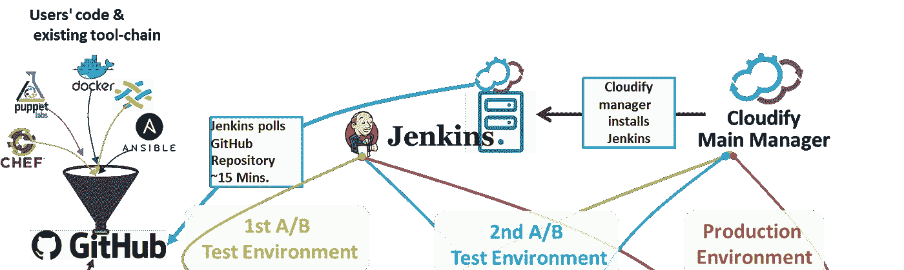

# 10+最佳 Jenkins 初学者教程[2023 年 3 月]-在线学习 Jenkins

> 原文：<https://medium.com/quick-code/top-tutorials-to-learn-jenkins-ci-for-testing-automation-93c7ac068f66?source=collection_archive---------0----------------------->

## 用 2023 年最佳 Jenkins 初学者教程学习 Jenkins 的测试自动化。

詹金斯站在当今科技的最前沿。就其对软件开发和操作实践的破坏而言，它也是过去十年中最引人注目的技术之一。

Jenkins 持续集成解决方案已经成为各种规模的组织在敏捷时代提高生产力和简化软件开发的备用方案。它拥有广泛的社区支持，通过开发数千个有用的插件扩展了 Jenkins 的核心功能。一个超过 1100 个插件的生态系统已经出现，使客户能够添加各种功能，并将 Jenkins 与从 Active Directory 到 GitHub 再到 Tomcat 的所有东西集成在一起。

Jenkins 正在成为 DevOps 的必备工具。它允许公司非常快速地构建非常复杂的构建管道，从而大大降低软件开发生命周期中的风险。许多公司已经在使用 Jenkins 来实施持续集成管道。今天，您可以在自己的台式机上使用同样的技术。

# 1.[使用管道和 Docker 与 Jenkins 一起学习 devo PS:CI/CD](https://click.linksynergy.com/deeplink?id=Fh5UMknfYAU&mid=39197&u1=quickcode&murl=https%3A%2F%2Fwww.udemy.com%2Flearn-devops-ci-cd-with-jenkins-using-pipelines-and-docker%2F)

用 DevOps 的方式利用 Jenkins。使用 Jenkins Pipelines、Docker 和 Jenkins Job DSL 自动执行 Jenkins 作业。

本课程将教你如何使用 Jenkins DSL 和 Jenkins 管道(Jenkinsfile)来使用 Jenkins。这是一种使用詹金斯的新方法，而不是使用自由式项目。我称之为利用詹金斯，DevOps 的方式。我将向您解释作为代码和自动化的基础设施，以确保您理解 Jenkins Pipelines 如何适应这种新的思维方式。

它将向您展示如何将 Jenkins Pipelines 与流行的软件工具相集成，例如:

*   码头工人
*   GitHub / Bitbucket
*   JFrog Artifactory
*   索纳库贝
*   Onelogin(使用 SAML)

# 2.[机器人框架测试自动化:Jenkins CI 和 Git 版本控制](https://linkedin-learning.pxf.io/c/1137078/646189/8005?u=https%3A%2F%2Fwww.linkedin.com%2Flearning%2Frobot-framework-test-automation-jenkins-ci-and-git-version-control&subId1=quickcode)

了解如何将 Jenkins 和 Git 集成到 Robot 框架中，以便进行自动化连续测试，并通过共享代码库和脚本进行版本控制。

在本课程中，您将学习如何:

*   在本地设置和使用 Git。
*   远程 GitHub 和 Team Foundation Server (TFS)存储库。
*   分支和合并机器人框架脚本，作为测试团队更有效地工作。

您将学习如何在本地设置和使用 Git，然后将相同的技能应用到远程 GitHub 和 Team Foundation Server (TFS)存储库，这样您就可以分支和合并 Robot 框架脚本，并作为测试团队更有效地工作。

然后，您将学习如何使用 Jenkins 触发机器人框架测试在不同的浏览器和操作系统上自动并行运行，并使用结果来分析性能趋势。

# 3.[与 Jenkins 一起学习 Devops 综合指南](https://www.eduonix.com/learn-devops-with-jenkins-all-in-one-guide/UHJvZHVjdC0zMjMyMDA=)

这种与 Jenkins 课程的持续集成旨在帮助您从头开始掌握这款出色的软件。我们假设你没有关于 Jenkins 和持续集成的知识，但是我们假设你知道 Ubuntu 是如何工作的，以及基本的虚拟化概念。

通过动手实践，您将确切了解什么是 CI，什么是 Jenkins，如何安装 CI，如何将其集成到您的代码中，以及如何测试您的代码。您还将学习一些 Java 知识，包括创建一个基本的“Java Hello World”项目。

在本课程中，您会发现:

*   什么是詹金斯和持续集成
*   系统简介
*   如何安装 Jenkins 并集成 CI
*   Jenkins 的基本配置
*   通过 Jenkins 使用 Maven 构建和测试 Java 应用程序的真实例子。

# 4.[詹金斯简介](https://www.awin1.com/cread.php?awinmid=6798&awinaffid=466009&clickref=quickcode&ued=https%3A%2F%2Fwww.edx.org%2Fcourse%2Fintroduction-to-jenkins)

了解使用 Jenkins automation server 实施持续集成(CI)和持续交付(CD)工作流所需的基础知识。

在本课程中，您将学习:

*   理解 Jenkins 在软件开发生命周期中的作用。
*   设置并访问 Jenkins 自动化服务器。
*   通过配置和运行各种类型的 Jenkins 作业构建您的软件。
*   安装和管理插件。
*   扩展并保护 Jenkins。

在本课程中，您将讨论 CI/CD 的基础知识，并且您将谈论它们如何帮助转变整个软件交付过程。

它对于 DevOps 工程师、软件开发人员和架构师，以及专注于站点可靠性和质量保证的专业人员来说是最有用的，尽管参与软件交付过程的任何人都会受益。

本课程介绍了 Jenkins automation server，还包括如何为您的 CI/CD 工作流设置/使用 Jenkins 的说明。

完成后，您将对 Jenkins 在软件开发生命周期中扮演的角色、如何安装 Jenkins 服务器、如何为其构建软件、如何管理第三方集成/插件以及如何扩展和保护 Jenkins 有一个扎实的了解。

最后，您将大致了解如何进一步提高您的 CI/CD 技能。

# 5.[devo PS 工具包:与 Jenkins X 合作](https://www.educative.io/courses/devops-toolkit-working-with-jenkins-x?affiliate_id=5088579051061248)

在本课程中，您将从探索 Jenkins X 的内部工作方式以及如何使用它创建集群开始。

该课程包括:

*   詹金斯 X 是什么？
*   探索快速启动项目
*   将现有项目导入 Jenkins X
*   创建自定义构建包
*   应用 GitOps 原则
*   改进和简化软件开发
*   使用拉取请求和预览环境
*   促进生产发布
*   版本控制版本
*   实施 ChatOps
*   使用管道扩展模型
*   升级 Jenkins X 组件
*   扩展詹金斯 X 管道
*   使用 Jenkins X 定义和运行无服务器部署
*   选择正确的部署策略
*   将 GitOps 原则应用于 Jenkins X

然后，您将学习如何将 Jenkins X 与您已经在使用的工具结合起来。在整个过程中，您将看到这个令人兴奋的新工具如何改变您与 Kubernetes 的工作方式。

完成后，您将有信心在 Kubernetes 集群中使用 Jenkins X 管理 CI/CD。

# 6.[与 Jenkins 一起构建现代 CI/CD 管道](https://pluralsight.pxf.io/c/1137078/424552/7490?u=https%3A%2F%2Fwww.pluralsight.com%2Fcourses%2Fbuilding-modern-ci-cd-pipeline-jenkins&subId1=quickcode)

通过学习如何编写 Jenkins 管道，您可以可靠、安全且一致地构建、测试和部署代码。

该课程包括:

*   Jenkins 脚本化管道入门
*   建筑和测试规范
*   整合容器安全性和合规性
*   实现连续部署管道
*   Jenkins 管道的故障排除和改进

在本课程“与 Jenkins 一起构建现代 CI/CD 管道”中，您将深入学习编写 Jenkins 管道的基础知识。

首先，你将学习基本的语法和表达。接下来，您将发现如何在 GitHub 中对管道代码进行版本控制。

最后，您将探索如何从共享库中导入函数和管道代码。

完成本课程后，您将具备 DevOps 工程师创建、版本化和部署管道代码所需的技能和知识。

# 7. [Jenkins:持续集成& DevOps 与 Java 和。净](https://click.linksynergy.com/deeplink?id=Fh5UMknfYAU&mid=39197&u1=quickcode&murl=https%3A%2F%2Fwww.udemy.com%2Fjenkins-learn-continuous-integration%2F)

Jenkins:学习现实世界项目的持续集成和 DevOps。使用 Jenkins 简化软件构建。

今天，技术部门正在全世界范围内蓬勃发展。每天都有数百家创业公司成立。为了快速发展，这些创业公司需要尽可能多的精通自动化的人。大多数渐进式创业公司——从一开始就支持实现完全自动化的开发管道。他们意识到这些持续集成(CI)和开发的实践将在速度和敏捷性方面产生巨大的好处。在过去的几年里，对这些技能的需求一直在稳步上升。

Jenkins 是一个屡获殊荣的开源工具集，它使我们能够非常快速地构建非常复杂的自动化构建管道。它拥有广泛的社区支持，通过构建和共享数百个非常有用的插件，增强了 Jenkins 的核心功能。实现与 Jenkins 的持续集成可以极大地帮助我们降低软件开发生命周期中的风险。它能及早发现我们的错误，并提高我们软件产品的质量。这反过来降低了在任何环境下开发创新软件的总成本——无论是初创公司还是企业。

在过去的几年中，对拥有这些工具经验的专业人员的需求一直在稳步增长。这些技能的工资和咨询费也一直在上涨，而且随着对这些技能的需求保持稳定或增加，这种价格肯定会上涨。

在本课程中，我们将:

*   了解 CI 及其重要性
*   了解詹金斯
*   与 Jenkins 一起构建自动化 CI 渠道
*   了解如何对关系数据库模式进行版本控制和管理
*   运行 CI 管道来维护构建工件
*   了解如何配置、保护和扩展 Jenkins
*   了解如何配置自动生成通知
*   将 CI 构建与 GitHub 中托管的 Git 存储库集成

# 8.[与 GIT(Flow) Jenkins、Artifactory、Sonar、ELK、JIRA 合作开发](https://click.linksynergy.com/deeplink?id=Fh5UMknfYAU&mid=39197&u1=quickcode&murl=https%3A%2F%2Fwww.udemy.com%2Fdevops-with-git-jenkins-artifactory-and-elk-stack%2F)

完整的开发运维实践课程将展示开发运维工具链的高效使用。

在本课程中，我们将回顾一些最佳实践和工具链，它们将帮助您为运营和开发设置自动化工作流。它将帮助您增加关于 DevOps 的知识，并为您提供成为贵公司变革代理的机会，以最大限度地减少分支、代码提交、代码审查、代码合并、构建、测试(单元和集成)、代码质量指标和标准、与 repository manager 的集成、分析、将代码部署到服务器以及跨环境的应用程序监控的手动任务。本课程还从识别需求、捕获、开发和部署的角度讲述了敏捷生命周期，并通过故事提供了可追溯性。

Apache Tomcat、Apache Maven、Jfrog Artifactory、Jenkins (Maven 风格和管道风格)、Jenkins Plugins、SonarQube、ELK (Elasticsearch、Logstash 和 Kibana)、GitHub (Git Flow)、Spring STS、Atom、Atlassian Source Tree、CLI、Spring Boot、Junit、eclema(jaco co)、JIRA、Confluence、NGROK 以及本课程中将用到的其他几个配置项。

# 9.[与 Jenkins 一起学习 DevOps 综合指南](https://click.linksynergy.com/deeplink?id=Fh5UMknfYAU&mid=39197&u1=quickcode&murl=https%3A%2F%2Fwww.udemy.com%2Flearn-devops-with-jenkins-all-in-one-guide%2F)

成为 DevOps 大师，与 Jenkins 一起掌握 CI 和 CD。

放弃花费在调试代码上的时间，甚至是寻找哪个 bug 破坏了持续集成。因此，Jenkins 可以在您编写代码时帮助您，而不是浪费时间检查每一行代码中的错误，或者运行许多不同的工具来测试哪些代码不起作用。

持续集成在每次代码更改时都会进行测试，这意味着您添加的每一行代码都会被自动测试，测试结果会让您知道代码是正常工作还是中断。这就是为什么它目前非常受开发人员和程序员的欢迎，因为它节省了他们大量的时间。

本课程由专家设计和构建，他们将帮助将持续集成分解为小而易于理解的部分。我们创建了本教程作为指南，帮助新手不仅学习什么是 CI，而且实际上理解如何在他们的代码中集成 CI。我们假设你没有关于 Jenkins 和持续集成的知识，但是我们假设你知道 Ubuntu 是如何工作的，以及基本的虚拟化概念。

本课程采用动手操作的方法，在每个阶段都有实例，帮助学生真正理解和学习正在发生的事情，而不是简单地跟着视频走，最终迷失方向，不知所措。我们还使用一个学生将与教师一起构建的示例项目。

本课程将涵盖关于 CI 和 Jenkins 的重要主题，如什么是 Jenkins 和持续集成、Jenkins 系统简介、如何安装 Jenkins 和集成 CI、Jenkins 的基本配置，还将通过 Jenkins 使用 Maven 创建和测试 Java 应用程序来构建一个真实的示例。

在本课程结束时，您将确切了解什么是 CI，它如何帮助您，以及如何将您从数小时痛苦的代码检查和调试中解救出来。

# 10. [Jenkins Bootcamp:通过部署完全自动化构建](https://click.linksynergy.com/deeplink?id=Fh5UMknfYAU&mid=39197&u1=quickcode&murl=https%3A%2F%2Fwww.udemy.com%2Fjenkins-continuous-integration-bootcamp%2F)

对使用持续集成和部署技术的 Jenkins 构建服务器的介绍—全部循序渐进。

这是一门综合课程，旨在展示如何设置和运行 Jenkins CI 服务器，从持续检查(构建、测试和分析)一直到持续部署。本课程为在您的公司或工作室实施持续检查、持续集成、持续交付甚至持续部署提供了坚实的基础。为了使课程简明扼要，我们做了几个决定，以便提供一个从 CI 到 CD 的完整路径。

在本课程中创建的管道包括以下内容:

*   在 Windows 上安装和配置的 Jenkins CI 服务器
*   Git 作为源代码控制系统
*   Java 作为构建项目的主要编程语言
*   Maven 作为构建工具
*   作为静态代码分析工具的 Findbugs、PMD 和 Checkstyle
*   Tomcat 作为部署服务器

这套工具提供了全面的端到端实施持续部署管道。Jenkins 可以安装在许多操作系统上，并支持各种工具和技术，这意味着，本课程为那些熟悉或对其他操作系统和/或技术感兴趣的人提供了巨大的价值。

*简介*提供了课程的概述，为 Jenkins 提供了*核心概念*。这为课程的剩余部分提供了基础。

*安装*提供了如何在 Windows 上设置 Jenkins 和所有相关工具的分步说明。同样的原则也适用于其他操作系统。

*基础知识*通过一个非常简单的“自由式”项目，让我们初步了解詹金斯的工作。这使我们能够了解 Jenkins 界面及其提供的主要功能。

在那之后，我们具体地深入到 *Maven 项目*中——因为 Jenkins 天生理解 Maven，因此为 Maven 项目提供了特殊的特性。

詹金斯能做的远不止简单的建造。在*测试&质量*中，我们为 Java 项目连接了一套标准的单元测试和质量分析工具。然后，我们使用这些信息来影响基于已建立标准的构建状态。

我们还将介绍如何使用 Jenkins 作为一个工件存储库，在成功的构建之后用来存储构建工件，比如 jar 和 wars。当在一个更全面的软件交付策略中将 Jenkins 与其他工具集成在一起时，这尤其有用。

然后，我们将所有东西放在一起，以便将*部署*到正在运行的 Tomcat 服务器。不要担心，我将带您完成完整的设置和配置，以便与 Jenkins 无缝协作！

最后，如果不谈论安全性，任何课程都是不完整的。在这最后一章，我们设置 Jenkins 允许用户登录并且只能看到他们的项目。

# 11. [DevOps CI & CD 与 Jenkins pipelines Maven Gradle](https://www.eduonix.com/devops-ci-and-cd-with-jenkins-pipelines-maven-gradle/UHJvZHVjdC0zMjMyMDA=)

本课程旨在向您介绍 Jenkins 的来龙去脉以及如何设置 DevOps 管道，即使您几乎没有这方面的经验，也可以帮助您实施这些 DevOps 实践，从而简化您的开发流程。

主詹金斯和管道插件。熟悉先进的 DevOps 技术，让您的 DevOps 职业生涯更上一层楼。

本课程是为所有级别的 DevOps 从业者设计的，他们希望提高自己的技能，在自己的环境中实现自动化，并继续作为 DevOps 工程师受到大量需求。

# 12.[詹金斯基本训练](https://linkedin-learning.pxf.io/c/1137078/646189/8005?u=https%3A%2F%2Fwww.linkedin.com%2Flearning%2Fjenkins-essential-training&subId1=quickcode)

本课程涵盖了平台的基础知识，包括自动化构建、测试和安全部署。

在本课程中，您将学习如何:

*   了解平台的基础，包括自动化构建、测试和安全部署。
*   创建作业，触发构建，并将这些构建分发到多个环境中。
*   添加通知以提醒您构建状态的更改和失败。
*   用插件、共享库和 API 扩展 Jenkins。

了解如何创建作业、触发构建以及将这些构建分发到多个环境中。它还展示了如何添加通知来提醒您构建状态变化和失败，以及如何用插件、共享库和 API 来扩展 Jenkins。

该课程还解释了如何保护对 Jenkins 环境的部署和访问，以及如何存储构建过程中的工件以进行安全保护。

另外，了解如何将 CI/CD 流程的多个阶段合并到一个自动化管道中。

该课程包括高级使用案例、最佳实践和定制技巧，旨在为初次使用者提供技能，使其成为一名优秀的 Jenkins 工程师。

# 13.[学习詹金斯](https://linkedin-learning.pxf.io/c/1137078/646189/8005?u=https%3A%2F%2Fwww.linkedin.com%2Flearning%2Flearning-jenkins&subId1=quickcode)

该简介帮助您使用 Jenkins 更快、更可靠地发布和部署软件。

在本课程中，您将学习如何:

*   使用 Jenkins 更快、更可靠地发布和部署软件。
*   在 Mac、Windows、Linux 或 Docker 容器中设置 Jenkins。
*   一步一步地配置您的第一个作业，直到必要的“Hello，World”输出。
*   通过参数使您的工作更加有用和可移植。
*   在本地或虚拟机上安装 Jenkins。

首先，了解如何在 Mac、Windows、Linux 或 Docker 容器中设置 Jenkins，并了解如何使用 Jenkins 插件来扩展其功能。

接下来，逐步配置您的第一个作业，直到必要的“Hello，World”输出，并学习使用参数使您的作业更加有用和可移植。

然后，探索作业调度，以及 Jenkins 用于定期运行作业的方便的别名。

> 感谢您阅读本文。我们策划了更多主题的顶级教程，您可能想看看:

 [## 15+最佳 Docker 初学者教程——在线学习 Docker

### 用 2021 年面向初学者的最佳 Docker 教程学习面向开发者的 Docker 容器开发

tutorials.botsfloor.com](https://tutorials.botsfloor.com/top-tutorials-to-learn-docker-to-run-distributed-applications-bce896e260ec)  [## 10+最佳新手 Git 教程——在线学习 Git

### 在 2021 年的最佳 Git 初学者教程中学习 Git 的代码管理和版本控制

medium.com](/quick-code/top-tutorials-to-learn-git-for-beginners-622289ffdfe5)  [## 初学者的 10 个最佳 Selenium 教程——在线学习 Selenium

### 学习 Selenium，成为更好的测试开发人员和质量工程师，为初学者提供最好的 Selenium 教程

medium.com](/quick-code/top-tutorials-to-learn-selenium-for-beginners-4e1f301585) 

> **更新**:我们创建了最新版本的[顶级詹金斯教程](http://blog.coursesity.com/best-jenkins-tutorials/?utm_source=botsfloor&utm_medium=referral&utm_campaign=mediumPost&utm_term=learn-Jenkins)。随时检查今年最好的詹金斯教程。

披露:我们与本文中提到的一些资源有关联。如果你通过本页的链接购买课程，我们可能会得到一小笔佣金。谢谢你。