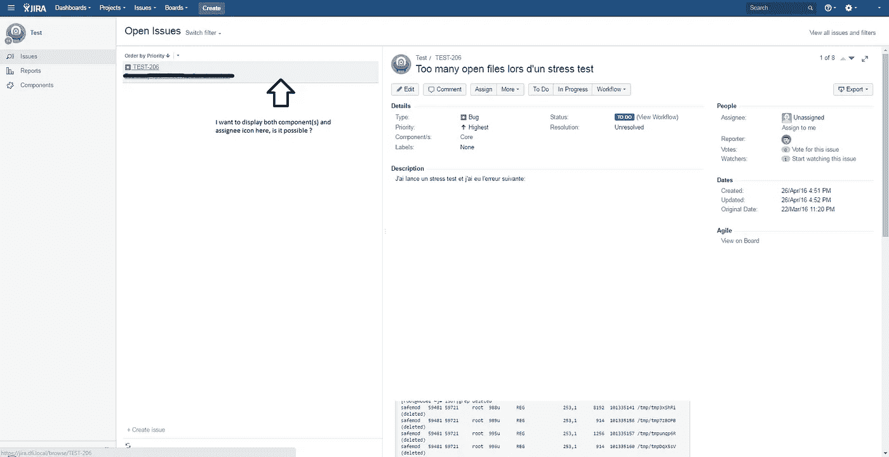

# 10+最佳 JIRA 初学者教程[2022 年 7 月]——在线学习 JIRA

> 原文：<https://medium.com/quick-code/top-tutorials-to-learn-jira-9120b409ccee?source=collection_archive---------0----------------------->

## 用 2022 年吉拉最佳初学者教程学习吉拉管理 bug 跟踪和敏捷项目管理

吉拉是软件行业广泛使用的项目管理工具和问题跟踪工具。项目经理使用吉拉和 confluence 来管理初创公司和公司中的敏捷项目。对吉拉的理解有助于项目经理了解如何跟踪项目的进展，并以较少的努力和时间实现软件交付。

> 披露:我们与本文中提到的一些资源有关联。如果你通过本页的链接购买课程，我们可能会得到一小笔佣金。谢谢你。

# 1.[用真实世界的例子学习 JIRA](https://click.linksynergy.com/deeplink?id=Fh5UMknfYAU&mid=39197&u1=quickcode&murl=https%3A%2F%2Fwww.udemy.com%2Fthe-complete-guide-to-jira-with-real-world-examples%2F)

通过这个关于 JIRA 软件和 Confluence 的综合课程，学习如何处理、管理和实施敏捷项目

通过本课程:

*   了解什么是 JIRA，JIRA 的好处以及如何使用 JIRA
*   理解 Scrum——利益相关者、事件和整个工作流程
*   理解看板工作流程
*   使用 JIRA 作为在敏捷团队中工作的用户——创建、处理和搜索问题，定制仪表板等。
*   使用 JIRA 作为敏捷团队的经理——配置敏捷董事会，管理待办事项，冲刺和发布等等。
*   管理 JIRA 的所有方面—创建用户、组、设置权限、配置问题类型、屏幕、字段、工作流等。
*   使用本课程中提供的示例，根据您自己的独特需求定制和使用 JIRA
*   (通过课程中的例子)了解如何在不同的场景或情况下利用 JIRA
*   了解汇流的基础知识
*   了解如何将 JIRA 和 Confluence 结合使用，以便更好地工作，总体上更有效率

本课程通过真实世界的示例介绍 JIRA 的所有核心功能和概念，适合所有用户、经理和管理员。

涵盖了 JIRA 的主要方面，包括在敏捷团队中工作，领导敏捷团队，以及管理构成 JIRA 的主要事物。

# 2.[学习吉拉软件](https://linkedin-learning.pxf.io/c/1137078/646189/8005?u=https%3A%2F%2Fwww.linkedin.com%2Flearning%2Flearning-jira-software-3&subId1=quickcode)

规划项目、分配任务、跟踪进度和发布结果都可以在吉拉管理，这是开发团队流行的协作软件。

在本课程中，您将了解:

*   使用吉拉的基本原则。
*   该工具的功能有助于将日常用户转变为高级用户。
*   如何创建票证。
*   如何找到分配给您和其他人的问题

本课程分享专业知识，引导您了解使用吉拉的基础知识。它深入挖掘了该工具的功能，有助于将日常用户转变为高级用户。

了解如何创建票证、查找分配给您和其他人的问题、使用高级搜索、创建仪表板以及设置工作流板来组织工作。此外，

本课程提供了一些挑战和解决方案，因此您可以在学习过程中实践所学。它还涵盖了新吉拉体验的元素，包括下一代主板和用户项目。

# 3.[通过真实世界的例子学习 JIRA(+融合奖金)](https://www.eduonix.com/learn-jira-with-real-world-examples-confluence-bonus/UHJvZHVjdC0zMjMyMDA=)

通过这个关于 JIRA 软件和 Confluence 的综合课程，学习如何处理、管理和实施敏捷项目。

该课程包括:

*   **敏捷概念**详细介绍 Scrum 和看板方法。在本节结束时，您将对这些方法有一个全面的了解，因为我确保在谈到它们如何工作时，我触及了最重要的问题。
*   **在敏捷团队中工作**第一次浏览吉拉用户界面，学习如何创建问题、通过敏捷板处理问题、搜索问题、创建自定义仪表板以查看吉拉发生的事情，以及其他有益于任何敏捷团队成员的功能。
*   **领导一个敏捷团队**配置和管理敏捷董事会，创建和维护待办事项，开始和结束冲刺，创建发布。所有这些步骤都忠实于上一节中描述的敏捷步骤。
*   **吉拉管理**介绍了所有主要的管理部分，每个部分都有一个例子，你可以用它来跟随。在本节结束时，你将了解吉拉所有可定制的方面，并能够迎合自己的实例，以满足自己的特定需求。
*   **真实世界的例子、场景和奖励内容**在这里，你将学习如何使用吉拉跟踪和预测你的个人日常任务列表，同时使用基于日常 scrum 的流程，以及其他例子。

本课程通过真实世界的例子介绍了 JIRA 的所有核心功能和概念，并且适合一般用户、经理和管理员。

截至 2018 年 3 月更新，它整合并使用了为云上 JIRA 软件发布的一些最新功能* *。

# 4.[吉拉:入门](https://pluralsight.pxf.io/c/1137078/424552/7490?u=https%3A%2F%2Fwww.pluralsight.com%2Fcourses%2Fjira-getting-started&subId1=quickcode)

吉拉是世界上使用最广泛的项目规划和状态跟踪应用程序之一，具有丰富的功能和定制点。本课程的重点是你需要知道如何有效地利用吉拉。

该课程包括:

*   理解吉拉的主要概念
*   使用问题和讨论板
*   理解和维护工作流
*   发现和报告问题
*   使用和定制仪表板以节省团队时间
*   对存储库使用吉拉
*   创建和配置项目
*   了解更多信息

您将专注于在您自己的项目和团队中每天快速使用该工具。

首先，您将学习吉拉的核心概念和术语，如何创建问题和计划即将开展的工作，如何跟踪讨论板的工作状态，如何定制讨论板，以及如何搜索和报告问题。

接下来，您将看到如何利用吉拉中的代码提交信息，如何创建定制的仪表板，以及如何从项目模板中进行选择。

当你学完这门课程后，你就可以投入到吉拉的学习中去了。

# 5.[最佳 QA 手册软件测试:活项目+敏捷+吉拉+API](https://click.linksynergy.com/deeplink?id=Fh5UMknfYAU&mid=39197&u1=quickcode&murl=https%3A%2F%2Fwww.udemy.com%2Fbest-manual-software-testing-live-project-agile-jira%2F)

终极 QA 手动测试课程，包含实时项目和实时演示+实时面试问题+终身支持

通过本课程:

*   向有经验的专业人士学习并开始你的软件质量保证领域的职业生涯。
*   你将从头到尾看到现场项目。
*   学完这门课程后，你一定会成为一名优秀的软件测试人员。
*   您将从您作为测试人员的角色和您的团队职责开始。
*   您将会了解到实时项目的介绍、敏捷方法、测试计划、测试用例、测试缺陷、缺陷生命周期、不同的环境、发布过程、API 测试等等。
*   您将学习如何实时执行测试。你也将获得像吉拉这样的敏捷和测试管理工具的实际经验。

这门课程完全是根据实践方法设计的。从开始到结束，你会看到自己在一个组织中工作，在一个实时项目中工作。本课程为您提供了软件测试的完整周期，从您的角色到开发软件的不同方法，从客户到需求文档，从软件开发到实时测试，再到发布过程。

您将能够看到软件测试的端到端方法。你将会得到真正的测试计划、测试用例文档以及非常实用的面试问题。

# 6.[学习阿特拉斯·JIRA——对于敏捷软件开发团队](https://click.linksynergy.com/deeplink?id=Fh5UMknfYAU&mid=39197&u1=quickcode&murl=https%3A%2F%2Fwww.udemy.com%2Flearn-jira-in-4-hours%2F)

从头开始学习 Atlassian JIRA，并开始有效地将其用于软件开发和测试。

在本课程中，学习:

*   如何安装 JIRA 并开始学习 JIRA
*   如何有效地使用 Atlassian JIRA 进行测试用例管理
*   如何在 JIRA 进行缺陷管理
*   如何在 JIRA 使用不同的报告
*   了解敏捷开发方法
*   如何创建和配置 JIRA 敏捷董事会 SCRUM 和看板
*   如何有效地使用 JIRA 查询语言(JQL)搜索 JIRA 的问题

在本课程中，你将学习 JIRA 从非常基础到高级的 JIRA 概念，如 SCRUM 和看板。本课程经过深思熟虑和精心设计，适合非常基础和高级的 JIRA 用户。它涵盖了 JIRA SDLC 的所有方面，并解释了如何使用 JIRA 进行测试管理、项目管理、缺陷管理、敏捷软件开发、报告等等。

# 7.[让用户、经理和管理员了解吉拉](https://click.linksynergy.com/deeplink?id=Fh5UMknfYAU&mid=39197&u1=quickcode&murl=https%3A%2F%2Fwww.udemy.com%2Fintroduction-to-jira%2F)

开始使用 Atlassian 强大的敏捷项目管理和问题跟踪工具所需的一切。

在本课程中，您将:

*   了解吉拉的核心特征及其运作方式。
*   更有效地利用吉拉。
*   作为团队领导或经理，受益于吉拉。
*   将吉拉设置为您的团队或公司的管理员。

在第一个模块中，课程涵盖了一些核心概念和术语，在深入研究软件本身之前，你需要了解敏捷和吉拉。
之后，你将从最终用户的角度来看待吉拉。在第四单元中，您将从管理员的角度来看吉拉。

# 8.[JIRA 团队工作流程](https://click.linksynergy.com/deeplink?id=Fh5UMknfYAU&mid=39197&u1=quickcode&murl=https%3A%2F%2Fwww.udemy.com%2Fteam-workflows-in-jira%2F)

为团队构建工作流以在 JIRA 使用的实用指南

通过本课程，学习如何:

*   定制 JIRA 的敏捷特性。
*   更好地了解 JIRA 的工作流程。
*   能够定制 JIRA 的敏捷板。

JIRA 团队工作流程课程旨在为您提供一些提示、技巧和技术，您可以立即使用，以便在 JIRA 更好地工作。您将使用基于项目的方法来构建一个工作流，该工作流允许开发团队将问题发送给 QA 团队，然后让 QA 团队通过 JIRA 的敏捷委员会将问题发送回来。

您将了解 JIRA 的许多功能，包括敏捷板、过滤器、权限、工作流程、方案等等。

# 9.[使用 JIRA 工具完成敏捷 scrum 项目管理](https://click.linksynergy.com/deeplink?id=Fh5UMknfYAU&mid=39197&u1=quickcode&murl=https%3A%2F%2Fwww.udemy.com%2Fcomplete-agile-scrum-project-management-using-jira-tool%2F)

使用 JIRA 工具逐步完成敏捷项目管理指南

在本课程中，您将学习:

*   敏捷过程
*   敏捷优势
*   敏捷中每个成员的角色和职责
*   冲刺计划会议、回顾会议、每日 scrum 会议
*   JIRA 装置
*   JIRA 的优势和特点
*   JIRA 的基本概念
*   Scrum 板创建/配置
*   冲刺/问题/管理过滤器
*   仪表板创建/配置
*   使用小工具创建报告(仪表板)
*   创建 scrum 板/使用 scrum 板
*   创建任务/子任务
*   创建问题/错误报告

作为 JIRA 课程的一部分，我们将介绍一些特性，每个特性都将涉及敏捷 scrum 项目的实践方法，包括:概述敏捷，什么是 scrum，scrum 概述，scrum 好处，scrum rolxdes 等等。

# 10. [JIRA 视觉参考:发行管理](https://click.linksynergy.com/deeplink?id=Fh5UMknfYAU&mid=39197&u1=quickcode&murl=https%3A%2F%2Fwww.udemy.com%2Fjira-visual-reference-issue-administration%2F)

JIRA 问题管理区的管理员指南。

通过本课程，您将拥有

*   对 JIRA 发行管理领域的每个部门都有深刻的理解。
*   一个伟大的想法是什么 JIRA 有能力这样你就知道如何提高你的球队在 JIRA 的表现。

本课程涵盖了 JIRA 发行管理的所有功能。您将了解什么是问题类型，如何使用它们，如何创建它们，以及如何将它们应用到项目中。然后，您将了解什么是工作流，如何创建它们，并深入了解我们为它们提供的各种过渡选项。在此过程中，您将了解如何将工作流方案应用到项目中。

从那里你将继续前进，因为我们了解屏幕，字段，问题的特点，问题的属性和许多更多的特点在 JIRA。

# 11.[快速了解 JIRA——完善你的简历，勇往直前！](https://click.linksynergy.com/deeplink?id=Fh5UMknfYAU&mid=39197&u1=quickcode&murl=https%3A%2F%2Fwww.udemy.com%2Flearn-jira-quickly%2F)

更智能、更快速地计划、跟踪和工作！从头开始学习亚特兰蒂斯 JIRA，完善你的简历&给每个人留下深刻印象！

在本课程中:

*   了解关于 JIRA 的关键概念
*   创建适合跟踪敏捷、帮助台、项目管理和任何其他类型的项目
*   创建、编辑和管理不同类型的问题(故事、任务、子任务)
*   通过使用 JQL 学习基本和高级搜索，成为超级用户
*   与 JIRA 一起创建令人印象深刻的报告

本课程着重于使用 JIRA 的实用性。通过快速提示和快捷方式(如问题和 JQL 的高级菜单项以及报告)快速清晰地涵盖了这些概念。

这也涵盖了 JIRA 敏捷如何与敏捷董事会和各种敏捷报告一起工作。它将允许您创建自己的项目、问题、搜索查询、agile 公告板和报告。

# 12.[通过敏捷学习 JIRA【面向开发人员、测试人员、经理和管理员】](https://click.linksynergy.com/deeplink?id=Fh5UMknfYAU&mid=39197&u1=quickcode&murl=https%3A%2F%2Fwww.udemy.com%2Fjirawithagile%2F)

包括用户管理、不同的生命周期和敏捷板

本课程使您:

*   准备好使用 JIRA 进行测试管理了吗
*   以敏捷方式跟踪和管理项目的专家

JIRA 问题将跟踪项目背后的 bug 或问题。导入项目后，您可以创建问题。
在“问题”下，您会发现其他有用的功能，如问题类型、工作流屏幕、字段、问题属性。

> 感谢您阅读本文。我们策划了更多主题的顶级教程，您可能想看看:

 [## 面向初学者的 8 门最佳看板培训认证课程——在线学习看板

### 学习看板，通过 2021 年初学者最佳看板教程提高你的敏捷项目管理技能

medium.com](/quick-code/top-online-tutorials-to-learn-kanban-for-project-management-779d0dec0cad)  [## 10+最佳初学者 Scrum 和敏捷教程——在线学习 Scrum 和敏捷

### 学习软件项目管理技术来发展你作为软件项目经理的职业生涯。

medium.com](/quick-code/top-tutorials-to-learn-scrum-and-agile-4199b0f36c24)  [## 初学者的 9 个最佳 GraphQL 教程——在线学习 GraphQL

### 用 2021 年最好的初学者 GraphQL 教程学习后端开发工作的 GraphQL

medium.com](/quick-code/top-online-video-tutorials-to-learn-graphql-458056e3b583) 

披露:我们与本文中提到的一些资源有关联。如果你通过本页的链接购买课程，我们可能会得到一小笔佣金。谢谢你。