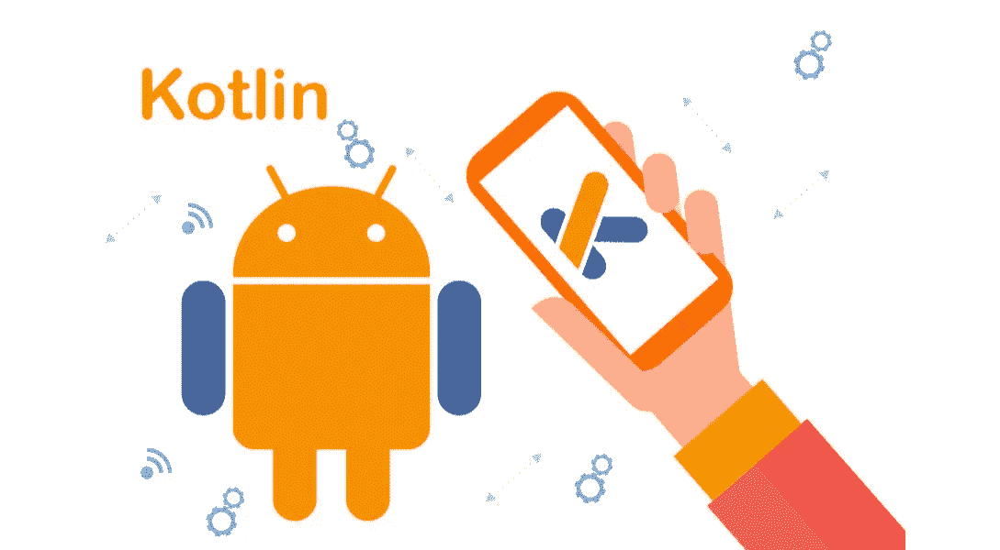
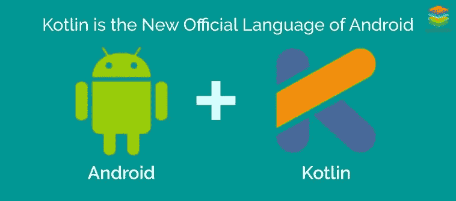
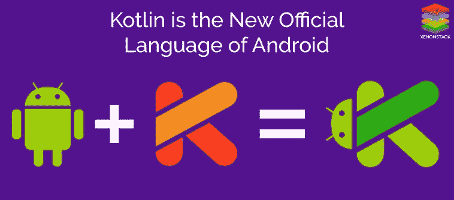

# 10+最佳科特林初学者教程[2023 年 3 月]-在线学习科特林

> 原文：<https://medium.com/quick-code/top-tutorials-to-learn-kotlin-android-development-for-beginners-fad63af16996?source=collection_archive---------0----------------------->

## 用 2023 年最好的 Kotlin 初学者教程学习 Kotlin for android 开发。

Kotlin 是未来移动应用程序制造的主导语言，已被全球最大的公司 Google 采用，其特点是同时具备易用性和强大功能。Kotlin 开发增长非常快，对 kotlin 开发人员的需求从来没有这么高。开始学习 android 移动应用程序的 kotlin 开发。

## 1. [Kotlin 初学者:用 Kotlin 学习编程](https://coursesity.com/r/site/kotlin-for-beginners-learn-programming-with-kotlin)

从零开始学习科特林。掌握面向对象和惯用的 Kotlin 实现编码项目和 Android 应用。

这门课将教你用科特林语言编程。它从基础开始，所以这门课程完全适合初学者。您将在几个编码挑战中把您学到的东西付诸实践。所以最后，你将能够用 Kotlin 创建你自己的应用程序。

如果你是一个 Android 开发者，你可以通过这个课程来快速掌握这种令人敬畏的语言。Kotlin 将允许您维护一个更干净、更有表现力的代码库，使用甚至超越 Java 8 的概念，并为 Android 编写更健壮的应用程序。

## 2.[面向 Java 开发者的 kot Lin](https://coursera.pxf.io/c/1137078/1213622/14726?u=https%3A%2F%2Fwww.coursera.org%2Flearn%2Fkotlin-for-java-developers&subId1=BotTutorials)

本课程旨在与您分享科特林的力量和美丽。您将对这种语言有一个基本的概述，以及对许多关键案例的讨论，尤其是关于 Java 互操作性的讨论。课程基于你的 Java 经验；它展示了两种语言之间的相似之处，并重点介绍了不同之处。

它将讨论基本语法、可空性、使用 Kotlin 的函数式编程、使用 Kotlin 的面向对象编程、Kotlin 标准库的强大功能以及 Java 互操作性。

## 3.[面向 Android 开发者的中级 kot Lin](https://linkedin-learning.pxf.io/c/1137078/646189/8005?u=https%3A%2F%2Fwww.linkedin.com%2Flearning%2Fintermediate-kotlin-for-android-developers&subId1=quickcode)

如果您是一名中级开发人员，有兴趣了解更多关于 Kotlin 的知识，本课程可以帮助您了解这种简洁、有趣的语言在 Android 开发中的效率和功能。

该课程包括:

*   Kotlin 概述
*   扩展功能和属性
*   合并 Anko
*   高级 Anko
*   使用集合

本课程首先概述 Kotlin 必须提供的功能，然后深入讨论扩展功能和属性，包括如何利用 Kotlin Android 扩展插件。

它还解释了如何使用 Anko，并概述了该库的一些主要构件:公共对象、布局和协程。最后，本课程将介绍如何使用集合。

## 4. [Kotlin Android 开发大师班—使用 Android Oreo](https://www.eduonix.com/kotlin-android-development-masterclass-with-android-oreo/UHJvZHVjdC0zMjMyMDA=)

本课程将在 5 周内带你从一个对 Android O app 开发一无所知的人，成长为一个完整的 Android 开发者。您将了解以下内容:

*   IntelliJ 理念和构建用户界面(设置和演练)
*   Android Studio 和构建用户界面(设置和演练)
*   用于构建 Android 应用程序的 Kotlin 编程基础
*   输入、按钮和反应式(Tap)接口
*   Android 构建模块
*   变量，数组，循环，数组列表，列表视图
*   在屏幕间导航
*   在屏幕之间传递信息
*   了解专业 android 应用程序开发人员如何思考和工作
*   了解如何设计 android 应用程序
*   动手制作几个令人惊叹的应用程序
*   在 Google Play 上发布您的应用
*   构建音箱应用程序

通过本教程和完整的课程，在 Android 开发、Android Studio、IntelliJ IDEA 和面向对象的 Kotlin 编程方面打下坚实的基础。

## 5.[科特林编程终极指南](https://www.educative.io/courses/ultimate-guide-programming-in-kotlin?affiliate_id=5088579051061248)

一段时间以来，Kotlin 在开发人员中越来越受欢迎。当谷歌在 2019 年宣布 Kotlin 现在是他们 Android 开发的首选语言时，它得到了更多的认可。

该课程包括:

*   你好科特林
*   Kotlin 爪哇眼睛必备
*   使用函数
*   外部迭代和参数匹配
*   使用集合
*   键入安全以化险为夷
*   对象和类
*   类层次结构和继承
*   通过授权延期
*   用 Lambdas 进行函数式编程
*   内部迭代和惰性评估
*   科特林语流利
*   创建内部 DSL
*   编程递归和记忆
*   探索协程
*   异步编程
*   混合 Java 和 Kotlin
*   用 Kotlin 进行单元测试
*   用 Kotlin 编写 Spring 应用程序
*   用 Kotlin 编写 Android 应用程序

在这个综合课程中，您将从学习基础知识开始，例如:Java 和 Kotlin 的区别，如何使用函数，以及如何利用集合，这些都是您将在 Kotlin 中广泛使用的内容。

在课程的后半部分，你将会接触到更高级的概念，比如 lambdas、Kotlin 流利度和异步编程。在本课程的最后一部分，您将利用所学知识构建一个与后端服务对话的 Android 应用程序。

当你学完这门课程时，你将彻底掌握这种现代 JVM 语言。

## 6.[使用 Kotlin 的 Android 应用程序:构建您的第一个应用程序](https://pluralsight.pxf.io/Pn43M)

在本课程中，使用 Kotlin 的 Android 应用程序:构建您的第一个应用程序，您将了解使用 Android Studio 和 Kotlin 构建您的第一个 Android 应用程序所需的一切。

首先，您将创建一个新的 Android 应用程序，并在 Android 模拟器中运行该应用程序。之后，您将了解如何在 Kotlin 中实现类型的基础知识，并使用 Kotlin 描述应用程序的对象模型。接下来，您将看到如何创建一个交互式用户体验并将该体验连接到您的 Kotlin 代码。

从这里，您将创建一个多屏幕用户体验，在屏幕之间传递信息，并使用 options 菜单创建动作栏动作。最后，您将学习如何有效地配合 Android 活动的生命周期，以及如何保存持久数据和实例数据。本课程结束时，您将成功地使用 Kotlin 创建了一个 Android 应用程序，并为使用 Kotlin 开发 Android 应用程序打下坚实的基础。

## 7.[学科特林](https://www.pjatr.com/t/TUJGR0lLR0JHR0pMSUtCR0ZISk1N?sid=quickcode&url=https%3A%2F%2Fwww.codecademy.com%2Flearn%2Flearn-kotlin)

Kotlin 是一种现代的、富有表现力的编程语言，是为开发人员设计的。

在本课程中，您将学习如何:

*   通过学习创建第一个 basic 程序所需的所有知识，开始使用 Kotlin！
*   理解 Kotlin 中支持的变量和各种数据类型。
*   用条件表达式控制代码执行流程！
*   理解 Kotlin 中存在的各种类型的集合，包括列表、集合和地图。
*   在 Kotlin 中有效实现代码重复！
*   在你的 Kotlin 程序中创建和调用用户设计的函数！
*   了解 Kotlin 中面向对象编程的世界，并创建类和对象。

在这里，将向您介绍基本的编程主题，从编写第一条 print 语句到使用 Kotlin 编程语言创建自己的对象和类。

在这个过程中，您将通过测验和真实项目来磨练您的知识和编程技能。

## 8.[用 Kotlin 开发安卓应用](https://imp.i115008.net/c/1137078/788805/11298?u=https%3A%2F%2Fwww.udacity.com%2Fcourse%2Fdeveloping-android-apps-with-kotlin--ud9012&subId1=quickcode)

使用 Kotlin 创建简洁、安全和高性能的应用程序。

该课程包括:

*   构建您的第一个应用程序
*   布局
*   应用导航
*   活动和片段生命周期
*   应用架构(用户界面层)
*   应用架构(数据层)
*   回收视图
*   连接到互联网

学习使用经过行业验证的工具和库，用 Kotlin 编程语言设计和开发 Android 应用程序。有了这些技术，你可以用更少的时间、编写更少的代码、更少的错误来创建应用程序。

这个课程是由谷歌和 Udacity 共同开发的。该课程让您在使用行业最佳实践和现代应用架构构建真正的 Android 应用时获得实践经验。

您将学习使用 Android Jetpack 组件，如用于数据库的空间、用于后台处理的工作管理器、新的导航组件等等。您将使用 Kotlin 的关键特性来更快、更简洁地编写应用程序代码。

## 9. [Kotlin for Android:从初级到高级](https://coursesity.com/r/site/kotlin-for-android-beginner-to-advanced-)

Kotlin 是 Android 上一种表达性强、简洁而强大的开发语言。开始学习你需要知道的一切

KOTLIN FOR ANDROID

欢迎来到世界上最全面的 Kotlin for Android 开发课程。无论你是来自 Java 的开发人员，还是没有 Android 经验，我们都会从头开始，教你如何使用 Kotlin 构建应用程序。

学习完本课程后，您将能够做的事情有:

*   学习如何像专业人士那样编码——而不仅仅是复制和粘贴。
*   了解有关提交到 Google Play 商店的所有信息。
*   构建漂亮的应用程序——我们不构建垃圾——您将创建令人惊叹的真实应用程序。
*   建立真正的项目——你可以建立帮助你记住所学内容的项目。

## 10.[kot Lin 编程基础课程(Android 开发者)](https://click.linksynergy.com/deeplink?id=Fh5UMknfYAU&mid=39197&u1=quickcode&murl=https%3A%2F%2Fwww.udemy.com%2Fthe-essential-kotlin-programming-course-android-developers%2F)

深入探索 Kotlin 编程语言

你将学习 Kotlin 编程语言的所有方面。您还将了解如何应用这些知识来更有效地编写 Android 应用程序。本课程不关注 Kotlin 的服务器端编程方面。本课程重点介绍 Kotlin 编程语言以及在编写 Android 应用程序时使用 Kotlin 的优势。您将学习如何有效地使用这种语言，使 Android 中的编程变得有趣。它将涵盖 Kotlin 语言中的每一个概念，并向您展示如何使用这种语言在 Android 中编写一些有趣的应用程序。本课程是对科特林语的深入探究，它不仅仅涵盖基础知识。本课程结束时，您将完全理解 Kotlin 语言，以及如何使用它编写 Android 应用程序。

## 11.[完整的科特林开发者课程](https://coursesity.com/r/site/the-complete-android-kotlin-developer-course-)

对于初学者或有经验的程序员来说, —如果你是一个完全的初学者，在课程中有一个部分会一步一步地引导你通过 Kotlin。如果你有任何类型的编程背景，它有一个名为“面向程序员的 Kotlin”的部分，可以让你尽快上手。

**从全功能项目中学习**——你将创建两个 Android 应用程序、一个命令行工具和一个网站的 Java 脚本。

**测试你学习的挑战**——随着课程的进行，它提供了测试你新技能的挑战，并确保你从本课程中获得最大收益。

如果你正在寻找制作 Android 应用程序、命令行工具、Javascript，或者只是一种新的编程语言，这是适合你的课程。

## 12. [Kotlin 开发者大师班——构建 Android & Kotlin 应用](https://click.linksynergy.com/deeplink?id=Fh5UMknfYAU&mid=39197&u1=quickcode&murl=https%3A%2F%2Fwww.udemy.com%2Fkotlin-android-developer-masterclass%2F)

5 周从零开始学习 Kotlin，Android 开发，Android Studio & IntelliJ IDEA。用 Kotlin 构建 Android 应用程序。

你从本课程中学到了什么？

*   你将能够在短短 5 周内学会 android 应用开发和 Kotlin 编程。
*   您可以创建引人入胜的真实世界的 Android 应用程序(稍后您可以向您的家人和朋友炫耀)。
*   您将通过构建真正的应用程序来学习，这些应用程序包括热门的热门词汇应用程序，如流行的 Flappy Bird clone、计算器、YouTube 视频播放器，以及作为开端的简单而基本的应用程序，即情绪设置应用程序。
*   您可以学习如何使用 API、web 服务和高级数据库，将您的 android 应用程序上传到 Google play，接触数百万 android 用户，并通过应用程序货币化和允许广告在其上运行来赚钱。

## 13.[完整的 Android Kotlin 开发者课程](https://click.linksynergy.com/deeplink?id=Fh5UMknfYAU&mid=39197&u1=quickcode&murl=https%3A%2F%2Fwww.udemy.com%2Fthe-complete-kotlin-developer-course-java%2F)

学习如何使用 Kotlin 制作在线游戏和 Android O 应用程序，如神奇宝贝、twitter、井字游戏和记事本。

这门课程是为任何想从零开始成为 Kotlin 程序员的人开设的。这门课将从科特林的基础开始。首先安装开发环境，然后运行第一个 Kotlin 应用程序。然后，你将学习变量、数学运算、优先级、逻辑运算、决策、循环、如何处理文件、函数以及用 Kotlin 编写应用程序时需要用到的 OOP 概念。您将了解多进程以及如何同时运行多进程。您将学习如何在 Android 上构建像 Pokemon 和 tic tac toy 这样应用程序和游戏，并通过构建像 get sunshine time 这样的应用程序来使用 restful web 服务和 JSON。您将学习如何使用 SQLite 数据库来添加、删除和更新记录。此外，您还将学习如何使用 Firebase 进行在线游戏，以及构建像 twitter 这样的社交媒体应用程序。了解如何创建带有传感器的应用程序，如灯亮时运行音乐，手机晃动时 Nimbuzz 会振动。

## 14.[使用 Kotlin 的 Android 应用程序开发大师班](https://www.udemy.com/android-oreo-kotlin-app-masterclass/?ranMID=39197&ranEAID=Fh5UMknfYAU&ranSiteID=Fh5UMknfYAU-.8DRNB.9ZC9nnhiKc06H4A&LSNPUBID=Fh5UMknfYAU)

学习 Kotlin Android 应用开发，成为一名 Android 开发者。包括 Kotlin 教程和 Android 教程视频。

在本课程中，您将学习:

*   学习核心的 Android 应用开发和 Kotlin 技能，构建真正的 Android 应用。
*   了解在编写应用程序时如何针对当前和旧版本的 Android。
*   了解如何使用 Kotlin 创建 Android 应用程序。
*   能够申请 Android 应用程序开发角色。

在本课程中，您将了解以下内容:

*   为最新版本的 Android 开发应用程序，这些应用程序也可以在运行旧版本 Android 操作系统的旧 Android 设备上运行。
*   下载、安装和配置必要的(免费)软件。
*   创建您的第一个应用程序。
*   构建一系列展示 Android 框架关键方面的应用程序。
*   在模拟器或真正的安卓手机或平板电脑上测试你的应用。
*   你将学习 Kotlin 编程，因为 Google 正在推荐和推动 Android 应用程序开发采用 Kotlin。包括科特林教程视频，将让你快速上手。
*   确保您的应用程序能够在手机和平板电脑上与当前和旧版本的 Android 兼容。
*   使用 Android studio 3.2，这是谷歌首要 Android 工具的最新版本。
*   了解如何使用数据库、web 服务，甚至让您的应用程序说话！
*   了解所有新的约束布局，用于“拖放”屏幕创建。
*   使用强大的代码库来播放视频，下载网站数据，处理图像，等等！

## 15. [Kotlin for Android O 开发:从初级到高级](https://www.udemy.com/kotlinandroid/?ranMID=39197&ranEAID=Fh5UMknfYAU&ranSiteID=Fh5UMknfYAU-YZDLASZeIe1MIL31LAMp1Q&LSNPUBID=Fh5UMknfYAU)

学习使用 Kotlin 编写和设计 Android 应用程序，同时构建 Instagram 和 Foursquare clone 等真实应用程序示例。

在本课程中，您将了解以下主题:

*   科特林基础
*   布局
*   用草图设计
*   科特林精要
*   表格视图
*   SQLite
*   从语法上分析
*   重火力点
*   蜜蜂
*   使用服务器
*   AWS 服务器设置
*   社交媒体和网络

在我们课程结束时，您将能够从头开始创建专业应用程序并提交到 play store！你也将拥有专业开发人员的技能，他们可以通过开发应用程序赚取数千美元。

> **更新**:我们为[学习科特林](http://blog.coursesity.com/best-kotlin-tutorials?utm_source=botsfloor&utm_medium=referral&utm_campaign=mediumPost&utm_term=learn-kotlin)制作了最新版本的顶级教程。请随意查看今年最好的科特林教程。

> 感谢您阅读本文。我们策划了更多主题的顶级教程，您可能想看看:

 [## 10+最佳新手 Android 开发教程——在线学习 Android 开发

### 从最好的在线 android 开发教程&初学者课程中学习如何创建 android 应用程序…

medium.com](/quick-code/top-online-tutorials-to-learn-android-oreo-app-development-bb0203163f14)  [## 10+适合初学者的最佳颤振教程——在线学习颤振

### 学习 Flutter，使用一个代码库，为初学者提供最好的 Flutter 教程，一起构建 Android 和 iOS 应用程序…

medium.com](/quick-code/best-video-tutorials-of-flutter-to-develop-application-for-android-ios-30909618f8e5)  [## 10+最佳 Swift 初学者教程—在线学习 Swift

### 学习 Swift，在 2021 年成为拥有最佳 Swift 初学者教程的高级移动开发者。

medium.com](/quick-code/top-tutorials-to-learn-ios12-swift-4-ed1c934535e4) 

披露:我们与本文中提到的一些资源有关联。如果你通过本页的链接购买课程，我们可能会得到一小笔佣金。谢谢你。