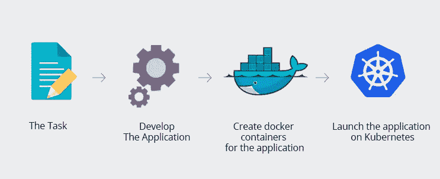
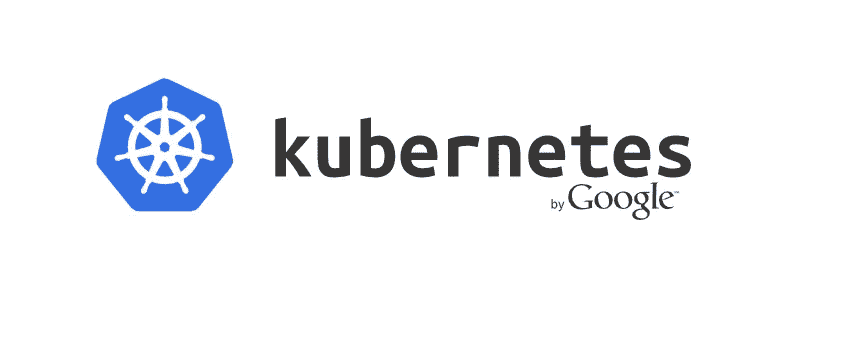
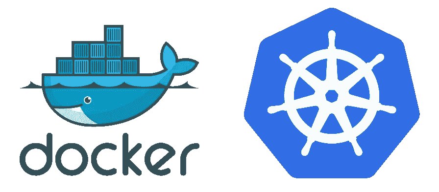
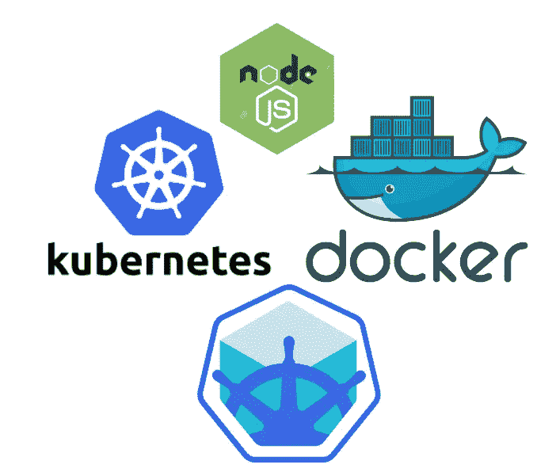
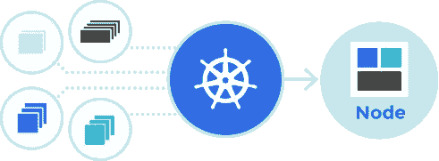

# 10+最佳 Kubernetes 初学者教程[2023 年 3 月]——在线学习 Kubernetes

> 原文：<https://medium.com/quick-code/top-tutorials-to-learn-kubernetes-e9507e76d9a4?source=collection_archive---------3----------------------->

## 用 2023 年最好的 Kubernetes 初学者教程学习 Kubernetes 进行容器管理。

Docker 是全球领先的软件容器化平台。它将您的应用程序打包到一个标准化的单元中，将它包装到一个完整的文件系统中，该文件系统包含在服务器上运行所需的一切。

Kubernetes 是 Google 创建的一个系统，用于自动化容器化应用程序的部署、扩展和管理(就像 Docker 创建的那些)。这两者结合起来，使得任何需要在任何地方运输、安装和维护复杂软件应用程序的人都变得轻而易举。Kubernetes 是一个用于自动化部署、扩展和管理容器化应用程序的开源系统。它提供了大规模调度和管理容器的能力。基于评级、评论和质量，由专家策划的顶级 kubernetes 教程列表。让我们从以下课程开始学习 Kubernetes。

**披露:**本文提到的一些资源包含附属链接。如果你通过链接购买课程，我们可能会得到一小笔佣金。谢谢你。

## 1.[库伯内特斯的基础](https://coursesity.com/r/site/fundamentals-of-kubernetes)

与 Kubernetes 一起行动起来。

本课程将帮助您开始使用 Kubernetes，您将学习如何使用 Minikube 在 Mac 或 Windows 上设置 Kubernetes 环境，并了解 Kubernetes 的组件。

您还将学习如何部署一个示例 Kubernetes 应用程序，并使用 Kubernetes 仪表板管理它。我们还将展示如何用数据库和 API 部署更复杂的应用程序。

最后，我们将探讨 Kubernetes 上更高级的主题，包括生产部署、名称空间、监控和日志记录，以及身份验证和授权。

## 2.面向 Java 开发人员的 Kubernetes】

学习 Kubernetes 部署技术是扩展您现有技能和就业能力的简单方法。

在本课程中，您将学习如何:

*   打包您的应用程序。
*   创建 Kubernetes 清单。
*   将清单部署到本地和 Amazon 云中的 Kubernetes 集群。

本课程提供了一个分步指南，帮助您使用 Kubernetes 和 Amazon Web Services 部署现有的应用程序。

您将学习如何打包您的应用程序，创建 Kubernetes 清单，并将它们部署到本地和 Amazon 云中的 Kubernetes 集群。

本课程还展示了如何为路由、负载平衡、日志记录和安全性配置 Istio 服务网格，以及如何创建部署管道，使您能够将重点转移到构建应用程序上。

## 3.[使用谷歌 Kubernetes 引擎进行架构设计](https://coursera.pxf.io/c/1137078/1213622/14726?u=https%3A%2F%2Fwww.coursera.org%2Fspecializations%2Farchitecting-google-kubernetes-engine&subId1=BotTutorials)

Google Kubernetes Engine specialty 的架构将教您如何使用 Google Kubernetes Engine 或 GKE 实现解决方案，包括构建、调度、负载平衡和监控工作负载，以及提供服务发现、管理基于角色的访问控制和安全性，并为这些应用程序提供持久存储。

本课程向您介绍使用谷歌云平台(GCP)的重要概念和术语。您可以了解并比较谷歌云平台中的许多计算和存储服务，包括谷歌应用引擎、谷歌计算引擎、谷歌 Kubernetes 引擎、谷歌云存储、谷歌云 SQL 和 BigQuery。您将了解重要的资源和策略管理工具，如 Google Cloud 资源管理器层次结构和 Google Cloud 身份和访问管理。

在本课程中，您将学习:

*   谷歌云平台的布局和原理
*   创建和管理软件容器的介绍以及 Kubernetes 架构的介绍
*   执行 Kubernetes 操作
*   创建和管理部署；GKE 网络的工具；以及如何为您的 Kubernetes 工作负载提供持久存储。
*   Kubernetes 和 GKE 安全公司；记录和监测；并在 GKE 使用 GCP 托管的存储和数据库服务。

## 4.[Kubernetes 实用指南](https://www.educative.io/collection/10370001/5920988434792448?affiliate_id=5088579051061248)

掌握当今市场上最受欢迎的容器管理工具 Kubernetes。

在本课程中，您将了解:

*   Kubernetes 的基础知识和集群的主要组成部分。
*   了解如何使用这些组件来构建、测试、部署和升级应用程序，以及如何在部署应用程序后实现状态持久性。
*   了解如何保护您的部署和管理资源，这是至关重要的开发运维技能。

当你完成时，你将会对 Kubernetes 有一个牢固的理解，以及自信地部署你自己的集群和应用程序的技巧。

## 5.[从 A 到 Z 的 Kubernetes】](https://click.linksynergy.com/deeplink?id=Fh5UMknfYAU&mid=39197&u1=quickcode&murl=https%3A%2F%2Fwww.udemy.com%2Fkubernetes-for-beginners%2F)

掌握自动化部署、扩展和管理容器化应用程序的最佳开源系统。

本课程是对 Kubernetes 的极好介绍，帮助您获得基本经验并了解该平台的重要组件。鉴于其最近的流行，站在这一前沿技术的前沿是很重要的。了解如何使用 Kubernetes 来简化您的软件开发。

本课程包括以下章节:

*   课程介绍和概述
*   什么是 Kubernetes？
*   为什么是 Kubernetes？
*   启动和运行:基础知识
*   集群架构
*   核心对象和原语

## 6.[完整的 DevOps 工程师课程 2.0 — Java & Kubernetes](https://click.linksynergy.com/deeplink?id=Fh5UMknfYAU&mid=39197&u1=quickcode&murl=https%3A%2F%2Fwww.udemy.com%2Fthe-complete-devops-engineer-course-20-java-kubernetes%2F)

了解如何使用 Kubernetes 和 Google Cloud platform 用 Java 编程和构建可伸缩的 web 应用程序。

在这门入门课程中，您将使用 Java 编程语言学习和实践基本的计算机科学概念。您将学习面向对象编程，这是一种允许您在自己的程序中使用其他程序员编写的代码的技术。您将通过解决软件工程师面临的实际问题来测试您的新 Java 编程技能。

由于 Java 编程的普及性和易用性，它对于初次编程的人来说是一个很好的选择。这门课程将为你提供计算机科学和面向对象编程概念的坚实基础，并使你走上成为一名成功的软件工程师的道路。

这个完整的课程还旨在教你如何使用 Kubernetes 管理应用程序容器。Kubernetes (k8s)是一个开源平台，用于自动化容器操作，例如跨节点集群的部署、调度和可伸缩性。我们与业界公认的开发人员和顾问组成的团队 ClayDesk 一起建立了这个课程，为您带来最好的一切。

掌握高弹性和可伸缩的基础设施管理非常重要，因为现代的预期是，您最喜欢的网站将全天候运行，并且它们将频繁推出新功能，而不会中断服务。要实现这一点，您需要能够确保开发速度、基础设施稳定性和扩展能力的工具。具有 web 开发、运营或编程背景的学生，如果对使用 Kubernetes 管理基于容器的基础设施感兴趣，建议注册。

我们专门为初学者和中级水平的学生设计了这门课程——无论你处于网站开发和编码之旅的哪个阶段——可以肯定的是，未来属于那些知道如何编写基于 Bootstrap 框架的真实响应网站的 web 开发人员。带有实践任务的完全实践教程几乎可以保证让你在这个行业有一个稳定的职业生涯。我们还使用最先进的编辑器，易于学习和使用。

## 7. [Kubernetes 专为绝对初学者设计——动手操作](https://coursesity.com/r/site/kubernetes-for-the-absolute-beginners-hands-on)

通过动手编程练习，以简单、轻松和有趣的方式学习 Kubernetes。

Kubernetes 是一个开源系统，用于自动化部署、扩展和管理容器化的应用程序，最初由 Google 设计，现在由云原生计算基金会维护。

本课程通过简单易懂的讲座向初学者介绍了 Kubernetes。讲座之后是演示，展示如何设置和开始使用 Kubernetes。本课程附带的编码练习将帮助您练习 Kubernetes 命令，并使用 Kubernetes 配置文件开发您自己的服务。您将在浏览器中为不同的用例开发 Kubernetes 配置文件。通过这种方式，您实际上不需要设置自己的环境来进行实践。编码练习将验证您的命令和配置文件，并确保您正确编写了它们。

最后，我们有任务来测试你的技能。你将面临一个挑战，运用你在本课程中学到的技能来解决问题。这是获得实际项目经验并与社区中的其他学生一起开发 Kubernetes 部署并获得工作反馈的好方法。这项任务将促使你研究和开发你自己的 Kubernetes 集群。

## 8.[学习 DevOps:高级 Kubernetes 用法](https://click.linksynergy.com/deeplink?id=Fh5UMknfYAU&mid=39197&u1=quickcode&murl=https%3A%2F%2Fwww.udemy.com%2Flearn-devops-advanced-kubernetes-usage%2F)

涵盖认证、授权、日志、Helm、使用 Spinnaker、Prometheus 部署、调度等等。

本课程涵盖:

*   使用 ElasticSearch、Kibana、Fluentd 和 LogTrail 进行日志记录
*   使用 Auth0 进行身份验证
*   使用 RBAC 的授权
*   使用 Helm 包装
*   使用 Spinnaker 在 Kubernetes 上部署
*   使用作业和 CronJobs 进行批处理和调度
*   使用 Linkerd 的 Kubernetes 上的微服务
*   使用 kubefed 的联盟
*   使用普罗米修斯监控

## 9. [Kubernetes —综合课程](https://click.linksynergy.com/deeplink?id=Fh5UMknfYAU&mid=39197&u1=quickcode&murl=https%3A%2F%2Fwww.udemy.com%2Fkubernetes%2F)

学习跨多个主机管理容器化的应用程序(部署、维护、扩展等等)。

目前，Kubernetes 是全球最热门的基础设施技术。它通常被称为云的 Linux！如果你想推动你的职业生涯向前发展，并与最酷的技术之一，比这个课程是给你的。

集装箱化是当今世界最重要和最有用的技术。人们以及企业和组织都在寻找一种简单的方法来管理他们的应用程序。管理业务应用程序时，没有人需要做这么多工作。组织非常需要扩展以适应不断增长的应用程序数量。最好的方法是自动化。Kubernetes 是最好的答案。这种容器非常灵活、高度可靠，并且能够以最有效的方式实现自动化。本课程将全面指导您如何使用 Kubernetes 并获得最佳效果！本课程将帮助您了解如何在 Kubernetes 上部署、使用和维护您的应用程序。

## 10.[使用 Docker 介绍 Kubernetes】](https://click.linksynergy.com/deeplink?id=Fh5UMknfYAU&mid=39197&u1=quickcode&murl=https%3A%2F%2Fwww.udemy.com%2Fintroduction-to-kubernetes-using-docker%2F)

Kubernetes:微服务的世界。

Docker 戏剧性地(更好地)改变了那些定期转移、安装和管理软件应用程序的人的生活。这使得整个过程变得不那么复杂，而且几乎消除了所有相关的压力。现在，Kubernetes 让整个事情变得更加简单(是的，这是可能的)。想学习如何将你的应用容器化，然后从头到尾自动化吗？这是给你的课程。

了解微服务的世界

从头开始安装 Docker 和 Kubernetes 集群

了解如何有效地运行和管理容器

创建 Kubernetes pods、部署和服务

从头开始构建 Docker 映像和配置 Docker Hub

高效轻松地部署多组件软件应用程序

这门课程适合所有人，从完全的初学者到电脑高手。你所需要的只是一个快速的互联网连接，一张可以在谷歌云上免费试用的信用卡(不需要额外费用)，以及基本的现代技术知识。

你首先要熟悉 Google Cloud、Docker 和 Kubernetes，了解它们的功能以及你将如何使用它们。然后您将深入了解两个最重要的工具，Docker 和 Kubernetes。一旦你很好地掌握了每一个是如何工作的，你就可以进入课程项目了。您将使用 Google Cloud 安装 WordPress，这包括创建 Docker 文件、图像和容器以及实时部署站点。

接下来，您将创建并配置带有复制控制器的后端和前端主节点和从节点；Kubernetes 使用虚拟机集群管理的应用。听起来很困惑？别担心，你会在每一步都得到实践训练，引导你朝着正确的方向前进。

本课程结束时，您将了解什么是容器，以及使用它们更快地交付软件应用程序的多种方法。您将了解关于 Docker 和 Kubernetes 您需要了解的一切，并且您再也不用担心在您的软件应用程序项目中使用其中任何一个。

## 11.[学习 DevOps:完整的 Kubernetes 课程](https://coursesity.com/course-detail/learn-devops-the-complete-kubernetes-course)

了解如何在 Kubernetes 上运行、部署、管理和维护容器化 Docker 应用程序。

十年前谷歌开始运行容器时，没人能达到这种基础设施的灵活性和效率。利用这些知识，Google 发布了 Kubernetes 作为一个免费的开源项目。如今，Kubernetes 被小公司和大企业使用，他们希望获得谷歌拥有的效率和速度。

你可以使用 Docker 容器化应用程序。然后，您可以在您的服务器上运行这些容器，但是如果没有额外的管理软件，您就无法有效地管理这些容器。Kubernetes 是容器的协调器，它将在一个服务器集群上创建、调度和管理容器。Kubernetes 可以在本地或云中运行，可以在单台机器上运行，也可以在数千台机器上运行。

本课程将帮助您了解如何在 Kubernetes 上部署、使用和维护您的应用程序。如果你对 DevOps 感兴趣，这是一项你需要掌握的技术。Kubernetes 最近很受欢迎，这是公司非常需要的技能。

它将向您展示如何使用 docker 在容器中构建应用，以及如何在 Kubernetes 集群上部署这些应用。它将向您解释如何使用 AWS 在您的桌面或云上设置您的集群。它使用一个真实的示例应用程序(Wordpress with MySQL——博客软件)向您展示 Kubernetes 的真正威力:调度无状态和有状态应用程序。

向您展示 Kubernetes 桌面安装的介绍讲座是免费预览的，因此您可以在购买课程之前先试一试。

## 12. [DevOps 工具包:用实际练习学习 Kubernetes！](https://click.linksynergy.com/deeplink?id=Fh5UMknfYAU&mid=39197&u1=quickcode&murl=https%3A%2F%2Fwww.udemy.com%2Flearn-kubernetes-using-google-cloud-gcp-kubernetes-engine%2F)

使用谷歌云(GCP) Kubernetes 引擎学习 Kubernetes。

课程分为以下几个部分:

容器化和编排——探索容器的概念和 kubernetes 旨在解决的问题。

主和节点 Kubernetes 的主要架构，将更深入地探讨组件和常用的架构。

Pods——Kubernetes 的构建模块，将解释 pods 的主要概念和常用示例。

服务—将 pod 连接到外部流量的各种选项。

部署—复制集的概念和 kubernetes 集群的启动。

期望状态，定义 Kube 对象——探索期望状态的概念，以及如何在部署之前实际定义 kubernetes 工作部件。

无状态和有状态——比较无状态体系结构和有状态体系结构的主要概念，以及为什么要使用一种而不是另一种。

无状态集群实践—这是一个实践，我们将构建一个无状态应用程序并部署集群。

有状态集群实践—这是一个实践，我们将构建一个有状态的应用程序并部署集群。

> **更新**:我们为[学习 Kubernetes](http://blog.coursesity.com/best-kubernetes-tutorials/?utm_source=botsfloor&utm_medium=referral&utm_campaign=mediumPost&utm_term=learn-kubernetes) 制作了最新版本的顶级教程。请随意查看今年最好的 kubernetes 教程。

> 感谢您阅读本文。我们策划了更多主题的顶级教程，您可能想看看:

 [## 16 个最佳 Docker 教程—初学者学习 Docker—[2020 年更新]

### 面向初学者学习 Docker 容器开发的最佳 Docker 教程和课程

tutorials.botsfloor.com](https://tutorials.botsfloor.com/top-tutorials-to-learn-docker-to-run-distributed-applications-bce896e260ec)  [## 20 多门最佳数据结构和算法课程

### 学习最佳数据结构算法教程，包括系统设计用的最佳数据结构算法教程…

medium.com](/quick-code/top-tutorials-learn-data-structure-and-algorithm-for-an-interview-preparation-96e1f7518e26)