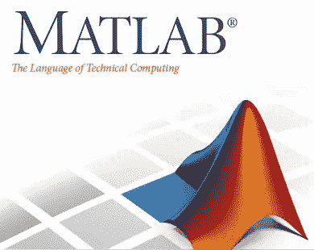
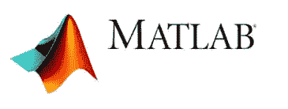
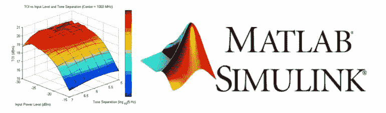

# 给初学者的 10 个最佳 MATLAB 教程[2023 年 3 月]——在线学习 MATLAB

> 原文：<https://medium.com/quick-code/top-tutorials-to-learn-matlab-for-beginners-d19549ecb7b7?source=collection_archive---------2----------------------->

## 2023 年学习 MATLAB，用最好的 MATLAB 初学者教程来满足你的技术需求。

随着数据源和算法的复杂性不断增加，数据和结果的数量和复杂性不断增加，对数据和结果的直观表示的需求变得越来越重要。

我们希望以这样一种方式来创建表示，即人类思维毕竟可以更好地理解我们的宇宙和其中发生的过程——真实世界对象的表示、抽象的数学表达式、某些可测量量的特定值等。由于大脑接收的 80%的感官信息来自我们的眼睛，数据的视觉呈现是自然的选择。

结果的图示通常不仅是传达提供数据的研究或工作要点的最有效方式，而且在大多数情况下也是工作受众的一种期望。它帮助您识别和强调数据行为中感兴趣的领域，以快速直观的方式向他人表达您的想法、观察和结论。

为什么是 MATLAB？

**1。易用性**

MATLAB 是一种解释型语言。利用内置的集成开发环境和调试器，可以很容易地编写和修改程序。

**2。平台独立性**

许多不同的计算机系统都支持 MATLAB，提供了很大程度的平台独立性。该语言在 Windows、Linux、Unix 和 Macintosh 上受支持。在任何平台上编写的程序都可以在所有其他平台上运行。

**4。独立于设备的绘图**

与其他计算机语言不同，MATLAB 有许多完整的绘图和图像命令。这些图和图像可以在运行 MATLAB 的计算机支持的任何图形输出设备上显示。这种能力使 MATLAB 成为可视化数据的优秀工具。

**5。全套功能**

MATLAB 拥有可视化科学和工程数据所需的所有图形功能。它包括用于表示二维和三维图表的功能、三维体积可视化、动画、交互式创建图表的工具以及导出到最流行的图形格式的可能性。可以定制添加多轴的图表，改变线条和标记的颜色，添加注释，LaTeX 表达式，图例和其他绘图选项。

## 1.[不到 30 天成为一名优秀的 Matlab 程序员](https://coursesity.com/r/site/become-a-good-matlab-programmer-in-30-days)

这是最后一次，你希望自己能成为一名 Matlab 程序员。

Matlab 编程是当今最重要的技术编程语言和技能之一。在本课程中，我们将从初级水平开始学习 Matlab，慢慢地我们进入更多的技术主题。这门课是通用的 Matlab 编程，也就是说所有的专业都可以从这门课中受益。Matlab 编程是一种简单易懂的编程语言，是开始学习其他程序(如 Java、Python、C 和 C++)之前的绝佳选择。

内容列表如下:

第一章:Matlab 软件简介

第二章:Matlab 中的数学

第 3 章:在 Matlab 环境中使用变量

第四章:Matlab 中的三角函数

第五章:Matlab 中的复数

第 6 章:在 Matlab 中使用向量

第 7 章:在 Matlab 中使用矩阵

第八章:介绍 Matlab 中的微积分和工程函数

第 9 章:Matlab 中的图形和绘图

第十章:循环，条件和 Matlab 编程介绍

第 11 章:项目(每周更新新的编程练习)

第 12 章:从 Excel 导入数据到 Matlab

第 13 章:如何申请 Coursovie 培训证书(LinkedIn)

第 14 章:课程的附加材料

第 15 章:其他课程的大量折扣代码(Coursovie Collection)

## 2.[学习 MATLAB](https://linkedin-learning.pxf.io/c/1137078/646189/8005?u=https%3A%2F%2Fwww.linkedin.com%2Flearning%2Flearning-matlab-2&subId1=quickcode)

MATLAB 是当今工程师和科学家最流行的编程语言之一，这是有充分理由的——它允许分析师高效地处理大量数据。

在本课程中，您将学习如何:

*   利用 MATLAB 工具。
*   创建程序来模拟你自己的数据和假设。
*   创建 2D 和 3D 绘图。
*   添加注释，合并图像。

在这里，您将学习如何利用 MATLAB 工具并创建程序来模拟您自己的数据和假设。

首先，学习如何创建基本变量和单元格数组，并使用核心的 MATLAB 语法，这与其他编程语言有显著的不同。

然后了解如何创建脚本和函数、使用矩阵、调试程序以及导入数据。为了说明您的发现，本课程将展示如何创建 2D 和 3D 绘图、添加注释以及合并图像。最后一章介绍 MATLAB 框图工具 Simulink。

## 3.[完整的 MATLAB 教程:从初学者到专业人员](https://click.linksynergy.com/deeplink?id=Fh5UMknfYAU&mid=39197&u1=quickcode&murl=https%3A%2F%2Fwww.udemy.com%2Fmatlab-essentials-for-engineering-and-science-students%2F)

基本的 MATLAB 教程，将带你从初学者到高级水平。

MATLAB (matrix laboratory)是一种多范式的数值计算环境和第四代编程语言，工程和科学学生经常使用。在本课程中，我们将从初级水平开始学习 MATLAB，并逐渐进入更多的技术和高级主题。这门课程被设计成通用的范围，这意味着它将有益于任何专业的学生。一旦过了一定的学习门槛，你绝对会喜欢上 MATLAB 编程。MATLAB 的主要优势在于，与 Java、C、C++、visual basic 等传统编程语言相比，它使编程对每个人都可用，并且可以非常快速地将想法转化为工作产品。

以下是本课程的详细大纲。

第 1 部分:讲师和课程介绍

第 2 部分:处理变量和创建脚本

第 3 部分:在 MATLAB 中做基础数学

第 4 部分:矩阵运算

第 5 部分:使用符号数据类型的高级数学函数

第 6 部分:与 MATLAB 和图形交互

第 7 部分:将数据导入 MATLAB

第 8 部分:文件处理和文本处理

第 9 部分:MATLAB 编程

第 10 部分:分享您的 MATLAB 结果

第 11 部分:单元格数据类型

第 12 部分:表格和时间表

第 13 部分:使用结构和地图容器数据类型

第 14 部分:不同数据类型之间的转换

## 4.[学习 MATLAB 和 Simulink 编程](https://click.linksynergy.com/deeplink?id=Fh5UMknfYAU&mid=39197&u1=quickcode&murl=https%3A%2F%2Fwww.udemy.com%2Flearn-matlab-and-simulink-programming%2F)

掌握 MATLAB 编程基础和 Simulink，提高您的数字处理能力。

学习 MATLAB 和 Simulink 编程是一门课程，重点是向学生讲授 MATLAB 和 Simulink 提供的各种命令、功能和特性。MATLAB 和 Simulink 具有很多功能，因此本课程将只关注主要主题，让您能够轻松创建自己的脚本和 Simulink 模型。本课程包含许多不同项目的示例以及分步解决方案，以帮助您最好地理解正在发生的事情。完整的代码附在项目中，以便学生可以下载并获得与他们在屏幕上看到的相同的结果。

本课程旨在通过文章的组合来帮助学生解释各种主题，并通过视频展示这些主题的示例。还有各种测验，旨在测试学生，让他们知道他们是否充分理解了本节中介绍的信息。本课程首先简要介绍 MATLAB 环境的概况以及具体工具的位置。本课程的每个部分涵盖不同的主题，包括以下内容:

*   生成图形
*   绘图数据
*   基本 MATLAB 命令
*   向量
*   矩阵和矩阵命令
*   MATLAB 脚本
*   编程循环和条件语句
*   用户定义的函数
*   Simulink
*   Simulink 特性
*   Simulink 项目示例

有几个测验将测试你对各个部分的理解。有多个项目要求学生使用 MATLAB & Simulink 解决问题。

本课程中的每个项目都包含以下信息:

说明:这篇文章解释了完成这个项目需要什么。

演示:这堂课演示了在如何完成项目方面对学生的期望。

逐步解决方案:这个讲座解释了思维过程，以及如何一步一步地完成项目。

## 5.[学习 MATLAB 编程、调试和风格](https://coursesity.com/course-detail/matlab-onramp-2020-coding-concepts-confidence-and-style)

学习区分专家和新手的关键 MATLAB 编程技能:调试、函数和可视化。

MATLAB 是学术界和工业界最重要和最广泛使用的编程环境、数据可视化工具和数值求解器之一。另一方面，MATLAB 只是一种编程语言，与学习其他“高级”编码或可视化语言没有太大区别；因此，我在这门课程中的目标不仅仅是教你如何在 MATLAB 中编码，而是教你高级的、可转移的技能，这些技能将帮助你成为更好的程序员，无论你使用的是 MATLAB、Python、R、JavaScript 还是任何其他语言。

您将在本课程中学到什么:

*   使用和定制可视化 MATLAB 环境(包括用适合你多彩个性的颜色替换那些糟糕的默认黑白颜色！)
*   MATLAB 编程基础
*   控制语句(for 循环，while，if-else，switch)
*   制作自己的 MATLAB 函数
*   使用 MATLAB 图形引擎创建和编辑数据可视化
*   如何写出好的、干净的、可读的代码
*   调试的一般策略(查找和修复错误)
*   认识常见的编码错误以及如何避免它们
*   在开始编码之前，如何组织和优化你的代码
*   *建立对你编程技能的信心*

## *6.[MATLAB 数据可视化—项目与实例](https://click.linksynergy.com/deeplink?id=Fh5UMknfYAU&mid=39197&u1=quickcode&murl=https%3A%2F%2Fwww.udemy.com%2Fdata-visualization-matlab%2F)*

*了解如何使用 MATLAB 在 2D、3D、4D、5D 可视化数据，并使用数十个项目和示例创建动画图。*

*为什么选这门课？*

*   *将复杂的情节技巧分解成简单的步骤。*
*   *来自专业培训师的简单直观的方法。*
*   *学生、学者和科学家的理想选择。*
*   *适合初学程序员。*

## *7.[初学者的 MATLAB 基础知识](https://click.linksynergy.com/deeplink?id=Fh5UMknfYAU&mid=39197&u1=quickcode&murl=https%3A%2F%2Fwww.udemy.com%2Fmatlab4b%2F)*

*通过循序渐进的练习学习 MATLAB 编程。*

*这是 MATLAB 的实践课程。通过循序渐进的练习学习数值计算领域的领先软件。掌握基础知识，并在 MATLAB 中进入高级阶段。*

*MATLAB 是数值计算和构建算法方面的领先软件，被工程师、程序员、研究人员、教师、大学和企业家广泛使用。*

*在本课程中，您将通过创建和操作矩阵开始学习 MATLAB，矩阵是 MATLAB 编程的关键，然后您将学习如何在一些初等数学问题中使用 MATLAB，之后是图形部分，您将学习如何使用 MATLAB 制作 2D 和 3D 图形以及如何制作 2D 动画。在编程部分，您将学习如何使用 MATLAB 作为编程语言来构建自己的算法，您将学习如何向 MATLAB 导入和分析数据，最后您将了解 MATLAB 的符号功能。*

**

## *8.[从零开始学习 MATLAB 与图像处理！](https://click.linksynergy.com/deeplink?id=Fh5UMknfYAU&mid=39197&u1=quickcode&murl=https%3A%2F%2Fwww.udemy.com%2Fmatlabipt%2F)*

*了解如何使用 MATLAB 这个令人敬畏的图像处理工具箱。完全不需要以前的经验。*

*MATLAB 的图像处理(IP)工具箱非常流行，在几乎所有的学术机构和企业中广泛使用。这是因为，它写得很好，组织得很好，这使得这个工具箱非常用户友好，即使是最艰难的 IP 操作。*

*如果你想为你的工作或大学学习 MATLAB，这是适合你的课程。本课程从头开始教你这个完整的图像处理工具箱。所有的理论概念都在演示中用例子进行了解释。然后，他们的实现涵盖了 Matlab 编程。所有这些演示文件和可用的 Matlab 脚本都作为补充材料与课堂一起提供。学习这门课程不需要任何 Matlab 编程经验，因为它从零开始。*

*课程内容涵盖 IP toolbox 中的所有(初级和中级)主题，如图像滤波、噪声消除、形态学运算、直方图运算、图像阈值处理、边缘检测和图像分割基础。已经设置了几个测验来记录你的表现和理解。除了所有的理论内容之外，一些现实世界的应用也以项目的形式被涵盖，如“在图像中检测你所有朋友的脸”*

## *9.[面向科学家和工程师的 MATLAB](https://click.linksynergy.com/deeplink?id=Fh5UMknfYAU&mid=39197&u1=quickcode&murl=https%3A%2F%2Fwww.udemy.com%2Flearners-spot-1%2F)*

*面向工程师和科学家的 MATLAB 介绍。*

*无论是工程、科学、经济还是医学背景，你都将加入超过 200 万跨越这些背景的 MATLAB 用户；一种多范例数值计算环境和第四代编程语言，允许矩阵操作、绘制函数和数据、实施算法、创建用户界面以及与用其他语言编写的程序进行交互，包括 C、C++、C#、Java、Fortran 和 Python 以及附加软件包 Simulink，为动态和嵌入式系统增加了图形多域仿真和基于模型的设计。*

*本课程从初级主题开始，然后逐步地、系统地推进到 MATLAB 中更高级(但解释得很清楚)的主题。它涉及工程师和科学家日常遇到的主要话题，以及成为专家所需的 MATLAB 的主要方面。学完这门课程后，你可以大胆地站起来，用 MATLAB 自己解决那些困难的问题，并且能够继续专攻你选择的 MATLAB 的任何方面。*

*每堂课都有测验，为了获得本课程的证书，必须进行测验。每一部分都有作业，如果你允许的话，可以由 Udemy 的同学来评估。请注意，其中一些测验是对课程的总结，你会学到更多的东西，也会理解课堂上强调的一些关键事实。也提供了作业的逐步答案。*

*在本课程中，你通常会成为大师，并从 MATLAB 的零知识走向英雄。*

## *10.[苹果手机的 MATLAB 项目& iOS 传感器](https://click.linksynergy.com/deeplink?id=Fh5UMknfYAU&mid=39197&u1=quickcode&murl=https%3A%2F%2Fwww.udemy.com%2Fmatlab-ios-sensors%2F)*

*使用 iPhone 和 iPad 上的加速度计、指南针、GPS 和其他 iOS 传感器构建自己的 MATLAB 程序。*

*现在，您可以使用 MATLAB 从您的 iPhone 或苹果 iOS 设备收集传感器数据！通过这门互动课程，让您的朋友印象深刻，构建一些很酷的程序，并将您的 MATLAB 技能提升到一个新的水平。您将了解如何从 5 个不同的传感器获取和利用数据，而无需购买额外的软件或硬件。*

*构建 6 个 iPhone 传感器项目(包括源代码)*

*在本课程中，您将通过构建一组独特的项目来掌握 Apple iOS 传感器的 MATLAB 支持包，这些项目使您能够:*

*   *打造您自己的 3D 指南针*
*   *使用手机旋转 3D 对象*
*   *检测 iPhone 正面朝上还是朝下*
*   *跟踪汽车的位置和速度*
*   *检测抖动*
*   *边走边数你的步数*

*设置起来有点棘手，但是，别担心，我会教你怎么做。如果你有任何问题，你可以通过论坛寻求帮助。我将展示一种简单的方法来启用和获取所有 5 个 iOS 传感器的数据，包括:*

*   ***加速度传感器**——了解如何利用 iPhone 移动中的突然变化*
*   ***磁场传感器** —探测指南针和其他输入设备使用的磁场*
*   ***方位传感器**——看看你如何检测你的 iPhone 状态并控制虚拟物品*
*   ***角速度传感器** —检测你的 iPhone 的移动，并用来控制软件*
*   ***位置传感器** —捕捉您的 GPS 位置和速度，并构建基于位置的应用程序*

*您将了解启用这些传感器并为您的 MATLAB 程序获取数据是多么容易。*

> ***更新**:我们已经创建了最新版本的[顶级 matlab 教程](http://blog.coursesity.com/best-matlab-tutorials?utm_source=botsfloor&utm_medium=referral&utm_campaign=mediumPost&utm_term=matlab)。请随意查看年度最佳 matlab 教程。*

> *感谢您阅读本文。我们策划了更多主题的顶级教程，您可能想看看:*

* [## 10+最佳敏捷 Scrum 初学者教程——学习敏捷和 Scrum

### 学习敏捷 Scrum，在 2022 年用最好的敏捷 Scrum 初学者教程来发展你作为软件项目经理的职业生涯。

medium.com](/quick-code/top-tutorials-to-learn-scrum-and-agile-4199b0f36c24)  [## 10 多门最佳 Salesforce 培训课程—在线准备 sales force 认证考试

### 准备 Salesforce 认证考试，并在 2022 年通过面向初学者的最佳 Salesforce 课程开始您的认证 Salesforce 开发人员职业生涯。

medium.com](/quick-code/top-online-courses-to-prepare-for-salesforce-certification-exams-5ab2c0434167)  [## 10+最佳 JIRA 初学者教程—在线学习 JIRA

### 用 2022 年最佳 JIRA 初学者教程学习 JIRA 软件管理 bug 跟踪和敏捷项目管理。

medium.com](/quick-code/top-tutorials-to-learn-jira-9120b409ccee) 

*披露:如果您通过本页的链接购买课程，我们可能会获得一小笔会员佣金。谢谢你。**