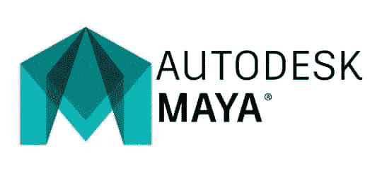
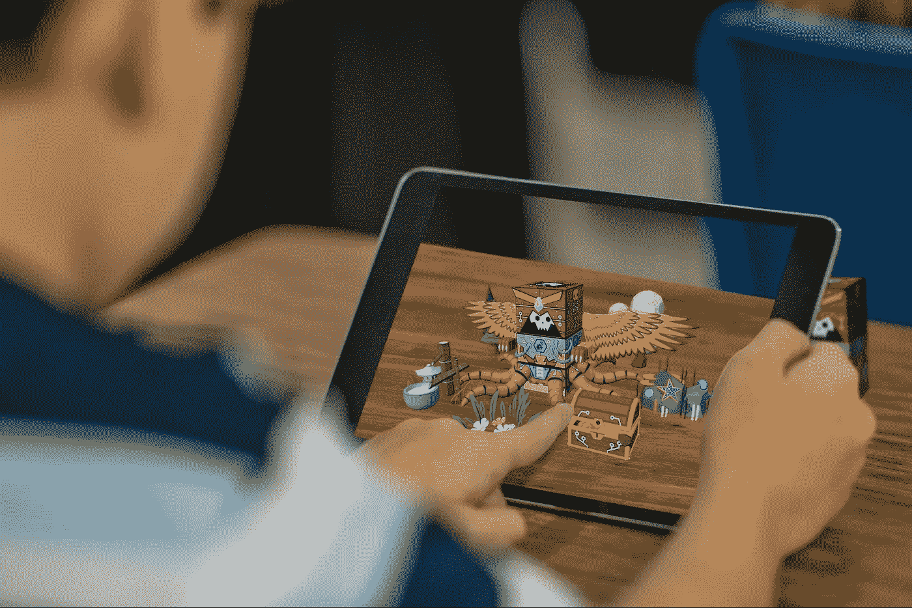
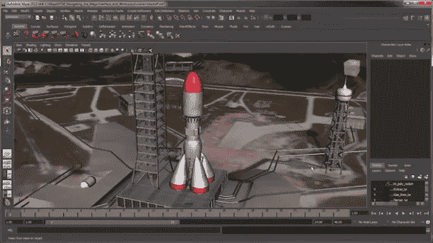
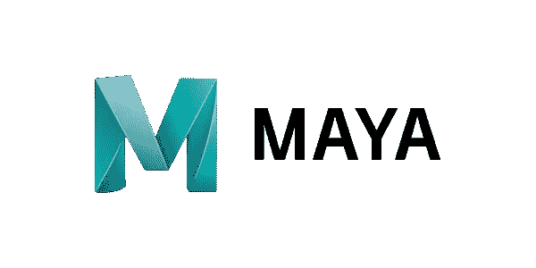

# 10+最佳 Maya 初学者教程[2023 年 3 月]—在线学习 Maya

> 原文：<https://medium.com/quick-code/top-tutorials-to-learn-maya-for-3d-computer-animation-33152ff9bb44?source=collection_archive---------0----------------------->

## 2023 年学习 Maya 创建 3D 计算机图形应用程序，为初学者提供最佳 Maya 教程

# 1.[Maya for Games 动画工作流程介绍](https://click.linksynergy.com/deeplink?id=Fh5UMknfYAU&mid=39197&u1=quickcode&murl=https%3A%2F%2Fwww.udemy.com%2F3dmotive-the-animation-workflow-in-maya%2F)

在 Maya 中，了解创建关键帧动画、在路径上设置动画、编辑动画和利用层的最佳实践。当我们在一个完全装配的角色上创建动画时，你将通过例子来学习，这个过程是从最初的概念到关键的姿势和最终的动画润色。

# 2.[玛雅 2020 基本训练](https://linkedin-learning.pxf.io/c/1137078/646189/8005?u=https%3A%2F%2Fwww.linkedin.com%2Flearning%2Fmaya-2020-essential-training&subId1=quickcode)

学习在 Maya 2020 中创建高质量的 3D 模型和动画。

在本课程中，您将学习:

*   Maya 的核心技能——建模、纹理、渲染和动画。
*   基础知识，如选择和操纵对象，组织场景。
*   自定义界面。
*   创建材质并将其应用于曲面-添加颜色、纹理和反射率。

本课程涵盖了 Maya 的核心技能——建模、纹理、渲染和动画——在基于项目的真实世界工作流程中，同样适用于电影、动画和游戏设计。

学习基础知识，如选择和操纵对象、组织场景和自定义界面。接下来，回顾多边形建模、创建和优化网格、雕刻和 NURBS 建模。

接下来是创建和应用材质到表面——添加颜色，纹理和反射率。然后使用 Arnold for Maya 渲染器集成相机、照明和景深效果。

最后但同样重要的是，它显示了如何使用 Maya 动画工具将运动和生活添加到您的工作中。

# 3. [VFX 用玛雅和特效从零开始拍摄创作](https://www.eduonix.com/vfx-shot-creation-from-scratch-with-maya-and-after-effects/UHJvZHVjdC0zMjMyMDA=)

刘燕姿的不为人知的故事，以及她用视觉效果从头开始再现一个惊人事件的旅程。

在本课程中，您将学习如何:

*   根据提供的案例，有效地使用 Autodesk Maya、Adobe Photoshop 和 Adobe After Effects。
*   计划拍摄您自己的自定义视觉效果镜头。
*   用真实世界的电影镜头和后期制作场景解决问题。

学习如何通过成为一个正在展开的、不为人知的故事的一部分来从头开始创建一个视觉效果。

通过实际观看一个短片故事展开来学习，同时帮助故事的主角通过课程的分步指南创建最终的视觉效果，包括 3D 建模、纹理、动画、2D 跟踪和合成。

# 4. [Maya 2017 —使用 Arnold 渲染器创建逼真的图像](https://click.linksynergy.com/deeplink?id=Fh5UMknfYAU&mid=39197&u1=quickcode&murl=https%3A%2F%2Fwww.udemy.com%2Fmaya-2017-arnold-renderer%2F)

通过在 Autodesk Maya 2017 中渲染一个逼真的场景来学习 Arnold 渲染器的基础知识。

Autodesk Maya 2017 现在附带了行业标准的 Arnold 渲染器。阿诺德被许多视觉效果和动画工作室用来为电影和电视制作惊人的图像。

学习这款强大渲染器的 3 个理由:

1.  让自己对潜在雇主更有吸引力。
2.  把你的作品提升到现实主义的新高度。
3.  比几乎所有其他渲染器更容易学习。

这个课程是为那些想从初级水平开始学习使用阿诺德创造伟大的图像的人设计的。你将从头到尾学习场景的明暗处理，包括基本原理。本课程将带你完成一个实际的项目，而不是重复一个球体的无尽设置。

# 5.[使用 Maya 2017 的快速动画和装配技术](https://click.linksynergy.com/deeplink?id=Fh5UMknfYAU&mid=39197&u1=quickcode&murl=https%3A%2F%2Fwww.udemy.com%2Ffast-rig-maya%2F)

学习装配两足动物角色，并为初级 Maya 用户制作电影、电视和视频游戏的行走周期动画。

Autodesk Maya 凭借其强大而灵活的工具集成为全球动画公司的中心。在本课程中，您将学习如何在一个称为“装配”的过程中为动画快速准备 3d 模型。然后，您将设置行走周期的动画。人类 IK 系统是我们用来赋予角色生命的装备。您还将学习更高级的主题，如对角色应用和编辑运动捕捉。这些技术将允许你快速地为你的电影、电视和视频游戏项目创建好看的动画。

本课程是专门为初学者设计的，但是它包含了很多有用的提示、技巧和工具，可以帮助更有经验的用户学习他们不熟悉的功能。它涵盖了 Maya 中动画功能的一些最新更新，包括新的曲线图编辑器、快速装配和时间编辑器。

本课程涵盖的技能不仅能让你创作出优秀的作品，还能让你在动画师、预视觉化艺术家、技术动画师和 3d 通才等职位上对雇主更具吸引力。

# 6.[了解 3ds Max:建模后学习 Maya】](https://click.linksynergy.com/deeplink?id=Fh5UMknfYAU&mid=39197&u1=quickcode&murl=https%3A%2F%2Fwww.udemy.com%2F3dsmax-to-maya%2F)

在已经了解 3ds max 之后，还想学习如何使用 Maya 吗？做出改变从未如此容易。

当你已经知道基本原理，而软件是唯一阻碍你的东西时，你会很难感到完全迷失。你可能正在拔头发，因为你的速度和过程已经被扔出了门外。你可能知道自己想要创造什么，但却无法实现它。

大多数学习 Maya 的教程都是很长的基础视频，涵盖了您已经了解的主题。您只是在寻找有关如何转移您在 3ds max 中已经掌握的技能的信息。你可能会花大量的时间浏览大量的初学者视频，却发现这些视频忽略了你使用的高级技术。有时，您使用的技术在 Maya 中甚至不可用。这变得令人恼火，浪费你的时间。

这个视频系列旨在让您了解 Maya 内部的速度，并且您是否想知道为什么在软件之间转移看起来如此困难？日常视频游戏艺术开发中使用的所有主要工具和技术(建模、解包和烘焙)都将进行解释，并与您在 3ds max 中使用的工具和技术进行交叉引用。因此，如果你需要快速进入 Maya 寻找新的工作职位，或者是一名学生希望改善你的简历，使其对雇主更具吸引力，这个视频系列非常适合你。

# 7.[视频游戏索具 101——玛雅 2018](https://click.linksynergy.com/deeplink?id=Fh5UMknfYAU&mid=39197&u1=quickcode&murl=https%3A%2F%2Fwww.udemy.com%2Frigging-101-for-videogames-maya-2018%2F)

学习在 Maya 2018 中装备道具和角色的工具和概念。

学习三维索具可以是非常混乱和耗时的，当你自己做的时候。我想让你的学习过程变得简单，在非常详细的视频中浏览所有的工具和索具概念。

你将做一系列的装备，从道具到角色，以确保在完成本课程后，你将拥有解决呈现给你的任何装备所需的知识。

您将学习一些技巧和快捷方式，这些技巧和快捷方式将加快您的工作流程，并让您了解 3D 装配的基础知识。

# 8. [Python For Maya:艺术家友好编程](https://click.linksynergy.com/deeplink?id=Fh5UMknfYAU&mid=39197&u1=quickcode&murl=https%3A%2F%2Fwww.udemy.com%2Fpython-for-maya%2F)

学习使用 Python 编码，以便在 Maya 中更快地工作。

本课程将带你从 Python 代码的第一行开始，到创建高级用户界面，拥有我们对专业人员的所有期望。通过自动化重复的任务，你将学到帮助你更快工作的技能，这样你就可以专注于你想做的工作。这反过来也会给你在就业市场上带来难以置信的价值，帮助你更快地晋升。

无论你是初学者还是已经熟悉 Python，这门课程都能为你提供很多东西。项目按难度划分，无论你是模特、动画师、装配工还是打火机工，总有一个项目适合你。

以下是我们将要介绍的内容:

*   Python 基础:函数、类、if 语句等…
*   高级 Python 概念，如 lambdas、partials、正则表达式等..
*   使用 Maya Cmds 和 Qt 编写用户界面
*   将数据写入磁盘并作为 JSON 加载回 Maya
*   创建命令行工具
*   设置专业工作流程
*   Qt 接口框架:自定义部件、信号和插槽、样式表等

# 9. [Maya 2017 快速入门——为初学者创建低多边形场景](https://click.linksynergy.com/deeplink?id=Fh5UMknfYAU&mid=39197&u1=quickcode&murl=https%3A%2F%2Fwww.udemy.com%2Fmaya-quickstart%2F)

在这个有趣的基于项目的课程中，使用 Maya 2017 创建自己的 3d 世界。

在这个易于学习的项目中学习基础知识和更多，在这里你将创建一个时尚的等距低多边形场景。这门课程是为完全的初学者设计的，不会陷入不必要的技术术语中。它特别向您展示了创建 3d 几何图形和输出漂亮图像所需的基础知识。

# 10.[在 Maya 2017 中从头开始创建专业的 3D 模型](https://click.linksynergy.com/deeplink?id=Fh5UMknfYAU&mid=39197&u1=quickcode&murl=https%3A%2F%2Fwww.udemy.com%2Fcreate-professional-3d-models-from-scratch-in-maya%2F)

学习使用 Maya 2017 和 Photoshop 设计、建模和渲染 3D 资产的技能。

自学 3D 软件包可能会非常复杂和耗时。

课程中有一整节专门介绍界面、菜单和工具，这样，完全没有经验的学生可以根据需要多次返回。

但这并不意味着它只会对新用户有用。中级到高级的学生也会发现这些课程中的内容非常有用，因为我们通过强大的建模技术和快捷方式创建概念艺术和模型的基础。

在本课程中，我们将从头到尾创建一个机器人。从绘制概念艺术图像，直到在 photoshop 中进行演示和最终的图像增强。

我们将使用真实照片作为参考和灵感，在 photoshop 中绘制机器人草图，划分出资产的粗略版本，对所有部分进行建模，使用 Maya 内置的 Arnold 渲染器进行渲染，并在 Photoshop 中添加最后的润色。

您将了解加快工作流程的技巧和快捷方式，并了解 3D 建模的基础知识。

# 11.[学习 Maya——创建真实场景的初学者指南](https://click.linksynergy.com/deeplink?id=Fh5UMknfYAU&mid=39197&u1=quickcode&murl=https%3A%2F%2Fwww.udemy.com%2Flearn-maya-for-beginners%2F)

从初学者级别开始，学习在 Autodesk Maya 中创建逼真的模型、纹理、动画和渲染。

通过这门全面的入门课程，探索 Autodesk Maya 的奇妙世界。Maya 是一个行业标准的 3d 应用程序，用于创建电影、游戏和图形。在本课程中，您将学习创建自己的令人惊叹的图像。

了解 Autodesk Maya 的基础知识

*   安装 Maya
*   了解 Maya 用户界面
*   模型和纹理逼真的物体
*   动画你的模型
*   照亮和渲染你的动画，让它们看起来很棒！

Maya 是许多高端产品使用的行业标准应用程序。通过学习它，你会变得更有竞争力。它有一个灵活和广泛的工具集，可以帮助您更快地创建高质量的工作。本课程旨在帮助您轻松进入 Maya，向您展示最常用和最强大的工具。这是一门以项目为基础的课程，将教会你在自己的工作中可以使用的实用技能。本课程提供了你需要的所有项目文件和工作进展文件，以防你遇到困难。

本课程有五个部分:

1.  如何安装 Maya

2.Maya 基础-在本节中，您将首次了解 Maya 和用户界面。您将学习不同的编辑器以及创建和操作对象的基础知识

3.玩具火车项目—在本节中，您将创建一个玩具火车模型，并沿着一条路径制作动画。你将学习如何点亮你的火车，并将材料应用到火车上。您将通过渲染并查看动画来完成。

4.向导桌面项目——在这个项目中，你将创建一个桌面场景，你可以自定义并制作你自己的场景！深入研究建模工具，创建一系列的物体来创建你的场景。您将了解如何对您的对象进行纹理处理，并查看各种不同的着色器来制作不同的材质。您还将学习一些更高级的照明技术，并学习如何给场景添加气氛并渲染出最终图像。这个项目是足够灵活的，让你有自己的构图，照明和外观的创意。

> 感谢您阅读本文。我们策划了更多主题的顶级教程，您可能想看看:

 [## 10+最佳虚幻引擎 4 初学者教程

### 用 2021 年最好的虚幻引擎新手教程学习游戏开发的虚幻引擎 4

medium.com](/quick-code/top-tutorials-to-learn-unreal-engine-4-for-beginners-1a21c287c553)  [## 10+最佳搅拌机教程-在线学习搅拌机三维建模

### 学习 Blender，用最好的 Blender 为视频游戏、房屋设计、3D 打印等创建吸引人的 3D 模型…

medium.com](/quick-code/top-tutorials-to-learn-blender-for-3d-modeling-3f4bc3eae1d0)  [## 10+游戏开发者最佳 Unity 教程

### 学习 Unity 从 2021 年最好的 Unity 新手教程开始学习游戏开发

medium.com](/quick-code/top-online-tutorials-to-learn-game-development-using-unity-55497ad51169) 

披露:我们与本文中提到的一些资源有关联。如果你通过本页的链接购买课程，我们可能会得到一小笔佣金。谢谢你。