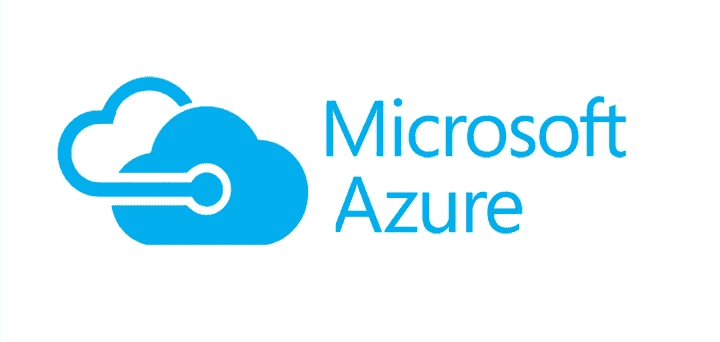
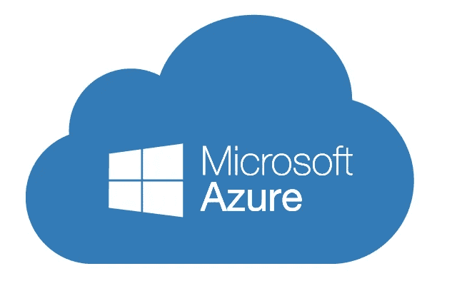

# 10+最佳微软 Azure 初学者教程[2022 年 7 月]—在线学习微软 Azure

> 原文：<https://medium.com/quick-code/top-tutorials-to-learn-microsoft-azure-for-cloud-computing-258affcd2c5d?source=collection_archive---------0----------------------->

## 2022 年用最好的 Azure 初学者教程学习 Azure for cloud 开发

微软 Azure 是世界上发展最快的云平台。它是一种云计算服务，用于通过微软管理的数据中心的全球网络来构建、测试、部署和管理应用程序和服务。

# 1.[微软 Azure —初学者指南](https://click.linksynergy.com/deeplink?id=Fh5UMknfYAU&mid=39197&u1=quickcode&murl=https%3A%2F%2Fwww.udemy.com%2Fmicrosoft-azure-beginners-guide%2F)

本课程涵盖:

*   能够理解如何开始使用 Azure
*   启动虚拟机
*   使用 BLOB、SQL Server 等存储选项
*   对 Azure 功能、Azure Web 应用等服务有基本的了解
*   在 Azure 中创建免费帐户
*   使用虚拟机
*   使用 Azure 存储— BLOB、表、队列、文件
*   Azure SQL 数据库和 CosmosDB 简介
*   Azure 中的基本网络概念
*   对 Azure 功能、Azure 逻辑应用、Azure 规模集等各种服务有基本的了解。

## 2.【Azure 入门

本课程介绍微软 Azure 服务。学生将熟悉核心 Azure 主题，并练习基础设施组件的实现。

在本课程中，您将学习:

*   成功管理 Microsoft Azure 资源所需的技能。
*   在 Microsoft Azure 中部署虚拟机的基本概念。
*   Azure 资源安全性的关键概念。
*   部署到 Azure 网络的关键考虑事项。
*   Azure 中资源组的好处，它们是如何被管理的，它们的配置设置，以及公共组件。
*   如何在 Azure 中创建和管理存储选项？

# 3. [Azure 开发者基础培训](https://linkedin-learning.pxf.io/c/1137078/646189/8005?u=https%3A%2F%2Fwww.linkedin.com%2Flearning%2Fazure-essential-training-for-developers&subId1=quickcode)

学习 Azure 的途径看似无穷无尽，但却让人不知所措。

该课程包括:

*   云基础知识
*   核心 Azure 概念
*   Azure 应用服务
*   Azure 存储
*   Azure 函数
*   虚拟机和批处理
*   蔚蓝色的库伯内特和容器
*   保护您的应用
*   监控您的应用
*   优化您的应用

该课程侧重于基础知识，涵盖了开发人员在开始使用流行的云平台构建、部署和管理应用程序时需要了解的内容。

它提供了对 Azure 生态系统的功能和产品的全面了解，从存储选项到 Kubernetes 服务扩展策略。

在此过程中，您将获得所需的信息，以便更深入地了解您最感兴趣的主题。

无论你是为了工作需要学习 Azure，还是只是好奇它与其他生态系统相比如何，这门课程都可以帮助你入门。

# 4. [Azure MasterClass:使用 Azure Stream Analytics 分析数据](https://www.eduonix.com/azure-masterclass-analyze-data-with-azure-stream-analytics/UHJvZHVjdC0zMjMyMDA=)

使用 Azure Stream Analytics 实时分析云中的数据。从大规模实时数据中获得洞察力。

该课程包括:

*   Azure 流分析简介
*   深入了解 Azure 流分析工作
*   构建 Azure 流分析管道
*   运行 Azure 流分析作业
*   Azure 流分析组件
*   Azure 流分析和微软 PowerBI
*   在 Microsoft PowerBI 中可视化 Azure ASA 输出

本课程教你如何使用 Azure Stream Analytics 在 Azure 云资源中设计、部署、配置和管理你的实时可扩展数据分析。

本课程将从 ASA 和查询设置的基础开始，然后深入介绍 ASA 及其其他集成服务的详细信息，以便您可以充分利用该工具中的功能。

# 5.[微软 Azure:大图](https://pluralsight.pxf.io/c/1137078/424552/7490?u=https%3A%2F%2Fwww.pluralsight.com%2Fcourses%2Fmicrosoft-azure-the-big-picture&subId1=quickcode)

在本课程中，您将从概念上了解 Azure 中可用的各种服务，以及如何在您的解决方案中使用它们。

该课程包括:

*   了解 Microsoft Azure
*   在 Azure 中运行代码:Compute
*   在 Azure 中存储和处理数据
*   在 Azure 中分析数据
*   在 Azure 中集成应用程序
*   Azure 中的网络
*   管理和监控 Azure 资源
*   为 Azure 开发
*   在 Azure 中使用身份和安全性
*   考虑其他 Azure 服务

您将学习使用 Microsoft Azure 开始规划解决方案的基础知识。

首先，您将了解云计算以及运行应用程序代码的不同方式。接下来，您将发现 Auzre 中的数据存储、处理和分析功能。

最后，你将探索如何创建网络；集成、管理和保护您的应用程序；并为 Azure 开发。

学完本课程后，你将具备开始开发云解决方案所需的 Microsoft Azure 技能和知识。

# 6.[微软 Azure 入门](https://click.linksynergy.com/deeplink?id=Fh5UMknfYAU&mid=39197&u1=quickcode&murl=https%3A%2F%2Fwww.udemy.com%2Fgetting-started-with-microsoft-azure%2F)

本入门课程介绍微软 Azure，学习微软 Azure 中的基本任务。

您将了解 Azure 提供了什么，还将知道如何执行基本任务，例如部署资源组、仪表板、虚拟机、网络安全组和虚拟网络。PowerShell 部分介绍了安装 AzureRM 模块和 hwo 的过程，以便使用它通过 PowerShell 连接到 Azure。

在本课程中，了解如何部署 azure 资源组、部署 azure 仪表板、通过门户部署 Azure 虚拟机、通过 powershell 部署 Azure 虚拟机、通过门户部署 Azure 虚拟网络、通过 PowerShell 部署 Azure 虚拟网络、部署网络安全组、在 Azure 中部署公共 IP 地址、在 Azure 中部署防火墙规则。

# 7.[微软 Azure 云服务全攻略](https://click.linksynergy.com/deeplink?id=Fh5UMknfYAU&mid=39197&u1=quickcode&murl=https%3A%2F%2Fwww.udemy.com%2Fthe-complete-walkthrough-of-microsoft-azure-services%2F)

通过一些理论讲座和实验室演示，了解 Microsoft Azure 云的关键构建模块。

在本课程中:

*   深入了解 Azure 架构和 Azure 服务产品
*   了解每个 Azure 服务所需的所有基础知识
*   获得创建和管理关键 Azure 服务的实践经验
*   为准备 Microsoft Azure 认证 70–534、70–532、70–533 打下坚实的基础
*   构建基于 Azure 的云解决方案

本课程概述了应用服务构建模块、创建和管理 web 应用、移动应用和 API 应用。应用服务的自动扩展、应用服务的保护和监控。Azure 通知中心、移动参与、内容交付网络、媒体服务和 Azure 搜索的高级概述。通过几次动手练习，您将深入了解 Azure 架构的后续层。

本课程包含理论讲座和大量实践演示，帮助您获得关键 Azure 服务的实践经验。本课程帮助您为准备 Microsoft Azure 认证 70–532、70–533、70–534/5 打下坚实的基础。

## 8. [DP-203 —微软 Azure 2021 上的数据工程](https://click.linksynergy.com/deeplink?id=Fh5UMknfYAU&mid=39197&u1=quickcode&murl=https%3A%2F%2Fwww.udemy.com%2Fcourse%2Fdata-engineering-on-microsoft-azure%2F)

通过 Microsoft DP-203 认证考试—包括 200 道练习题。

在本课程中，您将学习:

*   如何准备 DP-203 认证考试？
*   各种与数据工程相关的 Azure 服务。

在这里，您将了解到与数据工程相关的各种 Azure 服务。您将学习的一些重要方面是 Azure Data Lake Gen 2 存储帐户的用途、Transact-SQL 命令的基础等。

接下来，您将学习如何使用 Azure Synapse。这将包括将数据仓库构建到专用的 SQL 池中。此外，您将学习如何在 Azure Data Factory 的帮助下构建 ETL 管道。关于如何创建映射数据流，将会有各种场景。

最后，在使用 Azure 服务时要考虑的不同安全措施和监控方面。

# 9.[70–533 实施微软 Azure 基础设施解决方案](https://click.linksynergy.com/deeplink?id=Fh5UMknfYAU&mid=39197&u1=quickcode&murl=https%3A%2F%2Fwww.udemy.com%2F70533-azure%2F)

通过本课程，了解如何实施 Microsoft Azure 平台的解决方案，通过 Microsoft 70–533 实施 Microsoft Azure 解决方案测试，获得 Microsoft MCP 认证，了解 Azure 的主要概念。

本课程将介绍参加并通过微软认证考试 70–533:实施微软 Azure 基础设施解决方案所需的所有技能。本课程逐一教授该考试的所有要求。本课程将涵盖微软测试的每一项内容。

# 10.[70–532 开发微软 Azure 解决方案认证](https://click.linksynergy.com/deeplink?id=Fh5UMknfYAU&mid=39197&u1=quickcode&murl=https%3A%2F%2Fwww.udemy.com%2F70532-azure%2F)

关于 Microsoft Azure 更新的开发人员考试和认证的最完整的课程。通过本课程，通过 Microsoft 70–532 开发 Microsoft Azure 解决方案测试，掌握 Azure 的主要概念，成为 Microsoft 专家:开发 Azure 解决方案认证

本课程介绍了微软考试 70–532:开发微软 Azure 解决方案的所有要求。本课程将详细介绍每个核心部分。这些视频将引导你通过 Azure 界面，以及你自己对该平台的实践和体验。

# 11.[70–535 设计微软 Azure 解决方案(更新)](https://click.linksynergy.com/deeplink?id=Fh5UMknfYAU&mid=39197&u1=quickcode&murl=https%3A%2F%2Fwww.udemy.com%2F70534-azure%2F)

在最热门的云平台 Azure 上获得微软最新认证之一的 Azure 架构师认证。

在本课程中:

*   知道如何为微软 Azure 平台设计解决方案
*   首次通过 Microsoft 70–535 架构 Microsoft Azure 解决方案测试
*   成为微软 MCP 认证
*   理解 Azure 的主要概念

本课程是 70–535:架构 Microsoft Azure 解决方案的完整学习准备课程。本课程通过了微软考试 70–535 的所有要求。多个视频致力于每个子目标，它涵盖了这个主题彻底。

# 12.[微软 Azure 解决方案(考试 70–533)—9 门课程捆绑包](https://click.linksynergy.com/deeplink?id=Fh5UMknfYAU&mid=39197&u1=quickcode&murl=https%3A%2F%2Fwww.udemy.com%2Fazure-cloud-services-6-course-bundle%2F)

在这个包含 9 门课程的捆绑包中全面了解 Azure 云服务

在本课程中:

*   了解云服务
*   了解虚拟网络
*   了解虚拟机
*   获得存储概述
*   学习手臂展开
*   了解 PaaS 云服务
*   了解如何调配 Azure SQL

在 Azure 入门课程中，将向您介绍云、云服务类型、Azure 服务和 Azure PowerShell。

部署虚拟机课程旨在讲授 Azure，因为它涉及虚拟网络、虚拟机和存储功能。

在 Azure Active Directory 课程中，您将了解目录服务选项，使用自定义域，管理用户和组，使用多因素身份验证，使用应用程序访问，以及添加和访问应用程序。

部署网站课程涵盖了 Azure，因为它与虚拟网络、虚拟机和存储功能有关。您将了解 PaaS 云服务，了解部署环境，并创建和配置 PaaS 云服务。

在 Azure SQL 课程中，您将概述和配置 Azure SQL。您还将连接到 Azure SQL DB，将 DB 迁移到 Azure，使用 SQL 安全和指标，配置 SQL DB 审计，复制和导出数据库，使用 DB 自助恢复，以及使用 SQL DB 地理复制。

Azure 网络课程将讲授 Azure 虚拟网络中的 IP 地址空间和 DNS，创建虚拟网络，配置点对点和点对点 VPN，以及虚拟网络对等。

Azure 存储课程将讲授存储帐户和访问以及使用 blob 存储和文件存储、文件同步、内容交付网络以及备份和恢复。

Azure Containers 课程将教授使用 Docker、部署容器、多容器应用程序、容器注册、集群选项和安装 ACS。

Azure 自动化和日志分析课程将教授如何创建自动化帐户和创建 runbooks、创建 OMS 工作区以及使用 Azure 安全中心。

> 感谢您阅读本文。我们策划了更多主题的顶级教程，您可能想看看:

 [## 10+最佳 Kubernetes 初学者教程—在线学习 Kubernetes

### 用 2021 年最好的 Kubernetes 初学者教程学习 Kubernetes 的容器管理。

medium.com](/quick-code/top-tutorials-to-learn-kubernetes-e9507e76d9a4)  [## 15+最佳 Docker 初学者教程——在线学习 Docker

### 用 2021 年面向初学者的最佳 Docker 教程学习面向开发者的 Docker 容器开发

tutorials.botsfloor.com](https://tutorials.botsfloor.com/top-tutorials-to-learn-docker-to-run-distributed-applications-bce896e260ec)  [## 10+最佳 AWS 培训在线课程—为 AWS 认证做准备

### 用 2021 年最好的新手 AWS 培训课程为开发者准备 AWS 认证。

medium.com](/quick-code/top-tutorials-to-prepare-for-aws-certification-exams-e991c55b54b0) 

披露:我们与本文中提到的一些资源有关联。如果你通过本页的链接购买课程，我们可能会得到一小笔佣金。谢谢你。