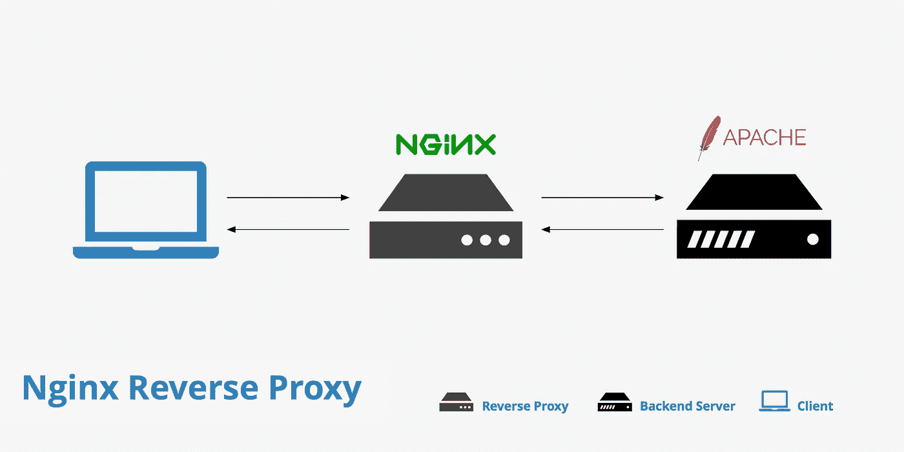
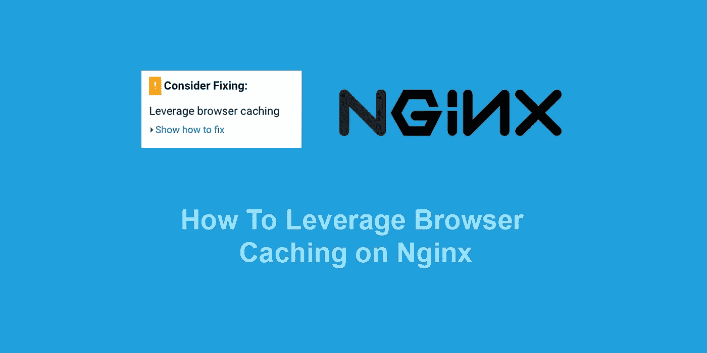

# 初学者的 9 个最佳 NGINX 教程[2023 年 3 月]——在线学习 NGINX

> 原文：<https://medium.com/quick-code/top-tutorials-to-learn-nginx-for-web-server-dc8638c48fae?source=collection_archive---------2----------------------->

## 2023 年用最好的 NGINX 初学者教程学习用于 web 服务器开发的 NGINX

由于某种原因，NGINX 是发展最快和最受欢迎的 web 服务器，所以理解它对任何从事 web 行业的人来说都是一项无价的技能，尤其是网络管理员和 web 开发人员。

NGINX 是顶级 HTTP 服务器之一，为大多数顶级企业网站提供支持，如网飞、Dropbox、WordPress、GitHub、Discovery 等。

## 1. [Nginx 基础:从零开始的高性能服务器](https://coursesity.com/r/site/nginx-fundamentals:-high-performance-servers-from-scratch)

在本课程中，学习如何从头开始安装和配置 Nginx web 服务器。学习创建定制的 Nginx 网络服务器，定制你的 Nginx 安装，保护和优化你的服务器，在你的简历中添加一个无价的技能，可验证的结业证书。

本课程将提供一个非常实用和简洁的学习 NGINX 的方法，并给你一个坚实的基础，立即开始创建安全的，高性能的 web 服务器。

学习安装、配置和调整 NGINX，从头开始创建安全、高性能的 web 服务器。通过这门适合初学者和更有经验者的实用课程，为 NGINX 打下坚实的基础。学习定制 NGINX 安装将 NGINX 配置为 web 服务器安装&将服务器端编程语言配置为 NGINX 后端学习调整 NGINX 以获得最佳性能使用一些安全最佳实践保护 NGINX。

本课程旨在教授对 NGINX 的基本理解，适合对网络和 linux 命令行界面有基本了解的任何人。

本课程首先为有 Apache 经验的人介绍 NGINX 和 Apache 之间的区别，然后解释安装 NGINX、定制安装以及将 NGINX 配置为服务的不同方式。安装部分还包括在不停机的情况下更新 NGINX 和添加/删除模块。

课程的重点是将 NGINX 配置为 web 服务器，包括将其连接到 PHP 后端，以及配置 NGINX 的一些最佳功能，如 Gzipping 和 GeoIP。最后一节将介绍通过 SSL 和其他安全最佳实践来保护服务器和用户的安全。

## 2.[学习 NGINX](https://linkedin-learning.pxf.io/c/1137078/646189/8005?u=https%3A%2F%2Fwww.linkedin.com%2Flearning%2Flearning-nginx&subId1=quickcode)

使用行业标准的开源 web 服务器 NGINX 建立高性能架构。

在本课程中，您将学习如何:

*   在 Linux 机器上安装和配置 NGINX。
*   为完整的 LEMP web 开发栈设置您需要的其余部分。

这个初级 LinkedIn 学习培训课程向您展示了如何在 Linux 机器上安装和配置 NGINX，并为完整的 LEMP web 开发栈设置您需要的其余部分。

本课程还探讨了 NGINX 的安全特性，如密码认证、HTTPS 和 SSL 证书，以及它作为反向代理和负载平衡器的能力。

## 3.[实用 Nginx 零至英雄指南](https://www.eduonix.com/courses/Software-Development/practical-nginx-the-zero-to-hero-guide/UHJvZHVjdC0zMjMyMDA=)

在这个 NGINX 初学者培训教程中，学习如何安装、设置和配置 NGINX web 服务器和反向代理。

这一综合课程由行业专业人士设计，包括实践和理论的正确结合，帮助您不仅掌握理论基础，还包括大量的实践例子，学习者可以跟随教师。本课程结束时，您不仅将了解 web 服务器、NGINX 和 Apache 服务器，还将能够从头到尾成功配置、设置和部署 web 服务器。

本课程不要求你对设置 web 服务器有任何概念，但是它假设你对 web 和 HTTP 协议有基本的了解，并且要求你了解 Centos 和 Debian Linux 发行版。

该课程将首先简要介绍 web 服务器和 NGINX 的适用范围，以及 Apache 和 NGINX 之间的详细区别。从这里，您将学习安装和部署 NGINX 服务器的不同方法。以下部分将包括设置 web 服务器所需的一切，包括不同的指令、模块、配置过程等。

您还将了解 LEMP 堆栈、如何监控 web 服务器、安全性和集成 SSL 配置和证书、如何从 Apache 迁移到 NGINX，包括充分利用 web 服务器的提示和技巧，以及与服务器技术相关的最常见问题。

在本课程中，您将学到:

*   对 webservers 和 NGINX 的详细介绍，什么是 HTTP 协议，为什么应该安装 NGINX，以及 Apache 与 NGINX 的比较
*   安装 NGINX 的不同方式
*   指令、配置文件、上下文类型和变量
*   不同的模块，包括核心、事件、HTTP 和可选
*   NGINX 工作原理的分解
*   如何在 web 服务器上部署网站
*   LEMP 堆栈包括安装、配置和部署应用程序
*   如何监控您的 web 服务器的错误
*   集成安全性和 SSL 认证
*   从 Apache 迁移到 NGINX
*   关于服务器的最佳提示和技巧、故障排除步骤、常见错误和常见问题
*   你想掌握这台高性能的 web 服务器吗？现在注册，让我们开始吧。

## 4.[完美的 NGINX 服务器— CentOS 版](https://coursesity.com/course-detail/the-perfect-nginx-server-centos-edition)

使用 NGINX 建立多个速度惊人的 WordPress 站点的绝对初学者 CentOS 课程。

在本课程中，您将学习如何:

*   从头开始设置一个基于 CentOS 的安全、加固和优化的虚拟专用服务器。
*   从任何主机购买不受管理的 VPS，并具备正确设置 VPS 的知识，最重要的是安全设置。
*   使用 NGINX，在一个基于 CentOS 的服务器上托管和服务多个 WordPress 站点。
*   安装，保护和优化 NGINX，MariaDB 和 PHP。
*   使用 WordPress 命令行界面在几秒钟内安装一个 WordPress 站点。
*   正确保护和优化 WordPress 站点。
*   在一台服务器上安装多个 WordPress 站点。
*   免费安装让我们加密 SSL 证书，并为服务器上托管的所有网站配置 SSL 证书的自动续订。
*   创建一个网站备份解决方案来备份您的网站-插件免费。

本课程涵盖了配置基于 CentOS 的 NGINX 服务器的全部内容。它将涵盖从初始服务器配置到安装 NGINX、MariaDB 和 php7.4 的所有内容。

它将配置，保护和优化 Nginx，安装，保护和优化 WordPress，最后安装让我们加密 SSL 证书和无插件备份。

本课程结束时，你将准备好收获收益。作为一名网络开发人员，你的简历中将会增加许多新的服务。

您将能够对众多新服务收费——网站托管、网站优化、SSL 证书安装和更新、备份，甚至每月维护费。

## 5. [NGINX 初学者:1 小时内学会 NGINX 服务器设置](https://click.linksynergy.com/deeplink?id=Fh5UMknfYAU&mid=39197&u1=quickcode&murl=https%3A%2F%2Fwww.udemy.com%2Fnginxforbeginners%2F)

了解如何在一个小时内设置一个 NGINX 服务器。了解如何从头开始安装定制的 NGINX web 服务器，如何定制您的 NGINX 安装，如何创建负载平衡、反向代理、零成本缓存等复杂环境。用你新的 NGINX 管理技能为自己的晋升做好准备。

本课程由经验丰富的系统管理员一步步介绍如何从头开始安装和配置 Nginx web 服务器。

了解如何在 WordPress、MySQL server 等平台上安装和配置 NGINX、NGINX 服务管理、二进制、NGINX——这些都将一步一步地介绍。本课程将让您对 NGINX 有一个坚实的理论理解，以及在工作中熟练使用它的实践技能。

## 6.[使用 Nginx 在 AWS 云上安装 Odoo11 的完整指南](https://click.linksynergy.com/deeplink?id=Fh5UMknfYAU&mid=39197&u1=quickcode&murl=https%3A%2F%2Fwww.udemy.com%2Fthe-complete-guide-to-install-odoo11-on-aws-cloud-with-nginx%2F)

了解在 AWS EC2 自由层服务器上运行 Odoo 的最简单方法。Nginx 安装分步指南。学习 Odoo 11 这样的 ERP 平台的安装流程。了解亚马逊网络服务 EC2 计算。免费在 AWS cloud 上创建和配置 Ubuntu 服务器。将弹性 IP 分配给 AWS 实例以进行实例重新映射。使用 Putty for Windows 用户连接到 AWS。使用 Mac 用户终端连接到 AWS。安装和配置代理服务器，如 Nginx。使用特定域名访问 Odoo。使用 Filezilla FTP 客户端连接到 AWS 服务器

本课程将帮助您开始学习 Amazon EC2 计算。让我们利用亚马逊的免费轮胎服务，在单服务器环境下，在最新的 Ubuntu Server 16.04 上部署 Odoo。

本课程为您提供了两种安装方法。使用我们的分步安装方法了解所有安装步骤，或者使用几分钟内提供的安装脚本快速安装您的 odoo。

还可以学习 Nginx 的安装和配置，使用您选择的域名访问您安装的 Odoo，并为您的企业或客户的企业获得自己的 ERP 解决方案。

## 7.[完美的 Nginx 服务器— Ubuntu 版](https://click.linksynergy.com/deeplink?id=Fh5UMknfYAU&mid=39197&u1=quickcode&murl=https%3A%2F%2Fwww.udemy.com%2Fcourse%2Fthe-perfect-nginx-server-ubuntu-edition%2F)

使用 Nginx 建立多个极速 WordPress 站点的绝对初学者课程

在本课程中，您将学习:

*   从头开始设置安全、加固和优化的虚拟专用服务器。
*   使用 nginx 配置一个安全和优化的服务器并托管多个 WordPress 站点。
*   给你的简历增加一项新技能。
*   通过向客户提供新的、有需求的服务来增加新的收入来源。

本课程涵盖了配置基于 Ubuntu 的 NGINX 服务器的全部内容。您将涵盖从初始服务器配置到安装 NGINX、MariaDB 和 php7.x 的所有内容。

一旦安装，你将配置，保护和优化 nginx，MariaDB 和 php7.x。你创建的 WordPress 网站也需要安装，保护和优化。

然后，您将继续安装 SSL 证书和无插件备份。

## 8. [Nginx 2018 —从初级到高级](https://click.linksynergy.com/deeplink?id=Fh5UMknfYAU&mid=39197&u1=quickcode&murl=https%3A%2F%2Fwww.udemy.com%2Fnginx-beginner-to-advanced%2F)

初学者指南，掌握 HTTP 协议和 NGINX

这是第一个专门为想掌握 NGINX 的初学者设计的课程。NGINX 不仅仅是一个 HTTP 服务器，还可以充当反向代理、负载平衡器。

本课程涵盖:

*   对 HTTP 协议有深入的了解。
*   可以设置自己的反向代理网站
*   具有负载平衡器的坚实基础，并且知道如何实际实现它们。
*   配置 Web 应用程序防火墙

掌握 NGINX 意味着对 HTTP 协议有扎实的基础。因此，本课程首先关注 HTTP 协议，然后转向 NGINX，并在高性能企业环境中使用 NGINX。

## 9.[通过实例学习 NGINX](https://click.linksynergy.com/deeplink?id=Fh5UMknfYAU&mid=39197&u1=quickcode&murl=https%3A%2F%2Fwww.udemy.com%2Fcourse%2Flearn-nginx-by-example%2F)

通过构建一个典型的 web 应用程序环境来学习 NGINX

在本课程中，您将学习:

*   NGINX 是什么。
*   设置一个基本的 Linux NGINX Web 服务器来服务静态网页。
*   设置基本的 Windows NGINX Web 服务器以提供静态网页服务。
*   设置 NGINX 到另一个服务器或端口的代理连接。
*   设置 NGINX 来平衡网站的负载。
*   在 NGINX 上启用缓存来提高站点性能。
*   使用加密生成证书。
*   在 NGINX 上设置 HTTPS

本课程将从头开始，向您介绍 NGINX 是什么。然后，您将讨论一个真实的项目，以及我们如何使用 NGINX 来设置您的网站，使其可扩展以适应不断增加的流量负载。

然后，您将浏览并构建我们的服务器来托管我们的网页，并使用 NGINX 对它们进行负载平衡。

最后，您将在我们的网站上启用缓存以提高网站性能，然后我们将使用加密和 HTTPS 来保护我们的网站。

> 感谢您阅读本文。我们策划了更多主题的顶级教程，您可能想看看:

 [## 10+最佳 AWS 培训在线课程—为 AWS 认证做准备

### 用 2022 年最好的新手 AWS 培训课程为开发者准备 AWS 认证。

medium.com](/quick-code/top-tutorials-to-prepare-for-aws-certification-exams-e991c55b54b0)  [## 初学者的 15 个最佳 Web 开发教程——在线学习 Web 开发

### 用 2022 年最好的新手网页开发教程学习网页开发

medium.com](/quick-code/top-tutorials-to-learn-web-development-for-beginners-4023595ebaa0)  [## 初学者的 10 个最佳 Selenium 教程——在线学习 Selenium

### 学习 Selenium，成为更好的测试开发人员和质量工程师，为初学者提供最好的 Selenium 教程

medium.com](/quick-code/top-tutorials-to-learn-selenium-for-beginners-4e1f301585) 

***披露:*** *如果您通过本页面的链接购买课程，我们可能会获得一小笔代销商佣金。谢谢你。*