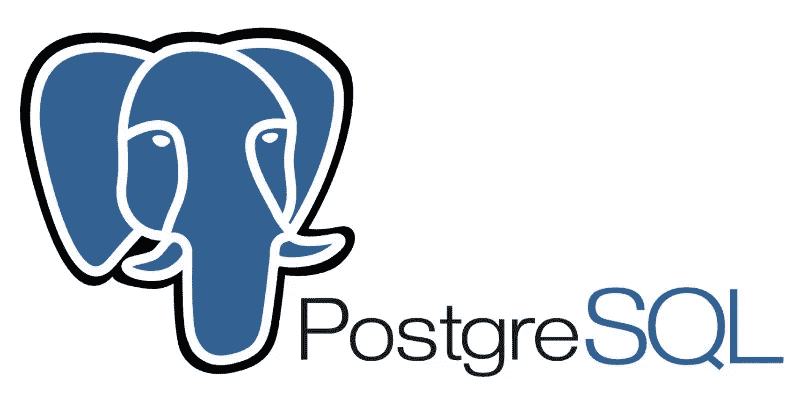
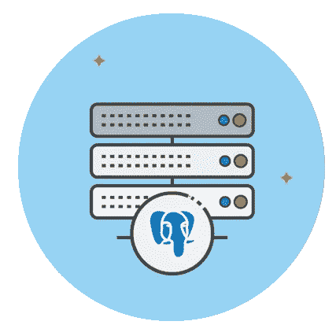

# 10 个最佳 PostgreSQL 初学者教程[2023 年 3 月]—在线学习 PostgreSQL

> 原文：<https://medium.com/quick-code/top-tutorials-to-learn-postgresql-database-for-beginners-99ff0deb9f84?source=collection_archive---------0----------------------->

## 学习 PostgreSQL，学习健壮的数据库管理系统，2023 年最佳 PostgreSQL 初学者教程。

许多大大小小的技术公司都在使用 Python 和 SQL。这是因为它们功能强大，但极其灵活。Python 在行业中用于嵌入式软件、web 开发、桌面应用程序，甚至移动应用程序。PostgreSQL 通过轻松存储、检索和过滤大型数据集，使您的应用程序变得更加强大。

> 披露:我们与本文中提到的一些资源有关联。如果你通过本页的链接购买课程，我们可能会得到一小笔佣金。谢谢你。

PostgreSQL 可以说是最先进和最强大的开源企业级关系数据库系统。它是对象关系数据库系统，为数据库设计者提供了最符合标准的系统。它提供了对可靠事务的完全支持，即(ACID complaint ),其中 ACID 代表原子性、一致性、隔离性和持久性。

它先进的底层技术使它非常强大和可编程。对并发性支持是它的关键特性之一。这是您将学习的最重要的技术之一，并将极大地影响您使用数据库的方式。这是一个终极的 RDBM 系统，它允许你创建复杂的网络应用程序，即使对于大量用户来说也能完美运行。

PostgreSQL 是发展最快的 RDBMS，拥有一个庞大而繁荣的社区，学习这项令人惊叹的技术是一笔巨大的财富。

## 1.[完整的 Python & PostgreSQL 开发者课程](https://coursesity.com/r/site/the-complete-python/postgresql-course-2.0)

构建 9 个项目——掌握 Python 和 PostgreSQL 两项基本的现代技术。

本课程是您学习 Python 和 PostgreSQL 的一站式商店，讲师会随时支持您的学习并回答您的问题。

## 2. [PostgreSQL 基础训练](https://linkedin-learning.pxf.io/c/1137078/646189/8005?u=https%3A%2F%2Fwww.linkedin.com%2Flearning%2Fpostgresql-essential-training&subId1=quickcode)

在本课程中，您将学习如何启动和运行 PostgreSQL。它涵盖了设置 PostgreSQL 服务器和使用图形界面 pgAdmin 的基本步骤。

在本课程中，您将学习:

*   PostgreSQL 的基础知识。
*   设置 PostgreSQL 服务器的首要步骤。
*   使用图形界面的基本第一步。

然后展示了如何使用 pgAdmin 创建新的数据库对象，用数据填充它们，并从数据库中检索记录。

如果您是该平台(或一般关系数据库)的新手，本课程将作为一个切入点，并为进一步探索数据库管理提供一个坚实的基础。

## 3.[从 PostgreSQL 查询数据](https://pluralsight.pxf.io/c/1137078/424552/7490?u=https%3A%2F%2Fwww.pluralsight.com%2Fcourses%2Fquerying-data-postgresql&subId1=quickcode)

在本课程中，您将学习如何使用 PostgreSQL 编写从数据库中检索信息的查询。使用 SQL，您将学习如何选择您需要的数据、过滤数据以及从各种表中收集数据。

在本课程中，您将学习如何:

*   使用 PostgreSQL 创作从数据库中检索信息的查询。
*   选择您需要的数据，过滤该数据，并从各种表中收集数据。
*   使用 PostgreSQL 及其 pgAdmin 工具查询数据。

您将全面了解如何使用 PostgreSQL 及其 pgAdmin 工具查询数据。首先，您将学习关系数据库的基本结构。

接下来，您将了解如何从表中选择数据，应用条件和过滤器来限制结果，并通过从多个表中检索数据来增强这些技能。

最后，您将探索基本的聚合函数，并接触 ANSI 兼容的 SQL。完成本课程后，您将掌握从关系数据库中轻松检索数据所需的 PostgreSQL 技能和知识。

## 4.[SQL 和 PostgreSQL 初学者指南](https://click.linksynergy.com/deeplink?id=Fh5UMknfYAU&mid=39197&u1=quickcode&murl=https%3A%2F%2Fwww.udemy.com%2Fsql-the-beginners-guide%2F)

通过使用 PostgreSQL 创建数据库和编写 SQL 查询来掌握 SQL 和 PostgreSQL。

SQL 是许多行业最受欢迎的技术技能之一，因此学习 SQL 是促进职业发展的最佳方式之一。学完本课程后，你将能够轻松地将 SQL 和 PostgreSQL 放在简历中。

PostgreSQL 是世界上最流行和使用最广泛的数据库系统之一。使用 PostgreSQL 的公司包括苹果、思科、富士通、Skype 和 IMDb。

您将学习如何:

*   使用 SQL SELECT 查询从数据库表中检索数据。
*   使用 SQL 中的 WHERE 子句过滤数据。
*   订购您的 SQL 查询。
*   限制 SQL 查询返回的行数。
*   使用 SQL 连接从多个表中检索数据。
*   使用 SQL 聚合函数和分组数据。
*   使用 SQL 创建、更改和删除数据库和表。
*   使用 SQL 从表中插入、更新和删除数据。

## 5. [SQL &数据库设计 A-Z:学习 MS SQL Server + PostgreSQL](https://click.linksynergy.com/deeplink?id=Fh5UMknfYAU&mid=39197&u1=quickcode&murl=https%3A%2F%2Fwww.udemy.com%2Fsqldatabases%2F)

在实践中学习 SQL Server 和 PostgreSQL。通过真实世界的数据科学练习提升您的数据分析职业生涯。

SQL 代表结构化查询语言，它是用来组织数据库、向数据库输入数据以及根据请求提取数据的主要工具之一。

在本课程中，您将学习如何在一种流行的 SQL 变体 PostgreSQL 中创建查询。

即使您在工作场所使用的是不同的版本(例如 Oracle、SQL Server 或 MySQL)，您也会发现您在本课程中学到的技能很容易转移。

本课程的独特优势在于，除了学习 SQL，您还将掌握数据库设计的概念。

它将涵盖以下主题:

- OLAP 与 OLTP 数据库(在线分析处理和在线事务处理):您将确切理解这两种类型的数据库的设计如何以及为什么不同

*   数据库的规范化:我们将向您展示规范化背后的理论，并一起练习如何一步一步地规范化数据库

## 6.[用 PostgreSQL 组合和过滤数据](https://pluralsight.pxf.io/c/1137078/424552/7490?u=https%3A%2F%2Fwww.pluralsight.com%2Fcourses%2Fcombining-filtering-data-postgresql&subId1=quickcode)

本课程将教你如何使用 PostgreSQL 扩展你的查询来过滤和组合数据。使用 SQL，您将学习如何连接多个表中的数据，组合结果集，以及使用聚合和窗口函数。

在本课程中，您将学习如何:

*   扩展您的查询以检索附加数据并获得您想要的结果。
*   使用联接从多个表中检索数据。
*   划分和分析数据。

首先，您将学习数据类型的基础知识以及如何使用字符串函数。接下来，您将了解聚合函数以及如何过滤聚合结果。

然后，您将探索如何使用连接从多个表中检索数据。集合论和联合也将用于组合多个结果集。

引入子查询和公共表表达式有助于使用多个过滤标准进行更复杂的分析。

最后，您将了解窗口功能以及如何划分和分析数据。学完本课程后，您将具备必要的 PostgreSQL 技能和知识，可以开始编写更复杂的查询来分析来自多个来源的数据。

## 7.[使用 PostgreSQL 学习数据库设计](https://coursesity.com/course-detail/learn-database-design-using-postgresql)

掌握世界最先进开源数据库的终极指南。

我们的课程将以最简单的方式教你这个复杂的系统。它将从 RDBMS 系统的基本介绍开始，重点是 PostgreSQL。我们还将讨论 MySQL 和 PostGreSQL 这两种最流行的开源 RDBMS 之间的主要区别。本课程结束时，您将能够…

在项目中使用 PostgreSQL

理解 Postgres 的重要特征

理解对象关系模型

可以跨数据库系统使用的主 SQL

使用 PostgreSQL 构建实际的 web 应用程序

因此，跳上车，成为最热门的 RDBM 系统之一的主人

## 8.[PostgreSQL 初学者指南](https://click.linksynergy.com/deeplink?id=Fh5UMknfYAU&mid=39197&u1=quickcode&murl=https%3A%2F%2Fwww.udemy.com%2Fbeginners-guide-to-postgresql%2F)

PostgreSQL 教程:开始使用 PostgreSQL 中的关系数据库需要了解的内容。

PostgreSQL 是一个非常棒的开源关系数据库，速度快且易于使用。我们已经在我公司的几个大型项目中使用了它，并取得了很好的效果。

在这门初级 PostgreSQL 教程中，我将回顾关系数据库的所有基本概念，并深入探讨如何使用 PostgreSQL。本 PostgreSQL 教程不需要以前的数据库经验，所有基本概念如表和关系都包括在内。这是彻底的，旨在帮助任何人开始与数据库。

PostgreSQL 教程课程涵盖数据库概念、数据库安装和连接、用于连接和管理数据库的客户端软件(pgAdminIII)，以及主要的 SQL 语句及其如何与 PostgreSQL 配合使用。

## 9. [PostgreSQL:高级 SQL 查询和数据分析](https://click.linksynergy.com/deeplink?id=Fh5UMknfYAU&mid=39197&u1=quickcode&murl=https%3A%2F%2Fwww.udemy.com%2Fpostgresql-advanced-sql-queries-and-data-analysis%2F)

学习实用的高级 PostgreSQL 查询和数据分析。

PostgreSQL 俗称 Postgres，也是一个开源数据库。数据科学家和分析师越来越需要了解关系数据存储。组织长期以来一直使用 SQL 数据库来存储事务数据以及与商业智能相关的数据。如果您需要使用 SQL 数据库，本课程旨在帮助您学习如何执行常见的关系数据库和数据科学任务，包括在关系数据库中编写高级查询、数据分析、查找、探索和提取。

您将学习的内容包括:【PostgreSQL 触发器介绍，创建触发器，管理触发器，视图介绍，如何创建视图，修改和删除视图，可更新视图介绍，创建可更新视图，物化视图介绍，创建物化视图，存储过程介绍，聚合函数介绍，说明各种类型的聚合函数，分析函数介绍，说明各种分析函数，行号函数，使用各种类型的运算符，表连接介绍，使用各种类型的连接， 用于处理有序数据集、安装 Postgresql、验证 Postgresql 安装、Postgresql 内部联接、Postgres LIKE 运算符、Postgresql OR 运算符、服务器服务、序列、模式、从表中检索所有数据、加载示例数据库、Postgresql UNION 运算符、PostgreSQL UNION ALL 运算符、PostgreSQL 完全外部联接、PostgreSQL 交叉联接、PostgreSQL 组合 AND | OR 运算符、PostgreSQL AND 运算符、PostgreSQL 自然联接运算符、PostgreSQL EXCEPT 运算符、PostgreSQL INTERSECT

本课程将教您如何聚合数据、分析数据、使用表连接从多个表中检索数据，以及编写更高级的查询。

## 10.[从头开始学习 PostgreSQL 中的分区](https://click.linksynergy.com/deeplink?id=Fh5UMknfYAU&mid=39197&u1=quickcode&murl=https%3A%2F%2Fwww.udemy.com%2Flearn-partitioning-in-postgresql-from-scratch%2F)

在 PostgreSQL ( Postgres)数据库中设计和实现分区的指南。

学习使用 PostgreSQL 数据库构建全功能分区表所需的关键术语、基本概念和实现技术。每一个概念或主题都包含了一个实践演示环节，并配有英文字幕，以提供更好的清晰度。

在 RDBMS 中处理大量数据/大表

在数据领域有大量的机会，能够学习和理解通过 RDBMS 中的分区处理数据量的重要性，将使您有信心应对在实时项目中遇到的挑战。

内容和概述

*   了解分区的内容、时间和方式。
*   获得在生产系统中实现分区的信心
*   知道如何在分区表上编写优化的查询
*   能够处理与分区相关的维护任务
*   了解如何自动化所有与分区相关的任务

您可以通过参加测验来测试在课程中获得的知识，课程中提到的每个使用案例都有演示课程进行解释，从而使您能够练习新学到的技能。

您也可以下载演示过程中使用的源代码文件，以便在您的终端进行练习。源代码文件可以从最后一节“参考资料”中下载。

完成本课程的学员将获得在项目中实现全功能和自动化分区解决方案的知识和信心。

> 感谢您阅读本文。我们策划了更多主题的顶级教程，您可能想看看:

 [## 10+最佳 MongoDB 初学者教程—在线学习 MongoDB

### 用 2022 年最好的 MongoDB 初学者教程学习 MongoDB，实现高效的数据库管理

medium.com](/quick-code/top-tutorials-to-learn-mongo-db-f1e52bee7445)  [## 10+最佳 Hadoop 初学者教程—在线学习 Hadoop

### 2022 年学习 Hadoop 存储和处理大型数据集的最佳 Hadoop 初学者教程

medium.com](/quick-code/top-tutorials-to-learn-hadoop-for-big-data-3fa31f399063)  [## 初学者的 8 个最佳 Cassandra 教程——在线学习 Cassandra

### 用 2022 年最好的 Cassandra 初学者教程学习数据库管理的 Cassandra

medium.com](/quick-code/top-tutorials-to-learn-cassandra-for-beginners-bbc03ea3e676) 

> **更新**:我们创建了最新版本的[顶级 PostgreSQL 教程](http://blog.coursesity.com/best-postgresql-tutorials/?utm_source=botsfloor&utm_medium=referral&utm_campaign=mediumPost&utm_term=learn-PostgreSQL)。请随意查看年度最佳 PostgreSQL 教程。

披露:我们与本文中提到的一些资源有关联。如果你通过本页的链接购买课程，我们可能会得到一小笔佣金。谢谢你。