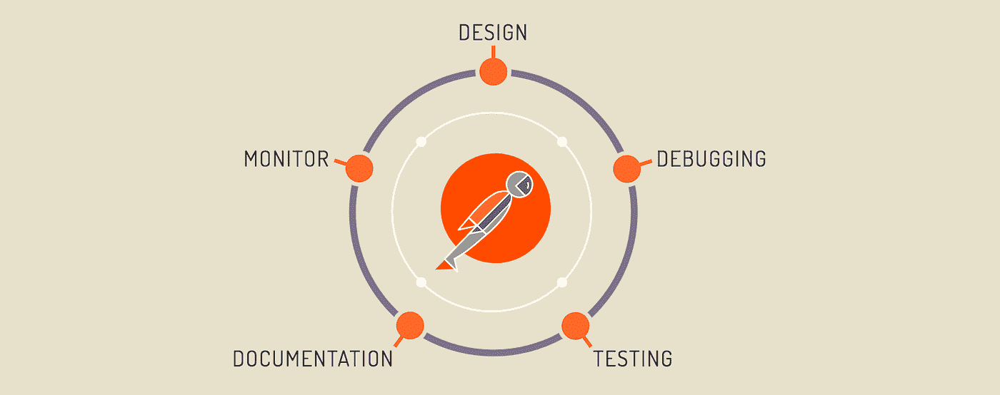

# 初学者的 9 个最佳 Postman 教程[2023 年 3 月]—在线学习 Postman API 测试

> 原文：<https://medium.com/quick-code/top-tutorials-to-learn-postman-for-rest-api-testing-3bdf9788e0ba?source=collection_archive---------0----------------------->

## 用 2023 年最好的 Postman 初学者教程学习 Postman 进行 RESTful API 测试

如今，RESTful apis 无处不在，但与此同时，它们开始变得越来越复杂:不同的 HTTP 方法、头、cookies、处理文件上传或使用 API 密钥、令牌、OAuth 等进行认证。这就是邮差 App 的用武之地！Postman 允许您使用所需的 HTTP 方法和参数快速创建请求，提交请求并轻松检查结果。

# 1. [POSTMAN API 测试—初学者循序渐进](https://click.linksynergy.com/deeplink?id=Fh5UMknfYAU&mid=39197&u1=quickcode&murl=https%3A%2F%2Fwww.udemy.com%2Fpostman-api-testing-step-by-step-for-beginners%2F)

在这个课程中，从零开始学习邮递员。和邮递员一起工作。了解邮递员的所有特征和工作。用 POSTMAN 创建 API 测试解决方案。从命令行和 Jenkins 运行。

在本课程中，您将学习什么是 POSTMAN 如何下载和安装了解 Postman GUI 创建集合、变量、环境和测试数据驱动测试从命令行和 Jenkins 运行

这门课程是为完全的初学者设计的。《邮差》一步一步入门。非常基本的一步一步的视频来指导你从零开始。

# 2.[邮递员必备培训](https://linkedin-learning.pxf.io/c/1137078/646189/8005?u=https%3A%2F%2Fwww.linkedin.com%2Flearning%2Fpostman-essential-training&subId1=quickcode)

对于负责 API 测试的测试人员和开发人员来说，Postman 是一个受欢迎的免费解决方案。它为编写测试用例提供了丰富的接口，并为自动化提供了特性，例如重用测试和将集合集成到像 Jenkins 这样的 CI 构建系统中的能力。

该课程包括:

*   邮递员入门
*   简单的邮递员断言
*   高级邮递员断言
*   运行测试集合
*   自动化您的收藏

本课程介绍了用 Postman 编写、运行和自动化 API 测试的过程。

您将学习如何创建完整的测试集合；创建简单和高级的断言，包括嵌套的 JSON 断言；使用内置的集合运行器和命令行运行器 Newman 运行集合；并在 Jenkins 项目中配置自动运行。

# 3.[邮递员基础](https://pluralsight.pxf.io/c/1137078/424552/7490?u=https%3A%2F%2Fwww.pluralsight.com%2Fcourses%2Fpostman-fundamentals&subId1=quickcode)

全世界有超过 300 万开发人员在使用 Postman。本课程将向你展示 Postman 的基本原理，你如何发出请求，创建自动化的 API 测试，甚至用 Postman 编写你的 API 文档。

该课程包括:

*   搭建舞台
*   邮递员基础知识
*   测试请求
*   收集
*   模拟服务器
*   证明文件
*   团队工具

在 Postman 基础中，您将学习 Postman 如何帮助简化 API 的工作。它允许您使用变量，这样无论是在测试环境还是阶段环境中，相同的请求都可以工作。

您还将学习如何创建自动化的 API 测试，从而确保您的 API 不会在不同版本之间中断。

您甚至会看到 Postman 如何简化 API 的文档编写，这样您的用户就可以对 API 的功能有一个最新的解释。

本课程结束时，您将了解 Postman 的来龙去脉，并能够最大限度地与 API 互动。

# 4. [Postman:完全指南— REST API 测试](https://click.linksynergy.com/deeplink?id=Fh5UMknfYAU&mid=39197&u1=quickcode&murl=https%3A%2F%2Fwww.udemy.com%2Fpostman-the-complete-guide%2F)

学习 Postman 进行手动和自动 REST / RESTful API 测试。使用 Newman、Jenkins 或任何其他 CI 工具实现自动化。

从简单的请求开始，向更复杂的场景前进，学习处理身份验证、授权机制，如基本身份验证、API 密钥或 OAuth。开始编写 API 测试在集合中组织测试并与您的团队共享在 Jenkins 或任何其他 CI 服务器中运行 API 测试

在本课程中，您将:

*   使用邮递员应用程序
*   使用 Postman 提交 RESTful 请求
*   使用 JavaScript 编写 API 测试
*   自动化测试执行

本课程将开始探索 Postman 的特性，并继续编写 API 测试，目的是将它们集成到 CI 服务器中，测试将在当前的基础上运行。

# 5. [REST API 测试，自动化使用 POSTMAN](https://click.linksynergy.com/deeplink?id=Fh5UMknfYAU&mid=39197&u1=quickcode&murl=https%3A%2F%2Fwww.udemy.com%2Frest-api-testing-automation-using-postman%2F)

了解 POSTMAN REST 客户端的许多特性，用于测试 Restful API、文件上传和数据驱动测试。

在本课程中，您将学习，

*   通过设置代理捕获网络流量
*   了解如何进行多部分文件上传
*   执行数据驱动测试(点击一个按钮，创建 1000 名学生)
*   了解如何使用 Postman 发送 SOAP 请求
*   整合邮递员与纽曼和詹金斯
*   不同类型的身份验证(基本、OAuth 1.0、OAuth 2.0)
*   在 Postman 中编写脚本

在本课程中，您将通过实例了解 Postman 工具的许多功能。无论你是在开发 API 还是在测试它们，本课程都将为你提供理解 Postman 提供的丰富特性所需的所有例子。

# 6.[用 Postman 测试 RESTful API](https://click.linksynergy.com/deeplink?id=Fh5UMknfYAU&mid=39197&u1=quickcode&murl=https%3A%2F%2Fwww.udemy.com%2Frestful-api-testing-with-postman%2F)

本课程将从展示邮递员的概况开始。然后将讨论发送 API 请求和响应。它将展示如何将 API 管理成集合并与任何人共享。然后它将涵盖变量、环境&如何编写测试脚本。它还将向您展示如何结合所有这些工具& collection runner 来自动化您的测试。最后一个主题将向您展示一个完整的 Twitter API 测试工作流程。

在本课程中，从软件开发人员、测试人员和开发人员的 Postman 和 Newman 开始。用 Postman 测试 RESTful APIs。使用 Newman 从命令行测试 Postman 集合。

# 7.[使用 Postman 的 API 测试【功能】& Jmeter【性能】](https://click.linksynergy.com/deeplink?id=Fh5UMknfYAU&mid=39197&u1=quickcode&murl=https%3A%2F%2Fwww.udemy.com%2Frest-api-performance%2F)

本课程为深入理解 API 测试、JavaScript 中的 Postman 编码和使用 JMeter 的性能提供了基础。详细了解 REST API 测试的自动化。

在本课程中，您将通过实例了解 Postman 工具的许多功能。本课程讲授:使用集合组织请求，学习如何使用 Postman 发送 SOAP & REST 请求，执行数据驱动测试认证方法(basic，Oauth)，在 Postman 中编写脚本，将 Postman 与 Newman 集成。

# 8. [Postman: REST API 自动化测试 Javascript 脚本](https://click.linksynergy.com/deeplink?id=Fh5UMknfYAU&mid=39197&u1=quickcode&murl=https%3A%2F%2Fwww.udemy.com%2Ftesting-using-postman%2F)

在本课程中，您将通过实例了解 POSTMAN 工具的许多功能。本课程涵盖:

*   使用集合组织请求
*   了解如何使用 POSTMAN 发送 SOAP & REST 请求
*   执行数据驱动的测试认证方法(基本、OAUTH)
*   在 POSTMAN 中编写脚本
*   整合邮差和纽曼
*   邮递员基础到高级操作，脚本，集合，全局。
*   高级 JavaScript 基础版

# 9. [REST API 测试自动化:通过放心](https://click.linksynergy.com/deeplink?id=Fh5UMknfYAU&mid=39197&u1=quickcode&murl=https%3A%2F%2Fwww.udemy.com%2Fapi-testing-rest-api-automation-testing-from-scratch%2F)

本课程通过放心 Java、自动化测试框架、通过 Postman 的 API 测试来教授 API 自动化测试。本课程结束时，您将能够理解什么是 web 服务及其功能。

在这门课中-

*   准备设计 REST API 测试自动化框架
*   准备好面对 REST API 自动化面试了吗
*   您将理解如何为执行结果生成简洁的报告
*   精通 REST 测试工具，如 POSTMAN，REST 客户端等
*   您将能够使用放心的 API 设计和实现结构化的自动化框架
*   你将能够用 HTTP 客户端设计和实现结构化的自动化框架
*   您将能够使用 Jackson 库来处理 JSON

本课程涵盖了从基础到高级的放心、Postman、Java、TestNG、放心框架实现和 HTTP 客户端框架实现，并提供了丰富的示例。

在本课程结束时，你可以在 Net 上选择任何 REST API，并且可以轻松地自动完成所有必要的验证。

> **更新**:我们创建了最新版本的[顶级邮差教程](http://blog.coursesity.com/best-postman-tutorials/?utm_source=botsfloor&utm_medium=referral&utm_campaign=mediumPost&utm_term=learn-Postman)。请随意查看年度最佳邮递员教程。

> 感谢您阅读本文。我们策划了更多主题的顶级教程，您可能想看看:

 [## 面向初学者的 10+最佳 TypeScript 教程—在线学习 TypeScript

### 用 2021 年最适合初学者的 TypeScript 教程学习应用程序开发的 TypeScript

medium.com](/quick-code/top-tutorials-to-learn-typescript-c08834892e69)  [## 面向初学者的 8 个最佳 SoapUI 教程——在线学习 SoapUI

### 学习 SoapUI，用 2021 年最好的面向初学者的 SoapUI 教程创建 web 服务和 Rest APIs 的测试自动化

medium.com](/quick-code/top-tutorials-to-learn-soapui-for-rest-api-testing-1b3e14b1037e)  [## 初学者的 9 个最佳 Appium 教程——在线学习 Appium

### 学习 Appium，在 2021 年为初学者提供最佳 Appium 教程，以自动化 android、ios 和混合移动应用的移动应用测试

medium.com](/quick-code/top-tutorials-to-learn-appium-for-mobile-automation-testing-8b87ac3bfd69) 

披露:我们与本文中提到的一些资源有关联。如果你通过本页的链接购买课程，我们可能会得到一小笔佣金。谢谢你。